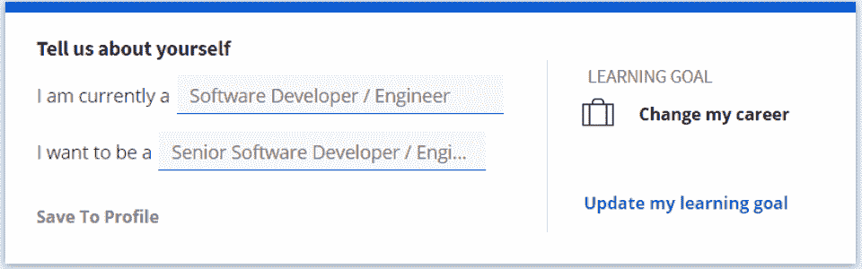
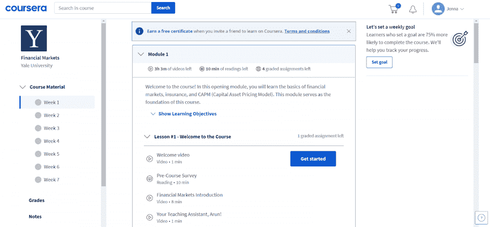
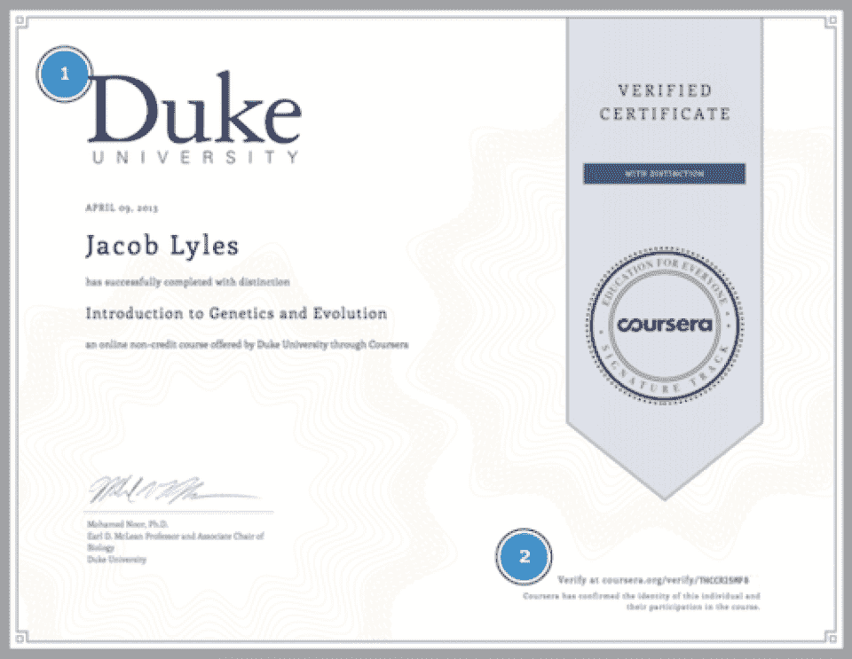
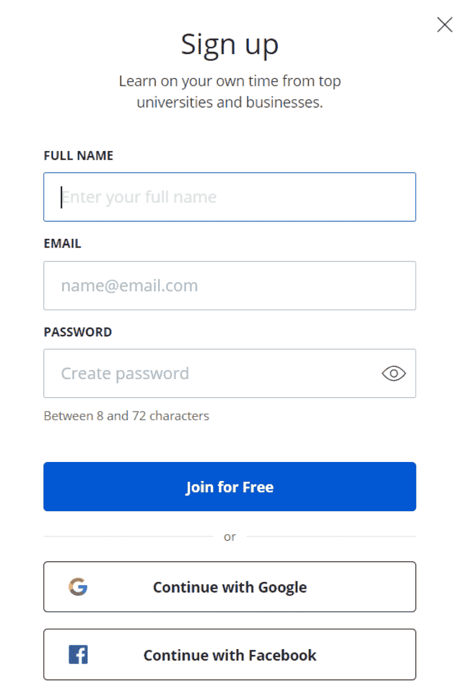
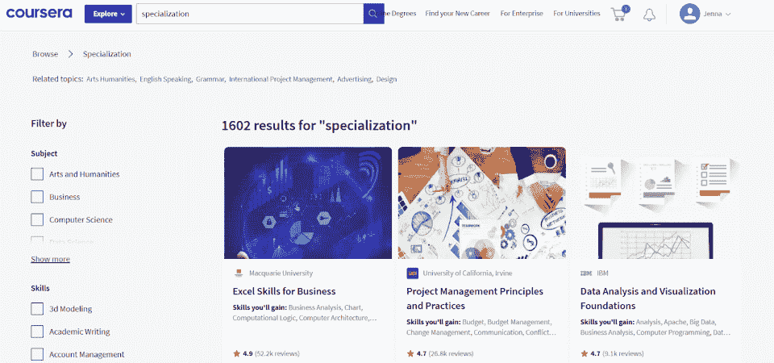
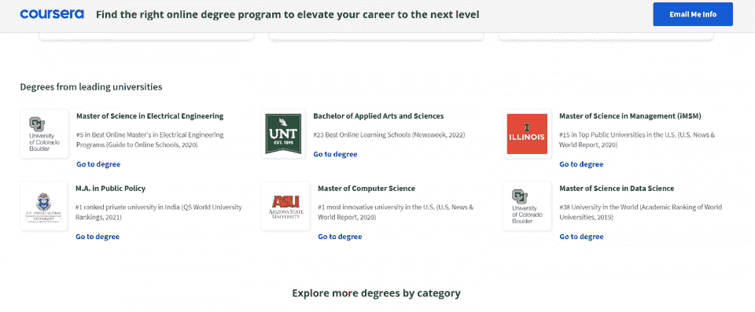
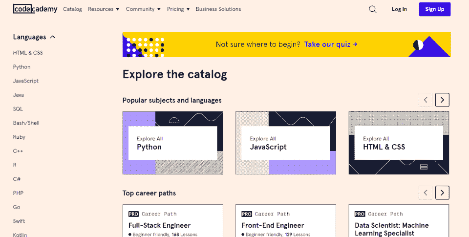
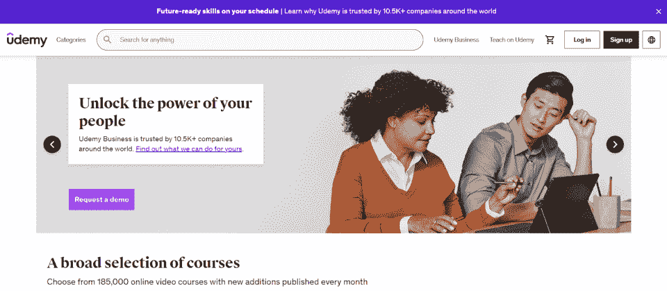

# Coursera Review 2023:优点、缺点和替代方案[推荐]

> 原文：<https://hackr.io/blog/coursera-review>

Coursera 是一个非凡的在线学习平台，有很多值得喜爱的地方；然而，个别课程的质量是不可预测的。为了获得最大价值，请注册专业化道路或可共享认证。

| **教官** | 4/5 |
| **课程** | 5/5 |
| **经历** | 3/5 |
| **总计** | 4/5 |

**一览:**

*   Coursera 提供了非常广泛的课程清单——从数字营销到项目管理，无所不包。
*   相当多的 Coursera 课程是由顶尖大学提供的。在计算机科学等领域甚至有完整的四年制学位课程。
*   学生必须自我激励并愿意学习——许多短期课程和证书课程几乎完全是自定进度的。
*   更喜欢教师指导的内容和同伴互动的学生可能会发现这种体验平淡无奇。

**那么，Coursera 值得吗？**

继续阅读完整的 Coursera 评论，我们将在其中讨论课程、教师、成本，甚至雇主的看法。

## Coursera 提供什么**？**

Coursera 提供超过 7000 门在线课程，涉及数据科学、在线营销和网络开发等学科。

每门课程的深度各不相同，从编程训练营到完成学位课程。Coursera 有四个学习类别:个人课程、专业、认证途径和学位课程。

**以下是 Coursera 在******:**提供的一些例子**

 **课程是涵盖特定主题或提供更广泛领域概述的个别课程。

专门化是连续类的集合，它让你对一个学科有更深入的了解。

认证是在完成时颁发证书的课程和专业，向雇主证明你理解所讨论的基本概念。通常，认证是知名企业(如 Google 和 IBM)提供的课程和专业。

最后，Coursera 的学位课程通过美国和国外的大学提供。这些大学有些是经过认证的，有些不是。

## **Coursera 是给谁的？**

Coursera 主要专注于 IT 和计算机科学，但这并不是全部。大多数 Coursera 的学生都希望加快他们的职业发展，要么通过学习新的职业，要么通过获得证书。

**Coursera 的核心学科类别有:**

*   数据科学
*   商业
*   计算机科学
*   信息技术
*   语言学习
*   健康
*   人的能力发展
*   物理科学与工程
*   社会科学
*   艺术和人文
*   数学和逻辑

因此，虽然 Coursera 主要专注于计算机科学和信息技术，但也有广泛的课程、认证和学位。如果你能在纯在线环境中学习，你可以通过 Coursera 学习。

## 【Coursera 是如何运作的？

Coursera 将用户连接到由企业、大学和其他教育实体提供的广泛的课程库。每门课程都有一名(或多名)讲师和一套教学大纲。

用户“注册”课程。虽然从技术上来说是自定进度的，但课程的开始和结束都是分阶段进行的。这种时间安排允许学习者与其他学生和他们的教师一起工作。

课程按周划分。虽然你可以跑在前面，但你也可以每周跟着跑。Coursera 会跟踪你的进度，但如果你落后了，你通常可以“重置”你的截止日期。

有些课程最后会提供可共享的证书，甚至是认可的学位。

你可以随时重启课程或证书，尽管学位更加结构化和严谨。但如果是高级课程，你需要继续为 Coursera Pro 订阅付费。

### **如何开设 Coursera 账户**

你可以注册 Coursera Pro 的 7 天免费试用，或者直接免费使用 Coursera。

注册一个帐户，立即访问 Coursera 的免费和高级课程。请记住，学位课程将需要一个单独的申请过程。您可以创建一个帐户，或者使用您的谷歌或脸书帐户登录。

一旦你创建了 Coursera 账户，你就可以“注册”每门课程。有些课程是免费的，有些课程有 7 天的免费试用期。

如果你注册了 Coursera Pro 课程，你需要输入付款信息，付款信息会自动更新。报个免费班，平台立马带你去找课程资料。

Coursera 课程材料由视频、互动测验、考试和练习项目组成。当你在做一个项目(比如一个顶石)时，你会经常上传它给讲师或者同行评审。

## **Coursera 免费吗？Coursera 的免费与“专业”课程**

Coursera 既有免费课程，也有“专业”课程。Coursera 提供的许多免费课程都是通过伦敦大学、加州大学伯克利分校和斯坦福大学等学校提供的。

**以下是 Coursera 在** [**计算机科学**](https://hackr.io/blog/best-computer-science-projects) **:** 的几门免费课程

但是有许多免费的编码训练营可以提供给那些想要深入研究计算机科学和编程的人。

Coursera 的专业课程费用不一。大多数 Coursera 课程都提供“高级”Coursera 会员资格——Coursera Plus。但是学位课程更贵。

| **会跑加**Coursera Plus 是 59 美元/月或者 399 美元/年。它提供超过 7，000 门课程和认证的无限制访问。Coursera Plus 不包含学位项目；学位项目从几千美元到几万美元不等。 |

财政援助可通过 Coursera 获得——财政援助是基于需求的，主要提供给专业证书。但是，你不能用联邦财政资助来上 Coursera 的课程，因为它们没有达到要求的标准。

## Coursera 课程:雇主会认真对待吗？

这是一个合理的问题。毕竟，Coursera 的课程是免费在线提供的，不授予传统的证书，比如实体学校的学位。但答案是，就像今天的许多事情一样:视情况而定。

今天的雇主明白，学习并不总是发生在教室里。特别是在信息技术领域，自学成才的人可以被认为和受过正规教育的人一样知识渊博。当然，证书证明你有特定的、通常是小众的知识——但课程可能没有。

如果你想更多地了解你职业或学科的某个特定方面，Coursera 课程是一个很好的开始。但如果你想让雇主认真对待它(为了升职或转行)，专业化或证书路径更有可能给人留下深刻印象。

## Coursera Specializations:你需要一个类还是一个专业？

专业是帮助你精通某一特定主题的一系列课程。专业化通常会在一个顶点项目中达到高潮，该项目允许您将学到的知识应用到现实世界的问题中。尽管一些雇主会支付费用，但它们往往比单独的课程更贵。

对于那些试图改变职业的人来说，专业化是最常见的建议。举个例子:如果你从事 IT 行业，但想进入数据科学领域，你可以选择数据科学专业。

另一方面，如果你想学习更多关于你当前领域的知识或者拓展你的技能，一门课程可能就是你所需要的。例如，如果你是一个想学习谷歌分析的营销人员，你可以参加谷歌分析初学者课程。

## **Coursera 证书:Coursera 证书值得吗？**

Coursera 的功能主要是作为一个市场。如上所述，课程、证书和学位项目的质量因组织而异。尽管如此，许多非常著名的企业通过 Coursera 提供证书。

**值得注意的认证项目包括:**

许多这些证书课程都包含在 Coursera 的 Pro 订阅中——如果你能在一个月内完成证书课程，那就非常值得。但是因为这些是自定进度的证书，所以你花的时间越长，它们就越不“值得”。

如果你获得了 IBM 技术支持专业证书，你的雇主只会看到你获得了 IBM 的证书，而不是 Coursera。

| **想赚更多的钱？**根据[美国消费者新闻与商业频道](https://www.cnbc.com/2021/01/30/professional-certifications-for-raises-better-jobs.html)的说法，这四种认证可以让你得到一份更好的工作:项目管理专家、项目管理助理认证、Scrum Master 认证和数字营销。 |

## Coursera 学位项目:你能获得在线学位吗？

Coursera 与实体学院和大学合作提供了一些学位项目。例如，有些是完全的在线计算机科学学位，授予与现场课程相同的证书。

注意，认证遵循的是学校和项目，而不是 Coursera 有些项目是经过认证的，有些则不是。

雇主会像对待传统大学学位一样认真对待 Coursera 学位。但是因为他们相对较新，如果你在这个领域有互补的经验，可能更容易找到工作。例如，如果你有工商管理学位，但想从事市场营销工作，在简历中加入相关实习经历会让过渡更顺利。

Coursera 学位课程可能很贵，尽管它们远没有实体大学贵。预计至少要为一个学位项目支付 10，000 美元以上。

## Coursera 上最受欢迎的课程

学生们在 Coursera 上到底学到了什么？根据学生注册情况，以下是一些最受欢迎的 Coursera 课程:

1.  [**谷歌 IT 支持专业证书**](https://imp.i384100.net/0J3VVV) **。**这个项目为你从事 IT 支持职业做准备。通过一系列视频讲座、测验和动手实验，您将了解故障排除、客户服务、网络和操作系统。用这个证书在 IT 服务台找一份工作。
2.  [**IBM 数据科学专业证书**](https://imp.i384100.net/oeWYk9) **。**该课程向您介绍数据科学，并教您如何将这些技能应用于现实世界的数据集。您将了解 Python、R、SQL 和 NoSQL 数据库。
3.  [**斯坦福大学的机器学习**](https://imp.i384100.net/doAYYK) **。**本课程将教你最有效的机器学习技术，以及如何将它们应用于现实世界的问题。
4.  [**Python 为大家带来了密歇根大学**](https://imp.i384100.net/jW4ox0) **。这门课程是为没有编程经验的人设计的。它将教你 Python 编程的[基础，这是快速原型制作和机器学习最流行的语言之一。](https://hackr.io/blog/python-programming-language)**
5.  [**数据科学:由约翰霍普金斯大学**](https://imp.i384100.net/ORJ77N) 使用 R 的基金会。本课程将使用统计编程语言 r 向您介绍数据科学的基础知识。您将了解[数据](https://hackr.io/blog/what-is-data-analytics)管理、可视化和预测建模。

这些课程对当今的专业人士很有意义，因为它们都是 IT 领域中的高增长领域。此外，斯坦福大学、谷歌和约翰·霍普斯金大学等知名机构也提供这些课程。

## **如何在 Coursera 上找到最好的班级、课程和证书**

有数以千计的课程可供选择，你如何找到最好的课程？你在探索课程的时候，可以先查看最热门的。对于每门课，Coursera 都会给你:

*   **用户生成的星级评定。**星级表示人们对课程的喜爱程度——4.8 或更高的分数表示内容非常出色。
*   对班级的评论。许多最受欢迎的课程都有超过 30，000 条评论，你可以阅读这些评论来更好地了解课程提供的内容。

除上述内容外，请考虑:

*   谁是这门课程的主讲人？寻找谷歌、IBM 等大牌提供的课程。
*   **讲师有哪些资历？**“顶级导师”是在 Coursera 上有其他成功课程的导师。
*   课程结果会是什么？是否提供可共享的证书甚至学位？

Coursera 为你提供了评估一门课程是否适合你所需要的所有信息。但是你也可以随时点击“注册”按钮来预览课程材料。

## **Coursera 评论:赞成、反对和用户评论**

| **优点** | **缺点** |
| 负担得起的订阅

*   灵活学习
*   许多课程可供选择
*   完全自我导向

 | 可变质量

*   大多数学生对 Coursera 的课程非常满意。但尽管 Coursera 保持着 9.1/10 的 TrustRadius 评分，其 TrustPilot 评分却是 [1.7/5](https://www.trustpilot.com/review/coursera.org) 。为什么网上的 Coursera 评分会有如此显著的差异？Coursera 好不好？
*   Coursera 是一个自学课程的市场。大多数负面的 Coursera 评论强调了这种自定进度模式的影响:

 |

教员可能不在(或者基本上不存在)

项目经常被同行评分(有时是不正确的)

*   很少指导和支持
*   相反，那些寻找灵活的、自定进度的课程以在职业生涯中获得优势的人往往会给 Coursera 很高的评价。大多数 Coursera 证书被评为 4 星以上。Coursera 课程复习类似。
*   如果你决定使用 Coursera，要明白你要为自己的成功负责。你不能像在实体课堂上那样依赖老师。

Coursera 的替代方案

在线学习正在蓬勃发展，所以 Coursera 有很多替代品，这取决于你想学什么。让我们来看看几个最受欢迎的。

## **Coursera**

**代码学院**

| **edX** | **我们打** | **类** | 7,000+ | 1,800+ |
| 3,000+ | 185,000+ | **学生** | 八千二百万 | 四千五百万 |
| 1.1 亿 | 四千万 | **成本** | 39 美元/月 | 39 美元/月 |
| 50 到 300 美元 | 12 美元到 200 美元 | **1。代码学院** |  | Codecademy 提供专注于编程和技术的互动课程。与 Coursera 相比，它提供的课程少得多，学生也少——但它的平台包括一个嵌入式、完全交互式的编码平台。对于那些有兴趣学习编程或参加编程训练营的人来说，Codecademy 可能提供了一种更好的学习方式。 |

### **2。edX**

edX 提供世界上一些最著名的学院的课程材料，如哈佛、耶鲁和麻省理工学院。参加一门课程是完全免费的，但认证完成需要支付可变费用(取决于课程)。edX 是那些真正希望通过一流的教育机会扩展知识的人的理想选择。

### **3。**号门外有一个门外有一个门外有一个门外有一个门外有一个门外有一个门外有一个门外有一个门外有一个门外有一个门外有一个门

与其他学习平台相比，Udemy 拥有迄今为止最大的班级学生比。Udemy 的课程在质量上往往比其他学习平台更加多变，因为它的准入门槛更低。但这也意味着有更广泛的课程可供选择——包括小众应用和学科。

### 其他流行的学习平台是 PluralSight 和 SkillShare。

就广度、质量和价值而言，Coursera 比大多数学习平台都要好。但是对于学生来说，查看多个学习平台以了解哪些课程是可用的，这可能是值得的。

**结论:Coursera 是否合法？**

Coursera 提供负担得起的、行业认可的认证和认可的学位课程。我们的 Coursera 评论裁决？实现优质教育的灵活、经济的方式。但最终，你从 Coursera 获得的价值取决于你在寻找什么。

**Coursera 非常适合:**

## 希望提升技能进入另一个行业或获得晋升的员工。

学生们对参加在线学位课程感兴趣。

业余爱好者想了解更多关于某一特定学科的知识。

*   Coursera 为那些只想涉猎的人和那些想采取更正式方法的人提供了许多免费课程。后者可以报名 Coursera Pro，深入挖掘专业化路径和认证。准备好学习一门 2023 抢手的技能了吗？
*   [探索在线编程课程](https://hackr.io/blog/coding-for-beginners)
*   **常见问题解答**

1.Coursera 值得信任吗？

Coursera 是最大的在线课程提供商之一——并且有许多知名公司(如谷歌和 IBM)使用 Coursera 作为他们的课程材料。也就是说，一些用户抱怨 Coursera 的客户服务。某些评论声称 Coursera 向他们收取了他们没有收到的服务费用，而其他人则抱怨他们在课程完成后没有收到证书。

## 2.Coursera 证书有价值吗？

#### 虽然 Coursera 证书可能不如实体大学的学位有价值，但许多潜在雇主仍然看好它们——尤其是如果课程与职位高度相关的话。有些 Coursera 的课程是由顶尖大学的教授设计和教授的。注意课程的细节:谁在提供？指导老师是谁？

3.Coursera 认证被认可吗？

#### Coursera 与许多认可 Coursera 证书的组织合作，包括公司、政府机构和非营利组织。你可以咨询一下你想要的雇主，看看他们是否会重视 Coursera 证书，甚至会为你的 Coursera 证书付费。

4.能不能把 Coursera 放在简历里？

#### 因为 Coursera 证书越来越被认可，你完全可以在简历中列出你完成的 Coursera 课程——尤其是如果它们与你申请的工作相关的话。Coursera 的服务器自动验证可共享的证书。

5.Coursera 在美国有认证吗？

#### 一些 Coursera 课程，尤其是学位课程，是经过认证的。其他人不是。查看个别课程网页上的认证信息。

6.Coursera 能检测出作弊吗？

#### Coursera 有一个荣誉准则，当你注册一门课程时，你必须同意遵守。但是，该平台不太可能检测到所有形式的作弊行为，例如，其他人替你考试。然而，如果你作弊，你将不会从课程中受益或获得你想要的技能。

Some Coursera courses, especially degree programs, are accredited. Others are not. Check on individual course web pages for accreditation information. 

#### 6\. Can Coursera Detect Cheating?

Coursera has an Honor Code you agree to follow when you enroll in a course. But, the platform isn’t likely to detect all forms of cheating, such as someone else taking a test for you, for instance. However, you won’t benefit from the course or gain your desired skills if you cheat.**