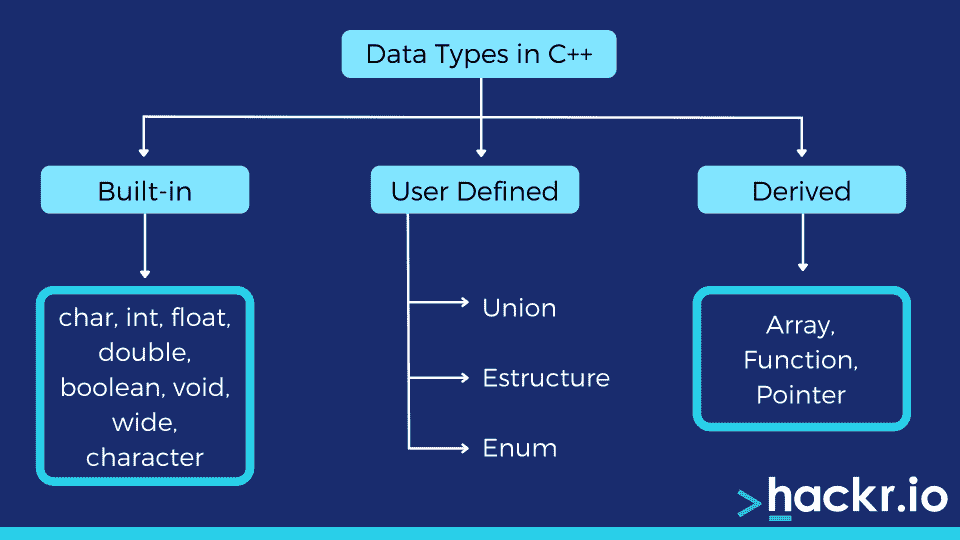

# 快速参考的 C++备忘单(下载 PDF)

> 原文：<https://hackr.io/blog/cpp-cheat-sheet-pdf>

C++是一种通用语言，是 C 语言的扩展。作为当今市场上最受欢迎的编程语言之一，C++是有抱负的开发人员的热门学习选择。程序员们参加课程，用 [C++项目](https://hackr.io/blog/cpp-projects)进行实验，以提高他们的知识。

但是当你工作的时候，你渴望过 C++快速参考吗？如果能更高效地完成 C++工作会怎样？这个 C++备忘单是一个很好的参考，可以帮助你更顺利地工作。

我们已经策划了一个惊人的 C++语法备忘单或 C++命令备忘单，将帮助您提高或完善您的技能。

这个 C++编程备忘单也是面试准备的一个很好的资源。准备好快速解决 C++项目了吗？我们开始吧！

[**下载 C++小抄 PDF**](https://drive.google.com/file/d/1Q_I6H8qBTTIFMHEPbbpKVrg_E5N6cFtg/view?usp=sharing)

## **C++备忘单**

## **语法**

让我们从语法开始我们的 C++参考表。

```
#include <iostream>
usingnamespacestd;

intmain() {
cout << "Hello World!";
return0;
}
```

在用 C++编写代码时，一定要确保每一行都以分号结束，以指明该行的结尾。您还必须添加右括号来结束主函数；否则，编译代码时会出错。

*   **第 1 行:** '#include < iostream >'指定了*头文件库*，它帮助你处理像“cout”这样的输入输出对象头文件用于向 C++程序添加特定的功能。
*   **第 2 行:**‘使用名称空间 STD’允许您使用标准库中的对象和变量的名称。
*   **第 3 行:**空行。C++忽略代码中的空格。
*   **第 4 行:** 'int main()'，这是一个函数。将执行花括号{}内的任何代码。
*   **第 5 行:** cout 是与插入操作符(< <)一起使用的对象，用于打印输出文本。
*   **第 6 行:** return 0 用于结束主函数。

在 C++中，编译器会忽略后跟注释的文本。C++支持两种不同类型的注释:

**//:** 指定单行注释。

**/* …。*/** :指定多行注释。

## **数据类型**

数据类型指定数据变量的类型。编译器根据数据类型分配内存。以下是 C++数据类型:



*   **内置或原始数据类型:**可以直接使用的预定义数据类型，包括整数、字符、布尔、浮点、双浮点、无值或空、宽字符。
*   **派生数据类型:**派生自原始数据类型:函数、数组、指针、引用。
*   **用户自定义数据类型:**用户自定义:类、结构、并集、枚举、Typedef。

## **变量**

变量存储数据值。C++支持各种类型的变量，如 int、double、string、char 和 float。

例如:

```
int num = 12; // Integer
string name = "Unity Buddy"; // String(text)
char ch = 'U'; //character
float fl = 5.99; // Floating point number
```

变量名可以使用字母、数字和下划线。但是，变量不能以数字或下划线“_”字符开头。相反，它们以字母开头，后跟数字或下划线“_”字符。此外，变量名称不能使用关键字。

### **变量范围**

在 C++中，可以在程序的三个部分中声明变量，也称为变量的作用域:

#### **1。局部变量**

这些变量是在函数或代码块中声明的。它们的作用域仅限于该函数或块，不能被该块之外的任何其他语句访问。

例如:

```
#include <iostream>
usingnamespacestd;

intmain () {
// Local variable:
int a, b;
int c;

// initialization
a = 10;
b = 20;
c = a + b;

cout << c;

return0;
}
```

#### **2。全局变量**

任何函数、方法或程序块都可以访问全局变量。通常，它被定义在所有函数之外。在整个程序中，全局变量的值是相同的。

例如:

```
#include <iostream>
usingnamespacestd;

// Global variable:
int g;

intmain () {
// Local variable:
int a, b;

// initialization
a = 10;
b = 20;
g = a + b;

cout << g;

return0;
}
```

**建议课程**

**[c++编程入门——从入门到超越](https://click.linksynergy.com/deeplink?id=jU79Zysihs4&mid=39197&murl=https%3A%2F%2Fwww.udemy.com%2Fcourse%2Fbeginning-c-plus-plus-programming%2F)**

### **数据类型修饰符**

数据类型修饰符用于修改数据类型的最大数据长度。下表将帮助您理解与修饰符结合使用时内置数据类型的大小和范围。C++中有四种不同类型的修饰符，即有符号、无符号、短整型和长整型。

| **数据类型** | **大小(以字节为单位)** | **范围** |
| 短整型 | 2 | -32768 至 32767 |
| 无符号短整型 | 2 | 0 到 65，535 |
| 无符号整数 | 四 | 0 到 4，294，967，295 |
| （同 Internationalorganizations）国际组织 | 四 | -2147483648 至 2147483647 |
| 长整型 | 四 | -2147483648 至 2147483647 |
| 无符号长整型 | 四 | 0 到 4，294，967，295 |
| 长整型 | 8 | -(2^63)到(2^63)-1 |
| 无符号长整型 | 8 | 0 到 18446744073709551615 |
| 有符号字符 | 一 | -128 到 127 |
| 无符号字符 | 一 | 0 到 255 |
| 漂浮物 | 四 |
| 两倍 | 8 |
| 长双份 | 12 |
| wchar_t | 2 或 4 | 1 个宽字符 |

## **文字量**

C++中的文字是可以用来表示固定值的数据。您可以在代码中直接使用它们。

比如 1，2.5，“s”等。

C++中有不同类型的文本，如下所述:

### **1。整数文字**

整数文字是数值，没有任何分数或指数部分。

例如:

十进制(以 10 为基数):0，-9，22 等。

八进制(基数 8) : 021，077，033 等。

十六进制(16 进制):0x7f、0x2a、0x521 等。

### **2。浮点文字**

这些是具有小数部分或指数部分的数值。

比如:(-2.0，0.8589，-0.26E -5)。

### **3。字符文字**

这些是用单引号括起来的单个字符。

比如:' a '，' F '，' 2 '等。

### **4。转义序列**

对于在 C++中有特殊含义的不可类型化字符，可以在 C++中使用转义序列。

例如:

| **转义序列** | **字符** |
| \b | 退格 |
| \f | 换页 |
| \n | 新行 |
| \r | 返回 |
| \t | 横表 |
| \v | 垂直标签 |
| \\ | 反斜线符号 |
| \' | 单引号 |
| \" | 双引号 |
| \? | 问号 |
| \0 | 零字符 |

### **5。字符串文字**

这是一个用双引号括起来的字符序列。

例如:

| “好” | 串常数 |
| "" | 空字符串常量 |
| " " | 六个空格的字符串常量 |
| " x " | 只有一个字符的字符串常量 |
| "地球是圆的\n " | 打印带换行符的字符串 |

## **常数**

要创建不希望更改其值的变量，可以使用“const”关键字。

例如:

```
constint LIGHT_SPEED = 2997928;
LIGHT_SPEED = 2500// cannot change the value
```

## **数学函数**

C++提供了几个允许你执行数学任务的函数。下表重点介绍了 C++中所有可用的基本数学函数:数学函数

| **功能** | **描述** |
| abs(x) | 返回 x 的绝对值 |
| 助理文书主任(十) | 返回 x 的反余弦值 |
| 阿辛(x) | 返回 x 的反正弦 |
| 阿坦(x) | 返回 x 的反正切值 |
| cbrt(x) | 返回 x 的立方根 |
| 上限(x) | 返回向上舍入到最接近的整数的 x 值 |
| cos(x) | 返回 x 的余弦值 |
| cosh(x) | 返回 x 的双曲余弦值 |
| exp(x) | 返回 Ex 的值 |
| expm1(x) | 返回 ex -1 |
| 晶圆厂(十) | 返回浮点 x 的绝对值 |
| fdim(x，y) | 返回 x 和 y 之间的正差值 |
| 楼层(x) | 返回向下舍入到最接近的整数的 x 值 |
| 海波(x，y) | 返回没有中间溢出或下溢的 sqrt(x2 +y2) |
| fma(x，y，z) | 返回 x*y+z 而不损失精度 |
| fmax(x，y) | 返回浮点 x 和 y 的最大值 |
| fmin(x，y) | 返回浮点 x 和 y 的最小值 |
| fmod(x, y) | 返回 x/y 的浮点余数 |
| 功率(x，y) | 返回 x 的 y 次方值 |
| 罪恶(x) | 返回 x 的正弦值(x 以弧度为单位) |
| 辛赫(x) | 返回双精度值的双曲正弦值 |
| 谭(x) | 返回角度的正切值 |
| tanh(x) | 返回双精度值的双曲正切值 |

## **用户输入**

C++支持“cout”和“cin ”,分别用于显示输出和接收用户输入。cout 使用迭代运算符(<>)。

例如:

```
int x; // declaring a variable
cout << "Type a number: "; // Type any number and hit enter
cin >> x; // Get user input from the keyboard
cout << "Your number is: " << x; // Display the value
```

## **琴弦**

字符串是用双引号括起来的字符的集合或序列。

例如:

```
string str= "Hello";
```

要在代码中使用 string，必须使用以下代码行包含字符串库:

```
#include <string>
```

C++将允许你执行各种函数来操作字符串。下表描述了函数名及其说明:

| **功能** | **描述** |
| int 比较(常量字符串& str) | 比较两个字符串对象 |
| 整数长度() | 查找字符串的长度 |
| 无效交换(字符串和字符串) | 交换两个字符串对象的值 |
| string substr(int pos，int n) | 创建 n 个字符的新字符串对象 |
| int size() | 以字节为单位返回字符串的长度 |
| void resize(int n) | 将字符串的长度调整为最多 n 个字符 |
| 字符串和替换(整数位置，整数长度，字符串和字符串) | 替换从字符位置 pos 开始的字符串部分，并跨越 len 个字符 |
| 字符串和追加(常量字符串和字符串) | 在另一个 string 对象的末尾添加新字符 |
| 字符和位置(整数位置) | 访问指定位置的单个字符 |
| int find(string& str，int pos，int n) | 查找参数中指定的字符串 |
| int find_first_of(string& str，int pos，int n) | 查找指定序列的第一个匹配项 |
| int find _ first _ not _ of(string & str，int pos，int n) | 在字符串中搜索与字符串中指定的任何字符都不匹配的第一个字符 |
| int find_last_of(string& str，int pos，int n) | 在字符串中搜索指定序列的最后一个字符 |
| int find_last_not_of(string& str，int pos) | 搜索与指定序列不匹配的最后一个字符 |
| 字符串和插入() | 在位置 pos 指示的字符之前插入一个新字符 |
| int max_size() | 查找字符串的最大长度 |
| void 推回(char ch) | 在字符串末尾添加一个新字符 ch |
| void pop_back() | 移除字符串的最后一个字符 |
| 字符串和赋值() | 给字符串赋新值 |
| int copy(字符串& str) | 将字符串的内容复制到另一个 |
| 空清除() | 从字符串中移除所有元素 |
| const_reverse_iterator crbegin() | 指向字符串的最后一个字符 |
| const_char* data() | 将字符串的字符复制到一个数组中 |
| bool empty() | 检查字符串是否为空 |
| 字符串和擦除() | 移除指定的字符 |
| 字符和前端() | 返回第一个字符的引用 |
| 字符串和运算符+=() | 在字符串末尾追加一个新字符 |
| 字符串&运算符=() | 为字符串分配一个新值 |
| char 运算符[](位置) | 检索指定位置的字符 |
| int rfind() | 搜索字符串的最后一个匹配项 |
| 迭代器结束() | 指字符串的最后一个字符 |
| reverse _ iterator render() | 指向字符串的第一个字符 |
| void 收缩配合() | 减小容量，使其等于字符串的大小 |
| char* c_str() | 返回一个数组指针，该数组包含一个以空字符结束的序列 |
| 无效准备金(印度卢比贷款) | 请求改变容量 |
| allocator _ type get _ allocator()； | 返回与字符串关联的已分配对象 |

## **操作员**

C++支持不同类型的运算符来为代码添加逻辑，并对变量及其各自的值执行运算。以下是 C++运算符类型:

### **1。算术运算符**

您可以使用算术运算符执行常见的数学运算。

| **操作员** | **名称** | **例子** |
| + | 添加 | x + y |
| - | 减法 | x - y |
| * | 增加 | x * y |
| / | 分开 | x / y |
| % | 系数 | x % y |
| ++ | 增量 | ++x |
| - | 减量 | ［加在以-u 结尾的法语词源的名词之后构成复数］ |

### **2。赋值运算符**

可以用赋值运算符给变量赋值。

| **操作员** | **例子** | **描述** | **同** |
| = | x = 5 | 用于给变量赋值。 | x = 5 |
| += | x += 3 | 它会将值 3 加到 x 的值上。 | x = x + 3 |
| -= | x -= 3 | 它会从 x 的值中减去 3。 | x = x - 3 |
| *= | x *= 3 | 它会将值 3 乘以 x 的值。 | x = x * 3 |
| /= | x /= 3 | 它会将 x 的值除以 3。 | x = x / 3 |
| %= | x %= 3 | 它将返回将值 x 除以 3 的提示。 | x = x % 3 |
| &= | x &= 3 | x = x & 3 |
| &#124;= | x &#124;= 3 | x = x &#124; 3 |
| = | 十. ^= 3 | x = x ^ |
| >>= | x >>= 3 | x = x >> 3 |
| <<= | x <<= 3 | x = x << 3 |

### **3。比较运算符**

您可以使用这些运算符来比较两个值，以返回 true 或 false 值。如果两个值都匹配，它将返回 true，如果不匹配，它将返回 false。

| **操作员** | **名称** | **例子** |
| == | 等于 | x == y |
| ！= | 不相等 | x！= y |
| > | 大于 | x > y |
| < | 不到 | x < y |
| > = | 大于或等于 | x >= y |
| <= | 小于或等于 | x <= y |

### **4。逻辑运算符**

这些运算符决定变量之间的逻辑。

| **操作员** | **名称** | **描述** | **例子** |
| && | 逻辑与 | 如果两个语句都为真，则返回真 | x < 5 && x < 10 |
| &#124;&#124; | 逻辑或 | 如果其中一个语句为真，则返回真 | x < 5 &#124;&#124; x < 4 |
| ！ | 逻辑非 | 反转结果，如果结果为真，则返回 false | ！(x < 5 && x < 10) |

## **决策陈述**

C++中的决策语句决定了程序执行的流程。在这里，程序员指定了不止一个条件。如果条件为真，则执行该块中的语句。否则，将执行其他块中的语句。

C++有各种决策指令:

*   如果语句
*   如果..else 语句
*   交换语句
*   嵌套 if 语句
*   嵌套 switch 语句
*   三元运算符

### **1。If 语句**

这是最基本的决策陈述类型。它指示编译器仅在条件成立时才执行代码块。

语法:

```
if (expression)
{ //code}
```

示例:

```
#include <iostream>
usingnamespacestd;

intmain () {
int b = 10;
if( b < 20 ) {
cout << "b is less than 20;" << endl;
}
cout << "value of a is : " << b << endl;

return0;
}
```

### **2。如果..Else 语句**

这是 if 语句的扩展。它指示编译器仅在指定的条件为真时才执行“if”块。否则，它执行“else”块。

语法:

```
if (expression)
{//code}
else
{//code}
```

示例:

```
#include <iostream>
usingnamespacestd;

intmain () {
int b = 10;
if( b < 20 ) {
cout << "b is less than 20;" << endl;
}
cout << "value of a is : " << b << endl;

return0;
}
```

### **3。开关语句**

当需要针对各种值执行条件时，可以使用 switch 语句。

语法:

```
switch(expression) {
case constant-expression :
statement(s);
break; //optional
case constant-expression :
statement(s);
break; //optional

default : //Optional
statement(s);
}
```

示例:

```
#include <iostream>
usingnamespacestd;

intmain () {
// local variable declaration:
char grade = 'D';

switch(grade) {
case'A' :
cout << "Outstanding!" << endl;
break;
case'B' :
case'C' :
cout << "Well done" << endl;
break;
case'D' :
cout << "Pass" << endl;
break;
case'F' :
cout << "Try again" << endl;
break;
default :
cout << "Invalid grade" << endl;
}
cout << "Your grade is " << grade << endl;

return0;
}
```

### **4。嵌套的 If 语句**

这是一个包含在另一个“if”语句中的“if”语句。当需要将特定条件基于另一个条件的结果时，可以使用这种类型的语句。

语法:

```
if( boolean_expression 1) {
// Executes when the boolean expression 1 is true
if(boolean_expression 2) {
// Executes when the boolean expression 2 is true
}
}
```

示例:

```
#include <iostream>
usingnamespacestd;

intmain () {
// local variable declaration:
int x = 100;
int y = 200;

if( x == 100 ) {
if( y == 200 ) {

cout << "Value of x is 100 and y is 200" << endl;
}
}
cout << "Exact value of x is : " << x << endl;
cout << "Exact value of y is : " << y << endl;

return0;
}
```

### **5。嵌套开关语句**

您可以将一个 switch 语句包含在另一个 switch 语句中。

语法:

```
switch(ch1) {
case'A':
cout << "This A is part of outer switch";
switch(ch2) {
case'A':
cout << "This A is part of inner switch";
break;
case'B': // ...
}
break;
case'B': // ...
}
```

示例:

```
#include <iostream>
usingnamespacestd;

intmain () {
int x = 100;
int y = 200;

switch(x) {
case100:
cout << "This is part of outer switch" << endl;
switch(y) {
case200:
cout << "This is part of inner switch" << endl;
}
}
cout << "Exact value of x is : " << x << endl;
cout << "Exact value of y is : " << y << endl;

return0;
}
```

### **6。三元运算符**

Exp1？exp2:Exp3；

首先，计算表达式 Exp1。如果为真，则 Exp2 被计算，并成为整个“？”的值表情。如果 Exp1 为 false，则计算 Exp3，其值成为表达式的值。

## **循环**

循环用于根据评估条件的结果执行特定次数的特定命令集。C++包括以下循环

*   While 循环
*   Do-while 循环
*   For 循环
*   break 语句
*   连续语句

### **1。While 循环**

循环将继续，直到指定的条件为真。

```
while (condition)
{code}
```

### **2。Do-While 循环**

当条件为假时，do-while 循环停止执行。然而，while 和 do-while 循环之间的唯一区别在于，do-while 循环在执行循环之后测试条件*。因此，循环至少执行一次。*

```
do
{
Code
}
while (condition)
```

### **3。For 循环**

可以使用 for 循环多次执行一个代码块。该循环运行该块，直到其中指定的条件为假。

```
for (int a=0; i< count; i++)
{
Code
}
```

### **4。中断语句**

这用于中断代码流，以便剩余的代码不会被执行。这让你置身事外。

例如:

```
for (int i = 0; i < 10; i++) {
if (i == 4) {
break;
}
cout << i << "\n";
}
```

### **5。继续语句**

该语句将中断流程，将您带到对条件的评估。稍后，它再次开始执行代码。

例如:

```
for (int i = 0; i < 10; i++) {
if (i == 4) {
continue;
}
cout << i << "\n";
}
```

## **数组**

数组是派生的数据类型，它在连续的内存位置存储多个相似类型的数据项。

例如:

```
string vehicles [4]; //declaring array to store up to 4 variables.
string vehicles[4]= {"car", "scooter", "cycle", "bike"}; //initializing the array
```

### **1。访问数组值**

您需要使用索引号来访问存储在数组中的元素。

```
string vehicles[4]= {"car", "scooter", "cycle", "bike"};
cout << vehicles [0];
```

### **2。改变数组元素**

您可以使用索引号更改数组中存储的元素。

```
string vehicles[4]= {"car", "scooter", "cycle", "bike"};
vehicles [0]= " "airplane";
cout << vehicles[0];
```

## **功能**

功能是执行特定任务的一组指令。每个 C++程序中常见的函数是 main()函数。您甚至可以将复杂的代码分解成多个小函数，并分别执行它们。

为此，您需要声明、定义并调用该函数。C++有几个内置函数，可以在任何程序中直接调用。

### **定义功能**

以下是在 C++中定义函数的语法:

```
return_type function_name( parameter list ) {
body of the function
}
```

其中:

*   **return_type** 指定函数返回的值的类型。
*   **function_name** 指定函数的名称，需要唯一。
*   **参数列表**允许你传递多个值给你的函数，以及它们的数据类型。
*   **函数体**指定完成任务的指令集。

例如:

```
intmax(int num1, int num2) { // declaring the function max
int result;

if (num1 > num2)
result = num1;
else
result = num2;

return result;
}
```

### **调用函数**

你必须在程序中任何需要的地方调用一个函数。

例如:

```
#include <iostream>
usingnamespacestd;

// function declaration
intmax(int num1, int num2);

intmain () {
int a = 100;
int b = 200;
int ret;

ret = max(a, b);
cout << "Max value is : " << ret << endl;

return0;
}
```

### **函数参数**

您可以通过三种方式传递参数:

*   **传值调用:**将实参值传入函数的形参。它不会对函数内部的参数进行任何更改，也不会影响参数。
*   **通过指针调用:**可以将实参地址复制到形参中。这里，地址访问调用中使用的实际参数。这意味着对参数所做的更改会影响参数。
*   **引用调用:**可以将实参引用复制到形参中。引用访问调用中使用的实际参数。这意味着对参数所做的更改会影响参数。

## **存储类别**

存储类定义了变量和函数的可见性。C++支持各种存储类，如 auto、register、extern、static 和 mutable。

### **1。自动存储类**

默认情况下，C++对所有变量都使用这个存储类。

例如:

```
{
int var;
autoint var1;
}
```

您只能在函数中使用“auto”来定义局部变量。

### **2。寄存器存储类**

这个存储类定义了要存储在寄存器中而不是 RAM 中的局部变量。当您想要频繁访问变量(如计数器)时，这很有用。变量的最大大小等于寄存器的大小。

例如:

```
{
registerint miles;
}
```

### **3。静态存储类**

静态存储类告诉编译器在整个程序中维护局部变量，而不需要在进入和超出范围时创建和销毁它们。将变量定义为静态意味着它将在函数调用之间保持其值。

全局变量是静态的，这意味着它们的范围将被限制在它们声明的文件中。如果将类数据成员指定为 static，它将只创建该成员的一个副本，该成员的所有类对象将共享该副本。

例如:

```
#include <iostream>

// Function declaration
voidfunc1(void);

staticint count = 10; /* Global variable */

main() {
while(count--) {
func();
}

return0;
}

// Function definition
voidfunc1( void ) {
staticint i = 5; // local static variable
i++;
std::cout << "i is " << i ;
std::cout << " and count is " << count << std::endl;
}
```

**外部存储类**

extern 存储类提供了一个全局变量的引用，并使它对所有程序文件可见。当您将变量指定为“extern”时，该变量无法初始化，因为它将变量名指向先前已定义的存储位置。

如果在多个文件中定义了一个全局变量或函数，并在其他文件中使用，extern 将在另一个定义了变量或函数的文件中提供一个引用。当必须在两个或多个文件之间共享相同的全局变量或函数时，必须使用 extern 修饰符。

例如:

**程序 1**

```
#include <iostream>
int count ;
externvoidwrite_extern();

main() {
count = 5;
write_extern();
}
```

**程序 2**

```
#include <iostream>

externint count;

voidwrite_extern(void) {
std::cout << "Count is " << count << std::endl;
}
```

### **可变存储类**

如果希望对象成员重写成员函数，可以使用这个存储类。也就是说，可变成员可以被常量成员函数修改。

## **结构**

结构允许您定义非相似数据类型的数据项。要使用结构，必须定义它并访问其结构成员。

以下是创建结构的语法:

struct [structuretag] {
成员定义；
成员定义；
...
成员定义；
}【一个或多个结构变量】；

例如，我们希望创建一个由标题、作者、主题和 book_id 组成的图书结构，如下所示:

```
structBooks {
char title[50];
char author[50];
char subject[100];
int book_id;
} book;
```

您必须使用成员访问运算符(。)来访问结构成员。这是结构变量名和我们希望访问的结构成员之间的句点。

### **访问结构成员**

```
#include <iostream>
#include <cstring>

usingnamespacestd;

structBooks {
char title[50];
char author[50];
char subject[100];
int book_id;
};

intmain() {
structBooksBook1; // Declare Book1 of type Book
structBooksBook2; // Declare Book2 of type Book

// book 1 specification
strcpy( Book1.title, "Learn C++ Programming");
strcpy( Book1.author, "Chand Miyan");
strcpy( Book1.subject, "C++ Programming");
Book1.book_id = 6495407;

// book 2 specification
strcpy( Book2.title, "Telecom Billing");
strcpy( Book2.author, "Yakit Singha");
strcpy( Book2.subject, "Telecom");
Book2.book_id = 6495700;

// Print Book1 info
cout << "Book 1 title : " << Book1.title <<endl;
cout << "Book 1 author : " << Book1.author <<endl;
cout << "Book 1 subject : " << Book1.subject <<endl;
cout << "Book 1 id : " << Book1.book_id <<endl;

// Print Book2 info
cout << "Book 2 title : " << Book2.title <<endl;
cout << "Book 2 author : " << Book2.author <<endl;
cout << "Book 2 subject : " << Book2.subject <<endl;
cout << "Book 2 id : " << Book2.book_id <<endl;

return0;
}
```

## **参考文献**

当您将一个变量声明为引用时，它将作为现有变量的替代变量。需要用“&”指定引用变量，如下所示:

```
string food = "Pizza";
string &meal = food; // reference to food
```

## **指针**

C++中的指针是存储另一个变量的内存地址的变量。与常规变量类似，指针也有数据类型。在 C++中，我们使用' * '来声明指针。

例如:

```
string food = "Pizza"; // string variable

cout << food; // Outputs the value of food (Pizza)
cout << &food; // Outputs the memory address of food (0x6dfed4)
```

### **类和对象**

C++是一种[面向对象的编程语言](https://hackr.io/blog/oops-concepts-in-java-with-examples)，有类和对象。类是用户定义的数据类型，可用于将数据成员和成员函数绑定在一起。您可以通过创建该类的实例来访问它们。

### **创建一个类**

下面是如何用 C++创建一个类:

```
classMyClass { // The class
public: // Access specifier- accessible to everyone
int myNum; // Attribute (int variable)
string myString; // Attribute (string variable)
};
```

### **创建一个对象**

对象作为类的实例工作，允许您访问其成员、函数和变量。您必须使用点(。)运算符，如下所示:

```
classMyClass {
public:
int myNum;
string myString;
};

intmain() {
MyClass myObj; // Creating an object of MyClass

myObj.myNum = 15;
myObj.myString = "Some text";

// Print attribute values
cout << myObj.myNum << "\n";
cout << myObj.myString;
return0;
}
```

### **创建多个对象**

下面是如何创建同一个类的多个对象的示例:

```
classCar {
public:
string brand;
};

intmain() {
// Create an object of Car
Car carObj1;
carObj1.brand = "BMW";

// Create another object of Car
Car carObj2;
carObj2.brand = "Ford";
// Print attribute values
cout << carObj1.brand "\n";
cout << carObj2.brand "\n";
return0;
}
```

## **类方法**

方法就像在类中定义的函数。C++有两种方法:类内方法和类外方法。

### **内部类方法**

```
classMyClass {
public:
voidmyMethod() { // Method/function inside the class
cout << "Hello World!";
}
};

intmain() {
MyClass myObj; // Create an object of MyClass
myObj.myMethod(); // Call the method
return0;
}
```

### **外部类方法**

```
classMyClass {
public:
voidmyMethod(); // Method declaration
};

// Method/function definition outside the class
void MyClass::myMethod() {
cout << "Hello World!";
}

intmain() {
MyClass myObj; // object creation
myObj.myMethod(); // Call the method
return0;
}
```

## **构造函数**

[构造函数](https://www.techopedia.com/definition/5656/constructor)是在对象创建时自动调用的方法。它与类名同名，没有数据类型。

例如:

```
classFir_Class {
public:
Fir_Class() { // Constructor
cout << "Hello World!";
}
};

intmain() {
Fir_Class myObj; // call the constructor
return0;
}
```

## **访问说明符**

访问说明符定义了类成员和变量的访问。C++支持三种类型的访问说明符:

*   **Public:** 类成员和变量可以从类外部访问。

*   **Private:** 类成员和变量只能在类内访问，不能在类外访问。

*   **Protected:** 类成员和变量只能在它们的子类中访问。

## **封装**

封装有助于对用户隐藏敏感数据。这里，我们使用私有访问说明符来声明变量和方法。如果您希望允许其他人读取或修改这些变量和方法，您必须使用公共的 get 和 set 方法。

例如:

```
#include <iostream>
usingnamespacestd;

classEmployee {
private:
int name;

public:
// Setter
voidsetName(int n) {
name= s;
}
// Getter
intgetName() {
return name;
}
};

intmain() {
Employee myObj;
myObj.setName("Bob");
cout << myObj.getName();
return0;
}
```

## **继承**

C++支持继承，允许你从一个类继承到另一个类的成员和变量。继承类是子类，另一个是父类。您必须使用(:)符号来继承:

```
// Parent class
classVehicle {
public:
string brand = "Ford";
voidsound() {
cout << "honk \n" ;
}
};

// Child class
classCar: public Vehicle {
public:
string model = "Mustang";
};

intmain() {
Car myCar;
myCar.sound();
cout << myCar.brand + " " + myCar.model;
return0;
}
```

## **多态性**

多态性指定了“许多形式”它是一条消息以多种形式显示的能力，当您有多个子类和一个基类时就会发生。

例如:

```
// Parent class
classAnimal {
public:
voidsound() {
cout << "The animal makes a sound \n" ;
}
};

// Child class
classPig : public Animal {
public:
voidsound() {
cout << "The pig says: wee wee \n" ;
}
};

// Derived class
classDog : public Animal {
public:
voidsound() {
cout << "The dog says: bow wow \n" ;
}
};
intmain() {
Animal ani;
Pig myPig;
Dog myDog;

ani.sound();
myPig.sound();
myDog.sound();
return0;
}
```

## **文件处理**

您可以使用 fstream 库来处理文件。fstream 库由<iostream>和<fstream>头文件组成。</fstream></iostream>

*#包括< iostream >*

*#包括< fstream >*

**ofstream:** 创建并写入文件。

**ifstream:** 从指定文件中读取。

**fstream:** 以上两者的组合。

### **创作和写作**

```
#include <iostream>
#include <fstream>
usingnamespacestd;

intmain() {
// Create and open a text file
ofstream MyFile("filename.txt");

// Write to the file
MyFile << "content";

// Close the file
MyFile.close();
}
```

### **读数**

```
// text string to output the text file
string myText;

// Read from the text file
ifstream MyReadFile("filename.txt");

// for reading the file line by line
while (getline (MyReadFile, myText)) {
// Output the text from the file
cout << myText;
}

// Close the file
MyReadFile.close();
```

### **异常情况**

在编译和运行时，您可能会遇到错误。C++允许您使用异常处理来处理和捕获这些错误。以下是包含 try-catch 块的异常处理的[语法](https://hackr.io/blog/programming-terms-definitions-for-beginners#:~:text=44.-,Syntax,-Similar%20to%20human):

```
try {
// Block of code to try
throw exception; // Throw an exception when a problem arise
}
catch () {
// Block of code to handle errors
}
```

例如:

```
try {
int age = 10;
if (age >= 20) {
cout << "you are old enough.";
} else {
throw505;
}
}
catch (int num) {
cout << "Access denied \n";
cout << "Error number: " << num;
}
```

## **预处理器**

以下是 C++中一些内置的预处理程序，可用于各种功能。

```
#include <stdio.h> // Insert standard header file

#include "myfile.h" // Insert file in current directory

#define X some text // Replace X with some text

#define F(a,b) a+b // Replace F(1,2) with 1+2

#define X \

 some text // Multiline definition

#undef X // Remove definition

#if defined(X) // Conditional compilation (#ifdef X)

#else // Optional (#ifndef X or #if !defined(X))

#endif // Required after #if, #ifdef
```

### **动态内存管理**

```
#include <memory> // Include memory (std namespace)
shared_ptr<int> x; // Empty shared_ptr to a integer on heap. Uses reference counting for cleaning up objects.
x = make_shared<int>(12); // Allocate value 12 on heap
shared_ptr<int> y = x; // Copy shared_ptr, implicit changes reference count to 2.
cout << *y; // Dereference y to print '12'
if (y.get() == x.get()) { // Raw pointers (here x == y)
cout << "Same";
}
y.reset(); // Eliminate one owner of object
if (y.get() != x.get()) {
cout << "Different";
}
if (y == nullptr) { // Can compare against nullptr (here returns true)
cout << "Empty";
}
y = make_shared<int>(15); // Assign new value
cout << *y; // Dereference x to print '15'
cout << *x; // Dereference x to print '12'
weak_ptr<int> w; // Create empty weak pointer
w = y; // w has weak reference to y.
if (shared_ptr<int> s = w.lock()) { // Has to be copied into a shared_ptr before usage
cout << *s;
}
unique_ptr<int> z; // Create empty unique pointers
unique_ptr<int> q;
z = make_unique<int>(16); // Allocate int (16) on heap. Only one reference allowed.
q = move(z); // Move reference from z to q.
if (z == nullptr){
cout << "Z null";
}
cout << *q;
shared_ptr<B> r;
r = dynamic_pointer_cast<B>(t); // Converts t to a shared_ptr<B>
```

### **浮点数学**

您必须包含“cmath”库才能对浮点数执行任务。

```
#include <cmath> // Include cmath (std namespace)

sin(x); cos(x); tan(x); // you can perform Trig functions, x (double) is in radians

asin(x); acos(x); atan(x); // Inverses

atan2(y, x); // atan(y/x)

sinh(x); cosh(x); tanh(x); // Hyperbolic sin, cos, tan functions

exp(x); log(x); log10(x); // e to the x, log base e, log base 10

pow(x, y); sqrt(x); // x to the y, square root

ceil(x); floor(x); // Round up or down (as a double)

fabs(x); fmod(x, y); // Absolute value, x mod y
```

### **iostream.h 和 iostream**

```
#include <iostream> // Include iostream (std namespace)

cin >> x >> y; // Read words x and y (any type) from standard input

cout << "x=" << 3 << endl; // Write line to stdout

cerr << x << y << flush; // Write to stderr and flush

c = cin.get(); // c = getchar();

cin.get(c); // Read char

cin.getline(s, n, '\n'); // Read line into char s[n] to '\n' (default)

if (cin) // Good state (not EOF)?

// To read/write any type T:

istream& operator>>(istream& i, T& x) {i >> ...; x=...; return i;}

ostream& operator<<(ostream& o, const T& x) {return o << ...;}
```

## **结论**

我们已经到了 C++参考备忘单的末尾。恭喜你。

在这本 C++参考资料中，我们几乎涵盖了任何初学者在开始职业生涯或准备即将到来的面试时需要了解的 C++的每个方面。这份 C++初学者备忘单是一个很好的资源，你可以在开发应用程序或参加面试之前浏览一下。

我们希望这篇 C++参考资料能帮助你深入了解 C++的一切。

有兴趣扩展您的 C++知识吗？查看我们的[最佳 C++课程列表](https://hackr.io/blog/cpp-course)。

**人也在读:**