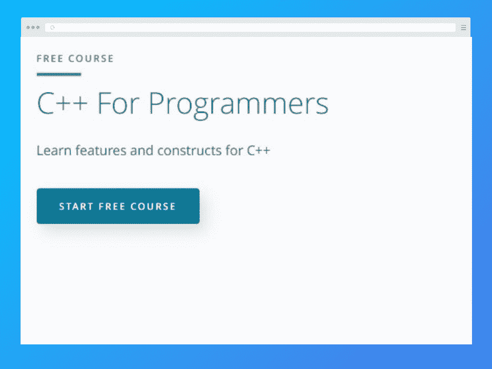
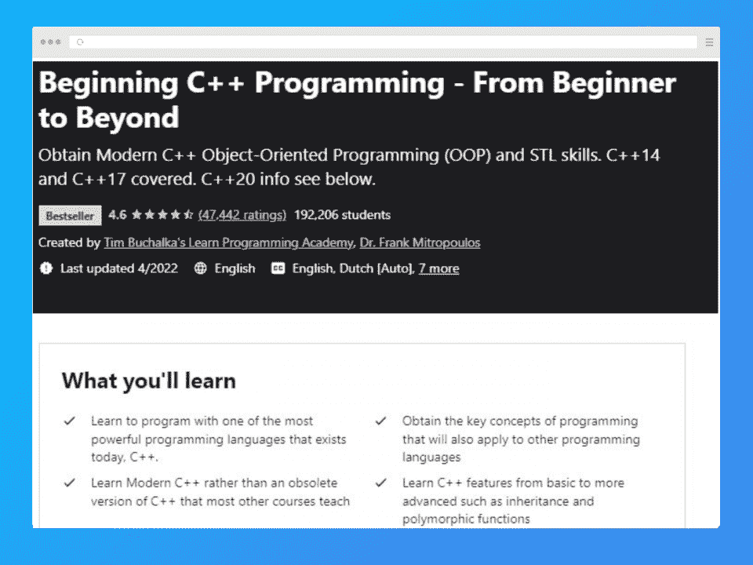
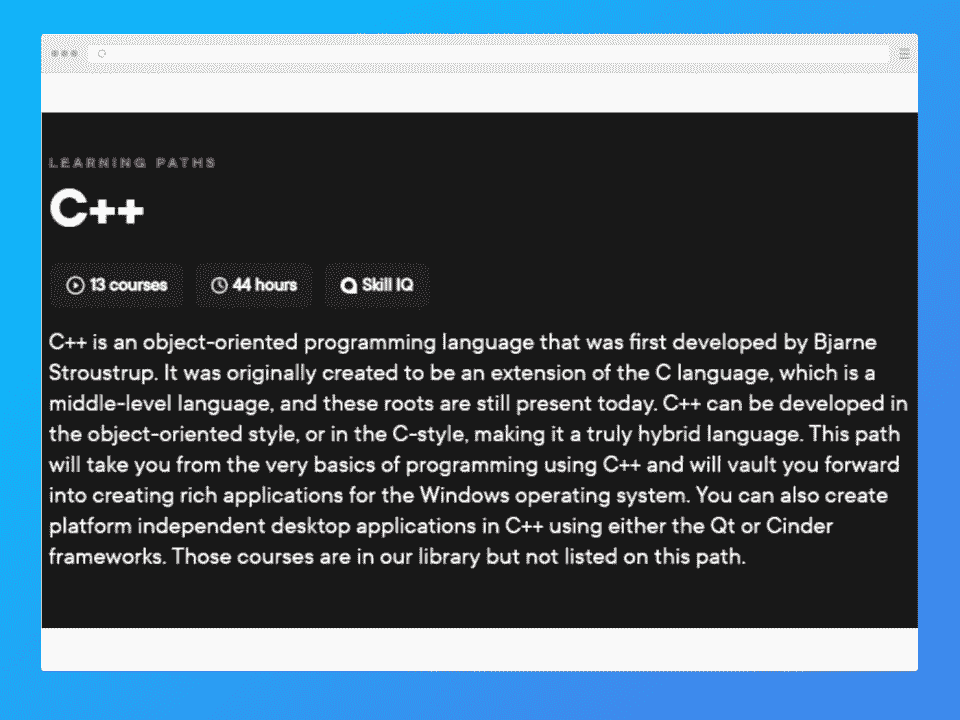
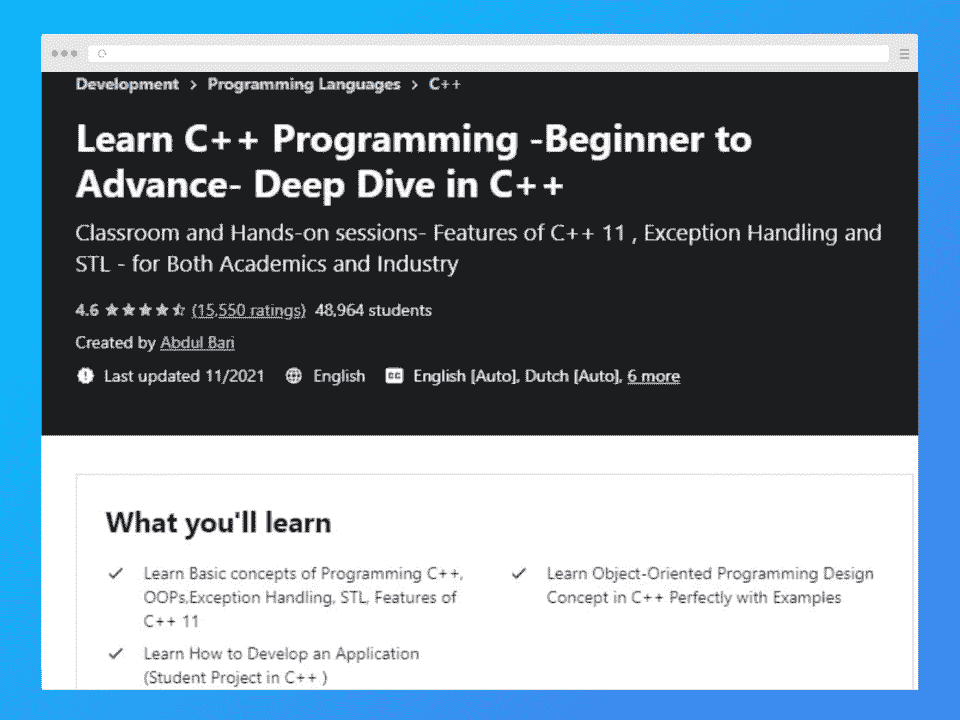
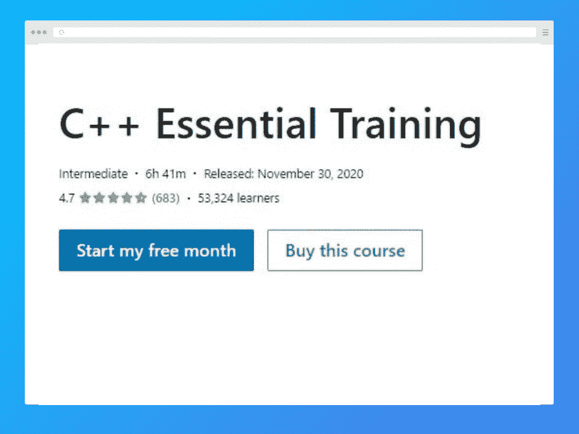
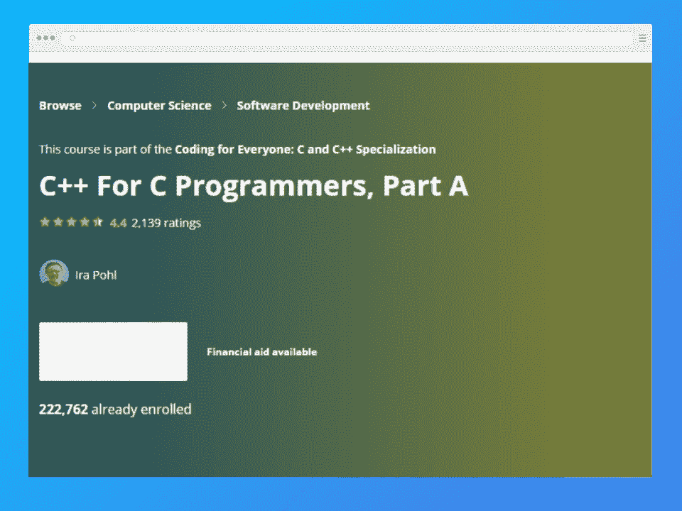
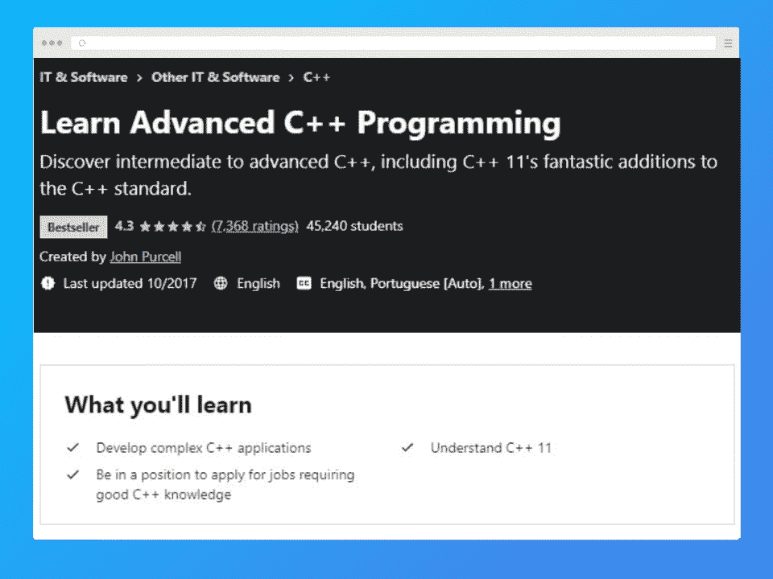
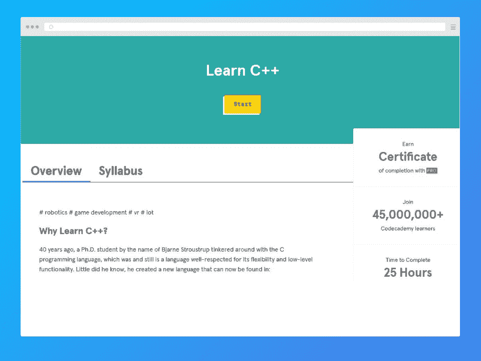
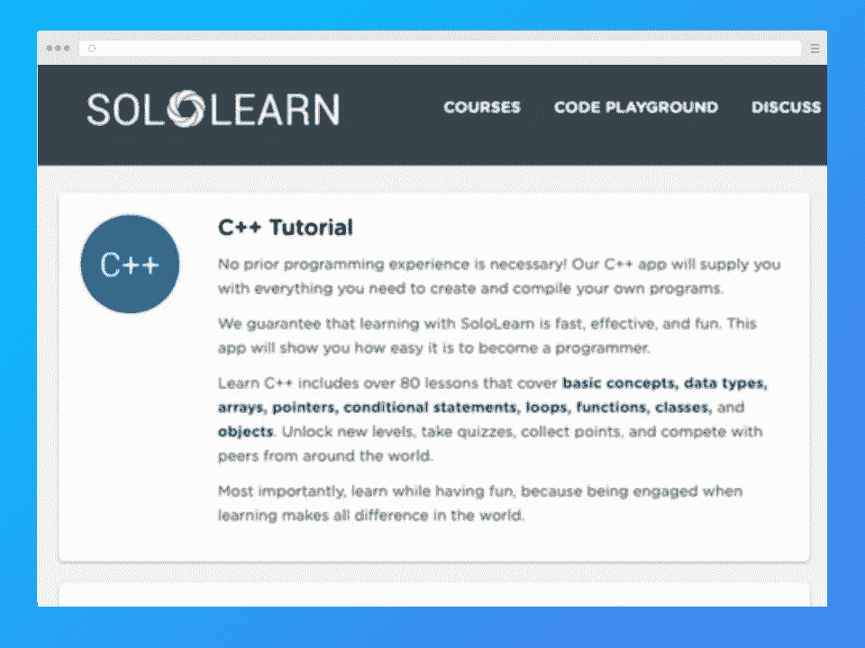

# 2023 年在线学习的 10 大最佳 C++课程

> 原文：<https://hackr.io/blog/cpp-course>

C++是 C 编程语言的扩展版本，由丹麦计算机科学家比雅尼·斯特劳斯特鲁普创造。这种面向对象的编码语言有助于开发可以在多种平台上使用的高性能应用程序。它包含了各种高级特性和对其前身的改进，使其成为面向对象编程的更好选择。

如果你是编程新手，或者对编码和 C++了解有限，那么你必须看看下面列出的 C++课程。他们非常适合获得实践经验，并在该领域建立一个强大的基础。

如果你想快速浏览课程和所有重要信息，你可以看看下表。之后，我们详细讨论课程。

## **2023 年在线学习的最佳 C++课程**

## **2023 年学 C++值得吗？**

是的，2023 年 C++值得学。这种语言无处不在，是最有效的编程语言之一。你可以在几乎所有的操作系统上找到它。尽管它是一种非常古老的语言，但它仍然是十大最常用的语言之一，至少根据 Stack Overflow 的 2022 年开发者调查是这样的。

在薪资方面， [C++提供的薪资中值为 54049 美元](https://www.salary.com/research/salary/posting/c-plus-plus-programmer-salary)，远非最高。然而，随着这种语言的广泛使用，也有一些就业机会。

## **10 门最佳 C++在线课程**

[****](https://imp.i115008.net/x9ZWDA)

| **课程信息** | **课程大纲** |
| **先决条件:**任何编程语言的中级知识和技能**难度:**中级**持续时间:** 4 个月，每周 10 小时**费用:**免费 | 内存管理

*   面向对象编程
*   C++基础
*   顶点工程
*   并发
*   这个 C++ Nanodegree 项目非常适合那些理解编程语言基本概念的有抱负的 C++开发人员。您将熟练掌握面向对象编程，并通过项目驱动的学习方法建立高级技能。它允许学生们尝试真正的、自定进度的 C++项目并开发作品集。这些项目可以根据你的方便和时间表来完成。

 |

这门课程将帮助学生为在网络、移动通信、机器人软件、人工智能、物联网、嵌入式系统、视频游戏开发等领域的职业生涯做准备。

[在此注册](https://imp.i115008.net/x9ZWDA)

[****](https://click.linksynergy.com/deeplink?id=jU79Zysihs4&mid=39197&murl=https%3A%2F%2Fwww.udemy.com%2Fcourse%2Fbeginning-c-plus-plus-programming%2F)

**课程信息**

| **课程大纲** | **先决条件:**无 |
| **难度:**所有关卡**持续时间:** 40 小时**费用:**50 美元多态和继承函数 | 管理内存

*   班级
*   指针和函数
*   构造器
*   Udemy 的这一全面的 C++课程使学习者能够深入了解 C++编程，并快速掌握该领域的技能。课程讲师 Frank Mitropolous 是一名 C++专业人员，拥有 20 多年的行业经验。
*   这门 C++编程课程最好的一面是给学习者提供真实的代码示例。这对那些以前没有任何实际编码经验的学习者来说确实很有帮助。

 |

[在此注册](https://click.linksynergy.com/deeplink?id=jU79Zysihs4&mid=39197&murl=https%3A%2F%2Fwww.udemy.com%2Fcourse%2Fbeginning-c-plus-plus-programming%2F)

[****](https://click.linksynergy.com/deeplink?id=jU79Zysihs4&mid=39197&murl=https://www.udemy.com/course/unrealcourse/)

**课程信息**

**课程大纲**

| **先决条件:**无 | **难度:**初学者 |
| **持续时间:** 60 小时**费用:**70 美元VS 社区和编译器现代游戏开发技巧和技术 | 为游戏添加音频和声音效果

*   人工智能行为编程
*   C++的结构
*   三 X 游戏设计
*   比较值
*   功能参数
*   建筑逃生
*   高级车辆物理学
*   行为和黑板树
*   这个虚幻引擎 5 Udemy 课程在这个列表中是独一无二的，因为它帮助程序员开发编码和游戏开发技能。它使用基于项目的研究方法——您将获得处理实时编码示例的实践经验。
*   这门课程对现有的和新的程序员和开发人员都是理想的。游戏开发是一个热门领域，C++在其中被广泛使用，所以如果你喜欢这样的职业，这个课程是值得的。
*   [在此注册](https://click.linksynergy.com/deeplink?id=jU79Zysihs4&mid=39197&murl=https://www.udemy.com/course/unrealcourse/)

 |

[****](https://pluralsight.pxf.io/Kezd6N)

**课程信息**

**课程大纲**

**先决条件:**无

| **难度:**所有关卡 | **持续时间:** 43 小时 |
| **费用:** $30 包月多态性和遗传兰姆达斯 | C++类型系统

*   堆/栈语义
*   范围管理
*   C++标准库
*   并发
*   流输入输出
*   Pluralsight 开发了 C++学习课程，涵盖从 C++入门到高级高性能编码概念的所有主题。本课程分为初级、中级和高级三个级别，每一个级别都涵盖了相应的概念。
*   这一全面的学习路径涵盖了相当详细的主题。学习者还可以获得评估测试和真实的编码示例，帮助他们更好地理解 C++概念。
*   [在此注册](https://pluralsight.pxf.io/Kezd6N)

 |

[****](https://click.linksynergy.com/deeplink?id=jU79Zysihs4&mid=39197&murl=https%3A%2F%2Fwww.udemy.com%2Fcourse%2Fcpp-deep-dive%2F)

**课程信息**

**课程大纲**

**先决条件:**无

| **难度:**所有关卡 | **持续时间:** 30 小时 |
| **费用:**50 美元面向对象编程C++设计概念使用 C++开发应用程序 | 异常处理

*   这门 Udemy C++课程以详细、透彻和结构化的方式涵盖了主要的 C++概念。它允许学习者从基础开始学习，并稳步前进到更高级的主题。报名参加这个 Udemy 课程不需要任何之前的行业经验。
*   该课程的讲师 Abdul Bari 通过实例帮助学生学习。您还将有机会写出代码并进行测试。还有大量的学习资料。
*   [在此注册](https://click.linksynergy.com/deeplink?id=jU79Zysihs4&mid=39197&murl=https%3A%2F%2Fwww.udemy.com%2Fcourse%2Fcpp-deep-dive%2F)
*   [****](https://www.lynda.com/C-tutorials/C-Essential-Training/772322-2.html)

 |

**课程信息**

**课程大纲**

**先决条件:**对编程概念的基本理解

**难度:**初学者

| **持续时间:** 5.5 小时 | **费用:**25 美元 |
| 表达和陈述经营者变量，条件句， | 函数和循环

*   数据结构
*   模板
*   对象和类
*   递归
*   操作员 ooverlord 类型铸造
*   LinkedIn Learning–Lynda platform c++培训计划面向新手和有经验的程序员。本课程涵盖了这门语言的基本概念，但也包括更高级和复杂的 C++主题。课程讲师 Bill Weinman 是一位专业的程序员和技术专家，他以清晰易懂的方式解释这些概念。
*   通过本课程，您将掌握设置 Visual Studio 和 XCode 环境的艺术，这对于专业级编码是必不可少的。学生还将了解 STL(标准模板库)中强大的算法和类。此外，他们将掌握 C++标准库。
*   [在此注册](https://www.lynda.com/C-tutorials/C-Essential-Training/772322-2.html)
*   [****](https://coursera.pxf.io/7m9Dr3)
*   **课程信息**
*   **课程大纲**

 |

**先决条件:**面向对象软件和算法的知识

**难度:**进阶

**持续时间:** 17 小时

**费用:**免费

| 将 C 程序转换为现代 C++程序 | C++泛型和函数 |
| C++面向对象编程和类初始化语法动态存储分配算法和迭代器 | 复制构造函数

*   转换构造函数
*   容器类别
*   三脚架容器
*   由加州大学为 C 程序员开设的 Coursera C++课程致力于提高希望精通 C++的专业 C 程序员的技能。学习者应具备面向对象软件和算法的基本知识，以处理练习和示例。
*   此外，在本课程中，您还将了解 Kruskal 和 Prim 的算法。学习者从大量的编程作业和测验中受益，这样他们可以测试他们的技能并巩固他们在该领域的技能基础。最棒的是，报名参加这个课程，你不用承担任何费用。他们向学生提供结业证书只收取象征性的费用。
*   [在此注册](https://coursera.pxf.io/7m9Dr3)
*   [****](https://click.linksynergy.com/link?id=SeYHzlfZEmI&offerid=1045023.619698&type=2&murl=https%3A%2F%2Fwww.udemy.com%2Fcourse%2Flearn-advanced-c-programming%2F)
*   **课程信息**
*   **课程大纲**
*   **先决条件:**对 C++和 C++编译器有基本的了解

 |

**难度:**中级-高级

**持续时间:** 15 小时

**费用:**35 美元

异常处理

| 写入和读取文件 | 模板类 |
| 运算符重载λ表达式移动构造函数右值和左值的差异 | Udemy 上的 Learn Advanced C++课程为学生提供了一个极好的机会，将他们的基本 C++知识和技能提升到中级和高级水平。要了解这种编程语言的最新特性，需要了解 C++的旧版本，比如 C++ 98。

*   本课程结束时，学生将学会使用现代 C++功能创建位图文件。由于这门课程是为中级和高级学习者设计的，所以你不会找到任何与 C++基础相关的主题。然而，您将学习最新的 C++ 11 特性以及开发专业 C++应用程序的知识。
*   [在此注册](https://click.linksynergy.com/link?id=SeYHzlfZEmI&offerid=1045023.619698&type=2&murl=https%3A%2F%2Fwww.udemy.com%2Fcourse%2Flearn-advanced-c-programming%2F)
*   [****](https://www.pntrac.com/t/TUJGR0lLR0JHRklKSkdCR0ZISk1N?url=https%3A%2F%2Fwww.codecademy.com%2Flearn%2Flearn-c-plus-plus)
*   **课程信息**
*   **课程大纲**
*   **先决条件:**无
*   **难度:**初学者

 |

**持续时间:** 20 小时

**费用:免费**

构建应用程序的 C++基础

基本数据类型和变量

| 逻辑和条件句的使用 | 向量 |
| 环对象和类功能指针和引用 | Codecademy 为有抱负的程序员提供了一门优秀的 C++课程。本课程的重点是帮助个人学习基本的 C++概念以及通向更高级主题的途径。

*   Codecademy 经验丰富、技术高超的专业人员创建了该课程的课程表。你将有机会编写自己的 C++程序和设计应用程序。它几乎涵盖了所有你需要了解的关于 C++的重要话题。
*   [在此注册](https://www.pntrac.com/t/TUJGR0lLR0JHRklKSkdCR0ZISk1N?url=https%3A%2F%2Fwww.codecademy.com%2Flearn%2Flearn-c-plus-plus)
*   [****](https://www.sololearn.com/Course/CPlusPlus/)
*   **课程信息**
*   **课程大纲**
*   **先决条件:**无
*   **难度:**初学者
*   **持续时间:** 3 周

 |

**费用:**20 美元年费

基本概念

使用变量

数据类型，

| 多维数组 | 指针简介 |
| 动态存储器递归包装遗传和多态性 | 文件、模板和例外

*   SoloLearn 的这门 C++课程让学习者从基础开始学习关于 C++的一切。您将学习编译和创建程序，同时提高您的编码技能。这是一门有趣、快速、实用的课程，可以让学生在短时间内成为编程专家。
*   订阅模式意味着你可以接触到几种课程。网站上有各种各样的课程，所以这可能对你有好处。
*   [在此注册](https://www.sololearn.com/Course/CPlusPlus/)
*   **结论**
*   这可能不全面，但它包含了一些最好的 C++课程。我们希望这些课程能为你提供促进学习和职业发展所需的东西。
*   除了网上的 C++课程，你应该看看书面的教程，最重要的是，实际编码程序。这将帮助你学会最好的方法——弄脏你的手。
*   **常见问题解答**
*   **1。有哪些最好的 C++认证课程？**
*   你能选择的最好的 C++课程将取决于你的知识水平。上面列出的课程迎合了各种各样的知识水平，所以从那里开始寻找最适合你的课程。
*   **2。C++课程的合格标准是什么？**

 |

面向初学者的 C++没有资格标准，因为他们会教你从头开始用 C++编程所需要知道的一切。中级和高级学习者必须具备 C++和 C++编译器的知识。

**3。我能得到可打印的证书吗？**

大多数课程确实提供某种形式的证书，然后可以打印出来。然而，最重要的是你获得了一系列项目展示给潜在雇主。

## **人也在读:**

That may not be comprehensive, but it contains some of the best C++ courses. We hope these courses offer what you need to boost your learning and career.

In addition to online C++ courses, you should check out written tutorials and, most importantly, actually code programs. This will help you learn the best way — by getting your hands dirty.

## **Frequently Asked Questions**

#### **1\. What are the Best C++ Certification Courses?**

The best C++ course you can choose will depend on your knowledge level. The courses on the list above cater to a wide variety of knowledge levels, so start there to find the best course for you.

#### **2\. What is the Eligibility Criteria for a C++ Course?**

C++ for beginners have no eligibility criteria, as they teach you everything you need to know to code in C++ from scratch. Intermediate and advanced learners must have knowledge of C++ and the C++ compiler.

#### **3\. Do I get a Printable Certificate?**

Most courses do offer a certificate in some form, which can then be printed. However, what’s most important is that you gain a portfolio of projects to show to potential employers.

**People are also reading:**