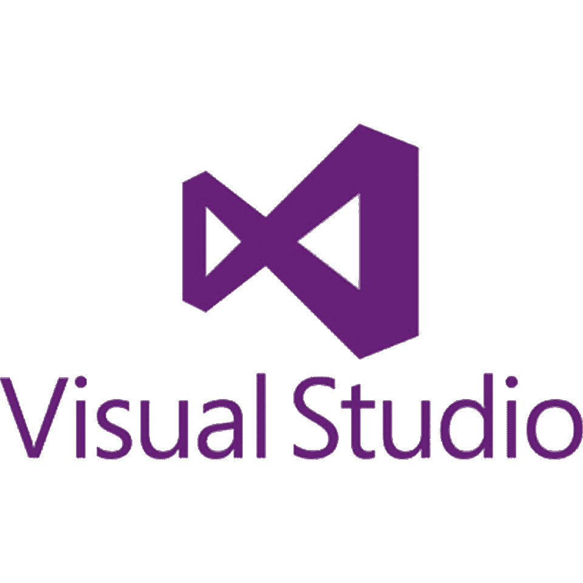
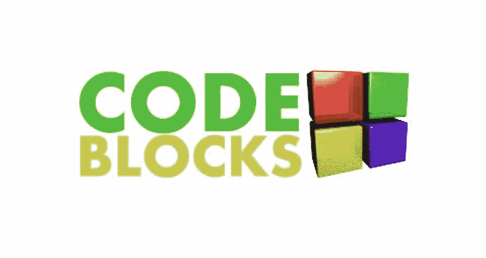
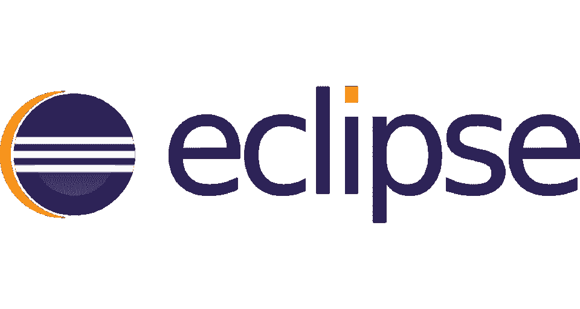
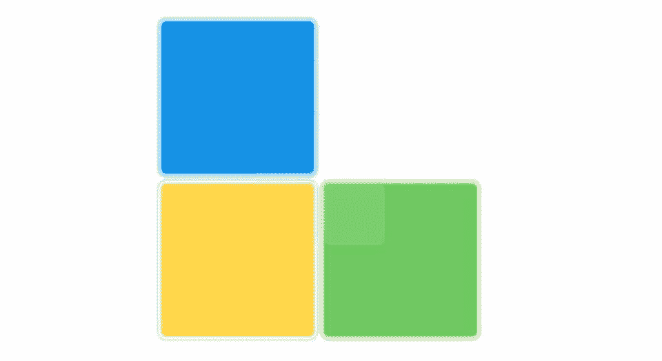
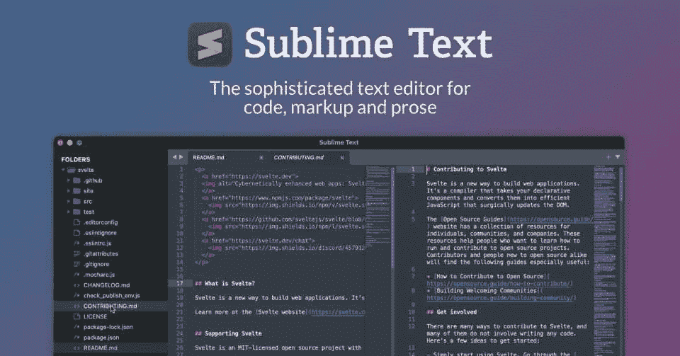
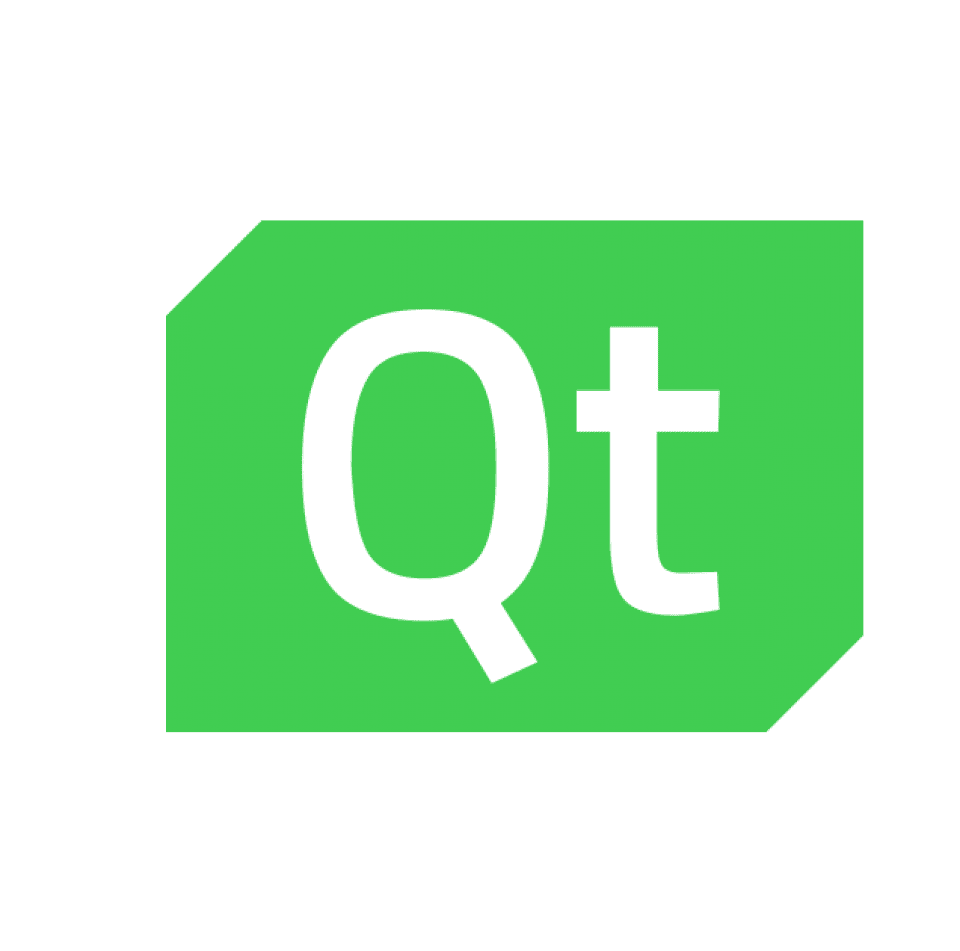
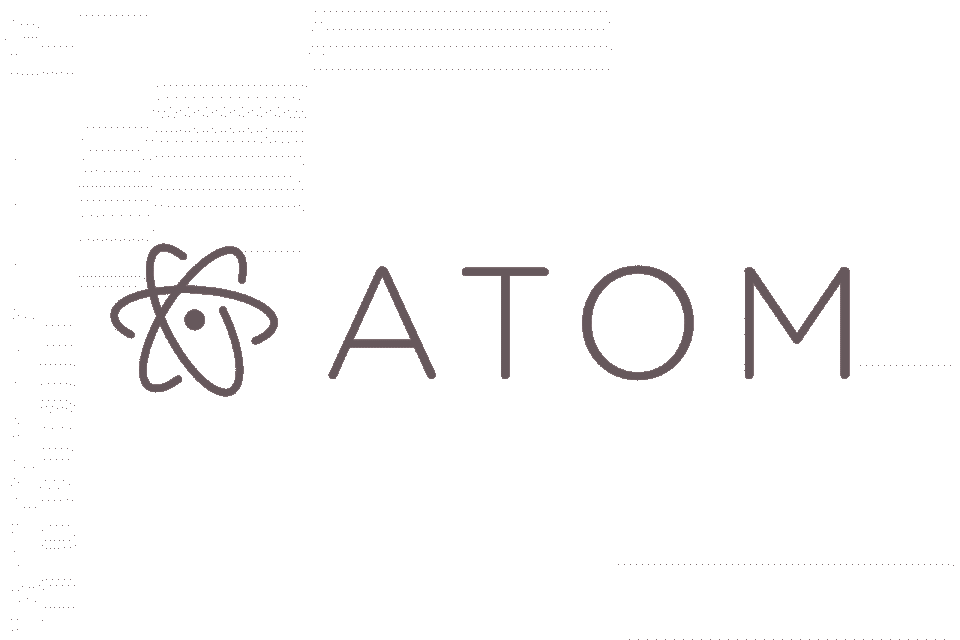
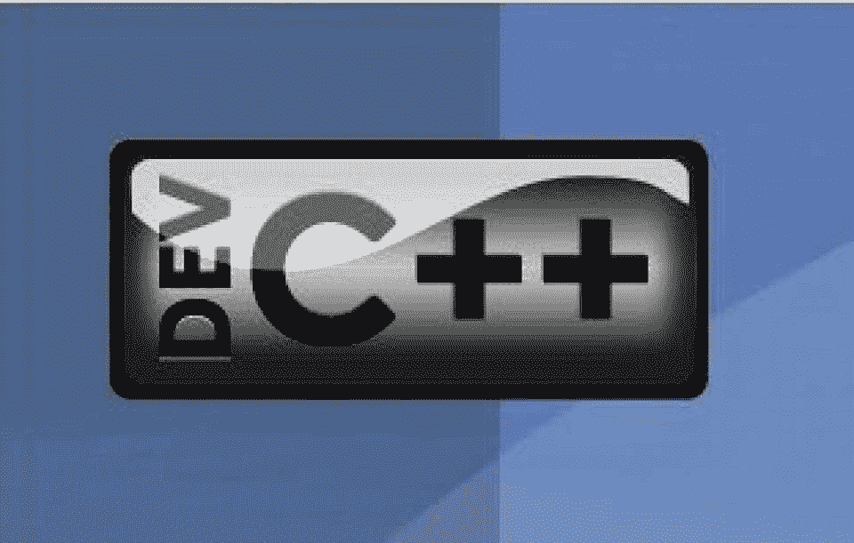

# 2023 年最佳 c++ ide 和编辑器[更新]

> 原文：<https://hackr.io/blog/cpp-ide>

没有集成的开发环境，任何软件开发人员的工具箱都是不完整的。这些软件环境不仅仅是作为一个方便编码的地方，它们还提供了一些强大的特性，可以让您的生活变得更加轻松。

这里我们将重点讨论 C++，有许多 c++ ide 可以对您的工作或流程产生很大的影响。事实上，当涉及到 ide 时，程序员经常会偏袒某一方，经常会听到一群人讨论哪一个更好(尽管您应该选择最适合您的)。

在我们深入了解什么是最适合您的 C++ IDE 之前，让我们来看看 IDE 到底是什么，以及为什么您应该使用 IDE。

## 什么是 IDE？

集成开发环境(IDE)是一个打包的界面，它提供了一套有助于开发的工具和功能。它基本上是一个完整的包，提供了代码编辑器、调试工具和自动化工具。

大多数 IDE 都提供了许多附加特性，但是后三个构成了 IDE 的框架。有些 C++ IDE 只支持单一语言，比如 IDLE 只支持 Python，但大多数支持多种语言的开发。

## 为什么要使用 IDE？

ide 在使开发过程变得更容易和更快速方面大有作为。首先，它们在简洁直观的界面中提供了所有最常用的工具。大多数 ide 也会自动配置参数，这意味着您可以更快地开始编码。

便利性是 IDEs 最大的卖点之一——例如，你可以将鼠标悬停在一个关键字上，它会显示文档信息。如果你犯了一个错误，它也会在你的代码中显示一个错误。所有这些好处加在一起，会使开发体验不那么令人沮丧。

此外，还有智能代码完成和自动代码生成等功能——这些漂亮的流程可以节省大量时间。IDE 将完成编码的繁琐部分，而您可以专注于逻辑。

这些只是使用 IDE 的一些好处。正如您将看到的，每个 C++ IDE 都有自己的特性，以及相关的优点和缺点。请记住，这里的一些 ide 并不支持所有的平台，但是这里的一些 ide 也是最好的 Windows c++ ide。当你在做一个 C++项目的时候，它们真的会有所不同。

## **最佳 C++ IDE &源码编辑**

[****](https://code.visualstudio.com/)

| **优点** | **缺点** |
| 提供各种各样的功能

*   可在多个平台上使用
*   Github 集成
*   良好的扩展支持
*   大量的插件选择可能会让人不知所措

 | 一些较新设备的兼容性问题

*   高级配置可能很难设置
*   Visual Studio Code 是由微软开发的现代开源 IDE。Visual Studio 代码可用于 Windows、Linux 和 macOS，提供了一些功能，如漂亮的命令行界面、高质量的 API、代码片段、代码重构、自动代码完成、集成 Github 等。
*   **特性:**

 |

**注释报告**:允许开发人员提取 C#注释，并以 HTML 格式呈现或存储在 XML 文档中。

**自动隐藏:**沿着开发环境的边缘存放文档，当开发人员将鼠标放在文档上时，弹出文档。

*   **级联样式表:**完全支持创建可应用于 HTML 或 XML 元素的样式
*   **调试支持:**增强了直接在环境中对 C#、C++和 Visual Basic 的调试支持，以及对托管代码和远程调试的支持。
*   **部署工具:**允许开发者利用 Windows Installer 部署应用；支持安装回滚和 app 广告；
*   **增强的自动化支持:**允许开发人员以编程方式访问和控制 IDE 的各个部分，例如代码编辑器、项目、工具窗口以及调试、构建和部署工具
*   **宏录制:**这允许开发者在开发环境中直接录制和播放宏。
*   **模式支持:**从 XML 文档实例自动创建模式
*   [****](http://www.codeblocks.org/)
*   **优点**

**缺点**

| 轻量级选手 | 易于上手 |
| 在低规格电脑上运行良好

*   用户界面不像列表中的其他人那么现代
*   GNU 编译器的手动设置

 | 不适合高处理和数据计算

*   Code::Blocks 是一个轻量级的 C++，可以在 Windows、macOS 和 Linux 上使用。它具有所有的基本特性，如调试、编译和自动代码完成。此外，它还具有概要分析、代码覆盖、代码分析和拖放功能。你可以通过插件增加更多的功能。
*   **特性:**
*   开放源码

 |

用 C++编写，所以不需要解释语言或专有库。

可扩展:有几个你可以使用的插件

*   编译器支持:支持多种编译器，包括 GCC、MSVC++、clang 等等
*   突出显示语法，这是可定制和可扩展的
*   面向 C、C++、Fortran、XML 等的代码折叠
*   **建议课程**
*   **[c++编程入门——从入门到超越](https://click.linksynergy.com/deeplink?id=jU79Zysihs4&mid=39197&murl=https%3A%2F%2Fwww.udemy.com%2Fcourse%2Fbeginning-c-plus-plus-programming%2F)**
*   [****](http://www.eclipse.org/cdt/)

**优点**

**缺点**

干净的界面

| 广泛的支持工具和插件集合 | 适合 Java 编程 |
| 初始设置可能很耗时

*   并非所有语言都表现良好
*   高内存消耗
*   Eclipse 是 C++开发中最简单和最强大的 ide 之一。这是一个非常简单的开源 IDE，可用于 Windows、macOS 和 Linux。初学者会发现它非常容易使用。它提供了调试、代码编译、自动代码完成、分析、重构、静态代码分析和拖放等功能。

 | **特性:**

*   编码快捷方式
*   自动校正
*   不同文件

 |

有几个插件

JavaDoc 工具允许您自动创建文档

*   [****](http://codelite.org/)
*   **优点**
*   **缺点**
*   基于 Clang 的代码完成引擎
*   不会占用太多内存
*   一个有用插件的好集合

兼容性问题

| 不是这个列表中最友好的 IDE | 与榜单上的其他人相比，UI 并不是最现代的 |
| 

*   CodeLite 是一个强大的代码编辑器，支持 Windows、macOS 和 Linux。它是开源的，具有代码编译、调试、分析、类浏览器、静态代码分析、代码完成工具和重构等特性。这个 IDE 也给了你一个 [RAD](https://hackr.io/blog/rapid-application-development-model) 工具，让你构建基于小部件的应用。
*   **特性:**

基于 Clang 的代码完成引擎 | 

*   JavaScript 代码完成
*   PHP 代码完成
*   单词补全(基于打开的编辑器)

Git, Svn plugins |

数据库浏览器

Valgrind 支架

*   拼写检查程序
*   [****](https://www.sublimetext.com/)
*   **优点**
*   **缺点**
*   优秀的界面，易于阅读
*   良好的性能
*   非常可扩展
*   新手程序员的好选择

| Git 集成可能很困难 | 安装插件可能会令人困惑 |
| 

*   Sublime Text 是最流行的代码编辑器之一，是一个可以用于许多编程语言的 IDE，包括 C++。这是一个非常快速的文本编辑器，具有简单的用户界面，易于使用。
*   Sublime Text 提供了很多功能，例如语法高亮、转到任何地方、转到定义、命令面板、多重选择、强大的 API、分割编辑和即时项目切换。
*   **特性:**

**命令面板:**自适应匹配，实现任意命令的快速键盘调用。 | 

*   **同时编辑:**对多个选定区域进行相同的修改。
*   **可定制性:**通过 JSON 设置文件提供大量定制

**转到任何位置:**轻松快速地浏览文件、行和符号。 |

**自动补全:**自动补全代码和变量。

**片段:**保存经常使用的代码块，并为它们分配关键字。

[****](https://netbeans.org/downloads/8.0.1/)

*   **优点**
*   **缺点**
*   适合调试和测试代码
*   运行基于服务器的应用程序很容易
*   支持最新的 Java 技术

| 相对较差的性能 | 插件没有定制选项 |
| 

*   慢速调试器
*   NetBeans 一直是 C++ IDE 的流行选择，它是开源的，可以在 Windows、macOS、Linux 和 Solaris 上使用。特性包括重构、自动缩进、语法高亮、括号匹配和代码折叠。
*   **特性:**

支持最新的 Java 技术 | 智能代码编辑

*   快速用户界面开发
*   支持多种语言
*   丰富的社区提供的插件

 |

[****](https://www.qt.io/)

**优点**

*   **缺点**
*   QT Designer 允许拖放小部件
*   通过 Qt 快速模块支持声明式 UI 开发
*   良好的文档
*   UI 可能会让人不知所措

兼容性问题

| Qt Creator 是一个有用的 C++ IDE，用于为移动、桌面和嵌入式设备构建基于 GUI 的跨平台软件应用程序。使用这个软件开发工具，您可以构建高质量的图形用户界面和高性能的应用程序，同时加快开发速度。 | **特性** |
| **设计工具:**提供以下设计工具:Qt 设计工作室、Qt 3D 工作室、Qt 设计器和 Qt 快速设计器

*   QT Creator 已经集成了许多分析器，包括 Linux 性能分析器、Valgrind 内存配置文件、Clang-Tidy 和 Clazy
*   其他功能包括 Qt 核心，Qt 图形用户界面，Qt 多媒体，Qt 多媒体部件，Qt 网络，Qt QML
*   [****](http://brackets.io/)

 | **优点**

*   **缺点**
*   有很多好的特点

 |

包括照片编辑器

实时预览使 web 开发更加方便

*   这个列表中的其他选项对于 C++开发来说可能是更好的选择
*   使用大量内存

Brackets 是一个开源代码编辑器，主要用于 web 开发，但是你也可以通过安装一个插件将它用于 C++。括号是最流行的 ide 之一，受到大量程序员的喜爱。

| **特性:** | **内联编辑器:**括号可以让你打开一个窗口，进入你最关心的代码。 |
| **实时预览:**实时连接到您的浏览器，对 CSS 和 HTML 进行更改，以便在屏幕上立即看到这些更改。

*   预处理器支持:括号具有快速编辑和实时高亮显示 LESS 和 SCSS 文件的功能，这将使使用它们比以往更加舒适。
*   [****](https://atom.io/)
*   **优点**

 | **缺点**

*   自动完成支持多种编程语言
*   可能不适合高级要求

 |

*   一些用户报告了性能问题
*   Atom 是一个现代的、强大的 IDE，可以用于包括 C++在内的许多计算机编程语言。它可以在 Windows、macOS 和 Linux 上使用，是一个非常可定制的 IDE。它具有自动完成、查找和替换功能、文件浏览器和包管理器等功能。
*   **特性:**

**包管理器:** Atom 有上千个插件。

| 自动完成:一个用于许多编程语言的广泛的自动完成系统。 | **文件系统浏览器:**文件树和模糊查找器让打开项目和文件变得非常简单。 |
| **多个窗格:**将您的工作区分割成多个窗格，以便跨文件比较和编辑代码。

*   [****](http://www.bloodshed.net/devcpp.html)

 | 

*   **优点**

**缺点**轻量级选手

*   仅支持 Windows 和 macOS

 |

支持多种语言

易于安装的库

*   一些用户报告了性能问题

*   Dev C++，一个开源的 IDE，被一些人认为是最好的 c++ IDE 之一。但是，它只能在 Windows 和 macOS 上使用。它具有代码完成、工具管理器、集成调试、语法突出显示、基于 GCC 的编译器和分析等特性。

*   **特性:**

*   支持基于 GCC 的编译器
    *   使用 GDB 的集成调试

支持多种语言

| 可定制的语法高亮编辑器 | 支持创建项目类型的模板 |
| 工具管理器

*   轻松安装附加库
*   **最好的 C++ IDE 是哪个？**
*   最适合 C++的 IDE 很大程度上取决于你自己的偏好。根据您所做的工作，这里或那里可能会有一些偏袒，但是这里列出的 c++ ide 应该涵盖所有需求。

 | 您还可以选择 C++ IDE 的替代产品，即文本编辑器或命令行界面。Vim 和 emacs 是很好的选择。如果你想要更快的东西，这些是好的。此外，ide 可能很难理解，所以从头到尾的编码过程可能更麻烦——因此用文本编辑器代替。然而，IDE 的好处是难以抗拒的。

*   如果你想了解更多关于这些顶级 c++ ide 的信息，可以去看看他们的网站。但是请记住，一个好的 C++ IDE 应该有很多特性，并且应该性能良好。如果你想提高你的 C++知识，考虑参加 C++认证！
*   看这里:*c++用来做什么*

 |

**常见问题解答**

**1。C++有 IDE 吗？**

*   是的，C++有好几个 ide，而且很多都是广泛使用的。您将选择的特定 C++ IDE 将始终是个人决定。不要急着做决定，在决定之前尝试不同的想法。
*   **2。C++最快的 IDE 是什么？**
*   就速度而言，不同的 c++ ide 之间的差别可以忽略不计。这里的速度主要取决于你在做什么和你的工作流程。基于此，不同的 ide 将提供不同的结果。如果你想要一个轻量级的 IDE，那么 Code Blocks 或 QTCreator 可能是最适合你的。
*   **3。C++应该用哪个 IDE？**
*   这将归结为个人喜好，你打算做什么和你的工作流程。看看这个列表中的 ide，尝试一下，然后自己决定。
*   **人也在读:**
*   Easy installation of add-on libraries

## **Which is the Best C++ IDE?**

The best IDE for C++ will come down to your own preference, largely. There may be some favoritism here or there depending on what you do, but the C++ IDEs listed here should cover all needs.

You could also choose an alternative to a C++ IDE, namely a text editor or command-line interface. Vim and emacs are good choices for these. These are good if you want something faster. Furthermore, IDEs can be difficult to wrap your head around, so the coding process from start to finish might be more cumbersome - hence a text editor instead. Still, the benefits of an IDE are hard to resist.

If you want to know more about these top C++ IDEs, check out their websites. But remember, a good C++ IDE will have lots of features and should perform well. And if you want to boost your C++ knowledge, consider taking a [C++ certification](https://hackr.io/blog/best-cpp-certification)!

Read here: *What is C++ Used For*

## **Frequently Asked Questions**

#### **1\. Does C++ Have an IDE?**

Yes, there are several IDES for C++, and many of them are widely used. The specific C++ IDE you’ll choose will invariably end up being a personal decision. Don’t rush into making a decision, and try different IDEs before settling on one. 

#### **2\. What is the Fastest IDE for C++?**

In terms of speed, there is a negligible difference between the different C++ IDEs. Speed here mostly depends on what you are doing and your workflow. Different IDEs will offer different results based on that. If you want a lightweight IDE, then perhaps Code Blocks or QTCreator is the right one for you.

#### **3\. Which IDE Should You Use for C++?**

This will come down to personal preference, what you intend to do and your workflow. Take a look at the IDEs on this list, try them out, and then decide for yourself. 

**People are also reading:**