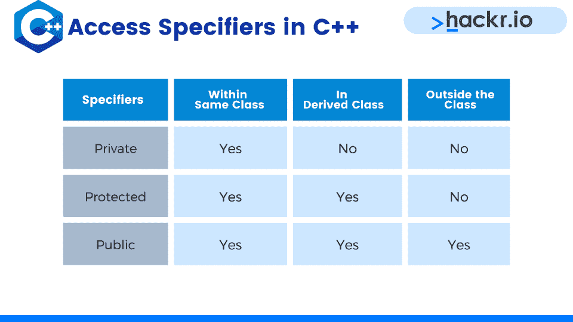
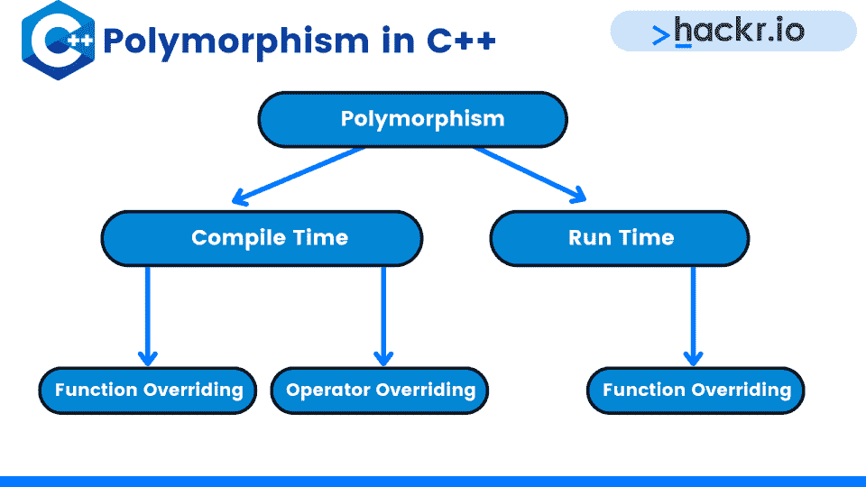

# 2023 年前 40 名 C++面试问答[更新]

> 原文：<https://hackr.io/blog/cpp-interview-questions>

C++今天仍然和它在 80 年代中期出现时一样重要。命令式面向对象编程语言作为通用编程语言被广泛使用。因此，一些工作要求应聘者对 C++有深刻的理解。

我们整理了一份最重要的 C++面试问题和答案的列表，以帮助你准备面试。我们把问题分成了基础、中级和高级。

## **顶级 C++面试问答**

### **基础 C++级面试试题**

#### **1。什么是 C++？**

C++是一种计算机编程语言，它是 C 的超集，具有额外的特性。

#### **2。C++使用 OOPS 吗？**

是的，确实如此。面向对象的编程系统是一个范例，它包括数据绑定、多态和继承等概念。

#### **3。什么是课？**

类是用户定义的数据类型，是 OOP 的核心。它反映了不同的实体、属性和动作。

#### **4。什么是对象？**

对象是类的一个实例。一个对象可以有字段、方法和构造函数。

#### **5。什么是封装？**

封装是将类中的数据和函数绑定在一起的过程。出于安全原因，它用于阻止对数据的直接访问。一个类的函数就是为了这个目的而应用的。

#### **6。什么是抽象？**

C++中的抽象是隐藏内部实现，只显示所需的细节。

例如，当你通过电子邮件发送一条重要消息时，在那个时候，只使用书写和点击发送选项。这个结果只是显示的成功消息，用于确认您的电子邮件已经发送。但是，通过电子邮件传输数据的过程不会显示出来，因为这对您没有任何用处。

#### **7。什么是继承？**

C++允许类从其他类继承一些常用的状态和行为。这个过程被称为继承。

#### **8。什么是访问说明符，有哪些类型？**

访问说明符决定了如何在类的作用域之外访问类成员，即函数和变量。



C++中有三种类型的访问说明符:

*   **Private:** 这样的类成员不能在声明它们的类之外被访问，只能在同一个类中被访问。甚至子类也不能访问其父类的私有成员。

*   **Protected:** 除了声明子类的类之外，子类还可以访问其父类的受保护成员。

*   **Public:** 声明为 Public 的类成员可以在整个程序中被访问。

#### **9。什么是名称空间？**

名称空间用于解决标识符的名称冲突，这是通过将它们放在不同的名称空间下实现的。

#### 10。什么是类模板？

类模板是赋予泛型类的名称。关键字 template 用于定义类模板。

#### **11。关键词“Volatile”的作用是什么？**

“Volatile”是一个函数，它有助于声明特定变量是易变的，从而指导编译器从外部更改变量——这样，就可以避免编译器对变量引用的优化。

#### **12。什么是存储类？**

C++中的存储类特别类似于符号的范围，包括变量、函数等。C++中的一些存储类名包括可变、自动、静态、外部、注册等。

#### 13。什么是内联函数？有可能忽略内联吗？

为了减少函数调用开销，C++提供了内联函数。顾名思义，内联函数在被调用时是以行的形式展开的。

一旦调用了内联函数，在内联函数调用的特定点上插入或替换相同的整个代码。替换是由 C++编译器在编译时完成的。小的内联函数可能会提高程序效率。

典型内联函数的语法是:

```
Inline return-type function-name(parameters)
{
// Function code goes here
} 
```

由于内联是一个请求，而不是命令，编译器可以忽略它。

#### **14。C++中可以有递归内联函数吗？**

即使在 C++中可以从内部调用内联函数，编译器也可能不会生成内联代码。这是因为编译器不会在编译时确定递归的深度。

尽管如此，具有良好优化器的编译器能够内联递归调用，直到在编译时确定了某个深度，并在编译时插入非递归调用，以应对实际深度超过运行时间的情况。

#### 15。什么是“这”指针？

“this”指针是一个常量指针，它保存当前对象的内存地址。它作为隐藏参数传递给所有非静态成员函数调用。它可以作为所有非静态函数体内的局部变量。

由于静态成员函数甚至可以在没有任何对象的情况下被调用，也就是说，没有类名，因此“this”指针对它们是不可用的。

#### 16。C 和 C++最重要的区别是什么？

*   C++支持引用，而 C 不支持。
*   像友元函数、函数重载、继承、模板和虚函数这样的特性是 C++所固有的。这些都是 C 编程语言所没有的。
*   在 C #中，异常处理是按照传统的 if-else 风格进行的。另一方面，C++在语言层面上提供了对异常处理的支持。
*   C 中主要使用的输入输出分别是 scanf()和 printf()。在 C++中，cin 是标准输入流，而 cout 是标准输出流。
*   虽然 C 是一种[过程化编程语言](https://hackr.io/blog/procedural-programming)，但 C++同时支持过程化和面向对象的编程方法。

#### **17。为什么我们需要友元类和函数？**

有时，需要允许一个特定的类访问一个类的私有或受保护的成员。解决方案是一个友元类，它可以访问声明为友元的类的受保护成员和私有成员。

与 friend 类类似，friend 函数能够访问私有和受保护的类成员。友元函数可以是全局函数，也可以是某个类的方法。

关于友元类和友元函数的一些要点:

*   友谊不是遗传的。
*   友谊不是相互的，也就是说，如果一个名为 friend 的类是另一个名为 NotAFriend 的类的朋友，那么它不会自动成为 Friend 类的朋友。
*   在一个程序中，友元类和友元函数的总数应该是有限的，因为过多的友元类和友元函数可能会导致独立类封装概念的贬值，而封装是面向对象编程的一个固有的和可取的特性。

#### 18。什么是运算符重载？

操作重载是指运算符根据传递的参数有不同的实现。这是一种多态性。

#### **19。什么是多态性？**

****

多态性是变量、函数或对象采取多种形式的能力。

#### 20。解释 vTable 和 vptr。

vTable 是一个包含函数指针的表。每个班都有一张桌子。vptr 是指向 vTable 的指针。每个对象都有一个 vptr。为了维护和使用 vptr 和 vTable，C++编译器在两个地方添加了额外的代码:

1.  在每个构造函数中——这段代码设置 vptr:

1.  正在创建的对象的
2.  指向类的 vTable

3.  带有多态函数调用的代码——在进行多态调用的每个位置，编译器都会插入代码，以便首先使用基类指针或引用查找 vptr。一旦成功提取 vptr，就可以访问派生类的 vTable。使用 vTable 访问和调用派生类函数 show()的地址。

#### **21。函数重载和运算符重载有什么不同？**

函数重载允许两个或多个不同类型和参数数量的函数具有相同的名称。另一方面，运算符重载允许为用户定义的类型重新定义运算符的工作方式。

#### **22。一个 C++程序没有 main()函数可以编译吗？**

是的，这是可能的。但是，由于 main()函数对于程序的执行是必不可少的，所以程序在编译后会停止，不会执行。

#### **23。什么是析构函数？**

析构函数是类的成员函数。它具有与类名相同的名称，并且也以波浪符号为前缀。每当一个对象失去它的作用域时，它可以被自动执行。析构函数不能重载，它只有一种不带参数的形式。

#### **24。默认的构造函数是什么？**

编译器为每个类提供了一个构造函数，以防提供者不提供相同的构造函数。这是程序员没有给构造函数提供具体参数的时候——这被称为默认构造函数。下面的示例显示了默认构造函数的代码。

```
// Cpp program to illustrate the
// concept of Constructors
#include <iostream>
using namespace std;
class construct {
public:
   int a, b;
   // Default Constructor
   construct()
   {
       a = 10;
       b = 20;
   }
};
int main()
{
   // Default constructor called automatically
   // when the object is created
   construct c;
   cout << "a: " << c.a << endl
        << "b: " << c.b;
   return 1;
} 
```

#### **25。我们能为我们的类提供一个默认的构造函数吗？**

不，我们不能为我们的类提供一个默认的构造函数。当类类型中的一个变量被设置为 null 时，这意味着它从未被初始化，结果将为零。

#### **26。关键字 struct 和 class 的主要区别是什么？**

默认情况下，关键字 struct 用于类似公共成员，而关键字 class 默认情况下用于类似私有成员。

#### **27。以下程序的输出是什么？**

```
#include <iostream>
using namespace std;
int main() 
{
 int numbers[5], sum = 0;
 cout << "Enter 5 numbers: ";
 for (int i = 0; i < 5; ++i) 
 {
 cin >> numbers[i];
 sum += numbers[i];
 }
 cout << "Sum = " << sum << endl; 
 return 0;
} 
```

该计划将要求用户输入 5 个数字，然后提出他们的总和。举个例子，

输入 5 个数字:22

25

32

46

66

总和= 191

#### **28。用一个例子解释 C++中的虚函数和运行时多态性。**

任何带有虚拟关键字的函数都表现出虚函数的行为。与根据所使用的指针或引用的类型调用的普通函数不同，虚函数是根据所指向或引用的对象的类型来调用的。

简单地说，虚函数在运行时解析，而不是更早。虚函数的使用也可以理解为利用[运行时多态性](https://www.quora.com/What-exactly-is-the-runtime-polymorphism-in-C++)的概念编写 C++程序。用 C++编写虚函数的基本要素是:

*   基类
*   派生类
*   在基类和派生类中具有相同名称的函数
*   基类类型的指针或引用，分别指向或引用派生类的对象

演示虚函数(或运行时多态性)使用的一个例子是:

```
#include <iostream>
 using namespace std;
 class Base { 
 public: 
 virtual void show() { cout<<" In Base \n"; } 
 };
 class Derived: public Base { 
 public: 
 void show() { cout<<"In Derived \n"; } 
 }; 

 int main(void) { 
 Base *bp = new Derived; 
 bp->show(); // <- Runtime Polymorphism in Action
 return 0;
}
```

在前面提到的程序中，bp 是一个 Base 类型的指针。对 bp->show()的调用调用了派生类的 show()函数。这是因为 bp 指向派生类的一个对象。

#### **29。在 C++中，结构和类的区别是什么？**

在 C++中，类和结构有两个重要的区别。这些是:

1.  当从类或其他结构派生结构时，基类或结构的默认访问说明符是公共的。相反，当派生一个类时，默认的访问说明符是私有的。
2.  默认情况下，结构的成员是公共的，而类的成员是私有的

#### 三十岁。什么是静态成员？

由 static 关键字表示，一个静态成员在程序生存期内只被分配一次静态存储区中的存储空间。关于静态成员的一些重要事实是:

*   任何静态成员函数都不能是虚拟的
*   静态成员函数没有“this”指针
*   const、const volatile 和 volatile 声明不适用于静态成员函数

#### 31。参考变量是什么？

C++中的引用变量是赋予现有变量的名称。在 C++中，变量名和引用变量 point 共享相同的内存位置，这有助于使用引用变量更新原始变量。该代码可以在下面的示例中显示。

```
#include<iostream>
using namespace std;
int main()
{
 int x = 10;
 // ref is a reference to x.
 int& ref = x;
 // Value of x is now changed to 20
 ref = 20;
 cout << "x = " << x << endl ;
 // Value of x is now changed to 30
 x = 30;
 cout << "ref = " << ref << endl ;
 return 0;
}
```

### **高级 C++面试问题**

#### 32。解释复制构造函数。

在 C++中，使用同一类的另一个对象初始化一个对象的成员函数称为复制构造函数。它们也可以成为私有的。在以下四种情况下，都可能调用复制构造函数:

1.  编译器生成一个临时对象
2.  一个对象是基于同一类的另一个对象构造的
3.  类的对象由值返回
4.  该类的对象作为参数通过值传递(即传递给函数)

复制构造函数的一般函数原型是:

class name(const class name & old _ obj)：

Point(int x1，int y1){ x = x1；y = y1}

Point(const Point & p2){ x = p2 . x；y = p2.y}

#### 33。看看下面两个打印向量的代码示例。用一个比用另一个有什么优势吗？

```
Sample Code 1:
vector vec;
/* ... .. ... */
for (auto itr = vec.begin(); itr != vec.end(); itr++) {
 itr->print();
}
Sample Code 2:
vector vec;
/* ... .. ... */
for (auto itr = vec.begin(); itr != vec.end(); ++itr) {
 itr->print();
}
```

尽管这两个代码会生成相同的输出，但示例代码 2 是一个更具性能的选项。这是因为后增量“itr++”运算符比前增量“++”运算符开销更大。

后递增运算符在递增元素并返回副本之前生成元素的副本。此外，大多数编译器会通过将示例代码 1 隐式转换为示例代码 2 来自动优化它。

#### 34。写一个程序，存储并显示一定数量学生的 GPA(平均绩点)，需要用 C++存储并显示。

```
#include<iostream>
using namespace std;
int main()
{
 int num;
 cout << "Enter the total number of students: ";
 cin >> num;
 float* ptr;
 ptr = new float[num];
 cout << "Enter the GPA of students." << endl;
 for (int i = 0; i < num; ++i)
 {
 cout << "Student" << i + 1 << ": ";
 cin >> *(ptr + i);
 }
 cout << "\nDisplaying GPA of students." << endl;
 for (int i = 0; i < num; ++i) {
 cout << "Student" << i + 1 << " :" << *(ptr + i) << endl;
 }
 delete [] ptr;
return 0;

}
```

#### 35。什么是可变存储类说明符？如何使用它们？

可变存储类说明符仅适用于该类的非静态和非常数成员变量。它用于通过声明常量类对象的成员来改变它。这可以通过使用存储类说明符来完成。

#### 36。浅抄和深抄有什么区别？

浅层拷贝和深层拷贝的区别在于:

| **浅抄** | **深度复制** |
| 允许从一个对象到另一个对象逐位进行内存转储 | 允许复制字段，这是通过从一个对象到另一个对象的字段完成的。 |
| 反映对原始对象中的新/复制对象所做的更改。 | 不反映对原始对象中的新/复制对象所做的更改。 |

#### 37。什么是抽象类？

C++中的抽象类被称为基类，它至少有一个纯虚函数。在这样的函数中，一个人不能实例化一个抽象类。这样，在类声明中声明虚成员函数时，通过使用等于零的纯说明符来定义纯虚函数。示例中的代码示例如下所示。

```
// An abstract class
class Test
{
// Data members of class
public:
// Pure Virtual Function
virtual void show() = 0;
/* Other members */
};
```

#### 38。范围解析操作符的作用是什么？

范围解析运算符的功能包括。

1.  它有助于解析各种全局变量的范围。
2.  当在类外定义函数时，它有助于将函数与类相关联。

范围解析运算符的代码可以显示如下。

```
#include <iostream>
using namespace std;
int my_var = 0;
int main(void) {
int my_var = 0;
::my_var = 1; // set global my_var to 1
my_var = 2; // setlocal my_var to 2
cout << ::my_var << ", " << my_var;
return 0;
}
```

#### 39。什么是代币？

令牌是 C++程序中各种函数的名称。标记的例子包括关键字、符号、字符串、标识符、常数等。以下示例解释了这些问题:

```
asm      bool    catch      class
const_cast   delete dynamic_cast   explicit
export   false   friend         inline
mutable  namespace   new operator
private  protected   public reinterpret_cast
static_cast  template this       throw
true     try     typeid     typename
using    virtual wchar_t
```

#### 40。C++中多重继承出现的“钻石问题”是什么？

C++中的菱形问题代表了编程语言无法使用多重和分层继承来支持混合继承。

假设我们有一所大学，有一些教员和一些研究生。在这个场景中，一个简单的继承方案可能让不同类型的人扮演不同的角色。但是，它们都继承自同一个 Person 类。

Person 类定义了一个抽象的 getRole()方法，该方法将被它的子类覆盖，以便返回正确的角色类型。到目前为止，事情很简单。然而，如果我们希望模拟助教或助教的角色，事情就会变得更复杂。

助教既是学生又是教员。该问题生成一个类似菱形的继承图，因此得名，菱形问题。

助教应该继承哪个 getRole()实现？研究生还是教员？一个可能的答案是让助教类覆盖 getRole()方法并返回一个新定义的角色，比如 TA。

然而，这样的回答也是不完整的，因为它掩盖了助教既是教师又是研究生的事实。

## **结论**

本文还涵盖了一些 C++编码面试问题和一些基于理论的问题。潜在的问题清单是巨大的，但是上面的清单是一个好的开始。不要忘记

对于每一次面试，你也应该对数据结构和算法有所了解。这个[掌握数据结构&算法使用 C 和 C++](https://click.linksynergy.com/deeplink?id=jU79Zysihs4&mid=39197&murl=https://www.udemy.com/course/datastructurescncpp/) 会有帮助。

## **常见问题解答**

#### **1。有哪些好的 C++面试问题？**

所有的基础理论，编程概念，以及一些基于代码的问题，都可以认为是好的 C++面试问题。你真的应该把重点放在 C++技术面试问题上。

#### **2。我该如何准备 C++？**

你可以通过关注 C++面试问题来为 C++面试做准备，无论是有经验的还是初学者。不要忘了 C++编码题。

#### **3。谁发明了 C++？**

Bjarne Stroustrop 在 1979 年开始致力于为 C 语言添加类。这将成为 C++，它在 1985 年首次出现。

**人也在读:**