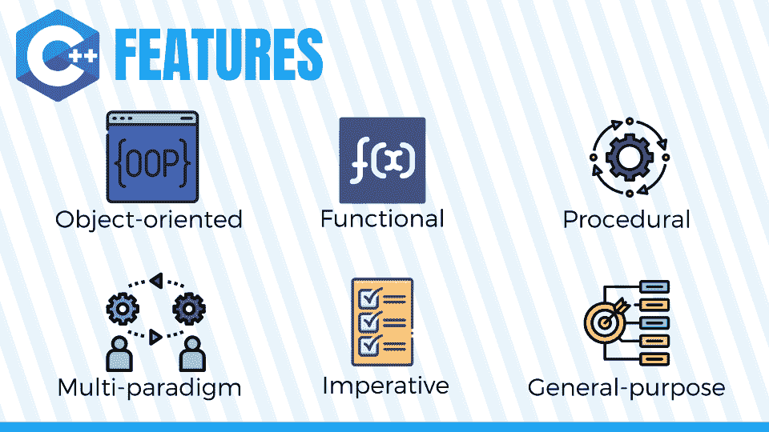
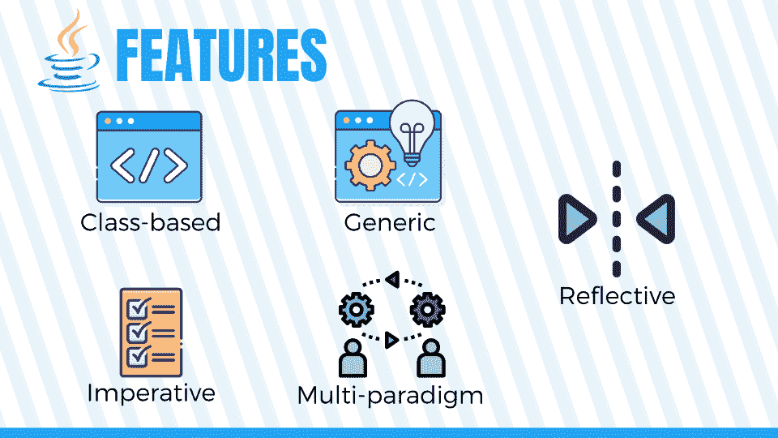

# C++与 Java:最大的差异、利弊[2023]

> 原文：<https://hackr.io/blog/cpp-vs-java>

C++和 [Java](https://hackr.io/blog/how-to-learn-java) 是编程界的大腕。这两种计算机编程语言因其广泛的应用而在 T2 很受欢迎。但是 CPP 和 Java 有什么区别呢？

学习 C++和 Java 让你对编程有一个基本的了解。因此，对于编程新手来说，它们都是很好的入门语言。这就是为什么教授编程的学校和学院将 C++和/或 Java 作为必修科目的原因。

现在，让我们看看 C++和 Java 的区别。

## **C++ Java 头头比较**

| 因素 | C++ | Java 语言(一种计算机语言，尤用于创建网站) |
| 开发人 | 比雅尼·斯特劳斯特鲁普 | 詹姆斯·高斯林 |
| 平台依赖性 | 依赖 | 自主的 |
| 主要用例 | 系统编程 | 基于 Windows、基于 web、移动和企业的应用程序 |
| 转到支持 | 是 | 不 |
| 多重遗传 | 是 | 没有；而是使用接口 |
| 运算符重载 | 是 | 不 |
| 汇编 | 编辑 | 编译和解释 |
| 按值调用和按引用调用 | 两者都支持 | 仅支持按值调用 |
| 工会和结构 | 是 | 不 |
| 面向对象 | 纯粹地 | 不完全是 |
| 内存安全 | 不 | 是 |
| 支持指针 | 是 | 不 |
| 线 | 不 | 是 |
| 接近硬件 | 是 | 不 |
| 默认参数 | 是 | 不 |
| 范围解析运算符 | 是 | 不 |
| 运行时错误检查 | 手动自动析构器是 | 不 |
| 库和框架 | Boost，BDE，Folly，JUCE，Ultimate++，Loki，CommonPP，APR，ASL，Cinder，Dlib，ETL，GLib，uSTL，Windows 模板库，STLport，MiLi 等。 | Blade、Dropwizard、GWT、JHipster、Grails、Hibernate、JavaServer Faces、MyBatis、Play、PrimeFaces、Spring Framework、Tapestry、Vaadin、Wicket 等。 |
| 应用程序 | Photoshop、Illustrator、Acrobat、InDesign、Maya、Chrome、Java VM core、Windows XP、Windows Vista、Windows 7、Windows NT、Windows 9x、Microsoft Office、Internet Explorer、Visual Studio、Mozilla Firefox | JPC，ThinkFree，NASA World Wind，Tommy Jr，蓝光 BD-J，UltraMixer，Project Looking Glass，Sun SPOT，Eclipse，Netbeans IDE |
| C++和 Java:两种流行的编程语言 | 让我们从语言及其历史的基本概述开始，深入探讨 C++和 Java 之间的异同。作为学生，C++和 Java 最大的区别是语法。Java 语法读起来更容易、更简洁——一旦你体验过 [Java 项目](https://hackr.io/blog/java-projects)，你就会注意到这一点。 | 但这并不是 Java 和 C++唯一的区别。 |

## **建议课程**

**[c++编程入门——从入门到超越](https://click.linksynergy.com/deeplink?id=jU79Zysihs4&mid=39197&murl=https%3A%2F%2Fwww.udemy.com%2Fcourse%2Fbeginning-c-plus-plus-programming%2F)**

**Java 与 C++:语言概述**

****

由比雅尼·斯特劳斯特鲁普开发的 [C++](https://hackr.io/blog/features-uses-applications-of-c-plus-plus-language) 是一种编程语言，它:

### 面向对象

多范式

功能的

*   必要的
*   [程序上的](https://hackr.io/blog/procedural-programming)
*   通用的
*   基本上，它是 C 语言的扩展。它也被称为带类的 C。除了 OOP 特性，它还拥有 C 语言的所有特性。
*   除了给你高级的特性，C++还允许低级的内存操作。
*   Java 由甲骨文公司开发，是一种面向对象的编程语言，拥有所有高级[特性](https://hackr.io/blog/features-of-java)。Sun 公司的詹姆斯·高斯林最初开发了这种语言。后来甲骨文在 2010 年收购了这家公司。



这种 OOP 语言也是一种通用语言，并且:

基于类的

必要的

一般的

*   多范式
*   反映的
*   与 C++相比，它没有给你太多的自由来执行低级的内存操作。
*   **易用性和开发速度**
*   每种语言都有各种各样的库、框架、SDK 和其他工具，使您的应用程序构建更快更容易。

**C++库和框架**

### 一些通用的 C++库和框架包括:

Boost，BDE，Folly，JUCE，Ultimate++，Loki，CommonPP，APR，ASL，Cinder，Dlib，ETL，GLib，uSTL，Windows 模板库，STLport，MiLi 等。标准 C++库是 C++标准库、标准模板库、GNU C 库、ISO C++标准委员会和 C POSIX 库。

#### 一些有用的音频 C++库包括:

FMOD、奥本纳尔、索洛德、托尼、KFR、马克西米利安、奥普斯等。一些好的 C++压缩库有 Brotli、bzip2、miniz、Minizip、smaz、Snappy、ZLib 和 KArchive。

一些优秀的人工智能操作 C++库包括:

Genann，Kaldi，Veles，MXNet，TensorFlow，Evolving Objects 等。一些很棒的 C++ GUI 库和框架有 FLTK、GTK+、Qt、wxWidgets、GacUI、MyGUI 和 Yue。

底线？C++有大量的库。查看[这里](https://github.com/fffaraz/awesome-cpp)和[这里](https://en.cppreference.com/w/cpp/links/libs)其他 C++库和框架。

**Java C++库和框架**

Java 有几个库和框架可以加快应用程序的开发。

一些著名的 Java 框架有 Blade、Dropwizard、GWT、JHipster、Grails、Hibernate、JavaServer Faces、MyBatis、Play、PrimeFaces、Spring Framework、Tapestry、Vaadin 和 Wicket。

#### 你可以在这里找到更多 Java 框架[。](https://en.wikipedia.org/wiki/List_of_Java_frameworks)

**人气**

**现实生活中的用途**

C++和 Java 是通用编程语言，这意味着您可以使用这些语言的正确工具、ide、库和框架，为几乎任何平台构建几乎任何类型的软件应用程序。

### 两者都是适销对路的编程语言。让我们来看看它们在现实生活中的一些用途:

### C++用于构建操作系统、桌面应用、网络浏览器、网络浏览器的渲染引擎、[机器学习库](https://hackr.io/blog/best-machine-learning-libraries)、涉及繁重图形处理的应用、数据库、嵌入式系统和移动应用。

C++还用于许多其他领域，如物联网、自动化、机顶盒和汽车。

另一方面，Java 非常适合构建应用服务器、web 应用、移动应用、桌面应用、单元测试、企业应用、游戏、云应用、web APIs 等等。

*   Java 还用于物联网、自动驾驶汽车、数据分析等领域。
*   **Hello-World 节目**
*   一个 C++ hello-world 程序看起来像这样:

### Java hello-world 程序如下所示:

**解释/编译**

C++是编译语言，而 Java 是解释和/或编译语言。

**跨平台应用**

```
public class SimpleProgram
{
public static void main(String [] args)
{
System.out.println("Hello, World!");
}

}
```

### 在一个操作系统上编译的 C++程序不能在另一个操作系统上运行。你需要在不同的操作系统上重新编译程序才能运行。相反，Java 程序可以在任何安装了 JVM 的平台上运行——不需要重新编译。

**生活质量:内存安全、指针和线程**

### C++不是内存安全的语言。您可以执行内存管理，这是一个很大的优势。但是可能会出现内存错误，并且在程序执行过程中可能会出现崩溃等严重问题。另一方面，Java 不允许内存操作——它是由系统控制的。另外，Java 是一种内存安全的语言。

**性能**

### C++程序一般比较快，因为不需要解释。另一方面，Java 程序并不像它们首先需要解释的那样快。

但是请记住，JVM 会自动优化您的代码，从而提高程序性能。所以通常情况下，如果 C++程序没有针对性能进行优化，Java 程序可以比 C++程序运行得更快。但是如果它在性能上做了很大的优化，它会比 Java 代码快很多。

### **c++和 Java 的其他区别**

下面是 C++和 Java 之间的一些其他差异，以便更好地定义这两种语言之间的差异。

语言抽象/接近硬件。与 Java 相比，C++是一种低级语言，更接近于硬件。Java 不接近硬件——更难产生机器级代码。

### **范围解析运算符。C++支持范围解析操作符，而 Java 不支持。**

**默认参数。在 C++中可以有默认参数，但在 Java 中没有。**

*   **“转到”语句。你可以在 C++程序中使用“go to”语句，尽管这是不好的做法。Java 没有“go to”语句。**
*   **析构函数。** C++支持析构函数，Java 不支持。
*   **继承。**c++支持多重继承，Java 不支持。
*   **运行时错误检查**。在 C++中，程序员必须检查运行时错误，而在 Java 中，系统会自动执行运行时错误检查。
*   **操作员超载。**c++里可以重载一个运算符，Java 里不行。
*   **结构和联合。** C++支持结构和联合，Java 不支持。结构和联合既复杂又强大。
*   但是 C++和 Java 也有相似之处。因为它们都是通用语言，所以你可以用 C++做任何你可以用 Java 做的事情，反之亦然——你只需要使用不同的技术。
*   **c++和 Java 的相似之处**
*   C++和 Java 类似吗？绝对的。这两种语言有相似的语法和语言特征。它们是如此的相似，以至于如果你看到一个项目中的某部分 C++代码，并被问及它是 C++还是 Java 代码，你可能会搞不清楚。

相似的功能

## C++

Java 语言(一种计算机语言，尤用于创建网站)

| 面向对象 | ✅ | ✅ |
| 主要功能 | ✅ | ✅ |
| Comment Syntax | ✅ | ✅ |
| Data Types | ✅ | ✅ |
| 环 | ✅ | ✅ |
| 条件语句 | ✅ | ✅ |
| 如果你懂 Java，学 C++也没那么难(反之亦然)。不同的程序员对于哪种语言更难或者哪种语言最好地遵循编码最佳实践会有不同的看法。 | 原始数据类型、循环、条件语句、条件运算符、算术运算符、类、变量定义、变量初始化、赋值——所有这些其他语法元素在 Java 和 C++中都非常相似。由于注释 C++和 Java 代码是相同的，这些相似之处可能会让你犯错误。 | **c++和 Java 应用程序的比较** |

理解 C++和 Java 之间的区别的最简单的方法是看看用它们设计的应用程序。

**流行的 C++应用程序**

## Adobe、亚马逊、苹果、美国电话电报公司、欧特克、彭博、脸书、谷歌、惠普、IBM、英特尔、微软和 Mozilla 等公司都使用 C++。

一些流行的 C++应用程序包括:

### Adobe Photoshop、Illustrator、Acrobat 和 InDesign

Chrome，Mozilla Firefox (Chromium)

Windows XP、Windows Vista、Windows 7、Windows NT、Windows 9x

*   Microsoft Office、Internet Explorer
*   Visual Studio、Mozilla Firefox
*   **流行的 Java 应用**
*   一些流行的 Java 应用程序包括:
*   日本生产能力中心(Japan Productivity Center)

### 免费思维

美国宇航局世界风

*   超混频器
*   投影窥镜
*   太阳黑子
*   黯然失色
*   Netbeans IDE
*   **C++与 Java 应用程序的对比**
*   C++倾向于用于更通用的应用程序，而 Java 倾向于用于需要额外的可移植性和性能的应用程序。
*   **c++和 Java 的最佳教程、课程和训练营**

### 所以，一旦你比较了 C++和 Java，你需要做出决定——你想先学哪个？大多数程序员都知道这两者。由于 Java 的实用性和受欢迎程度，它倾向于成为人们在学校学习的第一语言。

**C++学习路径**

## 成为一名 C++开发者至少需要 3-4 个月的时间。成为一名优秀的开发人员需要几年时间。你可以参加许多入门课程、项目和认证来证明你的技能——这里有一些最好的。

找出 C++是否是适合你的语言。本课程不到 10 个小时的材料，会给你一个 C++语言的基本概述。然而，它的目标是理解编程基础的人。

### 一门 25 小时的 C++基础课程。Codecademy 有一个实践学习平台，带你从头开始学习成为程序员的基础知识。本课包括变量、循环、函数和开发第一个程序的基础知识。

认真对待这次训练营。这个为期 4 个月的课程提供了成为 Udacity 纳米学位项目开发人员所需的一切知识。综合课程计划总共包括五个编码项目。

学完 C++，考虑考个 [C++认证](https://hackr.io/blog/best-cpp-certification)证明自己的技能。

**Java 学习路径**

Java 有一个非常活跃的社区，如果你有上进心和动力，你可以通过代码学习。但是你也有很好的课程可以选择:

如果你想知道更多关于 Java 能做什么，这是给你的课程。由杜克大学通过 Coursera 推出的 Java 编程是一个全面的、自定进度的程序，将带你从初学者到中级。

### 八十小时的点播视频，带你了解 Java 编程的来龙去脉。您将学习如何创建您的第一个 Java 程序、最常见的 Java 工具、数组、泛型等等。

深入探讨 Java 与现实世界的应用程序。本课程包括多项作业、15 次动手编码练习和 67 小时的视频，旨在让你成为一名成熟的 Java 工程师。

和 C++一样，考虑在完成课程后获得一个[证书](https://hackr.io/blog/java-certification-courses)——这会有所帮助。

**我该学 Java 还是 C++？**

如果你想知道“Java 比 C++容易吗”，答案可能是 Java。Java 是一种很好的第一语言，因为它更简单。C++、Java、Python——这些都被用作编程入门语言是有原因的。与 Java 相比，C++在语法方面更晦涩，甚至更古老。

但是 C++比 Java 难吗？取决于你想做什么。如果你想为 Windows 创建一个轻量级的应用程序，C++会更容易。即使 Java 和 C++之间的主要区别也不能取代两者都是伟大语言的事实，所以你总是可以先学习一种，然后再学习另一种。

### **结论:最终想法**

从这篇文章中我们了解到，C++和 Java 都是强大的语言。当决定 C++还是 Java 时，考虑花时间学习这两种语言，以便对计算机编程有一个坚实的理解。

但是如果你想选择一个，问问你自己你想构建什么样的应用。比如[想做 Windows 应用就学 C++](https://hackr.io/tutorials/learn-c-plus-plus) 。如果你想构建应用服务器或企业应用程序，[学 Java](https://hackr.io/blog/how-to-learn-java) 。

## 那么，你的下一步是什么？深入一门课程，练习你的技能，给雇主留下深刻印象。

**人也在读:**

**常见问题解答**

**1。C++比 Java 简单吗？**

作为开发人员，“最简单”的语言对你来说就是最简单的语言*。在两者中实践一个小的应用程序，发现哪一个最直观。总的来说，开发人员确实发现 Java 由于其更简单的语法而变得更容易。*

 *## **2。Java 和 C++哪个更强大？**

#### Java 和 C++都是强大的语言。对于需要跨平台能力的应用程序，Java 更受欢迎，而 C++提供了更多的机器级可访问性和更低的抽象级别。

**3。Java 和 C++哪个工作机会多？**

#### 总的来说，Java 的工作机会比 C++多。但这也取决于你的纪律；例如，如果你正在构建物联网设备，你可能会发现更多对 Java 的需求。如果你正在构建 Windows 应用程序，你可能会找到更多 C++的工作。

**4。我应该先学 Java 还是 C++？**

#### 大部分程序员都会先学 Java。Java 比较好学，学过 Java 之后再学 C++就更容易了。但是如果你正在寻找一种语法上更简单的语言，没有什么能打败 Python。

In general, there are more job opportunities in Java than C++. But this also depends on your discipline; if you’re building IoT devices, for instance, you might find more calls for Java. If you’re building Windows applications, you may find more jobs for C++.

#### **4\. Should I Learn Java or C++ First?**

Most programmers will learn Java first. Java is easier to learn, and it’s easier to learn C++ after you’ve learned Java. But if you’re looking for an easier language syntactically, nothing beats Python.*