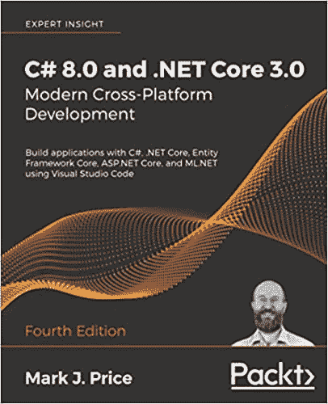
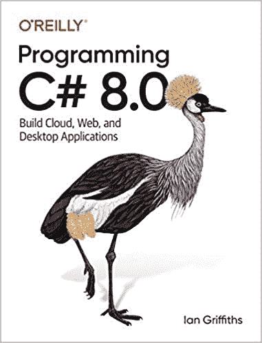
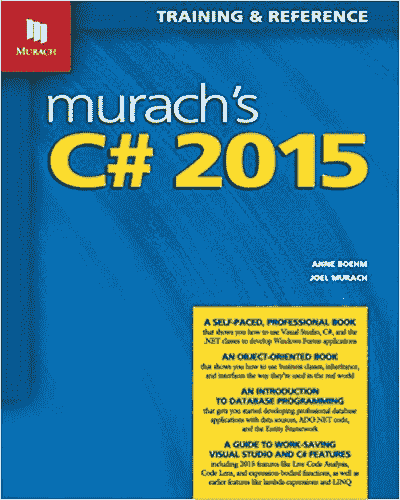
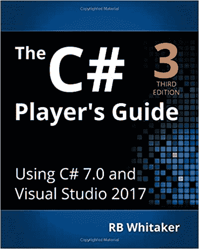
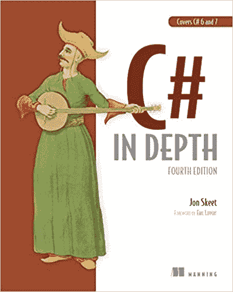
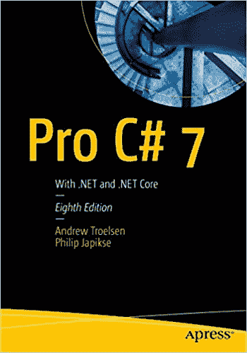

# 每个 C#开发人员都应该知道的 10 本最佳 C#书籍[更新]

> 原文：<https://hackr.io/blog/csharp-books>

## 介绍

当我们谈论 C#时，首先想到的是“速度”。这是 C#被用于游戏、VR、移动和桌面应用、web 应用、网站等等的主要原因。C#简单易学，因此是世界上最流行的编程语言。它也有一个巨大的充满活力的社区。书籍是[学习 C#](https://hackr.io/tutorials/learn-c-sharp?ref=blog-post) 的一个很好的途径，而 IDE 与实践是相辅相成的。应用程序是用 C#编写的，使用**。NET 框架**，所以 Visual Studio 非常适合 Windows 上的 IDE。

## 什么是 C#？

C#，读作 C sharp，是一种通用的、多范例的语言，它是面向对象的。它是一种强类型语言，由微软在 2000 年开发，是。NET 倡议。虽然 C#宣称 C#类似于 [Java](https://hackr.io/blog/what-is-java) ，但其设计原理大多基于 C++。C#是公共语言基础结构(CLI)的语言之一。一个简单的 C#程序示例:

```
using System;   
namespace WelcomeToHackr 
{    
    class WelcomeMsg 
    {    
        // Main function 
        static void Main(string[] args) 
        {             
            Console.WriteLine("Welcome to Hackr.io"); 
            Console.ReadKey(); 
        } 
    } 
}
```

执行时将显示“欢迎使用 Hackr.io”。

## C#的特性

C#有许多有趣和独特的特性，这使它最适合开发游戏和移动&桌面应用程序:

*   自动垃圾收集。
*   没有内存泄漏，因为内存备份很高。
*   遵循类似于 C、C++和 Java 等其他高级语言的 OOP 概念。
*   结构化和面向组件的语言。
*   高度可扩展。
*   丰富的库、高速和性能。

## 如何学习 C#？

就像其他编程语言一样，通过练习可以轻松学会 C#！作为起点，学习基本概念和语法。如果你是编程新手，考虑花些时间阅读关于编程及其基础知识如数据结构、控制结构等的博客。Hackr.io 提供最流行的在线 [C#课程和教程](https://hackr.io/tutorials/learn-c-sharp?ref=blog-post)。然而，没有什么比得上随身携带书籍。有了书，你可以按照自己的节奏学习。许多很好的、内容丰富的书从零开始教授，并继续向更高的水平发展。在下面的部分中，我们列出了一些适合自学、项目参考和专业使用的各种水平的最佳书籍。

## **最值得学习的 C#书籍**

[](https://geni.us/ygBLl) 这是一本基础书，作者涵盖了所有的核心概念和一些高级概念。书中讲述了如何用 C#做一些事情，让你了解底层技术。作者的方法简单明了，他提供了足够的例子来涵盖每个主题。无论你是新程序员还是有经验的程序员，这本书都是学习 C#的良好开端。

**特性**

*   它从安装 Visual Studio 和 Visual Studio 这样的基础知识开始，以及使用实体框架和 LINQ 进行性能调优和数据操作这样的高级主题。
*   在每章的结尾提供了许多练习。
*   有整整一章致力于 C#的实际应用。网
*   最后几章致力于使用 C#和。NET 并向您介绍 CMS 和 REST。
*   结构化方法和组织良好的主题流
*   作者在“更多信息”部分提供了许多链接，读者可以在那里找到有关互联网上特定主题的更多信息。

你可以在这里买到这本书。

[](https://geni.us/BYKTH) 奥莱利的这本书是给中高级 C#程序员看的。作者使用了非常相关的例子，让读者着迷。它是彻底的，广泛的，涵盖了语言的所有方面。这本书不涉及 Visual Studio 或。NET framework，因为它假定您已经知道至少一种编程语言(可能不是 C#)。如果你想开发高度可扩展的 web 应用程序或创建高性能的 Unity 游戏，你应该抓住这本书！

**特性**

*   作者的文笔流畅明快，表现了他对 C#的历练和透彻理解。
*   垃圾收集、异常、委托、事件等高级主题都有详细的解释。
*   如果你是编程新手，建议首先阅读该书的旧版本，它比这本书有更多的基础知识(如 OOP 概念，C#的基本语法等。)
*   作者给出了许多提高读者知识的提示、笔记和建议。
*   这本书遵循一种引导式的方法，你可以通过给出的链接或主题名称在网上查找你想了解更多的主题。

你可以在这里买到这本书。

[](https://geni.us/B4l4) 这是你收藏中必不可少的一本书，尽管它才第六版。对于初学者和有经验的 C#程序员来说，这是一个很好的信息来源。这种语言并不冗长，作者用贯穿始终的代码示例展示了每个概念。如果你已经知道 Visual Studio，你可以浏览前几章。在这本书里，我发现代码示例使用了 Windows 窗体，而不是作者强调的控制台。

**特性**

*   这本书提供了一些实际的例子，当你在做实时项目时，你可以参考这些例子。
*   内容清晰、简洁、易懂。
*   作者教学风格很棒，书也很有条理。
*   很好的参考指南，也可以自学。
*   涵盖所有基本的 OOP 概念以及构建专业级应用程序。
*   作者给出了许多有用的提示，并通过各章中的图片解释概念。

你可以在这里买到这本书。

[](https://geni.us/hFBXoU) 这是初学 c#的最佳书籍。这本书从[基本编程概念](https://hackr.io/blog/programming-paradigms)开始，所以如果你是编程新手，这本书仍然值得一读，因为它详细地涵盖了 OOP 概念。拥有 C/C++的先验知识是很有用的，这是大多数工科学生在大学期间学习的。这本书分为六个部分，其中前三部分涵盖了基础知识，后三部分略微高级(相当中级)。

**特性**

*   侧重于学习 C#，而不是向读者介绍多种工具。
*   详细介绍了所有的 OOP 概念，包括泛型。
*   每章末尾的大量练习和挑战包含了适当的难度。
*   这本书有一些没有充分探讨的地方，所以最好用在线博客来补充这些主题以获得更多信息。
*   对于那些想复习 C#知识的人来说，这是一个很好的参考。

你可以在这里买到这本书。

[](https://geni.us/HXJn) 嗯，我们都很熟悉 StackOverflow，尤其是如果你从事编程工作已经有一段时间的话。一位顶级 StackOverflow 撰稿人写了这本书。虽然是第 4 版，但这本书也涵盖了 C# 6 & 7 的重要特性。它提供了一种学习 C#的直观方法，而不仅仅是回答“如何”和“为什么”做某事。这本书是给中级开发人员看的。

**特性**

*   因为是社区贡献者写的，所以遵循的方法是有效的，记住开发人员面临的共同问题。
*   如果你不知道 C#是什么，这不是一本理想的书，但是如果你知道 C#的基础知识，比如数据类型、重要的 C #特性和编写简单的代码，这是一本很好的书。
*   这本书为中级学习者提供了适量的信息——既不太详细也不太高级。
*   作者花了大量的时间解释这些年来的新特性和 C#的发展。

你可以在这里买到这本书。

这是一本详细而详尽的书，如果你在项目开始前有时间的话，这是一个很好的学习材料。它为你日后成功完成项目打下了坚实的基础。作者花了很多时间解释核心概念和 C#背后的背景。有很多很好的代码示例，作者还把它们放在一个图中，方便参考，这是本书独有的东西。这本书是给初学者到中级学习者的。我喜欢作者为初学者提供开始计划的方式——例如，如果你对编程相当陌生，作者建议你阅读所有章节。然而，如果你有 C 语言的工作知识，他会要求你快速浏览前几章以节省时间。

**特性**

*   清晰、详细、简洁——没有赘言。
*   这些练习需要 Windows 10 才能运行。
*   详细介绍了 Visual Studio 和 C#。
*   如果这是你的第一本书，你也应该用一些在线资料来补充你的学习，尤其是关于 OOP 概念的，因为作者在开始时已经浏览过了(不过，在后面的章节中会涉及到)。
*   作者给出了许多注释，这些注释提供了解决问题的可能替代方法的见解。
*   这本书条理清晰，易于浏览和快速查找信息。

你可以在这里买到这本书。

[](https://geni.us/KPeSo6F) 这是一本为中级程序员写的令人惊叹的书。它的节奏很快，所以如果你是初学者，这本书不适合你。这本书很详细，但是你应该对 C#有一定的了解，或者至少对 C 有一定的了解。这本书还鼓励你通过网络阅读更多关于许多概念的内容，并进行深入研究以了解更多信息。

**特性**

*   它可以用作快速参考或学习指南。
*   实例讲解透彻(大量实例)。
*   如果您正在计划 C#认证，这是您的最佳选择。
*   一本书中还涵盖了。网芯，。NET API、实体框架、WPF 等。
*   详尽和密集，花时间阅读和吸收概念。

你可以在这里买到这本书。

这是一本给那些不喜欢无休止理论的人的书。它充满了实际的例子，并鼓励你从头到尾工作。你不能只是躺着看书，你必须练习。虽然作者涵盖了许多主题，但他更多地关注代码，而不是过多地研究某个功能的技术细节。每个特性/概念都有大量示例代码支持。作者鼓励您修改示例并编写自己的版本，以便更好地练习和学习。

**特性**

*   [编程](https://hackr.io/blog/what-is-programming)初学者的必备书籍。
*   对概念的清晰、简洁和敏锐的解释。
*   作者解释了各种方法及其利弊。
*   快速参考和学习指南，无需过多涉及技术方面。

你可以在这里买到这本书。

对于中级和高级 C#用户来说，这本书是很好的材料，它提供了对高级和复杂主题的深入报道。作者的方法是优雅的，因为他从一个整体的观点开始，然后随着每章的进行越来越深入。这本书通过用例很好地结合了概念理解和实际应用。尽管它是为中级学习者设计的，但是如果你有基本的编程知识，你应该可以胜任。

**特性**

*   清晰，简洁，没有任何赘言，每一行都充满了意义和知识。
*   花点时间阅读——这纯粹是技术性的，也是很好的参考。
*   核心概念和各种流行技术的详尽报道，如 WPF，UWP 等。
*   涵盖诸如序列化、正则表达式、本机 dll、COM 互操作性等主题。，这是大多数其他书籍没有涉及的。
*   作者从第一个版本开始，解释了每个新版本的改进和特性，给出了一个很好的历史和比较。

你可以在这里买到这本书。

Headfirst 书籍以其独特的视觉方式来解释概念而闻名。这本书有着恰到好处的技术细节，并在阅读更多关于 C#的高级书籍之前提供了一个良好的基础。作者风趣、机智、友好的语气弥补了这里和那里的赘述。它能让你很快学会编码，并提供了许多有助于学习的辅助信息。你可以用这本书来学习和快速复习。

**特性**

*   这不是一本全面或纯粹的技术书籍，它提供了足够的工作知识来开始编写 C#代码。
*   它提供了一种直观的学习方式，不会一次扔进很多内容。
*   这是一本适合初学者的好书，作者着重于为这些概念打下坚实的基础。
*   作者在很高的层次上提到了一些先进的概念，但没有涉及太多的细节。
*   作者解释了为什么有些东西可以工作，为什么有些东西不能工作，让你对代码和概念有一个全面的理解。

你可以在这里买到这本书。

## 额外的 C#书籍

以上 10 条是职业生涯中不同层次学习 C#的必备。此外，我们还提供了两本关于在游戏中使用 C#的书。Unity 是最好的游戏引擎之一，因此我们挑选了一些书籍来帮助你同时学习 C#和 Unity。

这本书最好的部分是它从最基本的概念开始，然后涵盖最高级的主题！您可以从编写小代码开始，并在整本书中发展您的技能，用 Unity 界面构建更复杂的系统。对初学者来说，一开始可能会有点混乱和快速，但慢慢来，你将能够跟上它。你可以用在线参考资料来补充你的学习。

**特性**

*   大量的代码示例和详尽的解释。
*   这本书分为不同的部分，第一部分详细介绍 C#，第二部分介绍 Unity，最后一部分向您介绍更高级的概念。
*   书中每一章的末尾都有很多测验。
*   作者涵盖了实际游戏设计中面临的各种挑战和问题，让你感受到实时游戏设计的体验。

你可以在这里买到这本书。

如果你以前没有游戏经验，这本书是合适的开始。作者向读者介绍了大量的示例代码和实验，以打下坚实的基础。甚至基本的代码和常见的编程任务都是以游戏为中心，从游戏的角度来呈现的。在这本书里，你可以真正体会到 C#的威力，因为你将看到它的实际应用。

**特性**

*   互动和实用的游戏设计方法。
*   对 Unity 和 C#以及两者如何一起使用的全面解释。
*   作者向您介绍了游戏世界中的许多提示和技巧。
*   这本书还涉及到 Git 及其使用，不过如果你愿意，你可以跳过它。

你可以在这里买到这本书。

## **结论**

好了，这就是所有关于书籍，乡亲们！我们已经讨论了每个级别的一些最佳书籍。你可以从任何一本初学者书籍开始你的 C#之旅，比如穆拉希的 C# 2015 第六版或 C#玩家指南(第三版)将是一个很好的起点。对于更有经验的学习者来说，从编程 C# 8.0 (O'Reilly)和 C#开始深入:第四版第四版将是一个很好的学习曲线。快乐阅读！

**人也在读:**