# 2023 年 13 项最佳 C#在线认证[更新]

> 原文：<https://hackr.io/blog/csharp-certification>

C#(读作“C-Sharp”)是一种强类型、声明性、函数式、面向对象、面向组件的多范例编程语言。C#简单、开源、灵活，并且有一个很好的社区。它是游戏开发最流行的语言，自从微软开发了它，它就有了巨大的目标受众。

有几门 C#课程可以让你用来拓展自己的职业生涯。我们在这里列出了 2023 年最好的 C#认证。首先，我们来看看 C#是什么，为什么认证很重要。

## 什么是 C#编程？

C#与 Java 非常相似，一些重要的主题是自动垃圾收集、布尔条件、泛型、语句、循环等等。

C#的一些特性是:

*   简单易学
*   高效，具有自动内存管理功能
*   维护成本低，极其安全
*   高内存备份
*   游戏开发速度快(Unity)
*   可扩展
*   丰富的内置库集

## 为什么需要 C#认证？

我们到底为什么需要任何认证？首先，当你申请新工作、加薪或升职时，证书会让你比其他有相同经历的候选人更有优势。这也告诉雇主你对这个主题有很深的理解，因为这些证书不容易获得。认证还能提升你处理更复杂项目和挑战的知识和能力。

有些人可能会说，如果你有必要的经验，认证就没有必要了。然而，有成千上万的候选人可能拥有与你相似或比你更多的经历，并从中脱颖而出；你当然需要更多的东西——那就是证书！

## 最佳 C#认证

C#认证有很多，我们为您列出了一些最重要和最受认可的认证。

[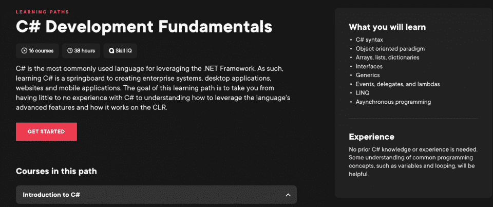](https://pluralsight.pxf.io/EaymK4)

Pluralsight 的课程很受欢迎，他们的 C#课程也相当全面。这门名为 C#开发基础的初学者课程涵盖了 C#的基础知识。这包括语言特性、应用概念和面向对象编程。对于那些没有 C#经验的人来说，这是一个完美的起点，它让你在基础上有一个彻底的基础。

#### 课程详情:

*   等级: 基本
*   语言: 英语
*   先决条件 :无
*   课程时长: 16 门课程 36 小时以上
*   课程费用: 10 天免费试用，然后每月 29 美元

#### 课程大纲:

*   C#语法
*   面向对象的范例
*   数组、列表、字典
*   接口
*   仿制药
*   事件、代表和任务
*   LINQ
*   异步编程

[报名参加课程](https://pluralsight.pxf.io/EaymK4)

Udemy 的课程很全面，被大多数公司认可。完成课程后，你可以获得一个证书，这可以让你在知名公司获得许多好机会和职位。如果你购买了一次课程，你将可以在手机或桌面上终身学习。

通过这门课程，你可以学习 C#的基础知识以及。NET 框架。该课程非常划算，Udemy 经常提供折扣，所以请务必查看折扣。你可以按你的速度完成它。

#### 课程详情:

*   课程时长: 5 小时视频
*   等级: 基本
*   11 篇文章和 10 个可下载资源
*   完工证书
*   终身使用课程
*   语言: 英语，配有法语、德语、印度尼西亚语、意大利语、波兰语、葡萄牙语、罗马尼亚语、西班牙语字幕
*   先决条件: 无
*   课程费用: 10 天免费试用，然后每月 29 美元

#### 课程大纲:

*   简介-关于参加课程
*   c#和。NET 框架。NET 应用程序架构、CLR、Visual Studio 基础知识、Resharper、简单的 C#程序以及 C#和。网络
*   原始数据类型和表达式——变量、常数、范围、转换、运算符、逻辑表达式
*   非原始数据类型——类、对象、结构、数组、字符串、枚举、引用类型与值类型
*   控制流——条件语句、迭代、随机类
*   数组和列表
*   日期、文本、输入输出和文件
*   调试和测试应用程序

[报名课程。](https://click.linksynergy.com/link?id%3DQouy7GhEEFU%26offerid%3D996030.382002%26type%3D2%26murl%3Dhttps%253A%252F%252Fwww.udemy.com%252Fcourse%252Fcsharp-tutorial-for-beginners%252F&sa=D&source=editors&ust=1646802249321110&usg=AOvVaw1zUfwz5VdbB5ZWT_rN9JPB)

[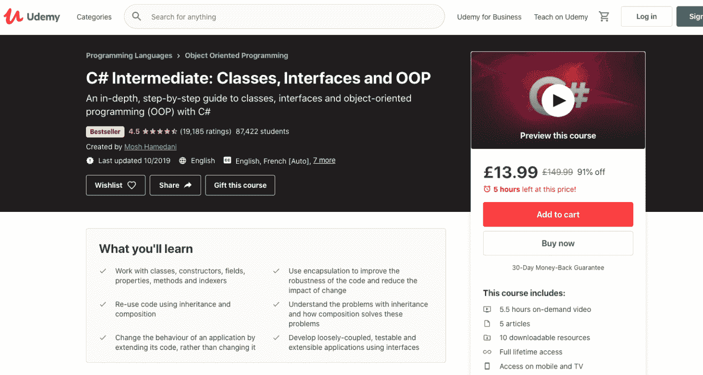](https://click.linksynergy.com/link?id%3DQouy7GhEEFU%26offerid%3D996030.383576%26type%3D2%26murl%3Dhttps%253A%252F%252Fwww.udemy.com%252Fcourse%252Fcsharp-intermediate-classes-interfaces-and-oop%252F&sa=D&source=editors&ust=1646802249324503&usg=AOvVaw0PGy-6T-eQLbIUNCkTm2uG)

如果你已经完成了基础课程，你可以继续学习这一课程。如果你有一些实践经验(通过项目或训练营项目)，你仍然可以参加这个课程，而不必完成基础课程。这是最好的课程之一，节奏很快，概念解释透彻。

#### 课程详情:

*   课程时长: 5.5 小时学习视频
*   5 篇文章和 10 个可下载资源
*   竣工证书
*   终身访问
*   语言:英语，配有法语、德语、印度尼西亚语、意大利语、波兰语、葡萄牙语、罗马尼亚语和西班牙语字幕
*   先决条件:c#基础知识
*   课程费用: 10 天免费试用，然后每月 29 美元

#### 课程 教学大纲:

*   类——构造函数、对象初始化器、方法、字段、属性、访问修饰符、索引器
*   类之间的关联——继承、类耦合、组合
*   继承——向上造型、向下造型、装箱、取消装箱
*   多态性——方法覆盖、抽象类、密封类、成员
*   接口——接口与可测试性、可扩展性、多态性

[报名课程。](https://click.linksynergy.com/link?id%3DQouy7GhEEFU%26offerid%3D996030.383576%26type%3D2%26murl%3Dhttps%253A%252F%252Fwww.udemy.com%252Fcourse%252Fcsharp-intermediate-classes-interfaces-and-oop%252F&sa=D&source=editors&ust=1646802249324503&usg=AOvVaw0PGy-6T-eQLbIUNCkTm2uG)

[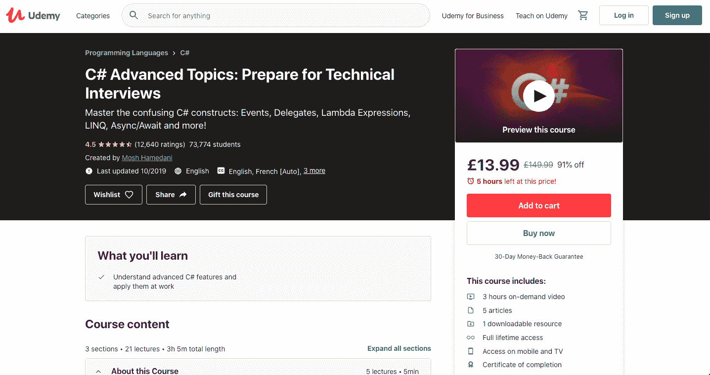](https://click.linksynergy.com/link?id%3DQouy7GhEEFU%26offerid%3D996030.356030%26type%3D2%26murl%3Dhttps%253A%252F%252Fwww.udemy.com%252Fcourse%252Fcsharp-advanced%252F&sa=D&source=editors&ust=1646802249327340&usg=AOvVaw2D4PZVciZKb15EyNhGeTch)

这是中级课程的延续课程，让你在参加面试时比其他候选人更有优势。这是一门实践课程，侧重于项目和实践经验，而不仅仅是理论，例如，我们为什么要学习一个特定的主题，以及它将如何在项目中有用。教师试图理清许多令人困惑的 C#结构。

#### 课程详情:

*   课程时长: 3 小时视频点播和 1 个可下载资源
*   5 篇文章
*   课程结业证书和终身学习证书
*   语言:英语，配有法语、德语、印度尼西亚语、意大利语、波兰语、葡萄牙语、罗马尼亚语和西班牙语字幕
*   先决条件: 中级 C#知识
*   课程费用: 10 天免费试用，然后每月 29 美元

#### 课程大纲:

*   仿制药
*   代表们
*   λ表达式
*   事件
*   扩展型号
*   可空类型
*   LINQ
*   动态
*   异常处理
*   异步/等待

[报名课程。](https://click.linksynergy.com/link?id%3DQouy7GhEEFU%26offerid%3D996030.356030%26type%3D2%26murl%3Dhttps%253A%252F%252Fwww.udemy.com%252Fcourse%252Fcsharp-advanced%252F&sa=D&source=editors&ust=1646802249327340&usg=AOvVaw2D4PZVciZKb15EyNhGeTch)

[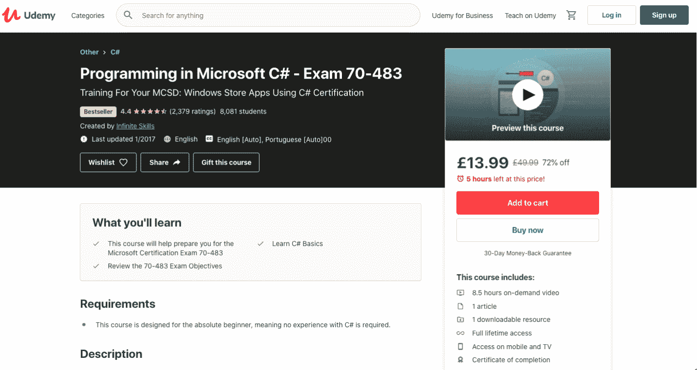](https://click.linksynergy.com/link?id%3DQouy7GhEEFU%26offerid%3D996030.451360%26type%3D2%26murl%3Dhttps%253A%252F%252Fwww.udemy.com%252Fcourse%252Fprogramming-in-microsoft-c-exam-70-483%252F&sa=D&source=editors&ust=1646802249330909&usg=AOvVaw3aojrxh-hP_G2ztbsm_OBF)

本课程将帮助您准备通过 C#认证获得 MCSD 认证。它侧重于考试内容，课程是结构化的，牢记考试目标。它是一门基础课程，也就是说没有先决条件。

本课程还谈到了 MCSD 认证，所以如果你的目标是获得 MCSD，本课程将是一个很好的起点。

#### 课程详情:

*   课程时长: 8.5 小时视频辅导
*   等级: 基本
*   1 篇文章和 1 个可下载资源
*   完工证书
*   终身访问课程材料
*   语言: 英语，带英语和葡萄牙语字幕
*   先决条件: 无

#### 课程大纲:

*   MCSD 认证选项
*   Visual studio 安装和基础知识
*   c#基础——类、对象、OOP 概念、类型、值与引用类型、集合、数组、异常、StringBuilder、stringwriter、stringreader
*   C#类型:属性和字段、访问修饰符、命名和可选参数、构造函数、静态、结构、造型、转换、装箱和拆箱、索引器
*   类层次——继承、重载、覆盖、扩展、接口、IEnumerable
*   事件和代表
*   垃圾收集
*   异步编程
*   数据安全

[报名课程。](https://click.linksynergy.com/link?id%3DQouy7GhEEFU%26offerid%3D996030.451360%26type%3D2%26murl%3Dhttps%253A%252F%252Fwww.udemy.com%252Fcourse%252Fprogramming-in-microsoft-c-exam-70-483%252F&sa=D&source=editors&ust=1646802249330909&usg=AOvVaw3aojrxh-hP_G2ztbsm_OBF)

[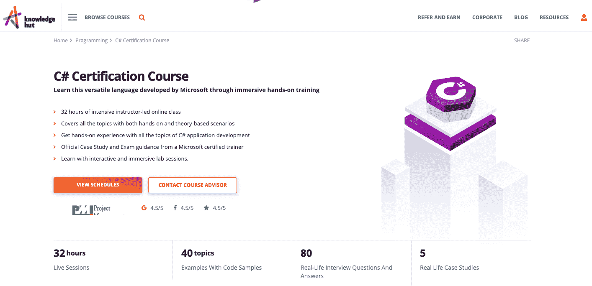](https://www.knowledgehut.com/programming/c-sharp)

KnowledgeHut 有很棒的课程，由高素质的专业人员监督，提供最优质的内容。他们提供虚拟课程和面授课程。他们与一些最好的教育机构有合作关系，因此他们的证书很有价值，被许多公司接受。

#### 课程详情:

*   课程时长: 32 小时面授课程
*   等级: 基础到高级
*   每个主题的理论和实践的良好结合
*   来自微软认证培训师的 5 个案例研究和考试指导
*   为更好地学习而进行的大量实验课程
*   80 个真人面试问答
*   40 个带有代码示例的主题
*   必备: 基础知识。NET 框架、用户界面和 C#
*   价格:【1710 美元

#### 课程大纲:

*   对…的回顾。NET 框架和 Visual studio，C#数据类型，运算符和表达式，C#构造
*   创建和调用方法、重载、异常处理、日志记录、跟踪、剖析
*   结构、枚举、集合、事件处理(创建和订阅)
*   类、接口、泛型
*   类的层次结构，继承，理解和创建从。NET 框架类
*   文件输入/输出、流、输入、输出、数据序列化和反序列化
*   创建和使用实体数据模型，使用 LINQ 查询数据
*   从网络服务和远程数据源访问数据，使用 WCF 数据服务访问数据
*   使用 XAML 设计 UI 并应用样式，将 XAML 控件绑定到数据
*   使用并行任务库进行多任务、异步操作、多线程、并发访问
*   使用动态语言运行时(DLR)创建和使用动态对象，管理对象生存期并控制非托管资源
*   创建和消费自定义属性，使用反射检查和执行程序集，使用 CodeDOM 在运行时生成托管代码，版本，签名和部署程序集
*   加密和解密数据

报名课程 [这里](https://www.knowledgehut.com/programming/c-sharp) 。

[报名课程。](https://www.knowledgehut.com/programming/c-sharp)

[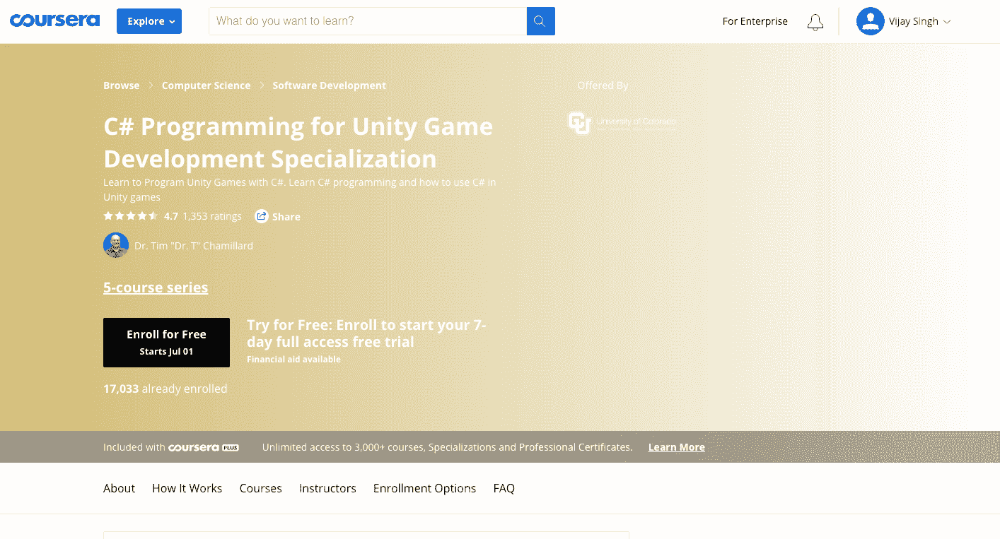](https://coursera.pxf.io/x9jLXR)

Coursera 的专业课程是 5 门课程系列的一部分。它是专门为那些想使用 Unity 进行游戏开发的人设计的。本课程假设你是一个完全的编程新手，因此没有任何先决条件。

#### 课程详情:

*   自定进度课程
*   课程持续时间: 大约 5 个月完成
*   语言: 英语带字幕英语、阿拉伯语、法语、葡萄牙语(欧洲)、意大利语、越南语、德语、俄语、西班牙语
*   可添加到您简历中的可共享认证
*   价格: 7 天免费试用，然后 39 美元/月

#### 课程大纲:

*   课程一:c#编程与 Unity 入门
*   课程二: 更多 C#编程与 Unity
*   课程三: C#类开发
*   课程四:Unity Games 中级面向对象编程

[报名课程。](https://coursera.pxf.io/x9jLXR)

[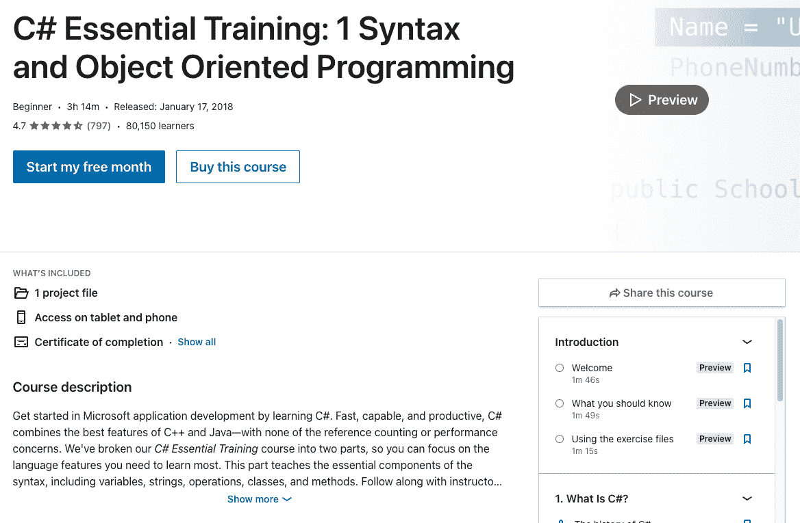](https://linkedin-learning.pxf.io/WD0PeG)

LinkedIn 课程可靠，价值巨大，因为 LinkedIn 是最值得信赖的职业平台。这些课程由行业专家设计，可以在你的简历和 LinkedIn 个人资料中脱颖而出。每门课程都有一套测验和练习，完成后你会得到一份结业证书。还有离线和纯音频选项，这是独一无二的。

#### 课程详情:

*   语言: 英语
*   类型: 初学者
*   课程时长: 3 小时 14 分 32 秒
*   课程费用: 1 个月免费试用，如果按年计费，则每月 19.99 美元，如果按月计费，则每月 39.99 美元
*   先决条件: 无

#### 课程大纲:

*   C#基础知识-历史。NET 框架，visual studio 安装，创建控制台应用程序。
*   C#语法、变量声明、内置数据类型、对象、字符串、StringBuilder、格式化程序、解析、常量和枚举、数学运算符、日期和时间
*   类和对象——类、名称空间、自动属性、封装、访问修饰符、构造函数、创建方法、静态方法、覆盖、创建 UI、处理用户输入、创建 ToString()
*   OOP——抽象类和方法、虚拟方法、接口、扩展方法

[报名课程。](https://linkedin-learning.pxf.io/WD0PeG)

[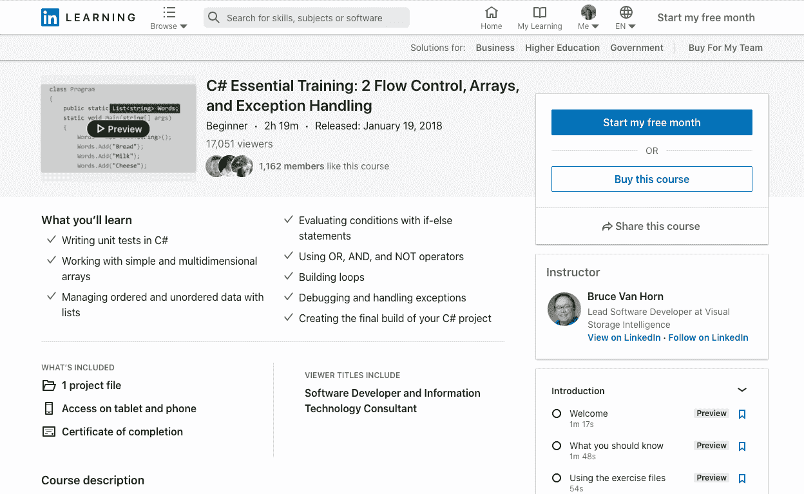](https://linkedin-learning.pxf.io/BXA2Qy)

这是上述课程的下一部分，带你从初级到中级。它涵盖了数组、集合、LINQ、控制程序流、异常处理等高级主题。

#### 课程详情:

*   语言: 英语
*   类型: 初级+中级
*   课程时长: 2 小时 19 分 45 秒
*   课程费用: 1 个月免费试用，如果按年计费，则每月 19.99 美元，如果按月计费，则每月 39.99 美元
*   先决条件: 基础 C#知识

#### 课程大纲:

*   运行单元测试以及如何进行测试驱动开发
*   数组、集合、LINQ、字典和无序数据
*   流量控制:if/else，switch，逻辑 OR，AND，NOT，for loop，while，do-while，break and continue
*   异常处理——控制台项目、运行时异常、代码调试、try-catch 块、finally 的使用
*   生产环境–获取软件包、NLog、构建

[报名课程。](https://linkedin-learning.pxf.io/BXA2Qy)

[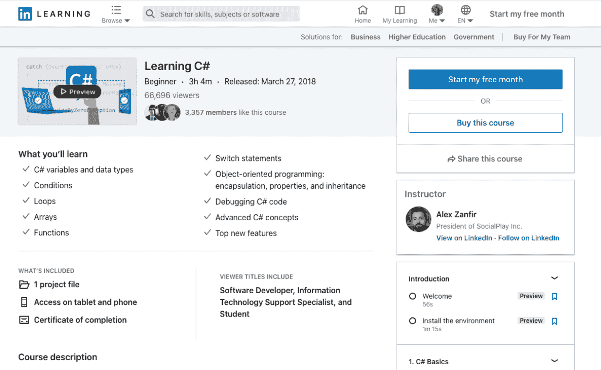](https://linkedin-learning.pxf.io/b30gBP)

本课程从语法、变量、OOP 技术等基本概念开始，然后解释一些在大多数项目中使用的重要高级概念，如枚举器、接口、事件、抽象类等。虽然这不是一个很详细的课程，但是如果你时间少，事情多，你可以做这个认证来进入一个你一直想做的有挑战性的项目。

#### 课程详情

*   语言: 英语
*   类型: 初学者
*   课程时长: 3 小时 4 分 26 秒
*   课程费用: 1 个月免费试用，如果按年计费，则每月 19.99 美元，如果按月计费，则每月 39.99 美元
*   先决条件: 无

#### 课程大纲

*   C#基础——Hello World，变量和数据类型，输入配置，条件语句，while，for 循环，数组，for each，函数，switch case，集合
*   OOP–封装、属性、成员变量、静态、名称空间、构造函数、继承
*   异常——异常处理、尝试捕捉、抛出、断点
*   高级概念——枚举器、空值、引用、out 和 ref 参数、方法重载、接口、事件、抽象类
*   新特性——自动实现的属性、匿名类型、lambda 表达式、扩展方法、可选参数、异步方法、字符串插值

[报名课程。](https://linkedin-learning.pxf.io/b30gBP)

[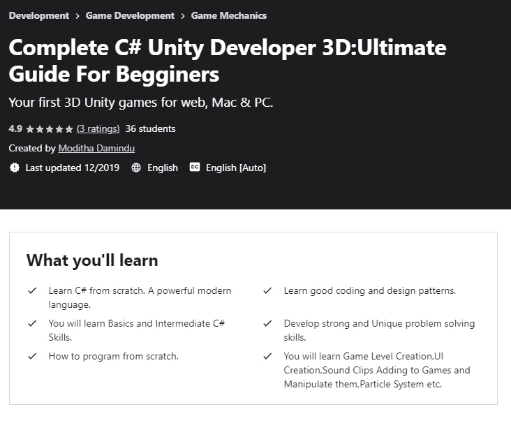](https://click.linksynergy.com/deeplink?id=Qouy7GhEEFU&mid=39197&murl=https%3A%2F%2Fwww.udemy.com%2Fcourse%2Fcomplete-c-unity-developer-3dultimate-guide-for-begginers%2F)

这个略有不同。Udemy 上完整的 C# Unity 开发者课程教你如何在 Unity 引擎上构建 3D 游戏。对于一个想要成为游戏开发者的人来说，C#几乎是强制性的，Unity 是一个流行的游戏引擎。该课程教你如何建立几种类型的游戏，包括赛车游戏和滚球生存游戏。当然，它也教你游戏设计的基础。

#### 课程详情:

*   语言: 英语
*   类型: 初学者
*   课程时长: 22.5 小时
*   课程费用: 10 天免费试用，然后每月 29 美元
*   必备: 基础编程知识

#### 课程大纲:

*   C#基础知识
*   编码和设计模式
*   基础和中级 C#技能。
*   游戏关卡创建、UI 创建、声音剪辑添加到游戏中并操纵它们、粒子系统等。

[报名课程。](https://click.linksynergy.com/deeplink?id=Qouy7GhEEFU&mid=39197&murl=https%3A%2F%2Fwww.udemy.com%2Fcourse%2Fcomplete-c-unity-developer-3dultimate-guide-for-begginers%2F)

[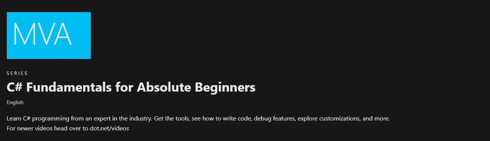](https://docs.microsoft.com/en-us/shows/CSharp-Fundamentals-for-Absolute-Beginners/)

微软为绝对初学者提供的 C#基础是这里对初学者更友好的课程之一。您将从业内专家那里学习如何用 C#编程。它还将教您一些最基本的过程，包括安装 Visual Basic Studio。课程也是免费的！

#### 课程详情:

*   语言: 英语
*   类型: 初学者
*   课程时长: 大致 8.5 小时
*   课程费用: 免费
*   先决条件: 无

#### 课程大纲:

*   C#基础知识
*   条件语句
*   数据类型和变量
*   循环
*   数据结构
*   方法
*   异常处理
*   命名空间和。网络图书馆

[报名课程。](https://docs.microsoft.com/en-us/shows/CSharp-Fundamentals-for-Absolute-Beginners/)

[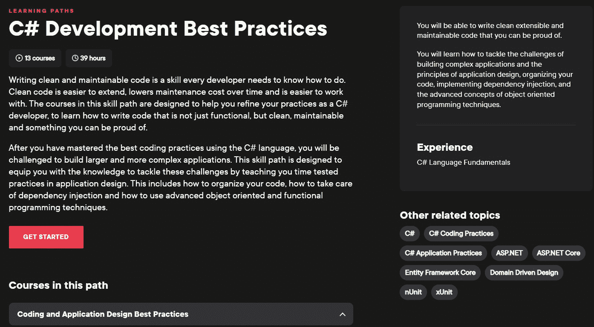](https://pluralsight.pxf.io/MXjN1q)

Pluralsight 的 C#开发最佳实践课程是另一门略有不同的课程。这不会教你如何用 C#编码，但是会教你最佳的编码实践。这包括面向对象编程、干净的编码原则、防御性编码和异步编程，以及其他许多东西。

#### 课程详情:

*   语言: 英语
*   类型: 中级
*   课程时长: 2 小时 19 分 45 秒
*   课程费用: 10 天免费试用，然后 29 美元/月
*   先决条件: 基础 C#课程

**课程大纲:**

*   面向对象编程
*   干净的编码原则
*   重构
*   坚实的原则
*   防御编码
*   异步编程

[报名课程。](https://pluralsight.pxf.io/MXjN1q)

## C#认证可以促进你的职业发展

C#认证可以让你从其他候选人中脱颖而出。这可能很难，但这些认证可以真正证明自己值得努力。在任何情况下，你都会在职业生涯中不断学习，所以一些证书会派上用场。

更多关于 C#的信息，请查看 [C#教程页面](https://hackr.io/tutorials/learn-c-sharp) 查看精选和最受欢迎的 C#课程列表。如果想准备 C#面试，也可以查看一下 [顶级 C#面试题](https://hackr.io/blog/c-sharp-interview-questions) 。

**人也在读书:**