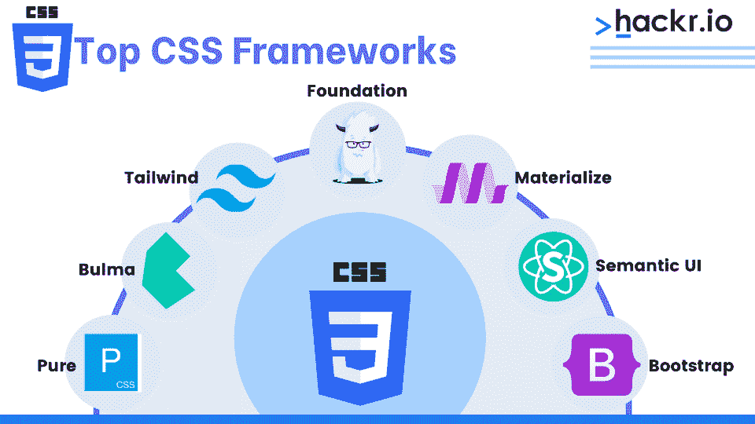
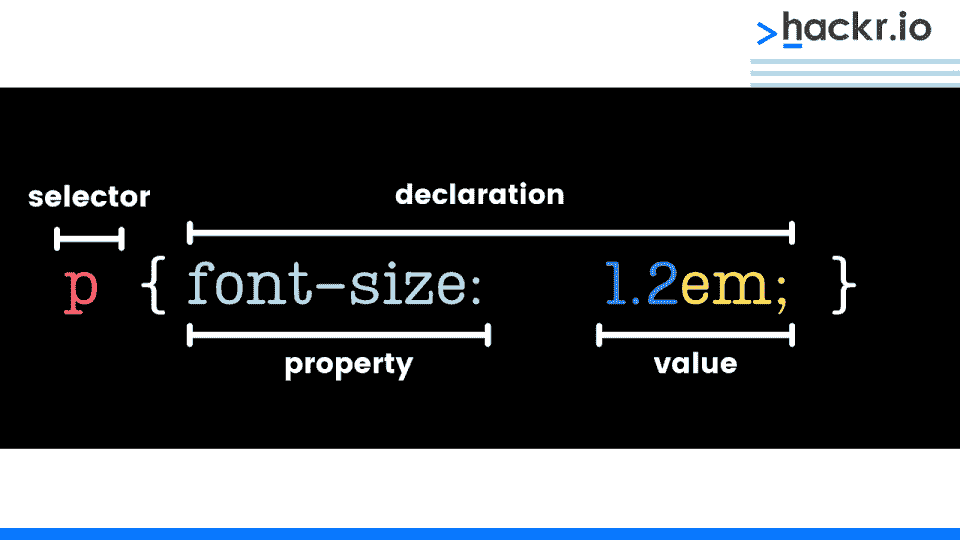
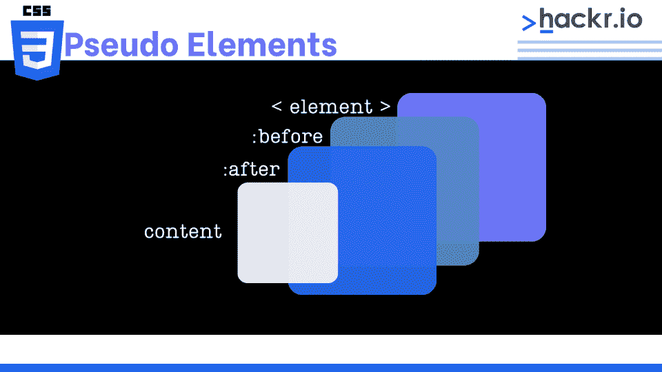

# 2023 年前 40 名 CSS 面试问答[更新]

> 原文：<https://hackr.io/blog/css-interview-questions>

级联样式表(CSS)的使用是使网站引人注目和吸引人的核心。CSS 有很大的力量，随着 web 开发一如既往地受欢迎，如果你获得了这方面的技术专长，就有很多职业前景。

在你寻找网页开发职业的旅程中，你当然要为面试做准备。我们在这里列出了顶级 CSS 面试问题和答案，分为基本问题和高级问题。

## **顶级 CSS 面试问答**

### **CSS 基本面试问题**

#### **1。什么是 CSS？**

CSS 是一种样式语言，它使 HTML 网页更加美观。它允许你在网站上添加颜色、设计和按钮等等。

#### **2。使用 CSS 有什么好处？**

使用 CSS 有多种好处，包括:

*   易接近
*   页面重新格式化
*   站点范围的一致性
*   带宽
*   呈现带宽的分离

#### **3。CSS 的缺点是什么？**

使用 CSS 的缺点是:

*   不允许特定于目标的文本、样式和规则
*   没有表情
*   没有控制伪类的动态行为
*   不可能通过选择器来提升
*   垂直控制是有限的
*   没有列声明

### 还在学 CSS？选修这门课

[CSS 学习路径(从初级到高级)](https://hackr.io/tutorials/learn-css#:~:text=CSS%20Learning%20Path%20(from%20Beginner%20to%20Advanced))

#### **4。什么是 CSS 框架？**

****

CSS 框架是预先计划好的库，使得网页样式更加方便，同时也符合标准。

#### **5。举几个 CSS 当前版本中的模块的例子。**

CSS 当前版本中一些常用的模块包括:

*   箱式模型
*   选择器
*   文本效果
*   背景和边框
*   动画片
*   2D/三维变换
*   用户界面。
*   多栏布局

#### **6。CSS2 和 CSS3 有什么区别？**

*   在 CSS2 中，所有的东西都在一个文档中，而 CSS3 被分成多个部分，称为模块。
*   与图形相关的功能，如框阴影或边框半径、flexbox 等。可以找到 CSS2 中所没有的。
*   背景位置、背景图像和背景重复样式等属性对于在单个网页中使用多个背景图像很有帮助。
*   CSS3 版本支持许多新的浏览器。
*   CSS3 以伪元素和伪类的形式引入了许多新的选择器。

#### **7。列举一些 CSS 样式的组件。**

一些 CSS 样式组件包括属性、值和选择器。

[用 HTML 和 CSS 建立反应灵敏的真实世界网站](https://click.linksynergy.com/deeplink?id=jU79Zysihs4&mid=39197&murl=https%3A%2F%2Fwww.udemy.com%2Fcourse%2Fdesign-and-develop-a-killer-website-with-html5-and-css3%2F)

#### **8。你对 CSS 不透明了解多少？**

不透明度的技术定义是允许光线穿过物体的程度。CSS 不透明度是用来描述元素透明度的属性。换句话说，它解释了图像有多清晰。

#### **9。如何改变元素的背景颜色？**

使用 background-color 属性可以更改图像的背景色。

```
body
{
background-color: coral;
}
```

#### 10。如何控制备份的映像重复？

背景重复属性控制图像在背景中的重复。如果图像将在背景中显示一次，请使用不重复。

```
<html>
<head>
<style>
body {
background-image: url("/css/images/css.jpg");
background-repeat: repeat;
}
</style>
</head>
<body>
<p>CSS Background Image: Hackr.io</p>
</body>
</html>
```

#### **11。背景位置属性有什么用？**

它可以用来定义背景图像的初始位置。默认位置是页面的左上角。可以设置的位置包括顶部、底部、左侧、右侧和中央。

```
<html>
<head>
<style>
body {
background-image: url('hackr.gif');
background-repeat: no-repeat;
background-attachment: fixed;
background-position: center;
}
<p>CSS Background Position: Hackr.io</p>
</body>
</html>
```

使用 background-scroll 属性可以控制图像在背景中的滚动。

#### 13。为什么背景和颜色要作为单独的属性？

这样做主要有两个目的:

1.  这使得样式表更加易读。本身就很复杂的背景属性，随着颜色的变化变得更加复杂。
2.  颜色是一种内在属性，而背景不是。这可能会导致很多混乱。

#### **14。如何使用 CSS1 使块元素居中？**

为了使块级元素居中，我们需要将 margin-right 和 margin-left 属性设置为显式值。

#### 15。把 CSS 整合成网页的方法有哪些？

有三种方法可以将 CSS 集成到网页中:

*   **嵌入式:**head 元素里面可以有一个 style 元素，我们可以把代码放在里面。
*   **Inline:** CSS 可以使用属性直接应用于 HTML 元素。
*   **导入或链接:**在链接或导入 CSS 的情况下，CSS 被放在一个外部文件中，并使用一个 link 元素来链接它。

#### 16。外部样式表有哪些？

外部样式表是可以链接到 HTML 页面的外部使用的表。

#### **17。什么是嵌入式样式表？**

在这些表单中，整个 HTML 文档的样式集都是在一个地方定义的。为此，应该将样式标签下的样式表信息嵌入到 HTML 文档中。

#### 18。使用外部样式表的优点和缺点是什么？

**优点:**

*   对于多个 HTML 元素，可以有许多文档，以及许多类。
*   可以使用不同的样式控制具有不同样式的多个文档。
*   选择器和分组方法可用于在复合情况下对样式进行分组。

**缺点:**

*   为了呈现文档，必须加载外部样式表。
*   它不适合小型样式定义。
*   要导入包含样式信息的文档，需要额外下载。

#### **19。嵌入式样式表的优缺点是什么？**

**优点:**

*   您可以在文档中创建不同的标签类型。
*   与外部样式表不同，不需要额外的下载。
*   在复杂的情况下，您可以使用分组和选择器方法来应用样式。

**缺点:**

*   您不能控制多个文档。

#### 20。你应该在不同的浏览器中测试网页吗？

是的，你应该在不同的浏览器中测试一个网页，因为用户使用各种各样的浏览器和版本。浏览器也会定期更新，所以您应该测试它以确保没有任何问题。

#### **21。什么是级联？**

级联通过估计可能相互冲突的各种样式规则的重要性来确定对元素应用什么规则。

#### **22。如何选择段落中的所有元素？**

您可以使用 p[lang]命令选择段落中的所有元素。

### **CSS 高级面试问题**

#### **23。CSS 选择器的含义是什么？**

****

CSS 中的选择器用于链接 HTML 和样式表元素，就像 HTML 中的 string 一样。

CSS 允许不同的媒体类型，包括语音，音频，视觉和触觉媒体，分页或连续媒体，位图或网格媒体，甚至交互式媒体。

#### **25。什么是规则集？**

规则集可用于识别彼此关联的选择器。它由两个不同的部分组成——选择器和声明。

#### **26。CSS 有多区分大小写？**

CSS 不区分大小写，但是图像和字体系列的 URL 区分大小写。CSS 只对页面上带有 XHTML DOCTYPE 的 XML 声明区分大小写。

#### **27。什么是声明块？**

声明块是一个方向目录，包括属性，后跟冒号，最后是用大括号括起来的值。

#### **28。有哪些不同的字体属性？**

各种可用的字体属性包括字体变体、字体粗细、字体样式、字体系列、字体大小的行高、标题、图标和字体系列。

#### **29。如何导入文件使其易于插入？**

导入文件有助于集成可插入多个工作表的外部工作表。不同的功能可以有不同的床单和样式。

逻辑标签比物理标签更古老，主要关注内容。它们在表达方面几乎找不到任何用法。逻辑标签在美学方面没有任何应用，而物理标签在表现方面也有应用。

#### 31。什么是伪元素？

****

伪元素用于为某些选择器提供特殊效果。CSS 可以在 HTML 标记中应用样式。如果额外的样式或标记对文档不可行，伪元素的这一特性可以在不妨碍原始文档的情况下允许额外的标记。

#### **32。什么是 Tweening？**

补间是创建两个图片之间的中间帧的过程，以便找到第一个图像发展成第二个图像的外观。

#### 33。什么是 CSS 计数器？

计数器是可以通过使用 CSS 来增加的变量，CSS 检查并找到变量的使用次数。

#### 34。什么是通用选择器？

这是一个可以匹配任何元素类型名称的选择器，而不是选择特定类别的元素。

#### 35。你如何选择一个段落的所有元素？

使用 p[lang]命令可以选择段落中的元素。

#### 36。CSS 中百分比值是如何解码的？

百分比值在 CSS 中使用百分比符号解码。

#### 37。什么是 RWD？

RWD 是响应式网页设计的缩写形式。它用于根据所考虑的设备，在任何类型的屏幕尺寸上适当地显示所设计的页面。

#### 38。CSS 的 float 属性是什么？

此属性用于根据需要将图像定位在左侧或右侧，包括环绕图像的文本。之前使用的元素的属性保持不变。

#### 39。可见性:隐藏和显示:无有什么区别？

可见性:隐藏和显示:无属性之间的区别在于，在前者的情况下，元素被隐藏但不被删除。没有空间被消耗。在后一种情况下，元素被隐藏，布局受到影响——占据了一些空间。

```
<!DOCTYPE html>
<html>
<head>
<style>
h3
{
display: none;
}
</style>
</head>
<body>
<h2>This heading is visible</h2>
<h3>This is a hidden heading</h3>
<p>The hidden heading does not take up space even after hiding it since we have used display: none;.</p>
</body>
</html>
visibility:hidden
<!DOCTYPE html>
<html>
<head>
<style>
h3 {
visibility:hidden;
}
</style>
</head>
<body>
<h2>This heading is visible</h2>
<h3>This is a hidden heading</h3>
<p>The hidden heading takes up space even after hiding it.</p>
</body>
</html>
```

#### 40。类选择器和 ID 选择器有什么区别？

类选择器采用整个块，而 ID 选择器采用与其他元素不同的单个元素。

**CSS 类选择器的使用**

```
<style>
.center {
text-align: center;
color:red;
}
</style>
```

**CSS ID 选择器的使用**

```
<style>
#para1
{
text-align: centre;
color:red;
}
</style>
```

## **结论**

CSS 面试问题和答案列表到此结束。你可能也想看看[最好的 CSS 教程](https://hackr.io/tutorials/learn-css?ref=blog-post)来做准备。最重要的是，不要忘记把你的理论知识实际运用到实际应用中去。实际动手操作是准备任何编码面试的最好方法。

## **常见问题解答**

#### **1。CSS 面试问什么问题？**

你会被问到几个不同类型的 CSS 问题。上面的列表会让你对所提问题的类型有一个很好的认识。

#### **2。CSS 有哪些局限性？**

事实上，CSS 是有局限性的。其中一些是不允许特定的文本、样式和规则，缺少表达式，以及缺少控制伪类的动态行为。

#### **3。CSS 是用来做什么的？**

CSS 是用来设计网页风格的。HTML 决定了格式，CSS 决定了它的外观，也就是说，它的外观。

**人也在读:**