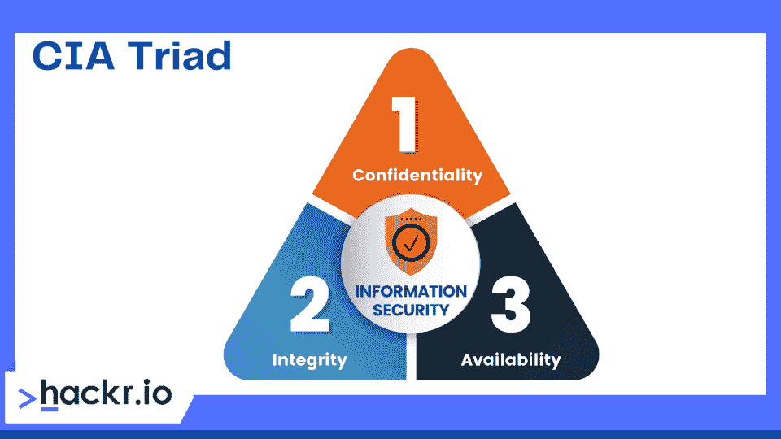
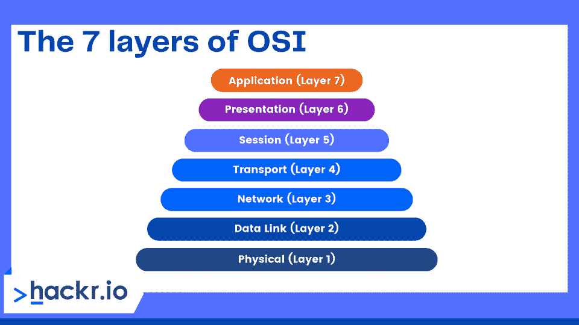
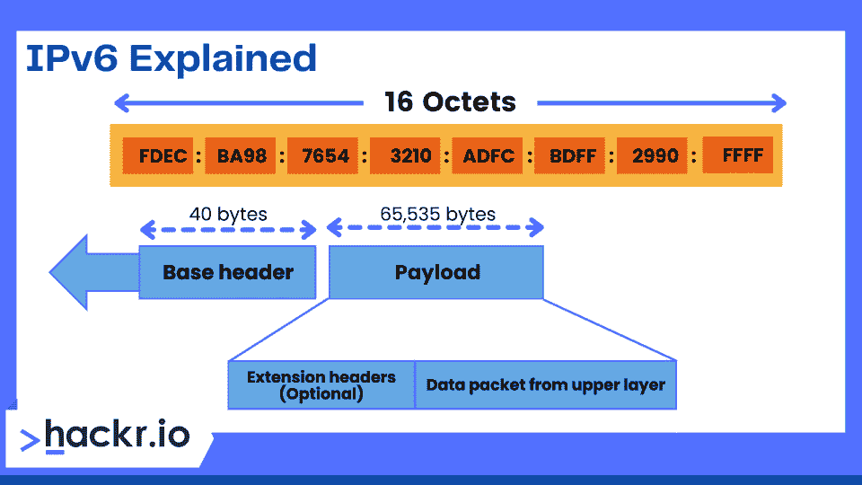
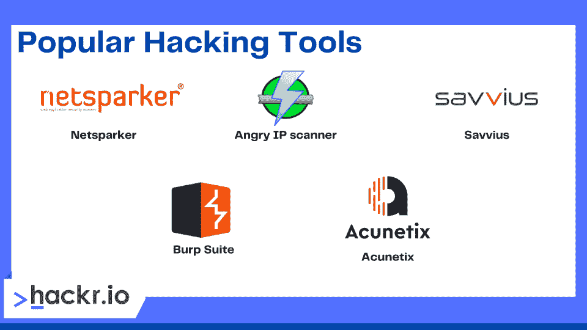

# 50+网络安全面试问答[2023]

> 原文：<https://hackr.io/blog/cyber-security-interview-questions-and-answers>

随着网络攻击变得越来越复杂和频繁，网络安全一直是科技领域不断增长的领域。网络安全专家帮助组织保护他们的公司数据和系统，包括硬件和软件。

有兴趣成为一名信息安全分析师，甚至是一名网络安全主管吗？我们收集了 2023 年你最有可能听到的顶级网络安全面试问题，包括初级、中级和高级专业人员。

## **新手和资深专业人士网络安全面试问答**

让我们从信息安全面试问题的第一部分开始:

### **大一新生基本网络安全面试问题**

#### **1。什么是密码学？**

****

密码术确保安全通信，即使是与恶意的外部参与者或对手。加密中使用算法和密钥。密钥将明文从输入转换成加密的输出(即密文)。根据特定的算法，如果使用相同的密钥，相同的明文将总是被转换成相同的密文。

#### **2。入侵检测系统和入侵防御系统有什么不同？**

一旦 IDS 或*入侵检测系统*发现入侵，管理员必须停止入侵。相反，在 IPS ( *入侵防御系统*)中，系统不仅检测入侵，还会处理它。

#### **3。加密与哈希有何不同？**

哈希和加密将一种类型的数据转换成另一种类型。加密数据可以解密并转换为原始数据，而哈希数据则无法恢复。

#### **4。组织为什么要使用防火墙？它是做什么的？**

防火墙是安装在系统或网络边界上的一种网络安全设备。它监控和管理网络流量。[网络安全](https://www.gartner.com/en/articles/7-top-trends-in-cybersecurity-for-2022)专业人员使用防火墙来保护系统和网络免受恶意软件、蠕虫和其他威胁。它们还允许您阻止内容过滤和远程访问。

#### **5。描述三次握手。**

三次握手是 TCP/IP 网络中用于建立客户端-主机连接和交换数据包的过程。以下是三步程序:

*   客户端发送 SYN(同步)来检查可用端口以及服务器是否在线。
*   如果客户端有开放的端口，服务器将发送一个 SYN-ACK 消息。
*   客户端确认该消息，并向服务器返回 ACK(确认)数据包。

#### **6。描述 traceroute。为什么就业？**

traceroute 显示数据包的路径。它列出了数据包经过的每个位置，主要是路由器，尤其是当数据包没有到达目的地时。最后，traceroute 可帮助您确定连接断开或中断的位置。

#### **7。HIDS 和 NIDS 的区别是什么？**

HIDS(主机入侵检测系统)和 NIDS(网络入侵检测系统)都是发现入侵的入侵检测系统。程序员在特定的主机或设备上使用 HIDS，这是唯一的区别。它可以监视设备的可疑系统活动和流量。但是，NIDS 是在网络上配置的。它跟踪每个*网络*设备的流量。

#### **8。web 应用程序可能的响应代码是什么？**

以下是 web 应用程序的一些可能的响应代码:

*   信息反应
*   服务器端错误
*   重寄
*   客户端错误
*   成功

#### **9。什么是中情局三合会？**

****

CIA 代表机密性、完整性和可用性。企业经常使用 CIA 模型来指导信息安全政策。

只有经过授权的人员才能访问和查看材料。强加密保护数据，因此即使黑客获得了数据，他们也无法理解。

完整性保证未经授权的个人不能破坏或修改数据。

数据必须在用户需要时随时可供用户使用。可用性对于解决网络瓶颈、定期升级、数据备份和恢复以及设备维护至关重要。

#### 10。渗透测试(PT)和漏洞评估(VA)的区别是什么？

漏洞评估是一个寻找目标*故障*的过程。在这种情况下，组织意识到其系统或网络存在缺陷或弱点，他们希望识别这些缺陷并确定它们的优先级。

同时，渗透测试是一个寻找*漏洞*的过程。在这种情况下，公司会安装他们能想到的所有安全预防措施，并希望调查他们的网络或系统中的任何漏洞。

#### **11。安装防火墙需要哪些步骤？**

以下是安装防火墙的步骤:

*   **用户名/密码:**更改防火墙设备的默认密码
*   **远程管理:**关闭远程管理功能。
*   **端口转发:**设置适当的端口转发，以确保 web 或 FTP 服务器等应用程序正常运行。
*   **DHCP 服务器:**禁用防火墙的 DHCP 服务器，确保不冲突。
*   **日志:**启用日志并学习如何查看日志来修复防火墙问题或潜在的攻击。
*   **安全策略:**为您的防火墙建立强大、可执行的安全策略。

#### **12。SSL 协议如何保证网络安全？**

SSL(安全套接字层)对发送方进行身份验证，并在浏览器和 web 服务器之间建立安全连接。然而，一旦数据被发送到服务器，它就不提供安全性。这就是为什么服务器端加密和哈希对于防止数据泄露是必要的。

下面是建立 SSL 连接的一般步骤:

*   浏览器试图与受 SSL 保护的 web 服务器建立连接。

*   浏览器的 SSL 证书副本被发送到浏览器。

*   浏览器验证 SSL 证书的可信度。如果它是可靠的，浏览器通知 web 服务器它想要创建一个加密的连接。

*   web 服务器发送一个确认消息来创建一个 SSL 加密的连接。

*   web 服务器和浏览器使用 SSL 加密进行通信。

**建议课程**

[网络安全:从初学者到专家(2023)](https://click.linksynergy.com/deeplink?id=jU79Zysihs4&mid=39197&murl=https%3A%2F%2Fwww.udemy.com%2Fcourse%2Fcybersecurity-from-beginner-to-expert%2F)

#### 13。如何保护服务器？

安全服务器使用安全套接字层(SSL)协议加密和解码数据，以防止未经授权的访问。

以下是保护服务器的四种快速方法:

*   **第一步:**确保你的 root 和管理员账号密码安全。

*   **第二步:**创建新用户来管理系统。

*   **第三步:**确保 root 和管理员账号默认不能访问互联网。

*   **步骤 4:** 为远程访问配置防火墙规则。

#### **14。你对数据泄露了解多少？**

数据泄漏是有意或无意的数据传输(私人信息从公司内部传输到未经批准的外部位置(未经授权方))。

根据发生的方式，我们可以将数据泄漏分为三类:

*   **意外泄密:**某组织因失误或错误意外向第三方发送信息。
*   **故意违反:**授权实体故意向未授权方发送数据。
*   **系统黑客:**黑客访问私人数据。

您可以使用 DLP(数据泄漏防护)工具、软件和技术来阻止数据泄漏。

#### 15。什么是暴力攻击？你能做什么来阻止它？

强力是一种通过试错来访问凭据的方法，即不断尝试所有可能的凭据组合，直到找到正确的组合。以下是避免暴力攻击的方法:

*   **最大长度密码:**指定密码的最大长度，因此找到正确的组合变得更加困难。
*   **密码复杂性:**密码中需要多种字符类型，使得暴力攻击更加困难。您可以建立对特殊字符、大小写字母和数字的要求。
*   **限制登录尝试:**对失败的登录尝试设置上限，这样就不可能尝试所有可能的密码组合。

#### 16。为什么端口会被扫描？

端口扫描是一种确定主机可用和开放端口的技术。黑客用它来利用漏洞，而管理员用它来检查网络的安全程序。

端口扫描的常用方法包括:

*   Ping 扫描
*   TCP 半开
*   TCP 连接
*   用户数据报协议(User Datagram Protocol)
*   秘密扫描

#### **17。什么是 OSI 模型层？**

****

OSI 模型是应用程序如何通过网络相互通信的标准。OSI 参考是供应商和开发商确保数字通信硬件和软件互操作性的路线图。

OSI 的各层如下:

*   **物理层:**数字数据通过通信媒介从发送方传输到接收方。

*   **数据链路层:**对数据位进行编码和解码，并控制与物理链路之间的数据传输。

*   **网络层:**转发数据包，为网络通信提供路由通道。

*   **传输层:**通过对来自上一层的数据进行分割，发送到网络层，并验证接收方收到所有数据，从而确保端到端的网络连接。

*   **会话层:**建立并管理发送方和接收方之间的会话层连接。除了启动、暂停和控制会话之外，它还负责建立、维护和同步发送方和接收方之间的联系。

*   **表示层:**以合适的方式和结构显示数据。

*   **应用层:**网络与应用之间的接口，强调在一个通信接口上的进程通信。

#### 18。什么是 VPN？

大多数网络安全面试问题都包括这个问题。VPN 代表虚拟专用网络，它创建一个安全、加密的连接。VPN 使客户端的数据能够被转发到一个隧道位置进行加密，然后再传送到另一个位置。解密后，数据现已传输到服务器。

#### **19。网络存在风险、漏洞和威胁意味着什么？**

*   威胁:对系统或组织构成威胁的人
*   漏洞:潜在黑客可能利用的系统缺陷
*   **风险:**威胁利用弱点造成损害或损失的可能性。

#### 20。“白帽”、“黑帽”、“灰帽”黑客是什么意思？

*   黑帽黑客因对进入计算机网络有广泛的了解而闻名。他们可以创建允许用户访问这些系统的恶意软件。这些黑客滥用他们的能力来窃取数据。
*   白帽黑客是道德黑客，因为他们出于正当理由使用他们的技能。企业经常雇佣他们作为安全专家，寻找并弥补系统中的安全漏洞。
*   白帽和黑帽黑客结合起来形成**灰帽黑客，**在没有所有者同意的情况下搜索漏洞。如果发现任何弱点，他们会通知业主。与黑帽黑客相反，他们不使用发现的漏洞。

#### **21。描述密码学家和密码学家之间的区别。**

密码学家计划或分析加密的任何方面。

另一方面，黑客故意将恶意软件伪装成其他东西，如有用的程序，以便在不被注意的情况下传播它。

#### **22。密码学在当代社会有哪些重要的应用？**

使用加密有几个优点，例如:

*   基于芯片的分期付款卡
*   PC 和不同的密码
*   互联网业务
*   警卫互换
*   计算机化货币
*   规划惯例
*   信息可信度

#### **23。任何需要加密的信息或数据面临的主要威胁是什么？**

有很多风险，你不可能意识到它们。至于创新的进步，同样的连锁效应也在各地增强。程序员可以访问信息，任何泄露的敏感信息都会给公司、管理部门或金融机构以及个人带来问题。如果私人数据被泄露，该协会可能会处于危险之中。

#### **24。您如何描述密钥和公钥加密？他们之间的区别是什么？**

通过执行加密计算，秘密和公开密钥加密都有助于信息安全。秘密密钥密码术可以对这两种加密进行编码和解码。

然而，公钥加密有效地采用了对称方法。该系统使用两个密钥，其中一个是有效的公钥，使得任何客户端都可以访问数据。密钥是安全的，只能由导演获得。

#### **25。什么时候需要加密收缩生成器？**

当需要对线性反馈移位寄存器的输出进行即时协作时，可以使用加密收缩生成器。它具有出色的安全品质，并且通常是自适应的，这使它成为处理信任的好技术。你也可以用它来研究数据收集方法。

#### **26。加密和解密的区别是什么？**

加密将明文转换为密文，而解密将密文转换为明文。

#### **27。什么是宋承宪？**

SSH(安全外壳)是基于硬件的 VPN 解决方案提供的不太复杂和昂贵的网络连接。

借助 SSH，我们可以通过安全的隧道远程安全地访问各种 TCP/IP 应用，并从安全的命令外壳和文件传输功能中获益。它提供了额外的优势，如预加密压缩，这可能会大大降低数据加密计算成本，以及主机认证和数据加密和完整性。

#### **28。什么是端口？**

端口是一个抽象概念，它允许程序通过不同的协议进行通信。我们将它们用于传输层协议，如 TCP、UDP 和 SMTP。

不同的服务被赋予一个端口号。例如，HTTP 使用 TCP 和 UDP 端口 80。一对系统通过使用端口号打开许多使用相同传输协议的套接字。

#### **29。什么是 IP 地址？**

IP 地址是连接到互联网或本地网络的计算机或设备的特定标识符。“互联网协议”(缩写为 IP)是一组控制通过本地或公共网络提供的数据格式的准则。由点分隔的一系列数字构成一个 IP 地址。每个 IP 地址块显示为一个四位数排列，例如 192.158.1.38。

集合中任何整数的可能值范围是 0 到 255。因此，整个 IP 地址范围是 0.0.0.0 到 255.255.255.255。每台设备都由互联网地址分配机构(IANA)分配一个 IP 地址，该机构是互联网名称与数字地址分配机构(ICANN)的一个分支机构。

#### 三十岁。静态 IP 地址与动态 IP 地址有何不同？

**动态 IP 地址**

您的 ISP 允许您临时使用动态 IP 地址。如果一个动态地址没有被使用，它可以被分配给另一个设备。IP 地址是通过 DHCP 或 PPPoE 动态分配的。

**静态 IP 地址**

静态 IP 地址会随着时间的推移保持不变。如果您有一个 web 服务器、FTP 服务器或其他互联网资源需要一个不应改变的设定地址，您可以获取一个静态 IP 地址。需要手动配置的静态 IP 地址。

#### 31。什么是 IPv6？

****

在 Internet 协议版本 6 (IPv6)寻址模型中，128 位字母数字字符串(称为 IPv6 地址)用于标识终端设备。

IPv6 地址实际上由八个 16 位组组成，总长度为 128 位。每个组有四个十六进制数字作为其表示，冒号用于分隔各组。

创建 IPv6 标准不仅是为了连接越来越多的计算设备，也是为了连接越来越多的具有嵌入式连接的项目。

在物联网(IoT)的场景中，无生命的物体、生物和人都具有通过网络独立交换数据的能力，而不需要人对人或人对计算机的交互。

#### 32。什么是僵尸网络？

僵尸网络是感染了恶意软件的计算机的集合，由攻击者控制执行一些后台任务来攻击特定目标。例如，攻击者可能使用所有被感染的计算机来加速对另一个系统的字典攻击。

#### 33。什么是 CSRF？

CSRF 代表跨站点请求伪造攻击，受害者被诱骗执行攻击者的指令。根据受害者的许可程度，攻击的效果会有所不同。这种攻击得益于这样一个事实，即当用户的身份得到验证后，网站会自动信任他们。

CSRF 的执行需要两个基本步骤:

首先，黑客欺骗目标打开页面或点击链接。通常情况下，社会工程和欺诈性链接被用来做到这一点。接下来，受害者的浏览器向网站发出人工说服请求。

#### 34。什么是 2FA？

2FA 代表“双因素识别”这是第二个安全层，确保任何试图登录在线帐户的人都是他们所声称的人。首先，用户必须提供他们的用户名和密码。

然后，他们必须提供另一条信息，通常是通过电子邮件或其他设备发送的代码。

#### 35。什么是跨站点脚本？

跨站点脚本( [XSS](https://hackr.io/blog/xss-cheat-sheet) )是一种注入，攻击者将脚本(通常是 [Javascript](https://hackr.io/blog/how-to-learn-javascript) )插入到页面中，它本质上就像是管理员自己创建的一样。

黑客可以完全改变显示，调整浏览器，甚至窃取您的会话 cookie，并以管理员身份登录 XSS。

#### 36。什么是网络嗅探？

网络嗅探截获通过网络发送的数据包。

#### 37。描述腌制程序及其目的。

Salting 使用特殊字符来延长和保护密码。此外，它还能阻止攻击者扫描系统中已识别的单词。

#### 38。描述网络安全中的弱点。

漏洞是软件代码中易受威胁者攻击的弱点。它们最常见于 SaaS。

#### 39。你对远期保密这个术语有什么理解？

前向保密是密钥协商协议的一个属性，它确保即使服务器的私钥被暴露，会话也不会被暴露。它也被称为完美的前向保密。

#### 40。什么是渗透测试？

渗透测试评估并增强组织的安全系统、网络或数据中心。有道德的黑客会寻找漏洞，并试图渗透系统以提高安全标准。

#### 41。如何使用户认证更加安全？

您可以通过要求 ID 和密钥以及 2FA 来使用户识别更加安全。

#### **42。什么是蠕虫？**

蠕虫是一种在计算机之间传播的恶意软件。

#### **43。使用公共 Wi-Fi 会带来哪些危险？**

公共 Wi-Fi 安全是一个严重的问题。Wi-Fi 攻击可能包括窥探、战争驱动、暴力攻击等等。公共 Wi-Fi 可以识别通过网络设备传输的数据，如电子邮件、浏览器历史记录、密码和信用卡信息。

#### **44。远程桌面连接的定义是什么？**

您可以使用远程桌面连接完全控制另一台计算机。

#### **45。什么是缓冲区溢出攻击？**

缓冲区溢出攻击是一种试图将额外数据写入固定长度内存块的过程。

#### **46。什么是间谍软件？**

间谍软件是一种旨在跟踪和记录您的在线活动并向远程控制报告该活动时保持不被检测到的软件。间谍软件既可以是软件也可以是硬件，它通常被安装为木马恶意软件，模拟另一个程序。作为硬件，它可以采取类似键盘记录器的设备形式，连接到计算机或网络，记录数据流、在线活动或用户名和密码。

#### **47。什么是计算机病毒？**

计算机病毒是感染并控制计算机的恶意软件。在打开附件和点击未经请求的邮件中的链接时，您应该小心，以避免感染计算机病毒。特洛伊木马、覆盖病毒和 web 脚本病毒是一些计算机病毒的例子。

#### **48。什么是 CryptoAPI？**

CryptoAPI 帮助开发人员在安全的网络上构建项目。

#### 49。什么是道德黑客？

道德黑客识别系统或程序漏洞，为网络攻击做准备。

****

一些流行的黑客工具包括:

*   网络火花
*   愤怒的 IP 扫描器
*   萨维乌斯
*   打嗝组曲
*   Acunetix

## **奖励提示**

如果您需要回忆网络安全的基本和高级概念，请查看这些全面的网络安全面试问题和答案。但你不必就此止步。

以下是赢得下一次网络安全面试的一些额外提示:

*   **准备基于场景的面试问题。**利用 STAR(情景、任务、行动和结果)技术。简单地收集你的观点，并给出一个解释情况和结果的答案。
*   尝试模拟面试。与朋友一起练习我们的安全分析师面试问题列表！
*   更新你的简历。完成了最近的一个网络安全项目，或者结束了实习？确保在你的简历中加入任何更新的内容。
*   **自信。你努力学习，为面试做了充分的准备。不要怀疑自己！**

## **结论**

这些顶级网络安全面试问题是让你自信并为下一次面试做好准备的绝佳方式。但你不必就此止步——网络安全学院项目、训练营、认证甚至教程涵盖了数据库、web 技术、密码学、网络、计算机病毒等主题。

继续深造是准备网络安全面试问题的第一步。

**人也在读:**

## **常见问题解答**

#### **1。如何做好网络安全面试？**

您应该精通主要的计算机科学相关主题，如 Web 技术、DBMS、密码学和数学，以及一些网络安全工具的实践经验。

#### **2。网络安全的三大类型是什么？**

三种主要的网络安全类型是:

*   应用程序安全性

*   网络安全性

*   云安全

#### **3。什么是网络安全中的钓鱼？**

网络钓鱼是一种社会工程形式，攻击者发送虚假消息来欺骗授权用户放弃个人信息。这使得攻击者能够在受害者的计算机上安装有害软件，如勒索软件。

#### **4。网络安全容易还是难？**

在没有任何编程知识的情况下，学习网络安全可能具有挑战性。然而，你可以从无尽的[教程](https://hackr.io/tutorials/learn-cyber-security)和[课程](https://hackr.io/blog/best-ethical-hacking-courses)中选择，为网络安全职业生涯做准备。

**人也在读:**