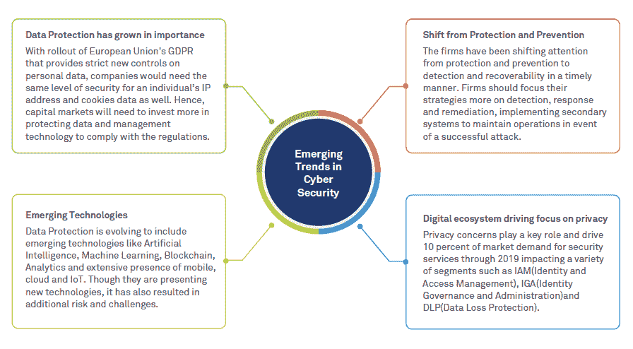

# 网络安全和新技术:是什么撼动了这个领域？

> 原文：<https://hackr.io/blog/cybersecurity-and-new-technologies>

网络安全格局正在演变。

由于技术的新进步，这个行业的未来看起来很光明。[人工智能](https://hackr.io/tutorials/learn-artificial-intelligence-ai?ref=blog-post)、[机器学习](https://hackr.io/tutorials/learn-machine-learning-ml?ref=blog-post)、物联网、[、](https://hackr.io/tutorials/learn-blockchain-programming?ref=blog-post)、5G——这些进步将是未来的一部分。然而，所有这些复杂的新技术都有黑暗的一面:双方都可以使用它。现在，网络安全和网络犯罪之间的斗争变得更加复杂。

针对品牌和政府机构的新入侵或零日攻击似乎每个月都在发生。仅今年就发生了几起高调的袭击事件。WhatsApp、NordVPN、美国海关和边境保护局以及许多其他公司都遭到了入侵。

这里有七种新兴技术，可以让这些攻击看起来很简单。

## **被攻破的人工智能**

人工智能在政府、商业和医疗保健领域的应用是无限的。例如，人工智能可以使用犯罪统计数据和犯罪记录数据来创建更准确的预测工具，从而减少犯罪。人工智能还可以帮助加快新的救命药物的研发。

然而，在错误的人手中，人工智能会成为一个严重的威胁。黑客已经在使用这项技术来规避和智取网络安全防御。网络罪犯可以使用人工智能程序来扫描网络并揭示其漏洞。人工智能预测文本可以模仿高价值的个人，欺骗目标泄露私人信息。

## **攻击者滥用云并利用加密**

黑客们已经在使用加密和沙盒来隐藏自己，而且他们越来越擅长了。加密是保护正常流量的重要工具，但它也可能会无意中隐藏不良流量，使其无法被检测到。网络罪犯使用流行的云服务来隐藏、控制和分发恶意软件。使用传统安全工具很难捕捉到这种技术，因为它看起来像常规流量。

## **自我传播的恶意软件**

在过去，恶意软件探戈需要两个人来完成。第一个舞者是被破坏的链接、文件或程序，而另一个是用户。在恶意软件传播之前，用户必须打开附件、下载文件或执行一些其他操作。今天，有新形式的混合恶意软件，而且都很可怕。

以勒索软件加密蠕虫为例。这些窃听器是基于网络的，不需要人为干预就能传播。自我传播的恶意软件更难捕捉，并能以其所在网络的速度传播。安全专家一致认为，自我传播的恶意软件可能会导致互联网瘫痪。

## **利用 5G 中的漏洞**

随着运营商开始推动 5G 成为速度更快、带宽更高的下一代无线网络，黑客可以利用这一过渡进行攻击。目标将是使用网络的 5G 设备和系统，最有可能的方法是 DDoS 攻击。更高的速度和带宽意味着更多的数据可以用流量淹没服务器，使它们关闭。

## **使用 Deepfake 技术的金融和安全诈骗**

你可能在 YouTube 上看到过汤姆·克鲁斯和唐纳德·特朗普的“深度假动作”。Deepfake 技术让人们以非常逼真的方式操纵音频和视频。Snapchat 和 Instagram 上的人脸交换滤镜就是这种技术的基本版本。复杂且制作精良的深层赝品很难识别，你很难将其与真品区分开来。

正是这种复杂程度令人担忧。当然，名人 deepfakes 的创造者这样做是为了寻求刺激和炫耀这项技术的能力。然而，许多网络安全专家警告说，黑客可能会利用这项技术进行欺诈和网络钓鱼。网络罪犯可以伪装成其他人，诱骗人们交出金钱或敏感信息。

唯一的办法就是以牙还牙，或者以人工智能对付人工智能。几家公司正在开发人工智能软件，可以检测深度假货，但这个过程需要一段时间。

**建议课程**

[网络安全:从初学者到专家(2023)](https://click.linksynergy.com/deeplink?id=jU79Zysihs4&mid=39197&murl=https%3A%2F%2Fwww.udemy.com%2Fcourse%2Fcybersecurity-from-beginner-to-expert%2F)

## **网络罪犯利用“物联网”作为新的攻击载体**

[物联网](https://hackr.io/tutorials/learn-internet-of-things-iot?ref=blog-post) (IoT)这些年来已经成为无数人生活的一部分。智能家庭网络是这项技术应用的最好例子。家用设备和电器可以通过互联网相互通信。房主还可以远程控制设备，比如开灯关灯或查看 IP 摄像头。物联网技术也用于各种类型的业务。

尽管物联网非常有用，但这项技术也存在一些安全缺陷:

*   部署物联网设备的个人或团队不会受到监控。
*   许多物联网设备创建了进入其他系统的“后门”，使它们容易受到攻击。
*   物联网供应商在修补其设备以解决已知安全问题方面一直表现不佳。
*   大多数物联网端点没有安全能力。

黑客变得越来越好，进化的速度也越来越快，因为他们有更多的工具可以使用。

## **能够破解加密数据的量子计算机**

量子计算一直是理论上的，但谷歌有其他计划。这家搜索巨头在 9 月份宣布，他们建造了一台功能正常的量子计算机。即使这项技术还没有实际应用，从现在开始每个人都必须采取预防措施。

工作量子计算机的发展是一项了不起的计算机工程成就。然而，它可能会给加密世界带来灾难。任何能得到它的人都可以利用量子物理学的力量入侵几乎任何东西。所有这些计算能力可以破解密码、信用卡交易甚至区块链中使用的加密协议。

## **结论**

安全专家和网络罪犯之间一直是一场高风险的象棋比赛。虽然新技术的出现对整个行业来说是巨大的，但它也对每个人构成了威胁。人工智能辅助的黑客可以闯入犯罪记录数据库，勒索有前科的人支付赎金。量子计算机落入坏人之手，可以轻易破解加密交易。基于网络的恶意软件可以关闭整个互联网。

网络安全专业人员必须拿出他们的最佳水平，利用所有这些技术来领先于网络犯罪分子。网络安全的未来可能像星星一样明亮，但也非常可怕。

**人也在读:**