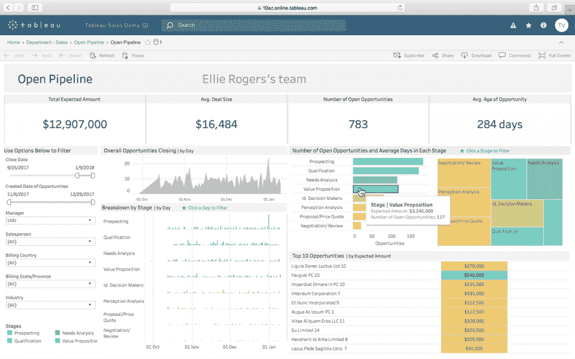
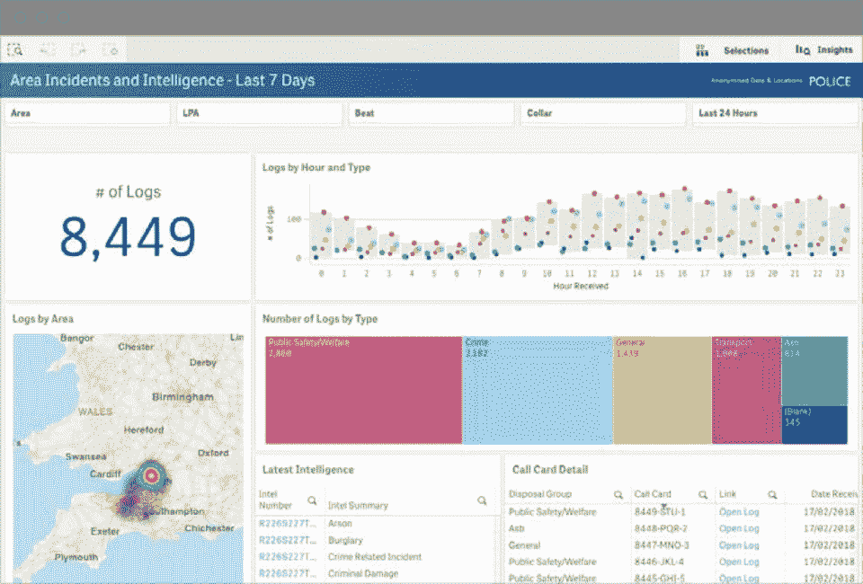
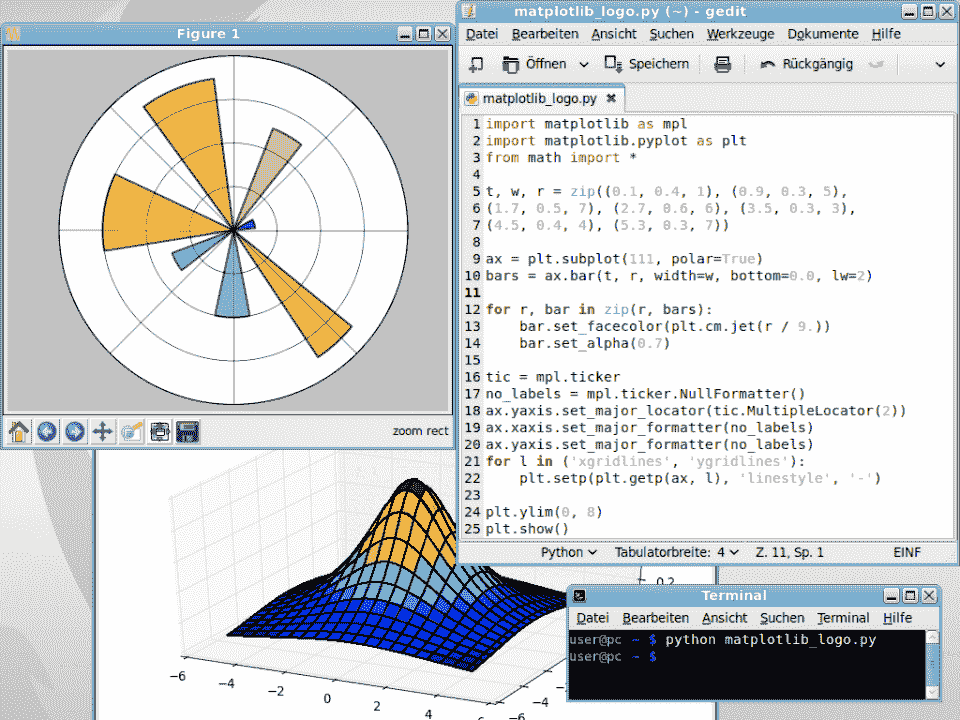

# 2023 年 30+顶级数据分析师面试问答

> 原文：<https://hackr.io/blog/data-analyst-interview-questions>

每个人在大型面试前都会紧张，尤其是在数据分析领域。但是你准备得越充分，你就越不紧张。如果你最近参加了一次数据分析师面试，那你就来对地方了。通过一点实践，你可以获得一份稳定、赚钱的数据分析师 T2 职业。

我们准备了最常见的数据分析师面试问题的完整列表，从基础到高级。

在开始下一次面试之前，请回顾以下数据分析师问题。如果答案对你来说轻而易举，那很好；熟能生巧。如果你发现自己有点磕磕绊绊，仍然很棒；你发现了需要改进的地方。

## **什么是数据分析师？**

首先，让我们谈谈数据分析师到底是什么。数据分析师是使用各种技术收集、清理和分析数据以发现有用信息来改进业务流程和决策的专业人员。这可能涉及处理来自许多来源的大量数据，包括内部系统、客户调查和财务数据。

当面试一个数据分析师的职位时，面试官想要了解你的背景、职业经历以及对常用统计语言、流程和软件套件的专业知识。数据分析师面试可能是一次技术性很强的面试——为一些难以回答的问题做好准备。

让我们从基础开始。

## **数据分析师面试的基本数据分析师面试问题**

这些入门级数据分析师面试问题期望你有不到一年的经验。你应该了解这个职位及其基础知识，但你不需要展示大数据或机器学习等高级概念的专业知识。

#### **1。数据分析师是做什么的？**

数据分析师负责收集、汇总、规范化和分析数据，以帮助企业做出更好的决策。也就是说，数据分析的领域很广。[数据分析](https://hackr.io/blog/what-is-data-analysis-methods-techniques-tools)与产品开发、营销和客户满意度相关——一整套创收和内部活动。

#### **2。您如何分析大量数据来识别趋势或模式？**

为了有效地分析大量数据，您需要建立数据收集、组织和清理流程。在你开始分析之前，数据必须是原始的；强调您如何规范化来自不同来源的数据，并确保您收集的数据是有效的。

SQL、Python 和 R 是处理数据的流行语言。此外，Tableau 和 Power BI 是流行的软件套件。讨论你过去使用过的工具、语言和软件套件，即使你非常依赖微软 Excel 或谷歌工作表等程序。概述您喜欢和不喜欢这些工具的地方。



来源: [Tableau](https://www.tableau.com/products/viewer)

#### **4。你在分析数据的时候有没有犯过错误，你是怎么恢复的？**

每个人在分析数据时都会犯错误。许多是统计性质的，从误导的数据集中收集不正确的见解。如果你被问到这个问题，诚实地回答你遇到的问题。然后，讨论问题发生的原因，您是如何解决的，以及您采取了哪些措施来避免将来出现这种问题。

**建议课程**

[数据分析大师班(4 门课程合 1)](https://click.linksynergy.com/deeplink?id=jU79Zysihs4&mid=39197&murl=https%3A%2F%2Fwww.udemy.com%2Fcourse%2Fdata-analysis-masterclass%2F)

#### **5。您如何跟上最新的数据分析趋势和最佳实践？**

为了跟上最新的数据分析趋势，与更广泛的数据科学社区保持联系非常重要。你可以阅读行业新闻，参加在线论坛，参加会议和聚会。下面是几个数据分析博客和数据分析新闻来源:[走向数据科学](https://towardsdatascience.com/)、[数据科学中心](https://www.datasciencecentral.com/)、[the Reddit r/Data Science subreddit](https://www.reddit.com/r/datascience/)。

#### **6。你认为数据分析师最重要的技能或素质是什么？**

成功的数据分析师必须具备的一些关键技能和素质包括强大的解决问题能力、出色的沟通技巧、学习热情以及使用各种软件套件和编程语言的经验。

#### **7。在您看来，数据分析师目前面临的最大挑战是什么？如何克服这些挑战？**

如今，数据分析师面临的一些最大挑战包括管理大量非结构化、不完整或不准确的数据，以及处理数据隐私和安全性等问题。虽然这些挑战可能很难克服，但关键是要有很强的解决问题的技能，并跟上最新的趋势和最佳实践。

纵观数据分析行业，大家都在遇到类似的问题。 [DevOps](https://hackr.io/blog/what-is-devops) 成熟度模型的激增和向 SaaS 的转变已经产生了由非孤岛信息流组成的大型数据湖，其中大部分是非结构化的。遵循最新趋势和最佳实践至关重要。

#### **8。你有使用 SQL 数据库的经验吗？如果是这样，您能向我们介绍一下您编写的返回特定结果的查询吗？**

入门级的数据分析师不需要成为 SQL 专家，但是他们应该能够查询数据库。用实际数据集练习模拟，例如在客户表上练习查询。

查询的一个示例可能是:

```
select customer_name from customers where customer_signup_date >= now() - 7 day;
```

9.对于创建清晰有效的数据可视化，你有什么建议？该查询将返回在过去七天内注册的所有客户，可能是为了追加销售或报告。花点时间谈谈您使用过哪些 SQL 产品，因为它们各不相同。

创建清晰有效的数据可视化的一些技巧包括使用最少的颜色和字体，避免使用三维图表，以及使用适当的图表类型。当有疑问时，保持简单。

与各种用户一起测试您的可视化效果，以确保它们易于理解和解释——并始终清楚地标记可视化效果中的所有轴和变量。必要时考虑添加注释或其他说明性文本。

注意让数据“太美”的危险，换句话说，不可读。

#### 10。关于数据分析师的角色或我们的组织，您有什么问题要问我们吗？

当面试官问你是否有问题要问他们时，不要只是沉默不语。问一些令人难忘的问题是打开你大门的好方法。准备一些关于数据分析师角色和组织本身的问题。一些示例问题包括:

*   这个角色的日常工作是什么？
*   我将向谁汇报，我将与哪些团队合作？
*   你会如何描述公司文化？
*   为什么最后一个填补这个职位的人要离开？

这些中级数据分析师工作面试问题是为有 1-3 年经验的候选人准备的。你应该能够展示对这个角色更深的理解，以及更先进的技术技能和分析方法。不过，这些问题将主要基于个人经验。

#### **11。作为数据分析师，你最具挑战性的项目是什么？你是如何克服任何障碍的？**

这个常见的行为面试问题给了你一个突出你解决问题和项目管理技能的机会。给出你如何面对挑战和克服障碍的具体例子。

例如，您可能会谈到一个困难的客户端交互或处理大量数据。为什么你觉得它很有挑战性？是怎么解决的？将来你从这个项目中学到了什么？

#### **12。你认为什么技术对数据挖掘最有效，为什么？**

这个问题会考验你的技术能力和分析方法。有许多数据挖掘技术，所以熟悉最常用的技术很重要。例如，您可能会谈到回归分析、决策树或聚类分析。解释为什么你发现每种技术是有效的，以及何时有效。

#### 13。您在使用 Hadoop、Spark 或 MapReduce 等大数据平台时感觉如何？

这个问题将测试您的技术能力和大数据平台知识。如果你有使用这些平台的经验，突出你对它们的熟悉程度，以及你使用这些平台做过的任何项目。

*   [Hadoop](https://hackr.io/blog/what-is-hadoop) 是一个开源的大数据平台，包括分布式文件系统和 MapReduce 编程。在 Hadoop 中，您可以在集群中以多种格式存储数据。
*   [Spark](https://hackr.io/blog/what-is-apache-spark) 是一个开源的数据处理引擎，可以运行在 Hadoop 之上，也可以独立运行。它是用 Scala 编写的，是一个流行的分布式处理框架。
*   MapReduce 是一种编程范式，允许在计算机集群上并行处理大型数据集。它通常被认为是一种工具，但实际上它是一个框架。

此外，准备讨论各种大数据工具和技术的利弊。

作为数据分析师，您应该有使用统计和分析工具处理复杂数据集的经验。对于这个问题，突出您使用 R 或 Python 分析大型数据集的任何经验。

这可能包括您对常用统计建模技术的了解，如线性回归、多元分析或决策树建模。此外，准备谈论您在处理大型数据集时所面临的挑战，以及您用来克服这些挑战的策略。

这是一个很好的机会来提及你在 R 或 Python 方面的任何训练营、课程或证书。

#### 15。讨论你遇到一个模糊或不完整的数据集的时候，以及你是如何试图理解它的。

给出一个具体的例子，并描述你解释它的步骤。

这可能包括您必须做额外的研究来理解数据的情况，或者您必须使用创造性的问题解决方法来提出解决方案的情况。通常，当聚合数据湖中的数据以进行进一步分析时会发生这种情况，您可能会发现数据集不完全同步。

#### 16。请告诉我们您进行的复杂分析，以及您如何将您的发现传达给那些可能不熟悉数据的人。

给出一个具体的例子，并讨论你如何与他人交流你的发现。

这可能包括您必须使用可视化或其他演示工具向非技术观众传达您的发现的情况。此外，准备讨论任何挑战以及你是如何克服它们的。

沟通对于数据分析比你想象的更关键。作为数据分析师，您了解您正在查看的数据。但是其他人对数据不太熟悉，需要帮助。

#### **17。你有建立预测模型的经验吗？如果是这样，你能给我们介绍一个更复杂的项目吗？**

谈谈你参与的一个具体项目，其中你建立了一个预测模型。如果您过去没有建立预测模型，现在可以考虑模拟一个来体验一下。

讨论构建模型所涉及的步骤，如数据清理、特征工程、模型选择和参数调整。你如何评价你的模型的性能？你采取了什么措施来改善它？

最后，概述您如何向那些可能不熟悉数据建模的人传达您的发现。

#### 18。在与团队合作时，您如何优先处理和管理不同的数据分析任务？

作为一名数据分析师，您经常需要同时处理多个项目和任务。讨论在与团队合作时，您如何优先处理和管理不同的数据分析任务。

这可能包括使用项目管理工具，如吉拉或特雷罗跟踪进展，设置明确的时间表和里程碑，或使用数据可视化工具来沟通你的工作。分享你与团队有效合作和解决潜在冲突或障碍的任何策略。

#### **19。您处理数据质量问题的方法是什么，比如丢失或不正确的值？**

讨论您处理数据质量问题的方法，如丢失或不正确的值。

这可能包括识别这些问题的策略，如可视化数据或使用数据分析工具，以及在问题出现时解决问题的方法。常见的策略包括输入缺失值、清除不正确的值或丢弃数据点。如今，机器学习被频繁使用。

#### 20。你觉得还有什么其他技能或经验与这个职位相关吗？

许多数据分析师是从一个完全不同的角色来到这个职位的。你可能主要是作为一名数据科学家工作，或者甚至是一名程序员。或者你可能有完全不同的背景(比如项目管理)。

思考你之前的角色，以及这些角色如何提高你作为数据分析师的表现。项目经理将能够干净高效地工作。数据科学家已经了解了分析的来龙去脉。程序员将拥有一套非常有利的编程技能，可以用来处理与数据相关的任务。

## **数据分析师面试的高级面试问题**

这些高级数据分析师面试问题和答案面向具有 4 年以上工作经验的候选人。你应该能够展示对该职位的深入了解，以及广泛的技术技能和分析方法。

#### **21。你认为是什么让成功的数据分析师与众不同？**

成功的数据分析师可以有效地管理和分析大量数据，与不同的利益相关者良好合作，并清晰简洁地交流他们的发现。他们能够适应不断变化的环境，并在压力下工作出色。

在这个层面上，不仅仅是数据分析；也是关于你的人际交往能力，项目管理能力，领导能力。

#### **22。您认为数据分析师最常犯的错误是什么，如何避免这些错误？**

数据分析师常犯的错误包括:

*   关注错误的指标
*   在不考虑业务环境的情况下执行分析
*   未能考虑调查结果的更广泛影响

为了避免这些错误，在执行数据分析时，您必须始终有一个明确的目标，并确保您跟踪的指标是一致的。在展示之前考虑你的发现的更广泛的含义，并解释你的分析如何能改善商业决策。

#### **23。您如何着手寻找创造性的解决方案来应对困难的数据分析挑战？**

一些关键的考虑因素包括使用广泛的数据分析技术，以及跳出框框想出创造性的解决方案。试着想想您遇到的一个数据分析难题。是怎么解决的？你的方法论有什么创新或新颖之处？

#### **24。你认为数据分析师最重要的技能是什么，为什么？**

对于数据分析师来说，一些最重要的技能包括强大的统计和数学技能，以及与利益相关方有效沟通发现的能力。可能没有“最重要的技能”，但是考虑一下哪种技能在你的职业生涯中对你最有用。是你的沟通能力吗？编程技巧？创造性思维？

#### **25。讨论你不得不使用非常规方法分析数据的时候。结果如何？**

想一想当你使用机器学习等尖端技术来分析数据的时候，或者当你必须用一种前所未有的方法来排序或过滤数据的时候。

不要害怕强调一个进展不顺利的登月项目；讨论“失败的项目”是没问题的，如果你能分解他们失败的原因，以及你现在会做什么不同的事情。

#### **26。告诉我们你作为数据分析师解决的一个特别困难的问题，以及你是如何找到正确的解决方案的。**

作为数据分析师，经常需要解决需要创造性和创新性方法的难题。回顾一个你必须特别努力的项目。

你采取了什么步骤来最终分析和解决问题？

在这里，不要只是讨论你是如何解决问题的，而是让面试官了解你的思考过程。他们不关心具体的场景；他们试图了解你的想法。

#### **27。你有使用机器学习算法的经验吗？**

回答不了这个也不用怕。在数据分析领域，机器学习仍然是一个相对较新的利基技能。但是因为这是一个非常热门的话题，所以在数据分析师的面试中，你会经常遇到这个问题。

如果你没有任何机器学习技能怎么办？

现在就考虑参加课程或训练营。很多[机器学习课程](https://hackr.io/blog/machine-learning-courses)是专门为数据分析师和初学程序员设计的。即使你没有直接的工作经验，至少能够说你参加了一门课程(或者甚至获得了一个证书)也是值得的。

#### **28。在与团队或大型组织合作时，您如何区分各种数据分析任务的优先级？**

高级数据分析师角色可能需要担任项目经理或基础团队成员。因此，这不仅仅是关于分析，也是关于你的管理风格和技能。

在大型组织中，对数据分析任务进行优先级排序可能是一项挑战，尤其是当涉及多个利益相关方和相互冲突的优先级时。一个关键的策略是了解不同利益相关者的需求和目标，并为每项任务设定明确的优先级和时间表。

#### **29。如果给你无限的预算来提高我们组织的数据分析能力，你会怎么做？**

这是一个需要你从大处着眼的难题。面试官想知道你是否有远见，能看到“大局”他们还想知道你是否能跳出框框思考，并对问题提出创造性的解决方案。

解决这个问题的一种方法是确定组织中目前缺少高级数据分析所需的能力或工具的领域。您可能会建议构建一个数据仓库来集中和聚合所有相关的数据，或者使用一个数据湖来集中和聚合您的数据，而无需物理地移动它。另一种方法是确定关键人员(数据专家、分析师等)。)需要雇佣或培训，以增强组织的数据分析能力。

把这个问题反过来问面试官。一旦你给出了答案，就问:“这只是我的观点。你觉得什么最重要？”这将让你对你在组织中的角色、他们对变革的准备程度以及他们当前的主要痛点有着深刻的认识。

## **数据分析师技术面试问题**

数据分析师使用许多不同的工具。没有标准。有的公司用 Tableau，有的用 Power BI。正因为如此，你可能会遇到一些让你吃惊的技术性面试问题。

#### 三十岁。你有什么使用 R 或 Python 进行数据分析和可视化的经验？

对于数据分析师职位来说，这是一个常见的问题，尤其是当这个角色需要编码或脚本时。面试官想知道你是否具备在他们的组织中进行数据分析的必要技能，并且可能会进一步探究你使用这些工具的经验。

要回答这个问题，请简要概述一下您使用 R 或 Python 进行数据分析的经历。如果您对这两种工具都有丰富的经验，请提及这一点，并解释您如何决定对每个特定任务使用哪种工具。如果你只有使用其中一种工具的经验，重点解释你的工作流程以及你如何使用该工具进行数据分析。

一点经验都没有？考虑考个 [Python 认证](https://hackr.io/blog/python-certification)。

#### 31。请告诉我们您使用 Tableau、Power BI、QlikView 或其他流行的数据分析平台的体验。

这是在数据分析师访谈中经常被问到的另一个问题，尤其是在大型组织中。面试官想知道你是否有使用他们公司特定数据分析平台的经验。

要回答这个问题，请简要概述您使用相关平台的体验。如果你有使用多种平台的丰富经验，提及这一点并解释你如何决定每个特定任务使用哪个平台。

去面试之前，先看一下职位描述。它通常会提到一些你可以温习的关键技术。



资料来源: [Qlik](https://www.qlik.com/us/dashboard-examples)

#### 32。您对用 SQL 编写数据库查询有多熟悉，您使用过其他数据库技术吗？

简要概述您编写 [SQL 命令/查询](https://hackr.io/blog/sql-commands)和使用其他数据库技术的经历。如果您对多种数据库技术有丰富的经验，请谈谈您更喜欢哪种技术以及它们的优缺点。

简要概述您使用 D3.js、ggplot2 或 Matplotlib 等数据可视化和布局工具的体验。如果你有使用多种工具的丰富经验，提及这一点并解释你是如何决定每个特定任务使用哪种工具的。如果你有任何数据可视化的例子，现在是时候拿出来了。



资料来源:[维基媒体共用](https://commons.wikimedia.org/wiki/File:Matplotlib_screenshot.png)

#### 34。你有使用基于云的平台处理大型数据集的经验吗，比如 Amazon Web Services 或 Google BigQuery？

这个问题经常在大型组织的面试中被问到。面试官想知道你是否有使用基于云的系统的经验。考虑获得 AWS 云或谷歌技术认证——认证将证明你的技能，让你更容易证明你的经验。

## **应对下一次数据分析师面试的技巧**

你的简历已经足够让公司感兴趣了——他们已经知道你有这个技能。准备好面试问题，和朋友模拟面试，最重要的是，尽量放松自信。你不只是向他们证明你自己。他们还需要证明他们是你的好去处。

以下是应对下一次数据分析师面试的一些技巧:

*   练习您的 Python、SQL 技能和 R 技能。作为一名数据分析师，你需要有很强的数据库技能。了解 SQL 和 R 可以帮助你从只有理论知识的分析师中脱颖而出。
*   讨论你参与过的具体项目。面试官可能想听听你作为数据分析师处理过的一些更具挑战性的项目。
*   想想你如何处理不明确或不完整的数据集。这是数据分析师面临的一个常见问题，面试官想知道你会如何处理。
*   讨论你分析复杂数据集的方法。面试官想知道你依靠什么工具和技术来处理大型和/或难以处理的数据集。
*   准备一些你最好的数据可视化的例子。作为一名数据分析师，你需要熟练使用图表和图形来传达你的发现。拥有强有力的例子可以帮助你在面试过程中从其他候选人中脱颖而出。

你面试得越多，你就越会做得更好。但是你准备得越充分，这个过程就越不令人担心。

## **结论**

以上数据分析师面试问题有助于你准备下一次面试。但是没有什么比仅仅了解你的材料更好的了。在深入研究数据分析师行为面试问题或类似问题之前，考虑参加一个简短的复习课程或教程。这将帮助你提高你的技能，找出你觉得不确定的地方。

今天就来上一堂[谷歌数据分析教程](https://hackr.io/tutorials/learn-google-analytics)吧！

## **常见问题解答**

#### **1。我该如何准备数据分析师面试？**

准备数据分析师面试的最佳方式因你申请的具体职位而异。一般来说，最好是温习一下 SQL、Python 和 R 技能，准备好讨论您参与过的具体项目，并仔细思考处理模糊或不完整数据集的方法。复习机器学习、非结构化数据集、云平台等概念。

#### **2。数据分析师面试会问哪些问题？**

数据分析师面试中问的具体问题会因公司和你申请的职位而异。然而，常见的问题包括行为面试问题，如“告诉我你面对困难数据集的一次经历”，以及技术面试问题，如“你将如何分析非结构化数据？”此外，可能会要求您提供最佳数据可视化示例。

#### **3。一个数据分析师需要具备哪些技能？**

数据分析师的技能会因你申请的具体职位而异。但是一般来说，强大的分析技能、对 SQL、R 和 Python 的熟练程度以及处理大型数据集的经验是必不可少的。其他重要技能包括:

*   出色的沟通
*   批判性思维和解决问题
*   对机器学习的理解
*   独立工作的能力

#### **4。数据分析师是个好职业吗？**

随着各种类型的企业和组织收集和分析大量数据，数据分析师的需求很大。数据分析师在帮助组织做出明智决策方面发挥着至关重要的作用，他们通常能够获得高薪。

随着企业越来越依赖数据来推动其业务战略和运营，未来几年对数据分析师的需求可能会增长。此外，数据分析被纳入许多主要领域(从工程到营销)，使数据分析师成为其他数据相关角色的轻松候选人。

**人也在读:**