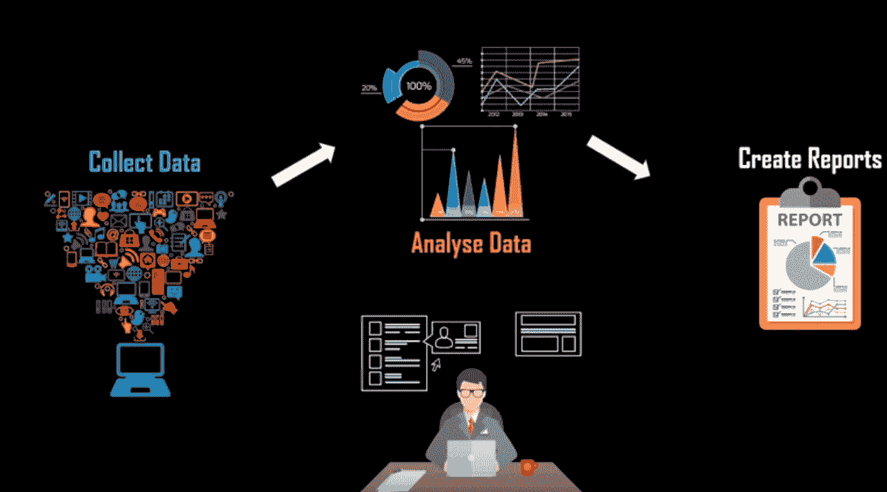
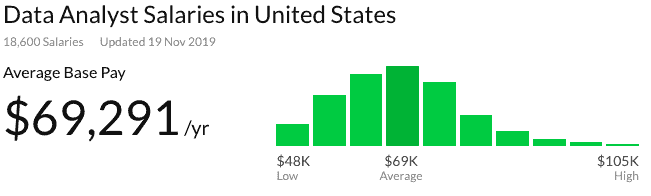
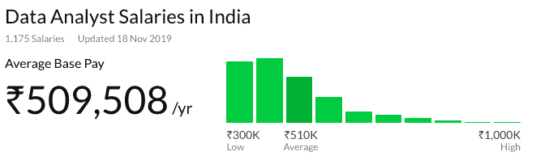
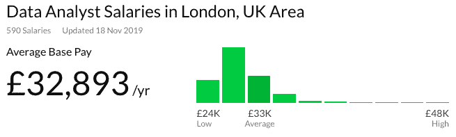
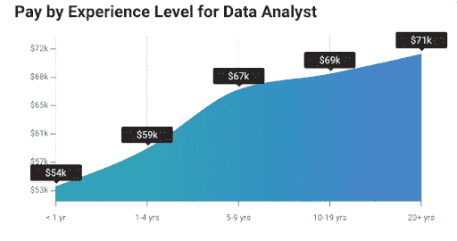
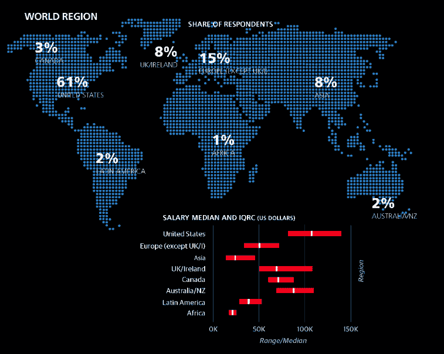

# 数据分析师薪资:2023 年从入门级到高级

> 原文：<https://hackr.io/blog/data-analyst-salary>

## 谁是数据分析师，数据分析师是做什么的？

我们处在一个既消费数据又产生数据的时代。大约有 25x 100 亿的数据是通过搜索某些东西、给任何人发消息甚至浏览 Instagram feed 而消耗和产生的。企业使用数据分析师来提供帮助，因为数据分析师使用他们的技能和工具来提供竞争分析并放大行业内的趋势。数据分析师通过获取有关特定主题的信息，然后解释、分析和提交调查结果和综合报告，为公司提供价值。

让我们向前看，讨论一下数据分析师做什么？

## 数据分析师的职责

根据专业水平，数据分析师可以:

*   **确定组织目标:**数据分析师确定组织核心，包括与 IT 团队管理层和数据科学家合作，了解业务并据此采取行动。
*   **从第一手和第二手来源挖掘数据:**数据挖掘是通过各种见解构建原始数据并形成或识别数据中各种模式的过程。数据分析师必须从公司数据库中挖掘或收集数据，或者从外部资源中提取数据来进行任何类型的研究。
*   **清理和修剪数据:**清理数据是数据准备过程中的第一步，是对杂乱的原始数据进行分析、识别和纠正的过程。当分析组织数据以制定战略决策时，数据分析师必须从数据清理过程开始。良好的分析依赖于干净的数据，因为清理包括删除可能扭曲分析的数据。
*   **分析和解释结果:**数据分析师非常需要这个角色。分析是一门从数据中探索事实的艺术，但专门用来回答一个特定的问题。它是使用分析和逻辑推理来检查数据的每个组成部分的过程，前提是使用标准的统计工具来标准化和解释数据。
*   **精确定位复杂数据集中的趋势、相关性和模式:**数据分析师的另一个主要职责是精确定位趋势和模式，这是数据分析师最后一次寻找趋势、相关性和模式。分析师寻找短期和长期趋势，观察业绩，然后预测业务洞察力。
*   **提供简明的数据报告和数据可视化:**报告将原始数据转化为信息，帮助公司监控其在线业务，并检查数据何时超出预期范围。
*   **设计、创建和维护关系数据库和数据系统:**维护数据库和数据系统确保电子存储数据的存储可用性和一致性始终满足组织需求。数据分析师必须具备数据模型、基于数据的设计和开发方面的技术专长，以便在开发和维护数据库时充分利用这些技术。

**建议课程**

[数据分析大师班(4 门课程合 1)](https://click.linksynergy.com/deeplink?id=jU79Zysihs4&mid=39197&murl=https%3A%2F%2Fwww.udemy.com%2Fcourse%2Fdata-analysis-masterclass%2F)

## 数据分析师工资

对数据分析师的需求呈指数级增长，因为这项工作的要求也很高，并且涉及编程、机器学习、数据管理和数据可视化领域的专业知识。所以这个职位的薪水也很有竞争力。行业、多年的经验以及他们的教育背景和他们的技能是决定数据分析师平均工资的驱动因素。这个职位的潜在候选人是拥有硕士或博士学位的分析师，因此收入会更高。

根据 Glassdoor，不同国家/地区的数据分析师平均工资如下所示:

### 美国

### 印度

### 联合王国

下图展示了数据分析师在这些状态下每小时的收入:

来源:ZipRecruiter

## 数据分析师薪酬决定因素

数据分析师的工资取决于许多因素:

1.  教育和资格
2.  经验水平
3.  工业
4.  位置的影响

让我们深入研究这些因素:

### 1.教育和资格

获得学士学位是一个有抱负的[数据分析师](https://hackr.io/blog/become-data-analyst-with-no-experience)的必备要求。候选人可以拥有计算机科学、统计学、数学或任何其他相关领域的 T2 学位。硕士或博士是中级或高级分析师的必备条件。所选择的学位必须在以下领域具有专长:

*   **统计建模:**专门从事定量分析
*   **循证建模:**教授如何理解如何使用高级分析来减少决策的不确定性。
*   **信息设计:**拓宽和深化对标准化数据流、管理和报告流程的理解。

### 2.经验水平

候选人的经验水平在招聘数据分析师时起着重要作用。

下面讨论的是数据分析师在其职业生涯中遇到的不同层次的经验。

#### 2.1.入门级

| 补偿 | 印度的薪资范围 | 美国的薪资范围 |
| 薪水 | $172-794 - $716,015 | $ 40,585 - 78,832 |
| 奖金 | $ 6,134 - $104,519 | $ 980 - $ 9,597 |
| 利润分享 | $ 1,500 - $101,130 | $ 609 - $6,996 |
| 总薪酬 | $ 174,667 - $ 753,908 | $ 36, 998- $ 79,400 |

#### 2.2.中级

| 补偿 | 印度的薪资范围 | 美国的薪资范围 |
| 薪水 | $289,109 - $1,186,711 | $45,244 - $ 91,092 |
| 奖金 | $10,049 - $172,576 | $982 -$10,257 |
| 利润分享 | $25000 | $503 - $12,193 |
| 总薪酬 | $291,811 - $ 1,213, 053 | $ 41,256 - $ 92,976 |

#### 2.3.高级别

| 补偿 | 印度的薪资范围 | 美国的薪资范围 |
| 薪水 | $ 363,414 - $1, 970, 089 | $45,280 - $ 99,542 |
| 奖金 | $ 14,544 - $ 255,321 | $996 - $10,585 |
| 利润分享 | $ 12,500 | $1,010 - $12,164 |
| 总薪酬 | $ 372,184 - $2,038,069 | $40, 831 - $101,273 |

下图显示了分析师不同经验水平的薪资范围。

### 3.工业

薪资的差异还取决于那个行业的需求，以及分析师从事什么行业。金融、保险、医疗保健、专业服务和 IT 是为数据分析师提供高薪的一些顶级和热门领域。

下表列出了最受欢迎的数据分析师职业，以及它们到 2022 年的预计增长。

| **行业** | **工资** | **到 2022 年的预计增长** |
| 金融数据分析师 | $83,209 | 16% |
| 临床数据分析师 | $72,690 | 14% |
| 业务数据分析师 | $72,483 | 18% |
| 人力资源数据分析师 | $65,586 | 12% |
| 定价数据分析师 | $65,319 | 13% |

### 4.位置的影响

位置是决定有抱负的或专业的数据科学家的薪水的一个驱动因素。地理位置起着至关重要的作用，就像大都市比郊区对数据分析师专业人员的需求更大。许多初创公司也在创业，并使用数据分析来促进增长。

下图显示了位置和地理如何发挥重要作用:

# 摘要

如今，组织主要依靠数据分析来获得业务洞察力。建议如果您是一名有抱负的数据分析师，您应该考虑上面列出的以下因素。所以，选择一个合适的学位，给你的职业生涯一个良好的开端，最后明智地选择你的工作行业和工作场所。考虑这些因素会对你的薪水有很大的帮助。

我希望这篇文章能提供足够的信息来衡量决定数据分析师薪水的因素。

你有任何反馈或疑问吗？下面评论！

**人也在读:**