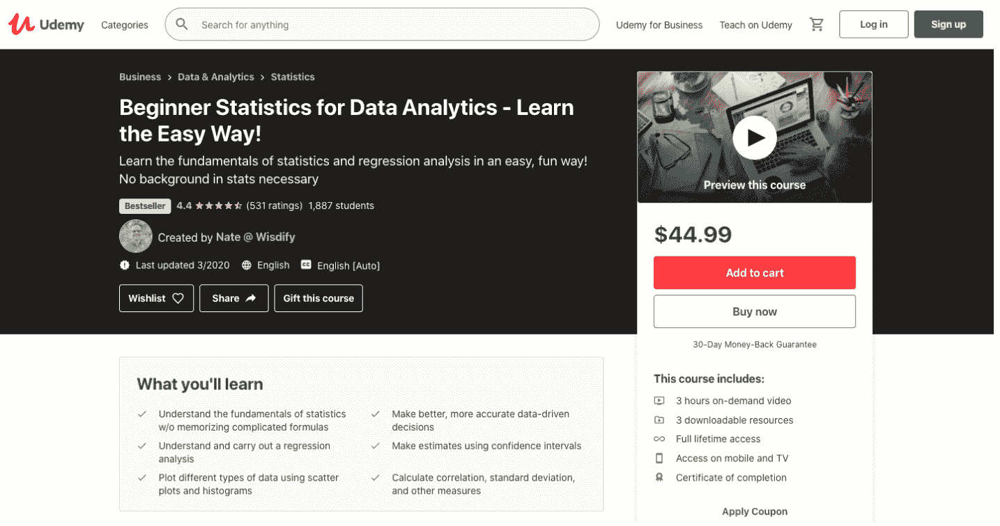

# 最佳数据分析在线课程(针对工作和未来)

> 原文：<https://hackr.io/blog/data-analytics-courses>

现在的 IT 行业对数据分析的需求很高。要成为数据分析专家，这篇文章列出了最好的数据分析课程。数据分析处理收集和分析数据，并应用各种技术将其转换为可用于决策和提高生产力的有意义的信息。

[数据科学和数据分析](https://hackr.io/blog/data-science-vs-data-analytics)是 21 世纪最热门的职业。在当今精通数据的世界，数据分析的可能性是巨大的。有了正确的知识和技能，你就能抓住有利可图的工作机会。

## **最佳数据分析课程**

无论您之前是否已经有一些数据分析经验，或者是否希望进入这一领域，以下是 10 个热门数据分析课程的在线趋势:

## **初级课程**

下面就让我们来看看一些不错的适合初学者的数据分析课程。

类型:在线课程
级别:初级 评分:4.6 时长:8.5 小时 结业证书:提供

本课程使用 tableau 2023 教授数据可视化，允许您快速探索、修复、设定目标、试验和呈现数据。本课程介绍 tableau 基础知识、软件导航、连接到数据文件和探索工作表，从而使其引人入胜。

本课程中的每个模块都是相互独立的，因此可以以任何方式学习。您还将通过即时应用程序接触到新的数据集和具有挑战性的练习。该课程将为候选人创造发现数据模式的机会，如销售趋势、客户购买行为和决策。

**话题覆盖**

*   Tableau 2023 安装
*   创造

*   条形图
*   地图
*   饼图
*   交互式仪表盘
*   表格计算
*   双轴图表
*   混合中的计算字段
*   面积图
*   散点图
*   树形图
*   故事情节

[在此注册](https://click.linksynergy.com/deeplink?id=SeYHzlfZEmI&mid=39197&murl=https://www.udemy.com/course/tableau10/)

类型:在线课程
级别:初级 评分:4.6 时长:9.5 小时 结业证书:提供

在大数据和分析时代，数据库管理起着至关重要的作用，因此，要想成为一名利润丰厚的数据分析师，就必须学习 SQL for data analytics。

经过培训的候选人可以在不依赖他人的情况下发送数据和执行查询。他们可以进一步深入挖掘和研究数据，以获得可能改善经营方式的答案。这门课程从基础开始一步一步地教你，所以很容易理解。它还通过实际例子教你使用真实的数据库。课程的结果将是精通数据库管理技能，并发展分析推理，以提供商业见解。

**话题覆盖**

*   SQL 中的代码
*   创建、设计和操作 SQL 数据库。
*   学习从头开始创建数据库。
*   精通 SQL 工作台。
*   SQL 触发器
*   SQL 序列
*   局部和全局变量
*   指数
*   SQL 连接等等

[在此注册](https://click.linksynergy.com/deeplink?id=SeYHzlfZEmI&mid=39197&murl=https://www.udemy.com/course/sql-mysql-for-data-analytics-and-business-intelligence/)

 类型:在线课程
级别:初级 评分:4.5 时长:3 小时 结业证书:提供

没有统计学背景却对这个领域有着巨大的魅力？那么你可能想参加 Udemy 课程，该课程简单有趣地向注册学生传授统计学和回归分析的基础知识。

该课程有 3 小时的点播视频和三个可下载的资源。此外，你还可以通过手机和电视终身学习这门课程。本课程结束时，您将能够制定更好、更准确的数据驱动型决策。

整个课程分为 42 节课。虽然课堂上提到的顺序是讲课的首选，但你可以自由选择视频课程的方式。

**涵盖的主题**

*   变异系数
*   相关性和因果关系
*   创建和理解回归
*   统计学基础
*   推断统计学:概率分布，正态分布，中心极限定理，估计和置信区间估计
*   回归分析导论
*   标准偏差和方差介绍
*   平均值、中间值和众数
*   了解和创建直方图

[在此注册](https://click.linksynergy.com/deeplink?id=SeYHzlfZEmI&mid=39197&murl=https://www.udemy.com/course/beginner-stats/)

类型:在线课程
级别:初级 评分:4.4 时长:1.5 小时 结业证书:已提供

从零开始数据分析？由流行的在线学习平台 Udemy 提供的数据分析课程是一个简短而全面的初学者包。

初学者友好的数据分析课程是由科尔比·施罗特和谢尔盖·勒布朗创建的，他们都是 SF 数据学校的联合创始人。由于课程没有要求先决条件，任何对数据真正感兴趣的人都可以立即开始。

该课程包括 1.5 小时的点播视频。它分为九个讲座，涉及数据分析的各个方面。本课程提供了一篇附加文章来强化学习。如果你想学习数据，但不知道从哪里开始，去参加这个课程。

**涵盖的主题**

*   数据分析工具的分类
*   数据管道
*   数据类型、文件和格式
*   数据简介
*   关键数据分析概念和术语
*   数据专业人员的角色和技能
*   数据分析“工具三角形”

[在此注册](https://click.linksynergy.com/deeplink?id=SeYHzlfZEmI&mid=39197&murl=https://www.udemy.com/course/learndata/)

类型:在线课程
级别:初级 评分:4.2 时长:17 小时 结业证书:提供

这门课程在乌德美是畅销书。它是任何希望在利润丰厚的数据科学领域开始职业生涯的人的理想之选。本课程使用两个最流行的 Python 数据科学库、 [NumPy](https://dzone.com/articles/understanding-numpy) 和熊猫，详细介绍了各种数据分析概念。

虽然 Pandas 库旨在使用 Python 进行真实世界的数据分析，但 NumPy 专注于机器学习任务。该课程也是任何对[数据分析或数据科学](https://hackr.io/blog/data-science-vs-data-analytics)有浓厚兴趣的初级 Python 开发人员的首选。

整个课程以 99 个视频讲座的形式讲授。他们的总运行时间几乎是 11 个半小时。为了帮助学习者更好地理解使用这两个流行的数据科学库，还提供了另外 9 篇文章和 11 个可下载资源。

**涵盖的主题**

*   Python 速成班
*   数据清理
*   数据分组
*   熊猫的数据可视化
*   从熊猫导入和导出数据
*   安装和设置 Python
*   数据分析介绍
*   数据框架简介
*   熊猫和熊猫简介
*   系列介绍
*   使用文本数据

[在此注册](https://click.linksynergy.com/deeplink?id=SeYHzlfZEmI&mid=39197&murl=https://www.udemy.com/course/data-analysis-with-pandas-python)

我们为初学者推荐的数据分析课程到此结束。现在让我们来看看一些针对中级开发人员和专业人员的优秀数据分析课程。

类型:在线课程
级别:中级 等级:4.7 时长:11 小时 结业证书:提供

Coursera 提供的课程向学习者传授与企业管理和发展相关的大量数据分析实践。本课程的重点是分析过程、数据创建、存储和访问，以及组织如何处理数据。

按照建议的 5 小时工作周，本课程将需要大约 4 周的时间来完成。截至目前，已有超过 2.63 万名学生注册了该课程。

如果你希望在数据分析方面打下坚实的基础，以获得更好的工作职位，那么商业数据分析入门课程非常适合你。数据分析课程还提供了先进的调查和计算方法的基础。

**涵盖的主题**

*   分析组织:角色和结构
*   在 SQL 中聚合和排序数据
*   大数据和云
*   概念性商业模式
*   数据分析工具
*   源系统捕获的数据
*   使用 SQL 进行数据提取
*   数据治理、隐私和质量
*   数据存储和数据库
*   使用运算符扩展 SQL 查询
*   SQL 简介
*   信息-行动价值链
*   关系数据库
*   虚拟化、联合和内存计算

[在此注册](https://coursera.pxf.io/gber4B)

类型:在线课程
级别:中级 等级:4.6 时长:8 小时 结业证书:提供

本课程将为您提供对高级 excel 公式和函数的深入理解，从而将 Excel 从一个基本的电子表格程序转变为一个强大的分析工具。该课程还将通过练习旨在展示公式以及如何以各种方式应用公式的上下文示例来实施实际实施。在课程结束时，您将学会构建动态工具和 excel 仪表板来过滤、显示和分析数据。您还将有资格使用 excel 中的单元格公式和函数来自动化繁琐和耗时的任务。

**涵盖的主题**

*   查找/引用功能
*   统计功能
*   基于公式的格式
*   日期和时间功能
*   逻辑运算符
*   数组公式
*   文本功能
*   间接和超链接
*   使用 WEBSERVICE & FILTERXML 进行网络抓取

[在此注册](https://click.linksynergy.com/deeplink?id=SeYHzlfZEmI&mid=39197&murl=https://www.udemy.com/course/excel-for-analysts/)

类型:在线课程
级别:中级 等级:4.6
时长:20.5 小时
结业证书:已提供

课程介绍了一个流行的熊猫库，内置 [Python 编程语言](https://hackr.io/blog/python-programming-language)。库是一个强大的工具，它允许我们分析、组织、排序、过滤、聚合、计算和收集庞大的数据集。在这个课程中，你将一步一步地了解熊猫图书馆的一切，从安装到可视化。该课程提供了大量的数据集来展示这个软件包令人难以置信的多功能性和效率，以获得更好的学习体验。它涵盖了该库包含的数百个方法、属性、特性&功能。该课程有利于初学数据分析或有经验的用户。

**涵盖的主题**

*   安装
*   整理
*   过滤
*   分组
*   聚集
*   去重复
*   绕轴旋转
*   芒格
*   删除
*   合并
*   肉眼观察

[在此注册](https://click.linksynergy.com/deeplink?id=SeYHzlfZEmI&mid=39197&murl=https://www.udemy.com/course/data-analysis-with-pandas/)

类型:在线课程
级别:中级 等级:4.5 时长:7.5 小时 结业证书:提供

在数据科学项目中使用 R 有很多好的理由，比如安全管理和健壮的基础设施。该课程旨在帮助学习者学习并加快 R 编程语言的步伐，以完成各种类型的数据分析任务。

这门课程适合任何对统计编程有浓厚兴趣的人。从数据分析课程开始，需要对数据结构和统计以及系统上安装的 R 和 RStudio 有一个基本的了解。

除了 7.5 小时的点播视频，该课程还提供了 4 篇文章和 16 个可下载的资源，以促进进一步的学习。在课程结束时，学习者将能够熟练地完成大多数类型的数据分析任务。

**涵盖的主题**

*   创建对象
*   数据类型
*   R 中的函数
*   R 中的图
*   R 编程语言简介
*   环
*   使用 R Commander GUI
*   使用字符串

[在此注册](https://click.linksynergy.com/deeplink?id=SeYHzlfZEmI&mid=39197&murl=https://www.udemy.com/course/r-level1/)

类型:专业化
等级:中级 等级:4.4 时长:5 个月 3 小时/周 结业证书:提供

该课程教育注册学生如何利用数据解决复杂的业务问题。该课程旨在培养学习者实用的商业分析技能。由于这是一门高级数据分析课程，因此入门时必须具备数据分析经验。

按照建议的 6 小时工作周，本课程大约需要 4 个月才能完成。除了让注册学生更好地进行数据分析，该课程还深入到数据可视化、数学优化和 SQL。

为了促进非英语学习者的学习，Coursera 提供了数据分析专业。一个由 3 名讲师组成的团队将向学员讲授整个课程。成功完成后，将颁发证明学习者努力的结业证书。

**涵盖的课程**

*   商业数据分析简介(课程 1)
*   预测建模和分析(课程 2)
*   用于决策的商业分析(课程 3)
*   传达业务分析结果(课程 4)
*   高级业务分析顶点课程(课程 5)

[在此注册](https://coursera.pxf.io/Gj4Q2k)

## **奖励课程**

类型:在线课程
级别:初级 评分:4.8 时长:11 小时 结业证书:提供

[精益六适马](https://en.wikipedia.org/wiki/Lean_Six_Sigma)是一种通过减少差异和系统地消除浪费来提高绩效的团队协作方法。本课程详细介绍了对精益六适马改进项目有用的各种数据分析技术。

课程结束时，学员将分析和解释从精益六适马改进项目中收集的数据。有兴趣参加数据分析课程的学生需要抽出大约 15 个小时的时间。

课程导师是 Inez Zwetsloot，一位拥有工业统计学博士学位的学术研究员和商业顾问。本课程介绍了 Minitab 的统计数据和一个流行的统计软件包，并解释了精益六适马和各种数据分析技术。

**涵盖的主题**

*   数据和 DMAIC
*   描述统计学
*   假设检验和因果关系
*   方差分析导论
*   精益六西格玛数据分析简介
*   精益六西格玛简介
*   Minitab 简介:安装和加载数据
*   克鲁斯卡尔-沃利斯试验
*   正态分布、对数正态分布和威布尔分布
*   组织数据
*   帕累托分析
*   人口与抽样
*   概率图和经验 CDF
*   选择 ctq
*   可视化数字和分类数据

[在此注册](https://coursera.pxf.io/5bDqK9)

类型:专业化
等级:中级 等级:4.5 时长:4 个月 3 小时/周 结业证书:提供

医疗保健行业正在经历一场繁荣。该专业主要面向那些希望从没有医疗保健经验的行业转型的数据专业人士。首先，该课程要求学习者至少有两年的数据分析师或技术专业人员的经验。

Coursera 提供的数据分析课程的一个显著特点是时间安排灵活。在每周工作 4 小时的情况下，你将在仅仅 4 个月内完成专业化。通过数据分析-医疗保健课程，您将学习如何分析各种类型和来源的医疗保健数据，如临床和患者生成的数据。

完成专业化认证后，学员将在医疗保健场景中使用获得的数据分析技能。该课程包括一个动手项目，可确保您充分利用数据分析课程。

**涵盖的课程**

*   医疗保健数据素养(课程 1)
*   医疗保健数据模型(课程 2)
*   医疗保健数据质量和治理(课程 3)
*   常见医疗保健问题的分析解决方案(课程 4)

[在此注册](https://coursera.pxf.io/15Mg2a)

## **推荐教程**

类型:在线学位
先决条件:Python 和 SQL 时长:4 个月 10 小时/周 结业证书:提供纳米学位

Udacity 与 Kaggle 合作提供的为期四个月的纳米学位课程可以提高您的编程技能，并提高您处理混乱、复杂和非结构化数据集的能力。本教程将教您操作和准备分析，并为数据探索创建可视化效果。最后，你将学习使用你的数据技能用数据讲故事。

**涵盖的主题**

*   数据分析简介
*   使用 Python 实现数据分析可视化
*   实用统计学
*   数据争论

该课程提供各种额外津贴，例如:

*   来自行业专家的真实项目
*   技术导师支持
*   个人职业课程和职业服务
*   灵活学习计划

[在此注册](https://imp.i115008.net/ZdXyWK)

## **结论**

以上就是我们选出的十大最佳在线数据分析课程。你需要确保提高你的数据分析技能，以不断取得成功。

我希望这 10 大数据分析课程能帮助你在职业生涯中走得更远，让你在数据分析方面比以前更好。

**人也在读:**