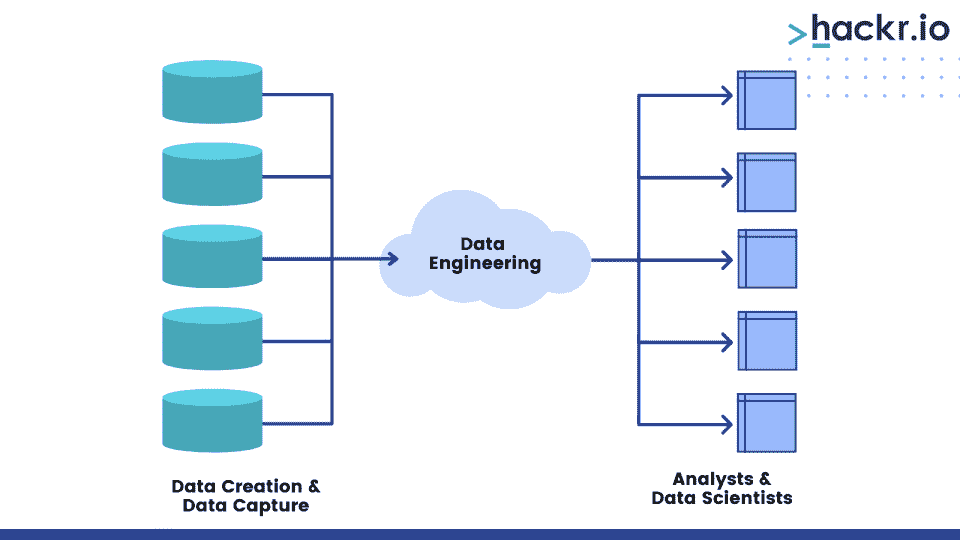
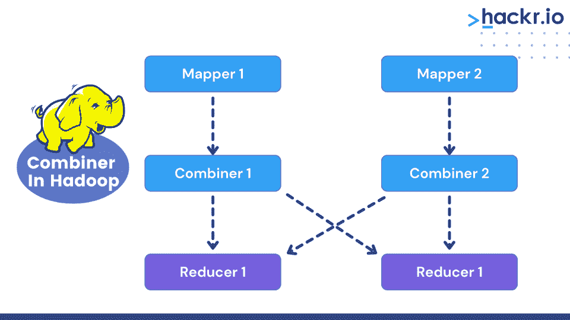

# 50 强数据工程师面试问答【2023】

> 原文：<https://hackr.io/blog/data-engineer-interview-questions-and-answers>

数据工程师的工作与数据分析师类似，但规模更大。当他们将数据转化为商业见解时，他们还构建和维护数据库管道架构。这是一份高要求、高收入的工作——平均工资在 8.8 万美元左右。

打算成为一名数据工程师？如果有，继续读下去。我们整理了一份最佳数据工程面试问题清单，帮助你在即将到来的面试中脱颖而出。

我们将数据工程问题列表分为三类:基础、中级和高级。

## **基础数据工程师面试问题**

让我们从一些数据工程师入门级角色的基本面试问题开始。

### **1。数据建模是如何工作的？**

[数据建模](https://hackr.io/blog/what-is-data-modeling)是一种使复杂软件架构变得可访问的技术。概念图显示了不同数据对象和规则之间的联系。

### **2。解释数据工程。**

[数据工程](https://hackr.io/blog/what-is-data-engineering)是建立、测试和维护数据库结构以大规模分析数据的过程。数据工程有助于将这些非结构化数据转化为可用的业务洞察力。

### **3。描述 NameNode。**

NameNode 充当 HDFS ( [Hadoop](https://hackr.io/blog/hadoop-architecture) 数据文件系统)的主枢纽。它跟踪集群中的不同文件，并维护 HDFS 数据。但是，NameNode 并不存储实际的数据，而是由 DataNodes 存储。

### **4。描述 Hadoop 中的流。**

流式支持构建地图，并减少作业以及将这些作业提交给特定集群。

### **5。在 HDFS 展开。**

HDFS 代表 Hadoop 分布式文件系统。这种文件系统处理大量的数据收集，并运行在商用硬件上，即廉价的计算机系统上。

### **6。解释 HDFS 的块和块扫描器。**

块是最小的数据文件组件。Hadoop 会自动将大文件分割成小的可工作段。另一方面，块扫描程序验证 DataNode 的块列表。

### 7 .**。当块扫描器发现有故障的数据块时会发生什么？**

首先，DataNode 向 NameNode 发出警报。然后，NameNode 使用损坏的块作为起点创建一个新的副本。

目标是使复制因子与适当副本的复制计数保持一致。如果发现匹配，损坏的数据块不会被删除。

**建议课程**

[数据分析大师班(4 门课程合 1)](https://click.linksynergy.com/deeplink?id=jU79Zysihs4&mid=39197&murl=https%3A%2F%2Fwww.udemy.com%2Fcourse%2Fdata-analysis-masterclass%2F)

### **8。描述 Hadoop 的属性**

以下是 Hadoop 的关键属性:

*   [开源](https://hackr.io/blog/what-is-open-source-software)，免费软件框架
*   与多种硬件兼容，简化了对给定节点内新硬件的访问
*   支持更快的分布式数据处理
*   将数据存储在集群中，与其他操作分开。
*   允许使用各种节点为每个数据块创建三个副本。

### **9。COSHH 代表什么？**

COSHH 代表异构 Hadoop 系统的基于分类和优化的调度。它允许您在应用程序和集群级别调度任务，以节省任务完成时间。

### 10。描述星型模式。

星型模式，通常称为星型连接模式，是数据仓库模型中最基本的类型。由于其结构，它被称为星型模式。星形模式允许在星形的中心有许多相关的维度表和一个事实表。该模型非常适合查询大型数据集合。

### **11。大数据解决方案是如何部署的？**

这是你可能遇到的几个大数据工程师面试问题之一。

以下是部署大数据解决方案的方法:

*   结合来自多个来源的数据，包括 RDBMS、SAP、MySQL 和 Salesforce。
*   将提取的数据保存在 NoSQL 数据库或 HDFS 文件系统中。
*   利用 Pig、Spark 和 MapReduce 等处理框架来部署大数据解决方案。

### **12。你对 FSCK 了解多少？**

文件系统检查或 FSCK 是 HDFS 使用的一个命令。此命令检查文件中的不一致和问题。

### 13。描述雪花模式。

雪花模式是星型模式的扩展模型，它增加了新的维度，类似于雪花。它通过规范化维度表将数据划分到额外的表中。

### **14。描述分布式 Hadoop 文件系统。**

S3、HFTP 文件系统、文件系统和 HDFS 等可扩展分布式文件系统与 Hadoop 兼容。Google 文件系统是 Hadoop 分布式文件系统的基础。该文件系统被制成易于在计算机系统的相当大的集群上操作。

### 15。纱线的全名是什么？

YARN 代表另一种资源谈判者。它负责将系统资源分配给 Hadoop 集群中运行的应用程序。此外，它安排应用程序在不同的集群上运行。

### 16。列出 Hadoop 模式。

Hadoop 有三种模式:

1)独立

2)伪分布式

3)完全分布式

您可能会看到这些针对助理级数据工程师角色的数据工程师问题。

### **17。如何在 Hadoop 中实现安全性？**

对于 Hadoop 安全性，请采取以下措施:

1)保护客户机与服务器的认证通道，并给客户机带时间戳的文档。

2)客户端使用时间戳信息向 TGS 请求服务票。

3)在最后阶段，客户端使用服务票证向特定服务器进行自我身份验证。

### 18。Hadoop 的心跳是什么意思？

在 Hadoop 中，NameNode 和 DataNode 相互通信。心跳是 DataNode 发送给 NameNode 以确认其存在的常规信号。

### **19。什么是大数据？**

大数据是具有巨大数量、多样性和速度的数据。它需要来自各种数据源的更大的数据集。

### 20。先进先出意味着什么？

FIFO 是 Hadoop 作业的调度算法。

### **21。列出 Hadoop 的任务跟踪器、NameNode 和作业跟踪器运行的标准端口号。**

Hadoop 的任务和作业跟踪器都运行在以下默认端口号上:

*   任务跟踪器运行在 50060 端口上。

*   NameNode 运行在 50070 端口上。

*   作业跟踪器在 50030 端口上运行。

### **22。如何关闭 HDFS 数据节点的数据块扫描器？**

将 dfs.datanode.scan.period.hours 设置为 0，以禁用 HDFS 数据节点上的块扫描器。

### **23。如何定义两个 Hadoop 节点之间的距离？**

getDistance()函数确定两个 Hadoop 节点之间的距离。

### **24。Hadoop 为什么基于商用硬件？**

商品硬件容易获得且价格合理。这是一个可以与 Linux、Windows 或 MS-DOS 一起工作的平台。

### **25。描述 HDFS 复制因子。**

复制因子是系统中文件副本的总数。

### **26。NameNode 保留哪些信息？**

NadeNodes 保存 HDFS 元数据，包括名称空间和块信息。

### **27。解释“机架感知”**

在 Hadoop 集群中，当读取或写入靠近相邻机架的任何文件时，Namenode 会利用 Datanode 来减少网络流量。

Namenode 跟踪每个 DataNode 的机架 id，这就是所谓的机架识别。

### **28。二级 NameNode 的功能是什么？**

辅助 NameNode 的功能如下:

*   **FsImage** ，它保存了 FsImage 和 EditLog 文件的副本。
*   **NameNode 失败:**如果 NameNode 崩溃，可以使用辅助 NameNode 的 FsImage 来重建 NameNode。
*   **检查点:**辅助 NameNode 使用此检查点来确保 HDFS 数据不被损坏。
*   **更新:**EditLog 和 FsImage 文件都自动更新。更新辅助 NameNode 上的 FsImage 文件是有益的。

### **29。如果用户在 NameNode 关闭时提交新作业，会发生什么情况？**

Hadoop 的 NameNode 是一个单点故障，使得用户无法提交或运行新的作业。在执行任何作业之前，用户必须等待 NameNode 重新启动，因为如果 NameNode 关闭，作业可能会失败。

### 三十岁。Hadoop 为什么要使用上下文对象？

Hadoop 框架使用带有 Mapper 类的上下文对象与系统的其余部分进行通信。系统配置信息和作业在其 function Object(){[本机代码] }中传递给上下文对象。

为了在 setup()、cleanup()和 map()函数中传递信息，我们使用了上下文对象。在这个对象的帮助下，关键数据可用于地图操作。

### 31。定义 Hadoop 组合器。

Hadoop 组合器在 Map 之后，Reduce 之前。Combiner 从 Map 函数的结果构建键值对，并将它们发送给 Hadoop Reducer。合并器必须用相同的键将 Map 的最终输出转换成摘要记录。

### 32。默认情况下，HDFS 提供哪种复制因素？这是什么意思？

在 HDFS，默认的复制因子是 3，这意味着每条数据都有三个副本。

### 33。Hadoop 的“数据局部性”是什么？

由于数据量很大，在大数据系统中不需要通过网络移动数据。Hadoop 现在正试图让处理更接近数据。信息以这种方式保存在存储位置的本地。

## **高级或高级数据工程师面试问题**

这些数据工程问题适用于高级工程角色，可能具有领导职责和管理责任。

### 34。定义 HDFS 的平衡器。

HDFS 中的平衡器是管理人员用来将块从过度使用的节点转移到未充分使用的节点并在 DataNodes 之间重新分配数据的工具。

### 35。描述 HDFS 安全模式。

在集群中，NameNode 以只读模式运行，而 NameNode 以安全模式启动。安全模式禁止写入文件系统。此时，它从每个 DataNode 收集信息和统计数据。

### 36。Apache Hadoop 的分布式缓存有什么作用？

分布式缓存是 Hadoop 的一个关键实用功能，它通过缓存应用程序使用的文件来提高作业性能。使用 JobConf 设置，应用程序可以为缓存指定一个文件。

Hadoop 框架将这些文件复制到每个必须运行任务的节点。这在任务执行之前进行。除了 zip 和 jar 文件，分布式缓存还提供只读文件的传播。

### 37。蜂巢里的 SerDe 是什么意思？

序列化器或反序列化器是 SerDe 的完整形式。Hive 的 SerDe 特性允许您从表中读取数据，并以您喜欢的任何格式将数据写入特定字段。

### 38。列出配置单元数据模型的元素。

Hive 数据模型由以下元素组成:

*   桌子
*   划分
*   大量

### 39。描述在 Hadoop 生态系统中如何使用 Hive。

Hive 为存储在 Hadoop 环境中的数据提供了一个管理界面，并允许您使用和映射 HBase 表。

通过将配置单元搜索转换为 MapReduce 作业，隐藏了设置和运行 MapReduce 作业所涉及的复杂性。

### 40。描述的用途。hiverc 文件在配置单元中。

的。hiverc 文件是 Hive 的初始化文件。当我们启动 Hive 的命令行界面(CLI)时，这个文件被初始加载。在。hiverc 文件，我们可以设置参数的起始值。

### 41。可以在 Hive 中为同一个数据文件创建多个表吗？

是的，您可以为一个数据文件生成许多表模式。Hive 将其架构存储在 Hive Metastore 中。我们可以使用这个模型从相同的数据中检索出几个结果。

### **42。Hive 中的斜表是什么意思？**

倾斜是指表包含列值的频率更高的趋势。倾斜值保存在单独的文件中，当在 Hive 中形成带有倾斜标志的表时，剩余的数据写入不同的文件。

### **43。操作数据库和数据仓库之间有什么区别？**

使用 Delete SQL 命令、Insert 和 Update 的数据库是注重速度和效率的操作标准。因此，数据分析可能会更具挑战性。

另一方面，数据仓库更重视聚合、计算和 select 语句。因此，数据仓库是数据分析的一个很好的选择。

### **44。区分数据工程师和数据科学家。**

这是应聘者在面试中听到的最常见的数据工程问题之一。

[数据科学家](https://hackr.io/blog/what-is-data-science)研究和理解复杂的数据，而数据工程师创建、测试和管理数据生成的整个架构。他们专注于组织和翻译大数据。数据工程师还构建数据科学家工作所需的基础设施。

### **45。作为一名数据工程师，你将如何着手创建一个新的分析产品？**

理解整个产品大纲将有助于你完全掌握一个项目的需求和范围。第二步是研究每项措施的具体情况和原因。

考虑尽可能多的潜在问题，以适当的粒度级别构建更具弹性的系统。

### **46。NameNode 从 DataNode 获得哪两条消息？**

DataNodes 以消息或信号的形式向 NameNodes 提供有关数据的信息。

这两个指标是:

*   **Block report signals，**它是存储在 DataNode 上的数据块的列表，并解释了它们如何操作。
*   **DataNode 的心跳**，表示它是活动的，正在工作。重复报告有助于决定是否使用 NameNode。如果没有发送该信号，DataNode 的操作显然已经停止。

### **47。模式进化是如何工作的？**

模式已经发展到这样一种程度，即同一组数据可以存储在许多具有不同但兼容的模式的文件中。通过使用 Spark 的 Parquet 数据源，可以自动识别和组合这些文件的模式。

在没有自动模式合并的情况下，处理模式演变的典型方法是重新加载历史数据，这很耗时。

### **48。编排是如何工作的？**

IT 公司必须管理大量的服务器和应用程序，但是手动管理是不可扩展的。一个 IT 系统越复杂，就越难跟踪所有移动的元素。对跨系统或机器组集成若干自动化作业及其配置的需求正在增长，同时需要组合这些自动化操作和设置。这种情况得益于编排的使用。

计算机系统、应用程序和服务编排是这些组件的自动化配置、管理和协调。流程编排使 it 更容易管理具有挑战性的运营和流程。许多容器编排技术，包括 Kubernetes 和 OpenShift，都是可用的。

### 49。描述 Apache Hadoop 框架的基本思想。

准确地说，它是基于 MapReduce 算法的。这种技术映射和简化过程用于处理大数据集。在地图过滤和排序数据时减少数据摘要。这个范例背后的主要思想是可伸缩性和容错性。通过有效利用 MapReduce 和多线程，我们可以在 Apache Hadoop 中成功实现这些功能。

### 50。提及 Hadoop 的一些关键属性。

*   Hadoop 是一个免费的开源框架，其代码可以修改以适应不同的需求。
*   它通过 MapReduce 支持更快的分布式数据处理。
*   Hadoop 非常宽容，默认情况下，允许用户在几个节点上构建每个块的三个克隆。因此，即使其中一个节点出现故障，我们仍然可以从另一个节点恢复数据。
*   可扩展且硬件中立。
*   由于 Hadoop 基于集群的数据存储，所有其他操作都不受影响。因此，它是值得信赖的。机器的故障对存储的数据没有影响。

## **奖励提示**

这份数据工程师面试问题列表是为下一次数据工程师面试做准备的常用方法。

这里有一些额外的提示，可能会帮助你赢得面试:

*   在重要的日子到来之前，和朋友们一起测试模拟面试，抓住困难的问题。
*   咨询资深数据工程师，了解他们在面试过程中的经验。
*   不断阅读大数据和数据工程文章和博客，保持行业知识。
*   准备基于场景的面试问题。

## **结论**

这组数据工程师面试问题和答案涵盖了关于数据工程和大数据的广泛技术主题。准备好关于 Hadoop 的问题，以及基于场景的问题，在这些问题中，您的任务是回忆以前的经历。

回顾数据工程问题是一个极好的起点，但是在你的数据工程职业之旅中还有更多的事情要做。

**[探索如何成为一名数据工程师](https://hackr.io/blog/how-to-become-a-data-engineer)**

## **常见问题解答**

#### **1。数据工程师面试问什么问题？**

我们准备了这 50+题，对初学者和专业人士都有帮助。你会被问到关于 Hadoop、NameNodes、数据建模、分析等问题。

#### **2。一个数据工程师需要什么技能？**

以下是数据工程角色需要的一些常用技能和专业知识:

*   数据库工具知识
*   编码
*   批判性思维
*   数据分析经验
*   数据转换、缓冲、摄取和挖掘工具的知识
*   人工智能和机器学习经验
*   数据仓库和 ETL 工具
*   实时处理框架

#### **3。数据工程怎么准备？**

专注于核心数据和数学技能，并构建一些项目，为数据工程职业生涯做准备。此外，查看我们广泛的数据工程问题列表。