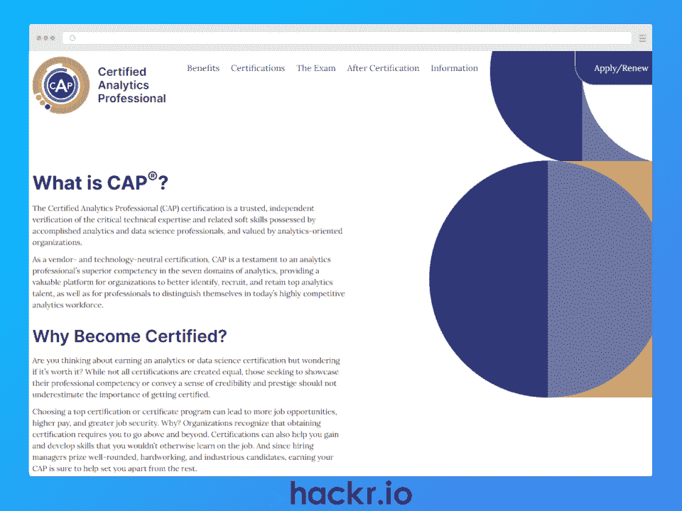
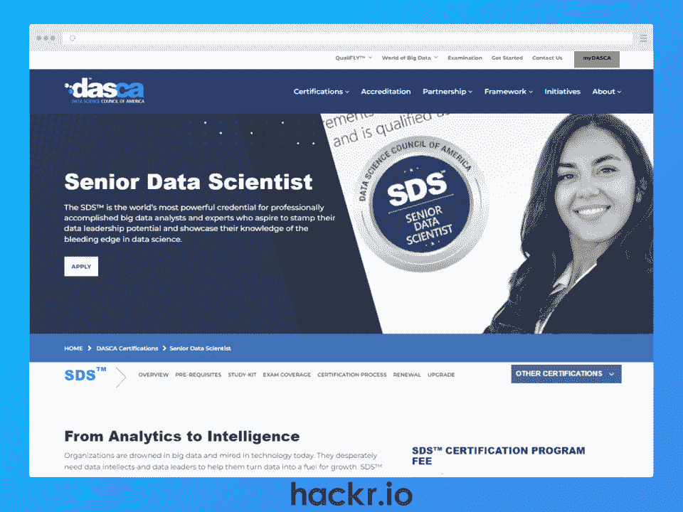
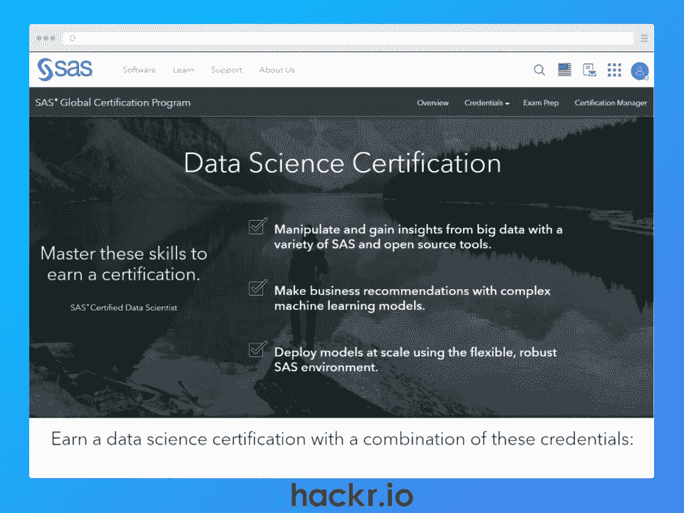
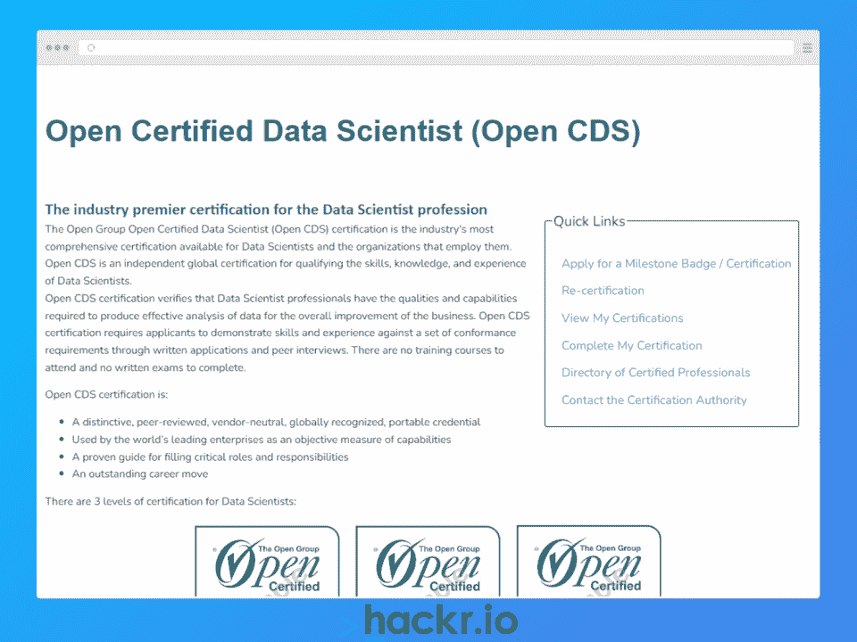
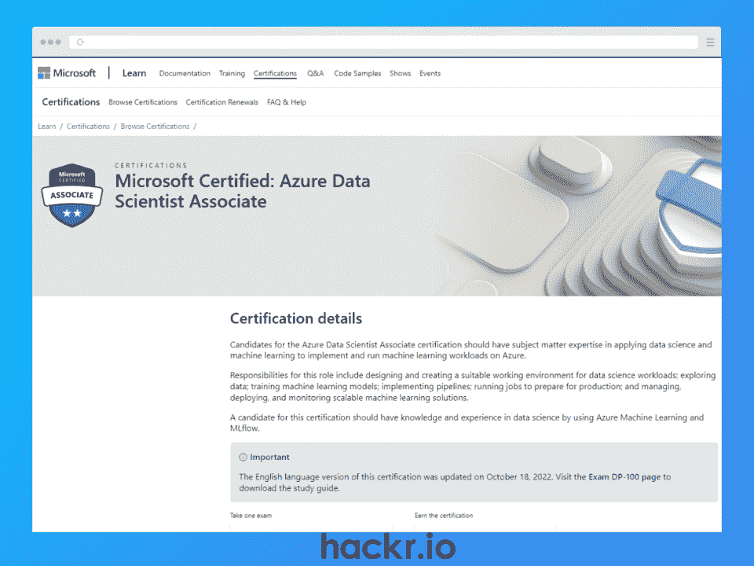
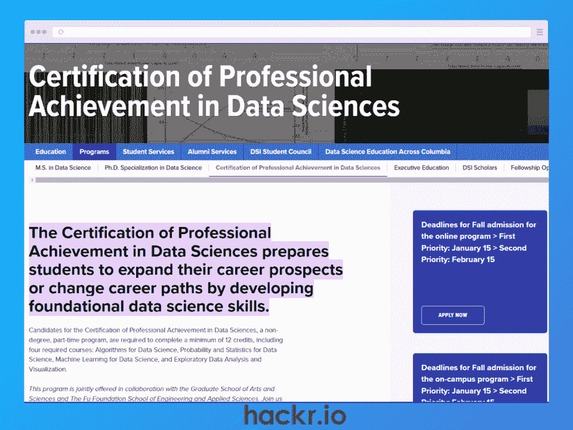
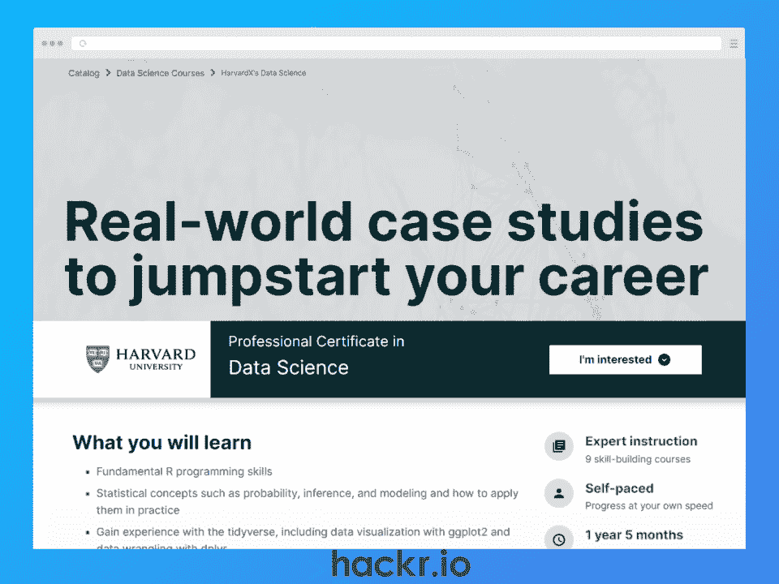
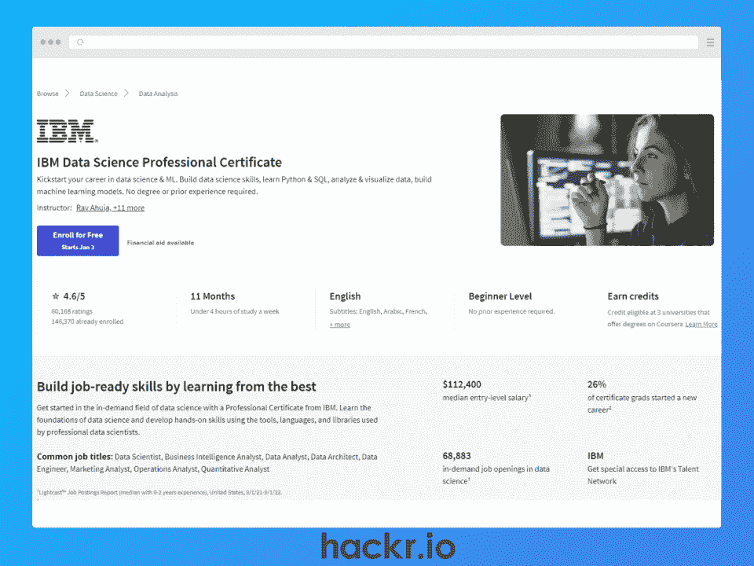

# 2023 年将获得的 10 项最佳数据科学认证

> 原文：<https://hackr.io/blog/data-science-certification>

随着大数据和人工智能趋势的几乎指数级增长，在 2023 年及以后，各种规模和各行各业的企业对数据驱动型工作的需求将不可避免地继续增长。

这其中的核心是数据科学家，他已经成为开发流程和预测模型以理解所有数据所不可或缺的一员！仍然是排名前三的工作，平均年薪超过 12 万美元，越来越多的人渴望进入这个领域也就不足为奇了。

在这个领域脱颖而出的最好方法之一就是获得最好的数据科学认证。这些通常很难实现，可以验证你的数据科学技能，让你向未来的雇主展示你拥有他们想要的东西。

本文将涵盖现有的 10 个最佳数据科学认证，从初学者到领导公司数据科学部门的经验丰富的专业人士。

## **数据科学与数据分析**

虽然他们经常在一个组织内的同一个数据团队工作，但是[数据科学家和数据分析师](https://hackr.io/blog/data-science-vs-data-analytics)之间还是有一些明显的区别。

数据科学家经常使用结构化和非结构化数据，通过复杂的数据技术、机器学习和预测建模来发现有趣的模式或见解。

数据分析师通常使用结构化数据，使用 SQL、R 或 Python 编程语言、数据可视化软件和统计分析等工具来解决现实世界中的业务问题。

## **认证还是证书？**

尽管这些术语经常互换使用，但它们并不相同。

*   **证书:**通常被授予完成[培训课程](https://hackr.io/blog/data-science-courses)的证明，偶尔可能需要等级考试，尽管这种情况不太常见。
*   **认证:**行业公认的能力和专业知识验证方式。通常只能通过参加并通过具有挑战性的分级考试、通过同行面试以及满足必要的先决条件来获得。

虽然证书更容易获得，但它们可能是获得更具挑战性的数据科学证书的巨大敲门砖。如果你是初学者或者从一个领域过渡到另一个领域，这是一个很好的选择。

本文将涵盖 2023 年最佳数据科学认证，以及两个最佳数据科学证书，适用于希望进入该领域的有志数据科学家。

**如果你正在申请数据科学工作，请查看我们的** [**数据科学面试问题**](https://hackr.io/blog/data-science-interview-questions)

## **选择最佳数据科学认证**

如果您不确定选择哪种数据科学认证，请考虑以下标准。

*   **资格&技能**:需要学历还是专业资格？你有必要的技术和科学技能吗？
*   **成本**:在你数据科学职业生涯的这个阶段，投资是否值得？
*   **更新期**:认证有效期多长？您需要定期续订吗？你需要重新参加考试来延长你的身份吗？
*   **点评:**还有人说认证提升了自己的职业生涯或者求职能力吗？

## **10 项最佳数据科学认证**

[****](https://www.certifiedanalytics.org/)

**我们为什么选择这个**

认证分析专家(CAP)受到世界各地以分析为导向的组织的高度重视，可以通过高级分析知识和软技能的正确结合来推动数据科学家的职业发展。

要通过考试并获得顶级数据科学家认证，您需要展示您在分析和业务问题、数据科学方法选择、模型构建和部署等领域的数据科学技能和专业知识。

**先决条件:**

*   学士学位+ 5 年经验，或
*   硕士学位+ 3 年经验，或
*   具有非分析领域学位的 7 年经验，或
*   雇主必须验证软技能

**成本:**

*   350 美元(aCAP 认证候选人)
*   495 美元(通知会员)
*   695 美元(其他人)

**考试总题:** 100

**内容:**四选项，多项选择题

**考试地点:**亲临指定考点

**持续时间**:三小时

**有效期**:有效期三年

[了解更多信息](https://www.certifiedanalytics.org/)

[****](https://www.dasca.org/data-science-certifications/senior-data-scientist)

**我们为什么选择这个**

作为全球公认的数据科学认证提供商，美国 SDS 数据科学委员会是拥有至少四年经验的雄心勃勃的数据科学家的顶级数据科学认证之一。

根据您的经验和教育程度，您可以从四个途径中选择 DASCA 的高级数据科学家(SDS)证书。

无论您选择哪个方向，您都需要展示您在数据科学商业应用、数据科学功能框架、数据科学基础知识等方面的知识，才能通过考试。

**先决条件**:

*   **途径 1:** 计算机科学(或相关领域)学士学位+5 年经验
*   **途径 2:** 计算机科学(或相关领域)硕士学位+4 年工作经验
*   **途径 3:** 从 DASCA 认可的机构获得学士学位，+3 年工作经验
*   **途径 4:** 获得 DASCA 认可机构的硕士学位，+3 年工作经验

**费用:** $775(所有曲目)

**考试总题:** 85

**内容:**选择题，单选题

**持续时间** : 100 分钟

**考试地点:**网上

**有效期**:有效期 5 年

[了解更多信息](https://www.dasca.org/data-science-certifications/senior-data-scientist)

[****](https://www.dasca.org/data-science-certifications/principal-data-scientist)

**我们为什么选择这个**

如果您是贵组织中以技术技能和领导素质闻名的首席数据科学家，那么 DASCA 的首席数据科学家(PDS)是数据科学领域对您最好的认证之一。与 SDS 非常相似，PDS 候选人可以使用四种不同的轨道。

每个方向都要求您完成三项分级评估，以展示统计、数据分析、商业智能等方面的高级技能。但是，除了这些评估之外，遵循途径 2 或 4 的学员还需要通过分级考试。

从好的方面来说，一旦你完成了获得认证的艰苦工作，它就不会过期！你只需要每五年保持一次你的职业成就记录。

**先决条件:**

*   **路线 1:** 仅限具有令人印象深刻的职业跟踪记录和超过 10 年经验的数据科学专业人士受邀参加。大多数人还拥有数据科学(或相关领域)的博士或硕士学位
*   **途径 2** :雇主赞助，计算机科学、数据科学或相关领域的学士学位，以及+10 年工作经验
*   **途径 3:** SDS 认证，计算机科学、数据科学或相关领域的硕士学位，以及+10 年经验
*   **途径 4:** 向任何拥有计算机科学、数据科学或相关领域硕士学位、+10 年工作经验或+8 年博士工作经验的人开放。

**费用**:

*   **途径 1:** $850(仅限受邀者)
*   **路线 2:** $1250(雇主赞助)
*   **路线 3:** $750(从 SDS 升级)
*   **途径 4:** $1450(其他人)

**考试总题:** 100

**内容:**选择题，单选题

**持续时间** : 100 分钟

**考试地点:**网上

**到期**:每 5 年更新一次职业成就

[了解更多信息](https://www.dasca.org/data-science-certifications/principal-data-scientist)

[****](https://www.sas.com/en_us/certification/credentials/advanced-analytics/data-scientist.html)

**我们为什么选择这个**

这一认证有些独特，因为它融合了在线课程材料、课程作业和三个数据科学领域的分级考试，最终获得了数据科学认证。

对于没有学位或最少专业经验的有抱负的数据科学家来说，这是一个极好的途径。

通过学习数据管理并将其与高级分析方法或人工智能和机器学习联系起来，你可以在获得该认证的过程中证明你在两个学科和一系列[数据科学工具](https://hackr.io/blog/data-science-tools)方面的能力。

**先决条件:**

*   熟悉 SAS 编程基础
*   熟悉数据操作方法
*   熟悉 SQL

**费用**:

*   每个子课程每年 1，295 美元(12 个月的材料访问)，包括 1-3 张考试代金券(取决于路线)
*   每次考试 180-250 美元(价格和考试次数取决于路线)

**考试问题总数:**通常为 50-55 个(每次考试)

**内容:**选择题，简答题，或互动题

**持续时间**:通常为 100 分钟(每次检查)

**考试地点:**网上

**到期**:大部分检查没有到期，但检查个别检查

[了解更多信息](https://www.sas.com/en_us/certification/credentials/advanced-analytics/data-scientist.html)

[****](https://www.opengroup.org/certifications/certified-data-scientist-open-cds)

**我们为什么选择这个**

与大多数认证不同，该选项不需要笔试，而是结合了书面申请和同行面试来展示您的技能和能力。如果这种方法有吸引力，那么 CDS 可能是最适合你的数据科学认证。

根据您的经验水平，您可以瞄准三个级别之一:认证、硕士认证或杰出数据科学家。

此认证要求您完成里程碑评估，从而获得里程碑徽章。你需要的徽章数量随着等级的增加而增加。

**先决条件:**可证明的数据科学家经验

**费用**:

*   **里程碑徽章:** $50 - $300(徽章数量取决于等级)
*   **认证费用:**一级:400 美元，二级:500 美元，三级:550 美元
*   **总成本:**
    *   第一级: $1100
    *   第二关&第三关:1500 美元

**地点**:在线或现场

**持续时间**:自定进度

**有效期**:有效期 3 年

[了解更多信息](https://www.opengroup.org/certifications/certified-data-scientist-open-cds)

[****](https://click.linksynergy.com/deeplink?id=jU79Zysihs4&mid=24542&murl=https%3A%2F%2Flearn.microsoft.com%2Fen-us%2Fcertifications%2Fazure-data-scientist%2F)

**我们为什么选择这个**

如果你是一名数据科学家，恰好是一名 Azure 向导，那么这个认证对你来说很有意义。

你需要在 Azure 中应用数据科学和机器学习(ML)技术方面具有明显的专业知识，包括数据探索、训练机器学习模型和管理可扩展的 ML 解决方案。重点关注数据科学的一些基础设施方面，这融合了数据工程师的一些技能。

如果您不能 100%确定自己是否准备好参加考试，那么您可以利用微软提供的免费在线数据科学课程材料，或者您甚至可以选择由讲师指导的付费选项。通过考试后，你的在线简历还会获得一个数字徽章。

**先决条件:**使用 Azure 进行数据科学的可演示经验

**费用**:165 美元(仅限考试)

**考试总题:** 40-60 题

**内容:**选择题或填空题

**持续时间** : 120 分钟

**考试地点:**网上

**到期**:没有到期

[了解更多信息](https://click.linksynergy.com/deeplink?id=jU79Zysihs4&mid=24542&murl=https%3A%2F%2Flearn.microsoft.com%2Fen-us%2Fcertifications%2Fazure-data-scientist%2F)

[****](https://click.linksynergy.com/deeplink?id=jU79Zysihs4&mid=24542&murl=https%3A%2F%2Flearn.microsoft.com%2Fen-us%2Fcertifications%2Fazure-ai-fundamentals%2F)

**我们为什么选择这个**

微软的另一项服务是面向对人工智能感兴趣的数据科学家的初级认证。

作为一个基础级别的认证，你不需要有丰富的使用 Azure 执行机器学习(ML)或人工智能任务的真实世界经验。

根据您的经验，建议您使用微软的免费补充材料来学习参加考试所需的必要技能或刷新您的记忆。

你可以期待的一些领域包括描述人工智能工作负载、ML 基础知识、计算机视觉和 Azure 上的 NLP。有趣的是，数据科学的这些云基础架构方面与数据工程师的一些技能重叠。

一旦通过，您将获得一个由行业认可的提供商颁发的证书和数字徽章。

**先决条件:**专为初学者设计，但建议学习免费资料。

**费用**:99 美元(仅限考试)

**考试总题:** 40-60 题

**内容:**多选、多答或拖拽

**持续时间** : 60 分钟

**考试地点:**网上

**到期**:没有到期

[了解更多信息](https://click.linksynergy.com/deeplink?id=jU79Zysihs4&mid=24542&murl=https%3A%2F%2Flearn.microsoft.com%2Fen-us%2Fcertifications%2Fazure-ai-fundamentals%2F)

[****](https://datascience.columbia.edu/education/programs/certification-of-professional-achievement-in-data-sciences/#:~:text=The%20Certification%20of%20Professional%20Achievement,developing%20foundational%20data%20science%20skills.)

**我们为什么选择这个**

哥伦比亚大学的这一认证由世界一流的教育机构提供，通过四门数据科学课程整合了在线培训，涵盖数据科学算法、概率和统计、机器学习和探索性数据分析。

作为一个大学认证，所需的知识水平更倾向于理论而不是实践，每门课程都需要了解微积分，线性代数和编程。

**先决条件:**微积分、线性代数、编程技巧

**费用**:395 美元技术费+课程费用(直接向学校查询)

**期限**:一般为 12 个月

**考试地点:**网上或校内

**到期**:没有到期

[了解更多信息](https://datascience.columbia.edu/education/programs/certification-of-professional-achievement-in-data-sciences/#:~:text=The%20Certification%20of%20Professional%20Achievement,developing%20foundational%20data%20science%20skills.)

[****](https://edx.sjv.io/c/2890636/1598007/17728?u=https%3A%2F%2Fwww.edx.org%2Fprofessional-certificate%2Fharvardx-data-science)

**我们为什么选择这个**

HarvardX 是来自哈佛大学的在线课程提供商，按理说课程内容会首屈一指。

这是与 edX 合作提供的数据科学基础入门课程，包括数据挖掘和数据可视化、概率和统计、机器学习以及 R 编程语言的基础。您还将在数据科学项目中体验真实世界的案例研究和数据集。

这是最好的数据科学证书课程之一，适合有抱负的数据科学家在自己的时间里自学该学科的基本技能。如果你确实选择了这条路线，寻找其他补充材料可能会有所帮助，包括[数据科学书籍](https://hackr.io/blog/data-science-books)。

完成后，您将获得世界上最可信的教育提供商之一颁发的最受尊敬的数据科学证书之一，作为您简历的一部分。

**必备:**专为初学者设计

费用:792.80 美元

**持续时间**:通常为 12 个月(每周 3 小时)

[了解更多信息](https://edx.sjv.io/c/2890636/1598007/17728?u=https%3A%2F%2Fwww.edx.org%2Fprofessional-certificate%2Fharvardx-data-science)

[****](https://imp.i384100.net/oeWYk9)

**我们为什么选择这个**

这个数据科学证书课程面向绝对的初学者，旨在让任何对数据科学有热情的人都可以参加。

作为我们名单中的最后一个选项和最佳数据科学证书之一，这是新人发展基本技能的可靠选择，同时获得了行业专家 IBM 与 Coursera 合作的备受尊重的证书(和数字徽章)。

由 9 门不同的在线子课程组成，这门数据科学专业课程将教授您 Python、SQL、数据分析和可视化、统计学、机器学习等知识。

您还将把这些技能运用到 IBM 云和真实数据集的实践练习中，这意味着您将有一些实际的内容添加到您的投资组合中。因此，毫不夸张地说，这可能是完全初学者在数据科学方面的最佳证书。

**必备:**专为初学者设计

费用:Coursera Plus 每月 59 美元或每年 399 美元

**持续时间**:通常为 11 个月(每周 4 小时)

[了解更多信息](https://imp.i384100.net/oeWYk9)

## **结论**

如果你想成为大数据革命的中心，那么没有比数据科学家更好的角色了。

根据你的经验水平和数据科学职业目标，选择最佳的数据科学认证可能是一种绝佳的方式，可以增强你的简历，并向潜在的雇主展示你令人印象深刻的技能。

因此，无论您是一名寻求职业发展的初级数据科学家，还是贵组织数据团队中备受尊敬的领导者，总有一种认证适合您。

如果你是这个领域的新手，正在寻找突破的方法，我们已经增加了一些基础认证和证书计划，它们是很好的垫脚石。

**想要进一步提高您的数据科学技能吗？看看这些** [**数据科学课程**](https://hackr.io/blog/data-science-courses)

## **常见问题解答**

#### **1。数据科学哪个认证最好？**

这取决于您的经验水平、教育程度和各种数据科学认证的资格。

如果你有五年以上的经验，可以考虑 CAP，DASCA 的 SDS，或者 Open CDS。如果你经验不足或者你是这个领域的新手，关注我们提供的证书，作为将来获得认证的垫脚石。

#### **2。数据科学方面的认证值得吗？**

这取决于你的职业目标，但总的来说，一个证书将增强你的简历，无论是你现在的职位还是你未来想要申请的职位。

#### **3。不编码能做数据科学家吗？**

如果不编码，几乎不可能成为真正的数据科学家，因为数据科学家的大部分时间都花在使用各种编程语言来探索数据、运行模型、生成可视化等等。

#### **4。为什么需要数据科学专业人员？**

在大数据和人工智能时代，大量需求数据科学家开发流程和机器学习模型，以理解所有这些数据，并帮助组织从数据中提取价值。