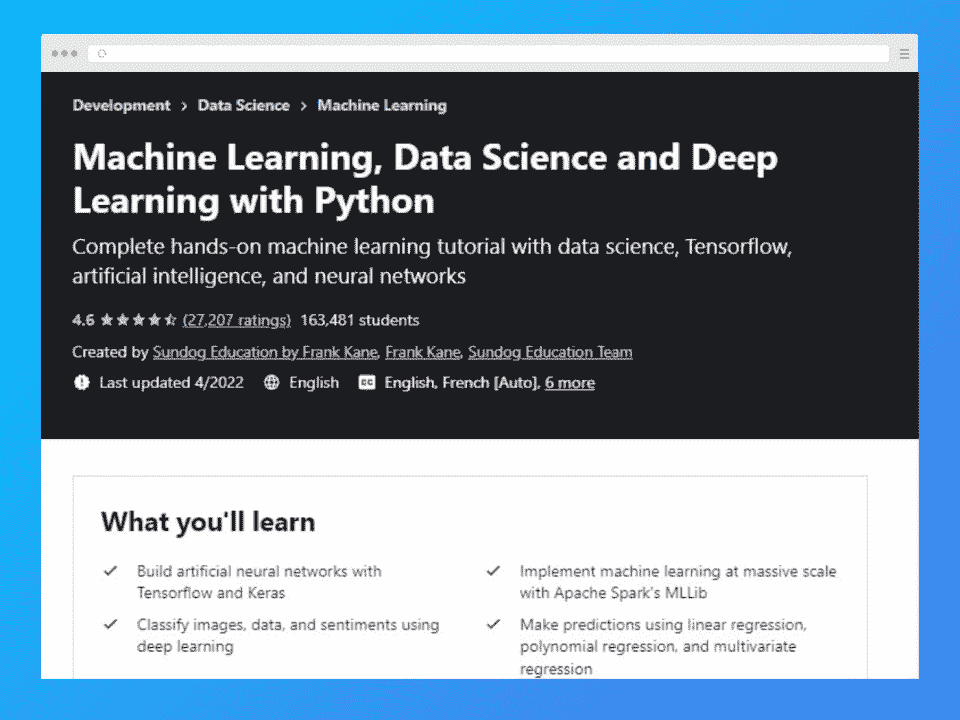
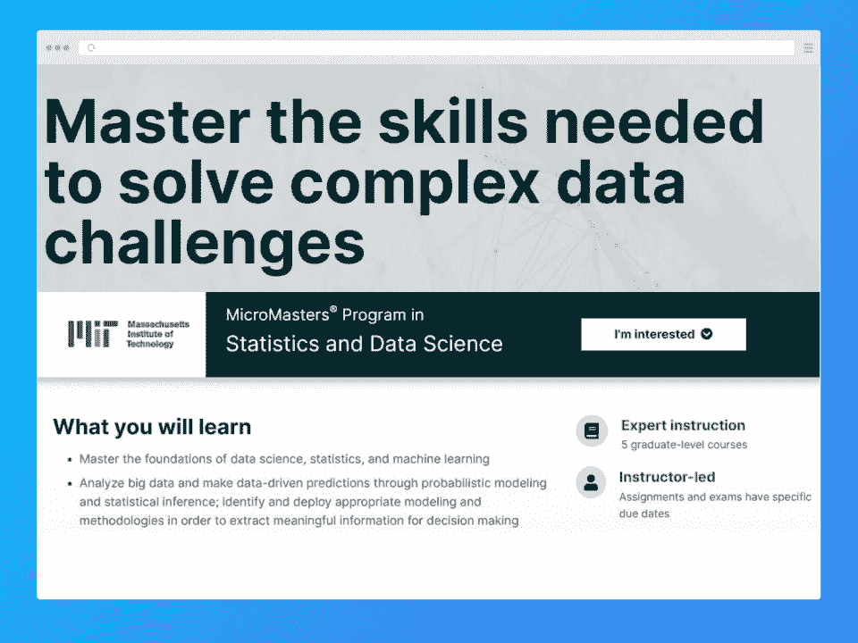
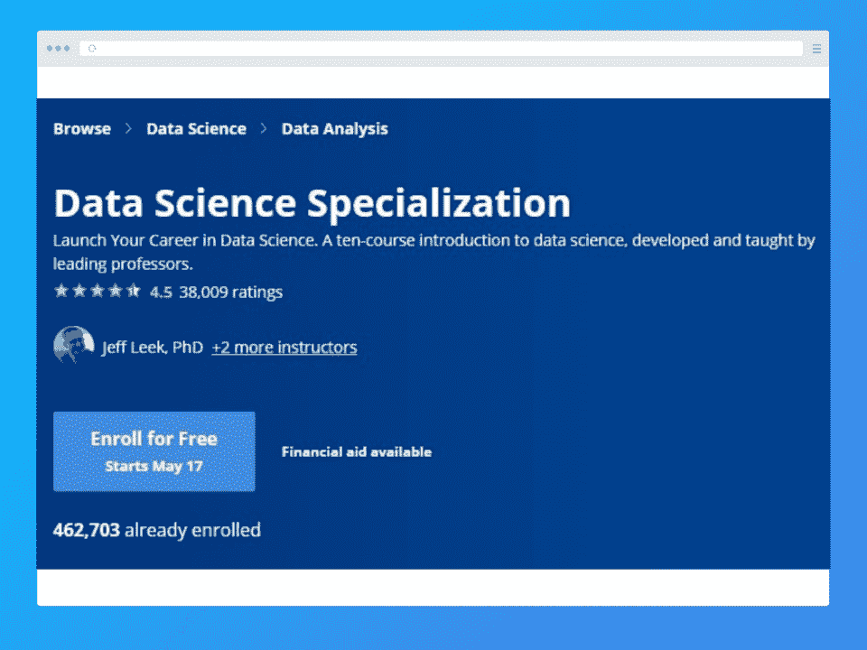
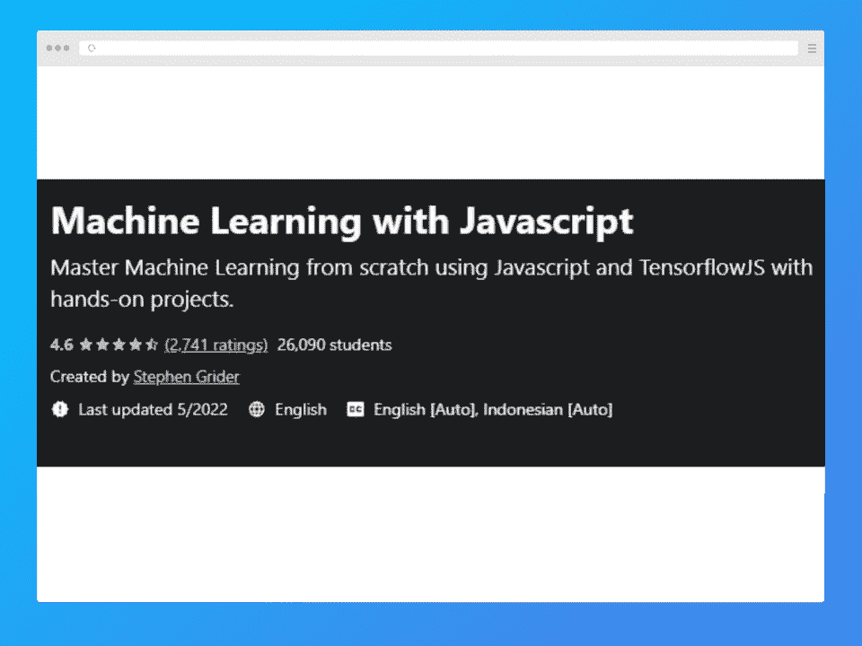
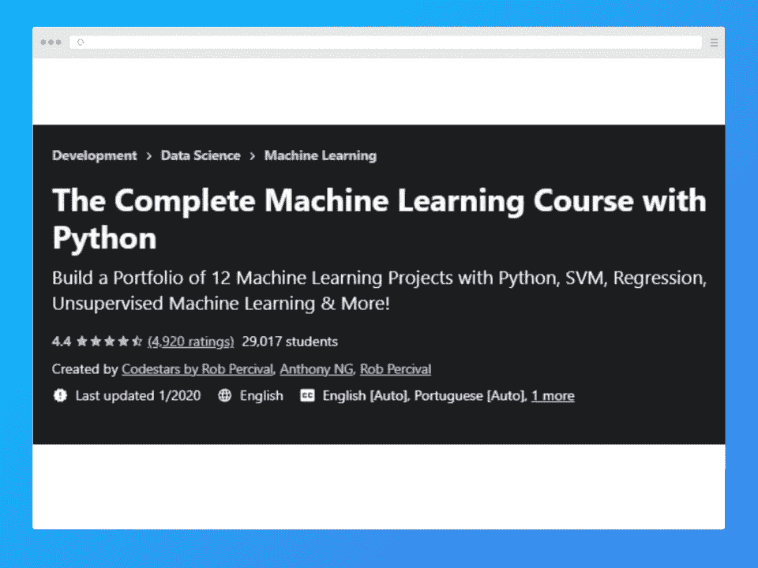
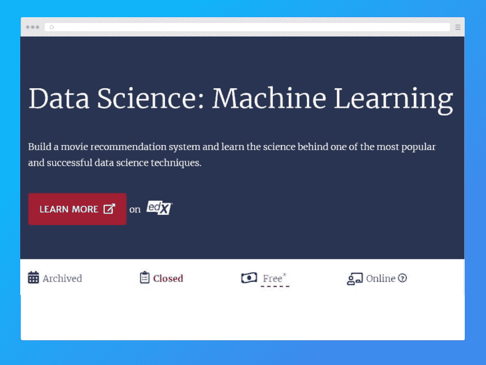
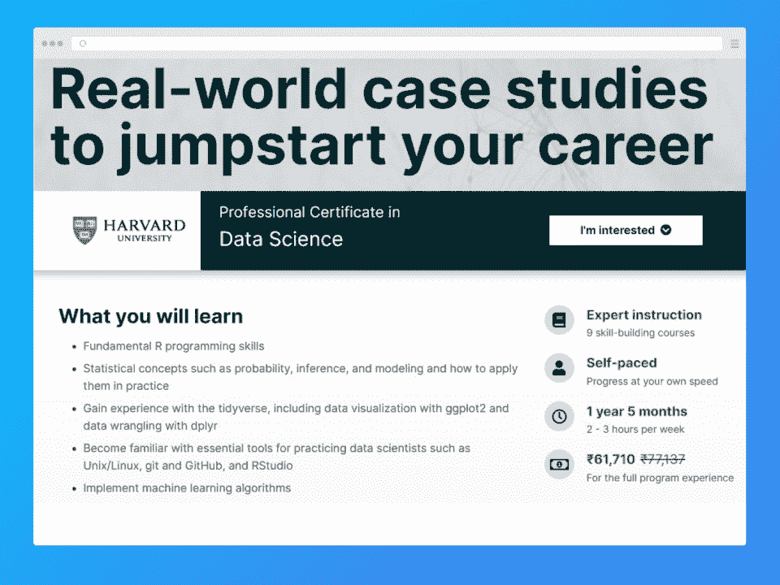
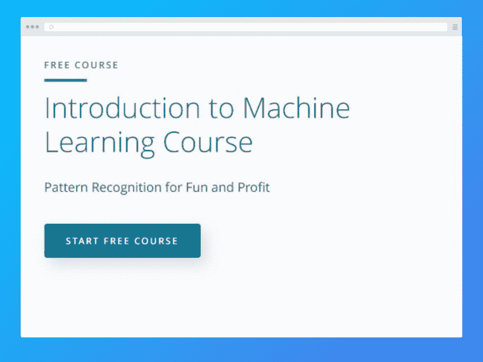
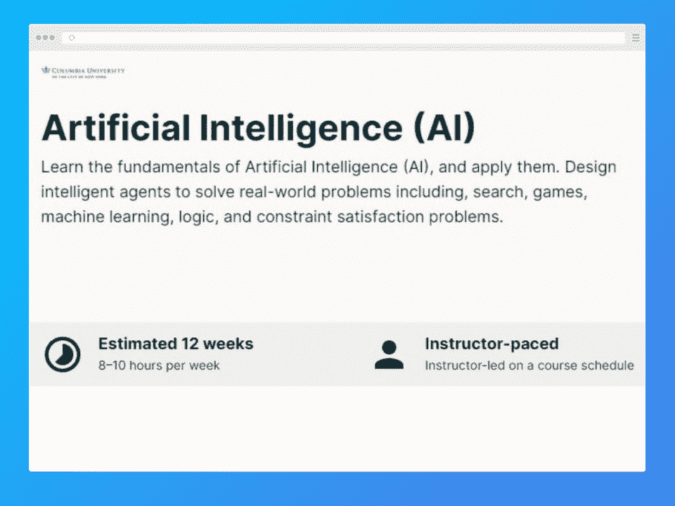

# 2023 年十大最佳数据科学在线课程

> 原文：<https://hackr.io/blog/data-science-courses>

政府、行业和学术界对专业数据科学专家的需求正在加速增长。为了获得应对现实世界挑战所需的必要知识和高端技能，个人可以参加一些最好的数据科学课程。

这些专业课程为数据科学的[基础知识提供了坚实的基础，对你的职业发展大有帮助。这里我们列出了最好的数据科学课程。首先，在我们详细描述课程之前，我们提供一个概要列表。](https://hackr.io/blog/what-is-data-science)

## **最佳数据科学课程**

## **2023 年学机器学习值得吗？**

机器学习是软件行业最热门的趋势之一。在大约十年的时间里，机器学习相关的工作岗位有了 [650%的增长。随着该领域在各种行业中找到更多应用，这一数字只会增加。该领域绝对值得学习，并且可以与其他领域协同使用，以创建特定于行业的产品。](https://www.calu.edu/academics/undergraduate/bachelors/data-science/jobs-career-salaries.aspx)

## **最佳数据科学课程**

在选择最佳在线数据科学项目时，我们重点关注覆盖深度、成本、实际项目和总体质量。这个列表并不详尽，但它提供了一个相当全面的选择范围。

| **课程信息** | **课程大纲** |
| **必备条件:**有脚本或编程经验者优先；高中数学知识**难度:**中级**持续时间:** 14 小时**费用:**25 美元 | [神经网络](https://hackr.io/blog/what-is-neural-networks)以及使用 Keras 和 TensorFlow 的深度学习

*   迁移学习
*   图像分类和识别
*   情感分析
*   多层次模型
*   回归分析
*   多次回归
*   随机森林和决策树
*   A/B 测试和实验设计
*   协同过滤
*   强化学习
*   支持向量机
*   特征工程
*   超参数调谐等等。
*   本 Udemy 机器学习课程涵盖了所有与机器学习相关的主要课题，包括人工神经网络、 [K-means 聚类](https://hackr.io/blog/k-means-clustering)和支持向量机。此外，您将通过 Seaborn 和 MatPlotLib 了解数据可视化的技术细节，并通过 MLLib Apache Spark 了解大规模机器学习的实际实现。

 |

该课程还涉足深度学习，教你如何使用深度学习概念对情感、图像和数据进行分类。对于打算转行的专业程序员和数据分析师来说，这是一个理想的学习计划。即使您是 Python 的新手，您也可以选择这个专业，因为它提供了一个速成课程，可以更好地理解这种语言。

**[在此报名](https://click.linksynergy.com/fs-bin/click?id=jU79Zysihs4&offerid=1045023.20078&type=3&subid=0)**

**课程信息**

| **课程大纲** | **必备条件:**有脚本或编程经验者优先；大学水平的微积分知识 |
| **难度:**中级**持续时间:** 14 个月，每周 10-14 小时费用:1500 美元 | 概率模型简介

*   社会科学中的数据分析
*   统计学基础
*   用 Python 进行机器学习
*   大数据分析
*   深度神经网络
*   聚类方法
*   麻省理工学院的统计学和数据科学专业的 MicroMasters 课程包括五门课程，旨在加强他们在机器学习、数据科学和统计学方面的基础。对于希望学习大数据分析的学生来说，这是一门理想的课程。您还将很好地理解使用概率建模、统计推断、非监督学习技术和监督技术进行数据驱动的预测。

 |

通过本课程，您可以更深入地了解统计学、[数据分析技术](https://hackr.io/blog/data-analysis-techniques)、概率、机器学习算法等概念。完成这一专业后，学生将能够胜任系统分析师、数据分析师和数据科学家等角色。

**[在此报名](https://www.awin1.com/cread.php?awinmid=6798&awinaffid=428263&ued=https%3A%2F%2Fwww.edx.org%2Fmicromasters%2Fmitx-statistics-and-data-science)**

**课程信息**

| **课程大纲** | **必备条件:**有脚本或编程经验者优先；高中数学知识 |
| **难度:**初学者**持续时间:** 11 个月，每周 7 小时**费用:**免费开源代码库 | r 编程

*   机器学习
*   数据科学
*   回归分析
*   Rstudio
*   排除故障
*   数据分析
*   聚类分析
*   正则表达式
*   数据操作
*   数据清理
*   约翰·霍普斯金的数据科学专业化课程涵盖了数据科学职业生涯的所有工具和概念。他们从提出正确的问题来推断开始，然后公布取得的结果。最终的顶点项目侧重于使用真实世界的数据构建数据产品所需的技能。
*   本课程包括两个部分，包括学习如何将数据转化为可操作的知识。您将大致了解数据科学家和数据分析师工作所需的工具、问题和数据。

 |

**[在此报名](https://coursera.pxf.io/15MgZa)**

**课程信息**

**课程大纲**

| **先决条件:**命令和终端线；数学基础知识 | **难度:**中级 |
| **持续时间:** 17.5 小时**费用:**50 美元识别相关数据记录观察数据 | 算法概述

*   张量拼接
*   张量流的应用
*   线性回归
*   矩阵乘法
*   提高性能的矢量化解决方案
*   用 Javascript 绘制 MSE 值
*   逻辑回归
*   随机和批量梯度下降
*   这个[机器学习课程](https://hackr.io/blog/machine-learning-courses)专为 Javascript 开发人员设计，深入到高级内存分析、构建 Tensorflow JS 库驱动的应用程序、编写 ML 代码以及其他与彻底理解该主题相关的主要主题。
*   此外，您还将学习创建与 Node JS 和浏览器兼容的程序。本课程将解释专门针对 Javascript 的性能增强技术和策略。
*   **[在此报名](https://click.linksynergy.com/deeplink?id=jU79Zysihs4&mid=39197&murl=https://www.udemy.com/course/machine-learning-with-javascript/)**

 |

**课程信息**

**课程大纲**

**先决条件:**基本的 Python 知识和对线性代数的理解

| **难度:**初级-中级 | **持续时间:** 17.5 小时 |
| **费用:**50 美元使用 Scikit-Learn 进行线性回归稳健回归交叉验证 | 逻辑回归

*   混淆矩阵
*   支持向量机的概念
*   径向基函数
*   线性 SVM 分类
*   可视化边界
*   集成机器学习方法
*   梯度推进机
*   kNN 简介
*   降维概念
*   使聚集
*   Python 的完整机器学习课程教你如何区分机器学习和经典编程、机器学习、深度学习。您还将获得关于神经网络、张量运算和高级主题的知识，如验证、剔除、测试、正则化以及欠拟合和过拟合。
*   你将对用于解决现实世界问题的机器学习工具有一个很好的理解。这是一个学习 ML 性能指标的很好的课程，包括回忆、R 平方、混淆矩阵、MSE、预见和准确性。
*   **[在此报名](https://click.linksynergy.com/deeplink?id=jU79Zysihs4&mid=39197&murl=https://www.udemy.com/course/machine-learning-course-with-python/)**
*   

 |

**课程信息**

**课程大纲**

**先决条件:**无

**难度:**初学者

| **持续时间:** 8 周，每周 2-4 小时 | **费用:**免费 |
| 机器学习基础主成分分析机器学习算法建筑推荐系统 | 正则化及其用途

*   交叉验证
*   由哈佛大学提供的这个[数据科学专业](https://online-learning.harvard.edu/course/data-science-machine-learning?delta=1)旨在帮助有志之士[学习机器学习](https://hackr.io/tutorials/learn-machine-learning-ml)以及与之相关的技术问题。与其他课程不同，该学习计划将帮助您更深入地挖掘 ML 的数据科学方法论。
*   该计划还提供培训数据的知识和使用数据集发现预测关系的有效方法。在本课程中，您将了解如何在各种产品中实现机器学习，如语音识别、邮政服务和垃圾邮件检测器等。
*   **[在此报名](https://www.awin1.com/cread.php?awinmid=6798&awinaffid=428263&ued=https%3A%2F%2Fonline-learning.harvard.edu%2Fcourse%2Fdata-science-machine-learning%3Fdelta%3D1)**
*   
*   **课程信息**

 |

**课程大纲**

**先决条件:**Python 基础知识

**难度:**中级

**持续时间:** 3 个月，每周 10 小时

| **费用:**免费 | 模型构建 |
| 神经网络设计Pytorch 培训无监督学习方法实现深度学习 | Udacity 提供的这个机器学习介绍项目特别关注监督模型、数据清洗、[机器学习算法](https://hackr.io/blog/machine-learning-algorithms)、无监督学习和深度学习。在线课程分为不同的步骤，每个步骤都为学习者提供实际作业，包括代码项目和练习。

*   专业化通过创建顶级组织可能使用的产品来提供身临其境的学习体验。学生们还会得到一些指导，比如面试准备、职业档案维护以及职业发展的其他重要方面。
*   **[在此报名](https://imp.i115008.net/rnG2Kd)**
*   
*   **课程信息**
*   **课程大纲**

 |

**先决条件:**无

**难度:**初学者

**持续时间:** 1 年零 5 个月，每周 3 小时

费用:800 美元

| 数据科学基础 | 数据科学可视化和概率 |
| 推理和建模生产力工具争论线性回归 | 机器学习

*   顶点
*   HarvardX 数据科学计划向学生传授处理与数据分析相关的现实世界挑战的基本技能和知识。专业化涵盖了推理、机器学习和回归等核心概念。您还将学习开发基本技能，包括使用 ggplot2 的数据可视化、R 编程、使用 dplyr 的[数据争论](https://hackr.io/blog/what-is-data-wrangling)和文件组织。
*   此外，您还将学习使用高级工具实现机器学习算法的技巧和技术。该计划还通过业务案例研究提供了对数据科学概念的深入探究。
*   **[在此报名](https://www.awin1.com/cread.php?awinmid=6798&awinaffid=428263&ued=https%3A%2F%2Fwww.edx.org%2Fprofessional-certificate%2Fharvardx-data-science)**
*   
*   **课程信息**
*   **课程大纲**
*   **先决条件:**机器学习背景或相关经验

 |

**难度:**中级

**期限:** 10 周

**费用:**免费

使用[朴素贝叶斯](https://hackr.io/blog/top-steps-to-learn-naive-bayes-algorithm)

| 后验概率计算 | 支持向量机 |
| 使用 Python 编写决策树选择机器学习算法安然电子邮件数据集模式回归和异常值 | 聚类和扩展

*   Udemy 上的这个机器学习程序涵盖了统计学和计算机科学。这门全面的课程还深入到机器学习的更多技术方面，如算法和支持向量机。
*   此外，您还将学习如何提取和识别有用的机器学习特征，以实现数据的最佳表示。由于其专业设计的教学大纲，该课程提供了丰富的学习体验。
*   [在此注册](https://imp.i115008.net/151WAD)
*   
*   **课程信息**
*   **课程大纲**
*   先决条件:微积分、统计学和高等代数知识，以及基本的编程知识
*   **难度:**初学者

 |

**持续时间:** 1 年，每周 8-10 小时

费用:894 美元

人工智能原理

机器学习基础和算法

| 机器人学 | 动画和 CGI 运动 |
| 神经网络设计这个 edX 人工智能和机器学习课程涵盖了该领域的所有核心主题和其他主题，如机器人和 CGI 运动。您还将通过实际例子获得应用这些概念的实践经验。这是一个理想的课程，为学生追求计算机科学研究生课程，谁想要一些额外的知识去与学位。该专业教授学生在生物信息学、机器人控制、自主导航、数据挖掘和其他高级系统方面开发自动化计算机系统。**[在此报名](https://www.awin1.com/cread.php?awinmid=6798&awinaffid=428263&ued=https%3A%2F%2Fwww.edx.org%2Fcourse%2Fartificial-intelligence-ai)** | **结论**

*   机器学习是一个有趣的课题，有着巨大的应用潜力。它允许从业者无限制地试验他们的技能和知识。为了在这一领域建立一个职业生涯，你应该优先获得一些关键概念以及如何应用它们的良好基础。
*   选择我们最好的在线数据科学课程中的任何课程，开始您的旅程。这些都是值得的时间和金钱，并允许你在任何地方和任何时间学习。
*   **常见问题解答**
*   **1。数据科学证书值得吗？**
*   数据科学证书是有益的，因为它们证明你拥有从事相关项目的技能和知识。申请一个职位时，一个知名学术机构的证书可能会有所不同。

 |

**2。数据科学课程大纲应该包括什么？**

数据科学课程的教学大纲中应该包括几个重要的主题。这些包括算法、函数和工具。顶级数据科学课程涵盖了你需要知道的关于机器学习的一切。

**3。我如何准备数据科学课程？**

## 你可以通过学习理论和实际参与项目来准备数据科学课程。互联网上有大量的数据集可以用来磨练你的技能。

**4。没有经验可以学数据科学吗？**

是的，在没有任何经验的情况下学习数据科学是可能的，许多人已经这样做了。这里列出的课程会有所帮助，因为它们会带你从基础开始。大量的实践也很有帮助。

## **人也在读:**

#### **1\. Are Data Science certificates worth it? **

Data science certificates can be beneficial because they prove that you have the skill and knowledge to work on related projects. A certification from a reputed academic institution can be the difference when applying for a position.

#### **2\. What should a data science course syllabus include? **

There are several important subjects that should be included in the syllabus of a data science course. These include algorithms, functions, and tools. The top data science courses cover everything you need to know about machine learning.

#### **3\. How do I prepare for a data science course? **

You can prepare for a data science course by studying theory and actually working on projects. There are plenty of datasets available on the internet that you can use to hone your skills.

#### **4\. Can I learn data science without experience?**

Yes, it is possible to learn data science without any experience and many have done so. The courses listed here will help, as they take you through right from the basics. A lot of hands-on practice also helps.

**People are also reading:**