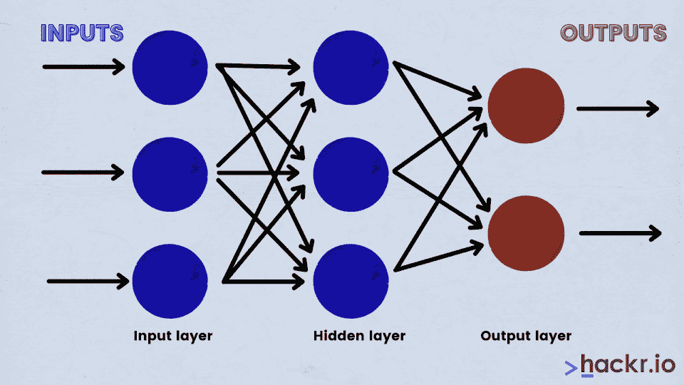
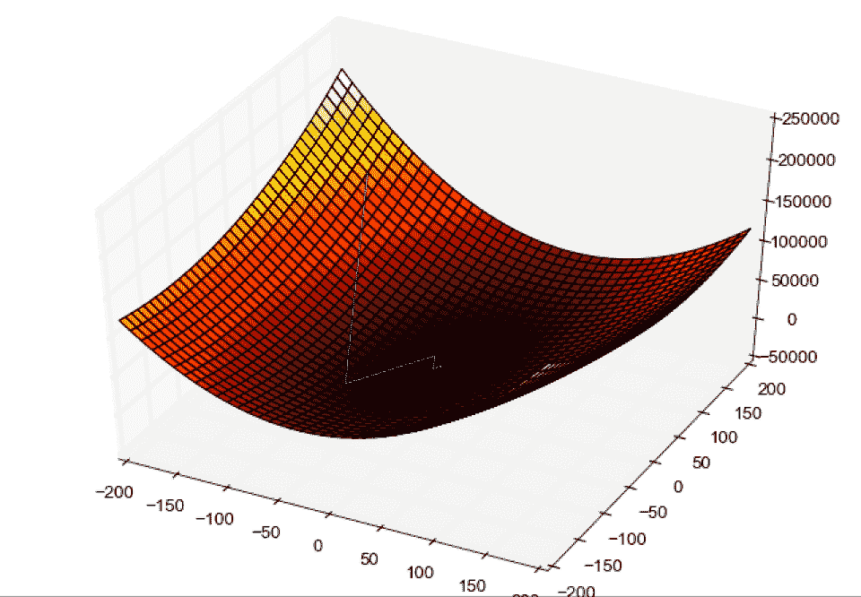
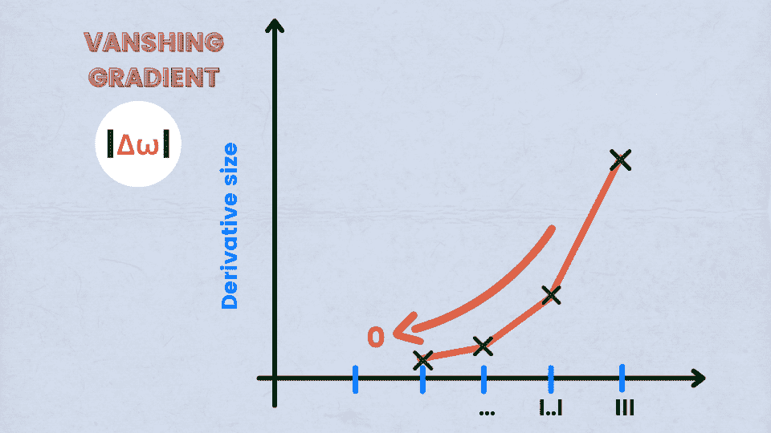
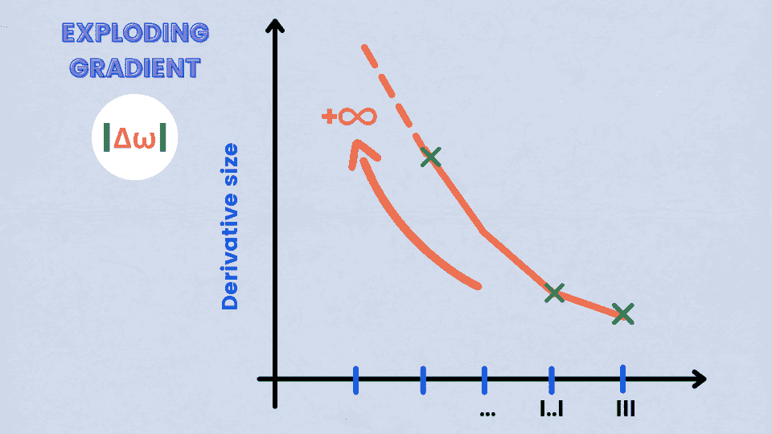

# 2023 年顶级数据科学面试问答[更新]

> 原文：<https://hackr.io/blog/data-science-interview-questions>

数据科学领域日益壮大。因此，对于那些有兴趣从事数据科学家职业的人来说，有很多机会。我们不会在这里详细介绍，但如果你刚刚开始接触数据科学，请先阅读关于如何成为数据科学家的。

如果你已经知道诀窍，那么是时候进入数据科学面试问题了，这样你就能得到梦想中的角色。在一些关于数据科学面试的一般性问题之后，我们列出了初学者和技术数据科学面试的问题和答案。用这些来帮助你准备。

## **我该如何准备数据科学面试？**

就像你参加任何其他技术面试一样——确保你已经掌握了基本知识，并且能够用代码执行想法。当然，你也要拿出一份好的简历，做好总结以往经验的准备。

总的来说，你还应该研究一下你申请的公司和具体职位。你想问一些关于软件和公司本身的问题，因为这可以突出你对这个职位的热情。看看 Glassdoor 上的评论，了解一下这家公司和过去员工的经历也是值得的。

## **数据科学面试难吗？**

数据科学面试不一定比其他面试更难或更容易。这是一个主观问题，所以没有明确的答案。如果你已经很好地掌握了基础知识，能够透彻清晰地解释你参与过的任何项目，并且能够执行技术概念，你会做得很好。

## **数据科学家有编码面试吗？**

是的，你可能会在数据科学面试中被要求编码。然而，这种机会比你对典型软件开发角色的期望要低。

通常，编码问题与数据操作或 SQL 知识有关，但您也可能面临与算法、编程实践和数据结构有关的问题。

科技公司和专注于机器学习的公司的数据科学家面试往往涉及编码问题。

## **面向初学者的数据科学面试问题**

#### **1。有监督学习和无监督学习有什么区别？**

监督学习是一种机器学习，其中从标记的训练数据中推断出函数。训练数据包含一组训练示例。

另一方面，无监督学习是指从包含输入数据但没有标记响应的数据集得出推论。

以下是两种机器学习之间的各种其他差异:

| **监督学习** | **无监督学习** |
| 使用的算法 | 决策树、K-最近邻算法、神经网络、回归和支持向量机 | 异常检测、聚类、潜在变量模型和神经网络 |
| 用于的问题 | 分类和回归 | 分类、降维和密度估计 |
| 使用 | 预言；预测；预告 | 分析 |

我们已经详细写了监督学习和非监督学习之间的差异，所以请查看更多信息。

#### **2。什么是选择偏差，有哪些不同的类型？**

选择偏差通常与没有随机选择参与者的研究有关。这是一种当研究者决定谁将被研究时发生的错误。在某些场合，选择偏差也被称为选择效应。

换句话说，选择偏差是样本收集方法导致的统计分析失真。如果不考虑选择偏差，研究得出的一些结论可能不准确。

以下是各种类型的选择偏差:

*   抽样偏差:由于人口的非随机抽样造成的系统误差，导致人口中的某些成员比其他人更不可能被包括在内，从而导致有偏差的样本
*   时间间隔:通常由于伦理原因，试验可能会以一个极值结束，但是最大方差的变量最有可能达到该极值，即使所有变量都具有相似的均值
*   数据:选择特定数据子集来支持结论或任意拒绝坏数据时的结果
*   流失:由流失引起，即参与者的流失、未完成的试验受试者或测试的折扣

#### **3。A/B 测试的目的是什么？**

A/B 测试是一种统计假设测试，旨在用两个变量 A 和 B 进行随机实验。A/B 测试的目标是通过识别网页的任何更改，最大限度地提高某种感兴趣的结果的可能性。

A/B 测试是一种非常可靠的方法，可以用来找出企业的最佳在线营销和促销策略，可以用来测试一切，从销售电子邮件到搜索广告和网站文案。

#### **4。在 Python 和 R 之间，你会选择哪一个来进行文本分析，为什么？**

对于文本分析，Python 将在 R 上占上风，原因如下:

*   Python 中的 Pandas 库提供了易于使用的数据结构以及高性能的数据分析工具
*   Python 对于所有类型的文本分析都有更快的性能

在这里了解更多关于 [R vs Python](https://hackr.io/blog/r-vs-python) 的信息。

#### **5。数据分析中数据清洗的目的是什么？**

数据清理可能是一项艰巨的任务，因为随着数据源数量的增长，清理数据所需的时间也呈指数级增长。

这是由于额外来源产生的大量数据。数据清理可能会占用执行数据分析任务所需总时间的 80%。

然而，在数据分析中使用数据清理有几个原因。其中最重要的两个是:

*   清理不同来源的数据有助于将数据转换为易于处理的格式
*   数据清理提高了机器学习模型的准确性

#### **6。你能比较验证集和测试集吗？**

验证集是用于参数选择的训练集的一部分。它有助于避免过度适应正在开发的机器学习模型。

测试集用于评估或测试经过训练的机器学习模型的性能。

#### 7 .**。什么是线性回归和逻辑回归？**

线性回归是一种形式的统计技术，其中某个变量 Y 的得分是基于第二个变量 X 的得分来预测的，第二个变量 X 被称为预测变量。Y 变量被称为标准变量。

也称为 logit 模型，逻辑回归是一种从预测变量的线性组合预测二元结果的统计技术。

#### **8。解释推荐系统并陈述一个应用。**

推荐系统是信息过滤系统的一个子类，用于预测用户对某种产品的偏好或评分。

推荐系统的一个应用是亚马逊的产品推荐部分。此部分包含基于用户搜索历史和过去订单的项目。

#### **9。分析项目包括哪些步骤？**

以下是分析项目中涉及的众多步骤:

*   理解业务问题
*   探索数据并理解它
*   通过检测异常值、转换变量、处理缺失值等方式为建模准备数据
*   运行模型并分析结果，以便对模型进行适当的更改或修改(这是一个重复的步骤，直到达到最佳结果)
*   使用新数据集验证模型
*   实施模型并跟踪结果以分析其性能

#### 10。什么是深度学习？

深度学习是机器学习的一种范式，在一定程度上类似于人脑的功能。这是一种基于卷积神经网络(CNN)的神经网络方法。

深度学习有着广泛的用途，从社交网络过滤到医学图像分析和语音识别。虽然深度学习已经存在很长时间了，但它只是最近才在全球范围内曝光。这主要是由于:

*   数据生成量的增加
*   运行深度学习模型所需的硬件资源的增长

Caffe、Chainer、Keras、微软认知工具包、Pytorch 和 TensorFlow 是一些最受欢迎的深度学习框架。

#### 11.什么是梯度下降？

蓝线表示梯度下降算法

简而言之，梯度下降是一个数学函数，它一直下降到谷底。这是一种最小化算法，用于最小化给定的激活函数。

函数输出相对于输入的变化程度称为梯度。它测量所有权重相对于误差变化的变化。梯度也可以理解为函数的斜率。

#### **12。成为一名数据科学家，哪些技能很重要？**

成为认证数据科学家所需的技能包括:

1.  了解内置数据类型，包括列表、元组、集合和相关的。
2.  精通 N 维数字阵列。
3.  应用熊猫数据框架的能力。
4.  元素向量中的强大保持性能。
5.  NumPy 阵列的矩阵运算知识。

#### 13。关于 Python 数据分析，数据科学家需要哪些技能？

作为一名数据科学家，需要具备以下技能来帮助使用 [Python](https://hackr.io/tutorials/learn-python) 进行数据分析:

*   了解熊猫数据帧、Scikit-learn 和 N 维 NumPy 数组。
*   了解如何在 NumPy 数组上应用基于元素的向量和矩阵运算。
*   了解内置数据类型，包括元组、集、字典等等
*   了解 Anaconda 发行版和 conda 包管理器
*   编写高效的列表理解，小而简洁的函数，避免传统的 for 循环
*   Python 脚本和优化瓶颈的知识

#### **14。为什么 TensorFlow 在数据科学中被认为很重要？**

TensorFlow 被认为是学习数据科学时的高优先级，因为它提供了对 C++和 Python 等语言的支持。因此，与 Keras 和 Torch 库相比，一些数据科学过程受益于更快的编译和完成。TensorFlow 还支持 CPU 和 GPU，以便更快地输入、编辑和分析数据。

#### 15。什么是辍学？

Dropout 是数据科学中的一个术语，用于随机删除网络中隐藏和可见的单元。它们通过删除多达 20%的节点来防止数据过度拟合，以便可以为收敛网络所需的迭代安排所需的空间。

#### 16。各种机器学习库有哪些，有哪些好处？

各种机器学习库及其优势如下。

*   Numpy:用于科学计算
*   Statsmodels:用于时间序列分析
*   熊猫:用于管状数据分析
*   Scikit learns:用于数据建模和预处理
*   TensorFlow:用于深度学习
*   正则表达式:用于文本处理
*   Pytorch:用于深度学习
*   NLTK:用于文本处理

#### **17。陈述一些深度学习框架。**

一些深度学习框架是:

*   Caffe
*   Keras
*   TensorFlow
*   Pytorch
*   链条机
*   微软认知工具包

#### 18。什么是纪元？

数据科学中的 Epoch 表示整个数据集的一次迭代。它包括应用于学习模型的所有内容。

#### **19。什么是批？**

批处理是数据集的一系列细分集合，有助于将信息传递到系统中。当开发人员无法将整个数据集一次传递到神经网络中时，可以使用它。

#### 20。什么是迭代？举个例子。

迭代是将数据分为不同的组，在一个时期内应用。

例如，当有 50，000 个图像，并且批量大小为 100 时，该时期将运行大约 500 次迭代。

#### **21。成本函数是什么？**

成本函数是评估模型性能好坏的工具。它考虑了反向传播过程中输出层的误差和损失。在这种情况下，误差在神经网络中向后移动，并且应用各种其他训练函数。

#### **22。什么是超参数？**

超参数是一种参数，其值在学习过程之前设定，以便可以识别网络训练要求和改进网络结构。这个过程包括识别隐藏单元、学习率和纪元等。

#### **23。深度学习和机器学习有什么区别？**

是的，深度学习和机器学习是有区别的。这些是:

| 深度学习 | 机器学习 |
| 它赋予计算机无需明确编程就能学习的能力 | 它赋予计算机一种有限到无限的能力，在这种能力中，没有编程就不能做任何重要的事情，而许多事情不需要事先编程就可以完成。它包括监督、非监督和强化机器学习过程。 |
| 它是机器学习的一个子组件，涉及受人脑结构和功能启发的算法，称为人工神经网络 | 它包括深度学习作为其组成部分之一 |

## **技术数据科学面试题**

#### **24。解释过拟合和欠拟合。**

在机器学习和统计学中，为了对未经训练的数据做出可靠的预测，需要将模型拟合到一组训练数据中。过度拟合和欠拟合是这样做时最常见的两种建模错误。

遭受过拟合的统计模型与一些随机误差或噪声有关，而不是潜在的关系。当统计模型或机器学习算法过于复杂时，会导致过度拟合。复杂模型的一个例子是当与观察的总数相比时具有太多参数的模型。

当出现欠拟合时，统计模型或机器学习算法无法捕捉数据的潜在趋势。当试图将线性模型拟合到非线性数据时，会出现欠拟合。

尽管过拟合和欠拟合都会产生较差的预测性能，但它们的方式是不同的。过度拟合模型对训练数据的微小波动反应过度，而欠拟合模型对更大的波动反应不足。

#### **25。什么是批量正常化？**

批处理规范化是一种技术，通过它可以尝试提高神经网络的性能和稳定性。这可以通过归一化每层中的输入来实现，使得平均输出激活保持为 0，标准偏差为 1。

#### **26。你说的整群抽样和系统抽样是什么意思？**

研究广泛分布的目标人群会变得很困难。应用简单的随机抽样变得无效，使用整群抽样技术。一个聚类样本是一个概率样本，其中每个抽样单元是一个元素的集合或聚类。

遵循系统抽样技术，从有序抽样框架中选择元素。该列表以循环方式前进。这是以这样一种方式完成的，即一旦到达列表的末尾，就从开始或顶部再次进行同样的操作。

#### **27。什么是特征向量和特征值？**

特征向量有助于理解线性变换。它们通常是在数据分析中为相关或协方差矩阵计算的。换句话说，特征向量是某些特定的线性变换通过压缩、翻转或拉伸所沿着的方向。

特征值可以理解为特征向量方向上的变换强度，也可以理解为压缩发生的因素。

#### **28。什么是异常值，你如何对待它们？**

异常值，或简称为异常值，是统计数据中不属于某一特定人群的数据点。离群值是一个异常的观察值，它与属于该集合的其他值有很大的不同。并非所有的极值都是异常值。

可以通过使用单变量分析或一些其他图形分析方法来识别异常值。少数异常值可以单独评估，但评估大量异常值需要用第 99 或第 1 百分位值替换。

有两种处理异常值的流行方法:

1.  更改该值，使其在一个范围内
2.  只需删除该值

#### **29。如何定义聚类算法中的聚类数？**

聚类的主要目的是以这样一种方式将相似的身份组合在一起，即当一个组中的实体彼此相似时，这些组仍然彼此不同。

通常，平方和中的[用于解释一个类内的同质性。为了定义聚类算法中的聚类数，针对与聚类数相关的范围绘制了 WSS。所得的图形称为肘形曲线。](https://discuss.analyticsvidhya.com/t/what-is-within-cluster-sum-of-squares-by-cluster-in-k-means/2706)

肘形曲线图包含一个点，该点表示 WSS 没有任何减少的点柱。这就是所谓的弯曲点，用 K-Means 表示 K。

尽管前面提到的是广泛使用的方法，但是另一个重要的方法是层次聚类。在这种方法中，首先创建树状图，然后从树状图中识别不同的组。

#### 30.反向传播是如何工作的？陈述变体。

反向传播指的是用于多层神经网络的训练算法。按照反向传播算法，误差从网络的一端转移到网络内部的所有权重。这样做可以有效地计算梯度。

反向传播的工作方式如下:

*   训练数据的前向传播
*   输出和目标用于计算导数
*   反向传播，用于计算误差相对于输出激活的导数
*   使用先前计算的导数生成输出
*   更新权重

以下是反向传播的各种变体:

*   批量梯度下降:为整个数据集计算梯度，并在每次迭代中执行更新
*   小批量梯度下降:小批量样本用于计算梯度和更新参数(随机梯度下降方法的变体)
*   随机梯度下降:仅使用单个训练样本来计算梯度和更新参数

#### 31。你对自动编码器了解多少？

自动编码器是简单的学习网络，用于将输入转换为输出，误差尽可能小。这意味着输出的结果非常接近输入。

在输入和输出之间添加了几层，每层的尺寸小于属于输入层的尺寸。自动编码器接收为重构输出而编码的未标记输入。

#### 32。请解释玻尔兹曼机器的概念。

玻尔兹曼机器具有简单的学习算法，使其能够发现代表训练数据中复杂规律的迷人特征。它主要用于优化某个给定问题的数量和权重。

玻尔兹曼机器中涉及的简单学习算法在具有多层特征检测器的网络中非常慢。

#### 33。甘是什么？

生成式对抗网络从噪声向量中获取输入，并将它们发送到生成器，然后发送到鉴别器，以识别和区分独特的和虚假的输入。

#### 34。GAN 的成分有哪些？

GAN 有两个重要组成部分。这些是:

1.  生成器:生成器充当伪造者，它创建伪造的副本
2.  鉴别器(Discriminator ):鉴别器充当伪造和唯一(真实)副本的识别器

#### 35。什么是计算图？

计算图是基于张量流的图形表示。它有一个由不同种类的节点组成的广泛网络，其中每个节点代表一个特定的数学运算。这些节点中的边称为张量。这就是计算图被称为输入张量流的原因。计算图的特征在于图形式的数据流；因此，它也被称为数据流图。

#### 36。张量是什么？

张量是数学对象，表示以字母、数字和等级的形式作为输入到神经网络的数据输入的更高维度的集合。

#### 37。批量下降和随机梯度下降有什么区别？

分批下降和随机梯度下降的区别如下:

| 批量梯度下降 | 随机梯度下降 |
| 使用完整的数据集帮助计算梯度 | 仅使用单个样本有助于计算梯度 |
| 需要时间来收敛 | 收敛时间更短 |
| 对于分析目的来说，体积很大 | 出于分析目的，容量较低 |
| 相对不频繁地更新权重 | 更频繁地更新权重 |

#### 38。什么是激活函数？

激活函数有助于在神经网络中引入非线性。这样做是为了帮助学习复杂函数的过程。没有激活函数，神经网络将不能只执行线性函数和应用线性组合。因此，激活功能通过应用人工神经元来提供复杂的功能和组合，这有助于根据输入传递输出。

#### 39。什么是消失渐变？

消失梯度是在递归神经网络的训练期间斜率太小的情况。梯度消失的结果是较差的性能结果、较低的准确度和长期的训练过程。

#### 40。什么是爆炸渐变？

爆炸梯度是在训练递归神经网络期间误差以指数速率或高速率增长的情况。该误差梯度累积并导致对神经网络应用大量更新，引起溢出，并导致 NaN 值。

#### 41。LSTM 的完整形式是什么？它的功能是什么？

LSTM 代表长期短期记忆。它是一个递归神经网络，能够学习长期依赖性，并作为其默认行为的一部分回忆更长时间的信息。

#### **42。LSTM 有哪些不同的步骤？**

LSTM 的不同步骤如下。

*   第一步:网络帮助决定什么需要被记住和忘记
*   步骤 2:选择可以更新的单元状态值
*   步骤 3:网络决定什么可以作为当前输出的一部分

#### **43。CNN 中的 Pollingin 是什么？**

轮询是一种用于减少 CNN 的空间维度的方法。它有助于降采样操作降低维数和创建合并的要素地图。CNN 中的池有助于在输入矩阵上滑动过滤矩阵。

#### **44。什么是 RNN？**

递归神经网络是一种人工神经网络，它是一个数据序列，包括股票市场、数据序列，包括股票市场、时间序列和各种其他数据。RNN 应用背后的主要思想是理解前馈网络的基础。

#### **45。CNN 上有哪些不同的层？**

CNN 有四个不同的层次。这些是:

1.  卷积层:在这一层，创建了几个小图片窗口来浏览数据
2.  ReLU 层:这一层有助于将非线性引入网络，并将负像素转换为零，以便输出成为校正后的特征图
3.  汇集层:这一层减少了特征图的维度
4.  完全连接层:该层识别并分类图像中的对象

#### **46。什么是人工神经网络？**

人工神经网络是一组受生物神经网络启发的特定算法，旨在适应输入的变化，以便实现最佳输出。它有助于生成最佳结果，而无需重新设计输出方法。

#### **47。什么是集成学习？**

集成学习是一个组合作为个体模型的不同学习者集合的过程。它有助于提高模型的稳定性和预测能力。

#### **48。集成学习有哪些不同的种类？**

不同种类的集成学习包括:

1.  Bagging:它在一个小群体上实现了简单的学习器，并采用均值进行估计
2.  增强:它调整观察的权重，从而在做出结果预测之前将人群分类到不同的集合中

## **底线**

这是数据科学面试中最重要的问题。这个列表绝不是详尽的，我们敦促你做更多的研究，特别是数据科学技术面试问题。

参加一些最好的数据科学课程和教程也会有所帮助。Udemy 的[数据科学职业指南——面试准备](https://click.linksynergy.com/deeplink?id%3DjU79Zysihs4%26mid%3D39197%26murl%3Dhttps://www.udemy.com/course/data-science-career-guide-interview-preparation/&sa=D&source=editors&ust=1646717856228256&usg=AOvVaw1PbbewMCdDNaR8QHtDpk_q)对面试准备特别有用。我们还向您推荐[数据科学家实用统计学:50 个基本概念第一版](https://geni.us/0TcA)，这是关于该主题的最佳书籍之一。

**人也在读:**