# 初学者和专家的 18 个最佳数据科学工具[2023]

> 原文：<https://hackr.io/blog/data-science-tools>

总体而言，数据科学已经为 IT 和业务带来了变革。这个不断扩展的领域试图通过发现和理解模式来从数据中提取隐藏的价值，以预测结果，训练机器学习模型，或更好地理解数据集的全貌。

在一个大规模数据生成的时代，[数据科学](https://hackr.io/blog/what-is-data-science)被那些希望分析其数据以生成优化的商业见解并提高利润或效率的公司大量需求。

[数据科学家](https://hackr.io/blog/how-to-become-a-data-scientist)在这里扮演着重要的角色，因为他们组织、评估和研究数据及其模式。

除了拥有适当的资格和教育，有抱负的数据科学家必须精通顶级数据科学工具。

这包括精通数据科学生命周期中的至少一种工具:数据采集或捕获、数据处理或清理、数据仓库、数据探索或分析以及数据可视化。

在最佳数据科学工具的帮助下，专业人员可以通过识别相关问题、从相关来源收集数据、组织和转换数据并分析这些数据来交流发现，从而制定更好的业务决策，从而从数据中生成业务解决方案。

通常，我们可以将数据科学工具分为两个领域，即面向程序员的工具和面向非程序员的工具。

本文提供了顶级数据科学工具列表，以及它们可以如何帮助您，无论您是一名缺乏编程经验的有抱负的数据科学家，还是一名经验丰富的专家。

对于拥有海量数据的数据驱动型公司来说，将原始数据转换为对业务用户和组织有意义且有潜在价值的数据是一大挑战。

ETL(提取、转换和加载)工具是从各种来源收集数据并执行数据预处理以将其转换为逻辑格式供进一步分析的首选组合解决方案。

这些工具通过从底层来源提取数据、转换数据以适应预定义的模式，然后最终将数据加载到目标位置(数据库、数据仓库或数据湖)来执行数据处理。下面是一些最流行的 ETL 数据科学软件工具。

**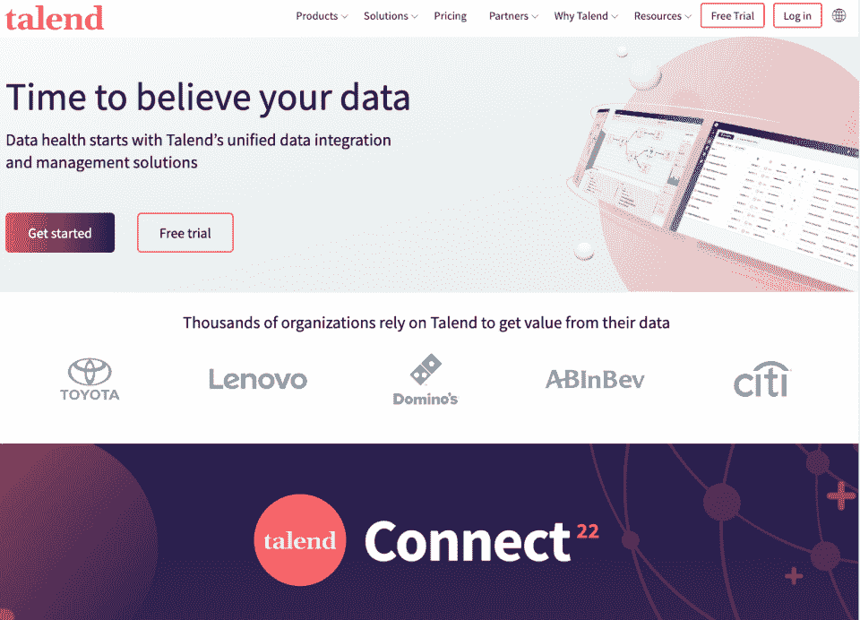**

Talend 是一个开源数据科学工具，支持数据处理、集成和应用程序集成。这个工具的优点包括实时统计、易于扩展、高效管理、早期清理、更快的设计、更好的协作和本机代码。

**主要特性:**

*   **高效的任务开发&部署:**自动化并维护当前任务
*   **以用户为中心:**拥有庞大社区的开源统一平台
*   **先进技术:**根据当前和未来的用户需求定期更新

**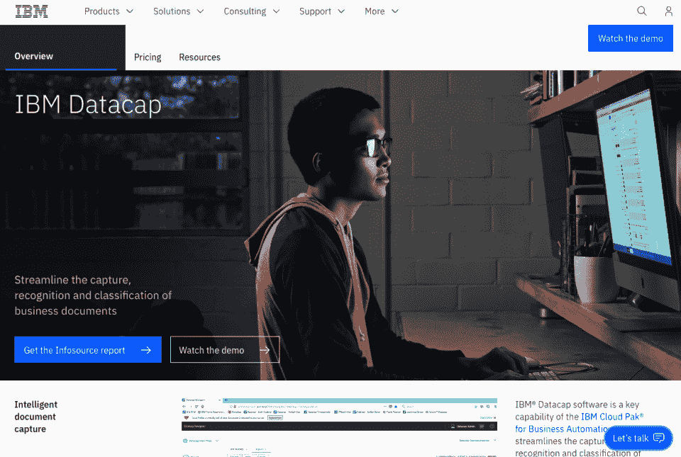**

IBM Datacap 可以获取文档、提取信息，并将文档交付给后端的其他下游业务流程，从而利用灵活性、准确性和自动化。

这种数据科学工具使用自然语言处理(NLP)、文本分析和机器学习(ML)技术来自动识别、提取和分类非结构化或可变文档中的内容。

它还可以对来自扫描仪、多功能外围设备和传真机的纸质文档进行多通道处理。

该软件可以帮助数据科学家减少劳动力和纸张成本，提供有意义的信息，并支持更快的决策。

**主要特性:**

*   **丰富的移动性:**使用智能手机或平板电脑捕获和提交文档。还提供 iOS 和 Android SDKs，将 Datacap 移动功能嵌入到您自己的 iOS 和 Android 应用程序中
*   **机器人流程自动化(RPA):** 通过自动化使用 IBM RPA 插入高级文档建议
*   **智能捕获:**通过机器学习，从非结构化、复杂或高度可变的文档中自动分类和提取内容和上下文
*   **数据保护&内容管理:**保护敏感数据，支持内容协作以审查高级信息

**建议课程**

[2023 数据科学课程:完整数据科学训练营](https://click.linksynergy.com/deeplink?id=jU79Zysihs4&mid=39197&murl=https%3A%2F%2Fwww.udemy.com%2Fcourse%2Fthe-data-science-course-complete-data-science-bootcamp%2F)

**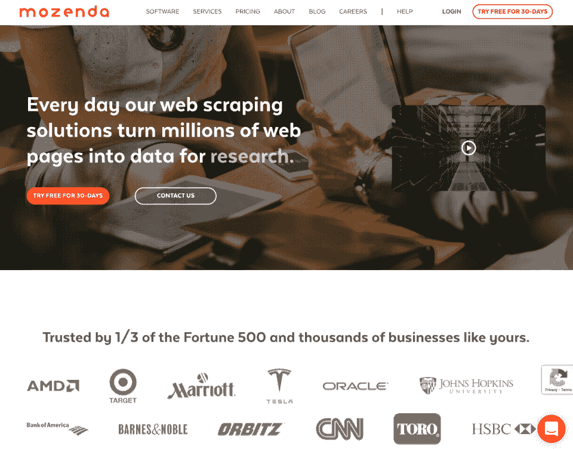**

Mozenda 是一个基于云的企业网络抓取平台，帮助数据科学家收集和组织网络数据，进行高效且经济的预处理。

**主要特性:**

*   用户友好的用户界面:点击式设计易于使用
*   **两部分应用程序:**构建数据提取项目的应用程序，以及运行代理、组织结果和导出数据的 web 控制台

*   **广泛的格式支持:**以 CSV、TSV、XML 或 JSON 格式发布结果

*   API 访问:对程序数据获取有用

*   存储集成:支持 FTP、亚马逊 S3、Dropbox 等等

**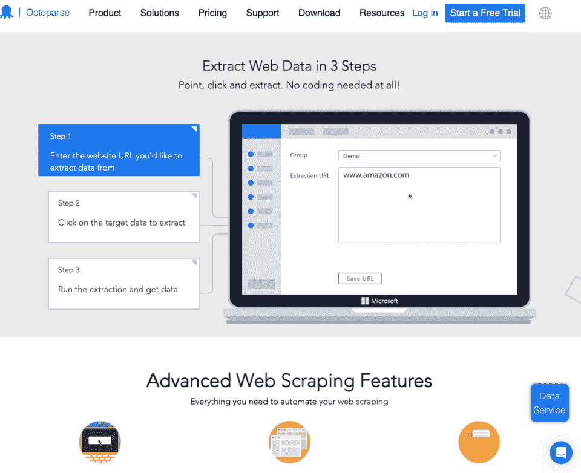**

Octoparse 是专为 Windows 设计的客户端网页抓取软件。它使用网页抓取模板将非结构化或半结构化的网站数据转化为结构化数据集，而无需编写任何代码。

web 抓取模板是一个简单而强大的功能，它接受目标网站或关键字的用户输入，然后将这些输入传递给预先格式化的任务。

这意味着用户不需要配置任何抓取规则或编写代码，这使得 Octoparse 成为没有编程经验的人的有用工具。

**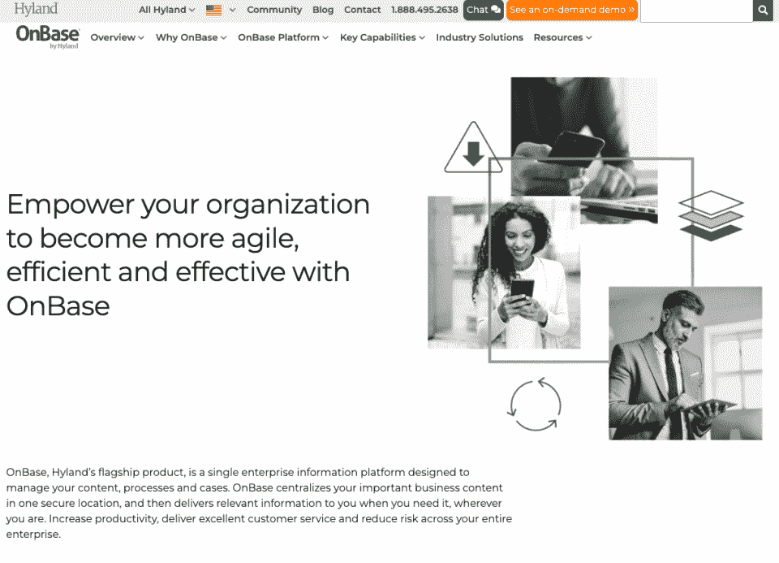**

OnBase 是一个企业信息平台，旨在管理用户内容、流程和案例。该工具将用户业务内容集中在一个安全的位置，并在用户需要时向其提供相关信息。

在寻求提高生产率、提供卓越的客户服务和降低企业风险时，它可以帮助组织变得更加敏捷、高效和有能力。

**主要特性:**

*   **单一平台:**构建基于内容的应用程序，补充核心业务系统
*   **低代码开发:**快速创建支持内容的解决方案，以减少成本和开发时间
*   **多功能部署:**可部署在云中、移动设备上，并可与现有应用程序集成

**想要发现更多数据科学工具？查看** [**10 大数据科学应用**](https://hackr.io/blog/top-data-science-applications)

数据仓库是将数据转换并存储为可用且有用的格式的过程，这使得业务用户或数据科学家能够轻松进行[分析](https://hackr.io/blog/data-analysis-software)。

数据仓库的主要目的是收集和管理来自各种来源的数据，以提供一个干净、最新和集中的数据存储库，可以对其进行分析以提取有意义的业务见解。让我们来看看一些数据仓库工具。

**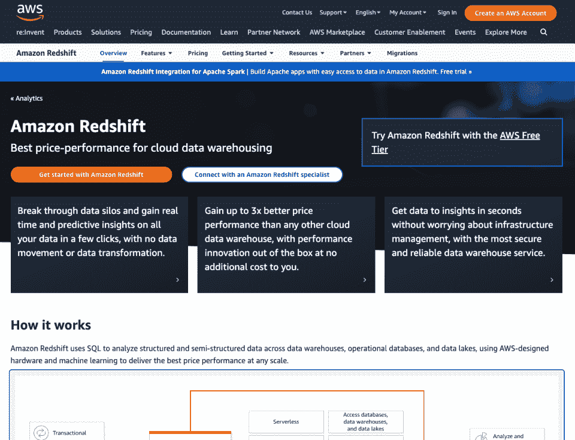**

亚马逊红移是一个 Pb 级的完全托管的云数据仓库服务，允许企业从几百 GB 的数据扩展到更多。

作为数据科学软件最强大的例子之一，它使数据科学家能够从数据中提取业务和客户见解。

Redshift 利用名为 Amazon Redshift clusters 的节点，允许用户在提供数据集后将数据集上传到数据仓库。然后，用户可以对数据进行分析和查询。

**主要特性:**

*   **虚拟私有云(VPC):** 在 AWS VPC 内启动，以拥有一个私有云网络来访问和控制集群
*   **数据加密:**创建表格时可以对存储的数据进行加密
*   **SSL:** 加密到红移的客户端连接
*   **可扩展:**只需点击几下鼠标，即可轻松扩展节点数量
*   **经济高效:**无前期成本或长期承诺，按需定价

**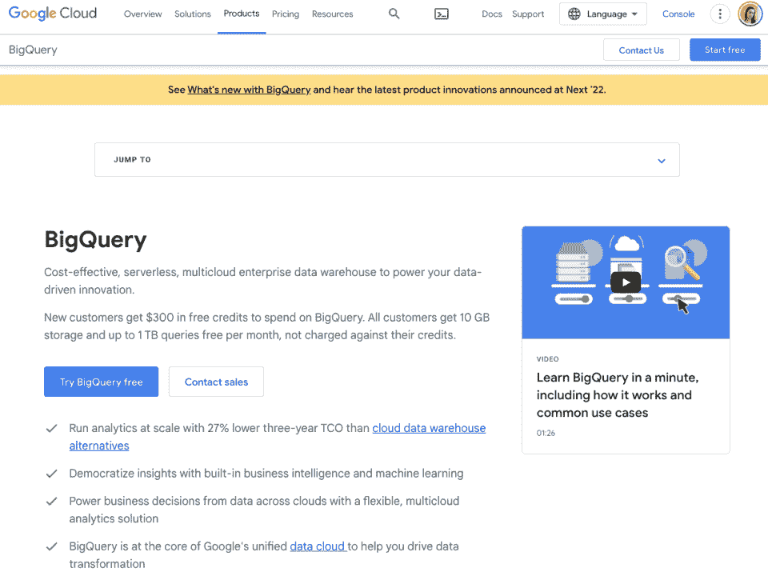**

BigQuery 是一个高度可伸缩的无服务器数据仓库工具，用于数据处理和分析。由于无需管理基础架构，数据科学家可以专注于通过 SQL 找到有意义的见解，而无需数据库管理员。

该工具实现了一个逻辑数据仓库，以列存储方式存储来自对象存储和电子表格的数据。它还通过内存中的 BI 引擎提供快速仪表板和报告，用户可以利用 SQL 对地理空间分析解决方案进行机器学习。

BigQuery 允许数据科学家在组织内外以数据集、查询、[电子表格](https://spreadsheetpoint.com/)和报告的形式安全地共享见解。

**主要特性:**

*   **无服务器:**在几秒钟内启动数据仓库，无需耗时的资源分配任务，减少停机时间，并实现自动扩展
*   **实时分析:**实时流数据的高性能摄取
*   **第三方集成:**使用 Talend 等 ETL 工具丰富用户数据，使用 Tableau、MicroStrategy、Looker 和 Data Studio 等 BI 工具生成报告&仪表盘
*   **数据保护:**自动数据复制，无需额外成本即可实现灾难恢复和高可用性

**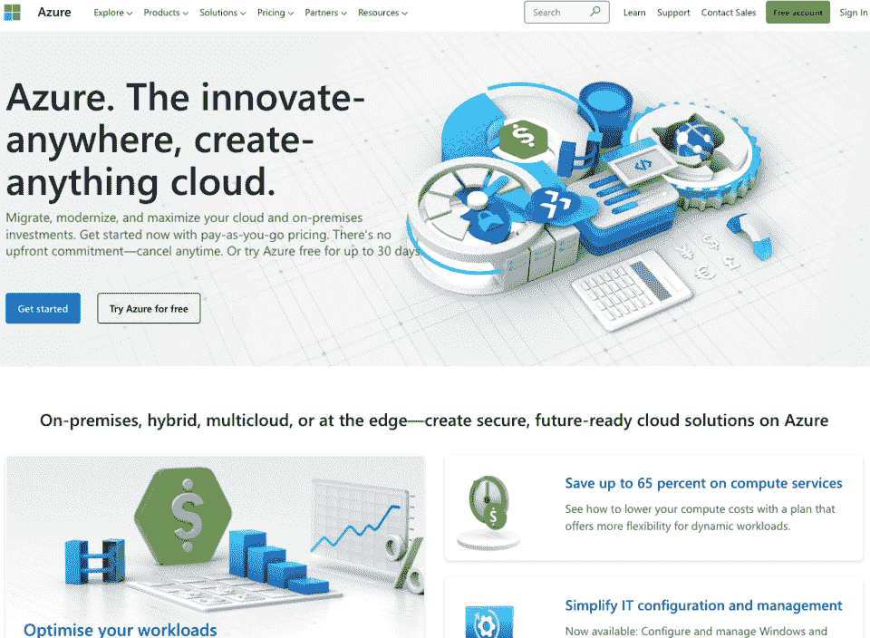**

Microsoft Azure 是一套不断扩展的云服务，用于在大型全球网络上构建、管理和部署应用程序。

这包括可以组合起来形成数据仓库的各种服务，如数据存储、数据处理、数据分析、混合集成、人工智能(AI)和机器学习(ML)、数据库和开发。

**主要特性:**

*   **灾难恢复(DR):** 无论是实施基于云的数据仓库还是云备份，都可以随时访问数据
*   **定价:**现收现付模式&成本管理工具优化仓储成本
*   **声誉:**全球范围内的主要云提供商之一，与谷歌云平台(GCP)、亚马逊网络服务(AWS)和 IBM 竞争

**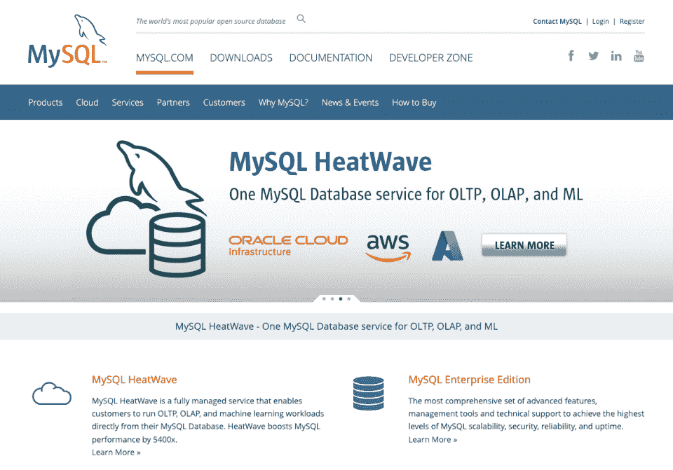**

MySQL 是一个开源的关系数据库管理系统(RDBMS ),使用 SQL(结构化查询语言)进行数据库管理和查询。

MYSQL 数据库可以用来实现数据仓库解决方案，因为它们为数据科学家提供了一种熟悉而方便的方法来与数据进行交互和分析。这使得数据科学家能够直接从数据库中存储、清理和可视化数据。

**主要特性:**

*   **数据收集:**将数据以各种格式导入数据库，包括 XLS、CSV、XML 等等
*   **数据预处理&清理**:使用 LIKE、TRIM、REPLACE 等 SQL 函数轻松删除不完整或不相关的数据(脏数据)
*   **分析和可视化:**实现 SQL 查询来分析数据并生成可视化

****

雪花是一个完全关系的 ANSI SQL 数据仓库，允许用户利用其组织已经使用的各种顶级数据科学工具和技能。

特别是，数据科学家可以实现熟悉的 SQL 任务，如更新、删除、函数、事务、存储过程、视图和连接，以分析雪花仓库中的数据。

**主要特性:**

*   **零管理:**自动处理基础设施、可用性、优化、数据保护等
*   **多样化数据:**无需转换即可广泛支持传统和现代机器生成的业务数据，以 JSON、Avro 或 XML 的形式原生加载/优化结构化&半结构化数据，使其可通过 SQL 使用，而不损失性能/灵活性
*   **性能:**处理查询的时间只占内部和其他云仓库的一小部分，列数据库引擎使用自动集群加载原始数据，并通过双向扩展实现卓越的性能
*   **故障转移和连续性:**跨云区域复制数据，以便在发生故障转移时提供业务连续性和备份
*   **无缝共享数据:**多租户架构通过数据共享库实现安全、可控的数据共享，无需移动数据，即可在几分钟内与组织、业务合作伙伴和客户共享数据

想要提升您的 SQL 技能，成为数据仓库专家吗？查看我们的 [**SQL 备忘单**](https://hackr.io/blog/sql-cheat-sheet)

数据分析是对数据进行清理、建模和转换以发现对业务决策有用的信息或模式的过程。

数据科学家的分析任务包括数据提取、清理、分析等。数据分析有几种方法和技术。

*   **文本分析:**发现大型数据集中的模式&将原始数据转化为有用的商业信息
*   **统计分析:**利用现有数据进行**描述性分析**(平均值、标准差等。)和**推断分析**(假设检验，样本性质等。)
*   **诊断分析:**从统计分析中找到洞察背后的“为什么”
*   **预测分析:**根据以前的数据预测未来的可能性
*   **规定性分析:**结合每个早期阶段的见解，决定一系列行动

下面列出了一些数据科学，尤其是数据分析的最佳工具。

**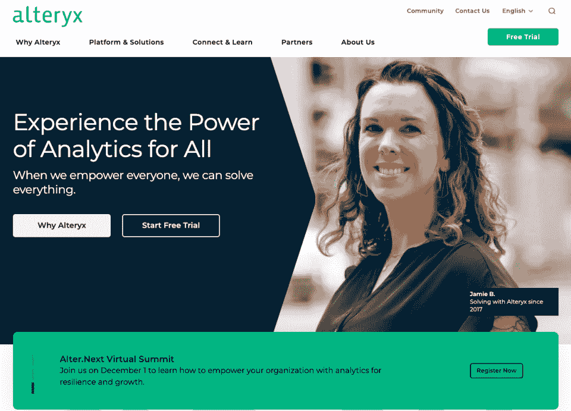**

Alteryx 是一个面向数据科学家的数据分析和自动化平台。

**主要特性:**

*   **加速分析:**由于采用端到端的分析流程，无需耗时地搜索要分析的数据
*   **合并来自多个来源的数据:**可以从 Hadoop 和 Excel 导入结构化和非结构化数据，创建正确的数据集用于分析或可视化
*   **预测、统计和空间分析:** 60 多个用于空间和预测分析、回归或聚类的内置工具。这些可以定制，或者你可以使用 [Python 或者 R](https://hackr.io/blog/r-vs-python) 创建新的工具
*   **数据共享:**将报告导出为 Qlik、Tableau 和 Microsoft Power BI 等可视化格式，以便与决策者共享

**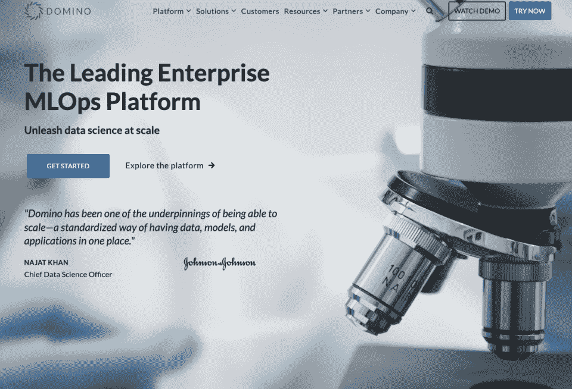**

Domino 为数据科学家自动化开发操作，腾出时间进行研究，更快地测试更多想法。自动工作跟踪还支持可再现性、可重用性和协作。

**主要特性:**

*   **Domino workbench:** 加载您首选的数据科学工具和基础设施；跟踪、复制和比较实验结果；查找、讨论和重用工作

*   **Kubernetes 部署:**部署低延迟&高可用性 API，监控数据&性能漂移，一键发布 Shiny 或 Flask 等交互式应用，并为模型训练或 ETL 安排作业

*   **管理数据:**监控&控制计算利用率，监督数据科学项目，并检查数据科学产品以了解其内部工作原理

**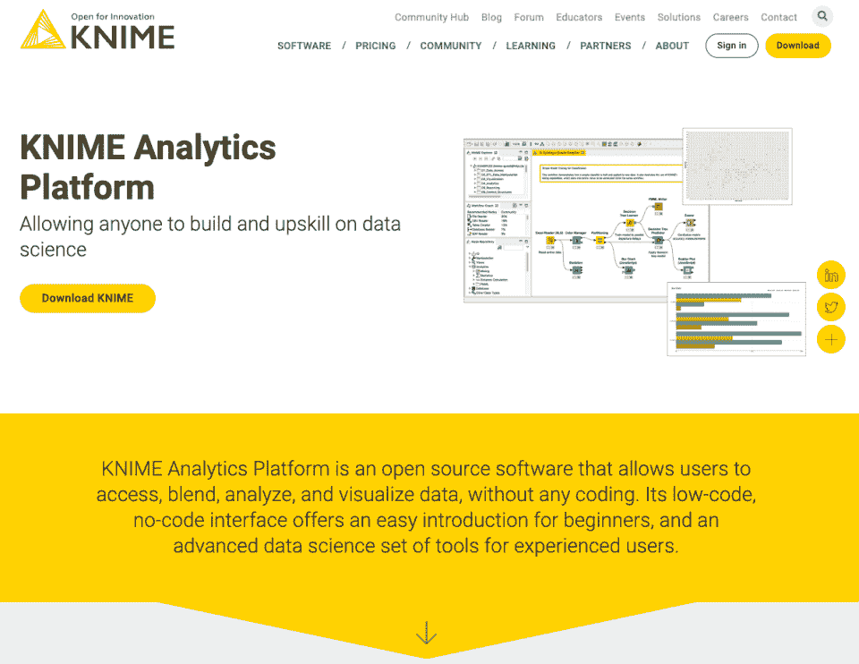**

KNIME 是一个用于数据分析和报告的免费开源平台，使所有用户无需编码即可访问数据、数据科学工作流和可重用组件。

**主要特性:**

*   **构建工作流:**使用零代码的拖放式 UI 创建可视化工作流，或者使用 Python/R、Apache Spark、&其他数据科学工具
*   **广数据支持:**导入 CSV，PDF，XLS，JSON，& XML 文本格式，非结构化数据类型，时序数据，数据库&数据仓库数据，以及 Twitter，AWS S3，& Google 工作表数据

*   **修改、查询&形状数据:**实现统计分析、相关性分析、数据类型转换、聚合函数等

*   **机器学习:**为分类、线性和逻辑回归、降维、聚类、深度学习等建立模型

*   **数据可视化:**创建和定制经典(条形图、散点图)和高级图表(平行坐标、旭日图、网络图、热图)

*   **性能优化:**通过多线程处理扩展工作流，通过 Apache Spark 进行分布式计算增强性能

**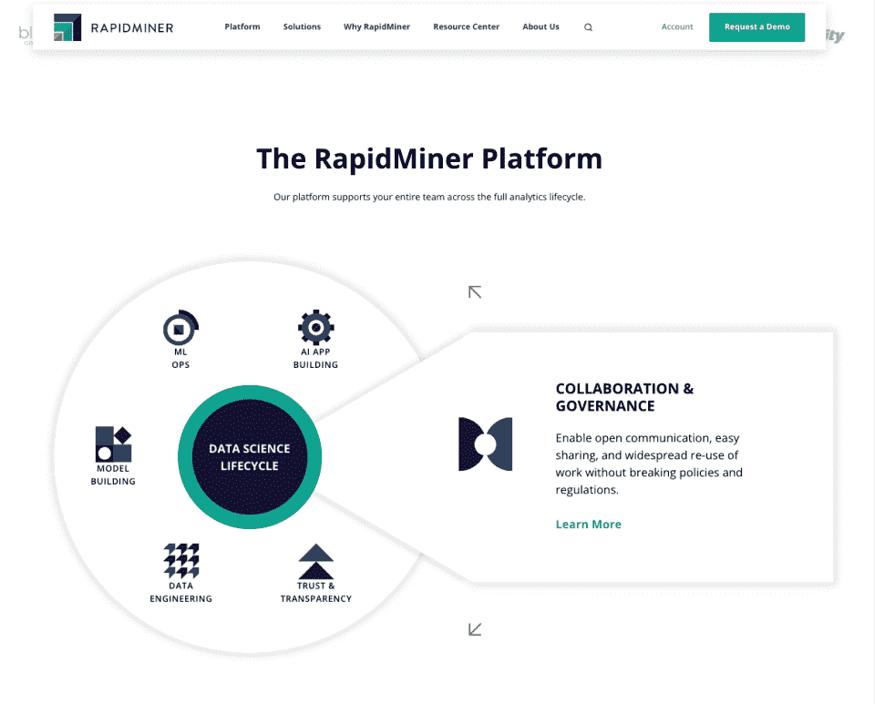**

Rapid Miner 是为需要快速数据分析的非程序员和数据科学家开发的数据科学平台。

这套数据科学工具还支持将 ML 模型导入 flask 或 NodeJS 等 web 应用程序，以及 Android 和 iOS 应用程序。

**主要特性:**

*   **简化数据任务:浓缩分散的数据挖掘和分析任务**

*   各种框架支持:从 Hadoop、云服务、RDBMS、NoSQL、pdf 等加载数据

*   数据预处理:使用行业标准方法准备数据、创建新的子表、连接表或插入缺失的数据

*   机器学习和人工智能:训练人工智能和深度学习模型，如随机森林和梯度增强，并实施聚类以修剪离群值

*   部署选项:在云中或本地生产环境中运行模型

**有兴趣了解有关数据分析的更多信息吗？查看** [**7 大数据分析工具**](https://hackr.io/blog/top-data-analytics-tools)

数据可视化包括以可视或图形格式表示数据。这可以帮助决策者直观地检查分析或更好地理解模式和复杂的概念。

数据可视化需要不同学科的技能，包括科学可视化、图形设计和统计图形。

数据科学家可以采用多种方法来创建数据可视化，最流行的是“信息呈现”。这包括统计图形和专题地图或图像的混合。

数据可视化工具可以以复杂的方式显示信息，包括信息图、刻度盘和仪表、地理图、迷你图、热图、条形图、饼图、发热图等等。数据可视化有几个用例。

*   **交流见解:**展示数据驱动的见解，其方式对组织中的所有员工都很清楚，无论他们的背景如何

*   **检查大数据:随着企业不断积累大量数据，他们需要快速、轻松地用可视化工具汇总数据**

*   **评估模型:**数据科学家可以在开发过程中检查模型结果的可视化，这比复杂算法的数字数据更容易解释

**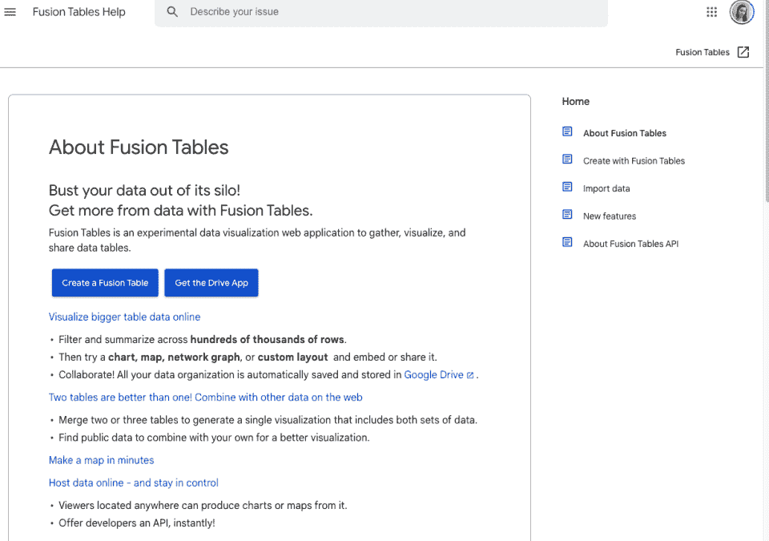**

Fusion Tables 是用于数据管理的 Google web 服务。您可以收集、可视化和共享其他用户可以查看和下载的数据表。

用户有各种可视化选项，包括条形图、折线图、饼图、时间线、散点图和地理地图。您制作的图表可以导出为 CSV 文件。

**主要特性:**

*   **更大的在线表格:**在创建可视化时，可以在线访问更广泛的数据表，这些数据表可以在线发布
*   **合并表格:**在创建可视化之前，合并多达三个表格来扩展您的数据集
*   **即时地图:**在几分钟内从位置表生成地图，并且这些地图可以共享
*   **在线托管:**数据表和可视化可以在线存储，并通过 API 提供给合作者

**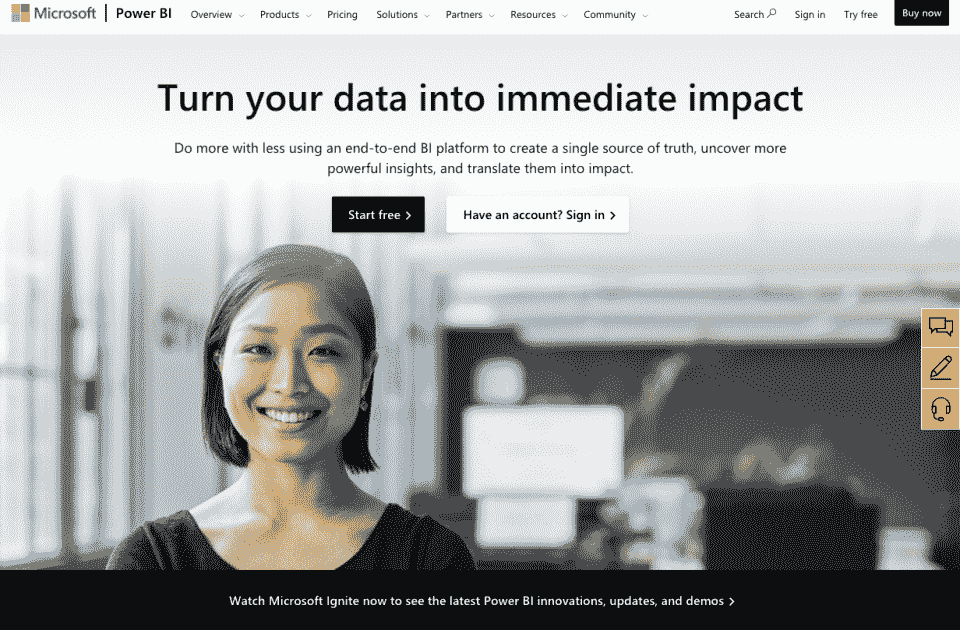**

Microsoft Power BI 是一种分析服务，可以在云中发现数据见解并生成可视化效果。用户可以将数据转换成令人印象深刻的视觉效果，并与任何设备共享。

**主要特性:**

*   **智能云:**跨全球数据中心(包括公共云)创建和共享交互式数据可视化
*   **人工智能辅助:**非数据科学家可以利用人工智能来准备结构化的&非结构化数据，这些数据可用于生成可视化
*   **Excel 集成:**轻松将 Office365 Excel 查询、数据模型和报告连接到 Power BI 仪表板
*   **实时流:**从工厂传感器到社交媒体源的实时分析数据可用于生成可视化效果

### **3\.** **Qlik Sense**

**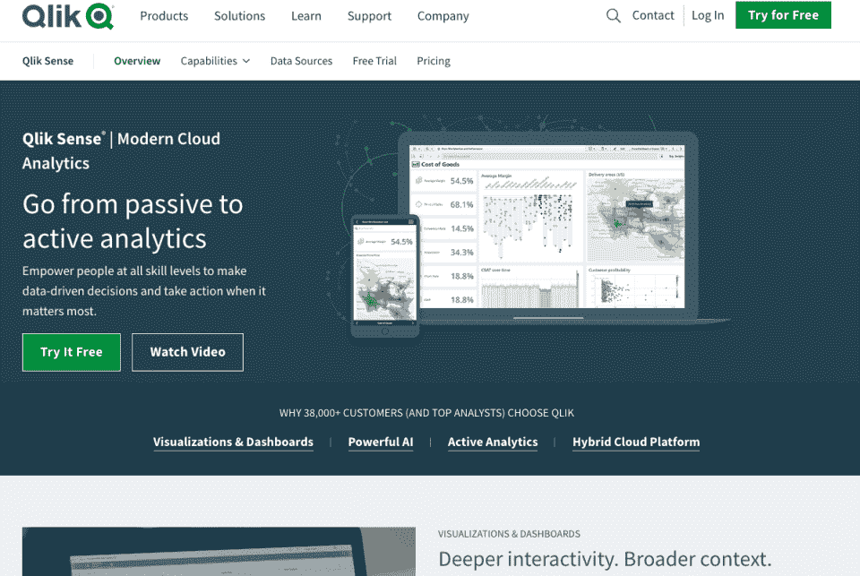**

Qlik Sense 是一个可视化分析平台，可用于分析仪表板、嵌入式分析和可视化，所有这些都在一个可扩展的治理框架中。

用户有一个拖放界面来创建交互式数据可视化，以讲故事的形式呈现研究结果。

**主要特性:**

*   **关联模型:**组合并探索您的所有数据，以创建回答业务问题的可视化
*   **交互式图表:**数据变化时图表即时更新
*   **可视化库:**显示数据形状和突出异常值的智能可视化范围
*   **Insight Advisor:** 自动生成数据分析，并提供图表建议，以创建快速、深入的可视化效果

**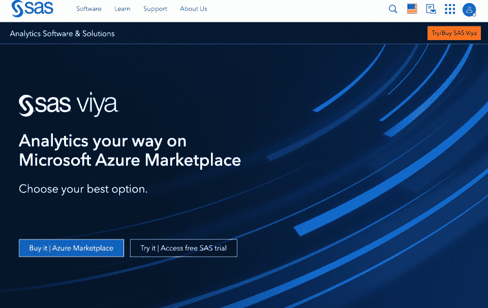**

SAS 是用于数据科学的统计软件，开发用于高级分析、商业智能、数据管理、预测分析和数据可视化。

**主要特性:**

*   **交互式仪表盘:**直接从报告、探索、分析，到在单一界面中共享交互式可视化
*   **智能可视化:**自动制图和高级可视化技术
*   **位置分析:**添加位置数据，为可视化提供地理环境

## **结论**

随着产生的数据比以往任何时候都多，各种规模的企业都希望利用[数据科学](https://hackr.io/blog/what-is-data-science)来优化业务实践、增加利润和提高效率。

作为一名数据科学家，您应该精通各种顶级数据科学工具和编程语言。数据科学工具对于分析数据、使用机器学习算法创建强大的预测模型以及创建美观的交互式可视化效果至关重要。

许多数据科学工具允许您在单个界面中执行复杂的操作，从而轻松实现各种数据科学项目。当然，有些工具可能需要您了解 SQL、Python、R 或其他编程语言。尽管如此，许多还允许您执行这些基本的数据科学活动，而不需要编写任何代码。

使用最好的数据科学工具来完成手头的任务，可以发现重要的业务见解并将其传达给组织，从而做出更好的业务决策。

**想成为数据科学家？查看此** [**数据科学课程**](https://www.udemy.com/course/datascience/) **，它涵盖了数据科学技能的 A-Z。**

## **常见问题解答**

Python 是一种多功能语言，可用于各种任务，包括数据科学。虽然不是专门为数据科学设计的，但它可以用于一系列与数据相关的任务。它还有许多数据科学的库，包括 NumPy、pandas 和 Matplotlib。

这很难说，因为数据科学工具包的深度很大，而且工具的类别也各不相同。但是，一些最流行的数据获取工具包括 Talend 和 IBM Datacap，而 Amazon Redshift 和 BigQuery 在数据仓库方面很受欢迎。当然，Python 作为一种数据科学工具/技能非常受欢迎。

#### **3。数据科学主要用在哪里？**

数据科学用于了解当前趋势和模式，并帮助做出未来决策。它可以帮助你了解人们如何与你的产品互动，他们对它的看法，以及他们将来可能如何使用它。它通过分析数据和开发预测模型来帮助做出更好的决策。