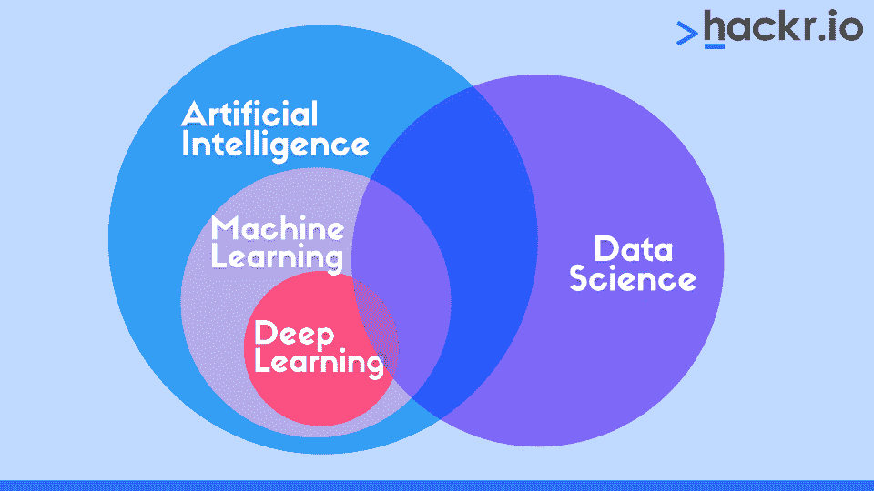
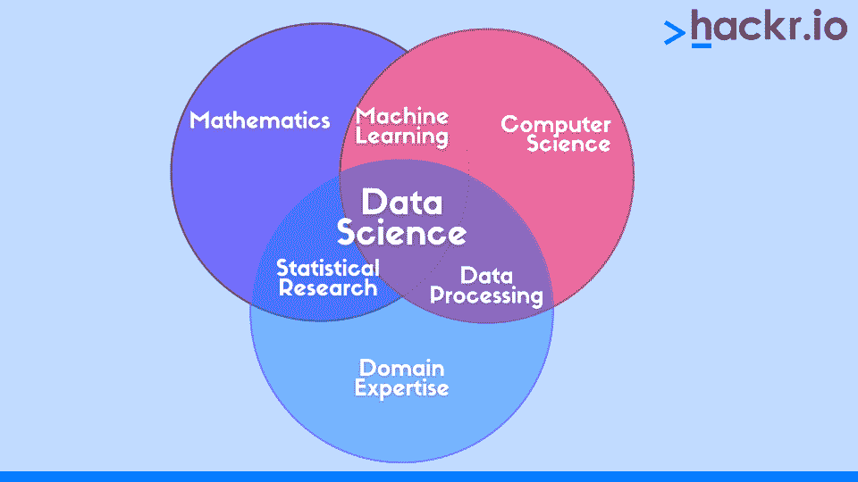
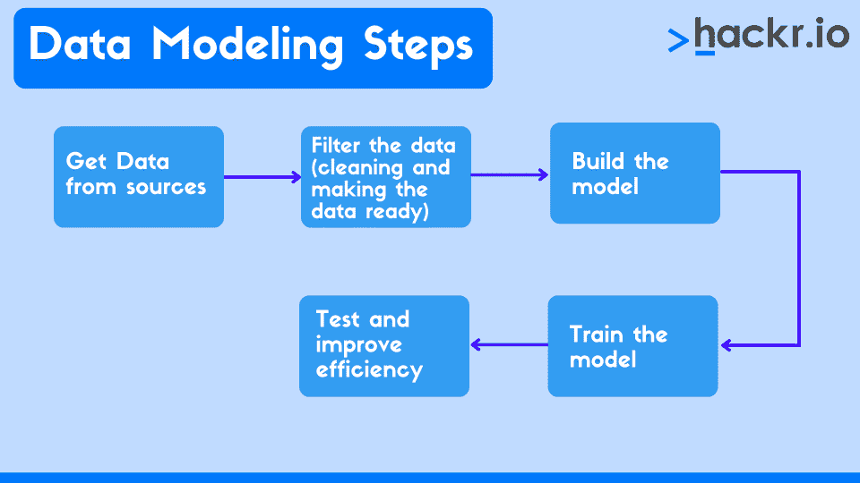

# 数据科学 vs 机器学习:有什么区别？

> 原文：<https://hackr.io/blog/data-science-vs-machine-learning>

数据科学和机器学习这两个词经常在那些对这两个领域知之甚少的人之间互换使用。然而，如果你计划在其中一个领域建立职业生涯，了解机器学习和数据科学之间的差异是很重要的。为此，我们需要理解几个相关但根本不同的重要术语。

我们先深入研究人工智能和机器学习到底是什么，然后再更详细地研究两者。如果你想简单了解一下数据科学和机器学习的区别，这里有一个简单的总结。

## **数据科学 vs 机器学习:面对面的比较**

这里有一个并排的比较，方便参考。

| **数据科学** | **机器学习** |
| 这是一个跨学科的领域，对非结构化数据进行清理、过滤、分析，并从中产生业务创新。 | 它是数据科学的一部分，其中工具和技术用于创建算法，以便机器可以通过经验从数据中学习。 |
| 它的范围很广 | 它只出现在数据科学的数据建模阶段。 |
| 数据科学也可以使用手动方法，尽管它们不如机器算法有效 | 没有数据科学，机器学习就无法存在，因为必须首先准备数据来创建、训练和测试模型。 |
| 数据科学有助于定义可以使用机器学习技术和统计分析解决的新问题。 | 问题是已知的，工具和技术被用来寻找一个智能的解决方案。 |
| SQL 知识是对数据执行操作所必需的。 | SQL 知识不是必须的。程序是用 R，Python，Java，Lisp 等语言编写的… |
| 数据科学是一个完整的过程。 | 机器学习是数据科学中的一个步骤，它使用数据科学的其他步骤来创建最适合预测分析的算法。 |
| 数据科学不是人工智能的子集。 | 机器学习是人工智能的一个子集，也是人工智能和数据科学之间的联系，因为它随着越来越多的数据被处理而演变。 |

## **什么是人工智能和数据科学？**

人工智能或机器智能是指机器做出的与人类同等的智能决策——至少在某些任务中。在这项研究中，我们使机器能够通过经验进行学习，并使它们足够智能来执行类似人类的任务。我们之前已经讨论过 AI 和 ML 之间的[差异，但是为了本文的目的，让我们来看看机器学习的一个简单定义。](https://hackr.io/blog/ai-vs-machine-learning)

把 ML 想象成 AI 的子集。同理，人类用经验学习，机器可以用数据(经验)学习，而不仅仅是按照简单的指令。这叫做机器学习。机器学习使用 3 种[类型的算法](https://hackr.io/blog/classification-algorithm) : [监督的、非监督的](https://hackr.io/blog/supervised-vs-unsupervised-learning)和强化的。

然后是深度学习，这是基于人工神经网络的机器学习的子集(想想类似于我们人类大脑的神经网络)。与机器学习不同，深度学习使用多层和结构算法，这样就创建了一个人工神经网络，它可以自己学习和做出决定！

大数据是你可能遇到的另一个术语。这些是指海量的数据集，可以通过计算分析来理解和处理趋势、模式和人类行为。大数据在数据科学中发挥着作用。

机器通过机器学习算法自行学习——但如何学习呢？谁给机器必要的输入来创建算法和模型？这就是数据科学的用武之地。数据科学使用不同的方法、算法、流程和系统从数据中提取、分析和获得洞察力。如果你想详细了解这一点，我们在这里有数据科学教程。

如果我们要在一个简单的图表中看到上述所有内容之间的关系，它应该是这样的:

人工智能包括相互关联的机器学习和数据科学。因此，数据科学也是人工智能的一部分(最受欢迎和最重要的一部分)。

正如我们上面看到的，数据科学和机器学习密切相关，并提供有用的见解，产生必要的趋势或“经验”。在这两种情况下，我们都使用监督学习方法，即从庞大的数据集学习。

**建议课程**

[数据科学课程 2023:完整数据科学训练营](https://click.linksynergy.com/deeplink?id=jU79Zysihs4&mid=39197&murl=https%3A%2F%2Fwww.udemy.com%2Fcourse%2Fthe-data-science-course-complete-data-science-bootcamp%2F)

数据科学是一个更广泛的研究领域，它使用机器学习的算法和模型来分析和处理数据。除了学习，数据科学还涉及数据集成、可视化、数据工程、部署和业务决策。你可能也想知道数据分析——但我们会让你参考我们关于[数据科学与数据分析](https://hackr.io/blog/data-science-vs-data-analytics)的指南，以及关于数据科学与数据分析师角色的[比较。](https://hackr.io/blog/data-analyst-vs-data-scientist)

## **数据科学和机器学习的区别**

一方面，[数据科学](https://www.coursera.org/specializations/jhu-data-science?irclickid=V2QyBRWFRxyITKdzfWQZZ00%3AUkDXLDX4ZQ6n2I0&irgwc=1&utm_medium=partners&utm_source=impact&utm_campaign=2890636&utm_content=b2c)专注于数据可视化和更好的呈现，而机器学习更专注于学习算法和从实时数据和经验中学习。永远记住——**数据**是数据科学的主要焦点，而**学习**是机器学习的主要焦点，这就是区别所在。

为了更好地理解这种差异，让我们看一个用例，看看如何使用数据科学和机器学习来实现我们想要的结果。

假设你想在 xyz.com 购买一部手机。这是你第一次访问 xyz.com，你正在浏览各种手机。你使用各种过滤器来缩小你的偏好，从你得到的结果中，你选择 4-5 部手机并进行比较。一旦您选择了手机型号，您将在产品下方看到一条推荐信息——价格更低或功能更多的类似产品，以及您所选手机的相关配件等。当网站几乎没有关于你的历史时，它是如何推荐这些的？

这是通过数百万其他人的数据得出的，他们可能试图购买同一款手机，并搜索/购买其他配件。这使得系统自动向您推荐相同的内容。

从用户那里收集数据，清理和过滤出评估所需的数据，评估过滤后的数据以构建模式，找到相似的趋势并为向其他用户推荐相同的东西构建模型，最后进行优化的整个过程就是数据科学。

机器学习在这一切中处于什么位置？我们通过机器学习算法建立模型。基于收集的数据和生成的趋势，机器理解这些是其他用户通常用特定手机购买的配件。因此，它基于它以前“经历过”的东西暗示了同样的事情。

建模步骤是最关键的步骤，因为这是改善整体业务并使机器理解人类行为的步骤。如果应用了正确的机器学习模型，这可能意味着机器的更多渐进学习以及商业模式的成功。

这一步称为数据建模步骤，本质上是数据科学生命周期的机器学习阶段。

这可能看起来很多，但[数据科学专业课程](https://www.edx.org/professional-certificate/harvardx-data-science)将清楚地解释一切。这些专门化在解释基本原理和更复杂的概念方面大有帮助。

### 数据建模是如何工作的？

有不同类型的机器学习算法，最常见的是聚类、矩阵分解、基于内容、推荐、协同过滤等等。机器学习包括 5 个基本步骤。

我们在第一步中收到的大量数据被分成训练集和测试集，并使用训练集构建和测试模型。大部分数据用于训练目的，从而可以实现不同的输入和输出条件，并且所建立的模型最接近所需的结果(建议、人类行为、趋势等)。).一旦构建完成，就要使用测试数据对模型的效率和准确性进行测试，以便进行交叉验证。

正如我们所见，机器学习仅在数据科学生命周期的数据建模阶段出现。因此它包含了机器学习。

通过机器学习，机器可以生成复杂的数学算法，而不需要人类编程，并且还可以自己即兴创作和改进程序。与传统的统计分析技术相比，机器学习是提取和处理最复杂的大数据集的更好方式，从而使数据科学更容易，更少混乱。

此外，机器往往比人类更准确，记忆力更好，它们可以根据经验学习并产生准确的结果。我们得到了快速的算法和数据驱动的模型，而没有人类可能出现的错误。

### **机器学习和数据科学的就业机会**

正如我们所提到的，你将学到的很多东西都适用于机器学习和数据科学。但是，这两个领域都有更具体的角色。

有了机器学习，你可以成为一名机器学习工程师，一名自然语言处理科学家，一名专注于 ML 的软件开发人员，当然，还有一名数据科学家。

通过数据科学，你可以成为数据科学家、商业智能开发人员、数据分析师、数据工程师、数据架构师和机器学习工程师。

请记住，这些角色中的许多都可以在这两个研究领域中找到，尽管一些特定的角色可能需要一些专业化。无论哪种方式，你都需要对数学、统计学和一些基本的软件工程有扎实的理解。机器学习工程师需要更多的编程经验。

有几门专业课程可以帮助你入门，包括[麻省理工学院的机器学习和 AI 课程](https://professional.mit.edu/programs/certificate-programs/professional-certificate-program-machine-learning-artificial)，以及由吴恩达教授的著名的[斯坦福课程。](https://www.coursera.org/learn/machine-learning?irclickid=V2QyBRWFRxyITKdzfWQZZ00%3AUkDXLDVgZQ6n2I0&irgwc=1&utm_medium=partners&utm_source=impact&utm_campaign=2890636&utm_content=b2c)

## **在数据科学和机器学习之间，你如何选择？**

这就是我们的数据科学与机器学习对比。事实是你不能只选择一个。数据科学和机器学习是相辅相成的。在未来，数据科学家至少需要对机器学习有基本的了解，才能对每天产生的大数据进行建模和解释。

如果你刚刚开始你的职业生涯或来自不同的背景，如 Java 或。网，没什么好担心的。

数据科学浩如烟海但不难。由于它有许多阶段，数据科学家的工作分为不同的子领域。

查看教程，开始学习基础知识。一旦你理解了核心概念，通过我们提到的资源更深入地研究[机器学习](https://hackr.io/tutorials/learn-machine-learning-ml?ref=blog-post)和[深度学习](https://hackr.io/tutorial/deep-learning?ref=blog-post)。

不管你是否有编程经验，通过了解处理数据的[必要工具和技术](https://hackr.io/blog/how-to-become-a-data-scientist)以及获取领域知识，你都可以成为一名优秀的数据科学家。一个很好的起点是通过[学习 R for data science](https://hackr.io/blog/r-for-data-science) 。

## **常见问题解答**

#### **1。数据科学和机器学习哪个好？**

没有哪一个比另一个更好——这完全取决于你在寻找什么样的角色。如果你喜欢与大数据打交道，并在商界找到职业生涯，那么也许数据科学更好。如果你想成为一名开发算法的机器学习工程师，那么机器学习可能更好。

#### **2。数据科学和机器学习一样吗？**

我们在上面已经概述了不同之处，但是就你将要学习的内容而言，有许多相似之处。根据你选择的路线，你的职业道路可能会不同。此外，数据科学通常涉及发现数据中的模式，并将它们转化为可操作的见解。机器学习实际上包括建立模型和算法。

#### **3。数据科学和机器学习哪个工资高？**

机器学习工程师的工资比数据科学家高。他们的职责通常需要更多的知识和对更广泛的学科的理解。

#### **4。数据科学比机器学习容易吗？**

一致的看法是，数据科学实际上比机器学习更容易。数据科学涉及更多的统计学，而机器学习除了统计学还涉及更多的计算机科学。

**人们也在阅读**