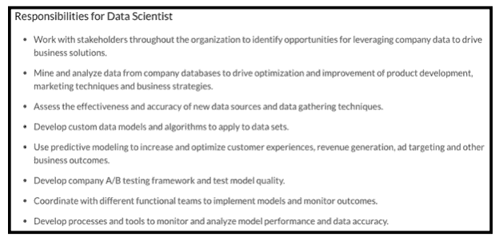
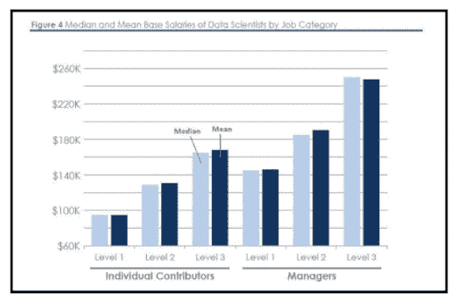
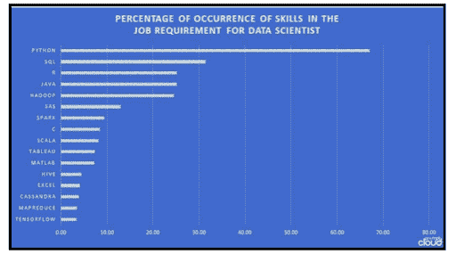
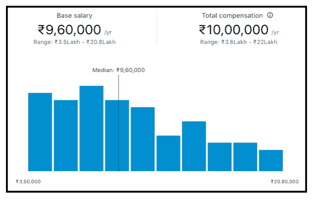
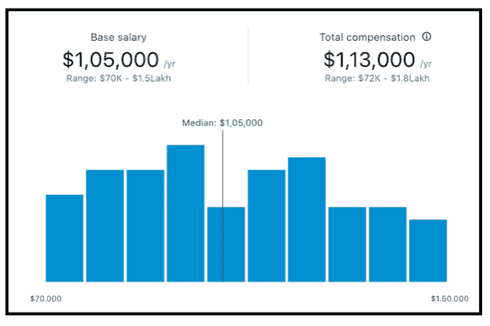
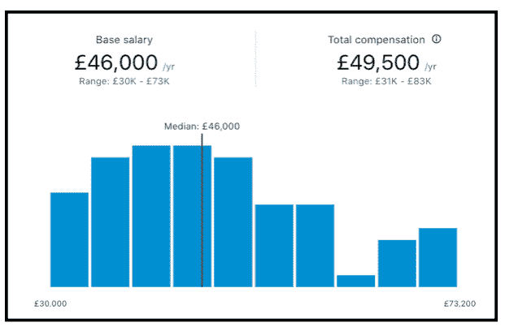
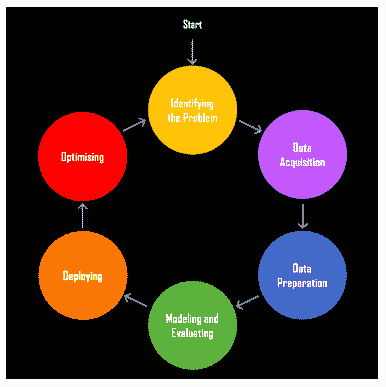

# 数据科学家的薪水——数据科学家的薪水是多少？

> 原文：<https://hackr.io/blog/data-scientist-salary>

## **谁是数据科学家？**

“数据科学家”一词是在数据科学家从科学应用和领域(无论是数学还是统计)中获取信息时产生的。数据科学家负责分析和解释复杂的数字数据。例如网站的统计数据。

[数据科学家](https://hackr.io/blog/how-to-become-a-data-scientist)负责处理大量结构化/非结构化数据，并运用他们在数学、统计、编程、机器学习等方面的技能。

当涉及到与业务相关的决策时，他在与数据相关的活动中占据上风；数据科学家的熟练程度更高。

成为数据科学家所需的技能:

1.  统计和分析技能
2.  数据挖掘活动
3.  [机器学习和深度学习原理。](https://hackr.io/blog/machine-learning-vs-deep-learning)
4.  深入的编程知识(SAS|R|Python 编码)

除了技术能力，数据科学家还需要成为有效的沟通者、领导者和团队成员，以及高水平的分析思考者。

数据科学家应该创造性地以各种图形形式可视化数据，并以简单友好的方式呈现高度复杂的数据！如果一个数据科学家能够将数 Pb 的结构化和非结构化数据(图像、视频、日志文件)转换成简单明了的格式，那么他就是一个“艺术家”！

## 数据科学家工资

### **职位描述**

数据科学家挖掘复杂的数据，并为他们的组织提供有价值的见解。他们与其他 IT 专业人员和组织的其他部门合作，分析和管理统计数据，根据公司的需求创建不同的模型。该流程研究更多自然消费的信息，并将其转化为可操作的计划。IT 数据科学家在工作中遵循具体、严格的公司和行业准则。他们遵守数据隐私权，以确保客户满意并避免法律问题。他们创建专业人士咨询网络，包括内部合作伙伴和外部同事。他们拥有最好的工具来定期处理尖端技术。IT 数据科学家通常必须拥有类似职位的工作经验。他们应该掌握不同数据挖掘技术的高级知识，如聚类、回归分析、决策树和支持向量机。除了之前在相关领域的工作经验之外，这个职位推荐计算机科学的更高或更专业的学位(如博士学位)

Glassdoor 提到了数据科学家的以下职责:

### **决定数据科学家工资的因素**

据《福布斯》报道，基本工资的中位数从 1 级的 95，000 美元到 3 级的 165，000 美元不等。下图对此进行了描述:

*来源:福布斯*

决定数据科学家工资的因素有很多，下面我们来看看其中的一些:

### **1。教育**

一个有经验的合格数据科学家报酬丰厚。要求有计算机科学、数据科学、数学、统计学的本科学位。学位在为你的简历添加结构、实习、人际关系网和公认的学历方面起着至关重要的作用。认证课程和训练营认证也提高了数据科学家的工资。

拥有任何数据科学领域的硕士学位或博士学位更佳。有抱负的候选人可以在毕业后获得更高的学位，或者根据项目的要求获得一些经验并进一步学习。

### **2。技能**

数据科学家应该精通技术和非技术技能。候选人应该聪明、敬业，必须具备出色的分析和逻辑能力，还应该擅长讲故事，并具备团队合作的素质和对组织不同部门的了解，以便与他们合作。候选人还应具备优秀的沟通技巧，因为这在与客户沟通和了解其业务需求时非常有用。

就技术技能而言，候选人必须在以下一项或所有技能上表现出色:

*   编程；编排
*   机器学习技术
*   [数据可视化](https://hackr.io/blog/what-is-data-visualization)和报告
*   风险分析
*   统计分析和数学
*   有效沟通
*   软件工程技能
*   数据挖掘、清理和管理
*   研究
*   大数据平台
*   云工具
*   数据仓库和结构

 *来源:提示云*

### **3。经验和角色**

根据经验，层级中不同级别的数据科学家的工资如下所示。

#### **3.1。入门级**

| 补偿 | 印度 | 美国 |
| 薪水 | 297 414 卢比至 1 195 066 卢比 | $61,598 - $122,827 |
| 奖金 | 2，004 - 161，146 卢比 | $1,010 - $15,019 |
| 利润分享 | 0.00 至 322，976 卢比 | $503 - $ 16,638 |
| 总薪酬 | 306 054 卢比至 1 215 966 卢比 | $60,894 - $127,894 |

#### **3.2。中级**

| 补偿 | 印度 | 美国 |
| 薪水 | 590 734 卢比至 2 070 477 卢比 | $74,623 - $ 140,210 |
| 奖金 | 1，030 卢比至 792，758 卢比 | $1,973 - $19,998 |
| 利润分享 | 95，000 卢比 | $ 2,007 - $ 20,608 |
| 总薪酬 | 595，982 - 2，506，994 卢比 | $77,215 - $ 158,409 |

#### **3.3。高级**

| 补偿 | 印度 | 美国 |
| 薪水 | 972 106 卢比至 2 927 745 卢比 | $78,424 - $ 157,653 |
| 奖金 | 35，000-400，000 卢比 | $2,449 - $22,400 |
| 利润分享 | 25000 卢比 | $11,000 |
| 总薪酬 | 972 106 卢比至 2 928 194 卢比 | $79,321 - $167,947 |

**建议课程**

[数据科学课程 2023:完整数据科学训练营](https://click.linksynergy.com/deeplink?id=jU79Zysihs4&mid=39197&murl=https%3A%2F%2Fwww.udemy.com%2Fcourse%2Fthe-data-science-course-complete-data-science-bootcamp%2F)

### **4。位置**

地理位置起着决定性的作用，并极大地影响着候选人的薪水。

不同国家的不同薪资如下图所示:

#### **印度数据科学家的工资**

 *来源:领英*

#### **数据科学家在美国的薪水【美国】**

 *来源:领英*

#### **英国**

 *来源:领英*

## **数据科学项目生命周期**

数据科学项目的生命周期包括以下步骤:

### **1。数据采集**

该步骤包括识别各种数据源，这些数据源可以是来自 web 服务器的日志、来自在线存储库的数据(如美国人口普查数据集)、社交媒体数据、通过 API 从在线源流出的数据、网络抓取，或者数据可以来自任何其他来源或可能存在于 excel 中。数据获取包括从所有确定的内部和外部来源获取数据，以帮助回答业务问题。

### **2。数据准备**

获取数据后，通过在电子表格中手动编辑或编写代码，对数据进行清理和重新格式化。在项目生命周期的这一步，没有产生有意义的见解。然而，通过迭代数据清理，数据科学家可以快速识别数据收集过程中存在哪些弱点，他们应该做出哪些假设，以及他们可以应用哪些模型来产生分析结果。重新格式化后的数据可以转换为 JSON、CSV 或任何其他易于加载到数据科学工具中的格式。

### **3。假设和建模**

这是数据科学项目的核心步骤，该项目从数据中获得有意义的业务见解，并需要编写、运行和提炼程序来分析。这些程序通常是用 R、Python、Perl 或 MATLAB 等语言编写的。

### **4。评估和解释**

不同的绩效指标需要不同的评估指标。对垃圾邮件进行分类，然后考虑 AUC、平均准确率和日志丢失等性能指标。应该使用哪个数据集来衡量机器学习模型的性能是专业人员在评估性能时遇到的一个标准问题。由于模型已经适应了训练数据集，因此考虑训练数据集的性能指标并不总是正确的，因为获得的数字可能过于乐观。

随着数据的不断获取，从 1 到 4 的所有上述步骤都在重复进行，业务理解变得更加清晰。

### **5。部署**

可能会出现这样的情况，当生产环境支持 Java，但数据科学家更喜欢 [Python 编程语言](https://hackr.io/blog/python-programming-language)，因此需要在部署之前记录机器学习模型。机器学习模型首先是生产前环境，然后部署到生产环境中。

### **6。操作**

这一步包括制定一个长期监控和维护数据科学项目的计划。监控模型性能，也监控性能降级。数据科学家可以将他们从特定数据科学项目中获得的知识存档，以供共享学习，并很快加快类似的数据科学项目。

### **7。优化**

这是任何数据科学项目的最后阶段，涉及每当新的数据源出现时，在生产中重新训练机器学习模型。对于任何数据专业人员来说，[数据科学项目](https://hackr.io/blog/data-science-projects)的定义良好的工作流程变得很容易。数据科学项目的生命周期是不确定的，可以根据业务需求相应地改变，以提高特定数据科学项目的效率。

## **结论**

数据科学家的工作很受欢迎，因为它正在成为分析大量数据的关键技术和概念，以生成和预测对商业组织有用的见解。随着需求的增加，这份工作的工资也很有竞争力，并且有各种各样的约束因素，如经验、技能、地点等等。这些工作角色将继续主导其他工作角色，并且随着数据的不断增加，这些工作角色的需求也将越来越大，并且始终需要专业人员来管理这些数据。

**人也在读:**