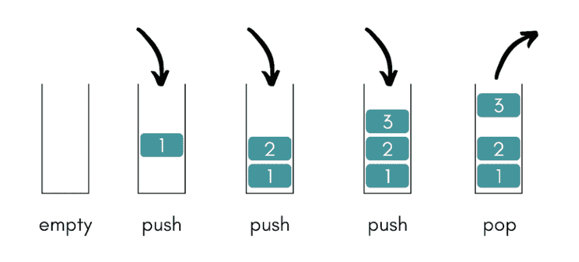
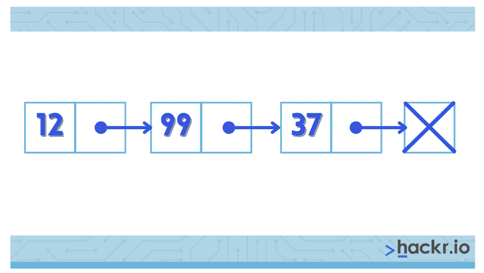
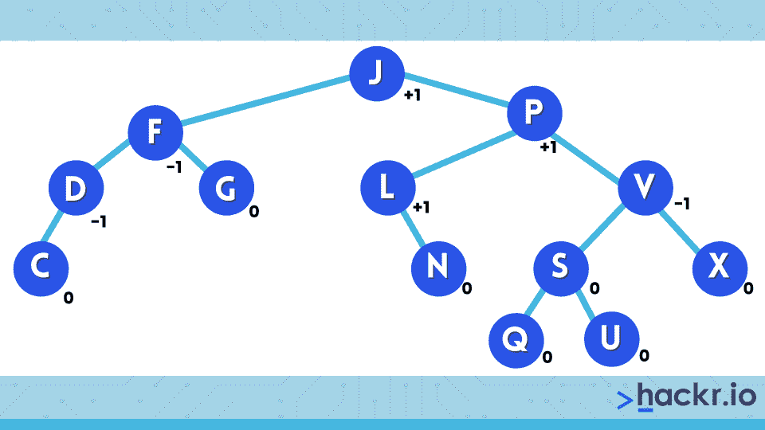

# 50+顶级数据结构面试问答[更新]

> 原文：<https://hackr.io/blog/data-structure-interview-questions>

数据结构可以是允许有效访问和修改的任何数据组织、管理和存储格式。它是数据值、数据值之间的关系以及可应用于数据的各种功能或操作的集合。

数据结构是编程的基本概念，在算法设计中大量使用。因此，对于任何程序员来说，不管他们的主要编程语言是什么，很好地理解这个概念以及什么样的数据结构问题是最常见的，这是非常重要的。

这里我们涵盖了你在申请职位时可能会遇到的数据结构面试问题。

## **顶级数据结构面试问答**

任何[编程语言面试](https://hackr.io/blog/programming-interview-questions)都可以有几个或很多基于数据结构的问题。以下是顶级的数据结构和算法面试问题及其各自的答案。

如果你愿意，你可以下载我们的[数据结构面试问答 PDF。](https://drive.google.com/file/d/1tOnovR9lQPyWklHp6fN7twYArRq0iM2v/view?usp=sharing)

### **1。什么是数据结构？**

数据结构是一种组织和操作数据的便捷方式。数据结构有很多种，每一种都有不同的应用。

例如，编译器实现使用散列表来查找标识符。同样，B 树也适用于数据库。数据结构用于人工智能、编译器设计、数据库管理、图形、数值分析、操作系统和统计分析。

### **2。线性数据结构和非线性数据结构有什么不同？**

如果一个数据结构的元素形成一个序列或一个线性列表，那么它被称为线性数据结构。非线性数据结构是指节点的遍历是非线性的。

数组、链表、栈和队列是线性数据结构的例子，而图形和树是非线性数据结构的例子。

### **3。数据结构的应用有哪些？**

数据结构的一些实际应用有:

*   以表格形式存储数据。例如，个人的联系方式可以存储在数组中。
*   数组广泛应用于图像处理和语音处理。
*   音乐播放器和图像滑块使用链接列表在项目之间切换。
*   队列用于作业调度——安排用于通信的数据包。
*   决策树算法在机器学习中使用树。
*   像区块链和密码学这样的技术都是基于哈希算法的。
*   矩阵被广泛用于表示数据和绘制图形，以及执行统计分析。

### **4。文件结构和存储结构有什么区别？**

*   **文件结构:**硬盘或外部设备(如 USB)，存储数据，在手动删除前保持完整。这种将数据存储在二级或辅助存储器中的方式称为文件结构。
*   **存储结构:**在这种类型的结构中，数据(变量、常量等。)被存储在主存储器(即 RAM)中，并且一旦使用该数据的功能完成，就被删除。

### **5。可以对数据结构执行的各种操作有哪些？**

以下是可以在数据结构上执行的操作:

*   **删除:**从数据结构中删除现有元素。
*   **插入:**向数据结构中添加新元素。
*   **搜索:**在数据结构中查找元素的位置，如果它存在的话。
*   **排序:**对数字数据按升序或降序排列数据结构的元素，对字母数字数据按字典顺序排列。
*   **遍历:**对数据结构的每个元素访问一次进行处理。

### **6。解释一下后缀表达式。**

在后缀表达式中，运算符固定在操作数之后。一些例子是:

*   B++(即 B+B)
*   AB+(即 A+B)
*   ABC*+(即 A+B*C)
*   AB*CD*+(即 A*B + C*D)

### 7 .**。哪种数据结构用于图的 BFS 和 DFS？**

[图的广度优先搜索(BFS)](https://hackr.io/blog/breadth-first-search-algorithm) 使用队列。图的深度优先搜索(DFS)使用堆栈，但也可以通过函数调用堆栈使用递归来实现。

**建议课程**

[数据科学课程 2023:完整数据科学训练营](https://click.linksynergy.com/deeplink?id=jU79Zysihs4&mid=39197&murl=https%3A%2F%2Fwww.udemy.com%2Fcourse%2Fthe-data-science-course-complete-data-science-bootcamp%2F)

### **8。什么是多维数组？**

如果一个数组有两个以上的维度，则称为多维数组。它们也被称为数组的数组。例如，三维数组看起来像这样:

```
int 3darr[10][20][30] 
```

–该数组可以存储 10*20*30 个元素。

##### **赋值**

int ndarr[2][3][5] = {{{1，2，4，5}，{5，6，7，9}，{6，5，4，3}}，{{1，1，3，4}，{2，3，4，6}，{5，6，7，8 } }；

##### **访问元素**

为了访问每个元素，我们需要三个嵌套循环，比如 I，j，k，这样我们就可以得到 ndarr[i][j][k]的值

### **9。什么是堆栈？陈述一些应用。**

堆栈是一种线性数据结构，遵循后进先出(LIFO)或先入后出(FILO)方法来访问元素。Push、pop 和 peek 是堆栈的基本操作。



堆栈的一些应用包括:

*   检查表达式中的平衡括号
*   后缀表达式的求值
*   在一个数组中实现两个堆栈
*   中缀到后缀的转换
*   反转字符串

### 10。什么是队列？和栈有什么区别？

队列是一种线性结构形式，遵循 FIFO(先进先出)方法来访问元素。出列、入队、前端和后端是对队列的基本操作。像堆栈一样，队列可以使用数组和链表来实现。

在堆栈中，最近添加的项首先被移除。与此相反，在队列的情况下，最近最少添加的项目首先被删除。

### **11。什么是二分搜索法？什么时候用最好？**

二分搜索法是一种从中间元素开始搜索的算法。如果中间的元素不是目标元素，那么它检查是否应该搜索下半部分或上半部分。该过程继续，直到找到目标元素。

二分搜索法在应用于包含排序元素的列表时效果最佳。

### **12。如何引用一维数组中的所有元素？**

我们可以使用索引循环引用一维数组中的所有元素。计数器从 0 运行到最大数组大小，比如 n 减 1。通过使用循环计数器作为数组下标，按顺序引用一维数组的所有元素。

### 13。什么是先进先出和后进先出？

FIFO 和 LIFO 都是从数据结构中访问、存储和检索元素的方法。LIFO 代表后进先出。在这种方法中，最先提取的是最近存储的数据。

FIFO 代表先进先出。使用这种方法，将首先提取最早存储的数据。

### **14。什么是链表？**

在链表中，元素是线性存储的，但是物理位置与内存中的顺序无关；相反，每个元素都指向下一个节点。最后一个指向一个表示列表结束的终止符。链表有很多种类型，比如单链表、双链表、循环链表和多链表。一个简单的单链表可以画成:



###  **15。动态内存分配如何帮助管理数据？**

动态内存分配有助于存储简单的结构化数据类型。它还可以组合单独分配的结构化块，以形成根据需要收缩和膨胀的复合结构。

### 16。无效和作废的区别是什么？

NULL 是一个值，而 VOID 是一个数据类型标识符。赋有空值的变量表示空值。该空隙用于标识没有初始大小的指针。

### **17。如果使用 C 语言实现异构链表，应该使用什么类型的指针？**

我们可以使用空指针。无符号字符指针是另一种选择。这样，我们可以在列表中存储任何数据类型。例如:

```
structa{

structa *next;

s_ize d_size;

 }
```

###  **18。Pop 和 Push 有什么不同？**

推入和弹出操作都属于堆栈。使用 push 操作将数据添加到堆栈中，同时使用 pop 操作检索数据。

### **19。变量声明如何影响内存分配？**

在变量声明的情况下，要分配或保留的内存总量取决于所使用的数据类型。例如，声明一个整型变量会保留 4 字节的内存空间，而声明一个双精度变量会保留 8 字节的可用内存。

### 20。用 C 语言编写语法，在单链表中创建一个节点。

```
newNode = Node(data); //creates a new node.
```

###  **21。什么是数据抽象？**

数据抽象有助于将复杂的数据问题分成更小的、易于管理的部分。它从指定所有涉及的数据对象和要执行的各种操作开始，而不用太担心数据的存储方式。

###  **22。写一个 C 程序，在循环链表的开头插入一个节点。**

在循环链表中，最后一个指针指向头部(第一个节点)。为此，我们使用指向最后一个节点的外部指针，last->next 指向第一个节点。我们采用最后一个节点指针，因为这样可以避免在开头或结尾插入节点时遍历整个列表。

**程序步骤**

*   创建一个节点 N
*   N->next = last->next
*   上一个->下一个= N

**代码:**

```
struct Node *addBeginning(struct Node *last, int data)

{

/*check if list empty, if so create a node, else proceed as below*/

// dynamically create a node

 struct Node *N 

= (struct Node *)malloc(sizeof(struct Node)); 

 // Assign the data. 

 N -> data = data; 

 // last pointer becomes the first node 

 N -> next = last -> next; 

 last -> next = N; 

 return last; 

}
```

###  **23。如何在二叉查找树中插入一个新项目？**

因为二叉查找树不允许重复，所以要插入的新项目必须是唯一的。假设是，我们将继续检查树是否为空。如果它是空的，那么新的条目将被插入到根节点中。

但是，如果树是非空的，那么我们将引用新条目的键。当它小于根项的键时，新项将被添加到左子树中。如果新项目的键大于根项目的键，那么新项目被插入到右边的子树中。

###  **24。选择排序如何在数组上工作？**

选择排序从寻找最小的元素开始。它与下标 0 处的元素一起切换。接下来，剩余子数组中的最小元素被定位并与下标 1 中的元素交换。

重复上述过程，直到最大的元素位于下标 n-1，其中 n 表示给定数组的大小。

###  **25。编写在二叉树上执行有序遍历的伪代码。**

有序遍历是深度优先遍历。递归调用该方法以在二叉树上执行遍历。代码如下:

```
structbtnode

{

structbtnode *left;

structbtnode *right;

}

*root = NULL, *temp = NULL;

voidinorder(struct btnode *temp)

{

if (root == NULL)

{

printf("Root is empty");

return;

}

if (temp->left != NULL)

inorder(temp->left);

if (temp->right != NULL)

inorder(t->right);

}
```

**26。编写递归 C 函数来计算二叉树中的节点数。**

```
staticint counter = 0;

intcountnodes(struct node *root)

{

if(root != NULL)

{

countnodes(root->left);

counter++;

countnodes(root->right);

}

return counter;

}
```

### **27。写一个递归 C 函数来计算二叉树的高度。**

为了使用递归来寻找高度，我们找到左边和右边的子树的高度的最大值，然后将它与根相加。

```
staticint counter = 0;

intcountnodes(struct node *root)

{

if(root != NULL)

{

countnodes(root->left);

counter++;

countnodes(root->right);

}

return counter;

}
```

**28。有符号和无符号数字是如何影响内存的？**

对于有符号的数字，第一位保留用于指示数字是正数还是负数。因此，它少了一位来存储值。与有符号数不同，无符号数拥有存储该数的所有可用位。

上述效果可以在有符号和无符号数的可用值范围中看到。无符号 8 位数字的范围可以是 0 到 255，而有符号 8 位数字的范围是-128 到 127。

### **29。所有的声明语句都会导致固定的内存保留吗？**

除了指针，所有的声明语句都会导致固定的内存保留。指针声明不是分配内存来存储数据，而是分配内存来存储指针变量的地址。

对于指针，数据的实际内存分配发生在运行时。

### 三十岁。数组和堆栈有什么不同？

堆栈遵循后进先出法。这意味着数据操作遵循一个特定的顺序，最新的数据元素是最先检索的。

与堆栈不同，数组不遵循任何特定的顺序来添加或检索数据。在数组中添加或检索元素是通过引用数组索引来完成的。

### 31。什么是 AVL 树？

****

AVL 树是一种二叉查找树，它总是处于部分平衡的状态。平衡的度量由 AVL 树的根节点到子树的高度差给出。

### 32。数组和链表有什么不同？

以下是数组和链表之间的区别:

*   **额外内存:**对于属于链表的每个元素，都需要额外的内存空间来存储指针。数组没有这样的要求。
*   **缓存:**与链表相比，数组具有更好的缓存局部性，这可以显著提高各种场景下的性能。
*   **插入和删除:**在链表中添加或删除元素很容易。插入和删除数组元素的开销相对较大。
*   **随机访问:**链表不允许随机访问，而数组允许。
*   **大小:**数组的大小是固定的，而链表的大小是动态的。

### 33。什么是中缀、前缀和后缀符号？

*   **中缀符号:**运算符写在操作数之间。这是标准的表达方式。比如:A * (B + C) / D
*   **后缀表示法/逆波兰表示法:**运算符写在操作数之后，故名。比如:A B C + * D /
*   **前缀表示法/波兰表示法:**运算符写在操作数之前。/ * A + B C D 是前面提到的后缀符号示例的等价前缀符号。

### 34。什么是链表，有哪些不同的类型？

在链表中，每个元素都是一个不同的对象。像数组一样，链表是一种线性类型的数据结构。除了数据，链表的每个元素都有对下一个元素的引用。各种类型的链表有:

*   **单链表:**每个节点存储链表中下一个节点的地址或引用，除了最后一个节点存储 NULL。
*   **双向链表:**每个节点保留两个引用。一个指向下一个节点，另一个指向前一个节点。
*   **循环链表:**在这种类型的链表中，所有的节点连接起来形成一个圆。结尾没有 NULL。循环链表可以是单循环链表，也可以是双循环链表。

### 35。如何使用队列实现堆栈，反之亦然？

使用两个队列实现堆栈是可能的。有两种选择:要么让推送操作代价高昂，要么让弹出操作代价高昂。

队列也可以用两个堆栈来实现。有两种选择:要么使入队操作代价高，要么使出队操作代价高。

### 36。哪些数据结构用于实现 LRU 缓存？

通过按使用顺序组织项目，最近最少使用或 LRU 缓存可以快速识别最长时间未使用的项目。有两种数据结构用于实现 LRU 高速缓存:

*   **队列:**使用双向链表实现。队列的最大大小取决于可用帧的总数，即缓存大小。最近最常使用的页面将位于队列的后端，而最近最少使用的页面将位于队列的前端。
*   **Hashmap:** 它将页码作为键，将相应队列节点的地址作为值。

### 37。开发算法的各种方法是什么？

开发算法有 3 种主要方法:

*   **分而治之:**涉及到将整个问题分成许多子问题，然后独立解决每个子问题。
*   **动态规划:**除了所有子问题一起解决之外，与分治法相同
*   **贪婪方法:**通过选择下一个最佳选项找到解决方案。

### 38。列举一些贪婪算法和分治算法的例子。

遵循贪婪方法的算法示例有:

*   Dijkstra 最小生成树
*   图表-地图着色
*   图形-顶点覆盖
*   作业调度问题
*   背包问题
*   克鲁斯卡尔最小生成树
*   Prim 的最小生成树
*   旅行推销员

分而治之方法的例子有:

### 39。插入排序和选择排序有什么不同？

插入和选择方法都维护两个子列表，排序的和未排序的。每一个都从未排序的子列表中取出一个元素，并将其放入排序的子列表中。这两种排序过程的区别在于对当前元素的处理。

插入排序获取当前元素，并将其放入排序后的子列表中的适当位置。选择排序在未排序的子列表中搜索最小值，并用当前元素替换它。

### 40。你所理解的壳排序是什么？

外壳排序可以理解为插入排序的一种变体。该方法基于一些间隙变量将整个列表分成更小的子列表。然后使用插入排序对每个子列表进行排序。

### 41。你能解释一下树的遍历吗？

访问树的所有节点的过程称为树遍历。它总是从根节点开始，有三种方法:

*   有序遍历
*   前序遍历
*   后序遍历

### **42。什么是生成树？一个图最多可以有多少棵生成树？**

生成树是一个图的子集，它有所有的顶点，但边数尽可能少。生成树是不可断开的，并且没有循环。

一个图可以拥有的最大生成树数取决于有多少个连接。具有 n 个节点的完全无向图最多可以有 n-1 个生成树。

### **43。克鲁斯卡尔的算法是如何工作的？**

Kruskal 的算法将一个图视为一个森林，并将其中的每个节点视为一棵树。只有在以下情况下，树才会连接到另一棵树:

*   在所有可用选项中成本最低
*   不违反 [MST 属性](https://www.quora.com/What-are-some-properties-of-minimum-spanning-trees)

### **44。什么是堆？**

堆是一种特殊的平衡二叉树，其中根节点键与其子节点进行比较，并相应地进行排列。它可以有两种类型:

*   **Min-Heap:** 父节点的键值比其子节点的键值少。
*   **Max-Heap:** 父节点的键值大于其子节点。

### **45。什么是递归？**

允许函数或模块调用自身的能力称为递归。函数 f 要么直接调用自身，要么调用另一个函数“g ”,后者又调用函数“f”。函数 f 被称为递归函数，它遵循递归特性，即:

*   **基础标准:**递归函数停止调用自身的地方。
*   **渐进方法:**递归函数试图在每次迭代中满足基本标准。

### **46。什么是汉诺塔问题？**

汉诺塔是一个数学难题，由三个塔(或桩)和一个以上的环组成。每个环的大小不一，一个叠一个，大的在小的下面。

汉诺塔问题的目标是在不破坏性质的情况下将圆盘的塔从一个桩移动到另一个桩。

### **47。BFS(广度优先搜索)和 DFS(深度优先搜索)算法是如何工作的？**

[BFS 算法](https://hackr.io/blog/breadth-first-search-algorithm)在横向运动中遍历图形。它使用一个队列来记住下一个顶点，以便在任何迭代中出现死胡同时开始搜索。

DFS 算法在深度方向上遍历一个图。当遇到迭代中的死胡同时，它使用堆栈来记住下一个顶点以开始搜索。

### **48。哈希你懂什么？**

将键值范围转换为数组索引范围的技术称为哈希。可以使用散列表来创建关联数据存储，在散列表中，可以通过提供相应的键值来找到数据索引。

### 49。什么是最小生成树？Prim 的算法是怎么找到的？

MST 或最小生成树是赋权图中的生成树，它在所有可能的生成树中具有最小的权重。当从可用图向生成树添加新节点时，每个节点被 [Prim 的算法](https://en.wikipedia.org/wiki/Prim's_algorithm)视为一棵树。

### 50。什么是插值搜索技术？

插值搜索技术是二分搜索法的增强变体。它作用于所需值的探测位置。

### 51。如何检查给定的二叉树是否是 BST？

简单地执行给定二叉树的有序遍历，同时跟踪前一个键值。如果当前键值更大，则继续，否则返回 false。如果二叉树的有序遍历是排序的，那么二叉树就是 BST。

## **结论**

这总结了我们最常见的 DS 和 algo 面试问题。这些 DS 面试问题在其他编程面试中也是有帮助的。

下载我们的[数据结构面试问答 PDF](https://drive.google.com/file/d/1tOnovR9lQPyWklHp6fN7twYArRq0iM2v/view?usp=sharing) 随时研究这些问题。

如果你想提高你的数据结构知识，试试[最佳数据结构教程](https://hackr.io/tutorials/learn-data-structures-algorithms?ref=blog-post)。

这些关于数据结构的面试问题对于任何编程面试都是必不可少的，千万不要忽视。

有些是基础数据结构面试问题，有些是有经验的开发人员的数据面试问题。不管怎样，它们都是重要的概念。祝你好运！

## **常见问题解答**

### **面试中会问到哪些数据结构？**

在 dsa 面试问题中，你会被问到栈、队列、数组、链表、堆和树。你的面试官会测试你所有的数据，所以不要遗漏任何数据结构。

### **什么是 DS，为什么需要它？**

数据结构是以一种特殊方式存储的数据集合，这种方式便于管理和操作。通过良好的数据结构使用，您可以有效地遍历和抽象数据，并重用它。这就是为什么几乎每个软件开发角色都有数据结构面试问题。

### **数据结构和算法有什么区别？**

数据结构允许你以有效和有组织的方式存储数据。算法是告诉如何解决特定问题的一系列步骤。

### 数据结构的 3 个特征是什么？

数据结构的三个特征是它们是线性的还是非线性的；它们是同质的还是异质的；以及它们是静态的还是动态的。这些属性决定了它是什么数据结构。例如，数组是线性的，图形是非线性的。

**人也在读:**