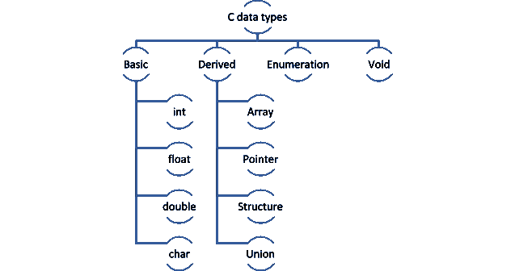

# C 中的数据类型及其类型？[完整指南]

> 原文：<https://hackr.io/blog/data-types-in-c>

应用程序需要不同类型的数据来存储信息。例如，姓名是一个字符数组，但年龄最好存储为整数。我们可以执行许多操作(求和、平均、连接、匹配等)。)如果数据以正确的格式和正确的类型存储。这就是为什么我们在 C 中有这么多的数据类型，以便我们能够以最好的方式区分和分离数据。

## **C 语言中的数据类型与示例**

C #中有 4 种数据类型:

*   基础
*   得到
*   空的
*   列举

大多数时候，对于小程序，我们使用 C 中的基本数据类型——int、char、float 和 double。

对于更复杂和大量的数据，我们使用派生类型——数组、结构、联合和指针。

枚举和 void 分别由枚举和 void 组成。我们将在本文后面讨论这些。

### **基础数据 T** **类型**

这些也被称为主要或基本数据类型。所有名字的意思都一样。假设我们必须存储学生的详细信息，如姓名、id、分组、平均分数、学费利息。

我们可以使用基本数据类型来存储这些数据:

```
char name[25];
int id;
char group;
float marks[5];
double interest;

```

#### **int 数据类型**

整数类型可以是有符号的(负值)或无符号的(只有正值)。除非特别提到，否则 Int 值总是有符号的。

整数类型进一步分为-

| 数据类型 | 范围 |
| **int** | 签到 |
| 无符号整数 | 0 到 65，535 |
| **short** int | 有符号短整型 |
| -2，147，483，648 到 2，147，483，647 (4 字节) | 无符号短整型 |
| 0 到 4，294，967，295 (4 个字节) | **long** int |
| 带符号长整型 | -2，147，483，648 到 2，147，483，647 (4 字节) |
| 无符号长整型 | 0 到 4，294，967，295 (4 个字节) |
| 一些例子: | 如何打印整数变量？这里有一个小程序，你可以尝试和调整，以获得不同的结果，并了解短整型和长整型的范围。 |
| 我们使用%hd 作为缩写，使用%d 作为 int，以此类推来打印每种数据类型。 | 请注意，我们使用“long long”表示 sum，它是 8 个字节，而 long 是 4 个字节。虽然在实际情况下，我们可能不会使用这么大的数字，但是知道这个范围以及我们应该为指数计算程序使用什么数据类型是很好的。对于无符号的 int，我们可以用%u 代替%d，但即使是%d 也可以。我们来说一下 long notprime 的值=-23009090909933322；有一个减号，但是我们把它打印成 notprime 是%lu，正确的值不会被打印出来。这就是为什么使用%ld 是安全的，除非您希望值总是无符号的。 |

如果我们给 short int num1 = 10000 加更多的数字，就会超出范围，打印出错误的值。“short int”可用于限制整数数据类型的大小。

```
int number = 456;
long prime = 12230234029;

```

**浮动**

```
#include 
int main(void) {
short int num1 = 10000;
int number = 121113991;
long prime = 49929929991;
long notprime = 2300909090909933322;
long long sum = prime + notprime;
printf("num1 is %hd, number is %d, prime is %ld, notprime is %ld, sum is %lld", num1, number, prime, notprime, sum);
return 0;
}

```

浮点数据类型允许用户键入十进制值。例如，平均分数可以是 97.665。如果我们使用 int 数据类型，它将去掉小数部分，只打印 97。要打印准确的值，我们需要“float”数据类型。

Float 是 4 个字节，我们可以用%f 打印这个值。

float 也可以包含 int 值。

#### 然而，您将得到标记为 67.00000 的结果，这可能不是一个愉快的景象，因为有许多冗余的零。如果在声明 mark 的值为 float 后试图将其打印为%d，将不会得到 67。试着运行这个程序，看看你得到什么值。

**建议课程**

[数据科学课程 2023:完整数据科学训练营](https://click.linksynergy.com/deeplink?id=jU79Zysihs4&mid=39197&murl=https%3A%2F%2Fwww.udemy.com%2Fcourse%2Fthe-data-science-course-complete-data-science-bootcamp%2F)

**Double**

```
 float average = 97.665;
 float mark = 67;
 printf("average is %f", average);
 printf(" mark is %f", mark);

```

你可以把 float，double，long double 想成类似于 short int，int，long int。Double 是 8 个字节，这意味着你可以拥有比 float 更高的精度。这在要求精确的科学程序中很有用。Float 只是单精度数据类型；double 是双精度数据类型。大多数编译器将 Long Double 视为 Double；然而，它是为四倍数据精度而设计的。

输出是–
平均值是 679999999.454000，分数是 680000000.000000
注意输出中的差异–double 打印精确值，float 值四舍五入到最接近的数字。

**字符**

#### char 存储单个字符。Char 由一个字节组成。

举个例子，

```
double average = 679999999.454;
float score = 679999999.454;
printf("average is %lf", average);
printf(", score is %f", score);

```

注意，对于单个字符，我们使用单引号，但是对于字符串(字符数组)，我们使用双引号。因为它是一个数组，我们必须指定长度(在这个例子中是 30)。

#### 就像 int 数据类型一样，char 可以是有符号的(范围从-128 到+127)或无符号的(0 到 255)。c 存储我们输入的任何字符的 Unicode/ [ASCII](https://ee.hawaii.edu/~tep/EE160/Book/chap4/subsection2.1.1.1.html) 值的二进制等价物。在上面的例子中，char 组将被存储为值‘066’。

你也可以把 char 看作一个 int 值，因为 char 也接受 int 值。当你在一个 [char](https://www.computerhope.com/jargon/c/char.htm) 中存储一个指定范围内的 int 时，有符号和无符号的重要性就显现出来了。

下面的例子有助于更好地理解有符号和无符号字符

```
char group = ‘B’;
To print a name or a full string, we need to define char array. 
 char group = 'B';
char name[30] = "Student1";
printf("group is %c, name is %s", group, name);

```

注意，由于我们接受 int 值，我们将打印为%d 而不是%c，由于 char1 是有符号的，printf 将给出-127 的值。但是，char2 是无符号的，这意味着范围是从 0 到 255，-127 超出了范围。因此，它将打印 129。同样，如果你把 char2 赋值为-1，你会得到一个值 255。

**派生数据类型**

数组、指针、结构和联合是 c #中的派生数据类型。

**数组**

```
signed char char1 = -127;
unsigned char char2 = -127;
printf("char1 is %d, char2 is %d", char1, char2);

```

与任何其他语言一样，C #中的数组存储同一数据类型的多个值。这意味着我们可以有一个整数、字符、浮点数、双精度数等的数组

### 数组需要初始化，或者需要在声明期间指定大小。

为了理解一维数组操作，让我们看一下下面的简单代码

#### 这里需要注意几点:

如果我们不为 marks 输入任何值，marks[i]将默认为零。

```
int numbers[] = ;
double marks[7];
float interest[5] = ;

```

如果 sum 是 int，sum/noOfSubjects 将把平均值四舍五入到最接近的值，并且只打印小数之前的值(即使 average 是 double 数据类型)。我们也可以进行类型转换来避免这种情况。

使用标记[i]填充数组中的每个元素，其中 I 对应于相应的元素。同样，为了获取数据，我们再次使用 marks[i]遍历数组以获取各个元素。

```
#include 
int main(void) {
 // declare array with maximum 5 values
 int marks[5];
 // get the size of the array
 int noOfSubjects = sizeof(marks)/sizeof(int);
 // let us get the inputs from user
 for(int i=0; i<noOfSubjects; i++)
 {
 printf("\nEnter marks "); 
 scanf("%d", &marks[i]);
}
 double average;
 double sum = 0;
 // fetch individual array elements
 for(int i=0; i<noOfSubjects; i++)

 // let us print the average of marks
 average = sum/noOfSubjects;
 printf("\nAverage marks = %lf", average);
 return 0;
}

```

sum+= marks[I]；等同于写 sum = sum+marks[I]；

*   在 C #中，数组可以是多维的。为了简单起见，我们将局限于二维数组。
*   例如，
*   对于行和列，索引都从 0 开始。例如–
*   如果您必须通过程序访问这些值，您将需要两个循环计数器，外部的一个用于行，内部的一个用于列。

**指针**

```
dataType arrayName [rows][columns];

```

许多人认为指针在 C 语言中很复杂，但事实并非如此。简单来说，指针只是一个变量，存储另一个变量的地址。指针可以存储任何数据类型的变量的地址。这允许 c 中的动态内存分配，指针也有助于通过引用传递变量。

```
int matrix1[3][5] = {
 , //first row with index 0
 , // second row with index 1
 // third row with index 2
 };

```

指针是使用“*”运算符定义的。例如–

```
matrix1[0][0] will be 1.
matrix1[1][1] will be 12.
matrix1[2][2] will be 23.
matrix1[2][4] will be 25.

```

这表明 ptr 存储的是地址而不是值。为了获得变量的地址，我们使用解引用操作符' & . '指针的大小是 2 字节。指针不能相加、相乘或相除。但是，我们可以减去它们。这将帮助我们知道两个相减的指针之间存在的元素数量。这是一个简单的程序，说明了指针

#### **结构**

结构是一种复合结构，可以包含不同数据类型的变量。例如，我们之前在基本数据类型中声明的所有学生数据都可以放在一个结构中。当我们给它一个结构，而不是分散的信息，它更容易存储更多学生的信息。

结构可以在 main 方法之外创建，也可以在 main 方法之内创建，只是要在创建变量之前使用它。

```
int *ptr;

```

结构中的元素也可以使用指针来访问。C 中没有 toString()方法(像 Java 有)，所以要打印 struct 值，我们需要单独取出并打印。

```
#include 
int main(void) {
 int *ptr1;
 int *ptr2;
 int a = 5;
 int b = 10;
 /* address of a is assigned to ptr1*/
 ptr1 = &a;
 /* address of b is assigned to ptr2*/
 ptr2 = &b;
 /* display value of a and b using pointer variables */
 printf("%d", *ptr1); //prints 5
 printf("\n%d", *ptr2); //prints 10 
 //print address of a and b
 printf("\n%d", ptr1); // prints address like -599163656
 printf("\n%d", ptr2); // prints address like -599163652
 // pointer subtraction
 int minus = ptr2 - ptr1;
 printf("\n%d", minus); // prints the difference (in this case 1)
return 0;
}

```

#### 下面是一个小程序，展示了同样的内容(为了简单起见，我对数据进行了硬编码，您可以执行一个 for 循环，也可以从用户那里获取数据，并像在数组中一样存储它)。

使用*操作符，我们通过引用传递 student struct 的值，以便保留正确的值。

```
typedef struct{
char name[25];
int id;
char group;
float marks[5];
double interest;
}Student;

```

我们不使用点运算符，而是使用'--> '运算符来获取值。

```
struct student1, student[20];
Structure members can be accessed using the dot(.) operator. For example,
printf(“Student id is %d - ”, student1.id);

```

结构使用简单，并以一种简洁的方式组合数据。

**工会**

```
int main(void) { 
 // Store values in structures
 Student st1 = {"student1", 1, 'a', , 4.5};
 Student st2 = {"student2", 2, 'b', , 9.5}; 
 // Send structure values to the printing method
 print_student_details(&st1);
 print_student_details(&st2);
 return 0;
}
// get the address of structure data and print
void print_student_details(Student *st) {
 printf("\Student details for %s are:\n", st->name); 
 printf("id: %d\n",st->id); 
 printf("group %c\n", st->group); 
 // since marks is an array, loop through to get the data
 for(int i=0;i<5;i++)
 printf("marks %f\n", st->marks[i]);
 printf("interest %lf", st->interest);
}

```

*   使用 union，您可以在同一内存位置存储不同的数据类型。该联合可以有许多成员，但一次只能有一个成员有值。因此，Union 是 c #中一种特殊的数据类型。
*   联合的定义方式与结构相同，但使用了关键字 union。

当我们给 union 数据赋值时，union 会分配足够的内存来容纳定义的最大数据类型。例如，由于在所有其他数据类型中，name 占用的内存空间最大，因此 union 将分配 name 占用的空间。

#### 假设我们同时在 union 中赋值并打印多个值。

与 struct 不同，这将获取输出为–

只有成员名的值是正确的；其他值已损坏。但是，如果我们一个一个地赋值并打印值，我们将正确地得到所有的值。

```
union Student{
 char name[25];
 int id;
 char group;
 float marks[5];
 double interest;
 }st1, st2;

```

现在，我们得到的输出是

[阅读这篇博客](https://hackr.io/blog/difference-between-structure-and-union)了解更多关于结构和联合的区别。

```
st1.id = 1; 
st1.group = 'a';
strcpy(st1.name, "student1");
printf( "ID : %d\n", st1.id);
printf( "Group : %c\n", st1.group);
printf( "Name : %s\n", st1.name);

```

**枚举**

```
ID : 1685419123
Group : s
Name : student1

```

枚举数据类型增强了代码的可读性。如果代码中有可以重用或组合在一起的整数常量，我们可以使用枚举来定义这些常量。最常见的例子是一周中的每一天。

```
st1.id = 1; 
printf( "ID : %d\n", st1.id);
st1.group = 'a';
printf( "Group : %c\n", st1.group);
strcpy(st1.name, "student1");
printf( "Name : %s\n", st1.name);

```

在内部，C 将把 MON 存储为 0，把 TUE 存储为 1，依此类推。我们也可以给枚举赋值。

```
ID : 1
Group : a
Name : student1

```

枚举非常有用，可以用作标志。它们在代码中提供了灵活性和效率。

### **作废**

void 只是一个空数据类型，用作函数的返回类型。缺少任何其他数据类型都是无效的。当你声明一个函数为 void 时，它不需要返回任何东西。例如–

```
enum weekdays;
enum weekend;

```

同样，如果一个函数没有任何参数，也可以用 void 来表示。

```
enum weekdays;
If we print each of the enum values, the output will be –
1, 2, 6, 7, 8

```

我们可以声明一个空指针，这样它就可以接受任何数据类型的变量。声明为 void 的指针成为通用指针

### 没有任何编译错误。您可以将任何数据类型分配给 void 指针。

**结论**

```
void swapNumbers(int a, int b){
//multiple lines of code here
}

```

在这篇博客中，我们已经详细讨论了 C 中的所有数据类型，即基本、派生、枚举和 void。所有的数据类型都有自己的用处，这使得 C 语言成为一种健壮的语言。查看 [C 教程](https://hackr.io/tutorials/learn-c?ref=blog-post)和[最佳 C 书籍](https://hackr.io/blog/10-best-c-cpp-books)来进一步学习语言和理清你的概念。作为快速参考，请使用此图表一次性记住所有数据类型:

```
int getNumbers(void){
// some code
}

```



```
char *ptr;
int value;
ptr = &value; //this will give error because we cannot point a char pointer to an int value
However,
void *ptr;
will solve this problem and now we can write
ptr = &value; 

```

**人也在读:**

## **Conclusion**

In this blog, we have discussed all the data types in C in detail i.e., basic, derived, enumeration, and void.  All the data types are useful in their own ways and make C the robust language it is. Check out [C tutorials](https://hackr.io/tutorials/learn-c?ref=blog-post) and [best C books](https://hackr.io/blog/10-best-c-cpp-books) to further learn the language and clear your concepts. For a quick reference, use this diagram to remember all the data types in one go: 


**People are also reading:**