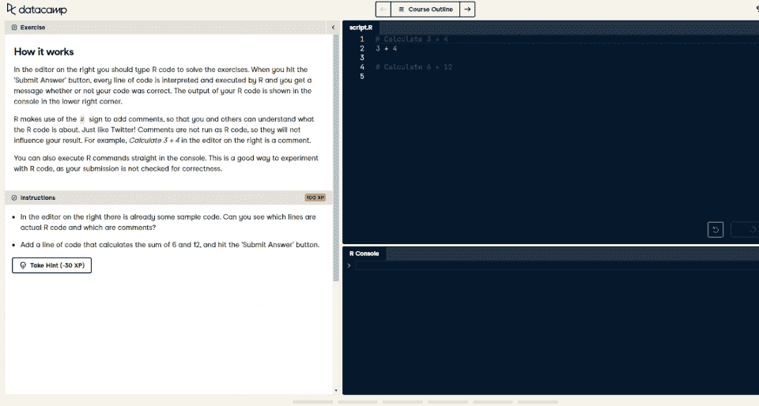
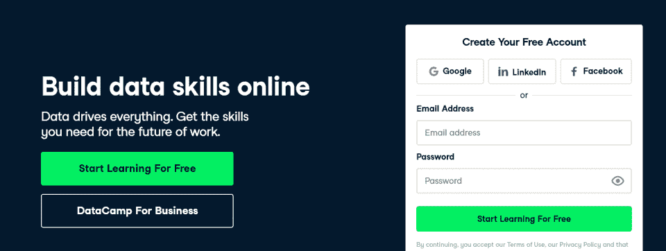
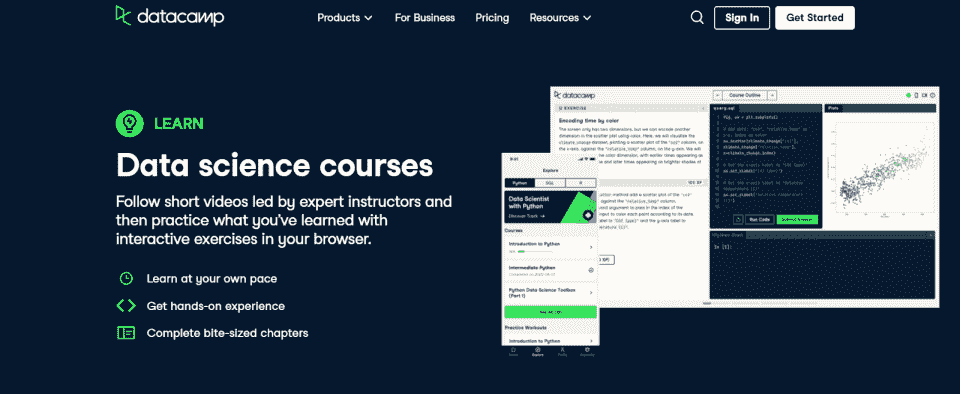
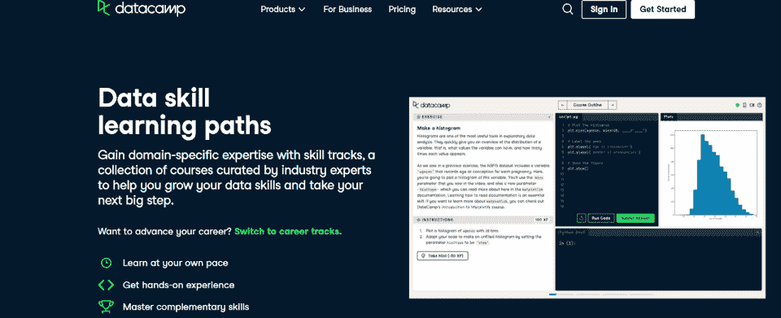
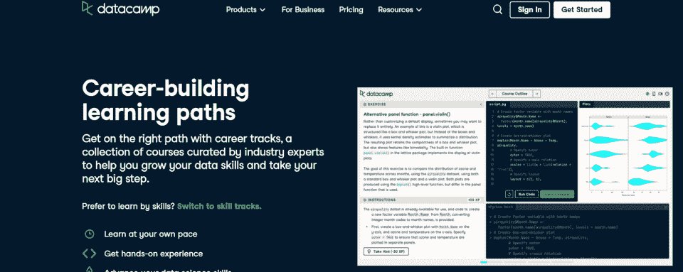
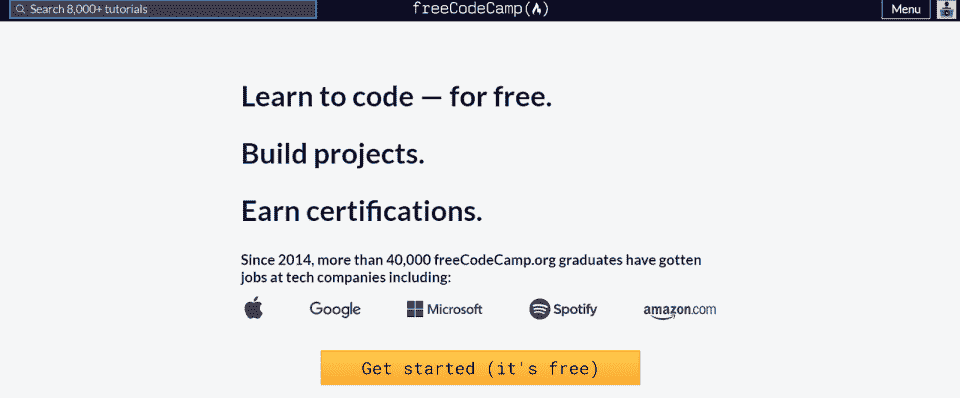
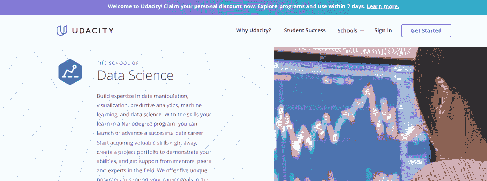

# 2023 年数据营回顾:优点、缺点和替代方案

> 原文：<https://hackr.io/blog/datacamp-review>

使用 DataCamp 在线培养您的数据技能。DataCamp 是一个完整的 R、 [Python](https://hackr.io/blog/how-to-learn-python) 和数据科学知识库。如果你想成为一名数据科学家，或者只是温习一下你的数据科学技能，DataCamp 是一个极好的资源。

| 教练 | 4/5 |
| 课程 | 5/5 |
| 经验 | 4/5 |
| 总数 | 4.3/5 |

**一览:**

*   DataCamp 为数据科学领域的新手提供了全方位的学习体验。
*   DataCamp 主要面向那些没有编程知识或计算机科学经验的人，但也有更高级的课程。
*   虽然基本访问是免费的，但学生需要订阅才能完成大多数课程，尝试技能路线和职业轨迹，或获得认证。

最终，对于那些想要了解更多关于数据科学和数据工程的人来说，DataCamp 是一个极好的资源，但是那些参加这些课程的人需要有动力和自我激励。

在我们全面的 DataCamp 评论中，我们将涵盖 DataCamp 最受欢迎的课程、它的定价以及它对想要成为数据科学家的人是否值得。

## DataCamp 提供什么？

DataCamp 提供 354 门课程、51 个技能方向和 12 个职业方向，全部在数据科学领域。通过 DataCamp，计算机科学家可以学习 Python、R、SQL 等，同时通过现实世界的项目构建他们的数据科学组合。

在 DataCamp 中，学生可以通过四种方式学习:

*   [**课程**](https://datacamp.pxf.io/DVGE65) **:** 个别数据科学课程如 Python 入门、SQL 入门、R 入门一次向学生介绍一个单一的概念。
*   [**技能轨迹**](https://datacamp.pxf.io/QOLq9a) **:** 学习技能轨迹如 R 编程、导入&清理数据、可视化包括多个、深入的课程，为学生提供更广泛的知识。
*   [**职业轨迹**](https://datacamp.pxf.io/rnrvKj) **:** 数据分析师、数据科学家和 Python 程序员等职业轨迹包括综合课程集，旨在向学生提供他们需要了解的关于特定职业的一切。
*   [**认证**](https://datacamp.pxf.io/P0ELDj) **:** 数据科学家或数据分析师等认证证明个人在特定领域的现有知识。

职业和技能轨道都是从课程中构建出来的，但是你也可以单独学习这些课程。无论哪种方式，学生都可以从这些课程、技能跟踪和职业跟踪中学习，只要他们支付 DataCamp 的每月订阅费用。

## 在 DataCamp 你能学到什么？

DataCamp 提供数据科学、数据工程、数据分析方面的课程，以及支持这些领域的工具。在 DataCamp，你可以了解 Python、SQL、R、机器学习、[自然语言处理](https://hackr.io/blog/what-is-natural-language-processing)等等。

DataCamp 是专为数据科学和数据工程领域设计的。因此，即使在“Python 入门”课程中，Python 也主要是为数据科学而教授的，尽管它是一种通用编程语言。因此，你应该首先确定你对数据科学领域感兴趣。

由于 DataCamp 的实践学习方法，学生将立即开始学习如何编程、分析数据和设计数据库。学生可以发展自己的作品集，为编码面试做准备。

但是请注意，大多数课程都要求你自学。如果你在寻找大量的指导，这个平台不适合你。

### DataCamp 获得认证了吗？

DataCamp 没有通过认证。

虽然 DataCamp 确实提供证书作为凭证，但它们的价值取决于雇主对它们的信任程度。你需要相信自己的技能，建立一个投资组合。

## **data camp 是如何工作的？**

DataCamp 提供了一系列真实世界的课程和用例，旨在向您传授特定的技能、策略或技术。

当你加入一个课程，你会看到一个屏幕，给你一个练习和一个编译器。虽然系统也会指导你，但是你自己解决习题吧。

通过在这种互动的真实环境中教授学生，DataCamp 培养了数据科学职业所需的关键技能。

### **如何开立 DataCamp 账户**

因为 DataCamp 的许多入门课程都是免费的，所以你不需要任何东西——甚至是支付信息——就可以开设 DataCamp 账户。

你可以使用你的谷歌、LinkedIn 或脸书帐户免费注册，或者用你的电子邮件地址创建一个帐户。如果您尝试访问优质资料，系统会提示您开始订阅。

## DataCamp 是免费的吗？DataCamp 的服务等级

DataCamp 确实提供六门免费课程，但其他都需要付费。

DataCamp 实际上有多层服务。

| **基础** | 自由的 | 六门免费课程

*   每个高级课程的第一章
*   **溢价**

 |
| 25 美元/月 | 访问所有内容 | 所有证书和项目

*   热门节目
*   **团队**
*   每位用户每月 25 美元

 |
| 一个组织内的多个团队 | **企业** | 询问价格

*   给定公司的个性化、适应性系统

 |
| 你可以在 DataCamp 上免费学到很多东西，但最终你需要付费。例如，虽然您可以通过基础级别的课程，但您必须付费才能获得认证。 |  | **DataCamp 免费课程:最受欢迎的免费课程**

*   DataCamp 免费提供六门课程，其中最著名的是一门关于 Python 的综合课程。如果您想知道 DataCamp 是否为您提供了合适的学习工具，或者想要了解 DataCamp Python，请查看以下六门课程:

 |

**[为大家科普数据](https://datacamp.pxf.io/e4XoW1)**

2 小时 15 个视频 48 个练习

## 数据科学的优秀入门。了解更多关于数据科学领域的内容、数据科学家的工作以及数据科学在多个行业的应用。

**[面向所有人的机器学习](https://datacamp.pxf.io/GjJ6Nn)**

2 小时 12 个视频 36 个练习

什么是[机器学习](https://hackr.io/blog/how-to-learn-machine-learning)？机器学习是一种可以学习和适应的人工智能。了解机器学习如何应用于各种用例，以及所涉及的主要技术。

**[人人数据工程](https://datacamp.pxf.io/Zd5kAK)**

2 小时 11 个视频 32 个练习

数据工程到底是什么？数据工程师构建数据科学家和数据分析师使用的系统。《面向每个人的数据工程》深入探讨了数据工程是如何使用的，以及数据工程的职业前景。

**[Python 简介](https://datacamp.pxf.io/gbBzEg)**

4 小时 11 个视频 57 个练习

今天学习最流行的编程语言之一。Python 简介带领学生学习 Python 语言，这是一种常用于数据科学、通用编程和自然语言处理的语言。

**[SQL 简介](https://datacamp.pxf.io/BXaWMB)**

4 小时 1 个视频 41 个练习

SQL 仍然是现存的最多产的数据库语言。了解 SQL、SQL 解决方案(如 Microsoft SQL)以及如何创建、查询和修改数据库。对于那些对数据库管理感兴趣的人来说，SQL 是最先开始的地方之一。

**[R](https://datacamp.pxf.io/Ea1nNW)简介**

4 小时 0 个视频 62 个练习

[R 是数据科学专用的语言](https://hackr.io/tutorials/learn-r)。作为一种更古老的语言，它不像 Python 那样“通用”;相反，它主要用于数据和统计分析。通过流行的、真实的用例学习如何使用 R。

您也可以开始高级课程——data camp 免费提供每门课程的第一章。

**数据营技能路线:最受欢迎的技能路线**

DataCamp 上最受欢迎的技能可能是 [Python 基础](https://datacamp.pxf.io/n1xOQV)、 [SQL 基础](https://datacamp.pxf.io/OR0NxZ)和[商业数据技能](https://datacamp.pxf.io/2rzPN0)。

**Python 基础知识**

Python 基础比 Python 入门课程更深入，向您介绍更高级的 Python 特性和用例。学完 Python 基础课程后，你应该会有一个 Python 项目组合。

## **SQL 基础知识**

与 Python 基础课程一样，SQL 基础课程将建立在 SQL 基础介绍的基础上，并教授您更多关于在现实世界中使用 SQL 的知识。了解如何构建持久的数据库。

### **业务数据技能**

了解如何将数据科学融入您的业务分析。许多与计算机科学领域相邻的领域仍然需要理解业务数据是如何工作的。商业数据技能是完美的技能路线。

### 技能课程比课程更深入，它包含了成为一名学科专家所需的所有课程。

### **数据营职业:最受欢迎的职业轨迹**

DataCamp 上的数据科学家和数据分析师[职业轨迹](https://datacamp.pxf.io/Ryqx9X)可能是他们最受欢迎的职业轨迹，因为他们直接进入认证。您可以完成数据科学家和数据分析师职业培训，然后参加认证来证明您的技能。

**数据科学家**

数据科学家之路是一个 88 小时的课程，包括 22 门课程。学生将学习 R 语言、数据收集、数据操作、数据导入、数据分析、聚类分析等等。最后，他们将具备入门级数据科学家候选人应该具备的知识。

## **数据分析师**

尽情收集和分析数据。[数据分析师](https://hackr.io/blog/become-data-analyst-with-no-experience)路径是一个 32 小时的职业路径，有 8 门课程。学生将学习如何进行数据分析，如何可视化数据，以及如何用 r。

### **Python Programmer**

一个 59 小时，15 门课程的职业道路，Python 程序员带你从初级到高级的 Python 数据科学。这个 Python 程序员课程专门针对数据操作和单元测试，不需要任何编码知识。

### 其他职业道路包括机器学习科学家、定量分析师和数据工程师。这些职业道路假设你以前没有在这个领域工作过；他们带你从 A 到 z。

DataCamp 证书:DataCamp 提供证书吗？

### DataCamp 证书价值因雇主而异；这取决于他们是否听说过 DataCamp 并尊重他们的证书。但是获得额外的认证当然不会有坏处。

DataCamp 提供两大认证:[数据科学家和数据分析师](https://datacamp.pxf.io/dogXzW)。DataCamp 最近才开始提供证书。

但事实上，DataCamp 实际上有一个完整的企业和“商业”部分预示着 DataCamp 证书。通过将自己定位为企业资源，DataCamp 实际上已经向公司承诺，其培训和课程足以满足现实世界的知识需求——它需要兑现这一承诺。

## **如何在 DataCamp 上找到最好的课程**

DataCamp 不像 Coursera 或者 Udemy 这些课程是内部设计和讲授的。因此，**data camp 的一个主要优势是课程质量非常稳定。**

DataCamp 评论强调了材料的简单性和可操作性，而不考虑学生之前的 Python 或 R 知识。

为了找到最适合你的课程，决定你是否需要一个课程，技能路线，或者职业道路。从那里开始，对于给定的学科，你将只有*一个选择*，例如,“Python 入门”中没有多个课程，只有一个教案。

## **DataCamp 评论:优点、缺点和用户评论**

**优点**

**缺点**

通过内置环境进行实践学习

## 专注于数据科学、分析和工程

| 易于使用且价格实惠 | 对迷路的人没有太多的指导 |
| 根据大多数评论， **DataCamp 是学习数据科学和数据工程最流行的方法之一**。[数据科学](https://hackr.io/blog/what-is-data-science)是一个快速发展和变化的领域，然而，目前还不清楚大多数雇主将如何获得数据营认证或职业道路。

*   在 TrustPilot 上，DataCamp 的评分为 a [4.2/5](https://www.trustpilot.com/review/www.datacamp.com) ，远高于很多同类程序。由于其紧密的焦点、严格的控制和质量保证，DataCamp 通常提供了很好的整体学习体验。
*   最终:
*   数据营是*实际学习*数据科学和数据工程的好方法。

 | 然而，并非所有雇主都认可 DataCamp 的价值或资质。

*   **数据营的替代方案**

 |

DataCamp 与 Codecademy 和其他代码教学平台非常相似。当你学习时，你编译代码——你边做边学。但是你也可以把 DataCamp(尤其是它的技能轨迹和职业道路)看做一个 bootcamp。

**数据营**

**代码学院**

*   **FreeCodeCamp**
*   **Udacity**

## **类**

350+

| 1,800+ | 8,000+ | 187 | **学生** | 350,000 |
| 四千五百万 | 110,000 | 160,000 | **成本** | 39 美元/月 |
| 39 美元/月 | 自由的 | 可变的 | **代码学院** | **** |
| Codecademy 比 DataCamp 支持更广泛的课程——在其他方面，它是相似的。如果你想要更多的免费课程，你可以查看 Codecademy 的许多入门课程，并与 DataCamp 的课程进行比较。DataCamp 的质量控制稍微严格一点，但是它的库也有更严格的定义。 | **FreeCodeCamp** |  | FreeCodeCamp 实际上更像是一个教程库，尽管它确实有各种各样的技能轨道和交互式课程。FreeCodeCamp 最适合用来增强你在 Codecademy 或 DataCamp 的学习，因为你可以通过练习来提高你对计算科学的理解和掌握。 | **Udacity** |

### ****

如果你正在寻找一个数据科学训练营，你可以在 [Udacity](https://hackr.io/blog/udacity-review) 上找到。它有更严格的课程计划，尽管费用也更高。例如，Udacity 拥有[数据科学学院](https://imp.i115008.net/9WD1Y4)，以及众多其他“纳米学位项目”这些项目(本质上是训练营)通常超过 1000 美元，但传授了许多现实世界的工作知识。

**结论:DataCamp 好吗？**

### DataCamp 是进入数据科学领域的一个不可思议的资源。

无论你是想学习 Python，SQL，还是 R，或者只是想深入挖掘机器学习，都可以在 DataCamp 平台*上免费*入门。

更好的是，该平台的技能和职业道路提供了持续学习的灵活性，而新的证书提供了证明你技能的机会。

### **但是，我们从 DataCamp 评估中得出的主要结论是，该平台是自定进度和自我驱动的。对于需要大量指导的人来说，这个平台并不合适。**

寻找更多指导的学习机会？

**[试试计算机科学训练营](https://hackr.io/blog/free-coding-bootcamps)**

## **常见问题解答**

**1。DataCamp 真的好吗？**

DataCamp 提供了你进入数据科学领域所需要知道的一切。虽然它可能不会传授与学位课程(甚至训练营)相同的证书，但它确实表明你已经学习了数据科学的基础知识。

**2。DataCamp 课程值得吗？**

如果你想提高技能，学习一门语言，或者只是想了解更多关于数据科学和数据工程的知识，DataCamp 课程是非常值得的。但是如果你主要是想发展事业或者找工作，你应该意识到他们没有正式的证书。

**3。DataCamp 证书是否被认可？**

根据雇主的不同，DataCamp 证书可能被认可，也可能不被认可。一些雇主认为，数据营证书表明你至少拥有数据科学的入门级知识，而其他人可能会持怀疑态度。建立一个文件夹来证明你的技能。

## **4。数据营能给你找份工作吗？**

#### DataCamp 可以让你获得在数据科学领域生存所需的知识。但仅凭它的资历是无法给你找到工作的。你必须通过编码面试测试，并建立一个编码组合。

**5。DataCamp 对数据工程好吗？**

#### DataCamp 非常适合数据工程、数据分析、数据科学以及任何相关领域，比如机器学习。它是学习数据科学的领先平台。

If you’re trying to upskill, learn a language, or just learn more about data science and data engineering, DataCamp courses are more than worth it. But if you’re primarily trying to build a career or look for a job, you should be aware that they don’t have formal credentials.

#### **3\. Is a DataCamp Certificate Recognized?**

Depending on the employer, a DataCamp certificate may or may not be recognized. Some employers believe a DataCamp certificate shows that you at least have entry-level knowledge in data science, while others may be skeptical. Build a portfolio to prove your skills.

#### **4\. Can DataCamp Get You a Job?**

DataCamp can get you the knowledge you need to survive in the data science field. But it can’t get you a job based on its credentials alone. You will have to pass coding interview tests and build a coding portfolio.

#### **5\. Is DataCamp Good for Data Engineering?**

DataCamp is great for data engineering, data analysis, data science, and anything adjacent — like machine learning. It is the leading platform for learning about data science.