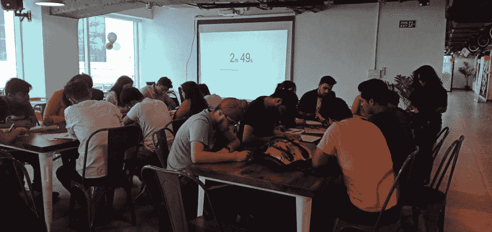
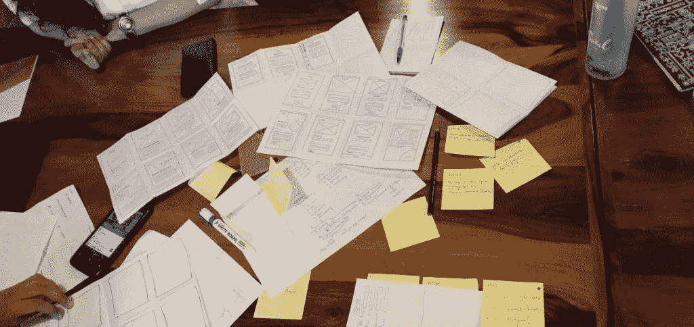

# 设计冲刺的一天

> 原文：<https://hackr.io/blog/day-with-design-sprint>

识别问题，获得解决方案-在一天内完成定义、设计、原型制作和测试。

一个阳光明媚的周日早晨，人们计划在家里偷懒，Hackr Bootcamp 是由 Hackr.io 发起的一项线下活动，考虑到设计思维在行业中日益增长的重要性，计划在 Gurugram 第 44 区 91springboard 进行一整天的谷歌设计冲刺。

是啊！！设计激发了许多爱好者和学习者在周末从舒适的环境中出来学习设计。

研讨会以安洁莉娜的演讲开始，他是新德里 IDF 的高级 UX 设计师 Gradeup & Community leader。她解释了设计思维的重要性以及 Google Design Sprint 的内容、原因和方式。

显而易见的问题是“所以设计冲刺就是设计思维！”对吗？好了，在这里我试着总结了整个研讨会，希望你觉得有用。

## **设计思维的区别&设计冲刺**

### **设计思维**

“设计思维是一种以人为本的创新方法，它从设计师的工具包中汲取灵感，整合人们的需求、技术的可能性和商业成功的要求。”IDEO 首席执行官蒂姆·布朗

设计思维是对哲学、思维、创新思维以及制造创造性产品的工具的学习。设计冲刺是一个逐步建立创新和创造性产品/商业模式的过程。

设计团队使用设计思维来解决关键的业务问题，或者我们也称之为邪恶的问题。这一过程是在牢记用户行为及其对产品或服务使用的观点的情况下进行的，它让我们能够实际地思考，找到可用、有用和可获得的解决方案。

想了解更多关于设计思维的内容，必读:[什么是设计思维？](https://www.interaction-design.org/literature/topics/design-thinking)

### **设计冲刺**

Design Sprint 是一个为期五天的解决关键业务问题的过程，现在已经被许多公司采用，因为它给团队提供了一条学习的捷径，而无需构建和推出产品。Google Design Sprint 由 Google Ventures 的 Jake Knapp 介绍。这种方法将您的团队聚集在一起，将持续数月的无休止的辩论缩短到一周，帮助提出简单的解决方案来应对复杂的 UX 和业务挑战。它节省时间，有助于快速做出关键决策，并促进有效协作。它允许你执行一个想法，而不用承担昂贵的承诺，并在一周内获得一个现实的原型。从而帮助企业节省无用的开发时间。

在其中一张幻灯片中，她解释说，要为设计冲刺建立一个团队，团队应该包括来自每个部门的一个人——CEO(决策者)、市场营销、财务、开发人员、客户、设计以及一名主持人或主持人。

此外，应该有一个合适的地方来进行这样的设计冲刺，正如 Jake Knapp 在他的一篇文章中提到的，应该有一个专门的空间，有作战室的墙壁，因为这有助于更好地工作。墙为共享笔记提供了一个画布，并作为正在进行的工作的长期存储。

我们试图在一个充满活力和自然光的房间里进行设计冲刺。团队使用一个巨大的桌子来进行他们的冲刺过程，粘贴便笺，并创建原型。

*点击此处了解杰克本人的更多信息:[你的设计团队需要一个作战室。下面是如何设置一个](https://www.fastcompany.com/3028471/google-ventures-your-design-team-needs-a-war-room-heres-how-to-set-one-up)*

在此基础上，所有与会者被分为两个小组，每个小组都有一个不同的问题陈述，以进行迷你设计冲刺。安吉尔要求团队在两个问题定义之间做出选择

1.  宠物收养系统
2.  在附近找到一个爱好中心

## 谷歌设计冲刺:研讨会见解

整个过程分为五个步骤

1.  地图
2.  素描
3.  决定
4.  原型
5.  试验

**第一步** :-

**规划**:在规划阶段，团队必须根据以下问题找到解决方案

*   我们为什么要做这个项目？
*   下个月我们想去哪里？
*   可能的失败是什么？等等

接下来是-

1.**目标设定**:目标需要设定为长期愿景，比如未来 10 到 15 年的产品或服务。就像领养宠物一样，长期的目标是没有宠物应该没有家和照顾，没有宠物爱好者应该发现寻找宠物有任何困难。

2.  **目标受众/用户角色**:定义用户，谁将使用产品，什么样的人将使用它？
3.  **“我们可以怎样做”问题:**在这种情况下，每个团队的所有成员都必须框定“我们可以怎样做...:“不要太宽泛或太狭窄的问题，比如在同一个宠物收养案例中，HMW 的问题可以是“我们如何收养宠物”或“我们如何找到收养者？”
    
4.  **用户旅程:**在这里，我们从头到尾绘制了一个可能用户的用户旅程图。例如，如果我们考虑基于上述问题之一“HMW-领养宠物”来创建用户旅程，我们需要绘制用户从如何使用应用程序找到庇护所开始的旅程，他将看到什么屏幕，他将点击哪里，他将使用什么方法到达正确的宠物庇护所等

我们将根据一个特定的“HMW”问题来安排所有可能的用户旅程。

**建议课程**

**[设计冲刺:5 天打造一个伟大的产品原型！](https://click.linksynergy.com/deeplink?id=jU79Zysihs4&mid=39197&murl=https%3A%2F%2Fwww.udemy.com%2Fcourse%2Fdesign-sprint-spm%2F)**

**第二步:素描/涂鸦**

画草图是我最喜欢的步骤，我们应该根据我们之前定义的用户旅程为 web 应用程序画出可能的屏幕。每个人都必须按照强调批判性思维而非创造性技能的四步流程进行素描。

四步草图流程:

1.  笔记-收集所有要点、信息或灵感
2.  想法-头脑风暴和涂鸦草图
3.  疯狂的 8-为每个屏幕尝试 8 种不同的可能性
4.  解决方案草图——最后，画出所有变化的最终纸线框图。

**第三步:决定(30 分钟)——让我们投票**

团队内部必须投票选出每个成员草拟的最佳解决方案，他们需要从中选出最佳方案。

决定一个最佳解决方案，为最终原型制作做好准备

**第四步:原型(30 分钟)**

原型制作是通过清理所有草图、线框和创建最终原型来完成的。这通常由团队中的设计师来完成，因为所有的原型都应该看起来干净、易读、易懂。

**第五步:陈述&讨论(1 小时)**

当天结束时，两个团队都用线框向每个人展示了他们的解决方案。看到人们在如此短的时间内提出如此复杂的解决方案，真是令人惊讶。最棒的部分是每个人都互相交流，我们一起度过了一段美好的学习时光。希望这次研讨会的收获能帮助每个人在自己的工作场所进行类似的设计冲刺。

希望你对此感兴趣。如果您愿意参加 Hackr Bootcamp 研讨会，请在以下网站获取关于下一次研讨会的更新信息-

我们不能用创造问题时所用的同一种思维来解决问题。-爱因斯坦