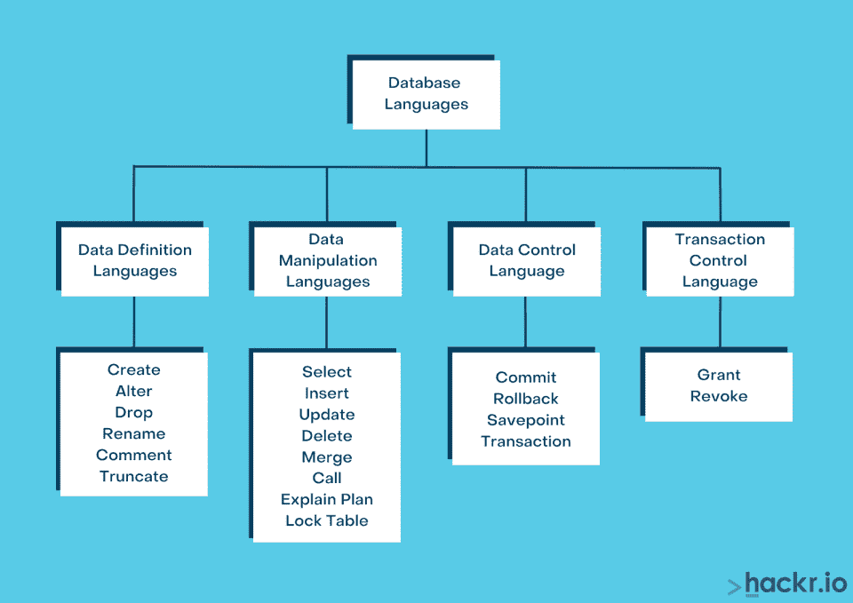
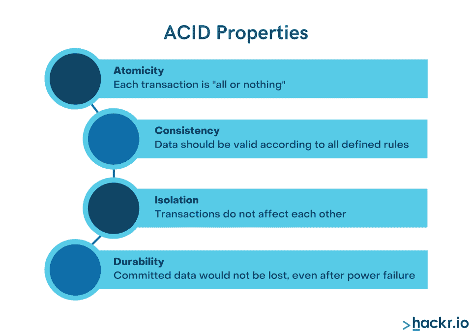
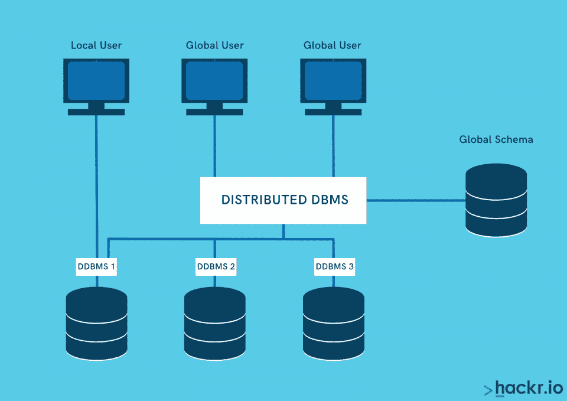

# 2023 年顶级 DBMS 面试问答

> 原文：<https://hackr.io/blog/dbms-interview-questions>

一个数据库是任何 [IT 系统](https://itdashboard.gov/) 的支柱。作为数据库开发人员，如果你想获得高薪职位，你必须在下一次工作面试中证明你在 DBMS(数据库管理系统)领域的专长和知识，并充分回答 DBMS 面试问题。

面试官可能会问你一系列数据库面试问题，包括 DBMS 基本面试问题、 DBMS viva 问题、a nd DBMS 技术问题。为了更好地准备面试中的 DBMS 问题，你应该复习例子和练习。你也可以考虑探索一下 [SQL 教程](https://hackr.io/tutorials/learn-sql?ref=blog-post) 和[SQL 面试问题](https://hackr.io/blog/top-sql-interview-questions) ，因为 SQL 是 DBMS 中一个集成的重要特性。

这里列出了 50 多个 DBMS 面试问题和答案，可以帮助你顺利找到下一份工作。

## **DBMS 面试问答**

### **1。定义一个 DBMS(数据库管理系统)。它是用来做什么的？**

**答:** DBMS 是帮助你建立和维护逻辑相关数据的软件应用。以下是使用数据库管理系统的一些优点:

*   限制数据冗余
*   限制未授权访问
*   实施完整性约束。
*   更多数据可用性、共享、保护和存储

### **2。什么是数据库？**

**回答:** 数据库是以电子方式存储的有序数据的集合。因为它是经过组织和存储的，所以您可以轻松地访问、聚集和管理它。我们使用 DBMS 来管理和监控数据库。

### **3。如何定义 DBMS 检查点？**

**答案:**DBMS 检查点是 DBMS 中所有事务提交之前的一个点，数据库处于一致状态。这是一个备份点，所有脏页(内存中修改的页)和旧的事务日志都从系统中清除，以释放内存空间。然后，旧数据将永久存储在存储磁盘上。例如，可以添加如下手动检查点:

检查点 10

其中 10 是以秒为单位的持续时间。

[了解更多关于 DBMS 检查点的信息。](https://docs.microsoft.com/en-us/sql/relational-databases/logs/database-checkpoints-sql-server?view=sql-server-ver15)

### **4。解释不同的数据库语言类型。**

**答案:** 数据库语言有四种:

*   **DDL(数据定义语言)用于定义数据库的结构或骨架，例如，创建模式、表、索引、约束等。创建了一些 DDL 语句:alter、drop、rename、truncate、comment。**
***   **DCL(数据控制语言)** 用于检索保存的数据。权限和访问控制属于 DCL，使用 grant 和 revoke 命令来完成。*   **DML(数据操作语言)** 用于访问和操作数据。一些 DML 语句是 select、insert、delete、update、lock table、explain plan 等。基本上，DML 语句处理用户请求。*   **TCL(事务控制语言)** 用于保存或回滚 DML 所做的更改。用于 TCL 的命令是提交和回滚。**

 **

### **5。文件处理系统的缺点是什么？**

**答案:** 文件处理系统有几个缺点:

*   数据冗余和不一致
*   低效的数据访问
*   以不同格式存储的数据难以共享
*   并发访问的问题

### **6。什么是 DBMS 数据抽象？**

**答案:** 数据抽象是对用户隐藏不相关的信息，以利于更顺畅的交互。有三个抽象层次:

*   **物理层:** 最低的抽象层，告诉数据如何在内存中物理存储。可以通过顺序或随机访问来访问数据。使用 B+树和散列方法来组织文件。
*   **逻辑层:** 以表格形式存储信息的层。各种实体之间的关系也存储为简单的结构。
*   **视图级别** :最顶层的抽象程度。用户只能以行和列的形式查看实际数据库的一部分。同一个数据库可以有多个视图。对用户隐藏了存储和实现细节。

### **7。什么是函数依赖？**

**答案:** 函数依赖表达了表的非键属性和主键之间的关系。有两种类型的函数依赖——平凡的和非平凡的。关系可以描述为 A - > B，其中 A 是行列式，B 是因变量列。

### **8。什么是反规格化？**

**回答:** 反规范化是一种数据库优化技术，其中冗余数据被添加到一个或多个表中以避免连接。这使得数据检索更快、更有效。

### **9。解释外延和内涵的区别。**

**答案:** 意图是在数据库设计阶段指定的常量值，即数据库或模式的描述，不太可能频繁改变。扩展是特定时间的实际数据，也称为数据库快照。它可能会经常改变。

### 10。什么是系统 R？

**答:** System R 是一个数据库管理系统，它为用户提供了高度的数据独立性和数据库抽象。它具有数据控制特性，如触发事务、授权、完整性断言和数据一致性规定。

### **11。BCNF、1NF、2NF 和 3NF 的标准形式是什么？**

**答:** 以上都是数据的正常形式，即以避免数据冗余和插入、删除&更新异常的方式组织数据。

*   **1NF** :又称第一范式。该规则规定表中的一列只能保存一个原子(单个)值。
*   **2NF:** 第二范式的简称。要应用 2NF 的规则，一个表应该是 1NF。该规则规定，任何非主属性(即不属于任何候选关键字的属性)都不应该依赖于表的候选关键字的真子集。
*   **3NF:** 第三范式，表应该已经在 2NF 了。该规则规定，应该移除超级键上的“非主要”特征的任何传递依赖性(功能性的)。
*   **BCNF:**

### **12。什么是酸性？**

**答案:** 酸属性是针对交易:

*   **A = >原子性** :整个事务一次性完成。
*   **C = >一致性:** 数据库在交易前后必须一致。
*   **I = >** **隔离:** 事务互不干扰；多个事务可以同时发生。
*   **D = >耐久性:** 即使发生系统故障，也能反映交易成功。

### 13。解释删除命令和截断命令之间的区别。

**答案:**

| **删除** | **截断** |
| DML 类型 | DDL 类型 |
| 支持何处条件 | 不支持 WHERE 条件 |
| 可以获取一个行锁 | 锁定整个表格和页面 |
| 执行速度较慢 | 它比删除要快 |
| 每行都有一个日志 | 指示页面解除分配的单个日志 |
| 例:从 emp_id = 2012 的员工中删除； | 示例:截断表 employee_temp |

### **14。解释两层架构。**

**答:** 在 DBMS 中，两层架构是一种数据库架构，其中用户界面( [UI](https://hackr.io/tutorials/learn-user-interface-design) )或视图层(也称为表示层)运行在客户机(台式机、笔记本电脑、平板电脑、电话等)上。)并且数据存储在服务器上。为了调用数据库，客户端使用 ODBC 连接[API](https://hackr.io/blog/what-is-api-testing)。这种架构增强了数据库的安全性，因为客户端不能直接访问数据库。

### 15。有哪些不同类型的数据库键？

**答案:**DBMS 键有几种类型:

*   **主键:** 标识表中特定行的一列或一组列
*   **超级键:** 标识表格行的单个键或多个键的集合
*   **候选关键字:** 唯一标识表中元组的一组属性。本质上是一个没有重复属性的超级键
*   **替换键:** 表格中的一列或多列，共同唯一标识表格中的每一列
*   **外键:** 定义两个表之间关系的公共列。保持数据完整性
*   **复合键:** 由另外两个唯一标识记录的属性组成，即使列本身不是唯一的
*   **组合键:** 具有两个或两个以上属性的主键，如{customer_id + mobile_number}
*   **代理键:** 当表没有自然可用的主键时创建。为表中的一行提供唯一标识

### **17。数据库管理系统中规范化的目的是什么？**

**答案:** 规范化是从一组关系中去除冗余的重要过程。它可以通过将巨大的表分成较小的表并使用键来链接它们，来减少插入、删除和更新命令中的不规则性。

### 18。实体、实体类型和实体集有何不同？

**答案:**

*   **实体:** 具有独立的物理存在并能与其他对象相区别的对象:例如，员工、学生、课程、工作等。
*   **实体类型:** 相似实体的集合。
*   **实体集:** 一种类型的实体在任意时间点的组合

### **19。就 SQL 而言，什么是子句？**

**答案:** 子句是 SQL 中的可选语句，定义呈现数据的条件。例如，

**选择** * **从** 员工 **其中**EMP _ id =2012；

这里，WHERE 是标识要获取的行的子句。SQL 中的其他一些子句有 GROUP BY、HAVING 和 ORDER BY。

### 20。聚集和原子性有什么区别？

**答案:** 原子性是指所有的动作立刻进行，或者都不进行。这意味着，如果事务未完成或在此期间失败，一切都将回滚到以前的稳定状态。相反，我们使用聚合来表达不同实体之间的关系。

### **21。解释数据库管理系统中不同类型的关系。**

**答案:**DBMS 中有三种类型的关系:

*   **一对一:** 每个表记录只与另一个表中的一条记录相关。例如: **员工标识，唯一社会保险标识**
*   **一对多或反过来(多对一)** :一个表中的一条记录可以与另一个表中的多条记录相关联。例如: **员工 id 和电话号码**
*   **多对多:** 第一个表中的一条记录可以与第二个表中的多条记录相关，反之亦然。例如:客户标识和产品标识。

**答:** 相关子查询是对其主语句处理的每一行执行一次的子查询。例如:

**select** student_id，student_name，marks**from**students**outer****where**salary>(**select****avg**(marks)**from**student**where**

### **23。两层和三层架构有什么区别？**

**答:** 两层架构遵循客户端-服务器架构，客户端和服务器之间有直接的通信链接。由于没有中间层，两层体系结构提供了高性能。客户端可以是任何设备，如移动设备、台式机或笔记本电脑，而所有数据都存储在数据库中。

三层架构包括以下内容:

*   **表示层:** 网页浏览器、java 小程序、WAP 手机等。
*   **业务层:** 数据验证、插入、计算等业务逻辑。
*   **数据访问层:** 这是一个类似于数据库、大型机系统或 ERP 系统的数据源。业务层充当中间层，将业务逻辑与表示层和数据层分离开来，以获得更好的可重用性、数据完整性、可伸缩性和性能。

*   ### **触发器和存储过程有什么区别？**

**答:** 用户可以显式调用 存储过程。像任何其他程序一样，存储过程可以接受某些输入参数并返回输出值。当特定事件发生时，触发器被自发地(自己)调用。触发器不能接受任何输入值，也不能返回任何输出值。

### **24。散列连接、合并连接和嵌套循环之间有什么区别？**

**答案:**

*   **Hash-join:** 在这种类型的连接中，数据库对主表进行全面扫描，构建一个 RAM 哈希表，然后在另一个表中搜索匹配的表。散列连接比嵌套循环连接更快，但是消耗更多的 RAM 资源。
*   **合并连接:** 这种连接使用简单的连接和排序(去除重复)，是所有连接中最有效的技术。
*   **嵌套循环连接:** 在这种类型的扫描中，驱动表(main)通过索引范围扫描来访问行，驱动表的结果集使用索引扫描方法与另一个(secondary)表的探针嵌套。

### **25。区分主动更新、追溯更新和同步更新。**

**答案:**

*   主动 更新是那些在现实世界中变得有用之前在数据库中出现的更新。
*   追溯性 更新发生在它们在现实世界中生效之后。
*   **同步** 更新在现实世界中生效的同时发生。

### **26。解释聚集索引和非聚集索引之间的区别。**

**答案:**

| **聚集索引** | **非聚集索引** |
| 定义物理数据存储的顺序，即使它们是以随机顺序插入的。 | 不对物理数据进行排序。索引存储在与实际数据不同的位置。 |
| 每个表只有一个聚集索引，因为数据只能以一种方式排序。 | 一个表中可以有多个非聚集索引。 |
| 在许多数据库中，主键约束在同一列上创建聚集索引。 | 非聚集索引可以创建为:在学生上创建非聚集索引 IX _ TBL student _ deptt(deptt ASC) |
| 示例:如果表 student 有一个主键 student_id，数据将按 student_id 的升序存储，如 1，2，3，4。将在 student_id 上自动创建聚集索引。 | 索引与其地址(对行的引用)、部门行地址 ECE <地址> 一起存储在一个单独的表中 |
| 这些索引不需要额外的空间。 | 消耗存储空间。 |

### **27。专门化和一般化的区别是什么？**

**答案:**

**一般化**

| **专业化** | 从不同的实体集创建分组 |
| 在实体集内创建子分组 | 从几个实体集开始，创建一个具有一些共同特征的高级实体 |
| 从单个实体集开始，然后使用不同的功能创建不同的实体集 | 应用于一组实体 |
| 应用于单个实体 | 遵循自下而上的方法 |
| 遵循自上而下的方法 | **28。解释网络和层次数据库模型之间的区别。** |

### **答案:** 在层次数据库模型中，数据被组织成树状结构中的节点。一个节点只连接到它上面的一个父节点。因此，该模型中的数据具有一对多的关系。这种模型的一个例子是 web 浏览器中经常使用的文档对象模型(DOM)。

网络数据库模型是分层模型的细化版本。这里，数据也是以树状结构组织的。但是，一个子节点可以连接到多个父节点。这导致了数据节点之间的多对多关系。(综合数据库管理系统)、综合数据存储(IDS)都是网络数据库的例子。

**层次模型**

| **网络模型** | 记录间的父子关系 |
| 指针或链接关系 | 更新和删除操作容易出现数据不一致 |
| 无数据不一致 | 不支持多对多关系 |
| 支持多对多关系 | 创建一个树形结构，数据遍历有点复杂 |
| 创建易于数据遍历的图形结构，因为节点可以双向访问，即父子关系，反之亦然 | **29。什么是死锁？** |

### **答案:** 死锁发生在一组进程被阻塞的时候。在死锁中，每个进程都会占用另一个进程所需的资源。另一个进程等待同一个或另一个进程释放资源。

三十岁。什么是 RDBMS？

### **答:** 关系数据库管理系统(RDBMS)是一个允许你创建、更新和管理关系数据库的应用程序。RDBMS 被组织成表、记录和列，并且数据库表具有明确定义的关系。桌子交流和分享信息。它支持数据搜索、数据组织和报告。RDBMS 是 DBMS 的子集。

31。什么是面向对象的数据库模型？

### **答案:** 在面向对象的数据库模型中，数据是用对象来表示的。例如，关系数据库中的多媒体文件或记录被存储为数据对象，而不是字母数字值。

32。什么是 SQL？

### **答案:** SQL (结构化查询语言)是一种用于与数据库中存储的数据进行通信的编程语言。SQL 语言相对容易编写、阅读和解释。

33。SQL 中的 DDL、DML、DCL 语句是什么？

### **答案:**

**DDL:** 数据定义语言用于通过使用一组 SQL 查询(如创建、更改、截断、删除和重命名)来定义数据库和模式结构。

*   **DCL:** 数据控制语言通过使用 SQL 查询中的一组命令，如 GRANT 和 REVOKE，来控制用户对数据库的访问。
*   **DML:** 数据操作语言用于通过使用 SQL 查询如选择、插入、删除和更新来维护数据。
*   了解更多关于 [SQL 命令](https://hackr.io/blog/sql-commands) 。

34。什么是索引搜索？

### **答案:** A [数据库索引](http://en.wikipedia.org/wiki/Database_index) 是一种提高数据库上数据检索操作速度的数据结构。索引搜索是增加索引集合的过程，通过使用查询优化和查询分布等方法来完成。

35。什么是分布式数据库？

### **回答:** 分布式数据库是多个相互连接的数据库的集合，这些数据库在物理上分布在不同的位置。数据库可以在同一个网络上，也可以在多个网络上。分布式数据库管理系统在逻辑上集成了数据，因此对用户来说它就像一个数据库。

35。什么是数据库分区，为什么它很重要？

### **答案:** 数据库分区是将一个逻辑数据库分成截然不同的独立部分的过程。像表、索引这样的数据库对象在粒度级别上被细分、管理和访问。

分区是一项强大的功能，可以在降低成本的同时提高性能。它提高了数据的可管理性和可用性。

36。什么是静态 SQL？

### **答:** 在静态 SQL 中，SQL 语句是嵌入或硬编码在应用程序中的，它们在运行时不会改变。数据访问的过程是预先确定的，因此更加迅速和有效。SQL 语句在编译时编译

37。什么是动态 SQL？

### **答:** 在动态 SQL 中，SQL 语句是在运行时构造的，在这里应用程序可以允许用户创建查询。基本上，您可以在运行时构建查询。因为查询是在运行时编译的，所以它比静态 SQL 相对较慢。

38。定义数据仓库。

### **答案:** 数据仓库是一种从一个或多个来源聚集大量数据的技术。数据分析是对数据进行分析，以便为组织制定战略性业务决策。

39。说出一个开源 RDBMS。

### **答案:** MySQL 是一个开源的关系数据库管理系统，将数据存储在表中，并维护数据之间的关系。它使用最强大的查询语言 SQL 进行数据库访问，并具有非常强大的语法来创建简单和复杂的数据检索和结构查询。MySQL 中的数据是有组织的，符合一定的格式，是当今最流行的结构化数据库。它的“免费”源代码可供研究、修改和分发。

40。什么是 MongoDB？

### **答案:** MongoDB 是一个非关系型非结构化开源数据库。这个面向文档的数据库将您的数据存储在由单个文档组成的集合中。在 MongoDB 中，文档是一个大的 JSON 对象，没有特定的格式或模式。MongoDB 以名为 BSON 的二进制编码格式表示 JSON 文档。

阅读 MongoDB vs MySQL 的 [区别。](https://hackr.io/blog/mongodb-vs-mysql)

41。什么是 BI(商业智能)？

### **回答:** 商业智能(BI)是一种技术驱动的流程，用于分析数据和呈现信息，以帮助高管、经理和其他公司最终用户做出商业决策。有许多可用的工具，如 SAP Business Intelligence、MicroStrategy、Sisense 等等。这些工具是用户友好的，帮助您从各种来源收集数据进行分析。

**42。数据库管理员在数据库管理系统中的作用是什么？**

### **回答:** 数据库管理员(DBA)在 DBMS 中起着一些重要的作用:

安装和配置数据库

*   性能监控
*   安全规划和实施
*   数据备份和恢复
*   故障排除
*   数据迁移
*   **43。DBMS 中的 ER 图是什么？**

### **答案:** 实体关系模型或实体关系图是用实体表示的数据的可视化表示。在实体之间设置属性和关系。

**44。什么是 ER 图中的实体？**

### **答:** 实体可以是可识别的、真实世界的物体。例如，在图书馆数据库中，书籍、出版商和成员可以被视为实体。所有这些实体都有一些赋予它们身份的属性或特性。在 ER 模型中，实体是相互关联的。

**45。什么是数据挖掘？**

### **答案:** 数据挖掘是对大量数据进行整理，找出模式和趋势的过程。它使用复杂的数学和统计算法来分割数据，以预测可能的结果。有许多数据挖掘工具，如 RapidMiner、Orange、Weka 等等。

**46。什么是查询优化？**

### **答:** 查询优化是数据库性能的一个重要特性。查询优化可以确定一个执行计划，该计划具有评估和执行查询所需的最小估计成本和时间。

**47。什么是目录？**

### **答:** 目录是一个表格，包含像每个文件的结构、每个数据项的类型和存储格式以及对数据的各种约束等信息。存储在目录中的信息称为元数据。

**48。数据库设计中有多少种关系？**

### **答案:** 数据库设计中有三大关系模型:

**一对一:** 表(A)中的一行只与另一个表(B)中的一行相关。

**一对多:** 表(A)中的一行链接到另一个表(B)中的多行。但是表(B)中的一行只链接到表(A)中的一行。

**多对多:** 表(A)中的一行链接到表(B)中的多行，反之亦然。

49。所有数据库管理系统中常见的基本操作是什么？

### **答案:** 增加、删除、修改是所有 DBMS 共有的最重要的原语操作。

50。什么是数据库上下文中的基数？

### **答案:** 在 SQL 中，基数一词是指数据库表的特定列(属性)中包含的数据值的唯一性。基数越低，列中的重复值就越多。

51。什么是 SQL SERVER？

### **答案:** SQL Server 是微软开发的一种 RDBMS。这是一个非常稳定和受欢迎的服务器。SQL Server 的最新版本是 SQL Server 2017。

**52。我们什么时候应该使用索引？**

### **答:** 我们可以使用索引来强制惟一性，便于排序，并支持按列值进行快速检索。在 WHERE 子句中，经常使用的列是与适当条件一起使用的索引的良好候选。

53。什么是数据库中的散列技术？

### **答案:** 哈希是将一串字符转换成通常更短的固定 **-** 长度值或代表原字符串的键。哈希用于索引和检索数据库中的项目，因为使用较短的哈希键查找项目比使用原始值查找项目更快。

54。描述并发控制。

### **答:** 并发控制是管理数据库上同时进行的操作的过程，以使数据库完整性不受损害。并发控制有两种方法。

**锁定:** 使用锁控制对数据项的访问

**版本控制:** 使用多版本并发控制

**DBMS 面试最后笔记**

## 上面列出了大量 DBMS 面试问题供你在面试前练习！在你筛选和准备的时候，考虑一下这些数据库管理系统最后的笔记:

面试前好好休息一晚。

*   通过阅读进行视觉学习，或者通过大声朗读问题和答案进行听觉学习——无论哪种方式最适合你的学习方式！
*   至少提前一周开始练习。
*   请朋友帮忙角色扮演 DBMS 面试问题。
*   **结论**

## 数据库管理系统上的 面试问题列表到此结束。 如果您很快参加了 DBMS 面试，请告诉我们您是否被问到了此列表中的任何 DBMS 面试问题。如果我们错过了面试中的任何 DBMS 问题，我们很想知道，它们是针对新生的 DBMS 面试问题，DBMS 技术问题，还是任何其他数据库管理系统面试问题。

你想扩展你的数据库管理系统知识吗？查看本课程

**数据库管理系统简介**

**人也在读:**

**People are also reading:****