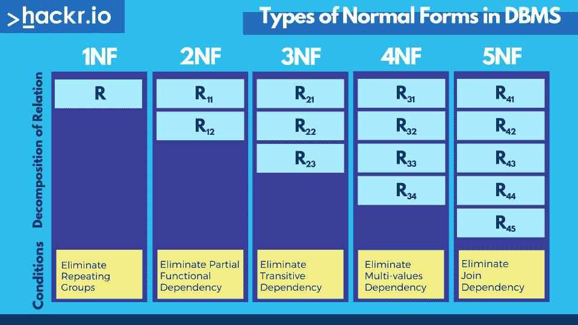

# DBMS 中的规范化:1NF、2NF、3NF 和 BCNF[示例]

> 原文：<https://hackr.io/blog/dbms-normalization>

当开发关系数据库的模式时，要考虑的最重要的方面之一是确保数据的重复最小化。我们通过执行数据库规范化来做到这一点，这是数据库模式设计过程的一个重要部分。

这里，我们解释 DBMS 中的规范化，解释 1NF、2NF、3NF 和 BCNF，并附有解释。首先，让我们看看什么是规范化，为什么它很重要。

## **什么是数据库管理系统中的规范化？**

数据库规范化是一种帮助以最佳方式设计数据库模式的技术。数据库规范化的核心思想是将表分成更小的子表，并存储指向数据的指针，而不是复制数据。

### **我们为什么要进行数据库规范化？**

****

使用数据库规范化有两个主要原因。首先，它有助于减少存储数据所需的存储量。其次，它防止了由于相同数据的多个副本的存在而可能出现的数据冲突。

如果一个数据库没有被规范化，那么它会导致效率更低，通常更慢的系统，甚至可能导致不准确的数据。这也可能会导致磁盘 I/O 使用率过高和性能下降。

## **什么是钥匙？**

你也应该知道什么是键。键是帮助识别表中某一行的属性。有七种不同的类型，您将会在各种标准化的解释中看到它们的使用:

*   候选关键字
*   主关键字
*   外键
*   超级键
*   备用关键字
*   复合键
*   唯一键

## **数据库规范化示例**

为了理解示例表的(DBMS)规范化，让我们假设我们正在存储一所大学的课程和教师的详细信息。下面是一个示例数据库的样子:

| **课程代码** | **课程地点** | **讲师姓名** | **讲师的电话号码** |
| CS101 | 20 号报告厅 | 乔治教授 | +1 6514821924 |
| CS152 | 21 号演讲厅 | 阿特金斯教授 | +1 6519272918 |
| CS154 | 政务司司长礼堂 | 乔治教授 | +1 6514821924 |

在这里，数据基本上存储了课程代码、课程地点、讲师姓名和讲师电话号码。乍一看，这个设计似乎不错。然而，一旦我们需要修改信息，问题就开始出现了。例如，假设，如果乔治教授改变了他的手机号码。在这种情况下，我们必须在两个地方进行编辑。

如果有人刚针对 CS101 编辑了手机号，却忘了针对 CS154 编辑呢？这将导致数据库中的信息陈旧/错误。这个问题可以通过将我们的表分成两个更简单的表来轻松解决:

**表 1(讲师):**

*   讲师 ID
*   讲师姓名
*   教师手机号码

**表 2(课程):**

*   课程代码
*   课程地点
*   讲师 ID

现在，我们的数据将如下所示:

**表 1(讲师):**

| **教师 ID** | **教师姓名** | **教师编号** |
| 一 | 乔治教授 | +1 6514821924 |
| 2 | 阿特金斯教授 | +1 6519272918 |

**表 2(课程):**

| **课程代码** | **课程地点** | **讲师 ID** |
| CS101 | 20 号报告厅 | 一 |
| CS152 | 21 号演讲厅 | 2 |
| CS154 | 政务司司长礼堂 | 一 |

基本上，我们单独存储教师，在课程表中，我们不存储教师的全部数据。相反，我们存储教师的 ID。现在，如果有人想知道教练的手机号码，他们可以简单地查找教练表。此外，如果我们要更改乔治教授的手机号码，可以在一个地方完成。这避免了陈旧/错误的数据问题。

此外，如果你观察，手机号码现在不需要存储 2 次。我们把它存放在一个地方。这也节省了存储空间。这在上面的简单例子中可能并不明显。然而，请考虑这样一种情况，当有数百个课程和教师时，对于每个教师，我们不仅要存储手机号码，还要存储其他详细信息，如办公室地址、电子邮件地址、专业、可用性等。在这种情况下，复制如此多的数据会不必要地增加存储需求。

**建议课程**

[数据库管理系统& SQL:完成打包 2023](https://click.linksynergy.com/deeplink?id=jU79Zysihs4&mid=39197&murl=https%3A%2F%2Fwww.udemy.com%2Fcourse%2Frelational-database-management-systemrdbms-complete-pack%2F)

## **数据库管理系统规范化的类型**

DBMS 中有各种范式。每个范式都有一个重要性，它有助于优化数据库以节省存储和减少冗余。我们用下面的例子解释 DBMS 中的规范化。

### **第一范式(1NF)**

第一种范式简单地说，表格的每个单元格应该只包含一个值。假设我们正在存储某个特定讲师所学的课程，我们可以这样存储:

| **教师姓名** | **课程代码** |
| 乔治教授 | (CS101、CS154) |
| 阿特金斯教授 | (CS152) |

这里的问题是，在第一行中，我们存储了针对 George 教授的两门课程。这不是最佳的方式，因为这就是现在设计的 SQL 数据库的使用方式。更好的方法是将课程分开存储。例如:

| **教师姓名** | **课程代码** |
| 乔治教授 | CS101 |
| 乔治教授 | CS154 |
| 阿特金斯教授 | CS152 |

这样，如果我们想要编辑一些与 CS101 相关的信息，我们就不必接触与 CS154 相对应的数据。另外，注意每一行都存储唯一的信息。没有重复。这是第一范式。

1NF 中的数据冗余更高，因为在多行中有多个相同的列。1NF 更注重消除重复组，而不是消除冗余。

### **第二范式(2NF)**

对于处于第二范式的表，必须满足以下两个条件:

1.  该表应为第一范式。
2.  表的主键应该只有一列。

第一点显然很简单，因为我们刚刚研究了 1NF。让我们理解第二点:1 列主键。主键是唯一标识一行的一组列。这里，没有两行具有相同的主键。

| **课程代码** | **课程地点** | **讲师姓名** | **讲师的电话号码** |
| CS101 | 20 号报告厅 | 乔治教授 | +1 6514821924 |
| CS152 | 21 号演讲厅 | 阿特金斯教授 | +1 6519272918 |
| CS154 | 政务司司长礼堂 | 乔治教授 | +1 6514821924 |

在这个表中，课程代码是唯一的，因此它成为我们的主键。让我们再举一个存储各种课程的学生注册的例子。每个学生可以注册多门课程。同样，每门课程可能有多个注册。示例表可能如下所示(学生姓名和课程代码):

| **学生姓名** | **课程代码** |
| 拉胡尔 | CS152 |
| 拉杰特 | CS101 |
| 拉胡尔 | CS154 |
| 拉曼 | CS101 |

这里，第一列是学生姓名，第二列是学生所学的课程。

显然，学生姓名列不是唯一的，因为我们可以看到在第 1 行和第 3 行中有 2 个条目对应于姓名“Rahul”。类似地，课程代码列不是唯一的，因为我们可以看到在第 2 行和第 4 行中有 2 个条目对应于课程代码 CS101。

但是，元组(学生姓名、课程代码)是唯一的，因为学生不能多次注册同一门课程。因此，这两列组合起来就形成了数据库的主键。

根据第二范式定义，我们上面的注册表不在第二范式中。为了达到同样的效果(1NF 至 2NF)，我们可以将其分为两个表:

**学生:**

| **学生姓名** | **报名人数** |
| 拉胡尔 | 一 |
| 拉杰特 | 2 |
| 拉曼 | 3 |

这里第二列是唯一的，它表示学生的注册号码。显然，注册号码是唯一的。现在，我们可以将这些注册号码与课程代码联系起来。

**课程:**

| **课程代码** | **报名人数** |
| CS101 | 2 |
| CS101 | 3 |
| CS152 | 一 |
| CS154 | 一 |

这两个表一起为我们提供了与原始表完全相同的信息。

### 第三范式(3NF)

在我们深入研究第三范式的细节之前，让我们了解一下表的函数依赖的概念。

如果更改 A 的值可能需要更改 B 的值，则称 A 列在功能上依赖于 B 列。例如，考虑下表:

| **课程代码** | **课程地点** | **教师姓名** | **部门** |
| MA214 | 18 号演讲厅 | 乔治教授 | 计算机科学系 |
| ME112 | 礼堂建筑 | 约翰教授 | 电子系 |

在这里，department 列依赖于 professor name 列。这是因为如果在一个特定的行中，我们改变了教授的名字，我们也必须改变 department 值。例如，假设 MA214 现在由恰好来自数学系的 Ronald 教授负责，则表格将如下所示:

| **课程代码** | **课程地点** | **教师姓名** | **部门** |
| MA214 | 18 号演讲厅 | 罗纳德教授 | 数学系 |
| ME112 | 礼堂建筑 | 约翰教授 | 电子系 |

在这里，当我们改变教授的名字时，我们也必须改变系栏。这是不希望的，因为更新数据库的人可能记得更改教授的姓名，但可能忘记更新部门值。这可能会导致数据库不一致。

第三范式通过将它分解成单独的表来避免这种情况:

| **课程代码** | **课程地点** | **教师 ID** |
| MA214 | 18 号演讲厅 | 一 |
| ME112 | 礼堂大楼， | 2 |

在这里，第三列是正在上课的教授的 ID。

| **教师 ID** | **教师姓名** | **部门** |
| 一 | 罗纳德教授 | 数学系 |
| 2 | 约翰教授 | 电子系 |

在上面的表格中，我们根据教授的 ID 存储了他/她的详细信息。这样，每当我们想在某个地方引用教授时，我们就不必再将教授的其他详细信息放在那个表中。我们可以简单地使用 ID。

因此，在第三范式中，需要以下条件:

*   该表应为第二范式。
*   不应该有任何功能依赖。

### 博伊斯-科德范式(BCNF)

Boyce-Codd 范式是第三范式的更强推广。当且仅当每个函数相关性 A → B 至少满足下列条件之一时，表才是 Boyce-Codd 范式:

*   a 是一个超级键
*   这是一个微不足道的函数依赖。

让我们先了解一下超级键是什么意思。要了解 DBMS 中的 BCNF，请考虑以下 BCNF 示例表:

| **课程代码** | **课程地点** | **讲师姓名** | **讲师的电话号码** |
| CS101 | 20 号报告厅 | 乔治教授 | +1 6514821924 |
| CS152 | 21 号演讲厅 | 阿特金斯教授 | +1 6519272918 |
| CS154 | 政务司司长礼堂 | 乔治教授 | +1 6514821924 |

这里，第一列(课程代码)在各行中是唯一的。所以，这是一个超级键。考虑列的组合(课程代码，教授姓名)。它在各行之间也是唯一的。所以，它也是一个超级键。超级键基本上是一组列，这组列的值在不同的行中是唯一的。也就是说，没有任何两行的这些列具有相同的一组值。上表中的一些超级键是:

*   课程代码
*   课程代码、教授姓名
*   课程代码，教授手机号码

大小(列数)最小的超键称为候选键。例如，上面的第一个超级键只有一列。第二个和最后一个有 2 列。所以，第一个超级键(课程代码)是一个候选键。

Boyce-Codd 范式说，如果有一个函数依赖 A → B，那么要么 A 是一个超键，要么它是一个平凡的函数依赖。平凡函数依赖意味着 B 的所有列都包含在 a 的列中。例如，(课程代码，教授姓名)→(课程代码)是平凡函数依赖，因为当我们知道课程代码和教授姓名的值时，我们确实知道课程代码的值，所以依赖变得平凡。

**让我们明白是怎么回事:**

A 是一个超级键:这意味着只有在一个超级键列上，才会存在对其他列的依赖。基本上，如果一组列(B)可以在已知另一组列(A)的情况下确定，那么 A 应该是一个超键。Superkey 基本上唯一地确定每一行。

**是平凡的函数依赖:**这意味着不应该有非平凡的依赖。例如，我们看到教授的系是如何依赖于教授的名字的。这可能会造成诚信问题，因为有人可能会编辑教授的名字，而不改变部门。这可能会导致数据库不一致。

另一个例子是，如果一家公司有员工在多个部门工作。相应的数据库可以分解成，其中函数依赖关系可以是诸如雇员 ID 和雇员部门这样的键。

### **第四范式**

如果没有两个或两个以上独立的多值数据描述相关实体，则称一个表为第四范式。

### **第五范式**

一个表是第五范式的，如果:

*   这是它的第四范式。
*   它不能被细分成任何更小的表而不丢失某种形式的信息。

## **规范化对数据库系统很重要**

DBMS 中的规范化对于设计数据库模式很有用，这样就不会有可能导致不一致的数据复制。在设计应用程序的模式时，我们应该总是考虑如何利用这些形式。

如果您想[了解更多关于 SQL](https://hackr.io/blog/how-to-learn-sql) 的知识，请查看我们关于[最佳 SQL 认证](https://hackr.io/blog/sql-certifications)的帖子。你也可以阅读 [SQL vs MySQL](https://hackr.io/blog/sql-vs-mysql) 来了解这两者是什么。要成为一名数据工程师，你需要学习标准化和更多，所以今天就开始吧。

## **常见问题解答**

#### **1。数据库规范化会减小数据库大小吗？**

是的，数据库规范化确实减小了数据库的大小。冗余数据被删除，因此数据库磁盘存储使用变得更小。

#### **2。哪种范式可以去除 DBMS 中的所有异常？**

5NF 将移除所有异常。然而，一般来说，大多数 3NF 表不会出现异常。

#### **3。数据库规范化可以减少表的数量吗？**

数据库规范化增加了表的数量。这是因为我们将表拆分成子表，以消除冗余数据。

#### **4。BCNF 和 3NF 有什么区别？**

BCNF 是 3NF 的延伸。主要区别在于它从关系中移除了传递依赖。

**人也在读:**