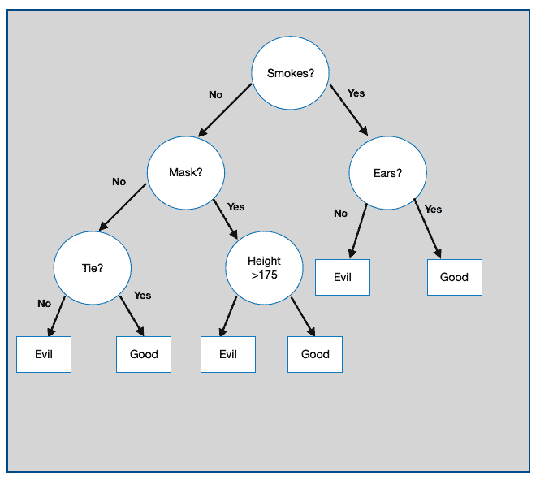
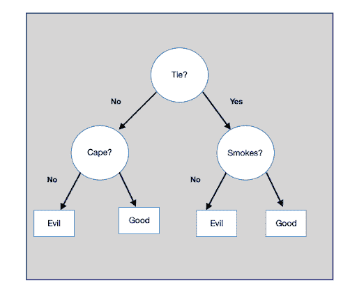
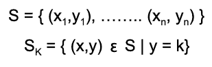
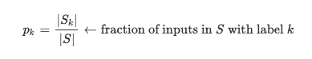
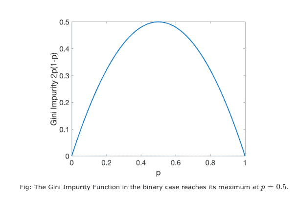

# 机器学习中的决策树

> 原文：<https://hackr.io/blog/decision-tree-in-machine-learning>

## 什么是决策树？

决策树采用树状结构，作为预测模型，来明确地表示决策和决策制定。决策树的每个内部节点都是一个特征，该节点的每个输出边都代表该特征可以取的值。

对于分类要素，输出边的数量是这些类别中不同值的数量。在数字特征的情况下，输出边的数量通常是两个，其中一个特征值小于实数值，另一个大于实数值。每个叶节点代表一个类标签。基于信息增益来选择每个节点处的特征，并且具有最大增益的特征更重要，并且在更高的级别(更靠近根节点)被选择。

## 构建决策树

我们将通过一个例子来学习如何建立一个决策树。

你的约会对象是好还是坏的精神病患者？

在这个例子中，一个数据集定义了超级英雄的属性，然后基于训练，模型评估你的约会对象是好还是坏的超级英雄。考虑下面的数据集。

| **超级英雄** | **屏蔽** | **海角** | **平局** | **耳朵** | **吸烟** | **高度** | **类** |
| **蝙蝠侠** | y | y | n | y | n | 180 | 好的 |
| **罗宾** | y | y | n | n | n | 176 | 好的 |
| 阿尔弗雷德 | n | n | y | n | n | 185 | 好的 |
| **企鹅** | n | n | y | n | y | 140 | 邪恶 |
| **猫女** | y | n | n | y | n | 170 | 邪恶 |
| **小丑** | n | n | n | n | n | 179 | 邪恶 |
| 蝙蝠女孩 | y | y | n | y | n | 165 | ？ |
| **谜语者** | y | n | n | n | n | 182 | ？ |
| 你的约会 | n | y | y | y | y | 181 | ？ |

涵盖所有方面和测试用例的一个可能的决策树是:



不建议构建和分割树并使其变得复杂，因为虽然它给出了 0%的测试误差，但它会导致过度拟合。所以，我们的目标是找到最小的树来得到训练好的数据集。

现在让我们看看构建高效决策树的伪代码。

伪代码如下:

### **过程**构建子树(训练实例集 D)

1.  1.  C
    2.  **如果**停止标准满足**，则**
    3.  制作叶节点 N

确定 N 的类别标签

1.  **否则**

### 制作内部节点 N

1.  S
    1.  对于 S 的每个结果 o
    2.  Do
    3.  N
    4.  返回以 N 为根的子树
    5.  所以接下来最小的树可能是:
    6.  

决策树不是一个有效的算法，但是，它们有明确的偏差-方差问题，变得容易解决这些问题。方差可通过装袋进行调整，偏差可通过助推进行调整。

熵

熵是与随机变量 y 相关的不确定性的度量。它是传达变量值所需的预期位数。

## 其中 P(y)是 Y 具有值 Y 的概率。关于决策树，熵用于寻找在任何节点的最佳特征分裂。

不同决策树算法使用的拆分规则

1.信息增益

## 信息增益是熵 H 的变化，当在特征上分裂时，从先前状态到新状态:

### 信息增益用于识别分割给定训练数据集的最佳特征。它选择最能减少训练数据集 d 的输出 Y 的条件熵的分裂 S

计算所有特征的信息增益，并选择具有最高增益的特征作为最重要的特征。

2.增益比

增益比将信息增益除以所考虑的分裂的熵进行归一化，从而避免信息增益的不合理偏好。

### 3.排列测试

有机数据的标记被置换，并且对于标记的所有可能置换，为重新标记的数据计算要测试的统计量。原始数据的测试统计值与通过所有排列获得的值进行比较，通过计算后者的百分比，后者至少与前者一样极端。

### **建议课程**

[完全机器学习&数据科学训练营 2023](https://click.linksynergy.com/deeplink?id=jU79Zysihs4&mid=39197&murl=https%3A%2F%2Fwww.udemy.com%2Fcourse%2Fcomplete-machine-learning-and-data-science-zero-to-mastery%2F)

4.多元分裂

多元决策树可以使用在每个内部节点包含多个属性的 split。

### 5.杂质函数和基尼指数

**杂质函数:**测量标签纯度的函数。

### **基尼杂质:**对于一组数据点 S，



用某个标签选择一个点的概率





**基尼指数:**这是一个衡量从数据集中随机选择的实例被错误标记的频率，如果它是根据子集中标签的分布随机标记的。

修剪

修剪是一种通过从最终分类器中移除子树来降低最终分类器复杂性的技术，子树的存在不会影响模型的准确性。在修剪中，你生长出完整的树，然后反复修剪掉一些节点，直到进一步修剪是有害的。这是通过评估修剪每个节点对调整(验证)数据集准确性的影响，并贪婪地删除最能提高数据准确性的节点来实现的。

## 可以通过对到达叶子的训练样本的数量施加最小值来修剪决策树。修剪使树保持简单，而不影响整体的准确性。它通过减小树的大小和复杂性来帮助解决过拟合问题。

密码

**输出:**

### 为什么要使用决策树？决策树的优势

```
def main(name):
for i in range(len(date_data)):
superhero_data = dict(zip(header,date_data[i]))
if superhero_data["Superhero"].lower()==name.lower():
break
return smoke(superhero_data)
def smoke(superhero_data):
"To check whether the Superhero Smoke or Not"
if superhero_data["Smoker"]=="y":
return ears(superhero_data)
else:
return mask(superhero_data)
def ears(superhero_data):
if superhero_data["Ears"]=="y":
return "Good"
else:
return "Evil"
def mask(superhero_data):
if superhero_data['Mask']=="y":
return height(superhero_data)
else:
return tie(superhero_data)
def height(superhero_data):
if superhero_data["Height"]>175:
return"Good"
else:
return "Evil"
def tie(superhero_data):
if superhero_data["Tie"]=="y":
return "Good"
else:
return "Evil"
if __name__=="__main__":
date_data = [ ["Batman","y","y","n","y","n",180],
["Robin","y","y","n","n","n",176],
["Alfred","n","n","y","n","n",185],
["Penguin","n","n","y","n","y",140],
["Catwomen","y","n","n","y","n",170],
["Joker","n","n","n","n","n",179],
["Batgirl","y","y","n","y","n",165],
["Riddler","y","n","n","n","n",182],
["Your Date","n","y","y","y","y",181],
]
header=["Superhero", "Mask", "Cape", "Tie", "Ears", "Smoker", "Height", "Class"]
print("-----Is your date a good or bad psychopath---- ")
for i in range(len(date_data)):
print(date_data[i][0],"is --->",end="")
print(main(date_data[i][0]))
```

当我们将决策树拟合到训练数据集时，拆分决策树的前几个节点基本上是数据集中最重要的特征，因此，您可以将其用作特征选择技术来选择数据集中最相关的特征。决策树对异常值也不敏感，因为分裂是基于分裂范围内样本的比例而不是绝对值发生的。

```
-----Is your date a good or bad psychopath----
Batman is --->Good
Robin is --->Good
Alfred is --->Good
Penguin is --->Evil
Catwoman is --->Evil
Joker is --->Evil
Batgirl is --->Evil
Riddler is --->Good
Your Date is --->Good
```

## 由于它们的树状结构，它们非常容易理解和解释。它们不需要对数据进行归一化，并且即使当特征彼此之间具有非线性关系时也能很好地工作。

使用决策树算法的缺点

即使是输入数据中的小变化，有时也会导致树中的大变化，因为它可能会极大地影响决策树用来选择特征的信息增益。

### 此外，决策树一次只检查一个字段，导致矩形分类框。这可能与决策空间中记录的实际分布不太一致。

1.  当涉及到应用回归和预测连续值时，决策树是不够的。一个连续变量在一个区间内可以有无限多的值，在一个只有有限数量的分支和叶子的树中，捕捉这些值是非常困难的。
2.  相同的子树在不同的路径上有可能重复，导致复杂的树。
3.  树中的每个特征都被迫与树中更高层的每个特征进行交互。如果有些特性没有交互或者交互很弱，那么这是非常低效的。
4.  结论
5.  决策树是一个 NP-hard 问题，即如果数据集变大，容纳额外数据所需的计算时间将呈指数增长。其目的是找到正确训练系统的最小的树。我们希望你理解这个机器学习的概念。你可能有兴趣在这里了解更多的机器学习算法。

## 你最喜欢的机器学习概念是什么？让我们在下面评论吧！

**人也在读:**

Which is your favourite machine learning concept? Let us in the comments below!

**People are also reading:**