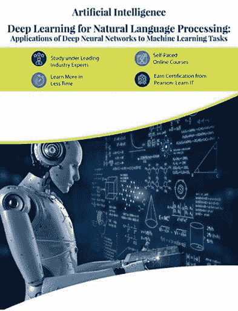
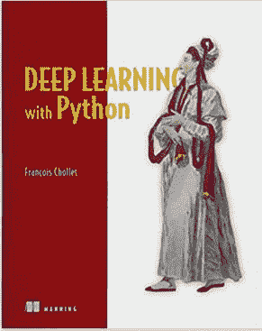
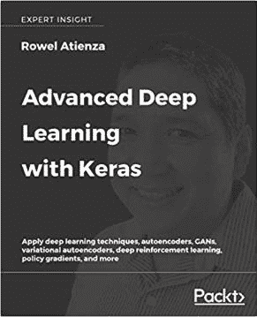
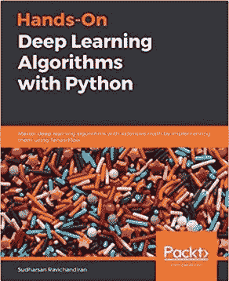
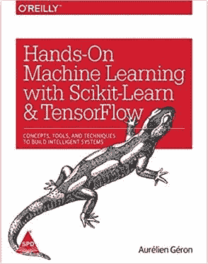
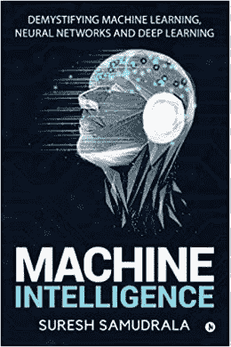
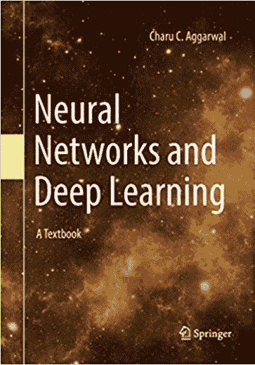
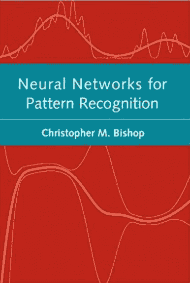

# 2023 年初学者和专家的 10 本最佳深度学习书籍

> 原文：<https://hackr.io/blog/deep-learning-books>

你在寻找深度学习资源吗？如果是，这里我们列出了最好的深度学习书籍。

## 什么是深度学习？

深度学习是人工智能的一个子集，它指导计算机直接从文本、图像或声音中执行分类任务。深度学习也是机器学习的一种专门形式。它是人工智能领域中最受欢迎的领域之一，允许您开发不同复杂性的多层模型。术语深度指的是网络中隐藏层的数量。为了获得最佳结果，深度学习需要大量数据和强大的计算能力。

深度学习的大多数方法是基于神经网络架构的；因此，它有时也被称为深度神经网络。深度学习在自动驾驶、图像识别、新闻聚合和欺诈检测、自然语言处理、虚拟助理、媒体和娱乐、医疗保健、安全、个性化服务等领域都有应用。

## 最佳深度学习书籍

如果你有机器学习的概念，理解深度学习是很容易的。对线性代数、微积分、概率、[编程语言](https://hackr.io/blog/what-is-programming-language)、统计学有很好的了解者优先。我们准备了一个书单，你可以参考，作为理解深度学习的参考。这个列表涵盖了核心深度学习书籍和那些与补充你的专业领域相关的书籍。

 这本书介绍了深度学习的广泛话题。该文本提供了数学和概念背景，涵盖了线性代数，概率论和信息论，数值计算和机器学习的相关概念。它描述了行业从业者使用的深度学习技术，包括深度前馈网络，正则化，优化算法，卷积网络，序列建模和实用方法。

它调查的应用，如自然语言处理，语音识别，计算机视觉，在线推荐系统，生物信息学和视频游戏。

最后，这本书提供了研究视角，涵盖了线性因子模型，自动编码器，表示学习，结构化概率模型，蒙特卡罗方法，配分函数，近似推理和深度生成模型等理论主题。深度学习可以用于规划行业或研究职业生涯的本科生或研究生，以及希望开始在其产品或平台中使用深度学习的软件工程师。

你可以在这里买到这本书。

 通过自定进度的在线视频课程推进您的职业发展，随时随地在任何设备上学习。Pearson Learn IT 课程可以在很短的时间内教授很多东西，而且材料很容易吸收和记忆。这是用深度学习模型处理自然语言数据的直观介绍，深度学习用于自然语言处理。通过真实的使用案例和循序渐进、易于遵循的练习来演示概念，这些练习由在行业和/或学术界拥有多年经验的顶尖专家进行视频培训。

你可以在这里买到这本书。

 它是为初学者和中级程序员设计的。它广泛涵盖了卷积神经网络的实现。它是围绕一系列实用的代码示例构建的，有助于阐释每个新概念并展示最佳实践。是一本利用 Keras 进行深度学习的好书。到本书结束时，你已经成为一名 Keras 专家，可以在你的项目中应用深度学习。

主要特点:

*   实用代码示例
*   对 Keras 的深入介绍
*   讲授深度学习和人工智能的区别

你可以在这里买到这本书。

Keras 的高级深度学习是对当今可用的高级深度学习技术的全面指导，以便您可以创建自己的尖端人工智能。使用 Keras 是一个开源的深度学习库，这本书给你提供了实践项目，向你展示如何用最新的技术创建更有效的人工智能。它给出了 MLPs、CNN 和 RNNs 的概述，它们是本书中更高级技术的构建块。

这本书解释了如何用 Keras 和 Tensorflow 实现深度学习模型，并在您探索深度神经网络架构(包括 ResNet 和 DenseNet)时向前移动到高级技术，以及如何创建自动编码器。然后，你将学习所有关于生成性对抗网络(GANs)的知识，以及它们如何开启人工智能性能的新水平。实现了变分自动编码器(VAEs ),您将看到 GANs 和 VAEs 如何具有生成能力来合成对人类极具说服力的数据。

最后，您将学习如何实现深度强化学习(DRL)，如深度 Q 学习和策略梯度方法，这些方法对人工智能的许多最新结果至关重要。虽然不要求有 Keras 或 TensorFlow 的知识，但会有所帮助。

你可以在这里买到这本书。

**建议课程**

[深度学习 A-Z:动手人工神经网络](https://click.linksynergy.com/deeplink?id=jU79Zysihs4&mid=39197&murl=https%3A%2F%2Fwww.udemy.com%2Fcourse%2Fdeeplearning%2F)

 了解基本到高级的深度学习算法，它们背后的数学原理，以及它们的实际应用。这本书向你介绍了访问深度学习算法——从基础到高级——并向你展示了如何使用 TensorFlow 从头实现它们。在整本书中，你深入了解了每种算法，其背后的数学原理，以及如何以最好的方式实现它。

这本书首先解释如何构建你的神经网络，然后向你介绍 TensorFlow，这是一个强大的基于 Python 的库，用于[机器学习和深度学习](https://hackr.io/blog/machine-learning-vs-deep-learning)。继续前进，你可以使用梯度下降变体，如 NAG、AMSGrad、AdaDelta、Adam 和 Nadam。然后，这本书为你提供了对 RNNs 和 LSTM 的见解，以及如何用 RNN 创作歌词。接下来，您将掌握卷积和胶囊网络的数学知识，这些网络广泛用于图像识别任务。然后，您将学习机器如何使用 CBOW、skip-gram 和 PV-DM 理解单词和文档的语义。之后，您将探索各种 GAN，包括 InfoGAN 和 LSGAN，以及自动编码器，如收缩自动编码器和 VAE。

到本书结束时，你已经掌握了在项目中实现深度学习所需的所有技能。如果你是机器学习工程师、数据科学家、AI 开发人员，或者想专注于神经网络和深度学习，这本书适合你。那些对深度学习完全陌生，但在机器学习和 Python 编程方面有一些经验的人发现这本书非常有帮助。

关键特征

*   从头开始建立你的神经网络。
*   深入了解深度学习算法背后的数学原理。
*   使用 TensorFlow 实现流行的深度学习算法，如 CNN、RNNs 等。

你可以在这里买到这本书。

 这本书展示了如何使用简单、高效的工具来实现程序学习数据。它使用 Scikit 和 Tensorflow 来直观地理解构建智能系统的概念和工具。在本书中，您将学习一系列技术，从简单的线性回归开始，逐步发展到深度神经网络。每章都有练习来帮助你应用你所学的知识。确保你有一个编程基础来开始它。

此外，本书允许您:

*   探索机器学习领域，尤其是神经网络。
*   使用 scikit-learn 端到端地跟踪一个示例机器学习项目。
*   探索几种训练模型，包括支持向量机、决策树、随机森林和集成方法。
*   使用 TensorFlow 库来构建和训练神经网络。
*   深入研究神经网络架构，包括卷积网络、递归网络和深度强化学习。
*   学习训练和扩展深度神经网络的技术。
*   应用实际代码示例，无需获取过多的机器学习理论或算法细节。

你可以在这里买到这本书。

 这本书用插图、数据表和例子解释了机器学习算法的核心概念。它还涵盖了经典的机器学习、神经网络和深度学习算法。它有一个从基础开始构建的简单方法，这将帮助软件工程师和希望了解该领域的学生，以及那些可能没有结构化介绍或良好基础的人。

这本书有深度，但避免了过多的数学。该主题的覆盖范围非常好，并且如果有人正在寻找深度，它包含了理解机器学习所需的大多数概念。这本书是为希望精通这些技术的 IT 和商业专业人士而写的，但是被复杂的数学公式所困扰。

这本书对于在[人工智能和机器学习](https://hackr.io/blog/ai-vs-machine-learning)领域的学生来说也是有用的，以获得对算法的概念性理解，并获得行业视角。对于高级管理层来说，它提供了一个很好的概览。

你可以在这里买到这本书。

 这本书涵盖了深度学习中的经典和现代模型。主要关注深度学习的理论和算法。这本书也丰富地讨论了不同的应用，让从业者感受到神经架构是如何为不同类型的问题而设计的。涵盖了与许多不同领域相关的应用，如推荐系统、机器翻译、图像字幕、图像分类、基于强化学习的游戏和文本分析。这本书的章节跨越三个类别:

*   神经网络的基础
*   神经网络基础
*   神经网络高级主题

这本书是为研究生，研究人员和从业人员。大量练习和解决方案手册可用于帮助课堂教学。在可能的情况下，突出以应用程序为中心的视图，以提供对每类技术的实际使用的理解。

你可以在这里买到这本书。

 这是第一次从统计模式识别的角度综合处理前馈神经网络。在介绍了基本概念之后，这本书检查了建模概率密度函数的技术和多层感知器和径向基函数网络模型的属性和优点。

还包括各种形式的误差函数，误差函数最小化的排序算法，神经网络中的学习和泛化，贝叶斯技术及其应用。设计作为一个文本，有超过 100 个练习，这完全最新的工作有利于任何人参与神经计算和模式识别领域。

你可以在这里买到这本书。

 本书重点介绍了被称为多层感知器(MLP)的前馈人工神经网络的子集。这些是最广泛使用的神经网络，应用广泛，如金融(预测)、制造(过程控制)和科学(语音和图像识别)。

这本书介绍了 MLP 方法的几乎每个方面的广泛和实用的概述，从什么是 MLP 和如何使用它们的初步讨论进展到影响性能的技术因素的深入检查。这本书可以被对应用网络解决具体问题感兴趣的读者用作工具包。然而，它也提出了概述过去十年 MLP 研究的理论和参考资料。

你可以在这里买到这本书。

## 额外的深度学习书籍

 这本书是实现屡获殊荣的尖端 CNN 架构的一站式指南。这本书从深度神经网络的概述开始，以图像分类为例，带你构建你的第一个 CNN 人脸检测器。你学会了使用像 CNN 的迁移学习和自动编码器这样的概念来建立令人信服的模型，即使没有太多带标签图像的监督训练数据可用。后来，这本书建立在建立先进的视觉相关算法的基础上，用于对象检测、实例分割、生成对抗网络、图像字幕、视觉的注意机制和视觉的递归模型。

到本书结束时，你应该准备好通过处理复杂的图像和视频数据集，在你的专业项目或个人倡议中实现先进、有效和高效的 CNN 模型。卷积神经网络(CNN)正在变革几个应用领域，如视觉识别系统、自动驾驶汽车、医学发现、创新电子商务等。您将学习围绕图像和视频分析创建创新解决方案，以解决复杂的机器学习和计算机视觉相关问题，并实现现实生活中的 CNN 模型。

这本书是为数据科学家，机器学习和深度学习从业者，认知和人工智能爱好者，他们希望在构建卷积神经网络方面更进一步。获得使用极端数据集和不同 CNN 架构的实践经验，以构建高效、智能的 ConvNet 模型。深度学习概念和 [Python 编程](https://hackr.io/blog/python-programming-language)语言的基础知识有望。

主要特点:

*   快节奏的指南，用案例和真实世界的例子来精通 CNN 技术
*   在图像分类、迁移学习、对象检测、实例分割、GANs 等方面实现 CNN 模型。
*   实施引人注目的使用案例，如图像字幕、强化注意力学习和重复注意力模型。

你可以在这里买到这本书。

## **结论**

深度学习现在已经吸引了很多关注，并且将继续这样做，因为它在现实世界的应用中具有非常高的潜力。它使我们能够最大限度地利用所有已标记、未标记、结构化和非结构化的数据，并为现实世界的应用程序提供巨大的好处。它是产生可操作结果的强大引擎。深度学习会持续一段时间，从长远来看，在这个领域的职业生涯会帮助你收获个人和职业的巨大利益。

**人也在读:**