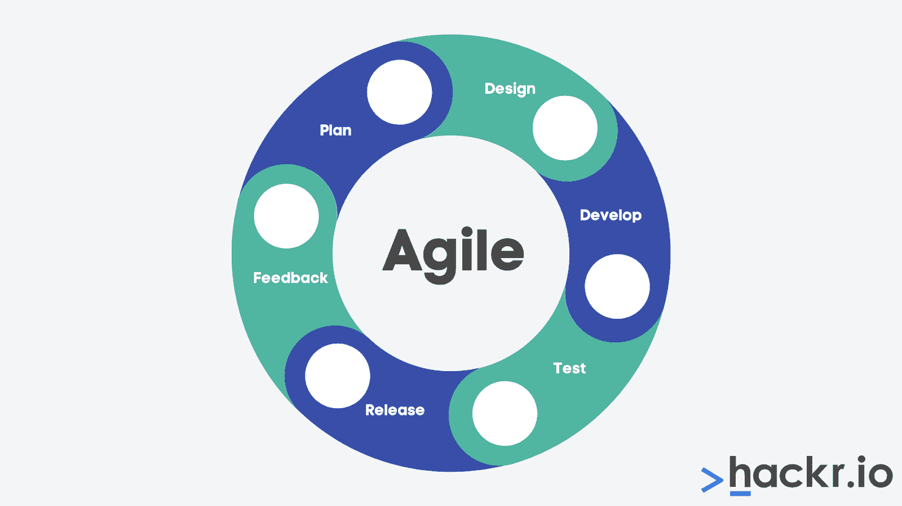
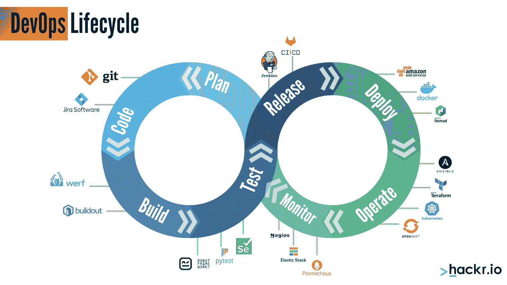
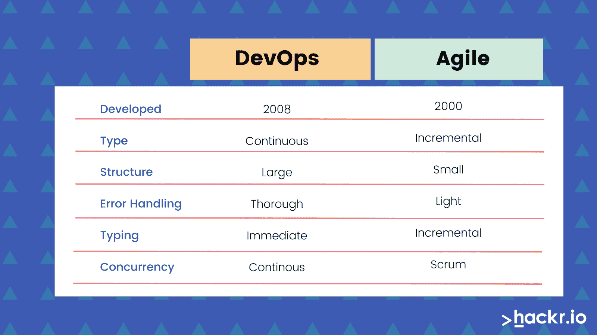

# [开发运维与敏捷]敏捷和开发运维的区别

> 原文：<https://hackr.io/blog/devOps-vs-agile>

十年前，一切都与敏捷有关。但今天，一切都是为了 DevOps。如果你不熟悉 DevOps 和敏捷之间的区别(和相似之处),你需要熟悉。

在这篇文章中，我们将讨论敏捷和开发运维之间的区别，敏捷和开发运维之间的相互关系，以及你需要了解的两者。

## **什么是敏捷？**

敏捷是一个依赖迭代方法的软件开发过程。最初是在 21 世纪初设计的，直到一个开发团队发布了它的使用规范，它才变得流行起来。从那以后，许多新的敏捷迭代出现了。

在传统的软件开发(“瀑布式”开发)中，公司一次生产大量的特性和功能。公司实现了重要的里程碑，开发了他们的产品，然后让客户参与进来。

在软件开发的早期，这很好。但是随着软件变得越来越复杂，它变成了一个麻烦而缓慢的过程。客户所做的每一个微小的改变都会阻碍项目的进展。

敏捷使得在迭代过程中不断地改变和改进产品变得更加容易。在敏捷下，开发人员可以一次打包较小的功能和变更。因为这个过程是迭代的，开发人员可以更快地收集反馈并采取行动。没有大量的发布或者大量的软件包需要处理。

对小的迭代步骤的关注强调了瀑布和敏捷开发之间的巨大差异——并使敏捷变得非常流行。在快速变化的软件开发世界中，瀑布方法根本跟不上。

## **什么是 DevOps？**

DevOps 代表[开发运营](https://hackr.io/blog/what-is-devops)。虽然 DevOps 在过去几年才成为焦点，但它在 2008 年左右才开始流行。DevOps 描述了依赖于持续集成和交付的特定开发过程。在 DevOps 下，开发人员快速地将对产品的更改推向产品管道。在那里，变更被快速测试，然后自动进行。

虽然敏捷主要关注哲学和过程，但是 DevOps 几乎完全由技术支持。容器化、代码管理、单元测试、自动化——devo PS 要求一个组织有一个坚实的技术栈和一个开发良好的(和集成良好的)管道。

如果说敏捷对于桌面应用程序的快速发布是完美的，那么 DevOps 对于基于云的应用程序(如 SaaS 服务)的持续发布则是完美的。但是因为 DevOps 本质上也比敏捷更复杂，它也被归入更大的项目(和更大的组织)。

**建议课程**

[AZ-400 设计和实施 DevOps 认证 2023](https://click.linksynergy.com/deeplink?id=jU79Zysihs4&mid=39197&murl=https%3A%2F%2Fwww.udemy.com%2Fcourse%2Fazure100%2F)

## **开发运维与敏捷的区别**

现在我们进入敏捷和 DevOps 之间的关系。虽然敏捷是一个很好的策略，比瀑布更快更灵敏，但它仍然可以比瀑布更灵敏。

在敏捷开发运维下——因为开发运维是敏捷的发展——产品是持续交付的。变更以小提交的形式出现。产品管道通过自动化测试过程、单元测试过程和用户测试过程来推动提交。开发人员可以在推出新功能时修复错误。

DevOps 促进持续集成和持续交付(CI/CD ),并创建持续改进的环境和文化。有一个单一的连续过程，而不是一个软件开发周期或软件开发版本。

敏捷和 DevOps 的区别在于，DevOps 是敏捷的“更新”版本——但是 DevOps 是敏捷的分支或变体。

在 DevOps 和敏捷之间，DevOps 更快，许多人认为它更有效。同时，DevOps 策略需要大量的风险管理。

为了理解敏捷和开发运维之间的重点转移，看看团队规模和沟通风格。敏捷有高度可移动的小团队，他们在每天的 scrum 会议上一起工作，并且依赖于轻量级文档。DevOps 拥有庞大的协作团队，他们通过通信系统同步数据，并彻底记录一切。

## **为什么 DevOps 如此重要？**

开发人员过去构建软件的方式非常不同。你将拥有一个 1.0 版本的软件平台。三个月后，你会有 1.1 的版本，然后是 1.2，等等。每个版本都是错误修复和新特性的打包。

有些软件系统，比如操作系统，还是这样操作的。但是 web 应用和云应用呢？

Web 应用程序更有可能被动态修改，或者直接提交到真实环境中。随着组织稳步转向基于 web 的应用程序和云基础设施，实现 CI/CD(持续集成和交付)实践变得更加重要。

### **devo PS 和敏捷一样吗？**

虽然 DevOps 或多或少遵循与敏捷相同的一般哲学(更小的变化，更快的反馈)，但 DevOps 将敏捷发挥到了极致。敏捷创建变更的小迭代，而 DevOps 促进持续部署的系统。

事实上，一个 DevOps 系统可能甚至没有一个登台环境——一些 DevOps 系统是如此复杂和错综复杂，以至于(一旦单元测试)提交需要被直接推送到生产。

### DevOps 是敏捷的子集吗？

DevOps 更应该被看作是敏捷的扩展，甚至是敏捷的完全进化。它不在敏捷方法或敏捷哲学之下，因为它从根本上改变了敏捷的工作方式。敏捷创造了一个迭代的、小的、可管理的发布周期。DevOps 确保持续发布和持续部署。

### DevOps 和 Scrum 有什么不同？

Scrum 是一个依赖于敏捷方法的敏捷开发框架。Scrum 背后的理念是个人经常会面，庆祝胜利，并确保他们保持高水平的沟通和联系。

在 Scrum 下，开发人员将项目归档为“进行中”或“已完成”，其他状态介于两者之间。虽然 Scrum 可以成为 DevOps 的一部分，但它并不适合 DevOps，因为它缺乏自动化。Scrum 的一个主要部分是每天的“Scrum”会议，简短的站立会议，以确保每个人都在同一页面上。

今天，人们宁愿在一个统一的、协作的氛围中工作，比如 Slack 或 Teams，而不是通过会议。DevOps 可以支持比 Scrum 大得多的团队，因为需要的交互性更少——所以 DevOps 本质上更具可伸缩性。

在 Scrum 下，个人拥有项目的某些方面，并被人工分配去完成它们。因此，虽然 DevOps 和 Scrum 可以共存，但它们本质上是不同的。

## **敏捷已经被 DevOps 取代了吗？**

需要注意的是，即使 DevOps 可以被视为敏捷的进化，但这并不意味着 DevOps 已经完全取代了敏捷。

可能会有持续集成或持续交付路径没有意义的情况。对于一个组织来说，打包更大的版本比参与持续的部署更有意义。

一个简单的例子就是拥有大量终端用户的系统，比如 SaaS 解决方案公司拥有数万名用户而不是数百名用户。能够将迭代提交直接推到一个真实的环境可能会变得令人头痛，而不是节省时间。

此外，由于 DevOps 需要大量的培训和流程管理，DevOps 可能不适合一次性项目或有明确目标的项目。敏捷可能更适合较小的项目，因为它需要较少的带宽来运行。

### **敏捷和 DevOps 可以共存吗？**

敏捷和 DevOps 是非常不同的系统。敏捷和开发运维通常不能共存，因为开发运维在基础层面上取代了敏捷。

但这并不意味着组织不能从 DevOps 和敏捷中学习。每个组织都有不同的构建过程的方法；有些人可能会发现 DevOps 和敏捷更多的是运营的范围。

### **公司还在使用敏捷吗？**

估计显示[2018 年大约 44%的公司](https://hbr.org/sponsored/2018/03/survey-data-shows-that-many-companies-are-still-not-truly-agile)仍在使用敏捷，许多公司仍在推广敏捷方法。因为 DevOps 对许多大企业非常重要，所以业内人士可能高估了它的受欢迎程度。

敏捷方法仍然最适合不需要持续集成和部署的公司。值得注意的是，不在基于网络或基于云的平台上工作的公司可能不需要 DevOps 提供的速度和敏捷性。

## **了解关于 DevOps 和敏捷的更多信息**

想要了解更多关于 DevOps 或敏捷的项目经理和开发人员可以获得培训和认证，以增强和提升他们的技能。

[DevOps 认证](https://hackr.io/blog/best-devops-certification)将向个人传授 DevOps 背后的理念以及 DevOps 背后的行业标准技术，如容器化和代码管理。

敏捷认证将教会开发者项目管理的基础和敏捷哲学。敏捷认证也可能涉及一些最流行的敏捷框架(比如看板)和流行的敏捷软件。

为了准备这些认证，学生可以查找在线培训、教程和面试问题。

## 开发运维与敏捷:面对面的比较

| **参数** | **DevOps** | **敏捷** |
| **瞄准** | 端到端工程 | 复杂项目 |
| **任务** | 持续测试和交付 | 不断的变化 |
| **团队规模** | 大的 | 小的 |
| **团队技能组合** | 在开发和运营团队之间划分 | 每个人都应该有同等的技能 |
| **目标** | 商业解决方案 | 软件开发 |
| **左移原理** | 向左和向右移动 | 左移位 |
| **反馈来源** | 内部团队 | 客户 |
| **主要焦点** | 运营和业务准备就绪 | 功能和非功能就绪性 |
| **持续时间** | 每天或每隔几小时送货 | 每次冲刺一至四周 |
| **工具** | 木偶、厨师、AWS、Ansible 和 team City OpenStack | Bugzilla，Kanboard 和 JIRA |
| **工作范围** | 自动化和敏捷性 | 灵活 |

## **结论**

当这个行业接受新的理念时，并不一定要摒弃旧的理念。敏捷和 DevOps 都可能是你的组织的正确解决方案——它是关于你的组织需要实现什么。

作为一名开发人员或项目经理，了解敏捷和 DevOps 并能够回答各种各样的[敏捷面试问题](https://hackr.io/blog/agile-interview-questions)或 DevOps 面试问题是很重要的。有时，您的组织可能不得不严重依赖一种哲学，而不是另一种。

简而言之，在下列情况下选择敏捷:

*   您的组织需要一个强大的、迭代的过程，但是不想参与构建 CI/CD 管道。
*   您的组织主要关注具有固定端点的一次性项目。

**选择 DevOps 如果:**

*   您的组织需要持续集成和持续交付。
*   您的组织正在优先考虑利益相关者的参与和用户反馈。
*   您的组织关注大型、复杂且连续的项目。

**人也在读:**