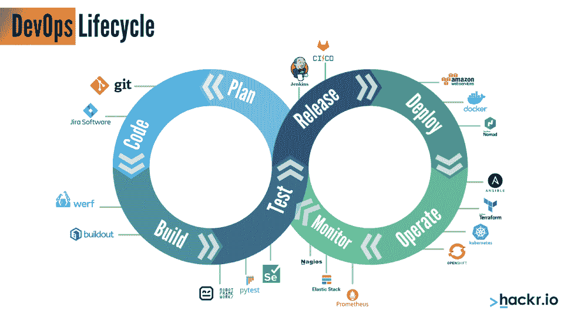
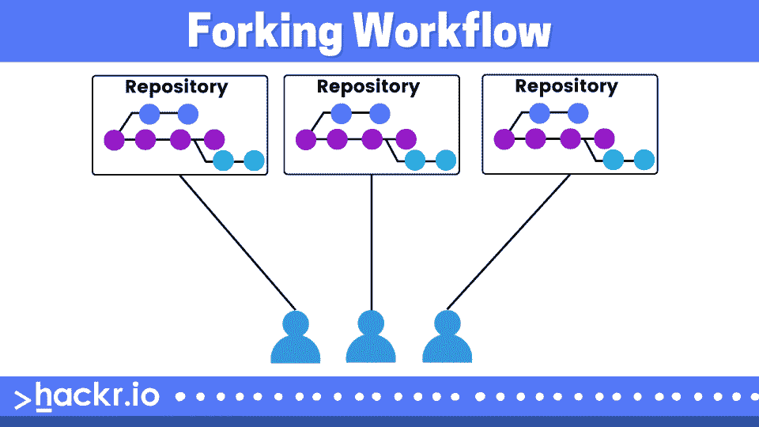

# 2023 年 50 大 DevOps 面试问答【更新】

> 原文：<https://hackr.io/blog/devops-interview-questions>

DevOps 代表开发和运营，它彻底改变了软件产品的开发和分发方式。DevOps 方法侧重于提供频繁的小型升级，而不是罕见的大型功能集。

IT 运营从开发运维中受益。在 DevOps 出现之前，IT 团队有几个固有的问题。随着 DevOps 的加入，这种情况发生了变化，它允许 IT 运营部门与组织的其他部门共享这些问题，从而提高了透明度并改善了协调。

在这里，我们列出了一个基于 DevOps 的角色的面试问题和答案。我们将问题分为基本 DevOps 面试问题和高级 DevOps 面试问题。

## **顶级 DevOps 面试问答**

#### **1。DevOps 是什么？**

DevOps 是一种软件开发实践，从最初的产品设计到市场部署，开发和 IT 运营都结合在一起。

#### **2。DevOps 的基本前提是什么？**

DevOps 是一种文化转变，其中协作和运营团队在整个产品或服务生命周期中一起工作。这样做的目的是帮助产品更快地上市，并且更容易维护。

DevOps 与[敏捷方法论有关。](https://hackr.io/blog/what-is-agile-methodology)

#### **4。DevOps 的主要重点是什么？**

DevOps 的重点包括资源管理、团队合作和沟通。

#### **5。DevOps 有什么好处？**

DevOps 的各种优势包括创新、稳定性、功能性和速度。

#### **6。DevOps 中有哪些不同的阶段？**

DevOps 通常分为 6 个阶段。然而，阶段并没有被硬边界分开，即使前一个阶段已经完全结束，也没有阶段开始。

**1。规划**

规划和软件开发是 DevOps 生命周期的第一阶段。这一阶段包括为了参与者的最终工作目标正确理解项目。

**2。开发**

在这个阶段，项目通过设计基础设施、编写代码、定义测试或自动化过程来构建。

**3。持续集成**

这个阶段自动化了验证和测试的机制。这有一个独特的特性，可以确保开发环境被正确地发布到一个服务中，该服务将开发环境与其余的应用程序集成在一起。

**4。自动化部署**

DevOps 通过工具和脚本刺激部署的自动化，最终目标是通过激活一个特性来解决整个过程。

**5。操作**

通常，与 DevOps 相关的所有操作在软件的整个生命周期中持续发生，因为基础设施中存在动态变化。这个阶段为转换、可用性和可伸缩性提供了机会。

**6。监控**

这个阶段是 DevOps 过程的一个永久阶段。DevOps 监视和分析显示应用程序当前状态的信息。

#### **7。为什么 DevOps 在过去几年里越来越受欢迎？**

DevOps 在当前行业中需求量很大，许多企业都渴望投资 DevOps 人才。脸书和网飞等大公司在开发运维上投入了大量资金和时间，以实现自动化并加快应用部署。

DevOps 的实现通过其新的技术标准，在追求更高效率的企业中取得了可证明的结果；技术人员可以比以往任何时候都更快地实现代码，并且错误更少。

#### **8。什么是天使和木偶？**

Puppet 和 Ansible 是用于管理大量服务器的工具。这些也称为远程执行和配置管理工具，它允许管理员同时在许多服务器上执行命令。它的主要特点通常是一次维护和配置数千台服务器。

#### **9。使用版本控制系统(VCS)有什么好处？**

版本控制的主要好处如下:

1.  有了版本控制系统(VCS)，所有工作人员都可以在任何时候自由访问文件。它还允许合并在一个公共版本中进行的所有更改。
2.  它旨在帮助多人协作编辑文本文件，这使得多台计算机之间的共享相对容易。
3.  这对于需要大量重新起草和修订的文档非常重要，因为它们为重新起草和更新最终版本提供了审计线索。
4.  它允许所有团队成员访问项目的完整历史，以便在中央服务器出现故障的情况下，我们可以使用任何队友的仓库。
5.  所有以前的版本和变种都被巧妙地打包在 VCS 里。任何版本在任何时候都被要求获得有关以前完成的项目的信息。

#### 10。硒的不同成分是什么？

Selenium 是一个开源工具，用于自动化不同的 web 应用程序。它主要有四个主要组件，帮助运行多个测试用例，并为使用各种浏览器和语言实现自动化提供服务。硒的成分如下:

**1。硒 IDE**

Selenium IDE(集成开发环境)是 Selenium 套件中最简单的框架之一。它有一个简单的记录和回放功能，这有助于找出提供简单学习的工具。

**2。硒 RC**

Selenium RC (Remote Control)是一个帮助理解测试脚本并为不同的编程语言如 Ruby、PHP、Java 等提供支持的工具。

**3。Selenium WebDriver**

这主要是 selenium RC 的扩展，但它支持所有最新的浏览器和许多平台。创建它是为了支持重要的 web 页面，在这些页面中，出现在页面上的元素可以在不重新加载页面的情况下改变，并且它直接调用浏览器来实现自动化。

**4。硒栅**

Selenium GRID 是一个针对不同浏览器和机器并行运行多个测试用例的工具。网格中的几个节点不是固定的，它可以在各种浏览器和平台上启动。它与硒 RC 一起使用。

#### **11。DevOps 中配置管理的目的是什么？**

配置管理有助于将原本耗时且乏味的任务自动化，并增强组织的敏捷性。它通过在项目的不同阶段简化设计、文档、控制和变更的实现，带来了一致性并改进了产品/服务的过程。

#### **12。DevOps 中 AWS 的目的是什么？**

Amazon Web Services (AWS)服务支持手动任务和流程的自动化，帮助开发人员更快、更高效地构建应用程序。这些过程可以是部署、开发、测试工作流、配置管理和容器管理。

#### 13。集中式和分布式版本控制系统(VCS)有什么区别？

在集中式存储库系统中，存储库位于一个中心位置，当客户需要时，他们可以访问这个系统。在这样的版本控制系统中，由于变更被直接提交给中央系统，所以储存库总是用最新的变更来更新；因此，所有的客户端总是可以访问最新的代码。CVS 和 SVN 是中央集权 VCS 的例子。

在分布式 VCS 中，团队中的每个人都有自己的存储库，它是中央存储库的镜像。它提供了灵活性，因为人们可以脱机工作。只有当更改必须提交到中央系统时，您才需要联机。这使得分布式 VCS 更快。Git 和 Mercurial 分布在 VCS。

#### **14。git pull 和 git fetch 有什么区别？**

| **git fetch** | **git pull** |
| 命令是:git fetch | 命令是:git pull<remote></remote> |
| 从远程存储库中获取变更，但是不将它们与本地存储库合并。 | 从远程存储库中获取分支的变更，并将它们与本地存储库合并。拉就是取加合并。 |
| 在后面的阶段完成，因为不涉及合并，所以没有要解决的冲突。 | 如果两个或更多的人在同一代码/文件的不同副本上工作，就有可能发生合并冲突。 |
| 本地存储库不变，但中央存储库会更新。 | 中央资料库中的更改会在本地资料库中更新。 |
| 开发人员可以看到其他人所做的更改，然后再推动他们的更改进行集成。 | 开发人员可以先将最新的文件带到他们的本地，然后开始更新相同的文件。 |

#### 15。什么是 git stash？

Git stash 命令用于将更改临时保存在工作目录中。这给了开发人员一个清晰的工作目录。他们可以在以后合并 git 工作流中的变更。如果使用此命令，被跟踪文件中的更改将合并到工作目录中。Git stash 命令可以在 Git 目录中多次使用。

#### 16。什么是 Git 中的合并冲突，如何解决？

当多人同时对单个文件进行更改时，会发生合并冲突。

因此，Git 将无法判断多个版本中的哪一个是正确的版本。

为了解决冲突，我们应该创建一个新的 Git repo，添加一个文件，创建一个分支，进行编辑并提交更改。

下一步是将新分支合并到主分支中。完成后，Git 清楚地显示了文件不同版本的差异，以及需要在哪里进行编辑以消除冲突。

#### **17。DevOps 和敏捷的根本区别是什么？**

尽管 DevOps 与敏捷方法有一些相似之处，敏捷方法是最流行的 SDLC 方法之一，但两者是软件开发的根本不同的方法。

以下是两者之间的各种基本差异:

*   **敏捷方法:**敏捷方法只适用于敏捷开发，而敏捷方法适用于开发运维。
*   **实践和过程:**虽然敏捷涉及诸如敏捷 Scrum 和敏捷看板的实践，但是 DevOps 涉及诸如 CD(持续交付)、CI(持续集成)和 CT(持续测试)的过程。
*   **优先级:**敏捷优先考虑及时性，而 DevOps 同等重视及时性和质量。
*   **发布周期:** DevOps 提供更短的发布周期和即时反馈，而敏捷只提供更短的发布周期，没有即时反馈。
*   **反馈来源:**敏捷依赖于来自客户的反馈，而来自自我(监控工具)的反馈包含在开发运维中。
*   **工作范围:**对于敏捷来说，工作范围仅仅是敏捷，但是对于 DevOps 来说，工作范围是敏捷和对自动化的需求。

#### 18。我们为什么需要 DevOps？

如今，组织正试图通过一系列的发布系列将小特性传递给客户，而不是发布大的特性集。这样做有几个好处，包括更好的软件质量和快速的客户反馈。

通过采用 DevOps 方法，组织能够在一天内完成数万到数千个部署。此外，这样做还能提供一流的可靠性、安全性和稳定性。

DevOps 有助于满足所有这些需求，从而实现无缝软件交付。像 Amazon、Etsy 和 Google 这样的成熟组织已经采用了 DevOps 方法，实现了以前从未有过的性能水平。

#### **19。使用 DevOps 有哪些重要的业务和技术优势？**

DevOps 带来了许多业务和技术优势。一些最重要的问题列举如下:

**商业利益:**

*   增强的操作环境稳定性。
*   更快地交付功能。
*   更多时间为产品增值。

**技术优势:**

*   持续的软件交付。
*   更快地解决问题。
*   更少的复杂问题。

以下是一些最广泛使用的 DevOps 工具的列表:

*   [**Ansible**](https://hackr.io/tutorials/learn-ansible?ref=blog-post) **:** 一款配置管理和应用部署工具
*   **Chef:** 一款配置管理和应用部署工具
*   **Docker:** 一个集装化工具
*   一个版本控制系统(VCS)工具
*   [**詹金斯**](https://hackr.io/tutorials/learn-jenkins?ref=blog-post) **:** 一个持续集成(CI)工具
*   **吉拉:**一个敏捷团队协作工具
*   **Nagios:** 持续监控工具
*   **Puppet:** 一个配置管理和应用部署工具
*   **Selenium:** 连续测试(CT)工具

#### **21。硒是用来做什么的？**

[硒](https://hackr.io/blog/what-is-selenium)用于 DevOps 中的连续测试。该工具专门用于功能和回归测试。

#### **22。你对反模式有什么理解？**

当其他组织普遍采用的 DevOps 模式在特定的上下文中不起作用，而组织仍然继续使用它时，就会导致采用反模式。一些值得注意的反模式是:

*   一个组织需要有一个单独的开发运维组
*   敏捷等于开发
*   DevOps 是一个过程
*   DevOps 是开发驱动的发布管理
*   DevOps 是不可能的，因为该组织是独特的
*   DevOps 是不可能的，因为现有的人不合适
*   DevOps 意味着开发人员管理生产
*   DevOps 将解决所有问题
*   未能在持续的开发运维过渡中涵盖组织的所有方面
*   在开发运维过渡开始时没有定义 KPI
*   借助新的 DevOps 团队减少开发和运营的孤岛式隔离，该团队将自己与组织的其他部分隔离开来

#### **23。CAMS 代表什么？**

缩写词 CAMS 通常用于描述 DevOps 方法的核心信条。它代表:

*   文化
*   一个自动化
*   M 测量值
*   哈林

#### **24。用于衡量 DevOps 成功的 KPI 是什么？**

为了衡量开发运维流程的成功，可以使用几个 KPI。一些最受欢迎的是:

*   应用程序性能
*   应用程序使用和流量
*   自动化测试通过率
*   有效性
*   改变音量
*   顾客票
*   缺陷逃逸率
*   部署频率
*   部署时间
*   错误率
*   失败的部署
*   研制周期
*   平均检测时间(MTTD)
*   恢复期间(MTTR)

#### **25。你对集装箱有什么理解？**

容器是一种轻量级虚拟化形式，有助于提供进程间的隔离。容器比 chroot 重，但比 T2 的 hypervisor 轻。

#### **26。微服务是 DevOps 的核心部分。你能说出任何两个流行的创建微服务的 Java 开发框架吗？**

有几个 Java 框架允许创建微服务。然而，Eclipse MicroProfile 和 Spring Boot 是 DevOps 中用于创建微服务的两个领先的 Java 开发框架。

#### **27。什么是事后总结会？**

有时，需要讨论在开发运维过程中出现了什么问题。为此，安排了事后总结会。这些会议产生了一些步骤，应该采取这些步骤来避免将来出现同样的失败或一系列失败，而这正是会议最初安排的目的。

#### **28。对资产管理和配置管理进行比较。**

监控以及维护对实体或团体有价值的事物的过程被称为资产管理。

配置管理是指控制、识别、规划和验证服务中的配置项以支持变更管理的过程。

#### **29。我们能否复制一份现有 Jenkins 作业的新副本？**

是的，我们可以通过以不同的名称创建目录的克隆来制作现有 Jenkins 作业的新拷贝。

#### 三十岁。什么是 Ansible？

Ansible work 是 DevOps 中使用的开源自动化工具。

#### 31。DevOps 中 Ansible 的类别有哪些？

DevOps 中有两类 Ansible:

1.  控制机器。
2.  节点。

#### 32。我们能在控制机器上安装 Ansible 吗？

是的，我们可以通过使用在 SSH 的帮助下管理的机器节点在控制机器上安装 Ansible。

是的，Ansible 是一个无代理工具，因为它不需要在远程节点上进行任何类型的强制安装。Ansible 工具的优点包括:

1.  任务自动化
2.  结构管理
3.  应用程序部署

#### 34。什么是分叉工作流？

****

分叉工作流为每个开发者提供了一个知识库，从而支持开源项目。

#### 35。分叉工作流怎么比 Git 工作流好？

分叉工作流比 Git 工作流更好，因为它有助于集成不同开发人员的贡献，而不需要每个人都推到一个中央存储库来清理项目历史。因此，开发人员被允许推送他们的服务器端存储库，而项目维护人员将推送至官方存储库。

#### 36。什么是 Git rebase？

Git rebase 是一个命令，旨在整合从一个分支到另一个品牌的变更。

#### 37。Git rebase 和 Git merge 有什么不同？

Git rebase 不同于 Git merge，因为在 Git rebase 的情况下，特性分支被转移到主分支的结束点。然而，在 Git 合并的情况下，合并增加了历史中的新提交，其中历史不改变，但是主分支改变了。

#### **高级 DevOps 面试问题**

#### 38。CI 是什么，它的目的是什么？

CI 代表持续集成。这是一种开发实践，开发人员在一天内多次将代码集成到共享存储库中。这提高了软件的质量，并减少了交付所需的总时间。

通常，CI 流程包括一套单元、集成和回归测试，每次编译成功时都会运行这些测试。如果任何一个测试失败了，CI 构建就被认为是不稳定的(这在敏捷 sprint 的开发过程中是很常见的),并且没有被破坏。

#### 39。DevOps 中的左移是什么？

传统的[软件开发生命周期](https://hackr.io/blog/sdlc-methodologies#popular-sdlc-methodologies)在纸上绘制时有两面，左边和右边。图表的左侧包括设计和开发，右侧包括生产阶段、压力测试和用户验收。

在 DevOps 中向左转移仅仅意味着必须在右边承担尽可能多的任务，即，这通常发生在应用程序开发过程的末尾，并将它们合并到 DevOps 方法的早期阶段。

在 DevOps 中有几种实现左移的方法，最明显的是:

*   在每个敏捷冲刺的最后，创建生产就绪的工件
*   在每个构建中加入静态代码分析例程

#### 40。实施 DevOps 自动化的主要好处是什么？

以下是实施 DevOps 自动化的主要优势:

*   减少人为错误。
*   随着任务变得更加可预测和可重复，当出现问题时，很容易识别和纠正。因此，它导致产生更可靠和更健壮的系统。
*   消除 CI 渠道中的瓶颈。这提高了部署频率，减少了部署失败的次数。这两个都是重要的 DevOps KPIs。

#### 41。如何恢复已经提交并公开的提交？

有两种方法可以做到:

*   通过创建新的提交来撤销由已经被推送并公开的提交所做的所有改变。这样做的命令是:
    git revert
*   通过在新的提交中修复或删除坏文件，然后将其推送到远程存储库。对文件进行必要的修改后，使用命令将它提交到远程存储库:
    git commit -m "commit message "

#### **42。你能陈述并解释持续测试的关键要素吗？**

持续测试的关键要素是:

*   **高级分析:**用于预测和预报未知的未来事件。
*   **策略分析:**改进测试流程。
*   **需求可追溯性:**指的是描述以及跟踪需求生命周期的能力，从它的起源到部署。
*   **风险评估:**识别可能造成潜在损害的危害和风险因素的方法或过程。
*   **服务虚拟化:**允许使用虚拟服务代替生产服务。模拟软件组件进行简单测试。
*   **测试优化:**改善整体测试流程。

#### **43。DevOps 在开发和基础设施方面的核心业务是什么>**

DevOps 在开发和基础设施方面的核心业务是:

*   **应用开发:**开发能够满足所有客户需求并提供卓越质量水平的产品。
*   **代码覆盖率:**在自动化测试运行时，对执行的代码的块、行或弧的总数的度量。
*   **代码开发:**准备产品开发所需的代码库。
*   **配置:**以最佳方式使用产品。
*   **部署:**安装最终用户要使用的软件。
*   **编排:**几个自动化任务的安排。
*   **打包:**当发布准备好进行部署时所涉及的活动。
*   **供应:**确保基础设施的变化与需要它的代码一起及时到达。
*   **单元测试:**意为测试单个单元或组件。

#### **44。Git 有哪些不同的优势？**

Git 有以下优点:

1.  它有助于数据冗余和复制。
2.  它很容易得到。
3.  它支持协作。
4.  它可以用于各种项目。
5.  每个存储库只使用一个 Git 目录。
6.  它支持磁盘利用。
7.  它提供了更高的网络性能。

#### **45。我们能在 Git 中处理合并冲突吗？**

是的，我们可以通过以下三个步骤来处理合并冲突:

*   **步骤 1:** 通过使用 Git 状态检查所有内容，对冲突形成清晰的理解。
*   **第二步:**应用合并工具标记并清理冲突。
*   **步骤 3:** 执行提交并与主分支一起与当前分支合并。

#### **46。我们可以将 Jenkins 从一台服务器移动或复制到另一台服务器吗？**

是的，我们可以将 Jenkins 从一台服务器移动或复制到另一台服务器。例如，通过复制，可以将 Jenkins 作业目录从旧服务器移动到新服务器。

#### **47。持续测试和自动化测试有什么区别？**

在连续测试中，执行自动化测试的过程是软件交付过程的一部分。相比之下，自动化测试是一种应用手动测试过程的过程，其中单独的测试工具帮助开发人员创建可以重复执行的测试脚本，而无需任何类型的手动干预。

#### **48。硒网格的作用是什么？**

Selenium 网格的作用是在不同的平台和浏览器上执行相同或不同的测试脚本。它有助于在各种环境中进行测试，并节省执行时间。

#### **49。我们能保护詹金斯吗？**

是的，我们可以通过以下方式保护詹金斯:

1.  确保全球安全。
2.  检查詹金斯是否融入了。
3.  确保项目矩阵已启用。
4.  自动化设置权限和特权的过程。
5.  限制对詹金斯数据的物理访问。
6.  定期进行安全审计。

#### 50。詹金斯管道是什么？

Jenkins pipeline 是一套插件，支持 Jenkins 持续交付管道的实施和集成。

#### 51。什么是木偶模块？

Puppet 模块是清单和数据的集合，包括具有特定目录结构的文件、模板和事实。

#### **52。木偶模块和木偶清单有什么不同？**

傀儡清单使用。pp 扩展。它们是傀儡程序，由傀儡代码组成。另一方面，Puppet 模块组织了各种各样的 Puppet 清单，可以用它来拆分 Puppet 代码。

## **结论**

以上是 DevOps 面试中最常见的问题和答案。除了增加您获得 DevOps 职位的机会，这些 DevOps 面试问题还将帮助您评估并提高您当前对 DevOps 的理解水平。

寻找更多 DevOps 面试准备内容？ [DevOps 面试问题准备课程](https://click.linksynergy.com/deeplink?id=jU79Zysihs4&mid=39197&murl=https%3A%2F%2Fwww.udemy.com%2Fcourse%2Fdevops-interview-questions-preparation-course%2F)将带你离下一份 DevOps 工作更近一步。

面试不仅会有关于 DevOps 的问题；面试官当然也会问你一些通用的软件开发问题。[破解编码面试:189 道编程题及解答](https://geni.us/MmRP)可以帮你准备通用的[编程面试题](https://hackr.io/blog/programming-interview-questions)。

## **常见问题解答**

#### **1。我如何准备 DevOps 面试？**

你可以通过确保自己对所有重要概念都了如指掌来准备 DevOps 面试。上面列出的 DevOps 问题会对你有所帮助。也可以搜索 DevOps 实用面试问题。

#### **2。Docker 在 DevOps 中是用来做什么的？**

Docker 用于运行隔离环境。您可以为您的技术堆栈构建可移植环境。

#### **3。詹金斯在 DevOps 里是做什么用的？**

Jenkins 是一个自动化软件测试服务器。它用于持续集成。

**人也在读:**