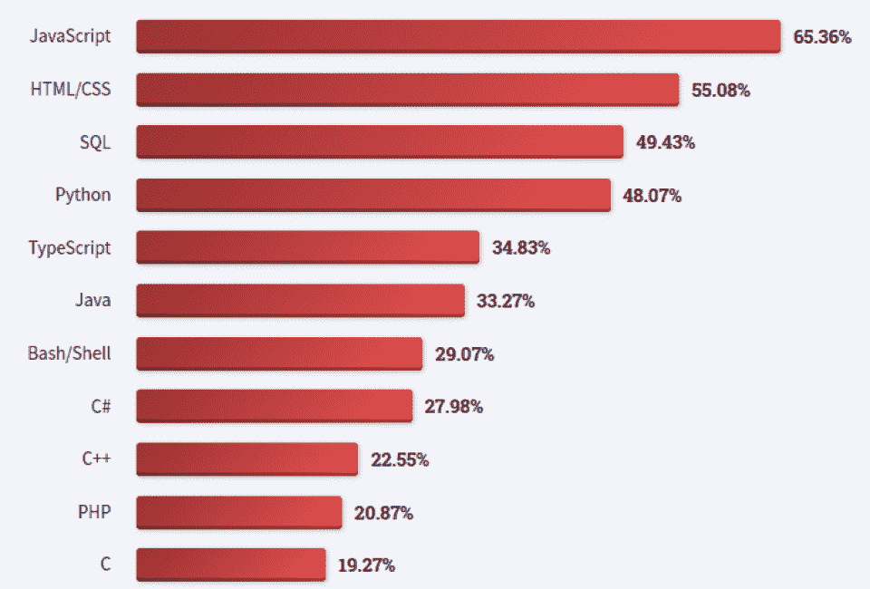
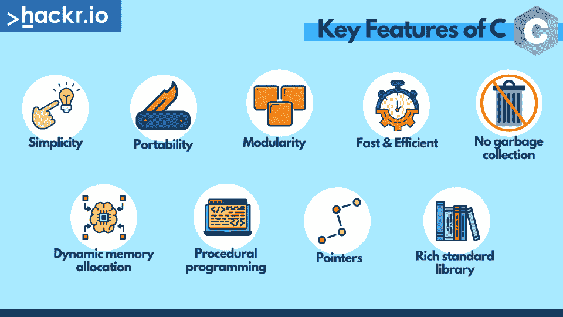
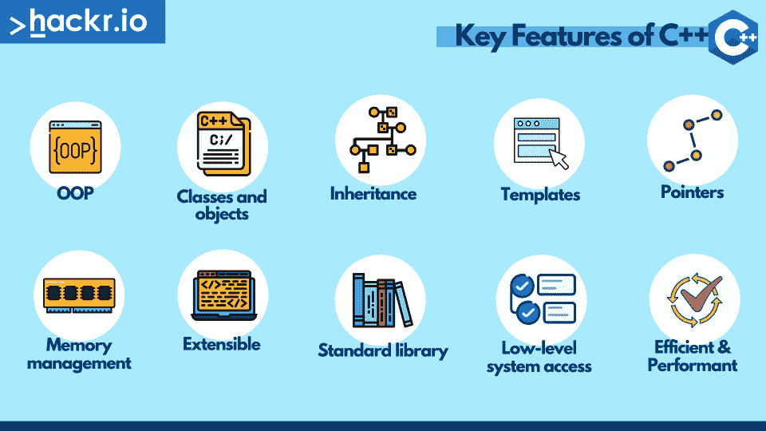
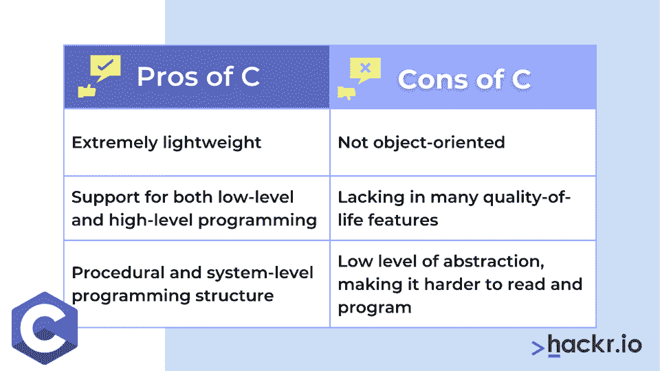
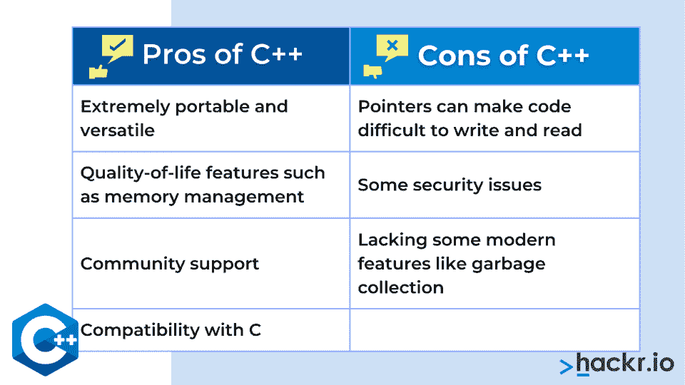

# C 与 C++:有什么区别？终极指南[2023]

> 原文：<https://hackr.io/blog/difference-between-c-and-cplusplus>

尽管是两种最古老的编程语言，但由于高性能和低级控制，C 和 C++仍然非常流行于系统编程、嵌入式系统和实时应用程序。随着[在最新的栈溢出开发者调查中排名前 12 位](https://survey.stackoverflow.co/2022/#technology-most-popular-technologies)，他们没有表现出放缓的迹象！

C++最初是作为 C 语言的扩展开发的，但是增加了面向对象编程(OOP)的关键部分。C++保留了 C 的核心语法，包括数据类型、控制结构和标准库函数，但它增加了类、对象、继承和多态。

简而言之，C++语言包括了 C 语言的所有特性，但是增加了面向对象的功能。C++还向后兼容 C，这意味着 C 代码可以通过 C++编译器编译，只需很少的修改。这使得 C++在系统编程中很受欢迎，因为 C 代码可以重用，同时获得面向对象的编程功能。

感兴趣，但想知道更多？继续读下去，我们将讨论 C 和 C++之间的区别。

想通过学习 C 或 C++来提升技能吗？结账

**[最好的 C++和 C 书籍](https://hackr.io/blog/10-best-c-cpp-books)**

## **C 与 C++的正面比较**

|  | **C** | **C++** |
| **由**开发 | 丹尼斯·里奇在 1969 年至 1973 年间 | 1985 年的比雅尼·斯特劳斯特鲁普 |
| **编程范例** | 过程和功能驱动语言 | 面向对象的编程语言 |
| **编程方法** | 自上而下 | 自下而上 |
| **程序细分** | 模块和程序 | 类别和对象 |
| **变量声明** | 起初 | 任何地方 |
| **关键词数量** | C11 有 44 个 | C++20 有 92 个 |
| **支持数据类型** | 内置的 | 内置和用户定义 |
| **兼容其他语言** | 不 | 是 |
| **封装** | 不 | 是 |
| **数据安全** | 不 | 是 |
| **多态性** | 不 | 是 |
| **函数和运算符重载** | 不 | 是 |
| **参考变量** | 不 | 是 |
| **好友和虚拟功能** | 不 | 是 |
| **内存分配和解除分配** | malloc()、calloc()和 free() | 新建和删除关键字 |
| **异常处理** | 不直接 | 是 |
| **输入/输出操作** | scanf()和 printf() | cin 和 cout |
| **结构内部的功能** | 不 | 是 |
| **外部功能** | 是 | 是 |
| **命名空间支持** | 不 | 是 |
| **严格的类型检查** | 不 | 是 |

*
C 和 C++在 2023 年开发者中依然排名靠前:* [*栈溢出*](https://survey.stackoverflow.co/2022/#technology-most-popular-technologies)

## **什么是 C？**

由贝尔实验室的 Dennis Ritchie 在 20 世纪 70 年代早期开发的 C，通过帮助开发 Unix 操作系统开始了它的旅程。今天，C 语言是一种通用的低级编程语言，它为程序员提供了对硬件和内存的细粒度控制，这使得它在系统级编程中很受欢迎。

C 语言的一个关键特征是它是一种支持模块化编程的结构化语言。这允许程序员将较大的程序分成较小的、更易管理的部分。您还可以访问几种基本的数据类型，如整数、浮点数和字符，或者您可以通过结构和联合定义自己的数据类型。

编译时，C 语言程序在执行前被编译器转换成机器代码。虽然这有助于快速高效的程序，但也意味着 C 程序必须针对每个平台或操作系统进行编译。

不可否认，C 语言深刻地影响了计算，影响了许多其他语言，包括 C++(我们知道这一点！)，Java，Python，还有 Ruby。由于简单、强大和可移植性，C 语言在开发操作系统(OS)、设备驱动程序等方面仍然很受欢迎。

### **C 的主要特点**

****

*   简单:少量的关键字和简单明了的语法使其易于学习。
*   **可移植性:**可以在多种平台和 OS 上编译运行。
*   模块化:可以将大型程序分解成更小的可管理的部分。
*   **快速&高效:**低级语言，高效内存管理，直接硬件访问。
*   **无垃圾收集:**减少开销，但需要程序员管理内存分配和释放。
*   动态内存分配:在运行时而不是编译时高效地分配/释放内存。需要小心处理，以避免错误或内存泄漏。
*   **过程化编程:**作为一种函数驱动的语言，代码被组织成执行特定任务的函数，程序流程由函数调用的顺序线性定义。
*   **指针:**直接作用于内存地址。
*   **丰富的标准库:**大型标准函数库，包括输入/输出、字符串操作和数学运算。

### **C 的主要版本**

与大多数语言一样，C 语言自发布以来也经历了几个版本，但这里总结了最重要的版本:

*   **C89/C90:** 由 ANSI(美国国家标准协会)于 1989 年创建，随后被 ISO(国际标准化组织)采用，这是第一个标准化版本，通常称为 C90。
*   下一个主要版本是在 1999 年标准化的，增加了几个特性，比如可变长度数组、内联函数和新的数据类型。
*   最新版本于 2011 年标准化，增加了对多线程、原子操作和静态断言的支持。

想要提升你的简历吗？查看 [**最佳 C 认证**](https://hackr.io/blog/c-certification)

## **什么是 C++？**

C++是一种通用编程语言，是由贝尔实验室的比雅尼·斯特劳斯特鲁普在 20 世纪 80 年代早期作为 C 语言的扩展开发的。与 C 不同，C++是一种对象驱动的语言，这意味着它结合了面向对象编程语言的高级功能和 C 的低级控制和效率。

C++可以与各种编程风格一起使用，无论是作为面向对象的编程语言，还是与过程化、泛型或函数式方法一起使用，这意味着它是通用的，可用于一系列应用程序。它还提供了几种基本的数据类型，包括整数、浮点数和字符，同时允许用户通过类定义自定义的数据类型。

就像 C 一样，C++是一种编译语言，这意味着程序在执行前必须由编译器翻译成机器代码。同样，就像 C 一样，这使得 C++程序快速高效，但也意味着它们必须针对特定的平台和操作系统进行编译。

凭借其速度、灵活性和功能，C++是世界上最受欢迎的编程语言之一，至今仍被用于开发操作系统、设备驱动程序、视频游戏、科学模拟、金融应用程序等。

C++的另一个好处是它与其他编程语言的兼容性。许多库和框架都支持 C++与 Python、Java 和 Ruby 一起工作，不管是通过语言绑定还是包装器。当然，C++也支持“extern C”，它允许你创建与 C 语言兼容的 C++函数。

### **c++的主要特性**

****

作为 C 语言的扩展，C 语言的许多关键特性也适用于 C++。然而，由于 C++是一种对象驱动的语言，它还有一些其他的关键特性。

*   **面向对象编程语言(OOP):** 面向对象编程特性允许开发者构建可重用的对象来封装数据或行为。
*   **类和对象:**开发人员可以创建自定义类型来封装数据和函数。
*   **继承:**类可以从其他类继承属性和行为，减少代码重复，提高组织性。
*   **模板:**允许开发者为各种数据类型编写通用代码，包括通用的数据结构和算法，减少重复，增强可重用性。
*   **指针:**直接和内存地址一起工作，提高效率。
*   **内存管理:**直接内存访问和控制，具有在堆栈或堆上分配和释放的选项。还通过智能指针和容器提供高级抽象，以自动化内存管理。
*   **可扩展:**丰富的库和框架生态系统，用于扩展功能
*   标准库:大型标准库，有一系列函数和类，用于 I/O、字符串操作和内存管理等常见任务。
*   **低级系统访问:**允许开发人员与硬件交互，如内存、CPU 和文件。
*   **高效&性能:**通过编译，C++代码可以针对计算机架构进行优化。

### **c++的主要版本**

与 C 语言一样，C++也有几个主要版本:

*   c++ 98:c++的第一个标准化版本发布于 1998 年，是 ISO C++标准的初始版本。
*   C++03: 这是 2003 年的一个小版本，主要是纠正技术错误和更好地兼容 C。
*   发布于 2011 年的 C++11: 引入了一些新特性，比如多线程、强大的模板和各种库，包括标准线程和标准互斥体。
*   2014 年发布的 C++14: 引入了几个新特性，包括二进制文字、泛型 lambdas 和改进的编译时间。
*   **C++17:** 线索就在这里的名称中，因为这个版本是在 2017 年发布的，具有嵌套名称空间、改进的并行算法支持和更好的 constexpr 函数处理等新功能。
*   C++20: 最新版本发布于 2020 年，增加了模块、协程、概念和范围等新特性。

想知道 C++与 C#相比如何吗？结账

**[C++ vs C#](https://hackr.io/blog/c-sharp-vs-cpp)**

## **C 和 C++有什么区别？**

*   **面向对象编程(OOP):** C++集成了面向对象的编程特性，而 C 遵循过程化的方法。这意味着 C 不包含类、封装、继承或多态等特性。
*   **内存管理:**谈到 C 与 C++的内存管理，C++提供了一种更复杂的方法，包括在创建或销毁对象时自动调用的构造函数和析构函数。c 依赖于手动的内存管理，比如 malloc()和 free()。
*   **容器:**c++标准库包含了比 C 更丰富的容器类集合，包括向量、列表、集合、映射等等。
*   **更严格的类型检查:** C++不允许隐式违反 C 的类型安全。
*   异常处理:c++标准库包括对异常的支持，而 C 标准库不包括这一点。
*   **模板:** C++大量使用模板，让程序员编写通用代码，增强代码重用，而 C 并不使用这些。
*   **I/O 流:**c++标准库包括 I/O 流类来处理输入和输出，而 C 标准库使用简单的基于文件的 I/O 方法。
*   性能:一般来说，由于虚函数或异常处理等特性的开销，C 比 C++快。
*   **兼容性:** C 代码可以用在 C++程序中，但反过来就不一定了，因为 C++增加了 C 中没有的额外特性和语法。

## **C&c++有哪些相似之处？**

鉴于 C++是 C 编程语言的扩展，两者之间有许多重要的相似之处。

*   语法:说到 C 与 C++的语法，它们非常相似，有许多相同的基本结构，如变量、操作符、循环和条件。
*   **控制结构:** C 和 C++都支持 if-else 语句，while 和 do-while 循环，以及 for 循环。
*   数据类型: C 和 C++共享许多数据类型，比如 int、float、double 和 char。
*   **指针:**两种语言都支持直接内存访问的指针。
*   标准库: C 和 C++都有提供通用功能的标准库，比如 I/O、数学函数和字符串操作。
*   预处理器:两种语言都使用预处理器来处理指令，比如包含、定义和条件编译。
*   低级访问:C 和 C++都提供对硬件、内存和 I/O 等系统资源的访问。

## C 与 C++:优点&缺点

****

### **C 语言的优点**

*   **效率和速度:** C 快速高效，所以经常用在系统编程和嵌入式系统中。
*   **可移植&灵活:** C 代码可以在各种平台上编译。
*   **极简主义:** C 语言语法简单，易学易用。
*   标准库:C 标准库提供了 I/O、数学等功能。
*   **硬件访问:** C 可以访问硬件资源，如内存和外围设备。

### **C 的缺点**

*   **内存管理:** C 需要显式的内存管理，这可能很困难并且容易出错。
*   **没有内置安全性:**对于直接内存访问，C 可能会导致缓冲区溢出、字符串漏洞和内存泄漏，因此程序员必须处理这些问题。
*   **无异常处理:** C 没有内置的异常处理支持。
*   有限的抽象: C 缺乏现代语言的抽象和高级结构，这使得创建可维护和可伸缩的代码更加困难。

### **c++的优点**

*   **性能:** C++提供高性能和低级别的硬件访问，非常适合需要速度的应用。
*   面向对象编程语言: C++支持面向对象编程，允许封装、继承和多态。
*   模板: C++支持模板，这是一种强大而灵活的编写通用代码的方法。
*   标准库: C++有一个丰富的标准库，具有 I/O、容器、算法等一系列功能。
*   跨平台: C++可以被编译成在各种平台上运行，比如 Windows、Linux、macOS 和嵌入式系统。

### **c++的缺点**

****

*   作为一种复杂的语言，C++可能很难学习和掌握，因为它的学习曲线比 Python 或 Ruby 等简单的语言更陡峭。
*   **内存管理:** C++需要显式内存管理，如果处理不当，可能会导致错误、内存泄漏或其他 bug。
*   **编译时间:**大型程序可能会有很长的编译时间，这使得用 C++进行开发和测试变得更慢。
*   **调试:**由于语言的复杂性和对硬件的低级访问，C++代码的调试可能具有挑战性。
*   **语法:** C++的语法可能很冗长，难以阅读，这使得很难维护代码结构。

我们说服你需要学习 C++了吗？结账

**[最好的 C++课程](https://hackr.io/blog/cpp-course)**

## C++和 C:你应该用哪一个？

如果您计划构建以下任何类型的程序或应用程序，那么您肯定应该考虑使用 **C 编程语言**:

*   **操作系统:**开发 OS 常用 C，Unix 操作系统、Linux、Windows、Mac OS 内核都使用 C。
*   嵌入式系统: C 语言在为汽车、电器、医疗设备等嵌入式系统开发软件方面非常流行。
*   系统软件:C 非常适合开发系统软件，比如编译器、汇编器和连接器。
*   **金融应用:** C 广泛应用于金融领域，打造高性能、低延迟的应用。
*   科学应用: C 对于科学应用很有用，比如模拟、建模和数据分析。

同样，如果您想要构建这些应用程序或程序类型，您应该考虑使用 **C++编程语言:**

*   应用软件: C++在开发应用软件方面很流行，比如文字处理器、电子表格、媒体播放器等等。
*   **操作系统:** C++也用于开发操作系统，如微软 Windows 和 Mac OS X。
*   **游戏开发:** C++在游戏行业的应用非常广泛，像虚幻引擎、Unity 等流行的游戏引擎都在它们的源代码中使用了 C++。
*   图形和多媒体: C++非常适合图形和多媒体，无论是视频编解码器、图像处理还是图形引擎。
*   web 浏览器: C++一直在开发现代的 Web 浏览器，比如 Google Chrome 和 Mozilla Firefox。
*   **数据库软件:** C++也非常适合开发数据库软件，MySQL、Oracle 这样的巨头都是用 C++打造的。

## **C 和 C++的流行应用**

以防你不相信这两种语言到底有多流行，看看 C++和 C 的一些著名应用。

| **使用 C 语言构建** | **使用 C++构建** |
| Microsoft Windows 内核 | Microsoft Windows 内核 |
| Linux 内核 | Linux 内核 |
| Mac OS X 内核 | Mac OS X 内核 |
| iOS 和 Android 内核 | Adobe Photoshop、Illustrator 和 Premiere Pro |
| Oracle、MySQL、MS SQL Server | AutoCAD |
| Git | Spotify |
| Matlab | YouTube |
| Apache HTTP 服务器 | 微软办公 |
| 尝试 | Oracle、MySQL、MS SQL Server |
| 精力 | 虚幻引擎和统一 |
| Python、PHP、Ruby 和 Java | 谷歌 Chrome 和 Mozilla Firefox |

## **结论**

作为仍在使用的两种最古老的编程语言，C 和 C++由于其高性能和低级控制而仍然是最受欢迎的，这使它们在系统编程、嵌入式系统、实时应用程序等方面很受欢迎

本文试图尽可能多地涉及 C 与 C++的主题，包括直接比较，以及它们的历史、关键特性和主要版本的详细总结。

我们还研究了 C 和 C++之间的主要区别和相似之处。如果您想知道哪种语言最适合您即将开始的项目，我们已经讨论了优缺点、典型用例以及一系列使用 C 和 C++构建的著名应用程序。

**寻找学习 C++的最佳方法？结账**

**[从初学 C++开始到超越](https://click.linksynergy.com/deeplink?id=jU79Zysihs4&mid=39197&murl=https%3A%2F%2Fwww.udemy.com%2Fcourse%2Fbeginning-c-plus-plus-programming%2F)**

## **常见问题解答**

#### **1。C++比 C 好吗？**

在问问题的时候，C++和 C 哪个好，没有单一的答案。虽然 C++提供了许多 C 语言没有的特性，但它也有一个更陡峭的学习曲线。一般来说，C 仍然是系统编程的流行语言，而 C++通常更适合更大更复杂的项目。

当然，如果你需要面向对象的选项，那么 C++是更好的选择，因为它足够灵活，可以作为面向过程的语言和面向对象的编程语言。

#### **2。我应该先学 C 还是 C++？**

如果你对低级或系统编程感兴趣，在 C++之前学习 C 会很有帮助。如果你的主要目标是学习 OOP 或开发软件应用，直接跳到 C++可能更有意义。最终还是要看你的目标和你想做的项目。

#### **3。机器人学用 C 吗？**

c 语言在嵌入式系统中很流行，包括机器人，因为它对硬件的底层控制允许系统资源的有效使用。它还提供了高度的可移植性和跨平台兼容性。

#### **4。C 是最快的语言吗？**

编程语言的速度取决于几个因素，如特定的应用程序、硬件和程序员的技能。一系列编程语言可以被普遍认为是最快的，包括 C、C++、Rust、Go 和 Assembly。

#### **5。C 和 C++有什么不同？**

C 和 C++的主要区别在于编程方法，C 是过程化的，而 C++采用面向对象的编程方法。其他差异包括 C++中更复杂的内存管理、C++中增加的异常处理以及更严格的类型安全。更多信息请看我们上面的比较。

#### **6。C++能做什么 C 做不到的事？**

虽然两者有很多相似之处，但 C++包括面向对象编程、类和对象、模板支持和异常处理，而 c++没有。

#### 7 .**。C 比 C++容易吗？**

一般来说，C 语法比 C++简单易学。C 代码通常也更容易阅读，因为它不包含 C++中 OOP 的复杂性。类似地，C++包含了 C 中没有的抽象方法，使得 C++更难学习和使用。

#### **8。如果我懂 C，C++容易吗？**

一般来说，如果你已经知道 C，那么学习 C++对你来说可能相对容易，因为两者之间有许多相似之处，包括基本语法、控制结构和函数。

然而，如果你是面向对象编程的新手，这对你来说仍然是一个新的领域，了解 C 语言对此没有帮助。