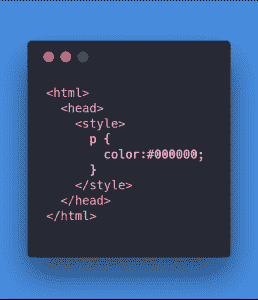
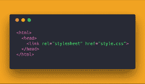
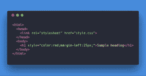

# CSS，CSS2，CSS3 的区别|什么是 CSS？

> 原文：<https://hackr.io/blog/difference-between-css-css2-and-css3>

级联样式表，通常被称为 CSS，是 HTML 元素上的样式层，或者更简单地说，它允许您通过温和地应用类来样式化 HTML 页面和内容的元素(字体、大小、颜色和间距)。 CSS 负责表示，帮助你决定用 HTML 制作的页面和内容的外观和显示方式。一旦你学会了掌握代码，CSS 将会是你的救星。 要掌握 CSS，首先需要了解 CSS 的不同类型。CSS 的编写方式基本上有三种，下面会提到。

## **内部样式表**

使用内部样式表意味着你要创建的任何样式都将被编码到特定页面的 HTML 中，就在和标签之间。如果您希望在完整的 HTML 正文中使用该样式，则使用它。

**例如:** 

## **外部样式表**

使用外部样式表意味着你创建一个. css 文件，然后根据你的需要在你的 HTML 页面中使用它。一般来说，当你有很多 HTML 属性，并且你希望在需要的时候使用它们的时候，就使用外部 CSS 没有必要在 HTML 主体中一遍又一遍地编写和重写 CSS 样式。 推荐使用外部样式表主要有两个原因。

*   它节省了大量的页面加载时间。
*   把所有东西都放在一个地方很方便。

**例如:** 

## **内联 CSS**

使用内联 CSS 意味着每种风格的内容都将包含在 HTML 元素中。它用于有限的部分，如果您的需求非常小，因为它只会影响单个元素。 如果你是一个优秀的程序员，不建议使用内联 CSS，因为:

*   在每个 HTML 标签上指定 CSS 是非常耗时的。
*   代码会变得非常庞大和复杂。

比如:  博主一般用内部样式表，WordPress 用外部样式表，内联 CSS 在需要快速修复的时候很有用。

## **CSS 特性**

### **1。一致性**

有了 CSS，你可以很容易地修改你网站的页面。通过对你的 CSS 样式表做一个改变，你就可以对你的网站的每一页都做同样的改变。

### **2。浏览器兼容性**

浏览器兼容性是非常重要的事情，CSS 很好地解决了这个问题，因此很容易隐瞒。

### **3。外观**

有了 CSS，从一个地方改善网站的外观很容易，因为它允许你使用各种各样广泛而富有表现力的风格。

### **4。可维护性**

每当你的网站的样式表发生变化时，CSS 提供给你自动修正和改变整个网站的每一页的能力。

### **5。节省时间**

使用 CSS，你只需要为任何元素指定一次样式细节，它就会自动应用指定的样式。因此，它通过不强迫你一次又一次地重写一切来节省大量时间。

## **CSS、CSS2 & CSS3** 的主要区别

1.  CSS 最初发布于 1996 年，由添加字体属性的属性组成，例如字体、文本的强调颜色、背景和其他元素。CSS2 于 1998 年发布，增加了其他媒体类型的样式，因此可以用于页面布局设计。CSS3 发布于 1999 年，其中添加了演示风格的属性，允许您从文档中构建演示。
2.  与由单个文档组成的 CSS2 不同，CSS3 的规范被分成许多独立的模块，这使得 CSS3 更容易处理。
3.  有了 CSS3，设计者现在可以使用特殊的字体，就像 Google Fonts 和 Typecast 中可用的字体。早些时候，在 CSS 和 CSS2 中，设计者只能使用“网页安全字体”,因为他们 100%确定使用的字体在每台机器上都是一样的。
4.  CSS 和 CSS2 有“简单选择器”，而 CSS3 将组件称为“简单选择器序列”。
5.  CSS3 提出了一些关键的网页设计考虑因素，比如圆形边框，它有助于没有任何麻烦地将边框变圆。这对于那些在 CSS 边框初始版本中苦苦挣扎的开发者来说是一个巨大的加分点。
6.  CSS3 能够将文本分成多个栏目，这样就可以像阅读报纸一样阅读。在 CSS2 中，开发人员遇到了困难，因为该标准没有提供自动拆分文本以适应文本框的功能。

## **2023 年学什么，去哪里学？**

CSS 是一种 web 开发技术，它支持每个网页的外观和感觉。事实证明，通过最近的发展，它有能力做更多的事情。随着时间的推移，CSS 的版本越来越好，这基本上意味着开发人员的编程平台得到了改善，从而实现了更高效、更快速的 web 设计。

随着我们的前进，最受欢迎和最重要的网络视觉语言是 CSS3。它可以帮助你吸引网站用户在所有浏览器上快速加载网页。

CSS3 让你可以通过布局、分层、排版和特殊效果来控制网站的视觉外观。你可以很容易地为 WordPress 定制任何主题，也可以用 CSS3 为你的应用或网站创建视觉效果。

你可以在这里找到编程社区推荐的最佳 [CSS3 教程](https://hackr.io/tutorials/learn-css?ref=blog)。

## **CSS、CSS2 和 CSS3 的区别**

| **参数** | **CSS** | **CSS2** | **CSS3** |
| **发布于** | 1996 | 1998 | 1999 |
| **规格** | 单一文件 | 单一文件 | 分成单独的模块 |
| **造型选项** | 有限的 | 不止是 CSS | 大，并支持动画 |
| **Fonts** | 网页安全字体 | 网页安全字体 | 类似于 Google 字体和 Typecast 的特殊字体 |
| **选择器** | 简单选择器 | 简单选择器 | 一系列简单的选择器 |
| **圆形边框** | 不 | 不 | 是 |
| **分割文本特征** | 不 | 不 | 是 |
| **网格系统和模板布局** | 不 | 不 | 是 |

[用 HTML5 和 CSS3 构建响应迅速的真实世界网站](https://click.linksynergy.com/link?id=jU79Zysihs4&offerid=1045023.3584528&type=2&murl=https%3A%2F%2Fwww.udemy.com%2Fcourse%2Fbuild-10-real-world-responsive-websites-with-html5-and-css3%2F)

## **结论**

CSS3 是 CSS 的最新版本。它只兼容 IE9，不兼容旧版本的浏览器。你编码的越多，你对 CSS3 的了解就越多，但是有一点需要注意——除非你了解 CSS，否则你无法掌握 CSS3。 CSS3 继承了 CSS 的特性，并对其进行了改进，增加了新的特性，为设计者提供了易用性。

与不支持响应式设计并且不能处理媒体查询的 CSS 相比，CSS3 能够支持响应式设计并且还能够处理媒体查询。 CSS3 对于网页设计师来说非常重要，因为它提供了广泛的选择，有助于为网页设计创造更多的机会。通过网页设计，营销人员可以很容易地提高他们的产品在市场上的知名度。

**人也在读:**