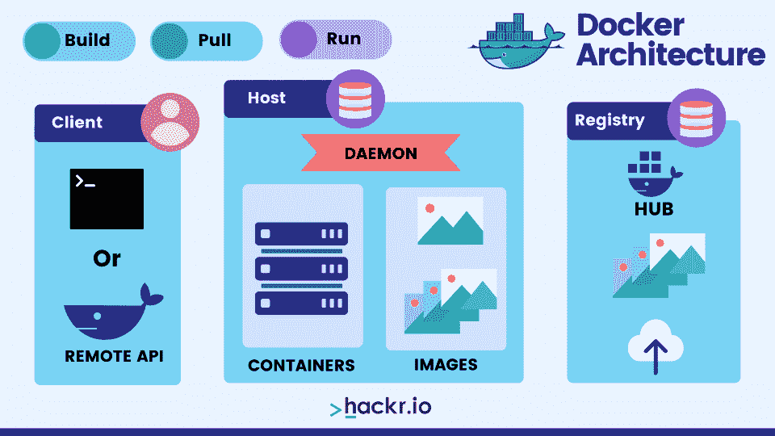
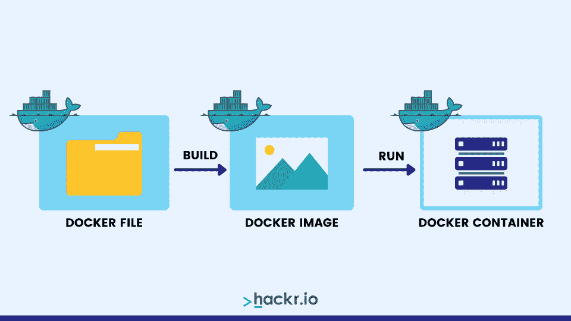
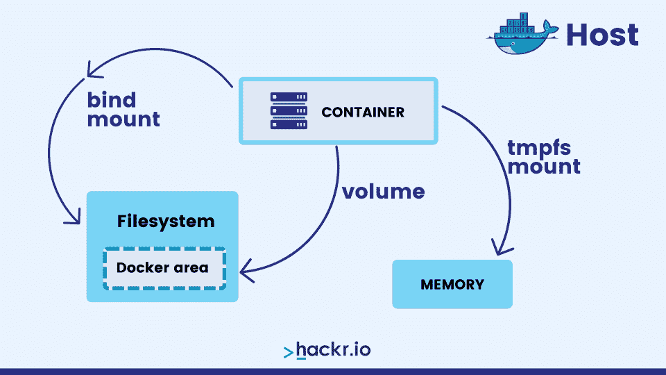

# 50 大码头工人面试问答

> 原文：<https://hackr.io/blog/docker-interview-questions>

发布于 2013 年的 [Docker](https://hackr.io/tutorials/learn-docker) 是一款在“容器”中打包、运输和运行应用程序的有用工具。最大的科技公司，包括 T2、谷歌、亚马逊和 VMware 都使用 Docker 作为他们的首选容器技术。因此，学习 Docker 可以帮助你在最好的科技公司找到工作。

我们已经列出了顶级 Docker 面试问题，分为基本 Docker 面试问题和高级 Docker 面试问题。

## **顶级码头工人面试问题**

### **基础 Docker 面试问题**

#### **1。什么是 Docker 容器？**

Docker 容器帮助应用程序平稳运行。从本质上说，它是一个软件单元，包含代码及其所有依赖项——系统工具、库、设置——运行应用程序所需的一切。

#### **2。解释 Docker 架构的组件。**

****

Docker 架构的组件描述如下:

*   **Host:** Docker 守护进程、图像和容器属于主机组件
*   **客户端:**这允许与 Docker 主机通信
*   **注册表:**这个组件用来存储 Docker 图片。Docker Hub 和 Docker Cloud 是任何人都可以使用的公共注册中心

#### **3。详细解释 Docker 注册表。**

Docker 图像存储在 Docker 注册表中，该注册表充当默认图像存储。这是一个重要的存储区域，因为它保存着容器图像，所以需要定期维护。另一个公共注册表是 Docker Cloud。

#### **4。简要解释 Docker 容器的生命周期。**

Docker 容器的生命周期包括以下内容:

*   创建容器
*   运行容器
*   暂停容器
*   打开集装箱包装
*   启动容器
*   停止容器
*   重新启动容器
*   杀死集装箱
*   破坏容器

#### **5。陈述一些重要的 Docker 命令。**

一些重要的 Docker 命令包括:

*   **构建:**为 Docker 构建一个图像文件
*   **创建:**创建一个新的容器
*   **杀死:**杀死一个容器
*   **Docker:**启动 Docker 守护进程
*   **提交:**从容器变化中创建一个新的图像

#### **6。什么是名称空间？**

Docker 名称空间以容器的形式提供了一个隔离的工作空间。一旦容器启动，Docker 就会为它们创建名称空间，这提供了一个隔离层。每个容器都有自己唯一的名称空间。

#### **7。什么是 Docker Swarm？**

Docker Swarm 是一个用于集群和调度 Docker 容器的重要工具。这使得在 Docker 或单独的 VS 中创建和维护节点变得很容易。

#### **8。如何识别 Docker 容器的状态？**

使用以下命令返回每个 Docker 容器的状态:

" **docker ps-a.** "

该命令将返回所有可用 Docker 容器的列表，以及它们在主机上的状态。从列表中，可以很容易地找到所需的容器来检查其状态。

#### **9。什么是 Docker 图像和运行命令？**

Docker 映像是一组文件，允许在不同的容器中创建和运行实例。每个实例都是一个独立的进程。

使用运行可执行应用程序所需的信息创建映像。

您可以使用 Docker run 命令创建并初始化一个使用 Docker 映像的容器实例。如果映像正在运行，它可以链接到任意数量的实例(或容器)。



#### 10。Docker 的功能和应用有哪些？

以下是 Docker 的一些功能和应用:

*   基础架构级别的简单配置
*   帮助开发人员专注于业务逻辑，因为它减少了开发时间，从而提高了生产率
*   增强调试能力
*   允许应用程序被隔离
*   集装箱化减少了对多台服务器的需求。
*   促进操作系统级别的快速部署

#### **11。什么是 Docker 对象？**

Docker 图像、服务和容器被称为 Docker 对象。

*   **图像**:包含创建 Docker 容器的指令
*   **容器**:一个图像的可运行实例
*   **服务**:容器作为一个群体跨不同的 Docker 守护进程扩展

其他 Docker 对象包括网络和卷。

#### **12。无状态和有状态应用程序哪个更适合 Docker 容器？**

无状态应用程序更适合 Docker 容器，因为我们可以为我们的应用程序创建一个单一的、可重用的容器，这允许我们将状态配置从应用程序和容器中分离出来。

通过这样做，我们可以用不同的生产参数等运行同一个容器的多个实例。

因此，无状态应用程序给了我们在各种场景中使用相同映像的自由，包括各种生产和测试环境。

#### 13。Dockerfile 是做什么用的？

Dockerfile 包含一系列构建映像的指令，该映像可用于初始化容器。这个文本文档包括您在命令行中输入的创建图像的每一个命令。

#### **14。Docker 默认提供哪些网络？**

默认可用网络包括:

*   **Bridge** :如果没有另外指定网络，容器将连接的默认网络
*   **None** :连接到没有网络接口的容器专用网络堆栈
*   **主机**:连接到主机的网络堆栈

#### 15。Docker 在生产中是如何被监控的？

在生产环境中运行 Docker 时，可以使用 Docker Stats 和 Docker Events 等工具收集和检查重要的统计数据。

可以从容器内部调用 Docker Stats 来返回与容器的 CPU 和内存使用情况相关的数据。这类似于 [Linux top 命令](https://hackr.io/blog/basic-linux-commands)，可以用来检查所有正在运行的进程及其当前的计算负载。

Docker 事件代表一个命令列表，可用于分析 Docker 守护进程正在处理的任何正在进行的活动。这些命令包括附加、提交、重命名、销毁和终止。

#### 16。让我们了解一下 Docker 的工作流程。

以下是 Docker 工作流程的快速浏览:

*   一切都从图像的源代码 Dockerfile 开始
*   一旦被创建，docker 文件帮助构建容器的映像，这是 docker 文件的编译版本
*   之后，它通过注册表重新分发，并用于运行容器

#### **17。Docker run 和 Docker create 有什么区别？**

如果您使用 Docker create，容器将在“停止”状态下创建。这允许您稍后存储和输出容器 ID。如果您将“docker run”与—cidfile FILE_NAME 一起使用，它将不允许您覆盖该文件。

[Docker 认证助理:2023 年硕士课程](https://click.linksynergy.com/link?id=jU79Zysihs4&offerid=1045023.2074534&type=2&murl=https%3A%2F%2Fwww.udemy.com%2Fcourse%2Fdocker-certified-associate%2F)

#### 18。什么是虚拟化？

最初，虚拟化使大型机系统的逻辑部分能够让几个应用程序同时在一个系统上运行。随着技术的进步，这个术语的含义逐渐演变为代表在单个 x86 系统上运行多个(也可能是不同的)操作系统(OS)。

如今，这个术语被广泛用于指在同一硬件上运行多个操作系统的过程。在这个场景中，主[操作系统](https://hackr.io/blog/best-os-for-programming)充当管理员，访客必须遵循预定义的引导、加载内核等过程。这确保了更高的安全性，并防止来宾系统获得完全的系统访问权限，这可能会导致数据泄露。

以下是三种类型的虚拟化:

*   半虚拟化
*   竞争
*   基于容器的虚拟化

#### **19。注册中心和存储库之间有什么区别？**

Docker 注册表托管和分发图像，Docker Hub 是默认注册表。Docker 存储库(或 repo)允许您存储 Docker 映像版本的集合。这意味着图像将具有相同的名称，但是它们的标签会有所不同以代表不同的版本。

#### 20。什么是 Docker 映像、Docker Hub 和 Docker 文件？

**Docker 图像:**这些多层文件用于创建 Docker 容器的实例，它们是使用终端命令指令或包含这些指令的预定义 Docker 文件来构建的。由于在构建序列的每一步都进行缓存，使用映像可以加快 Docker 构建时间。

**Docker hub:** 这是 Docker 提供的一项服务，可以用来寻找 Docker 图片，并与团队中的其他人分享。与 GitHub 用于提供分布式文件存储(具有版本控制)的方式相同，Docker hub 允许您推和拉图像，访问存储 Docker 图像的私有 repos，并在将这些图像推送到 Docker hub 之前，从 GitHub 或 BitBucket 存储库中自动构建 Docker 图像。

**Dockerfile:** 这是一个文本文档，用于存储 Docker 映像的构建指令。运行时，Docker 执行命令自动生成图像。

#### **21。如何检查 Docker 客户端和 Docker 服务器的版本？**

docker version [options]命令允许我们这样做。如果我们省略这些选项，我们将简单地接收关于客户机和服务器的所有相关版本信息。这是命令:

```
$ docker version --format'{{.Server.Version}}'
```

#### **22。Docker 储存库的登录程序是什么？**

要登录 Docker 存储库，请使用:

```
dockerlogin [OPTIONS] [SERVER]
```

要登录自托管(本地)注册表，只需添加服务器名称:

```
$ docker login localhost:8080
```

#### **23。有哪些基本的 Docker 命令？**

一些基本的 Docker 命令是:

*   **docker push:** 将存储库或映像推送到注册中心
*   **docker run:** 在新容器中运行命令
*   **docker pull:** 从注册表中提取存储库或映像
*   **码头启动:**启动一个或多个集装箱
*   **停靠站:**停止一个或多个运行中的集装箱
*   **docker 搜索:**在 Docker hub 中搜索图像
*   **docker 提交:**提交新图像

#### **24。码头集装箱与其他集装箱运输方式有何不同？**

您可以轻松地将 Docker 容器部署到任何云平台。还可以更快地使用现成的容器化应用程序，以及更轻松地管理和部署应用程序。Docker 容器也可以与应用程序共享，而其他容器化方法没有这些方法。

#### **25。Docker 运行在哪些平台上？**

Docker 运行在 Windows (x86-64)和 Linux(x86-64、ARM 和其他 CPU 架构)、s390x 和 ppc64le 上。

#### **26。什么是内存交换标志？**

“memory-swap”标志是一个修饰符，它可以与 run 命令结合使用，以便当容器使用了其所有已配置的物理内存(RAM)时，它可以访问额外的虚拟内存。该命令要求在执行运行命令时预设“内存”标志。

比如:–memory = " 256m "；–memory-swap = " 512m "；通过这种设置，容器被提供了 256MB 的物理内存，以及 256MB 的额外虚拟交换空间(512m-256m)。

#### **27。Docker 卷存放在哪里？**

卷存储在 Docker 主机文件系统:/var/lib/docker/volumes/中。这是保证 Docker 中数据持久性的最有效的方法。

#### **28。什么是 CNM？**

CNM，或容器网络模型，正式定义了容器联网的步骤，同时还维护了用于支持多个网络驱动程序的抽象。沙箱、端点和网络是三个组件。

#### **29。Docker 中有哪些不同的挂载类型？**

这三种类型是:

*   **绑定挂载:**这些挂载可以存储在主机系统的任何地方
*   **卷挂载:**存储在主机文件系统中，由 Docker 管理
*   **tmpfs 挂载:**存储在主机系统的内存中，并且永远无法写入主机的文件系统



#### 三十岁。什么是 Docker 对象标签？

这是一个存储为字符串的键值对。我们可以使用标签来应用元数据，标签可以用于图像、容器、卷、网络、本地守护进程、群节点和服务。每个对象都应该有一个唯一的标签，这些标签在对象的整个生命周期中都是静态的。

### **高级码头工人面试问题**

#### 31。列出存储在 Git Repo 中的 Dockerized 应用程序的部署过程中的步骤。

部署过程可能因生产环境的不同而不同，但基本过程将包括以下内容:

*   用 Docker Build 构建应用程序
*   测试图像
*   将新图像推送到 Docker 注册表
*   通知远程应用服务器从 Docker 注册中心获取新的映像，然后运行该映像
*   利用 HTTP 代理进行端口交换
*   停止任何旧容器

#### 32。解释 Docker 与其他容器技术有何不同。

虽然 Docker 是一种相对较新的容器技术，但它已经成为最受欢迎的技术之一。作为云计算时代的产物，Docker 提供了一些旧容器产品所没有的特性。Docker 的突出特性之一是能够在任何类型的基础设施上运行，无论是在本地(本地)还是在云中。

如今，Docker 还允许执行更多的应用程序，将这些应用程序处理成包，并将其发送到旧服务器。它还可以作为方便容器的存储库，这些容器也可以由您的其他应用程序共享。最后，这是有据可查的。

#### 33。如果退出 Docker 容器，您会丢失数据吗？

退出容器时不会丢失数据，因为数据是写入磁盘的。这一直持续到容器被完全删除。容器的文件系统在暂停后也会保持不变。

#### 34。Docker 中的 compose 文件可以用 JSON 代替 YAML 吗？如果是，如何实现？

是的，可以。为此，请按如下方式指定文件名:

“坞站-组合-f 坞站-组合. json up”

#### 35。Dockerfile 中的 CMD 和 ENTRYPOINT 是什么？

这两条指令都关注于容器在执行过程中使用的命令和参数。这些指令遵循一定的规则:

*   Dockerfile 应该从 CMD 或 ENTRYPOINT 中指定至少一个命令
*   ENTRYPOINT 提供命令来确定如何执行容器。在命令行(CLI)中使用 run 命令时，不能覆盖这些参数
*   CMD 指定启动容器时要执行的默认图像。如果用户为 run 命令提供了替代参数，则可以在 CLI 中覆盖传递给此命令的任何参数

#### 36。解释使用 Docker 在 Linux 容器中运行应用程序的过程。

为了使用 Docker 在 Linux 容器中运行应用程序，请遵循以下步骤:

*   安装 Docker，然后运行它
*   从 Docker hub 获取 Fedora 21 (Linux OS)基础映像
*   使用 Docker 基本映像，加载您的应用程序
*   使用新图像在交互模式下运行容器
*   检查系统容器
*   启动或停止 Docker 容器
*   移除图像或容器

#### 37。什么是虚拟机管理程序？

虚拟机管理程序是一种管理软件，可用于创建和运行虚拟机(VM)。这使得主机系统能够容纳多个访客虚拟机，并且这些访客虚拟机将共享包括 RAM 和 CPU 在内的计算资源。通过向每个虚拟机分配所需的计算资源，可以减少物理硬件需求和维护。

这两种类型的虚拟机管理程序是:

*   类型 I(T1):这是一个运行在主机系统上的轻量级操作系统
*   类型 II :它像现有操作系统中的任何其他软件一样运行

#### 38。解释集装箱化。

Docker 容器包含代码、系统工具、库、运行时和应用程序执行所需的设置，应用程序位于 Docker 引擎层之上。这个概念被称为集装箱化

#### 39。容器化和虚拟化的主要区别是什么？

虚拟化允许您在一台物理服务器上运行多个操作系统。操作系统还处理容器化，这发生在单个服务器或虚拟机上。

#### 40。容器有可能自己重启吗？

是的，这是可能的。但是，Docker 提供了一系列行为，可以通过配置来控制这一点:

*   **Off:** 如果容器出现故障或停止，它将不会重新启动
*   **On-failure:** 如果容器由于非用户错误而失败，容器将重新启动
*   **除非-停止:**如果用户手动停止，容器将重新启动
*   **Always:** 不管停止的错误或原因是什么，容器总是会重新启动

命令是:

```
$ docker run -dit — restart [unless-stopped|off|on-failure|always] [CONTAINER]
```

#### 41。云有可能取代集装箱化的使用吗？

像这样的问题，只能用主观来回答，或者用一种观点来回答。时至今日，许多公司已经开始依赖云计算和容器化的结合来实现高性能的系统设计。

#### **42。Docker 容器有哪些可能的状态？**

Docker 容器的不同状态包括:

*   **已创建:**容器已创建，但未激活
*   **重新启动:**容器正在重新启动过程中
*   **运行:**集装箱正在运行
*   **暂停:**容器的进程已经暂停
*   **Exited:** 容器正在运行并完成了它的进程
*   **Dead:** 容器不起作用或被部分移除，但仍在使用资源。守护程序将在重新启动时尝试删除它

#### **43。解释容器编排。我们为什么需要它？**

容器编排通过自动化以下内容，减少了开发人员手动管理容器相关活动的需求:

*   供应和部署容器
*   网络负载平衡
*   当前容器的资源分配
*   容器和主机的健康监控
*   容器缩放
*   如果当前主机变得无响应或缺少计算资源，则通过将容器转移到新主机来预防故障

#### **44。有哪些高级 Docker 命令？**

一些高级 Docker 命令包括:

*   **docker -version:** 看 docker 安装的是什么版本。语法:Docker - version
*   **docker ps:** 列出所有正在运行的 docker 容器以及容器细节。语法:docker ps
*   **docker ps -a:** 列出所有容器，包括正在运行、停止或退出的容器，以及相关的详细信息。语法:docker ps -a
*   **docker exec:** 访问一个容器并在该容器内运行命令。语法:docker exec[选项]
*   **docker 构建:**从 docker 文件构建一个图像。语法:docker build [options] path|URL
*   **docker rm:** 删除具有给定容器 id 的容器。语法:docker rm < container_id >
*   **docker rmi:** 删除具有给定图像 id 的 docker 图像。语法:对接 rmi < image_id >
*   **docker 信息:**返回系统上安装的 docker 的详细信息，包括图像数量；正在运行、暂停或停止的容器；服务器版本；体积；运行时；内核版本；和总内存等。语法:docker 信息
*   **docker cp:** 将文件从 docker 容器复制到本地系统。语法:docker CP<source _ path>dest _ path>
*   **docker 历史:**显示具有给定图像名称的 docker 图像的历史。语法:docker history < img_name >

#### **45。用 Systemd 控制 Docker 的命令有哪些？**

Docker 守护程序可以使用以下系统启动:

```
$ sudo systemctl start docker 
```

使用 systemct1 启动服务。如果不可用，请使用 service 命令:

```
$ sudo service docker start
```

要在引导期间启用和禁用守护程序，请使用:

```
$ sudo systemctl enable docker

$ sudo systemctl disable docker
```

要修改守护程序选项，请使用:

```
$ sudo systemctl edit docker
```

查看与 Docker 服务相关的日志:

```
$ journalctl -u docker;
```

#### **46。扩展 Docker 容器的过程是什么？**

docker-compose 命令可用于通过启动所需数量的附加实例来水平扩展 docker 容器的数量。实现这一点的语法是:

```
$] docker-compose --file docker-compose-run-srvr.yml scale <service_name>=<n>
```

在上面的命令中，我们传递 docker-compose-run-Sr ver . yml YAML 文件作为服务名，并且我们必须提供一个整数值‘n’，来表示我们需要水平伸缩的额外实例的数量。最后，我们可以通过以下方式检查这些新容器的详细信息:

```
$] docker ps -a
```

#### **47。Docker 容器生命周期中的主要活动是什么？**

以下是步骤:

*   **创建容器:** docker 创建-名称<容器-名称> <图像-名称>
*   **运行 docker 容器:**docker Run-it-d-name<container-name>image-name>bash
*   **暂停集装箱**:码头工人暂停<集装箱 id/名称>
*   **拆箱:**码头工人拆箱<集装箱 id/名称>
*   **开始集装箱:**码头工人开始<集装箱 id/名称>
*   **停止集装箱:**码头工人停止<集装箱 id/名称>
*   **重启集装箱:**码头工人重启<集装箱 id/名称>
*   **杀死集装箱:**码头工人杀死<集装箱 id/名称>
*   **销毁集装箱:**码头工人 rm <集装箱 id/名称>

#### **48。什么是 Docker 可信注册中心？**

Docker 可信注册表用于存储和管理 Docker 映像。它在本地和云上都可用。它还可以在 CI/CD 流程中用于构建、交付和运行应用程序。它容易获得、高效，并且具有内置的访问控制。

#### 49。Docker_Host 的用途是什么？

Docker_host 指定用于连接 Docker API 的 URL 或 Unix 套接字路径。默认值是:UNIX://var/run/docker.sock

要连接到远程主机，请提供 TCP 连接字符串:TCP://192.0.1.20:3230

#### 50。可以在同一台主机上运行一个合成文件的多个副本吗？如果有，如何实现？

是的，这可以通过使用 docker-compose up 命令和一个 YAML 文件来完成，该文件是为配置应用程序的服务而编写的。

为此，请完成以下步骤:

*   创建一个 docker 文件来配置一个应用程序环境，从而允许它被复制到任何地方
*   创建一个 docker-compose.yml (YAML)文件来定义应用程序的服务
*   运行 docker-compose up 命令创建并启动应用程序

#### 51。Docker 推送是什么？

这允许我们将本地 Docker 映像或存储库推送到或共享到中央存储库。

## **今天就开始准备你的码头工人面试**

我们的 50 大码头工人面试问题列表到此结束。用它们来准备你的面试——别忘了获得一些实际经验。

如果你想了解更多关于 Docker 的知识，请查看社区提交和推荐的[最佳 Docker 教程](https://hackr.io/tutorials/learn-docker?ref=blog-post)。你也应该去看看像 Udemy 的[码头工人速成班](https://click.linksynergy.com/deeplink?id=jU79Zysihs4&mid=39197&murl=https://www.udemy.com/course/docker-tutorial-for-devops-run-docker-containers/)这样的课程。你赢得码头工人面试的最后一步？

**探究这些** [**破解编码面试:189 道编程题及解答**](https://geni.us/MmRP) **。**

## **常见问题解答**

#### **1。Docker 群面试问题是什么？**

Docker swarm 是一个容器编排工具，允许多个容器跨多个主机。以上 Docker 上的面试问题包含相关问题。

#### **2。Docker 的主要用途是什么？**

Docker 是一个容器化平台，允许开发人员在容器中构建应用程序。这些是独立的可执行文件，可以在任何操作系统上运行。

**人也在读:**