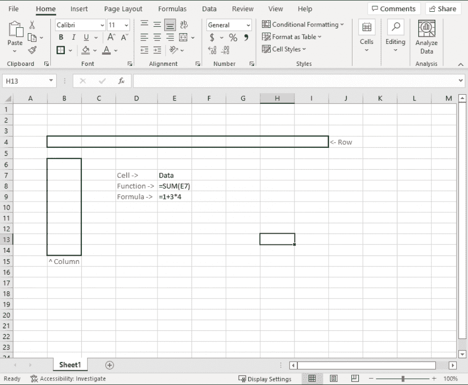
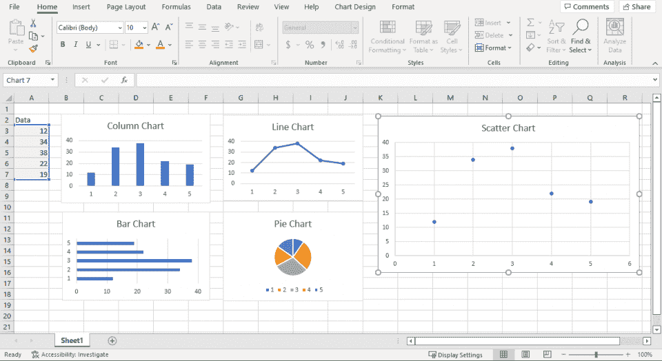

# 下载 Excel 备忘单 PDF:[函数、快捷键、命令]

> 原文：<https://hackr.io/blog/excel-cheat-sheet>

微软 Excel 是市场上最受欢迎的 T2 技能之一。无论您是刚开始学习 Excel 还是已经是专家，口袋里有一份备忘单都会有所帮助。Excel 备忘单为您提供了 Excel 中函数、命令、公式和快捷方式的简要概述，因此您可以专注于您的工作。

让我们从 Excel 中使用的一些基本术语开始，这样你就可以在无数行业中茁壮成长，包括[数据分析](https://hackr.io/blog/what-is-data-analytics)和金融。我们还将介绍电子表格的剖析、相关课程和重要函数。需要买一本吗？你可以从[微软](https://click.linksynergy.com/fs-bin/click?id=jU79Zysihs4&offerid=1160033.10005649&bids=1160033.10005649&type=3&subid=0)得到 Excel。

## **下载 Excel 备忘单 PDF**

[点击此处](https://drive.google.com/file/d/1kDzkJinJfFG4U4q-gXO3JElO4dPzY421/view?usp=sharing)下载我们的免费 Excel 备忘单 PDF。

### **基本术语**

在查看函数和命令之前，请复习您的基本词汇，以完全理解 Excel 如何设置数据格式。

| 动子 | 工作表中当前活动的单元格 |
| 细胞 | 工作表中可以包含数据、文本或公式的单个框 |
| 圆柱 | 工作表中的一组垂直单元格。列由字母(A、B、C 等)标识。) |
| 公式 | 对工作表中的值执行计算的一组指令 |
| 功能 | 预定义的公式用于执行标准计算，例如对一系列值求和 |
| 排 | 工作表中的一组水平单元格。行由数字(1、2、3 等)标识。) |
| 工作表 | 也称为电子表格；可以在 Excel 中输入的列和行的网格 |

### Excel 表格的剖析

### **Excel 数据类型**

作为一个电子表格程序，Excel 侧重于存储数据。下面是 Excel 经常存储的数据类型。

| 文本 | 也称为标签，文本值标识工作表中的数据或存储名称和说明等内容。例如:你好，世界！ |
| 数字 | 数字用于计算，可以格式化为货币、百分比、小数等。例如:1.12 |
| 日期/时间 | 日期和时间随着时间的推移跟踪和计算数据。例如:2022-02-02 |
| 逻辑值 | 逻辑值不是真就是假。示例:真，假 |
| 数组 | 数组公式同时对一系列单元格执行计算。示例:SUM(A1:A4) |

### 想掌握 Excel？参加这个课程。

### **常用 Excel 函数**

在 Excel 中，函数只是一个预设的公式或算法。它们有助于解析信息，并为各种用途显示信息。以下是我们的 Excel 函数列表备忘单中一些最常见的 Excel 公式。

| 总和 | 将单元格区域的值相加示例:SUM(A1:A4) |
| 阿森松岛 | 对满足特定条件的值求和。示例:SUMIFS(A1:A4，B1:B4，E1) |
| 平均的 | 计算单元格区域的平均值示例:AVERAGE(A1:A4) |
| 数数 | 计算包含数字的区域中的单元格数目示例:COUNT(A1:A4) |
| 部 | 查找单元格区域中的最小值示例:MIN(A1:A4) |
| 马克斯(男子名ˌ等于 Maximilian) | 查找单元格区域中的最大值示例:MAX(A1:A4) |
| 整齐 | 删除单元格前后的所有空白。示例:修剪(A1) |
| 如果 | 检查条件是否满足，如果满足则返回一个值，如果不满足则返回另一个值。例如:IF(A1='Yes '，true，false) |
| 连锁的 | 将多个单元格的值合并到一个单元格中。示例:连接(A1，B1) |
| 价值 | 将存储在文本中的数字转换为整数。示例:值(B1) |
| 部 | 查找集合中的最小值。示例:MIN(A1:O1) |
| 马克斯(男子名ˌ等于 Maximilian) | 查找集合的最大值。示例:最大值(A1:O1) |
| 适当的 | 用正确的大小写设置文本格式；从其他来源导入数据时非常有用。示例:正确(A1) |
| 天花板 | 将数字向上舍入到第一个有效数字，例如 39.1 到 39 或 40。示例:天花板(A1，4) |
| 地面 | 将数字向下舍入到第一个有效数字，例如 39.12 到 39.1 或 39。示例:楼板(A1，4) |
| 低输入联网（low-entry networking 的缩写） | 返回字符串中的字符数，用于数据验证。示例:LEN(A1) |
| 现在 | 获取当前日期和时间。请注意，它将返回您所在系统的时间。示例:现在() |
| 今天 | 类似于现在，但这只是给出了日期，而不是日期和时间。也可以使用日()、月()和年()。例如:今天() |

### **高级 Excel 函数备忘单**

这些高级的 Excel 函数可能有点难以使用，但它们是处理和分析数据的复杂方法。

| VLOOKUP | 在表格最左边的列中查找值，并从另一列返回相应的值示例:VLOOKUP("Text "，A1:C4，2，FALSE) |
| 指数 | 基于行号和列号而不是查找值执行查找示例:INDEX(A1:A4，1，1) |
| -赎金 | 在表格的首行查找值，并从表格的另一行返回相应的值示例:HLOOKUP("Text "，A1:C4，2) |

### **Excel 快捷方式**

快捷方式是提高生产力的好方法。一旦捷径成为一种习惯，你会更快地找到更简单的任务。以下是一些最常用的键盘快捷键，可以帮助您在 Excel 中更快地工作。

| 第二子代 | 编辑活动单元格。 |
| F5 | 转到工作表中的特定单元格。 |
| CTRL +箭头 | 移动到工作表数据的边缘。 |
| Shift + F11 | 插入新工作表。 |
| Alt + = | 对单元格求和。 |
| Ctrl + Shift + "+" | 插入新的行/列。 |
| Ctrl + "-" | 删除行/列。 |
| Ctrl + "* " | 选择所有包含公式的单元格。 |
| Ctrl +' | 从单元格上方复制值。 |
| Alt + Enter | 在单元格中插入换行符。 |

### **Excel 命令**

除了快捷方式之外，Excel 还有许多内置命令，可以使用快捷键或功能区来访问这些命令。以下是一些最常见的。

| 选择性粘贴 | 打开选择性粘贴对话框，允许您选择如何粘贴剪贴板中的数据 |
| 格式刷 | 从一个单元格复制格式，并将其应用到另一个单元格或单元格区域 |
| 填充手柄 | 允许您使用符合某种模式的数据快速填充单元格区域 |
| 自动求和 | 自动计算选定单元格区域的总和 |
| 迷你图 | 在单个单元格中创建数据的小型图形表示 |

### **Excel 图表**

不是所有的东西在一系列的列和行中都是可读的。当你需要人类可读的东西时，你需要一个图表。Excel 提供了几种创建图形和图表的方法。以下是一些最常见的。

| 柱形图 | 用于并排比较数据点。 |
| 条形图 | 用于并排比较数据点。 |
| 折线图 | 用于显示一段时间内的趋势。 |
| 饼图 | 用于显示百分比或比例。 |
| 散点图 | 用于显示数据点之间的关系。 |

### **提示和技巧**

最后，这里有一些提示和技巧可以帮助您在 Excel 中更快地工作。

1.  了解如何使用键盘快捷键。键盘快捷键可以节省您在 Excel 中工作的大量时间。按 CTRL+C 将复制选定的单元格，而 CTRL+V 将粘贴它们。
2.  填写相似值时使用自动填充功能。Excel 中的自动填充功能对于填充数据系列非常方便。如果您有一个月的列表，您可以使用“自动填充”来自动填充该月的日期。
3.  使用条件格式增加工作表的可读性。条件格式允许您突出显示符合特定条件的单元格。您可以使用条件格式来突出显示所有包含大于 10 的值的单元格。
4.  使用数据有效性来确保您的工作表包含正确的数据类型。您可以使用数据验证来确保单元格只包含数字，或者只包含日期。
5.  记住最常用和最有用的公式。公式是 Excel 中最强大的功能之一，但是需要一些时间来学习。
6.  考虑使用宏。宏是一些小程序，您可以创建它们来自动执行 Excel 中的任务。您可以创建一个在打开工作簿时自动插入当前日期的宏，或者创建一个自动保存和关闭文件的宏。
7.  熟悉数据透视表。数据透视表是汇总大量数据并对其进行排序的好方法。
8.  不要害怕滤镜。过滤器允许您仅查看您想要查看的数据。例如，您可以仅使用筛选器来查看特定月份的数据。

## **结论**

一个基本的 [Excel](https://www.microsoft.com/en-us/microsoft-365/p/excel/cfq7ttc0hr4r?ranMID=24542&ranEAID=aqAWIo/Xdy8&ranSiteID=aqAWIo_Xdy8-upMKTFto6o7xpgRi91g2Jg&epi=aqAWIo_Xdy8-upMKTFto6o7xpgRi91g2Jg&irgwc=1&OCID=AID2200057_aff_7593_1243925&tduid=%28ir__whxy6e0nukkfbyg1hwqrsmyb6m2xqwqpm9quhxya00%29%287593%29%281243925%29%28aqAWIo_Xdy8-upMKTFto6o7xpgRi91g2Jg%29%28%29&irclickid=_whxy6e0nukkfbyg1hwqrsmyb6m2xqwqpm9quhxya00&activetab=pivot:overviewtab&ranMID=24542&ranEAID=jU79Zysihs4&ranSiteID=jU79Zysihs4-zaCiIAIgykJ3keyY0CEZHg&epi=jU79Zysihs4-zaCiIAIgykJ3keyY0CEZHg&irgwc=1&OCID=AID2200057_aff_7593_1243925&tduid=%28ir__cy1p6euogskfbxiyby3dbext9f2xcg9gh6kng9mj00%29%287593%29%281243925%29%28jU79Zysihs4-zaCiIAIgykJ3keyY0CEZHg%29%28%29&irclickid=_cy1p6euogskfbxiyby3dbext9f2xcg9gh6kng9mj00) 备忘单或 Excel 命令备忘单只能做这么多。它提供了一种从零开始构建一切的快速替代方法，并帮助用户快速入门。但是，所有电子表格用户都应该学习 Excel 的基础知识。一旦您理解了这些功能，您应该能够在上面的 Excel 备忘单中查找您需要了解的内容。

## **常见问题解答**

#### **1。Excel 中的备忘单怎么用？**

每当你需要在 Excel 中做一些特定的事情时，就使用上面的 Excel 函数备忘单。您可以查看 Excel 备忘单公式来帮助记忆，或者使用 CTRL+F 来查找 Excel 公式备忘单的特定区域。

#### **2。Excel 中的 5 个函数是什么？**

以下是五个基本 Excel 函数的快速列表:

*   VLookup 公式
*   文字分列
*   重复删除
*   数据透视表
*   串联公式

#### **3。学习 Excel 公式最快的方法是什么？**

当您开始在 Excel 中键入时，您需要的大多数公式都会弹出。只要你知道 Excel 中有哪些公式，你就应该能够在这张表上找到它们。

#### **4。Excel 的 7 个基本公式是什么？**

七个基本的 Excel 公式是 SUM、AVERAGE、MIN、MAX、COUNT、COUNTA 和 VLOOKUP。这些只是 Excel 中许多可用公式中的一部分。

**5。你从哪里得到 Excel？**

你可以从[微软](https://click.linksynergy.com/fs-bin/click?id=jU79Zysihs4&offerid=1160033.10005649&bids=1160033.10005649&type=3&subid=0)购买一份 Excel 作为独立软件，或者作为[微软 365](https://click.linksynergy.com/fs-bin/click?id=jU79Zysihs4&offerid=1160033.10004289&type=3&subid=0) 产品套件的一部分。虽然谷歌通过其强大的 sheets 服务提供了一个免费的替代品，但最初的软件有专业人士每天使用的额外功能。

**人也在读:**