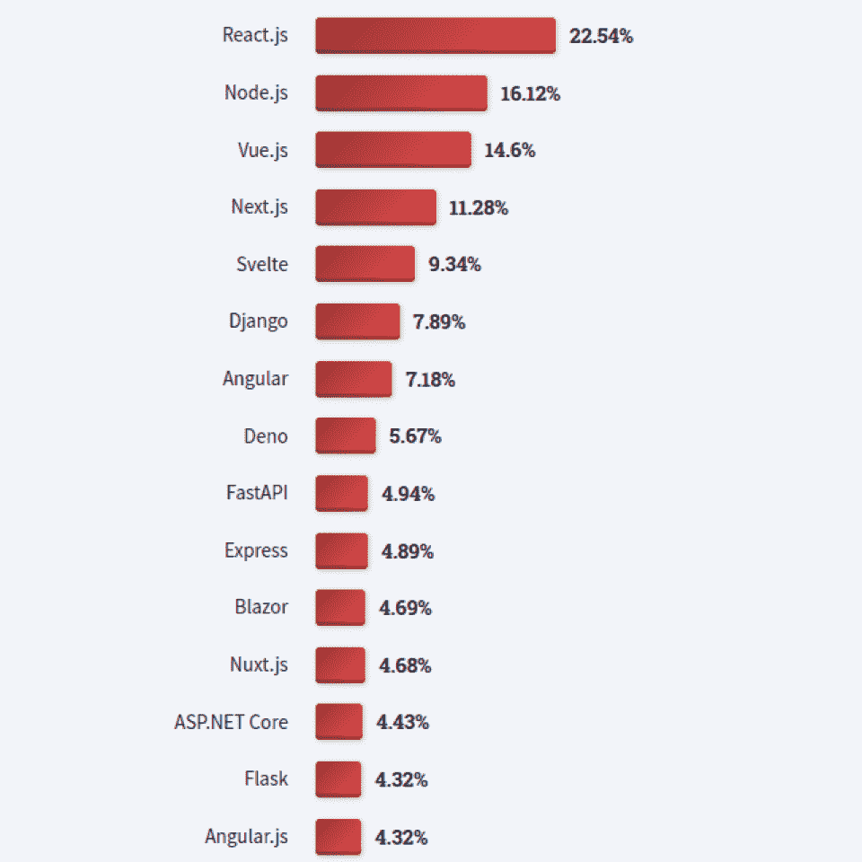
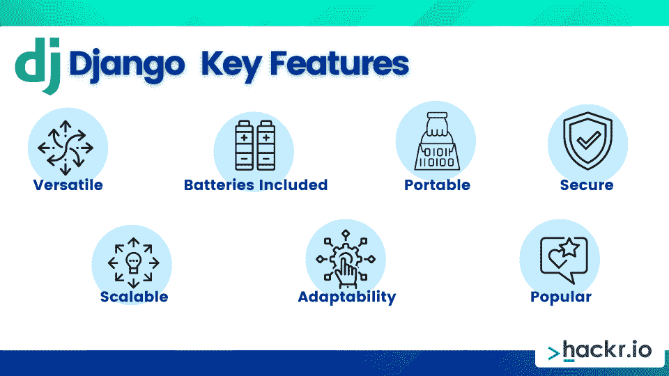
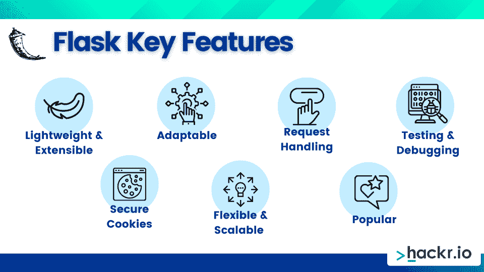
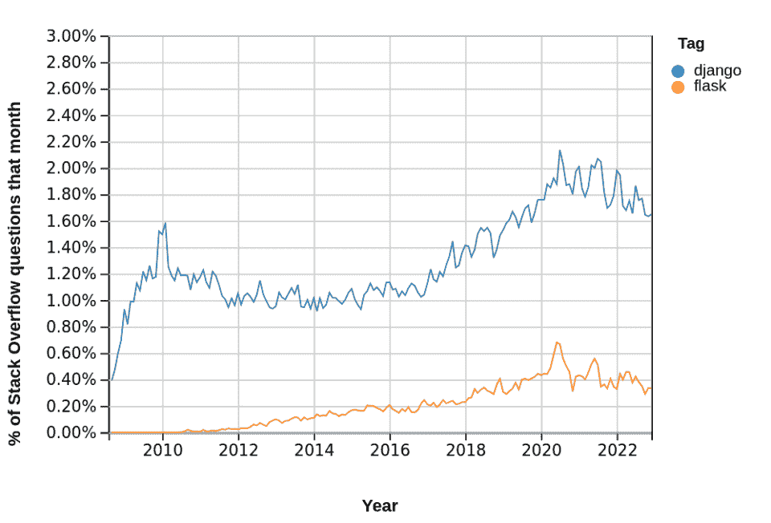

# flask vs Django:2023 年用哪个 Python Web 框架？

> 原文：<https://hackr.io/blog/flask-vs-django>

当提到 [Python 编程语言](https://hackr.io/blog/python-programming-language)时，大多数人会想到数据任务，无论是分析、数据科学、机器学习还是人工智能。但是 Python 并不只是看起来那么简单，因为它还可以用于两个流行的 web 应用程序框架，Flask 和 Django。

想要 TL-DR 吗？当然可以。虽然它们都是使用 Python 的开源 web 框架，但 Django 是一个包含*电池的*全栈框架*，*和 Flask 是一个*轻量级*但*可扩展的微框架*。

听起来很有趣？太好了！不确定什么是 web 应用程序框架？没问题！这些是帮助您以编程方式创建和管理 web 应用程序、web 服务和网站的库和模块的集合。

现在我们已经了解了这一点，让我们开始对 Flask 和 Django 进行面对面的比较。这将帮助你理解 Flask 和 Django 之间的区别，因为你试图在 2023 年选择最好的 Python web 框架。

## 姜戈 vs 弗拉斯克:正面交锋

毫无疑问，Django 和 Flask 是非常受欢迎的 web 框架，正如它们在最新的[Stack Overflow developer survey](https://survey.stackoverflow.co/2022/#most-loved-dreaded-and-wanted-webframe-want)中排名前 15 所示。你甚至可以看到 Django 击败了 Express，Flask 领先 Angular.js。

*Django & Flask 是 Top 15 框架:* [*栈溢出开发者调查*](https://survey.stackoverflow.co/2022/#most-loved-dreaded-and-wanted-webframe-want)

现在我们知道这两个 [Python 框架](https://hackr.io/blog/python-frameworks)在 web 开发人员中很流行，让我们在我们的 Flask Django 比较表中弄清楚 Django 和 Flask 的区别。

| 姜戈 | **烧瓶** | **上市年份** |
| 2005 | 2010 | **架构** |
| 模型视图模板(MVT) | WSGI 的包装器 | **框架类型** |
| 全栈 | 微观框架 | **工作方式** |
| 整体的 | 多样化的 | **灵活性** |
| 低的 | 高的 | **使用信息技术的公司** |
| Spotify，Instagram，Dropbox，Pinterest，Mozilla，YouTube，NASA，国家地理 | 网飞、Reddit、优步、Lyft、Zillow、Patreon、Airbnb、麻省理工学院 | **GitHub 明星** |
| 68.4 千 | 61.7 千 | **开源** |
| 是 | 是 | **API 支持** |
| 不 | 是 | **数据库支持** |
| 内置 ORM 并支持 SQLite、PostgreSQL、MySQL、MariaDB 和 Oracle | 依赖 SQLAlchemy 或其他 ORM 扩展 | **引导工具** |
| 是(Django-管理) | 不 | **模板引擎** |
| 姜戈模板语言(DTL) | Jinja2 | **授权** |
| 帐户管理和会话 | 饼干 | **多页应用** |
| 是 | 否(仅单页) | **动态 HTML** |
| 是 | 不 | **第三方应用支持** |
| 是 | 不 | **虚拟调试器** |
| 不 | 是 | **测试支架** |
| Yes (unittest) | Yes (unittest) | **表格** |
| 内置的 | 需要 Flask-WTF 扩展 | **URL 分配器** |
| 控制器正则表达式 | 安静的 | 什么是 Django？ |

## 以爵士乐吉他手坦哥·雷恩哈特命名(不是昆汀·塔伦蒂诺电影！)，Django 框架是 2005 年发布的基于 Python 的全栈 web 应用框架，帮助开发者轻松创建复杂的数据库支持的网站和应用。

Django 有时被称为“有期限的模糊预算”框架，它因超快速开发而受到青睐。作为一个全栈的 web 应用程序框架，它采用一种“包含电池”的方法，让开发人员专注于构建您的 web 应用程序。

通过一个*敏捷*开发过程，Django 框架处理组织内容、站点地图、客户信息和其他“基本”功能，让你专注于快速构建你的应用。Django 开发也非常枯燥(**D**on t**R**EPE at**Y**yourself)，所以希望重用组件并利用内置特性，比如登录、数据库连接、数据库 CRUD 操作等等。

**Django 的主要特点**

### ****

多用途:您可以使用 Django 构建各种应用程序，如内容管理系统(CMS)、社交网站，甚至科学计算平台

*   **包含电池:**捆绑了许多有用的功能，包括带有 Memcached 的缓存框架、内容管理、站点地图、RSS、认证等等
*   可移植性: Django 是用 Python 编写的，提供了在任何平台上运行的可移植性
*   **安全:** Django 捆绑了强大的用户认证系统，有助于避免常见的安全问题，如 SQL 注入、点击劫持、跨站脚本等等
*   **可伸缩:**结合独立层和 DRY 原则，代码重用&维护使可伸缩性没有问题
*   **适应性:**支持多种格式，包括 JSON、HTML、XML 等等
*   热门:像 Spotify、Instagram、Dropbox、Pinterest、Mozilla、YouTube、NASA 和国家地理这样的大公司都在他们的技术栈中使用 Django
*   **什么是烧瓶？**

## Flask framework 于 2010 年推出，由阿明·罗纳彻开发，是一个基于 Python 的微框架，对外部库的依赖性最小，允许开发人员灵活选择他们喜欢的设计模式、数据库、插件等。

最初，开发 Flask 是为了试验集成 *Werkzeug* WSGI (Web 服务器网关接口)工具包和 *Jinja2* 模板库。现在，Flask 是一个轻量级和可扩展的成熟框架，它不采用“包含电池”的方法。这意味着开发者可以搜索他们需要的扩展或插件，而不需要额外的权重。

有人会说 Flask 非常*python 化*，这反映在一个简单的学习曲线上。当您构建历史悠久的 *Hello World* web 应用程序时，这一点尤其明显，该应用程序只需要几行代码。

**烧瓶主要特征**

### ****

轻量级的&可扩展的:开发人员拥有对应用架构、库和扩展的独立性和控制权，以及简洁的 API

*   适应性强:易于使用任何工作方式，适合有经验的开发人员
*   **请求处理:**支持 HTTP 和 RESTful 请求
*   **测试&调试:**集成单元测试&调试器允许快速调试和开发
*   **安全 cookie:**HTTP 请求属性提供安全性并防止未经授权的访问
*   **灵活&可伸缩:**对 WSGI 模板的支持考虑到了灵活性和可伸缩性
*   受欢迎:被网飞、Reddit、优步、Lyft、Zillow、Patreon、Airbnb 和麻省理工学院等大公司使用
*   **寻找学习 Flask 的方法？结账**

**[最好的烧瓶教程](https://hackr.io/tutorials/learn-flask)**

姜戈 vs 弗拉斯克:优点&缺点

## **姜戈优点&优点**

| 姜戈的缺点&缺点 |  |
| 轻松快速地启动并运行 | 整体风格可能很复杂 |
| 全面易用的管理用户界面 |  |
|  |  |
|  | 简单项目的功能太多 |
|  |  |
| 面向全球应用的国际化系统 | 基于正则表达式的 URL 调度很复杂 |
| 支持动态 HTML 页面 | 易于遵循的文档 |
| 

*   API 请求的速率限制

 |   |
| 

*   URL 模型定义帮助

 |   |
| 

*   出色的内置模板设计

 |   |
| **烧瓶优点&优点**

*   **烧瓶缺点&缺点**

 |  |

|  | 维护可能很困难 |
|  | 最低可行产品(MVP)可能很慢 |
| 具有完全控制访问的灵活性 |  |
| 

*   缺乏安全和授权功能

 |  |
| 允许架构和图书馆实验 | 

*   不支持多页应用

 |
| 非常适合小型项目 | 缺少对象关系映射(ORM) |
| 功能简单的小代码库 | 

*   快速简单地构建原型

 |
|   | 简易 URL 路由工具 |
|   | 易于集成数据库 |
|  

*   **什么时候用 Flask vs Django？**

 | 你还在疑惑:Django 和 Flask 哪个好？这里没有明确的答案，因为您可以自由地使用 Flask 或 Django 来构建您的下一个 web 应用程序，但是它可以帮助您了解适合这两种 Python 框架的最佳项目类型和场景。 |
| **你应该在需要的时候使用 Django:**

*   在严格的期限内处理大型项目(多页)

 | 使用内置功能并获得访问支持以加速开发 |
| 构建需要授权的安全项目 | 未来可以选择扩大规模或使项目变得更加复杂 |

## 使用本地 ORM 支持或 API 后端创建 web 应用程序

**需要时应使用烧瓶:**

从事较小的项目(单页)

*   有各种数据库支持，包括 NoSQL
*   灵活自由地选择库和扩展
*   拥有 API 支持或希望在未来添加新的扩展
*   创建静态网站、快速原型和 RESTful web 服务
*   当考虑 Django 与 Flask 的对比时，考虑一下您是 Python 还是 web 框架的新手会有所帮助。无论是哪种情况，您可能会发现从 Flask 开始比从 Django 开始更容易，后者的学习曲线更陡峭，创建 web 应用程序的方法也更严格。

如果您计划在未来构建复杂的应用程序，那么学习 Django 是非常值得的，因为它为您提供了广泛的在线资源。如果你选择 Django，你可以依靠一个活跃的 Django 开发者社区，如果你发现自己陷入困境，他们会随时提供帮助。

*   当你考虑到 Django 在 StackOverflow 上被标记了超过 [30 万个问题](https://stackoverflow.com/questions/tagged/django)，相比之下 Flask 大约有[50 万个问题，这一点尤为明显。](https://stackoverflow.com/questions/tagged/flask)
*   尽管存在这种差异，但在过去 10 年中，这两种框架在 StackOverflow 问题中的趋势都是向上的，这表明它们在 web 开发人员中越来越受欢迎。
*   
*   *姜戈&烧瓶呈上升趋势在提到:*[栈溢出 ](https://insights.stackoverflow.com/trends?tags=django%2Cflask)
*   **结论**

2023 年，Python 开发人员可以利用他们的 Python 编码技能，而不仅仅是数据科学、机器学习或人工智能。所以如果你对 web 开发感兴趣，你应该看看流行的 Python web 应用程序框架，Flask 和 Django。

这些库和模块的集合是以编程方式创建网站、web 应用程序和 web 服务的绝佳方式。为了帮助您决定选择哪一个[框架](https://hackr.io/blog/what-is-frameworks),本文对 Flask 和 Django 的关键特性、优缺点和最佳用例进行了比较。

有了 Django，您可以获得一个全栈的 web 框架，它采用了一种“包含电池”的方法，非常适合需要安全性和可伸缩性的大型项目。假设您需要更多的灵活性。在这种情况下，Flask 是一个完美的选择，因为它是一个轻量级和可扩展的微框架，非常适合那些现在和将来都需要添加特定库的小型项目。

想要了解更多关于 Django 的信息吗？结账

**[最好的姜戈书籍](https://hackr.io/blog/django-books)**

**常见问题解答**

## **1。Flask 比 Django 容易吗？**

大多数人发现 Flask 比 Django 更容易学习，因为它提供了更大的灵活性和不太死板的工作风格。虽然 Django 的学习曲线更陡，但如果你能构建安全的、可伸缩的、复杂程度会增加的 web 应用，它会有回报的。

**2。我该先学 Django 还是 Flask？**

这里没有正确的答案。如果您是 Python 新手，您可能会发现在 Django 之前学习 Flask 更容易。一旦你掌握了基础知识，你会发现以后更容易过渡到 Django。另一方面，如果您在 Python 或 web 开发方面更有经验，您可能更喜欢直接进入 Django。

**3。Django vs Flask，哪个更好？**

没有谁比谁更好或更差，但它们可能更适合特定的用例。例如，Flask 适用于较小的项目，这些项目需要在现在和将来灵活地添加特定的库。Django 非常适合需要安全性、可伸缩性和内置特性的大型项目。

## **4。哪个更好？初学者用 Flask 还是 Django？**

#### 如果您是 Python 或 web 开发的初学者，您可能会发现 Flask 是一个更容易上手的地方，因为它的代码库更小，学习曲线也不太陡，所以可以更快地启动您的项目。

**人也在读:**

#### **2\. Should I Learn Django or Flask First?**

There’s no correct answer here. If you’re new to Python, you may find it easier to learn Flask before Django. Once you have the fundamentals, you’ll find it easier to transition to Django later. On the other hand, if you’re more experienced in Python or web development, you might prefer to dive right into Django.

#### **3\. Django vs Flask, Which Is Better?**

Neither is better or worse than the other, but they may be better suited to specific use cases. For example, Flask is suitable for smaller projects that need the flexibility to add particular libraries both now and in the future. Django is great for large projects that require security, scalability, and built-in features. 

#### **4\. Which Is Better? Flask or Django For Beginners?**

If you’re a beginner in Python or web development, you’ll likely find that Flask is a more accessible place to start, as it’s much quicker to get your project off the ground due to a smaller codebase and a less steep learning curve.

**People are also reading:**