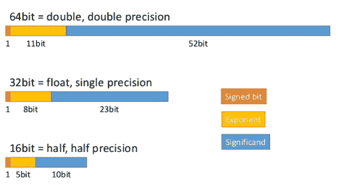

# float 与 double 数据类型之间的差异[更新]

> 原文：<https://hackr.io/blog/float-vs-double>

Float 和 double 是[编程语言](https://hackr.io/blog/what-is-programming-language)使用的原始数据类型，用于存储浮点实数(十进制数),如 10.923455、433.45554598 等。本文将向您详细介绍 float 和 double 数据类型之间的区别。

## Float vs Double:你应该知道的区别

在计算世界中，数字数据可以用两种方式表示——定点和浮点运算。定点数据就是我们所说的带有某种比例因子的整数。例如，3.14 将是 314，缩放因子为 100，或者 2.3456 可以舍入到 2.345，以实现固定的位数。这种方法损害了结果的准确性，并不适用于所有情况。

因此，使用浮点表示进行高精度计算更容易也更准确(我们将在下一节中看到)。


如果你想从算术的角度来阅读关于浮点数的内容，你可以阅读这篇[维基百科文章](https://en.wikipedia.org/wiki/Floating-point_arithmetic)。在这篇博客中，我们重点介绍了编程语言如何使用这些浮点数来获得精度值和范围。

### **为什么要用浮点数据？**

#### 混合精度

在混合精度中，单精度值可用于复杂计算。你可以把它看作是准确性和记忆效率的权衡。通过结合 float16(半精度)和 float32(单精度)，应用程序可以提高应用程序性能和数据传输速度。半精度是由微软和 Nvidia 定义的，以节省空间和浮点计算的复杂性。

但是，并不总是这样。

#### 任意精度

我们使用浮点和整数数学进行精确计算，计算结果仅受系统可用内存量的限制。这种类型的计算称为任意或无限精度计算。任意精度的一个最重要的应用是公钥密码学，在这种情况下，使用具有数百位数字(指数)的数字进行计算是常见的。

另一个类似的精度类型是[符号计算](https://en.wikipedia.org/wiki/Computer_algebra)，我们使用符号的精确值(如 PI)进行复杂计算。



### **浮动双**

Double 比 float 更精确，可以存储 64 位， *double 是 float 可以存储的位数的*。

Double 更精确，对于存储大数，我们更喜欢 double 而不是 float。比如存储一个公司 CEO 的年薪，double 会是更准确的选择。所有三角函数如 sin，cos，tan，数学函数如 sqrt 都返回双精度值。然而，加倍是有代价的。除非我们确实需要精度达到小数点后 15 或 16 位，否则在大多数应用中我们可以坚持使用浮点数，因为 double 更昂贵。存储一个变量大约需要 8 个字节。我们将“F”或“F”附加到数字上，以表明它是浮点类型，如果失败，它将被视为双精度类型。

下表给出了浮点和双精度的内存要求和范围

| 浮点型 | 内存需求 | 范围 |
| 浮动 | 4 字节 | 3.40282347E+38F，即 6-7 位有效数字 |
| 两倍 | 8 字节 | 1.79769313486231570E+308，即 15-16 位有效数字 |

在所有编程语言中，Float 和 double 的功能都是一样的。例如，在 Java 中，对于不涉及实际数字的操作，两者都会抛出 NumberFormatException。请注意，编译器不会检测到此异常。

```
String sname = "DR";
float fname = Float.*parseFloat*(sname);
System.*out*.println(fname/num1); // Leads to NumberFormatException at runtime
Dividing float and double by zero will give an output of ‘Infinity’ in Java.
double num2 = 344.55555555;
System.*out*.println(num2/0);

```

这不会导致错误，但是是无效操作(n an)。点击了解更多关于 NaN [的信息。](https://docs.oracle.com/javase/specs/jls/se7/html/jls-4.html#jls-4.2.3)

***我们会在哪里使用精度值？***

几乎无处不在！

如果你处理少量数据——比如平均分数，三角形面积等……默认情况下使用 double。但是，如果您处理大量涉及高精度的数字，并且任何舍入都可能改变结果，如三角学、人类头发的宽度、神经网络、电子自旋、位置坐标等，了解浮点型和双精度型之间的差异是很重要的。虽然 Java 鼓励你使用 double，但是在像 C 这样的语言中，你可以灵活地使用任何你想要的。

一个典型的 java 声明应该是这样的

```
float number1 = (float) 12.211111111111;

```

现在，如果你不进行类型转换，你的代码将不能在 Java 中编译。当你这样做的时候，在打印数字的同时，你只会得到小数点后的 6 位数字。

考虑一个简单的两个数相乘的程序——用 c 写的 1.42222*234.56433。

这可能是原子质量或重力之类的任何东西，必须保持所有有效数字的完整性！

```
float num1 = 1.42222*234.56433;
double num2 = 1.42222*234.56433;
printf("%f", num1);
printf("%.10f", num2);

```

num1 返回值 333.602081，而声明为 double 的 num2 返回 333.6020814126，精确到 10 位，如 printf 语句中所述。我们也可以将一个 float 打印成 double，反之亦然，这完全取决于我们如何编写 printf 语句。写%f 将去掉一些有效的数字，而当我们指定数字的数目时，直到那个数字的整个值将被打印出来。要打印指数形式的值，应该使用“%e”。

在 Java 中，正如我们前面看到的，只有当我们 typecast 为(float)时，值才会被打印出来。默认情况下，Java 将所有高精度十进制值视为 double。

```
float values;
double doubes;
values = (float) (1.42222*234.56433);
doubes = 1.42222*234.56433;
System.*out*.println(values);
System.*out*.println(doubes);

```

将分别产生 333.60208 和 333.6020814126。

**逻辑比较**

我们使用操作符 =和>来比较 float 和 double 值。对于整数，我们可以使用！=和=但是这里我们不这样做，因为后面的运算符不太精确。

显然，当使用 float 时，精确的比较是不可能的，因为精度只有 5-6 位。这些数字中的任何差异都不会被捕获。

```
float number1 = (float) 3.1434343;
float number2 = (float) 3.1434343333;
 if(number1 == number2)
 System.*out*.println("equal");
 else
 System.*out*.println("not equal");

double number3 = 3.1434343;
double number4 = 3.1434343333;
 if(number3 == number4)
 System.*out*.println("equal");
 else
 System.*out*.println("not equal");

```

你认为输出会是什么？

你可能已经猜到了——第一个会给出“相等”，而第二个会给出“不相等”。

为了避免每次用 float 写数字时的类型转换，我们可以在数字后面加上 f。举个例子，

```
float number1 = 3.1434343f;

```

### **大小数**

。NET 和 Java 也有比 double 精度更高的 Decimal/BigDecimal 类。对于金融和银行应用程序等更精确的计算，使用十进制是因为它可以进一步减少舍入误差。

### **长双**

一些编程语言，如 C，使用长 double，比 double 更精确。查看 C 的不同[数据类型。](https://hackr.io/blog/data-types-in-c)

### **浮点和双精度除法**

与乘法或加法一样，除法将给出更精确的两位数。考虑这个简单的例子

```
float number1 = 3.1434343f;
double number2 = 3.1434343;
float divide = 22/7f;
// first let us print the result as double
double result1 = number1/divide;
/* the same result but now it is a float value,
note the difference in significant digits */
float result3 = number1/divide;
// the double value
double result2 = number2/divide;
System.*out*.println(result1); // 1.0001837015151978
System.*out*.println(result3); // 1.0001837
System.*out*.println(result2); // 1.000183662587488

```

当分母大于分子，并且结果是小分数时，如-

```
float pie = 22/7f;
float pieby4096 = pie/4096;
double dpie = 22/7d;
double dpieby4096 = dpie/4096;
System.*out*.println("Float Pie is - " + pie);
System.*out*.println("Double pie is - " + dpie);
System.*out*.println("Float Pie divided by 4096 - " + pieby4096);
System.*out*.println("Double Pie divided by 4096 - " + dpieby4096);
double pieby4096usingfloatpie = pie/4096;
System.*out*.println("Float Pie divided by 4096 with result as double - " + pieby4096usingfloatpie);

```

查看结果–

```
Float Pie is - 3.142857
Double pie is - 3.142857142857143
Float Pie divided by 4096 - 7.672991E-4
Double Pie divided by 4096 - 7.672991071428571E-4
Float Pie divided by 4096 with result as double - 7.672990905120969E-4

```

注意最后 3 个结果。我们选择用来划分数字的饼图对结果的有效数字产生了影响。这正是我们所说的精度！

### **用字符串串联**

在 Java 中，可以使用+运算符将字符串与 double 和 float 连接起来。

```
String str = "test";
float flo = 23.2f;
String concat = str + flo;
double dou = 3.45555555;
concat += dou;
System.*out*.println(concat); // result will be test23.23.45555555
```

### **Float vs Double:头对头比较**

既然我们知道了什么是浮点型和双精度型，那么创建一个差异表来快速参考和总结就很好了。

| **浮动** | **Double** |
| 单精度值 | 双精度值 |
| 最多可存储 7 位有效数字 | 最多存储 15 位有效数字 |
| 占用 4 个字节的内存(32 位 IEEE 754) | 占用 8 个字节的内存(64 位 IEEE 754) |
| 如果超过 7 位数，数值四舍五入 | 7-15 位数字按原样存储 |
| With Java, one needs to typecast to declare float –float fnum = 2.344f或者float fnum = (float) 2.344; | Double is the default decimal point type for Java.双 dnum = 2.344 |
| 如果不需要很高的精度，程序只需要存储大量的十进制数，那么 float 是一种经济有效的存储数据的方法，可以节省内存。 | Double 更贵，占用空间更大，在需要更高精度时更有效。例如，货币兑换，财务报告和交易，科学计算等… |

[掌握数据结构&使用 C 和 C++](https://click.linksynergy.com/link?id=jU79Zysihs4&offerid=1045023.2121018&type=2&murl=https%3A%2F%2Fwww.udemy.com%2Fcourse%2Fdatastructurescncpp%2F) 算法

## **结论**

这就是 Double vs Float 的完全区别；虽然从 float 到 double 和 double 到 float 的类型转换是完全允许和有效的，但在代码中应该小心地完成。如果转换太频繁，精度可能会降低，并且您会失去使用 double 的全部目的。

在开发的初始阶段，决定并定义您是希望使用 float 还是 double，并在整个应用程序中保持不变。了解特定数据如何存储在数据库中也是一个好主意。如果你的应用程序需要高性能，使用 float，因为对于大数据集，double 会使你的程序变慢。如果您的数据需要更高的精度，请使用 double。

**人也在读:**