# 2023 年 11 个最佳在线免费编码训练营[更新]

> 原文：<https://hackr.io/blog/free-coding-bootcamps>

如果你一直想学习如何编码，你可能会很高兴知道编程是你可以免费学习的事情之一。你可以通过与编码相关的网站和资源，通过 YouTube，甚至一些免费的 Udemy 课程来自学。然而，这并没有结束！现在，你可以加入一个免费的编码训练营来开始你的领域。

加入免费编码训练营很容易。对他们中的一些人来说，你所需要做的就是注册你的电子邮件地址，然后你就可以加入了。其他人可能会要求你提交一份申请，然后坐下来进行面试，因为训练营是为那些在科技界没有得到充分代表的人设计的。

如果你想了解更多关于编码训练营的信息，它们是关于什么的，以及它们如何帮助你，你可以在这里找到你需要知道的。本指南还将列出今年一些最好的免费编码训练营。

## 什么是编码训练营？

一个编码训练营只教最本质的方面 [编程](https://hackr.io/blog/what-is-programming) 等技术技能。这些项目中教授的技能与现实世界的项目和行业需求相匹配，因此您可以立即在专业水平上应用您的技能。

## 编码训练营结束后你能挣多少钱？

毫无疑问，你可以从新兵训练营学到很多相关的技能。但是，更重要的是，你会得到比没有编码训练营高得多的薪水，因为你没有经验。

即使作为一名新生，当你在训练营后直接加入一个项目时，你也很可能获得大约[【65k】-70k](https://www.coursereport.com/blog/web-developer-salaries-after-coding-bootcamps#:~:text=In%20Course%20Report's%20most%20recent,an%20alumni's%20pre%2Dbootcamp%20salary.)。但这只是乐观的景象。你需要了解有助于你找到工作的合适的训练营。有一些训练营可以帮助你找到工作，而其他的至少可以给你指明正确的方向。

## **训练营 vs 课程:哪个更好？**

当我们提到课程时，它可以是自学课程，也可以是学院的课程(在线或离线)。课程通常提供关于编程语言或技术的深入知识。课程很费时间，涵盖了学习语言所需的一切。如果你需要参加认证或深入的主题研究，课程可能是一个不错的选择。

另一方面，训练营会带你更快、更有条理地到达目的地。你可以用实际项目来展示你的工作和承诺，这将有助于你在面试中获得优势。

训练营还能帮助你与其他人联系，建立一个网络来讨论学习中的任何问题或障碍。有时候，最简单的错误你可能看不到，但是团队成员、同辈学习者或学长可以帮助你识别。你可以接受更多的挑战，解决更复杂的问题，因为你知道你可以得到所有需要的支持。

训练营也是一个让你成长为软件开发人员的绝佳方式，随着你职业生涯的进展，你可以获得更多的工作机会。

## **如何选择合适的免费编码 Bootcamp**

你的时间是有限而宝贵的资产，你很可能不想浪费它，所以选择一个适合你的免费在线编码训练营至关重要。大多数时候，选择取决于你的个人偏好和目标。然而，当你面临选择的决定时，有一些主要因素需要考虑。

*   你有资格吗？在你入围训练营之前，你必须首先考虑你是否符合资格要求。尽管这份名单上的大多数训练营相对容易进入，但你可能仍需要满足一些要求才能获得资格——主要是因为一些项目是针对特定人群的，如特定城市或州的居民。

*   这是真正的训练营吗？你可能会被诱惑报名参加一个免费的训练营，却发现这只是一个入门课程。免费的编程入门课程是让你接触编程世界的好方法，但它们不是训练营。

*   语言**——如今有如此多的编程语言。你可能会听到很多人说** ***这个* web dev 语言比那个好。不管别人认为哪种语言最好，重要的是考虑你想学的语言。弄清楚你想做什么类型的工作，选择最适合的语言。**

 ***   训练营真的是免费的吗？ 很容易认为有些东西是免费的，因为你不需要预先付费。然而，再次(甚至三次)检查是至关重要的。有些训练营不是免费的，而是设立了延期学费，在那里你不需要预先支付任何费用，但一旦你毕业并找到工作，你可以逐步偿还所有费用。

*   还有什么可以提供的？仅仅因为你正在看的训练营是免费的，并不意味着它们都是一样的，没有独特的东西可以提供。编写代码训练营的主要目的不仅仅是教你如何快速编写代码，还有助于你为将来的 web 开发职业做好准备。找出训练营还能提供什么——他们还会教授开发人员的其他方面吗？

最后，考虑一个训练营的 **格式** 也不错。当然，你会得到一个免费的训练营，这意味着你可能会同意做出一些让步和妥协。然而，这并不意味着你必须忍受整个营地不方便或不受欢迎的形式。如果你喜欢看视频教程来学习，那就去吧。然而，如果你喜欢更实际的方法，你可能会想找其他合适的方法。

你知道编码是用来做什么的吗？[阅读我们的帖子](https://hackr.io/blog/what-is-coding-used-for)

## **最佳免费编码训练营**

有很多免费的编码训练营，名单多得让人应接不暇。这就是为什么我们决定编辑一个简短而全面的列表，列出所有可用的新兵训练营中最好的。此外，由于新冠肺炎需要自己的时间来安顿下来，在网上参加新兵训练营是一个很好的选择，以下所有内容都可以在网上找到:

[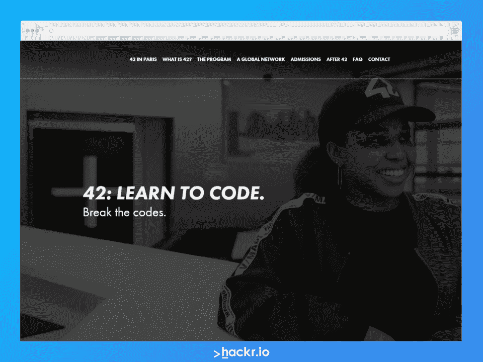](https://42.fr/en/homepage/)

**描述**

#### 42 在硅谷和法国巴黎提供面对面的免费代码训练营。

这个夏令营的班级是非传统的，因为没有老师。相反，42 通过同行代码审查和基于项目或问题的实践“边做边学”的形式来进行训练营。同行代码评审有助于培养一个紧密团结的社区，帮助学生一起学习。

值得一提的是，虽然没有老师，但有一些专业的导师，他们有必要的行业经验来帮助指导学生。

**营地亮点**

#### 得益于游戏化的课程，42 岁的学习变得更有趣、更有吸引力，学生可以获得积分，计入他们的“掌握积分”没有足够的掌握分数，学生无法进入课程的下一部分

*   来自巴黎的申请人必须参加一系列逻辑测试，以缩小申请人数
*   来自硅谷的申请者必须参加为期 28 天的高强度基础培训项目，每天都有挑战和编码练习
*   这个训练营需要一个全职学习的承诺。一些毕业生说住校可能是成功的必要条件
*   到了 42 岁，学生们可以学习软技能、团队协作和沟通。他们还可以提高解决问题的能力和创造力
*   **属性**

#### **费用:** 免费

**期限:** 为期 12 个月的强化课程(星际舰队学院)或长达 5 年的弹性课程  **地点:** 美国硅谷和法国巴黎

**要求:** 必须能够参加全日制、校内

[报名这里](https://42.fr/en/homepage/)

[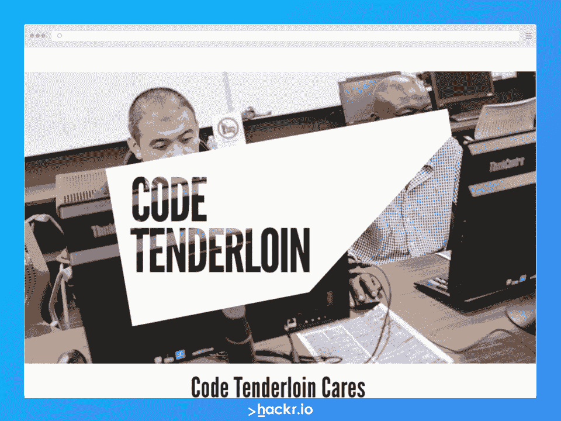](https://www.codetenderloin.org/)

**描述**

Code Tenderloin 不仅仅是一个编码训练营，它还可以作为一种催化剂，让人们在生活中做出有意义的改变。尽管这里的项目没有这个列表中的其他项目那么深入，Code Tenderloin 还是把大量的注意力放在了教授学生成功所需的软技能上。

Code Tenderloin 旨在消除阻碍人们找到安全、长期工作的障碍。这些障碍可能是缺乏软技能、资金、儿童保育费用、交通费用和法律问题。Code Tenderloin 通过支付交通和儿童保育费用来帮助学生。它还与公设辩护人的清白计划合作，如果满足某些条件，允许学生删除他们的犯罪记录。

**营地亮点**

Code Tenderloin 提供为期三天的在线工作准备研讨会，帮助学生为就业做好准备，并帮助他们提升自我认知

#### 初学代码的学生可以加入 Pre-Code Ramp 入门训练营，学习 HTML 和 CSS

*   Code Tenderloin 有两个短期项目，每个项目持续六周。Code Ramp 教授 JavaScript 和基本编程，而 Code Ramp++则深入研究 JavaScript，帮助学生为以后参加软件工程课程和训练营做准备
*   该项目与一些公司合作安排工作
*   鼓励所有人申请，不管他们的过去或背景如何
*   **属性**
*   **费用:** 免费

#### **持续时间:** 6 周代码斜坡，6 周代码斜坡++

**地点:** 里脊肉，三藩市

**要求:** 该计划旨在为三藩市贫民区的被剥夺权利者服务

[在此注册](https://www.codetenderloin.org/)

[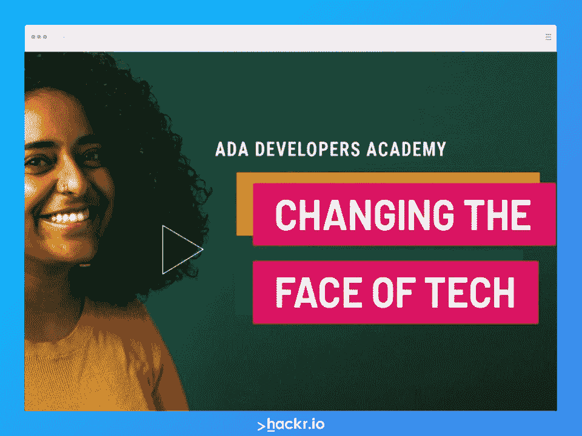](https://adadevelopersacademy.org/)

**描述**

Ada 开发者学院的名字来自阿达·洛芙莱斯，她是世界上第一位女性开发者。Ada 是一家成立于 2013 年的非营利公司，目标是让 web 开发行业更加多样化。它在网上以及亚特兰大和西雅图的校园里举办免费的编码训练营。华盛顿特区的校园将于 2023 年建成。

#### Ada 有一些具体的资格要求，在下面的要求部分讨论。此外，该营地优先接纳拉丁人、黑人、太平洋岛民、夏威夷土著人、美洲土著人、LGBTQIA+人和低收入人群。这是少数民族最好的编码训练营之一。

**营地亮点**

这个项目持续六个月，每周五天，每天六小时。学生们在成为 **全栈开发者**的道路上学习 Python、Flask、SQL、HTML 和 CSS 以及 JavaScript

六个月的课程结束后，学生们将开始为期五个月的实习，每周工作 35 小时，每小时可挣 20 美元。

#### **属性**

*   **费用:** 免费
*   **持续时间:** 一年

#### **地点:** 亚特兰大，西雅图，华盛顿特区(2023 年校园来临)， **偏远**

**要求:**

投入全日制学习的能力

项目期间在美国

必须拥有美国永久工作授权(通过公民身份或永久居留权，或通过就业授权卡)

*   必须年满 21 岁，并且是女性或性别不限的人
*   必须接受背景调查(如果你感到不舒服，你可以向 ADA 提出，因为他们可以逐案讨论背景调查)
*   [在此注册](https://adadevelopersacademy.org/)

*   [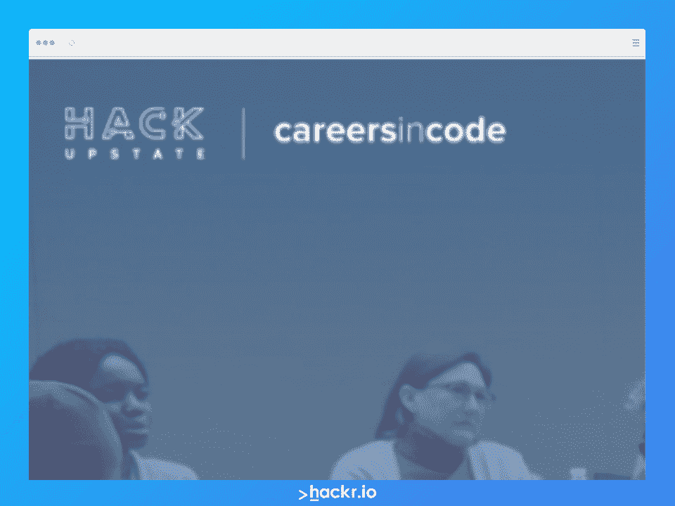](https://careersincode.org/)

**描述**

Hack Upstate's Careers in Code 成立的目的是:尽管纽约市中心很贫穷，但仍能提供平等的受教育机会。这种平等的受教育机会也可以增加该领域的就业机会。“代码职业”通过教授计算机编程来帮助消除贫困。与此同时，bootcamp 旨在支持纽约中心地区的编程行业，帮助潜在雇主找到优质工人。

**营地亮点**

训练营的课程是混合的(现场和虚拟)，晚上 5:30 到 8:30 有夜校课程

#### 从事代码职业的学生可以学习兼职成为软件开发人员。这种灵活的时间表允许学生平衡他们的其他日常责任

Hack Upstate 表示，在 2021 年 8 月报名参加 [队列](https://careersincode.org/outcomes/cohort-2/Careers-in-Code-Cohort-2-Outcomes-1-pager.pdf) 的所有人中，有 61%的人从这个为期 24 周的项目中毕业。在所有毕业的人中，有 27%在训练营结束后的 180 天内找到了工作。就业要么是实习，咨询安排，或全职职位。毕业生的工资上涨了 82%，平均起薪约为 5 万美元。

#### **属性**

*   **费用:** 免费
*   **持续时间:** 24 周兼职项目
*   **地点:** 纽约州锡拉丘兹

#### **要求:** 优先考虑来自锡拉丘兹和纽约州中部贫困地区的妇女和少数族裔

[在此注册](https://careersincode.org/)

[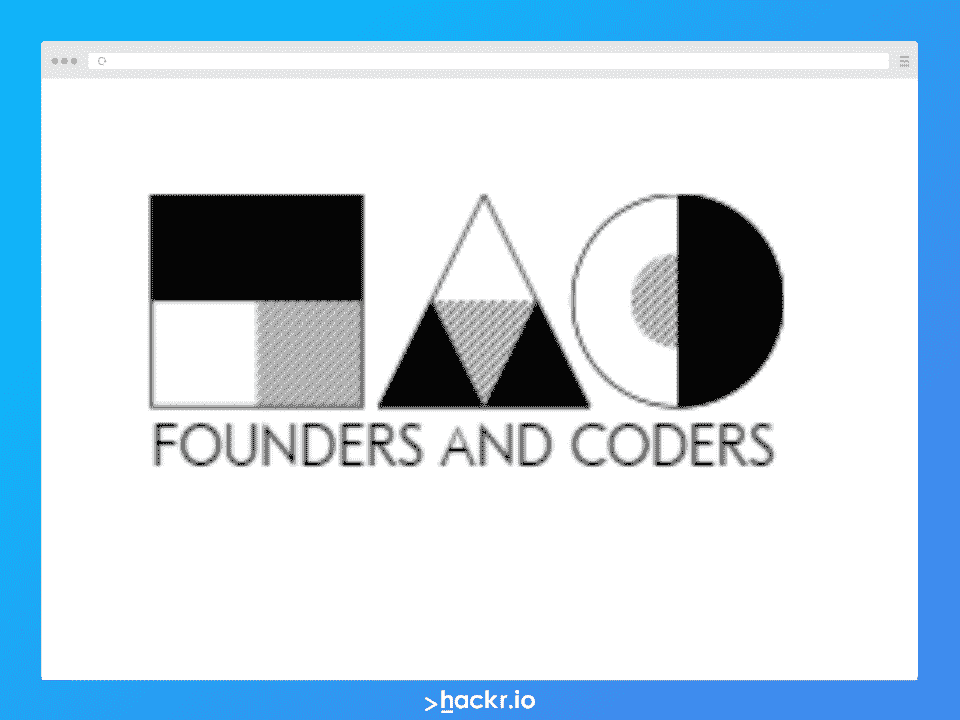](https://www.foundersandcoders.com/)

**描述**

Founders and Coders 是一家关注社区利益的非营利公司。它的主要目标是帮助人们产生影响并进入科技行业，而不管他们的背景如何。

C 提供了一个为期 16 周的全日制训练营，在那里他们可以学习 JavaScript、Node.js、项目管理的方方面面、UX(用户体验)设计的方方面面以及关系数据库。

该计划以同行指导培训为特色，学生可以学到成为全栈开发人员所需的所有知识。在这个同伴引导的项目中，学生轮流领导研讨会、管理项目和运行代码评审。

**营地亮点**

#### 学生们有机会通过创始人和程序员的非营利性应用程序开发项目“Tech for Better”构建真正的投资组合项目

训练营的毕业生被鼓励在毕业后通过自愿捐款(或通过在雇主伙伴处找到工作，该公司将支付他们的出席费用)

训练营的毕业生将在毕业后指导当前学生至少一周的时间

**属性**

#### **费用:** 免费

*   **持续时间:** 16 周全日制项目
*   **地点:** 英国伦敦
*   **要求:**

#### 必须是 18+

投入全日制学习的能力

必须在入学前完成先决条件(如 Codewars 和 freeCodeCamp)

20 分钟的面试，以确定你是否适合这个社区

[在此注册](https://www.foundersandcoders.com/)

*   [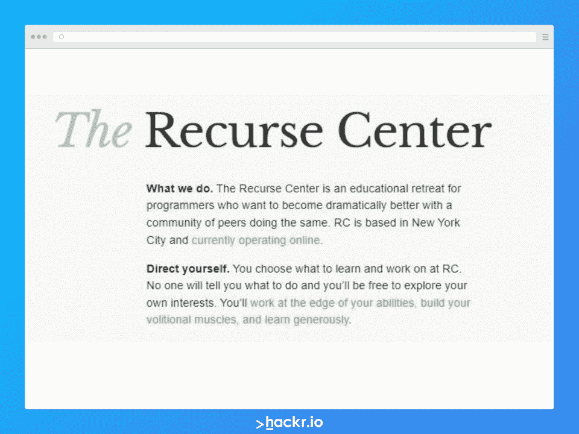](https://www.recurse.com/)
*   **描述**
*   Recurse 中心，原名“黑客学校”，宣称自己是一个程序员的教育静修所，面向那些希望和其他人一起变得更好的人。Recurse 中心已经存在了十年，并继续将聪明、灵活和勤奋的人聚集在一起。

在这个为期 12 周的免费训练营中，你可以获得编码方面的自我指导。没有老师，也没有教官。相反，这个训练营在一个促进合作和团队精神的同伴学习环境中茁壮成长。为了帮助实现这一目标，Recurse 中心为学生提供了空间、时间和自由，让他们从事自己感兴趣并充满激情的工作。

**营地亮点**

许多开源项目来到 TRC，并在学生毕业后继续很长时间

#### 来自这个训练营的广泛的校友网络使得继续任何开源项目并建立个人和职业关系变得容易

潜在的学生可以自由申请，不管他们的经验水平如何(只要他们能通过面试)

**属性**

**费用:** 免费

#### **持续时间:** 12 周

*   **地点:** 纽约，纽约
*   **要求:**
*   提交书面申请

#### 第一次面试，以确定你是否适合训练营的文化

第二次技术面试

[在此注册](https://www.recurse.com/)

[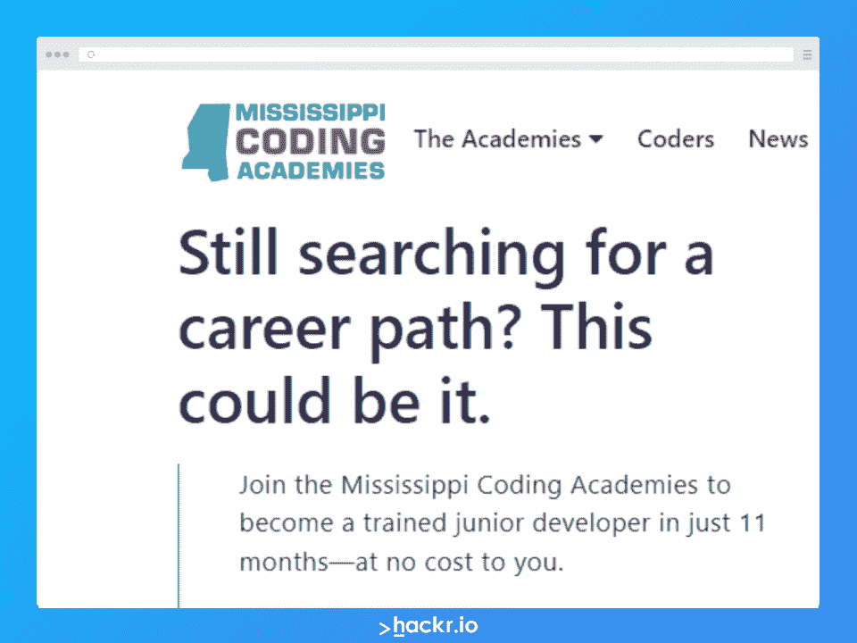](https://mscoding.org/)

*   **描述**
*   MCA 由创新密西西比州和密西西比州州长办公室于 2017 年成立，旨在提供免费的编码教育，有可能导致该领域的成功职业生涯。密西西比州编码学院的免费编程训练营是为密西西比州的居民准备的，尤其是那些弱势群体。

马华开办了长达十一个月的训练营，就像一个工作环境，你必须一周五天上课。在夏令营期间，会对当地公司进行实地考察。演讲者和导师也来自这些本地公司。完成训练营意味着你可以成为一名**全栈开发者，拥有你在这个领域起步所需的一切。**

 ****营地亮点**

位于密西西比州的多个校区:比洛克西、杰克逊、南杰克逊、斯塔克维尔

比洛克西校园训练营项目隶属于南密西西比大学

#### 退伍军人代码程序可用(一周五天，晚上两小时)

有 *雇主评估* 作为绩效评估，雇主直接反馈给程序员的项目

有一个 *工作释放* 式的项目，你可以通过成为实习生获得工作经验

**属性**

#### **费用:** 免费

*   **持续时间:** 11 个月(44 周)
*   **地点:** 美国密西西比州
*   **要求:** 必须是密西西比州居民

*   **奖励:额外付费编码训练营**

#### [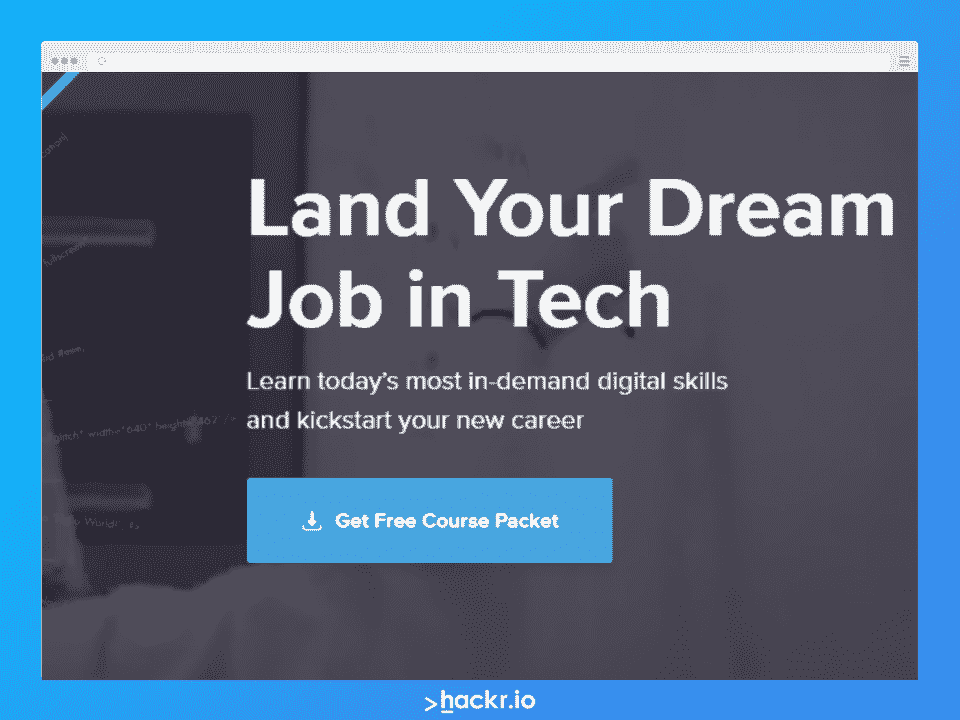](https://www.codingdojo.com/)

*   **描述**
*   编码 DOJO 是一个让你在短短 14 周内开始新职业生涯的地方。你可以在网上学习这些课程(非全日制)，也可以选择在他们十个校区中的任何一个学习这些课程。他们的校友在亚马逊、苹果、谷歌等公司工作。他们有软件开发、数据科学、移动开发的不同课程，也有麻省理工学院的创新训练营。这也是一个在线编码训练营。
*   **营地亮点**
*   根据 TIOBE 索引中列出的 2023 年 顶级编程语言 [更新课程设置。](https://hackr.io/blog/best-programming-languages-to-learn)

提供混合学习选项–混合按需现场和在线学习。

## 14 周内覆盖三个完整堆栈。

专门的求职职业服务团队。

#### 一对一的职业指导。

#### 参加涵盖薪酬谈判、人际交往和行为面试技巧等方面的研讨会。

**所需工具:** 带互联网连接的笔记本电脑，Windows

#### **属性**

*   **费用:**24495 美元，可分三期支付或一次付清
*   **持续时间:** 14 周+额外的虚拟学习者校内学习。

*   [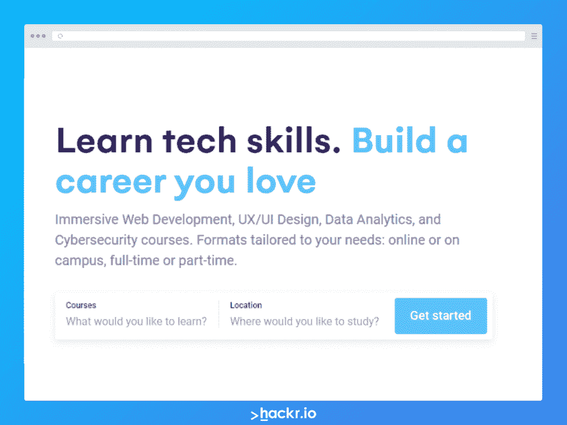](https://www.ironhack.com/en)
*   **描述**
*   Ironhack 提供数据分析、UX/用户界面设计和网络开发方面的强化训练营。由于新冠肺炎，他们最近开始选择远程直播训练营。来自 Ironhack 的学生已经被安排到顶级公司，如谷歌、Twitter、Orange、凯捷、Twitter、BBC 等。Ironhack 拥有一个庞大的网络，连接其所有校园，提供有益健康的体验。

**营地亮点**

#### 参加网络开发和数据分析训练营的女性可享受 10%的折扣。

一对一辅导以及在线和现场辅导支持。

Ironhack 进行了一次简短的个人和技术面试来评估你的技能。

您可以根据您的地点选择不同的融资方案。

专门的职业建议和指导团队，就业率高达 89%。

**所需工具:** 笔记本电脑，根据课程选择 Windows 或 Mac

#### **属性**

课程

#### 成本

*   持续时间
*   教学大纲
*   iOS 移动训练营
*   $10000
*   八周

XCode，Swift，Objective-C

#### 网络开发训练营

| $ 10000-现场$ 12000-在线 | 八周–现场六个月–在线 | HTML，CSS，JavaScript，Ruby，Sinatra，Rails，Git，Github |  |
| [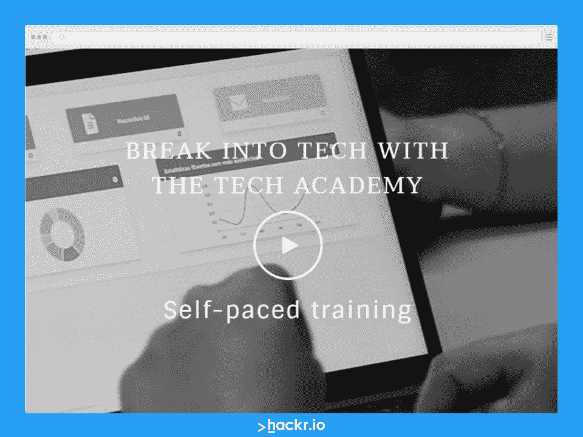](https://www.learncodinganywhere.com/) | **描述** | Tech Academy 训练营是全栈式的、全面的，并根据行业要求教授最新的编程语言。学生可以选择在线学习、参加面授课程或参加混合培训，即在线和现场培训相结合！学生可以选择他们的时间表，以他们喜欢的速度前进。 | **营地亮点** |
| 在最新技术和全栈编程方面培训初级开发人员。 | 在适当协助下的工作安置培训。 | 灵活的时间安排和开放的注册——学生可以随时注册并开始学习。 | 各种各样的训练营——软件开发人员，C# &。NET 框架、Python 开发者、数据科学、前端 web 开发者、UI/UX 设计师等。 |

带在线自学模块的免费入门课。

**所需工具:** 有互联网连接的笔记本电脑，安装每个程序所需的软件。

**属性**

#### 课程

全职成本

#### 全职时长

*   兼职成本
*   兼职持续时间
*   软件开发商
*   :13，980 美元
*   22 周

:19980 美元

#### 40 周

| C# &。NET 框架 | $ 9980 | 15 周 | :14980 美元 | 28 周 |
| Python 训练营 | $ 9980 | 15 周 | :14980 美元 | 28 周 |
| 数据科学 | :10，980 美元 | 16 周 | :15980 美元 | 30 周 |
| 前端 Web 开发人员 | $ 5980 | 八周 | 8980 美元 | 14 周 |
| UI/UX 设计 | $ 9980 | 15 周 | :14980 美元 | 28 周 |
| [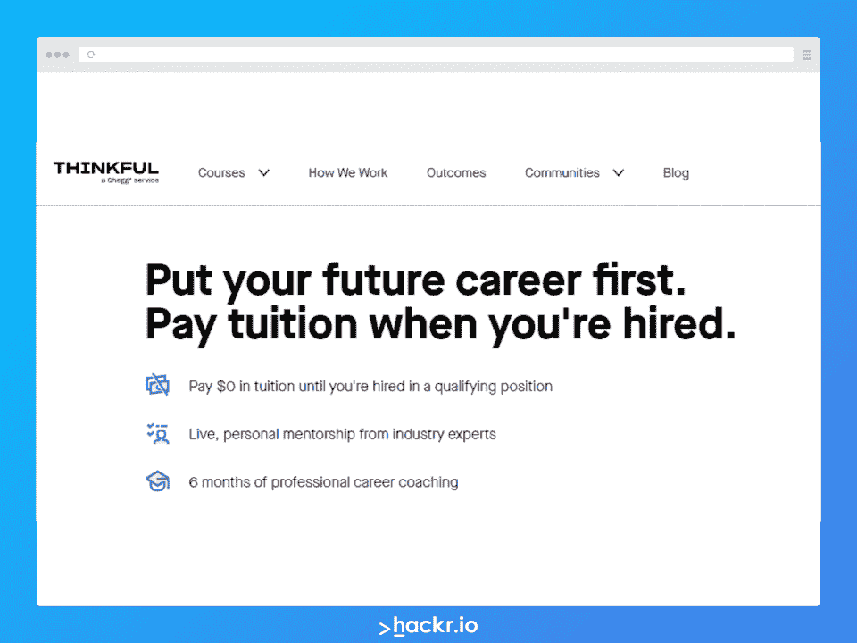](https://www.thinkful.com/) | **描述** | Thinkful 提供一对一的辅导和指导。你可以根据自己的选择选择学习时间表。他们的学生被谷歌、IBM、亚马逊、沃尔玛实验室、波音等大公司录用。软件工程、数字营销、数据科学等既有沉浸式课程，也有灵活的课程。 | **营地亮点** | 平均起薪为 6 万至 7.3 万美元，安置率高。 |
| 美国各地的大型社区。 | 专门的职业支持和建议。 | 免费在线课程助您开启旅程。 | 你可以注册，无需预付费用(针对精选学生)。 | 灵活的支付选项——收入分成协议、按月支付、贷款或预付。 |

### **所需工具:** 笔记本电脑

**属性**

课程

#### 成本

持续时间

#### 工程浸入

*   $16000
*   5 个月，全职
*   工程弹性
*   $7000
*   6 个月，在线，兼职
*   数据科学沉浸式

:18500 美元

#### 5 个月，全职

| 数据科学 Flex | $7000 | 6 个月，兼职 |
| UX/UI 设计沉浸感 | $12，150 | 5 个月，全职，职业教练 |
| UX/用户界面设计弹性 | $7000 | 6 个月，在线，兼职 |
| 数据分析沉浸式 | $12，250 | 4 个月，全职 |
| 数据分析弹性 | $4500 | 6 个月，兼职 |
| 数字营销沉浸式 | $7500 | 6 周 |
| 数字营销 flex | $4500 | 3 个月 |
| 产品管理弹性 | $4500 | 6 个月，在线，兼职 |
|  | [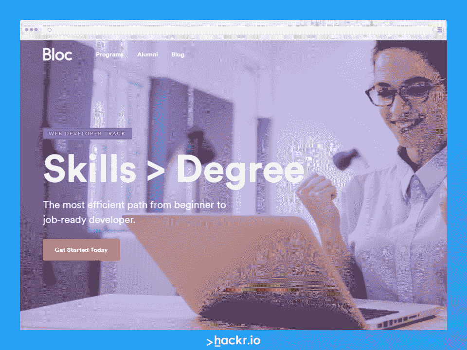](https://www.bloc.io/web-developer-career-bootcamp) | **描述** |
| Bloc 程序不仅适用于初学者，也适用于想要提升自己技能的有经验的开发者。他们为网络和软件开发工作提供三个级别的项目。Bloc 还提供完整的职业指导，对技术面试、简历、Github、LinkedIn 个人资料进行一对一辅导，并拥有广泛的雇主网络。 | **营地亮点** | 在线全日制和非全日制课程。 |
| 可用的奖学金和融资方案。 | 作为全职开发人员的工作保障。 | 三步学习法——24 周、36 周和 72 周的课程。 |
| **所需工具:** 带互联网连接的笔记本电脑(Windows、Mac)、手机(Android/iOS) | **属性** | 课程 |

### 成本

持续时间(兼职-全职)

安卓开发

#### $4999

12-38 周

#### 前端开发

*   $4999
*   12-38 周
*   兼职网络开发人员培训
*   $8800

27-54 周

#### iOS 开发

| $4999 | 12-38 周 | Rails web 开发 |
| $4999 | 21-38 周 | 软件工程轨道 |
| $24000 | 48-144 周 | UX/UI 设计 |
| $4999 | 12-38 周 | 设计师赛道 |
| $9800 | 24-72 周 | **结论** |
| 在这篇文章中，我们讨论了一些最好的免费编码训练营，它们肯定会帮助你找到工作。正确的训练营对于塑造你的职业生涯和获得一份好工作非常重要。成功完成新兵训练营向你的潜在雇主表明，你已经准备好接受项目和新的挑战，公司不需要对你进行特定技能的培训。训练营短则四周，长则一年！无论持续时间有多长，新兵训练营都会给你最相关的行业技能的实际和深入的知识。 | 训练营很酷，但在线课程也是学习编程的一种非常有效和经济的方式。一门评价很高的 Udemy 课程[Web Developer boot camp 2023](https://click.linksynergy.com/deeplink?id=jU79Zysihs4&mid=39197&murl=https://www.udemy.com/course/the-web-developer-bootcamp/)可以成为你一个很好的起点。 | **常见问题解答** |
| 免费编码训练营能帮我找到工作吗？ | 这个问题的答案是响亮的“是”。免费不代表不好，无论如何。这里的训练营是高质量的，可以教你大量的知识和实用技能，当你找到一份编码工作时，你可以用上它们。 | 唯一不同的是， *有些* 雇主可能不承认你参加免费编码训练营的有效性。 |
| 但是，如果你在找工作，许多雇主会在求职和面试过程中测试你的知识和技能，所以只要你能证明你有能力，你就能被录用。或者，你也可以成为一名自由职业的程序员。 | 编码训练营是免费的吗？ | 有 *一些* 免费的编码训练营，在那里你可以免费学习成为一名网页开发者所需的知识。然而，这些免费程序通常有一些你可能不符合的要求。如果你不符合任何免费训练营项目的标准，不要失去希望！ |
|  | 大多数编码训练营会要求你支付学费，有时会超过一万甚至一万五千美元。好消息是，许多编程训练营都是基于**延期学费或者“现在学习，以后支付”的计划。这种类型的计划意味着你可以免费获得教育，直到毕业并找到工作，那时你需要与训练营讨论还款计划。** | 一个编码训练营值得吗？ |

## 这个问题的答案取决于你的具体目标、时间表和当前情况。如果你认为你可以利用自己的时间自学，而不需要上课或参加高强度的训练营，答案可能是否定的。如果你更喜欢获得学位和随之而来的经验，答案也可能是否定的。

## 然而，如果你想快速学习并尽快开始找工作，编码训练营可能是你的正确选择。训练营是高强度的项目，旨在尽快教会你所需的技能和知识，这样你就可以马上开始工作。你完成一个项目的速度也能最大限度地减少你需要离开当前职责的时间。

另一个需要考虑的是成本。[Computerscience.org](https://www.computerscience.org/degrees/affordable-online-bachelors-computer-science/#:~:text=Tuition%20for%20affordable%20bachelor's%20in,charge%20much%20more%20for%20tuition.)州称，负担得起的四年制计算机科学学位总体来说大约在~ 4 万美元左右(不包括任何生活或机会成本)。如果你决定去一个更贵的学校，这个价格可能会翻两三倍。另一方面，参加编码训练营需要花费 10，000-15，000 美元。 **如果你有资格进入免费阵营，那就更好了！**

## 考虑到在美国，一名网络开发人员的起薪约为 7 万美元，你可以通过训练营比大学学位更快地获得投资回报。

### 编码训练营会失败吗？

是的！就像任何课程、项目或学位一样，你 *可能* 失败。编码 bootcamp 失败最常见的原因有:

毫无准备的到来

低估了项目的难度，认为不付出努力就能“混日子”

### 没有为项目投入足够的时间或精力

谢天谢地，只要有足够的准备、奉献和努力，完成你的课程而不被淘汰是完全可能的！

**哪个免费编码 bootcamp 最好？**

这个问题的答案是主观的。最好的免费编码训练营是你可以参加的训练营，考虑到大多数训练营对于接受谁加入他们的项目是相当挑剔的。您还可以在我们的指南中了解如何选择正确的免费编码训练营，以帮助您决定最适合您的训练营。

### 如何才能免费参加训练营？

如果你符合上面列出的免费编码训练营的资格要求，你所要做的就是申请并希望你被接受。另一种你可以参加自己选择(或雇主选择)的训练营的方式是，如果你的雇主支付你参加的费用。许多雇主提供继续教育作为为他们工作的福利，所以如果你足够幸运，你可以免费参加训练营。

免费编码训练营有什么好处吗？

是的——仅仅因为这些程序是免费的并不意味着它们没有达到标准。大多数时候，这些免费的训练营是由在该领域拥有丰富知识和经验的志愿者管理的。许多项目不仅教学生网络开发技能。一些项目，如 Code Tenderloin，教授学生必要的软技能，帮助他们提高自我认知，找到长期就业。

**人也在读:**

### **Can you fail a coding bootcamp?**

Yes! Just like any course, program, or degree, you *can* fail. The most common causes of coding bootcamp failure are:

*   Coming unprepared
*   Underestimating the program’s difficulty and thinking it is possible to “coast” along without putting in the hard work
*   Not dedicating enough time or effort to the program

Thankfully, it’s entirely possible to finish your program without flunking out with enough preparation, dedication, and hard work!

### **Which free coding bootcamp is the best?**

The answer to this question is subjective. The best free coding bootcamp is one that you can attend, considering most bootcamps are rather selective with who they accept into their programs. You can also check out How to Choose the Right Free Coding Bootcamp in our guide to help you decide the best one for you.

### **How can I get a bootcamp for free?**

If you meet the eligibility requirements for the free coding bootcamps listed above, all you have to do is apply and hope you get accepted. Another way you can attend any bootcamp of your choice (or your employer’s choice) is if your employer covers the cost of your attendance. Many employers offer continuing education as a benefit of working for them, so if you are fortunate enough, you can attend a bootcamp at no cost.

### **Are free coding bootcamps any good?**

Yes — just because the programs are free doesn’t mean they aren’t up to par. Most of the time, these free bootcamps are run by volunteers with plenty of knowledge and experience in the field. Many programs also teach their students more than just web development skills. Some programs, such as Code Tenderloin, teach students the soft skills necessary to help them improve their self-perception and find long-term employment.

**People are also reading:******