# 2023 年提供的 30+免费搜索引擎优化工具

> 原文：<https://hackr.io/blog/free-seo-tools>

“如果你建造了它，他们就会来”这句老话在许多情况下仍然有效。然而，在 21 世纪建立一个网站时，你经常需要在任何人访问之前给你的网站一点帮助。一个好的内容策略对每个网站来说都是至关重要的 SEO 策略应该一直伴随着它。为搜索引擎优化的好内容有助于您的网站在搜索结果页面上排名更高，有可能提高您网站的可见性。

意思？更多的客户、信誉和销售。

不幸的是，学习[搜索引擎优化](https://hackr.io/blog/what-is-seo) (SEO)对新手来说可能是令人畏惧和沮丧的。幸运的是，许多 SEO 工具都简化了这个过程。优质的搜索引擎优化工具通常被证明是无价的——但是如果你刚刚开始，一个免费的搜索引擎优化工具可以做到这一点。

我们收集了 2023 年最好的免费 SEO 工具列表。这些工具被广泛使用，并提供实际的搜索引擎优化价值，同时保持绝对免费！

下面的列表包含了最好的免费 SEO 软件。我们方便地将它们分类，以帮助您找到符合您需求的产品。

这些免费的搜索引擎优化工具帮助你发现人们在网上搜索的关键词。这个列表上的工具经常显示搜索量和竞争。

[**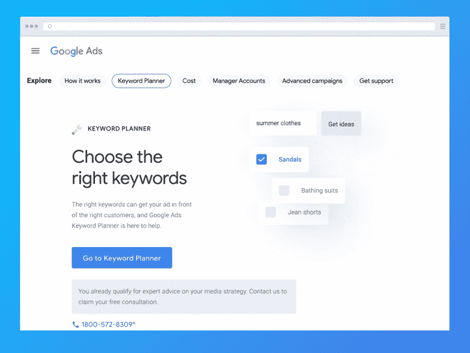**](https://ads.google.com/intl/en_in/home/tools/keyword-planner/)

关键词规划器是谷歌的关键词研究工具。它最初是为购买点击付费谷歌广告的人而设计的，所以你不会得到和其他工具一样的结果。尽管如此，关键字规划提供了有用的信息，为您的搜索引擎优化战略规划。这个工具使用谷歌自己的数据，并包括有用的功能，如按国家过滤。

注意付费广告位置的特征，比如“竞争”，因为这些数据会影响你的搜索引擎优化策略。

**[试试这里的](https://ads.google.com/intl/en_in/home/tools/keyword-planner/)**

[**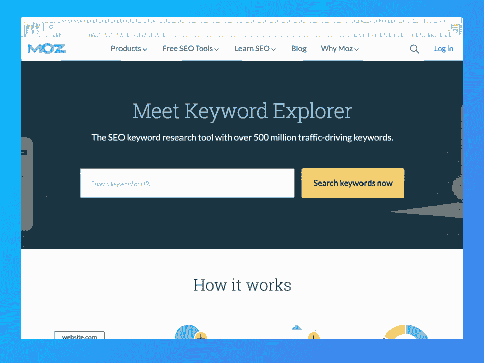**](https://moz.com/explorer)

Moz 关键词浏览器是一款优秀的免费工具，拥有超过 5 亿个关键词和关键词建议。它还具有关键字难度分数(确定某个关键字的排名有多难)和一些 CTR 数据。

如果你有一个免费的 Moz 账户，你可以每月查询十次。每个查询提供多达 1，000 个关键字建议和 SERP 分析。

*[试试这里。](https://moz.com/explorer)*

[**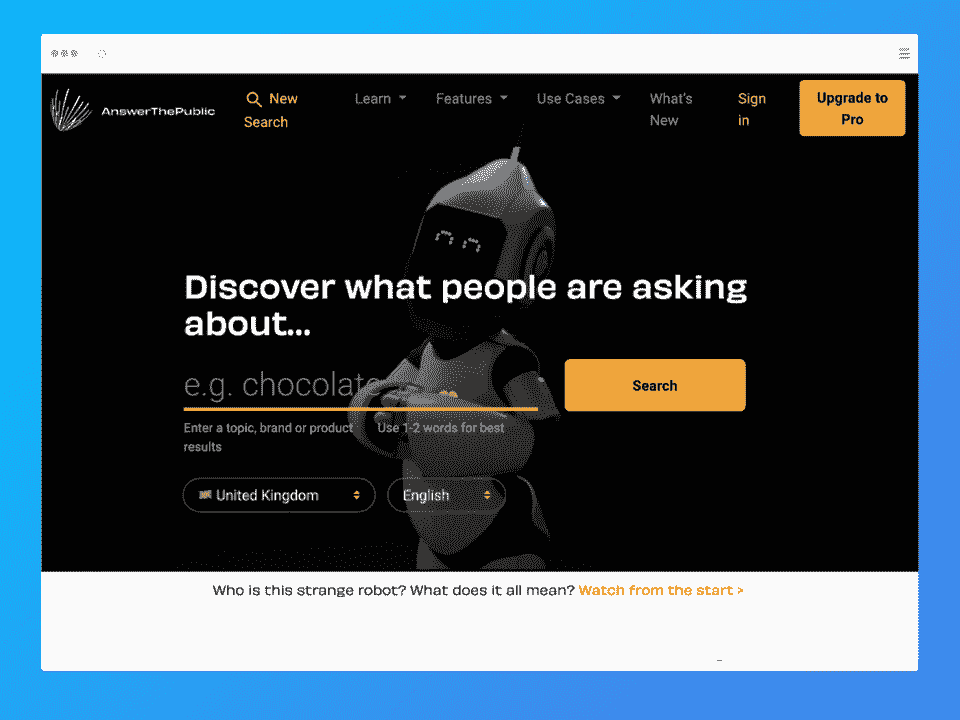**](https://answerthepublic.com/)

公众是我的最爱，因为它提供了大量的信息。长尾关键词工具由“建议搜索”提供支持，它会在您键入时自动完成搜索栏。AnswerThePublic 将这些搜索问题可视化成一张图片，该服务称之为搜索云，然后将它们组织成各种类别，包括:

*   **问题**(谁，什么，哪里，什么时候，为什么，怎样，能，哪个，会等。在关键字之前)
*   **比较** (vs，and，or 等。在关键字之后或之中)
*   **介词** (for，near，is，with 等。关键字之后)
*   **字母顺序**
*   **相关**

AnswerThePublic 是一个从关键词搜索中产生问题的绝妙方法。你可以用它来创建和改进你的内容策略，让你的文章标题或头条有机会在 SERPs 上排名。

*[试试这里。](https://answerthepublic.com/)*

[**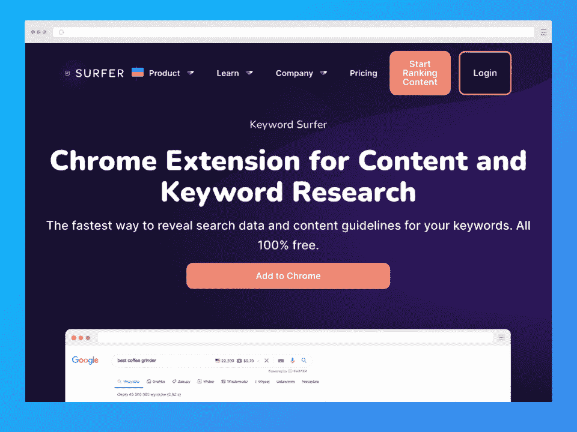**](https://surferseo.com/keyword-surfer-extension/)

关键词冲浪是冲浪 SEO 的关键词工具。这是一个可以安装在谷歌 Chrome 上的浏览器扩展。关键词冲浪返回谷歌搜索结果的关键词搜索量。

*[试试这里。](https://surferseo.com/keyword-surfer-extension/)*

**替代品:** [WMS 无处不在](https://whatsmyserp.com/extension)是 Chrome 的另一个扩展，为你提供点击费用信息、关键词建议和搜索量信息。

[**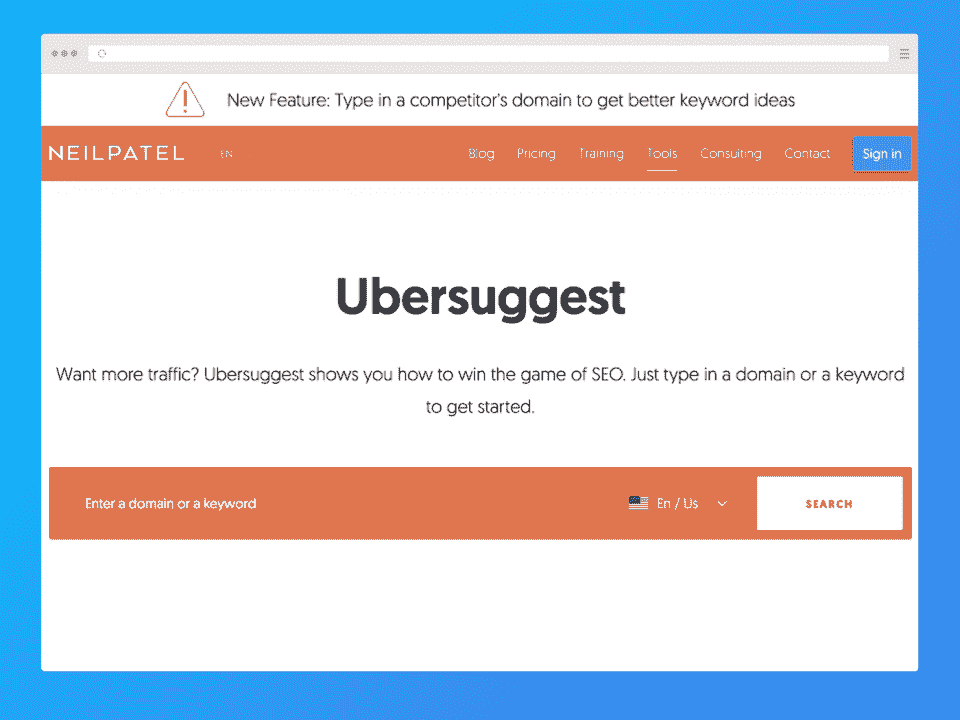**](https://neilpatel.com/ubersuggest/)

Ubersuggest 可以说是当今最好的免费(和付费)SEO 工具之一。创始人 Neil Patel 免费向所有人开放这个 SEO 优化工具，然后零成本地进一步开发这些功能。

Ubersuggest 最初因其关键字创意功能而流行起来，您可以使用该功能生成各种类型的关键字。您可以使用它来查找相关、介词、问题和比较关键字。

尽管 Ubersuggest 是通过关键词 Ideas 而出名的，但如今它已经包含了更多的功能。其他功能，如关键词概述，首页，流量分析概述，网站审计，改善您的搜索引擎优化策略甚至更多。

Ubersuggest 是仅有的提供一次性购买终身许可证的 SEO 工具之一。与其他类似工具相比，他们的月付费计划也更实惠。

*[试试这里。](https://neilpatel.com/ubersuggest/)*

**推荐课程**

**[终极 SEO 培训 2023+Wordpress 网站 SEO](https://click.linksynergy.com/deeplink?id=jU79Zysihs4&mid=39197&murl=https%3A%2F%2Fwww.udemy.com%2Fcourse%2Fultimate-seo-training-course%2F)**

这类工具最适合通过监控 SERPs、竞争对手的策略和关键词来分析网站的搜索性能。

[**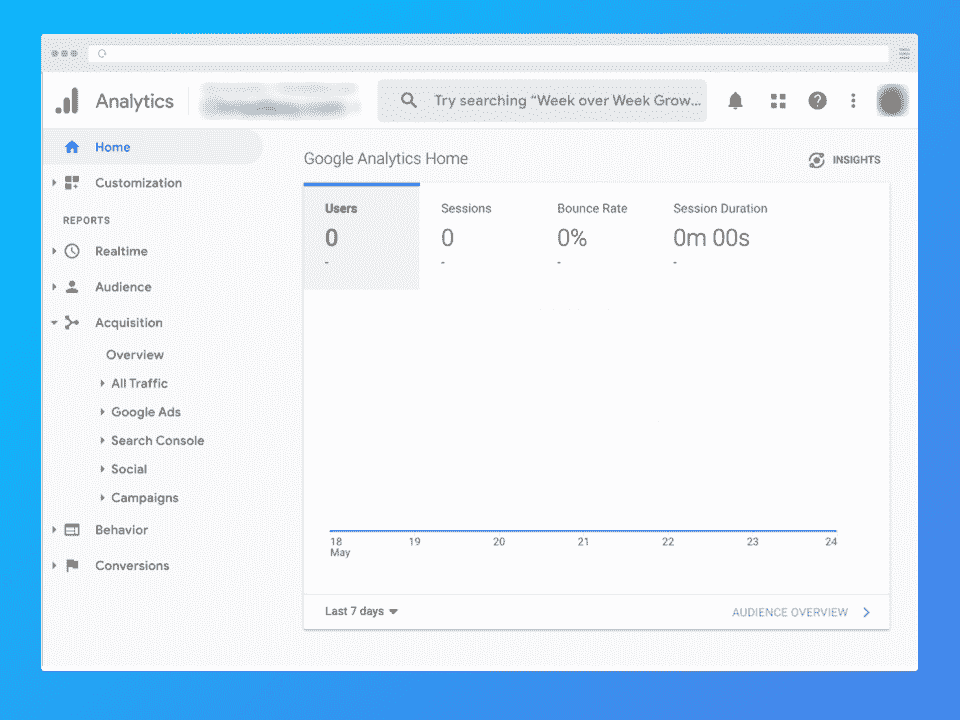**](https://analytics.google.com/analytics/web/)

来自谷歌的工具，GA 是这个星球上最流行和最广泛使用的 SEO 分析工具之一。尽管它有强大的功能集，但它是完全免费的，并且与其他 Google SEO 产品非常兼容。

Google Analytics 提供了网站统计数据以及基本的分析工具，您可以使用这些工具进行 SEO 或营销。它还可以跟踪网站的表现，并收集访问者的见解。因此，您可以了解用户参与趋势和模式，以调整您的营销/SEO 策略。

*[试试这里。](https://analytics.google.com/analytics/web/)*

**备选:** [打开网页分析](https://www.openwebanalytics.com/)

**奖励:** [增强的谷歌分析注解](https://context.sweetlabs.io/google-analytics-annotations-extension/)

[**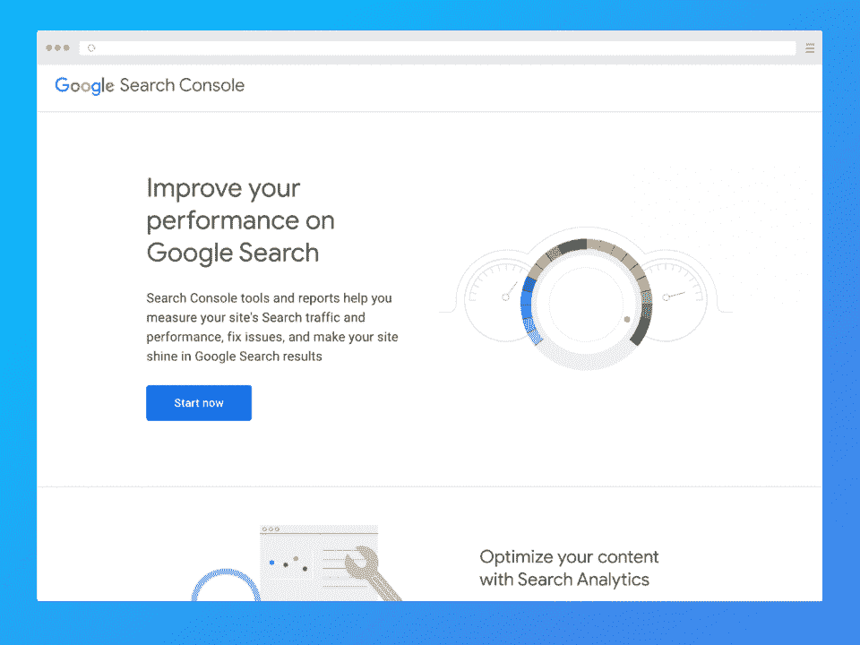**](https://search.google.com/search-console/about)

搜索控制台是谷歌的另一个使用谷歌数据的工具。因此，搜索控制台现在是最有用和最可靠的信息工具之一，可以了解这个科技巨头如何抓取和排列网站，包括你的网站。

因为搜索控制台将您的下载限制为一千行数据，所以您可能需要更多支持。幸运的是，你可以使用另一个免费工具，[谷歌搜索控制台数据导出器](https://seotesting.com/downloader)，一次下载多达 25000 行数据。

*[试试这里。](https://search.google.com/search-console/about)*

[**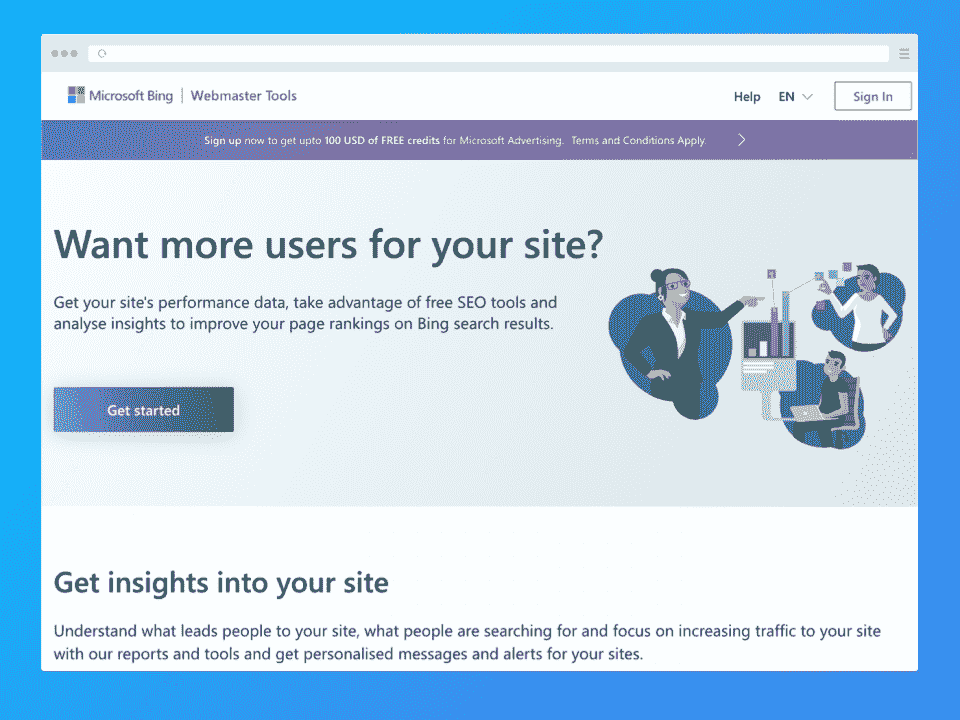**](https://www.bing.com/toolbox/webmaster)

作为谷歌的替代产品，微软的必应并没有获得这么大的流量。仅占全球搜索引擎市场 2.47%的份额，你可能会觉得在必应上的排名不如在谷歌上的排名重要。尽管谷歌占据了最大份额，但人们仍在使用必应，所以在那里排名会对你的业务有益。

*[试试这里。](https://www.bing.com/toolbox/webmaster)*

想在 Yandex 的搜索引擎上排名上升吗？试试 [*Yandex。站长*](https://webmaster.yandex.com/welcome/) *。*

[**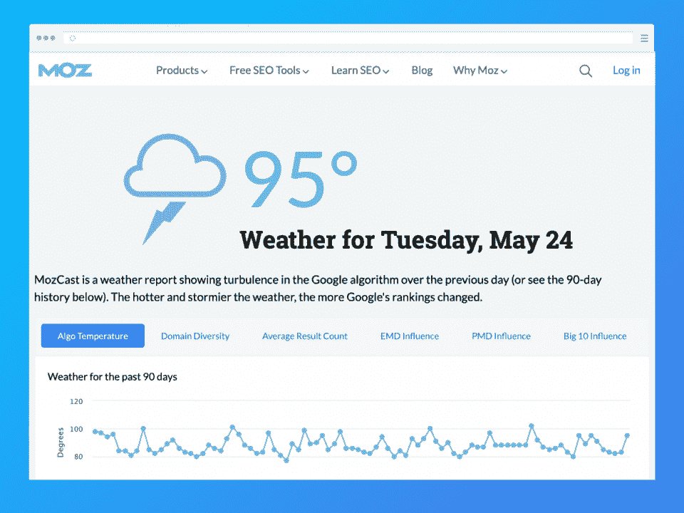**](https://moz.com/mozcast/)

MozCast 是 Moz 的另一个功能，可以帮助你跟踪谷歌算法的行为。它跟踪谷歌算法的日常模式，向你展示没有得到太多(如果有的话)媒体报道的微小变化。它显示了前一天或过去 90 天的模式。天气越是恶劣或炎热，谷歌上的排名变化就越大。相比之下，一个平淡无奇的算法日位于华氏 70 度左右。

*[试试这里。](https://moz.com/mozcast/)*

**备选:** [算法](https://algoroo.com/)

[**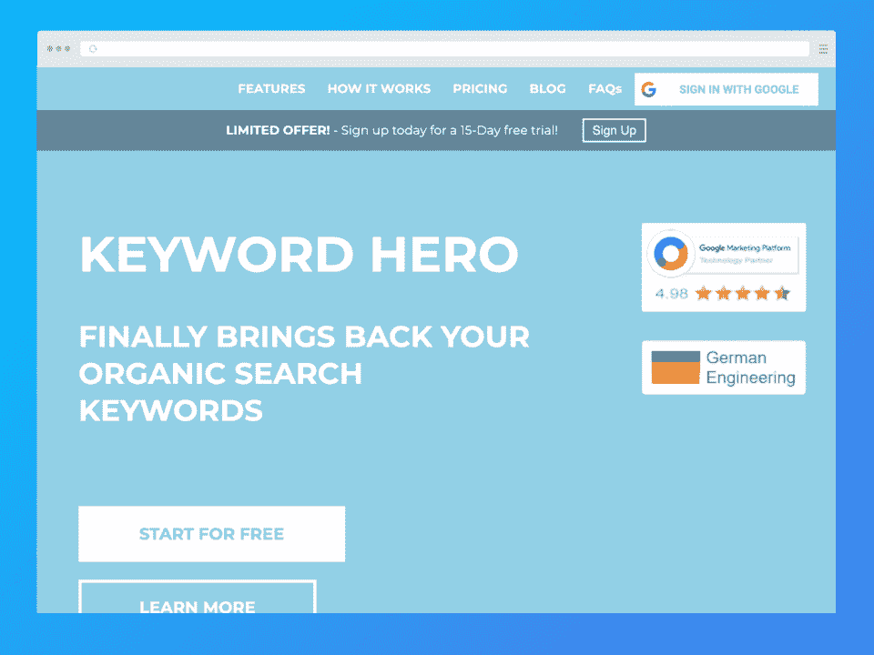**](https://keyword-hero.com/)

有时，Google Analytics 数据会以*【未提供】*的形式返回。当这种情况发生时，它真的会妨碍你的计划和策略。关键字 Hero 通过返回丢失的关键字来帮助解决这个问题，因此您可以摆脱每个人都讨厌的“未提供”指标。您可以每月免费使用该工具多达 2000 次。

*[试试这里。](https://keyword-hero.com/)*

抓取/索引工具确保你的网站是优化的和可抓取的，所以它可以出现在 SERPs 上。

[**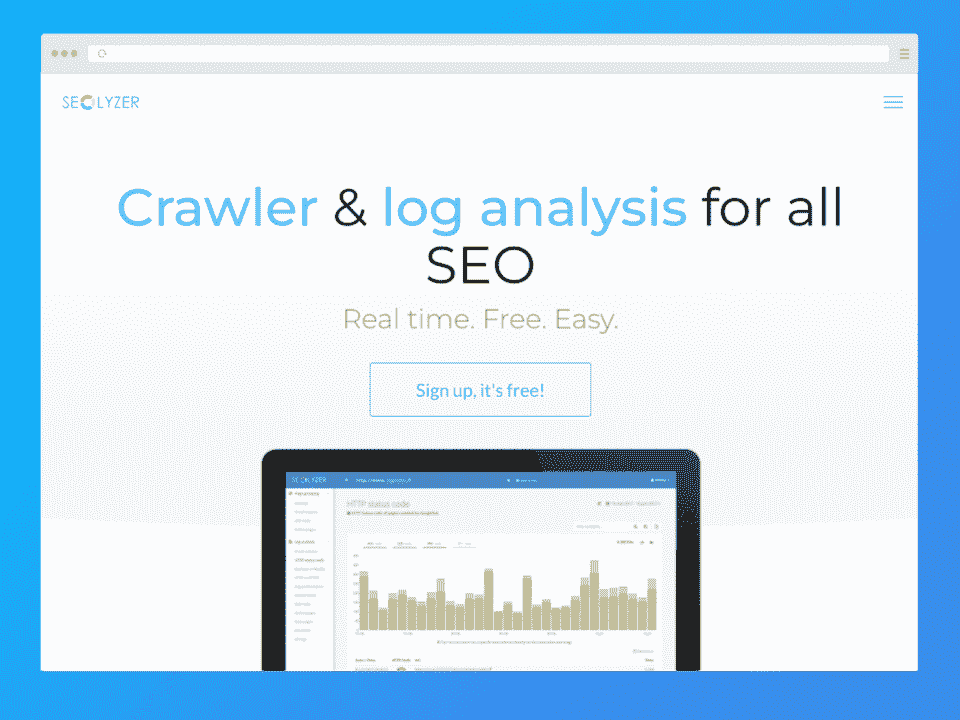**](https://seolyzer.io/)

SEOlyzer 是一个优秀的日志分析工具，包括页面分类和实时分析功能。它还提供了抓取可视化，让你在几秒钟内了解网站的 SEO 结构，包括诊断内部链接问题。这个工具似乎有一个很高的抓取限制，目前的最高记录是一个站点有 2200 万个页面。

*[试试这里。](https://seolyzer.io/)*

[**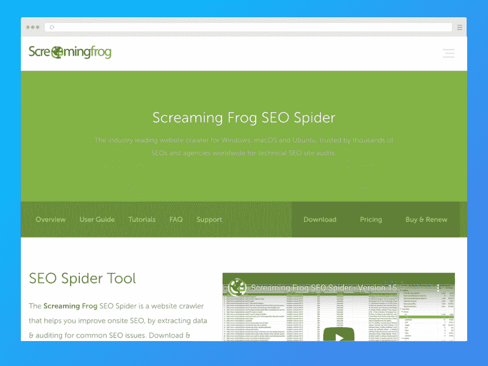**](https://www.screamingfrog.co.uk/seo-spider/)

尖叫青蛙可以说是当今最受欢迎的爬虫之一。这款基于桌面的软件有一个免费版本，允许每次抓取 500 个网址或页面。虽然它提供的功能没有付费版本多，但免费版本对于较小的网站审计来说仍然非常出色。最精彩的部分？爬行/索引发生**超快**。

尖叫青蛙的付费计划价格实惠，值得一看。

*[试试这里。](https://www.screamingfrog.co.uk/seo-spider/)*

**奖励:** [尖叫青蛙日志文件分析器](https://www.screamingfrog.co.uk/log-file-analyser/)

一些最好的 SEO 免费工具是链接工具(用于反向链接)。这些工具帮助你发现和评估有利于你的网站排名的反向链接机会。

[**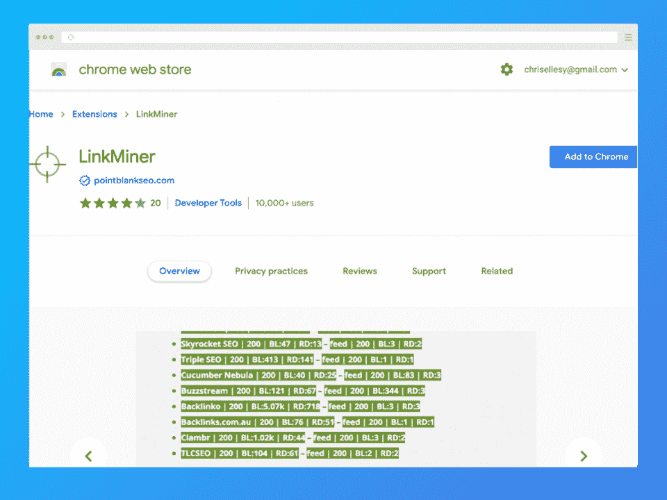**](https://chrome.google.com/webstore/detail/linkminer/ogdhdnpiclkaeicicamopfohidjokoom?hl=en)

链接挖掘器帮助您快速找到每个网页上的断开链接，以便您可以修复它们。作为一个免费的谷歌 Chrome 扩展，Link Miner 还允许你在谷歌上搜索时看到一些基本的链接指标。

*[试试这里。](https://chrome.google.com/webstore/detail/linkminer/ogdhdnpiclkaeicicamopfohidjokoom?hl=en)*

[**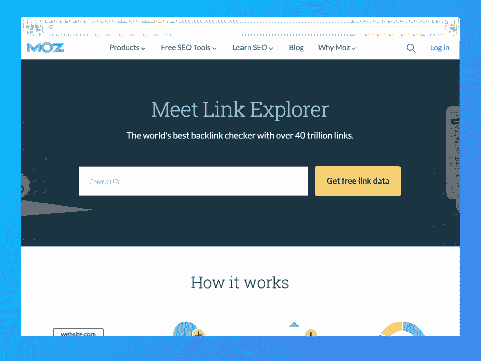**](https://moz.com/link-explorer)

Moz 的链接浏览器是一个优秀的大型链接索引。大约有 35 **万亿**个链接，Link Explorer 提供了令人难以置信的准确的域权限数据，以及一个有用的反向链接检查器。一个免费帐户每月允许十次查询，每次查询返回五十行有价值的数据。

当你浏览的时候，链接浏览器也给 MozBar 添加了一些基本的链接指标。

*[试试这里。](https://moz.com/link-explorer)*

[**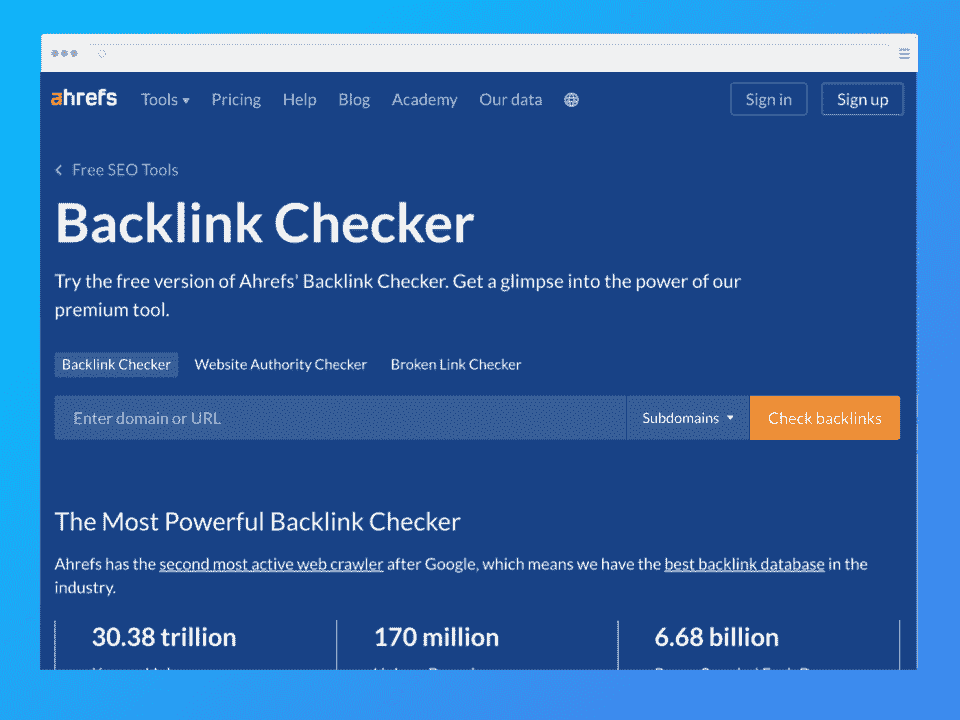**](https://ahrefs.com/backlink-checker)

Ahrefs 是众所周知的，受到全球许多 SEO 专家的喜爱。作为市场上最好的搜索引擎优化工具之一，他们可以收取额外费用，而且价格合理。但许多人不知道的是，Ahrefs 实际上提供了一个免费的反向链接检查工具。虽然与付费工具相比有所限制，但对于预算有限的 SEO 来说，它仍然很方便。对于新手或者较小的网站来说也很好用。

*[试试这里。](https://ahrefs.com/backlink-checker)*

[**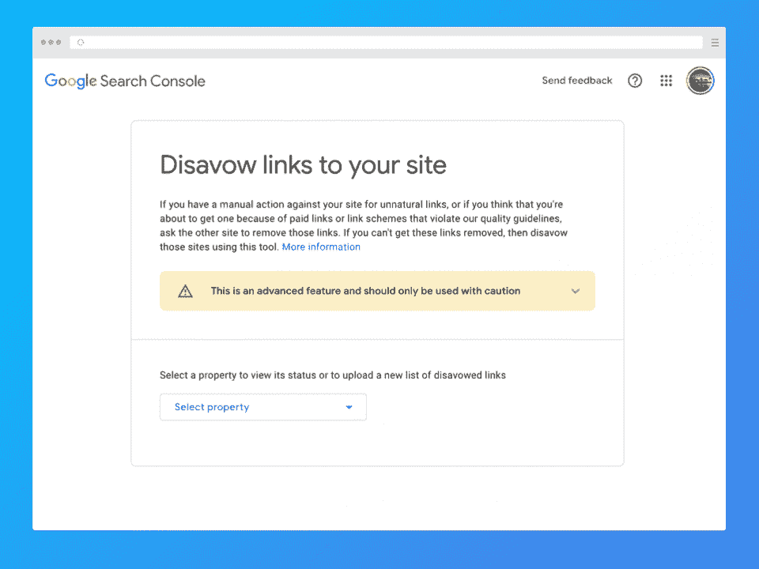**](https://www.google.com/webmasters/tools/disavow-links-main)

否认有助于你对抗负面搜索引擎优化，如来自网站的链接可能被视为“垃圾”或更糟。大多数网站并不真的需要否认工具，这就是谷歌很难找到它的原因。你可能不会有垃圾邮件反向链接，除非你以前是垃圾邮件攻击的受害者，或者如果你曾经购买反向链接。如果你使用的是一个全新的网站和一个全新的域名，你可能根本不需要使用否认。

如果您选择使用否认工具，请记住**您不能撤销否认**。所以在你否认之前，做好你的尽职调查，研究一下反向链接是否真的来自垃圾网站。否则，你可能会删除对你有益的反向链接。

*[试试这里。](https://www.google.com/webmasters/tools/disavow-links-main)*

研究是 SEO 过程的一个重要部分。这些免费工具可以帮助你研究和分析历史的，技术的，有竞争力的关键词/SEO 数据。另一方面，有些只是帮你做一些简单的事情，比如查找联系信息。

[**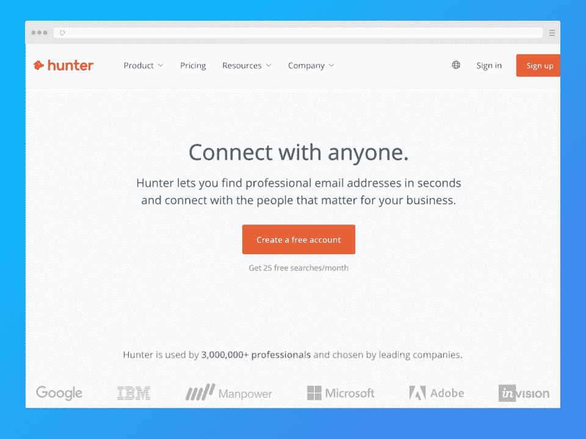**](https://hunter.io/)

亨特是一个非常受欢迎的工具，允许您搜索和验证个人或公司的电子邮件地址，并验证电子邮件地址。你每个月可以得到 50 次免费查询，这足够你得到你需要的电子邮件地址了。

*[试试这里。](https://hunter.io/)*

[****](https://buzzsumo.com/)

你的网站需要一些新的、常青的内容吗？BuzzSumo 是一个神奇的研究工具，让你可以免费访问趋势数据和热门内容(当然，尽管你可以从付费计划中获得更多)。这个工具是一个基于云的平台，也有一个 Chrome 扩展。BuzzSumo 帮助你在搜索和社交媒体上发现新的机会(内容、参与度、拓展度)。

BuzzSumo 最近将免费试用从一周升级到一个月。

*[试试这里。](https://buzzsumo.com/)*

[**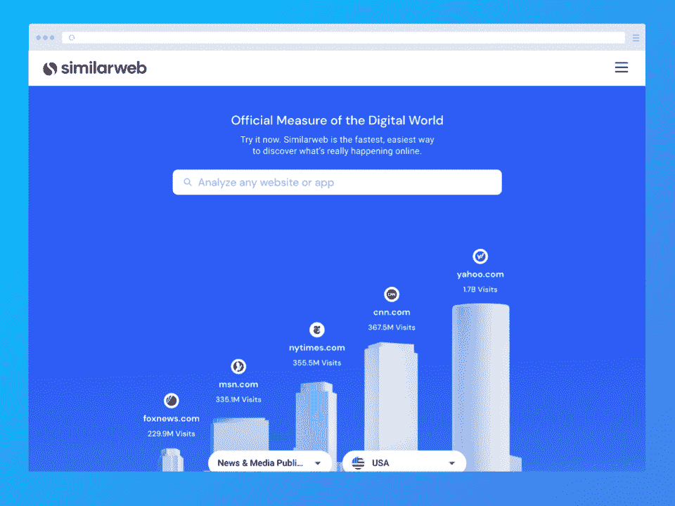**](https://www.similarweb.com/)

SimilarWeb 是竞争对手分析的好去处。这个工具可以帮助你研究竞争对手的首页、流量、营销渠道、参与度等等。免费计划对每个指标只返回五个结果，但这足以让你了解你的竞争对手。它也是查找当今一些最大网站信息的绝佳工具。唯一的问题是 SimilarWeb 并不完全准确，并且缺少一些网站的数据。

*[试试这里。](https://www.similarweb.com/)*

[**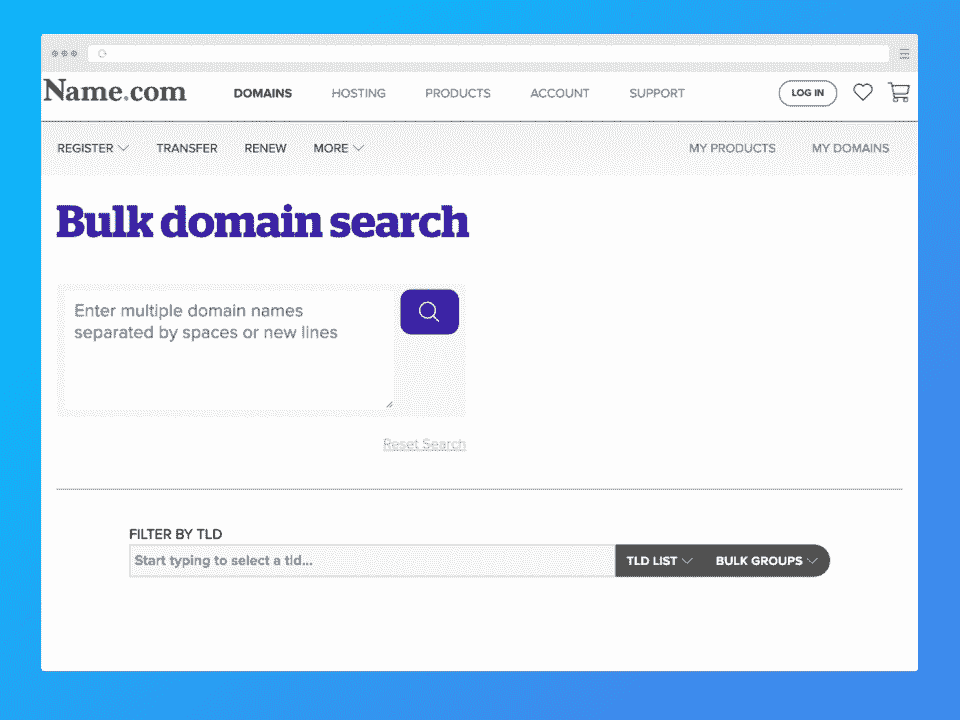**](https://www.name.com/names)

每个网站都需要一个吸引人的，独特的域名游戏。如果你想批量查看域名的可用性，Name.com 的批量域名搜索是最好的选择。

*[试试这里。](https://www.name.com/names)*

[**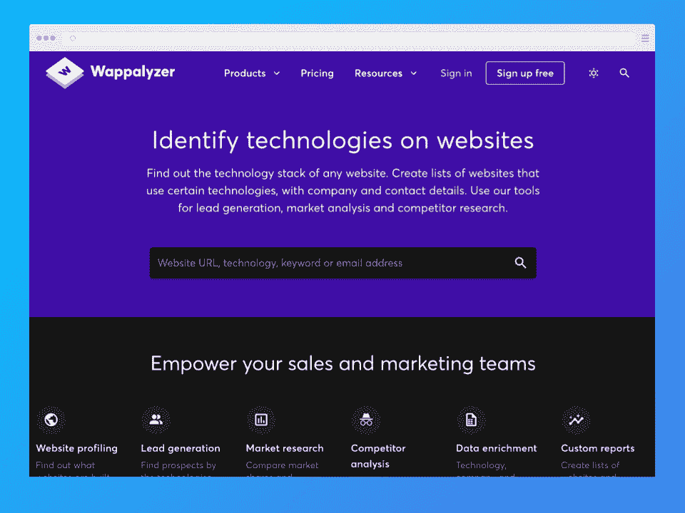**](https://www.wappalyzer.com/)

你的竞争对手的网站运行在什么工具和技术上？Wappalyzer 可以让你免费找到答案，并在这个过程中改进你自己的策略。请记住，高级报告将花费一些钱。有了 Wappalyzer，你可以发现一个网站是否在使用某些工具，比如 WordPress 插件等等。

*[试试这里。](https://www.wappalyzer.com/)*

WordPress 是一个非常受欢迎的内容管理系统，互联网上超过 30%的网站都是 WordPress 支持的。目前有超过 455，000，000 个(还在增加)基于 WordPress 的网站，所以也有 SEO 工具来帮助优化这些页面是有意义的。下面的工具是 WordPress 的一些最好的 SEO 免费工具。

[**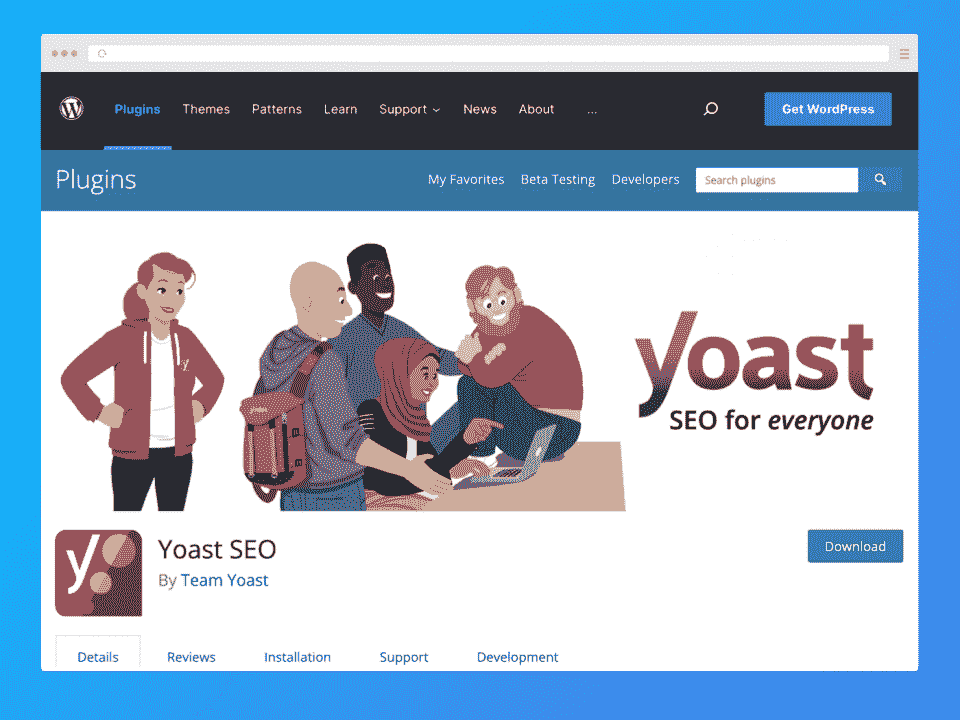**](https://wordpress.org/plugins/wordpress-seo/)

如果你使用 WordPress 有一段时间了，你可能已经知道了 Yoast SEO。Yoast SEO 一直以来都是*WordPress SEO 插件。作为 CMS 上最受信任的 SEO 插件，Yoast SEO 已经安装在超过 3000 万个网站上。*

Yoast SEO 帮助你优化你在插件中设置的关键词或关键短语的每个页面。它还会返回分数，以显示您是否需要继续改进某些东西，或者是否可以继续。

*[试试这里。](https://wordpress.org/plugins/wordpress-seo/)*

[**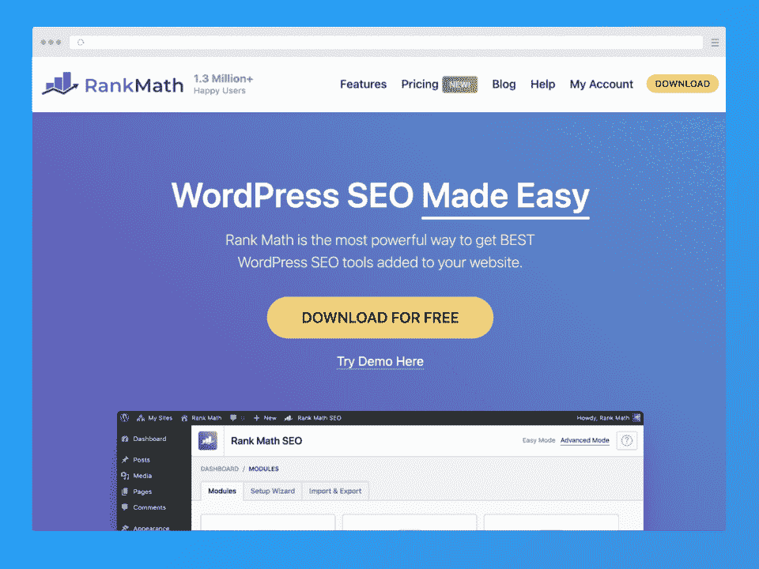**](https://rankmath.com/)

Rank Math 是 Yoast SEO 的挑战者，提供了许多类似的功能。它还可以帮助你优化网页内容和数据结构。

*[试试这里。](https://rankmath.com/)*

### **加快网站加载速度的最佳选择**

你平均有八秒钟的时间在你的网站上抓住用户的注意力。如果你的网站需要很长时间才能加载，浏览者会失去耐心，甚至在看到你的内容之前就点击离开。即使你有最好的搜索引擎优化策略，如果你的网站加载缓慢，你的跳出率也会上升。下面这些工具可以帮助你加快加载速度！

[**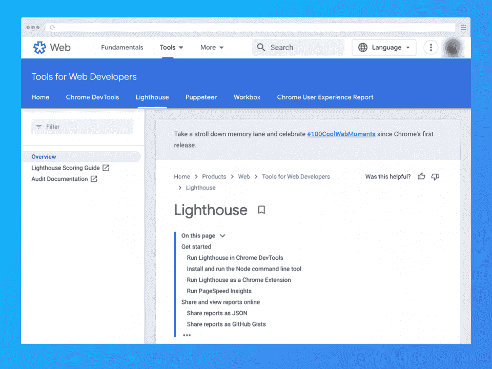**](https://developers.google.com/web/tools/lighthouse/)

谷歌的开源灯塔往往是最新的速度性能工具。谷歌推荐这个工具来评估你的网站表现。

*[试试这里。](https://developers.google.com/web/tools/lighthouse/)*

[**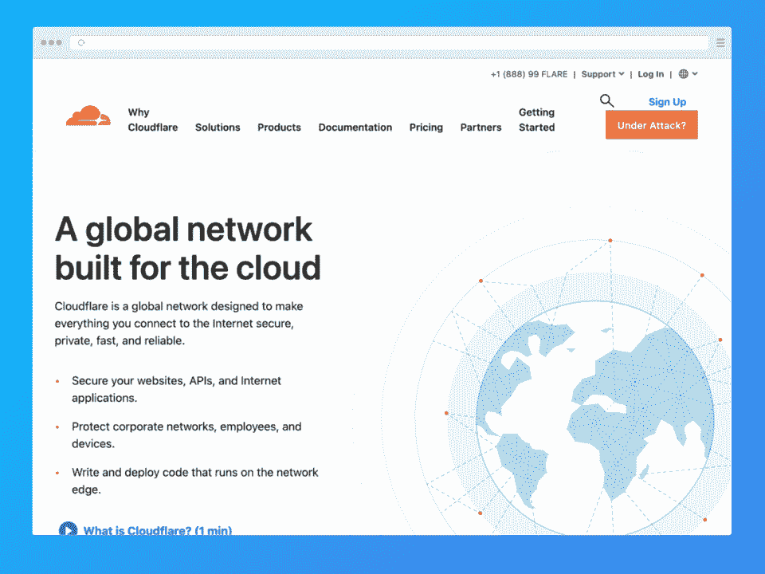**](https://www.cloudflare.com/)

Cloudflare 是一个免费的内容交付网络，有助于加速您的网站。它还协助 DNS 管理，并为您提供免费保护，免受 DDoS 攻击。免费计划通常是足够的，但升级提供了更多的功能，价格合理。

该工具通过缓存网站版本(和静态资源)来加快加载速度、减少等待时间并降低跳出率，然后根据离查看者/站点访问者最近的节点将其交付给查看者/站点访问者。

*[试试这里。](https://www.cloudflare.com/)*

[**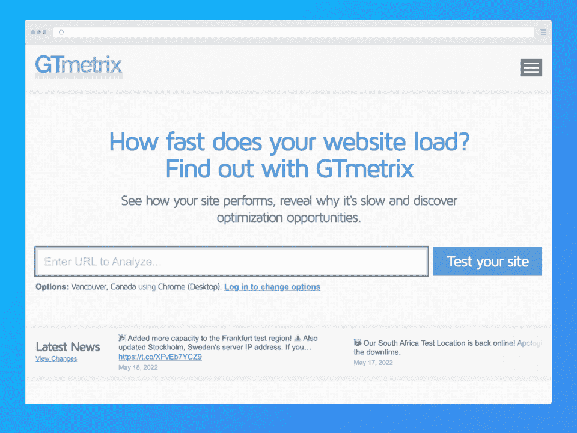**](https://gtmetrix.com/)

许多 SEO 专家喜欢使用 GTmetrix 来检查他们网站的性能，并找出任何需要改进的地方。GTmetrix 是一个网站速度检查器，提供各种报告，如 YSlow、PageSpeed 和 Waterfalls。该工具还可以可视化每个被分析页面返回的历史数据。

*[试试这里。](https://gtmetrix.com/)*

### **最佳多用途**

下面的工具是多用途的，提供不同层次的价值来帮助你改善你的 SEO 策略。

[**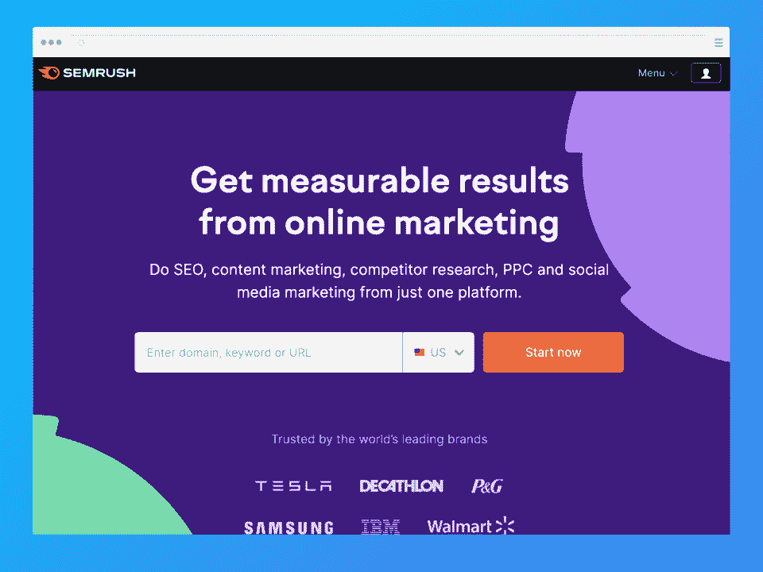**](https://www.semrush.com/)

SEMRush 是市场上最好的综合性 SEO 工具之一。SEMRush 价格昂贵，许多企业或个人负担不起。然而，如果你只使用一个网站或项目，你可以使用免费的 SEO 工具。该工具包括有限的关键字报告、有限的域报告和一些基本的网站审计功能。

SEMRush 通常是 SEO 专家的最爱，也是需要计划营销策略的营销人员的绝佳选择。

*付费计划提供了一整套搜索引擎优化工具，减少了您使用多种搜索引擎优化工具的需求。*

*[试试这里。](https://semrush.sjv.io/c/2890636/1008501/13053)*

[**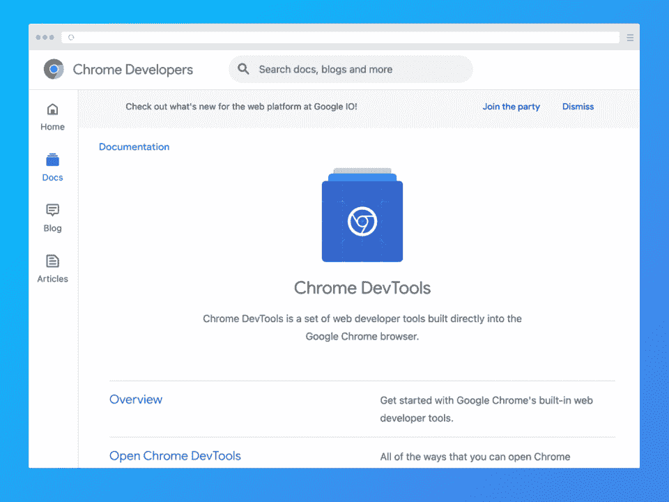**](https://developers.google.com/web/tools/chrome-devtools/)

Chrome DevTools 是谷歌提供的另一个免费工具。你可以做任何事情，从页面搜索引擎优化到 JavaScript 审计，帮助你同时改进网站和搜索引擎优化。

*[试试这里。](https://developers.google.com/web/tools/chrome-devtools/)*

[**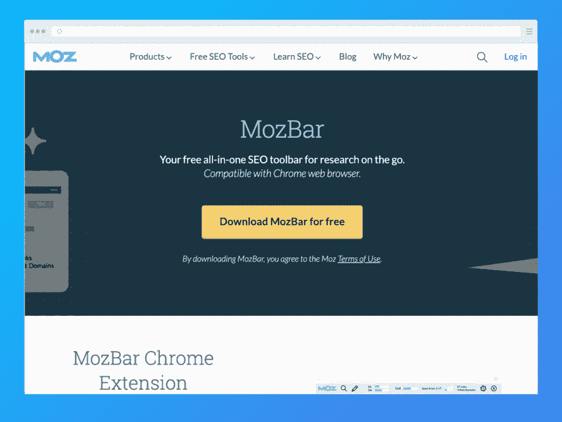**](https://moz.com/products/pro/seo-toolbar)

MozBar 是由当今最好的 SEO 工具提供商之一 Moz 为 Google Chrome 开发的 SEO 工具栏。MozBar 是最早出现的 SEO 工具栏之一，这些年来，已经经历了大量的重大升级。一个免费的 Moz 账户可以让你在浏览互联网的时候获得链接的指标。有了这个工具栏，你还可以进行页面搜索引擎优化和搜索引擎结果页面分析。

这个免费的工具本身很强大，也很有用，但是付费版本有更多的功能，比如关键词建议。

*[试试这里。](https://moz.com/products/pro/seo-toolbar)*

[**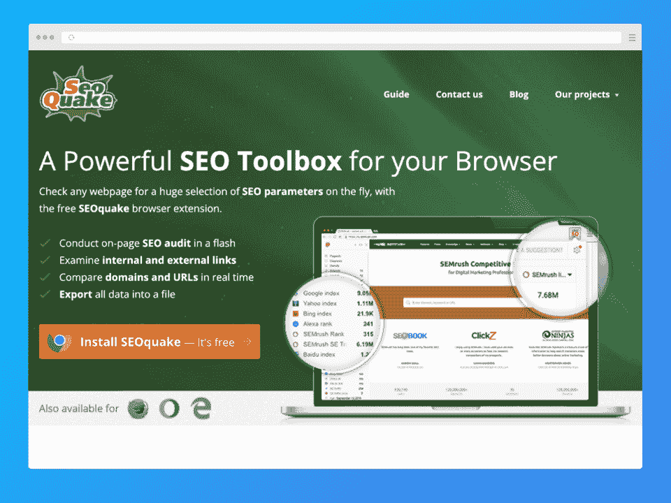**](https://www.seoquake.com/index.html)

虽然 SEOquake 看起来可能只是另一个 SEO 工具栏，但它有更多的功能。SEOquake 有望成为目前最强大的工具栏。它带有许多定制选项，将控制权交给用户，允许他们根据自己的 SEO 需求调整工具栏。

SEOquake 会返回你访问的每个 URL 的大量数据。它还允许您执行比较域、基本的页面审计和导出数据等任务。

*[试试这里。](https://www.seoquake.com/index.html)*

## **结论**

高级工具非常有用，提供了很多价值来帮助你在 SERPs 上排名更高。然而，你通常需要不止一个工具——而且有这么多付费的工具和服务，这些成本很快就会增加。值得庆幸的是，一些最好的免费 SEO 工具并不需要花费你很多钱。您可以使用列表中的一些免费工具来补充您使用的任何付费工具。

有兴趣了解更多关于 SEO 的知识吗？[探索 Coursera 提供的搜索引擎优化(SEO)专业化课程！](https://imp.i384100.net/jWgjWv)

## **常见问题解答**

是的，有很多免费的 SEO 软件，足以帮助你开始你的 SEO 战略，而不用花一毛钱。有些是免费试用，但许多工具都有永久免费计划(例如，查看 Ubersuggest 或 AnswerThePublic)。

有不少很棒的免费 SEO 工具，比如 Yoast SEO、AnswerThePublic 和 Ubersuggest。然而，在所有这些中，Ubersuggest 是最好的之一，因为它有更多的功能。

#### **3。Google 对 SEO 收费吗？**

不。你的网站出现在像谷歌一样的有机搜索引擎中是没有成本的。您可以对自己的网站进行必要的更改，以提高搜索结果的排名。然而，点击付费/谷歌广告是收费的。

#### **4。我如何在谷歌上获得免费的搜索引擎优化？**

你可以调整你的搜索引擎优化策略，直到你的网站在搜索引擎优化列表中出现在更高的位置。

#### **5。哪里可以免费获取 SEO 关键词？**

你可以查看上面列出的免费搜索引擎优化工具。

#### **6。如何免费提高我的 Google SEO？**

这里列出的每个工具都有其使用案例。你可以把它们都检查出来，看看是否有任何一个可以帮助你改进你的 SEO 策略，而且是免费的。有了改进的 SEO 策略，你可以在搜索引擎结果页面上爬得更高。

**人也在读:**