# 2023 年提升技能的 50+最佳免费 Udemy 课程

> 原文：<https://hackr.io/blog/free-udemy-courses>

由于互联网的可访问性，你不再需要支付大学费用来学习一项新技能——无论是会计还是像 [Python](https://hackr.io/blog/how-to-learn-python) 这样的编程语言。学习变得比以往任何时候都更容易，只要你有一个设备和互联网连接。

在线教育对大多数人来说是一种福气，尤其是对那些喜欢自学和按照自己的进度学习的人来说。因为自学已经完全普及，越来越多的[在线学习平台](https://hackr.io/blog/best-online-learning-platforms)涌现出来，为渴求知识的人提供课程和项目。

Udemy 就是这样一个在线学习平台，它可以让你找到任何主题的课程。该平台本身表示，它目前有超过 204，000 门课程。最棒的是这些课程都很实惠，尤其是在 Udemy 频繁的大减价期间。

但是如果你不准备花钱去学一门你不确定会喜欢的技能，你可以尝试一两门免费的 Udemy 课程。为了帮助你，我们按类别列出了一些最好的免费 Udemy 课程。继续阅读——你可能会发现一门有趣的课程值得一试！

## **免费在线 Udemy 课程**

或许完成免费课程的最大缺点之一是，你不会因此获得任何证书。不幸的是，没有免费的 Udemy 课程和结业证书。然而，这也不全是坏事——仅仅因为你没有获得证书并不意味着你没有从下面的许多免费课程中受益。

## **最佳免费 Udemy 课程:开发**

**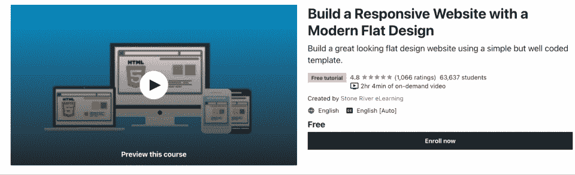**

**评级:** 4.8

**时长:** 2 小时 4 分钟

**先决条件:**

*   一台电脑
*   一个好的网站模板(已提供)

建立一个有现代平面设计课程的响应网站对于新的和有经验的网页设计者、开发者和前端网页设计者和开发者来说是非常好的。你不仅会学到前端设计的基础知识，还会学到如何制作新模板。本课程结束时，你将能够在几分钟内设计出一个反应灵敏的网站。而且你会知道如何完全用 HTML 5 设计一个网站。

底线？这是开始你的 web 开发之旅的最好的免费课程之一。

[**了解本课程的更多信息**](https://click.linksynergy.com/deeplink?id=jU79Zysihs4&mid=39197&murl=https%3A%2F%2Fwww.udemy.com%2Fcourse%2Fbuild-responsive-website-designs-with-html5-and-css%2F)

****

**评级:** 4.1

**时长:** 1 小时 17 分钟

**先决条件:**

*   基本的计算机技能
*   安装了主机或本地主机

WordPress 基础知识:学习 WordPress 是一个循序渐进的课程，让你对 WordPress 有一个坚实的理解，以及如何轻松地操作它。最精彩的部分？你只需要一个小时就可以完成！这个免费的 Udemy 课程将为您提供开始在该平台上工作的所有必要信息，包括上传博客和创建页面。您还将学习如何操作管理面板编辑器并进行更改。

[**了解本课程的更多信息**](https://click.linksynergy.com/deeplink?id=jU79Zysihs4&mid=39197&murl=https%3A%2F%2Fwww.udemy.com%2Fcourse%2Fwordpress-basics-learn-wordpress-in-one-hour%2F)

**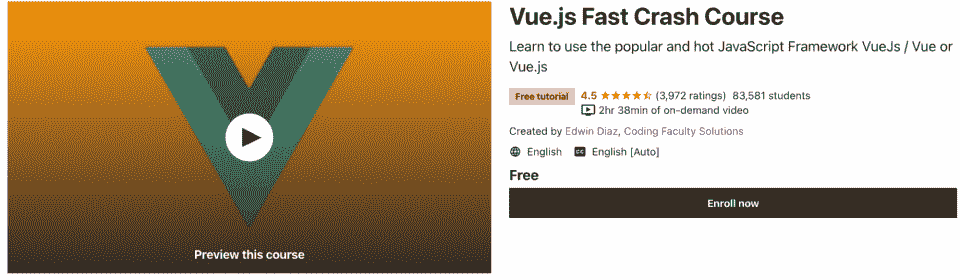**

**评级:** 4.5

**时长:** 2 小时 38 分钟

**先决条件:**

Vue.js 是一个 JavaScript 框架，最近变得非常流行。它改进了 Ember、React 和 Angular 等其他框架使用的许多特性。而且比 Angular 还要好用。学习 Vue.js 可以帮助您快速创建应用程序和其他项目，这是开发人员的一项宝贵技能。这个免费的 Udemy 课程涵盖了 Vue.js 基础知识，向您展示如何在几分钟内设置好。您还将了解列表呈现、数据绑定、组件、条件、控制结构、路由等等。

[**了解本课程的更多信息**](https://click.linksynergy.com/deeplink?id=jU79Zysihs4&mid=39197&murl=https%3A%2F%2Fwww.udemy.com%2Fcourse%2Fvuejs-fast-crash-course%2F)

**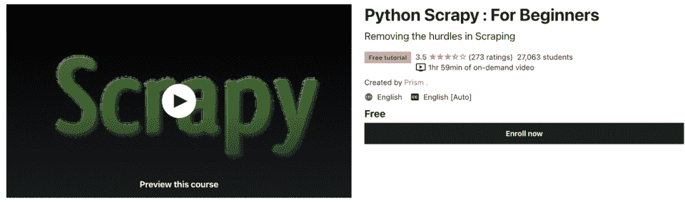**

**评级:** 4.3

**时长:** 1 小时 59 分钟

**先决条件:**

Python Scrapy:为初学者提供了对框架的深入了解。这个课程涵盖了你开始学习所需要的一切，并解决了新手在学习 Scrapy 时经常面临的问题。该课程还考虑使用 Scrapy 作为自由职业者，这样你就可以增加另一项技能。Python Scrapy:初学者通过略读和跳过的方法让学习者体验框架，只关注最重要的方面。

[**了解本课程的更多信息**](https://click.linksynergy.com/deeplink?id=jU79Zysihs4&mid=39197&murl=https%3A%2F%2Fwww.udemy.com%2Fcourse%2Fpython-scrapy-for-beginners%2F)

**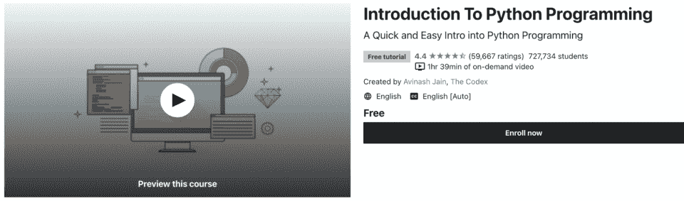**

**评级:** 4.4

**时长:** 1 小时 39 分钟

**先决条件:**

*   一台电脑
*   编程经验不是强制性的

Python 编程入门是 Udemy 提供的最好的免费在线课程之一。虽然该课程面向完全的初学者，但对于 Python 爱好者来说，它是一个极好的复习和回顾。享受本课程不需要任何编程知识，因为它是从 Python 编码基础开始的。

学生们将享受到与 Python 相关的所有东西的一站式商店。课程从基础开始，然后转向字符串、变量和数据类型。之后，学生学习循环、条件、文件操作，当然还有函数。

[**了解本课程的更多信息**](https://click.linksynergy.com/deeplink?id=jU79Zysihs4&mid=39197&murl=https%3A%2F%2Fwww.udemy.com%2Fcourse%2Fpythonforbeginnersintro%2F)

**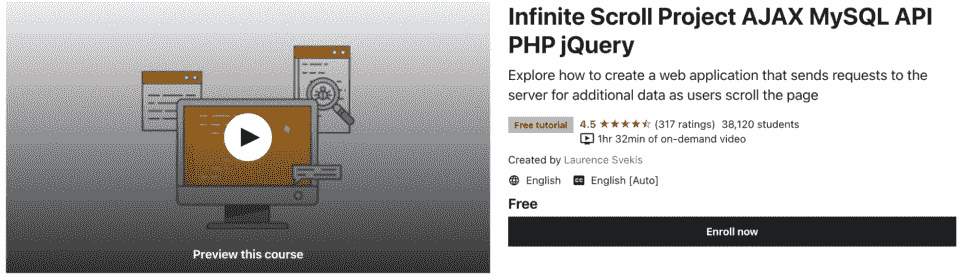**

**评级:** 3.4

**时长:** 1 小时 32 分钟

**先决条件:**

*   PHP 的工作知识
*   MySQL 的工作知识
*   JQuery 和 AJAX 的工作知识

即使你没有听说过**无限滚动**，很可能你在日常生活中已经遇到过。当用户向下滚动页面时，无限滚动会加载新内容，就像你在社交媒体时间轴和应用程序上看到的一样。这个免费的 Udemy 课程研究无限滚动并教你如何创建这个函数。为了让你尽快开始，创建者甚至包括了一个源代码供你使用。课程创建者认识到学习这种技术的最好方法是通过实践，这就是为什么课程围绕一个项目。

[**了解本课程的更多信息**](https://click.linksynergy.com/deeplink?id=jU79Zysihs4&mid=39197&murl=https%3A%2F%2Fwww.udemy.com%2Fcourse%2Fajax-project%2F)

**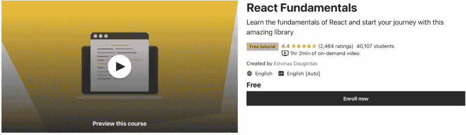**

**评级:** 4.2

**时长:** 1 小时 2 分钟

**先决条件:**

*   HTML、CSS 和 JavaScript 的工作知识

React 是一个框架或 JavaScript 库，开发人员使用它来构建具有独立组件的用户界面。虽然这个免费的 Udemy 课程很短，只有一个小时，但它是对 React 及其基础知识的一个很好的介绍。

本入门课程帮助您在几分钟内开始使用 React。它介绍了 JSX、反应元素、状态、道具、组件、容器等概念。

[**了解本课程的更多信息**](https://click.linksynergy.com/deeplink?id=jU79Zysihs4&mid=39197&murl=https%3A%2F%2Fwww.udemy.com%2Fcourse%2Freact-fundamentals%2F)

**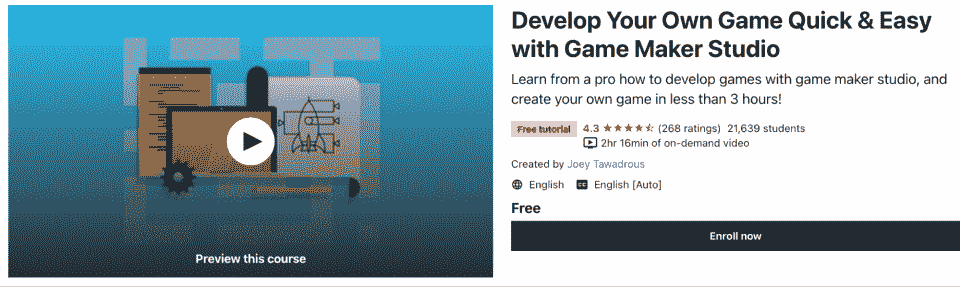**

**评级:** 4.7

持续时间: 2 小时 16 分钟

**先决条件:**

*   Game Maker Studio(别担心，可以免费下载)
*   编程经验不是必须的

如果你想创建自己的手机游戏，并在谷歌和苹果应用商店发布，本课程让你轻松入门。课程创建者开发了一个游戏，并从头到尾带着学生一起玩，展示一路上的步骤。你不需要事先游戏开发或编程知识来跟进。一旦完成，你可能就开始把你的想法变成现实，并直接发布到你自己的应用商店！这是 Udemy 提供的最好的免费课程之一，评分为 4.7/5。

[**了解本课程的更多信息**](https://click.linksynergy.com/deeplink?id=jU79Zysihs4&mid=39197&murl=https%3A%2F%2Fwww.udemy.com%2Fcourse%2Fdevelop-your-own-game-in-3-hours-with-game-maker-studio%2F)

**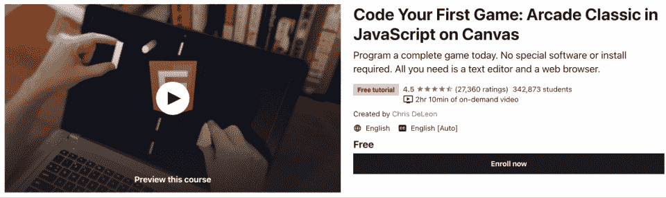**

**评级:** 4.7

**时长:** 2 小时 10 分钟

**先决条件:**

*   像记事本这样的纯文本编辑器，或者像 TextWrangler (Mac)或 Notepad++ (PC)这样具有附加功能(用于编程)的编辑器

*   一些操作系统文件扩展名(在视频中描述)
*   之前的 JavaScript 知识

这个免费的 Udemy 课程将教你使用一个文本编辑器和你的网络浏览器从头开始编写一个基本的游戏。然而，该课程的主要目标是通过实践经验来教授您游戏开发的基础知识。初级开发人员可以从这种实践中受益匪浅。该课程的一个亮点是它的每一步都附有源代码，帮助学生学习和比较他们的工作。有了这些材料，学生可以在短短几个小时内学会制作游戏。

[**了解本课程的更多信息**](https://click.linksynergy.com/deeplink?id=jU79Zysihs4&mid=39197&murl=https%3A%2F%2Fwww.udemy.com%2Fcourse%2Fcode-your-first-game%2F)

**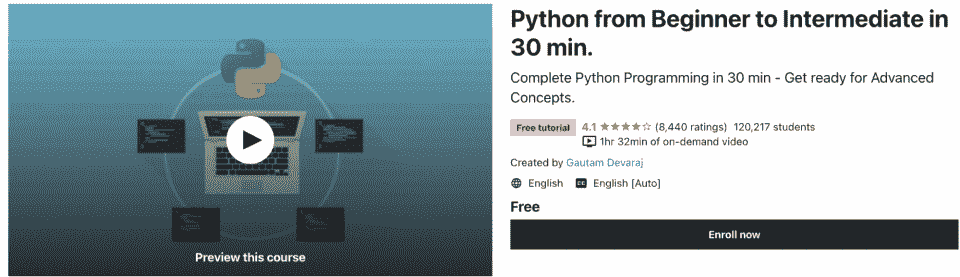**

**评级:** 4.1

**时长:** 1 小时 32 分钟

**先决条件:**

这门课程是专门为初学者开设的。它向学生传授基础知识，如安装和初学者编程，同时为他们以后学习更高级的概念做准备。Python 从初学者到中级是一个快速而简化的入门课程，旨在将学生带到后面的课程:Python 从初学者到专家。尽管列出了 30 分钟的时长，但实际上一个半小时的学习内容已经足够了。

[**了解本课程的更多信息**](https://click.linksynergy.com/deeplink?id=jU79Zysihs4&mid=39197&murl=https%3A%2F%2Fwww.udemy.com%2Fcourse%2Fpython-from-beginner-to-expert-starter-free%2F)

**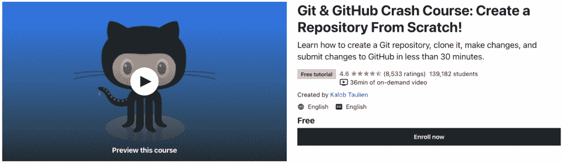**

**评级:** 4.6

**时长:** 36 分钟

**先决条件:**

Git 是一个流行且强大的版本控制工具，被世界各地的许多开发者所使用。世界各地的开发者和雇主都在使用 GitHub，这也是为什么如果你是一名开发者，学习 GitHub 是一个好主意。这 36 分钟的课程是 Git 和 GitHub 库的速成课程。它教你所有你需要知道的关于创建一个仓库，在你的电脑上制作副本，添加文件，以及直接上传修改到 GitHub。

[**了解本课程的更多信息**](https://click.linksynergy.com/deeplink?id=jU79Zysihs4&mid=39197&murl=https%3A%2F%2Fwww.udemy.com%2Fcourse%2Fgit-and-github-crash-course-creating-a-repository-from-scratch%2F)

**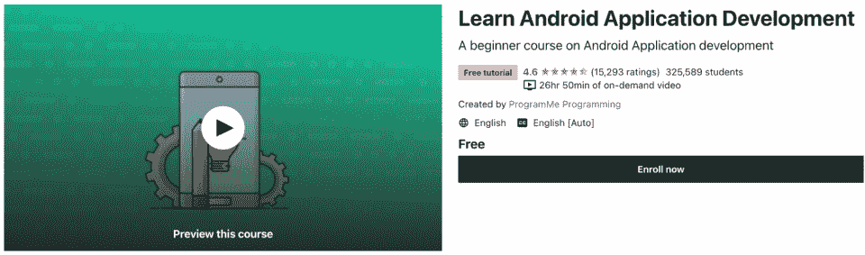**

**评级:** 4.5

持续时间: 26 小时 50 分钟

**先决条件:**

*   推荐基本编程背景
*   能够运行 Android Studio + Android 虚拟设备的 PC/Mac

该课程创建于 2017 年，免费提供近 27 小时的课程视频，具有无与伦比的价值。这可以说是最好的免费 Udemy 课程之一，它的高学生人数和高于平均水平的评分证明了这一点。本课程的特点是深入探究作为编程语言的 Java，然后介绍 Android 和 Android Studio。您将学习创建和调试您的应用程序，将它提交到 Google Playstore，等等。

[**了解本课程的更多信息**](https://click.linksynergy.com/deeplink?id=jU79Zysihs4&mid=39197&murl=https%3A%2F%2Fwww.udemy.com%2Fcourse%2Flearn-android-application-development-y%2F)

**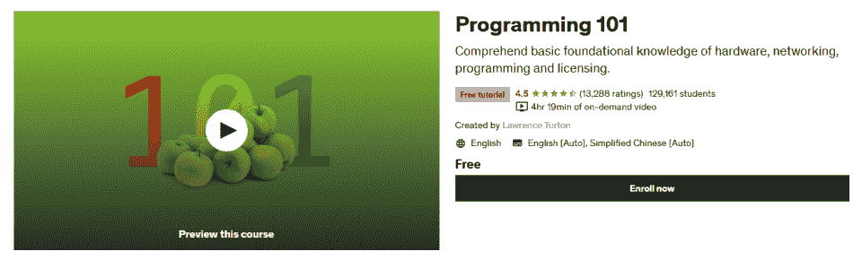**

**评级** :4.5

**持续时间** :4 小时 19 分钟

**先决条件**:

在开始编码之前，您可以做一些事情。其中之一就是用你需要的基础知识为自己做好准备，为成功做好准备。编程 101 是一门可以帮助你学习网络、硬件、许可和(当然)编程的基础知识的课程。这门课程是为任何人设计的，甚至是完全的初学者。因此，如果你正准备开始学习编程或计算机科学，那么这门课程以及它提供的 4 小时 20 分钟的内容是不会错的。

[**了解本课程的更多信息**](https://www.udemy.com/course/programming-101/)

**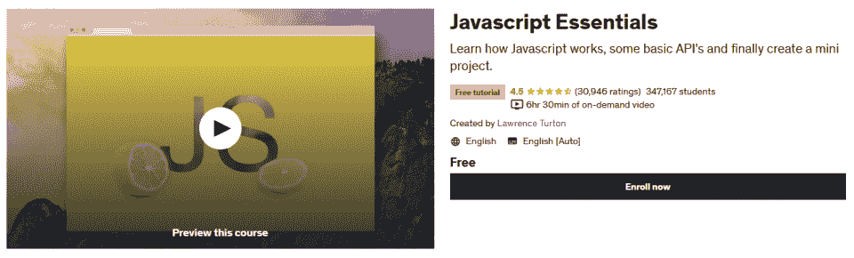**

**评级** : 4.5

**时长** : 6 小时 30 分钟

**先决条件**:

*   基本的 HTML 和 CSS 知识

JavaScript 基础课程是一个可以帮助你学习 JavaScript 如何工作的程序。在完成一个迷你项目之前，它还会教你一些基本的 API。这个六个半小时的课程要求你对 HTML 和 CSS 有一个基本的了解，以便你更容易地理解 JavaScript 背后的概念和思想，它的语法，它隐藏的怪癖，等等。

[**了解本课程的更多信息**](https://www.udemy.com/course/javascript-essentials/)

**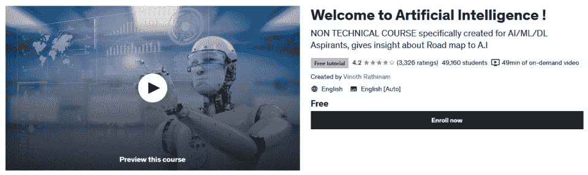**

**评级** :4.2

**持续时间** :49 分钟

**先决条件**:

如果你曾经想知道人工智能，以及它是否是一个适合你进入的领域，这门入门课程可能会给你你所寻求的答案。欢迎来到人工智能是一门非技术课程，涵盖了人工智能和机器学习的基础知识。它还谈到了开始您的第一个机器学习项目的一些先决条件或路线图。

[**了解本课程的更多信息**](https://www.udemy.com/course/road-map-to-artificial-intelligence-and-machine-learning)

**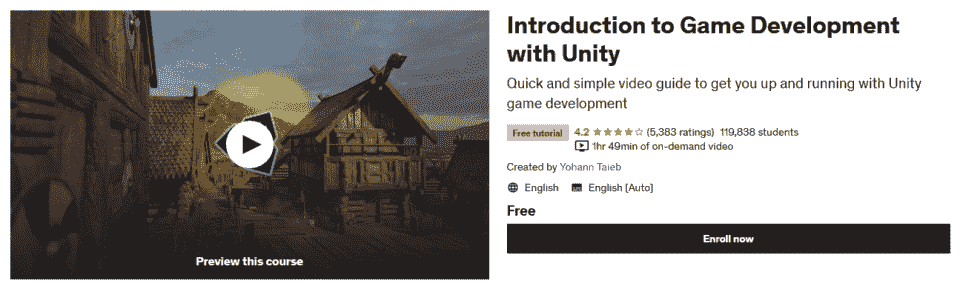**

**评级** :4.2

**持续时间** :1 小时 49 分钟

**先决条件**:

*   电脑(运行 Windows、macOS 或 Linux)

如果你曾经梦想成为一名游戏开发者，你可能会考虑参加免费的 Udemy 课程来学习你需要的技能。这份关于 Unity 游戏开发的介绍可以让你更容易开始创建你的游戏，因为像 Unity 这样的 IDE(集成开发环境)提供了游戏开发所需的所有工具——都在一个方便的地方。

[**了解本课程的更多信息**](https://www.udemy.com/course/introduction-to-game-development-with-unity/)

**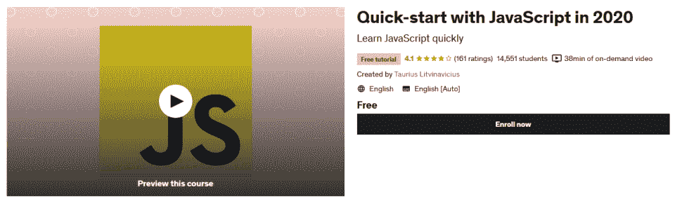**

**等级** :4.1

**持续时间** :38 分钟

**先决条件**:

尽管本课程现在已经开始过时了，但它仍然包含了大量相关和有用的信息，可以帮助您快速入门 JavaScript。本课程只有 38 分钟，更像是帮助您准备学习 JavaScript 的入门书。一旦你开始学习这门课程，你将学习 JavaScript 的基础知识，包括语法、函数结构、变量等等。

[**了解本课程的更多信息**](https://www.udemy.com/course/quick-start-with-javascript-in-2020/)

**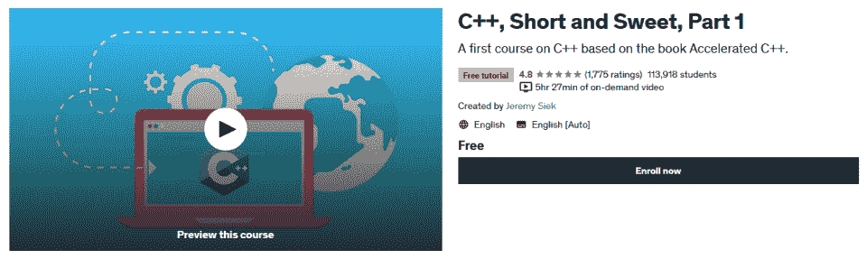**

**评级** :4.8

**持续时间** :5 小时 27 分钟

**先决条件**:

如果您曾经想学习编程语言 C++，请考虑 C++简明扼要的第 1 部分课程。这是 Udemy 2023 提供的最好的免费课程之一，评分为 4.8 分(5 颗星)，有超过 110，000 名过去的学生。如果您想学习如何开始用 C++语言编写程序，请注册本课程。这是一门由科罗拉多大学教授 Jeremy Siek 教授的高质量课程。

[**了解本课程的更多信息**](https://www.udemy.com/course/cpp-short-and-sweet/)

**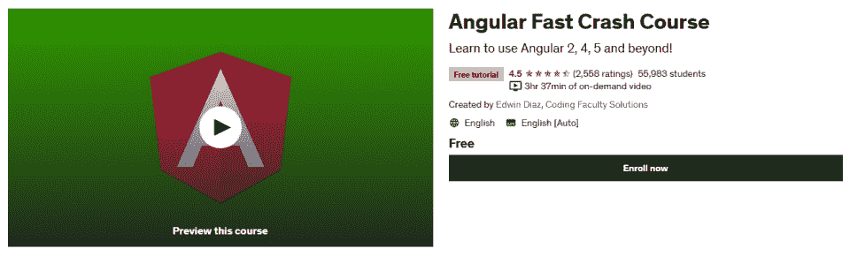**

**评级** :4.5

**持续时间** :3 小时 37 分钟

**先决条件**:

*   HTML、CSS 和 JavaScript 知识

这个角度快速速成课程不仅仅是教你一种角度——你将学习角度 2、4 和 5。这个速成课程已经帮助超过 55，000 名学生了解 Angular 2+及其主要组件，以便他们能够立即上手并运行。如果你想学习 AngularJs (Angular 1)，去别处看看，因为这个 Udemy 免费课程更关注 2 之后的版本。

[**了解本课程的更多信息**](https://www.udemy.com/course/angular-fast-crash-course/)

**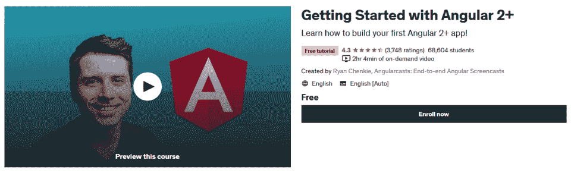**

**等级** :4.3

**持续时间** :2 小时 4 分钟

**先决条件**:

*   HTML、CSS 和 JavaScript 的工作知识(你不需要成为专家)

如果你想学习如何用 Angular 2+构建你的第一个应用程序，Angular 2+入门是一个帮助你入门的极好的课程。这个课程有两个多小时的内容，教你用 Angular 构建一个简单应用的基础，包括一些最常见的特性，比如 HTTP、指令、组件、表单等等。

[**了解本课程的更多信息**](https://www.udemy.com/course/getting-started-with-angular-2/)

**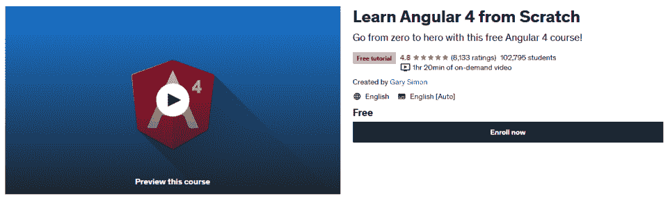**

**评级** :4.8

**时长** :1 小时 20 分钟

**先决条件**:

*   HTML、CSS 和 JavaScript 的工作知识

从头开始学习 Angular 4 是 Udemy 众多免费课程中的一个。特别是这一个，它的内容不到一个半小时，但是根据它的 4.8/5 星评级和 100，000 多名学生来看，其中的信息对你的学习之旅非常有价值和有帮助。

[**了解本课程的更多信息**](https://www.udemy.com/course/learn-angular-from-scratch)

**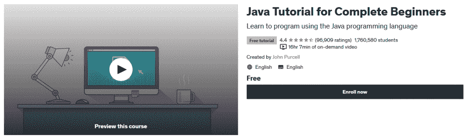**

**评级** :4.4

**时长** :16 小时 7 分钟

**先决条件**:

Udemy 上的 Java 初学者教程是一个不可思议的免费程序，内容超过 16 个小时。过去有超过 170 万名学生上过这门课，这证明了其中包含的课程是多么有价值。该课程从绝对的基础开始，甚至帮助完全的初学者学习如何使用 Java 编程。

[**了解本课程的更多信息**](https://www.udemy.com/course/java-tutorial/)

****

**评级** :4.5

**持续时间** :3 小时 5 分钟

**先决条件**:

*   一台可以上网的电脑和一点决心！

如果你曾经想学习一点网站开发的入门知识，没有比这个课程更好的了。《掌握 HTML5 和 CSS3 的基础》是一门课程，教你 web 开发的两大支柱——HTML 和 CSS。你不必是一个知识渊博或经验丰富的学习者开始这门课程，你需要的只是一台电脑和一个互联网连接！

[**了解本课程的更多信息**](https://www.udemy.com/course/master-the-basics-of-html5-css3-beginner-web-development/)

****

**评级** :4.6

**持续时间** :5 小时 24 分钟

**先决条件**:

*   web 浏览器、文本编辑器和 JavaScript 基础知识

本课程要求您已经具备 JavaScript 的基础知识。高级和面向对象的 JavaScript 和 ES6 不适合初学者，但是如果你是一个具有其他 OOP 语言背景的开发人员，并且想学习如何实现 OOP JS，这个课程可以适合你。如果您想加深对 JavaScript 的了解并掌握这门语言，请注册本课程。

[**了解更多关于本课程的信息**](https://www.udemy.com/course/advanced-and-object-oriented-javascript)

## **最佳免费数据科学、IT、&软件 Udemy 课程**

**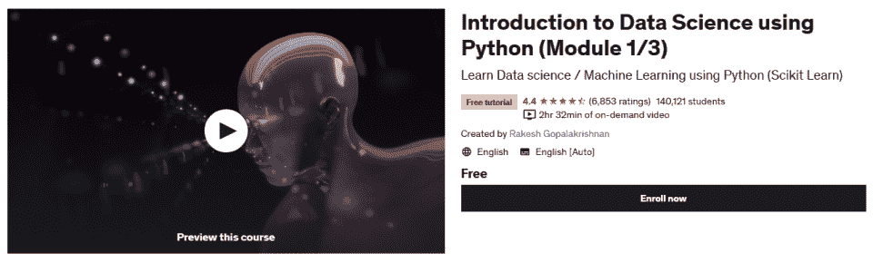**

**评级** :4.4

**持续时间** :2 小时 32 分钟

**先决条件**:

*   Windows 或 Mac 电脑

如果你对数据科学完全陌生，本课程是对这个不断增长且利润丰厚的领域的完美介绍。正如您可能已经猜到的那样，使用 Python 模块介绍数据科学是一本数据科学和机器学习的初级读本，可以帮助您使用 Python 的 Scikit 学习库学习该领域。

[**了解本课程的更多信息**](https://www.udemy.com/course/introduction-to-data-science-using-python)

**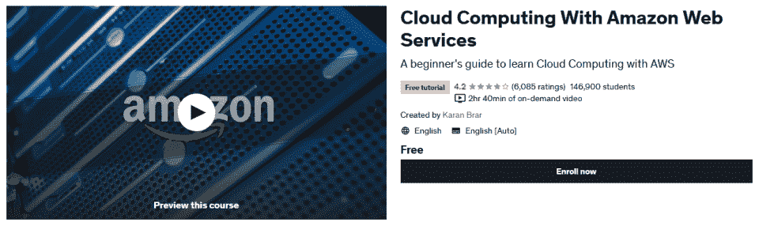**

**评级** :4.2

**时长** :2 小时 40 分钟

**先决条件**:

如果你是一个初学者，想要了解更多关于云计算的知识，那么本课程是关于云计算和非常流行的亚马逊网络服务的极好的入门书。在这个近三个小时的课程中，您将学习如何在云中创建虚拟服务器、配置用于监控的服务、配置云存储服务等等。该课程最适合开发人员、系统管理员和中小型组织。

[**了解本课程的更多信息**](https://www.udemy.com/course/cloud-computing-with-amazon-web-services-part-1/)

**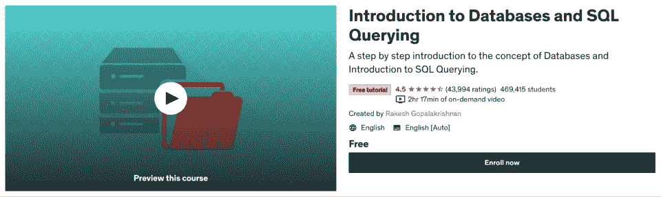**

**评级** :4.5

**持续时间** :2 小时 17 分钟

**先决条件**:

*   没有知识前提
*   带有 Windows 虚拟机的 Windows 计算机或 Mac/Linux 设置

本课程没有任何先决条件，因为它是为那些想更多地了解这个主题的初学者设计的。创建者 Rakesh Gopalakrishnan 创建了该课程，涵盖了从安装到创建第一个数据库表和进行查询的基础知识。

[**了解本课程的更多信息**](https://www.udemy.com/course/introduction-to-databases-and-sql-querying/)

****

**评级** :4.4

**时长** :2 小时 41 分钟

**先决条件**:

*   运行 Windows、macOS 或 Linux 的电脑
*   基本软件开发概念的知识

如果您想学习如何有效地设计数据库，可以考虑参加数据库设计和管理课程。本课程的讲座涵盖了各种主题，从数据库设计的介绍，到 ERD、列和实体的描述。一旦你对 ERD 有了更好的了解，本课程将带你进入更深的主题，最后向你展示一些数据库设计/管理的最佳实践。

[**了解本课程的更多信息**](https://www.udemy.com/course/database-design-and-management)

**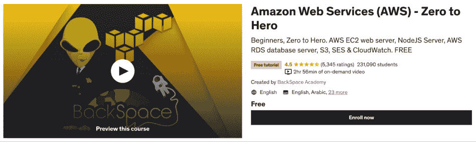**

**评级** :4.5

**时长** :2 小时 56 分钟

**先决条件**:

*   计算机网络的基本知识

如果你想学习如何使用非常流行的 AWS 或 Amazon Web Services，可以考虑这个课程。该课程有近三个小时的内容，还提供 24 种语言的字幕，以达到最佳的可及性。通过十四节课中的每一节，学习如何在 AWS 上完成最常见的任务。

[**了解本课程的更多信息**](https://www.udemy.com/course/amazon-web-services-aws-v)

**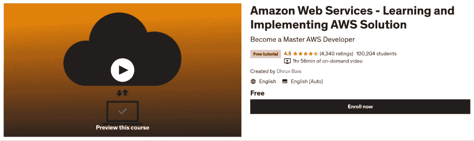**

**评级** :4.5

**持续时间** :1 小时 56 分钟

**先决条件**:

*   建议您注册一个 AWS 帐户，以帮助您完成培训

想要学习如何进行 AWS 的 E2E(端到端)实施的人可以报名参加本课程，本课程有将近两个小时的宝贵内容。本课程将带您了解 AWS 的基础知识，然后慢慢学习更高级的概念，为以后学习更复杂的主题做准备。

[**了解本课程的更多信息**](https://www.udemy.com/course/amazon-web-services-aws)

**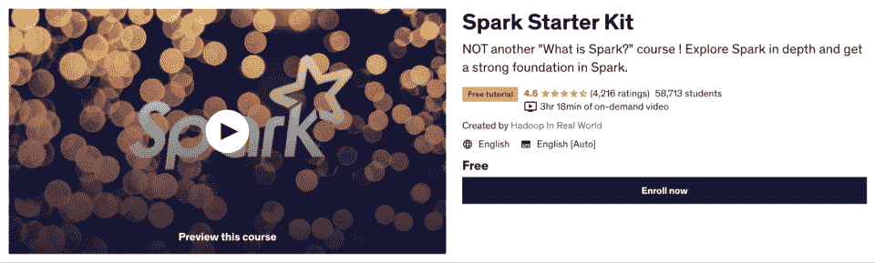**

**评级** :4.6

**持续时间** :3 小时 18 分钟

**先决条件**:

*   了解 Hadoop 的基本概念

如果您曾经想了解 Apache Spark，本课程是它的最佳入门工具。在本课程中，您将了解 Spark 的基础知识、它与 Hadoop 的异同，以及 Spark 的效率和性能背后的原因。在课程结束时，您应该对 Apache Spark 有了良好的基础。

[**了解本课程的更多信息**](https://www.udemy.com/course/sparkstarterkit/)

## **最佳免费 Udemy 设计在线课程**

**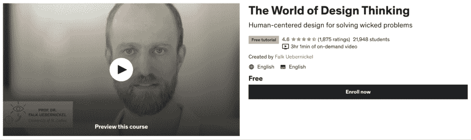**

**评级** :4.6

**时长** :3 小时 1 分钟

**先决条件**:

*   课程创建者推荐好奇心、开放思想和以人/客户为中心

设计思维是一项需要培养的宝贵技能，因为它可以帮助你创建以人为中心的设计来解决问题。“设计思维的世界”课程是一个三小时的项目，旨在帮助你在日常实践中学习和应用设计思维——当然，也包括你的工作项目。这门课程有 21 堂课要完成，还有数字原型的额外课程。

[**了解本课程的更多信息**](https://www.udemy.com/course/the-world-of-design-thinking/)

**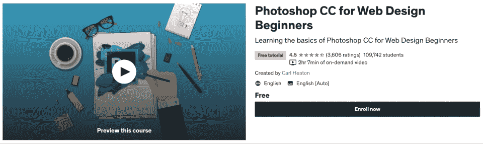**

**评级** :4.5

**时长** :2 小时 7 分钟

**先决条件**:

如果你以前从未使用过 Photoshop，但想开始学习基础知识，面向网页设计初学者的 Photoshop CC 是一个很好的起点。本课程将教你为网页制作图形和设计所需的知识。您还将学习如何制作一个简单的页面设计，以便在“极简”风格的设计中使用。

[**了解本课程的更多信息**](https://www.udemy.com/course/photoshop-for-web-design-beginners-version2/)

**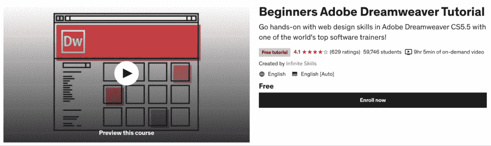**

**等级** :4.1

**持续时间** :9 小时 5 分钟

**先决条件**:

*   课程创建者没有指定要求，但是我们建议您使用 Adobe Dreamweaver，以便您可以继续学习

这个 Adobe Dreamweaver 初学者教程包括超过九个小时的内容，帮助您学习 Adobe Dreamweaver 的基础知识。它将教您 Dreamweaver 特定的选项和工具，还会向您展示与其他 Adobe Creative Suite 工具的一些互操作性。您将学习如何使用 Dreamweaver 的所见即所得(WYSIWYG)拖放编辑功能来规划、设计、上传和测试一个完整的站点。

[**了解本课程的更多信息**](https://www.udemy.com/course/learn-dreamweaver-with-infinite-skills/)

**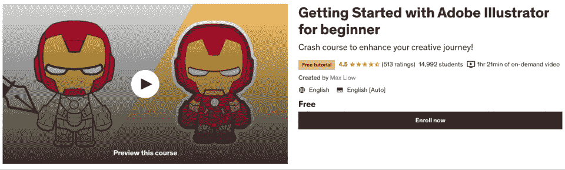**

**评级** :4.5

**持续时间** :1 小时 21 分钟

**先决条件**:

*   课程创建者声明没有要求，但是我们建议您使用 Adobe Illustrator，这样您就可以跟着学习了

Adobe Illustrator 是一个非常受欢迎和有价值的设计工具，用于创建徽标和其他矢量设计。本课程将向您展示该应用程序的基础知识，包括如何使用该软件附带的工具。简短的速成课程还将一步一步地向您展示如何创建自己的设计，然后将其导出为图像或 PDF。

[**了解本课程的更多信息**](https://www.udemy.com/course/getting-started-with-adobe-illustrator-for-beginner)

## **免费的最佳营销 Udemy 课程**

**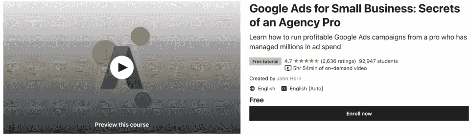**

**评级:** 4.3

持续时间: 5 小时 54 分钟

**先决条件:**

*   计算机和互联网连接

小企业的谷歌广告词:一个专业机构的秘密是一门基础课程，为想了解谷歌广告词的人。这个免费的 Udemy 课程教你如何利用 AdWords 增加商业机会和增长。您将学习如何开展不同的活动，选择有效且以结果为导向的关键词，通过平台监控您的收入，等等。

[**了解本课程的更多信息**](https://click.linksynergy.com/deeplink?id=jU79Zysihs4&mid=39197&murl=https%3A%2F%2Fwww.udemy.com%2Fcourse%2Fgoogle-adwords-for-small-business-secrets-of-an-agency-pro%2F%3FranMID%3D39197%26ranEAID%3DjU79Zysihs4%26ranSiteID%3DjU79Zysihs4-iE91AmPppsCozeoYoLEqmw%26LSNPUBID%3DjU79Zysihs4%26utm_source%3Daff-campaign%26utm_medium%3Dudemyads)

**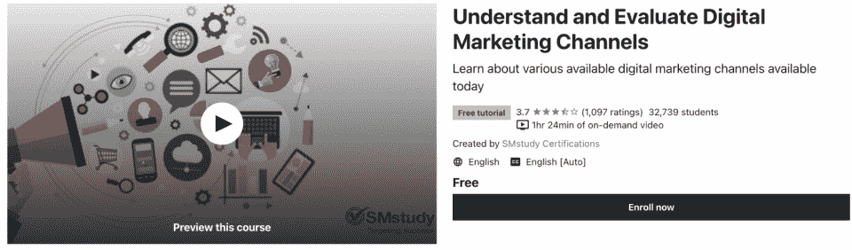**

**评级:** 4.6

**时长:** 1 小时 24 分钟

**先决条件:**

“了解和评估数字营销渠道”课程是为那些希望利用各种数字营销渠道来获取利益的人设计的。本课程可以帮助你提高你的营销技巧，并利用它们来抓住你的目标受众。本课程结束时，学生可以学习如何扩展、发展和更新他们的数字营销渠道知识。

[**了解本课程的更多信息**](https://click.linksynergy.com/deeplink?id=jU79Zysihs4&mid=39197&murl=https%3A%2F%2Fwww.udemy.com%2Fcourse%2Fsmstudy-understand-and-evaluate-digital-marketing-channels%2F)

**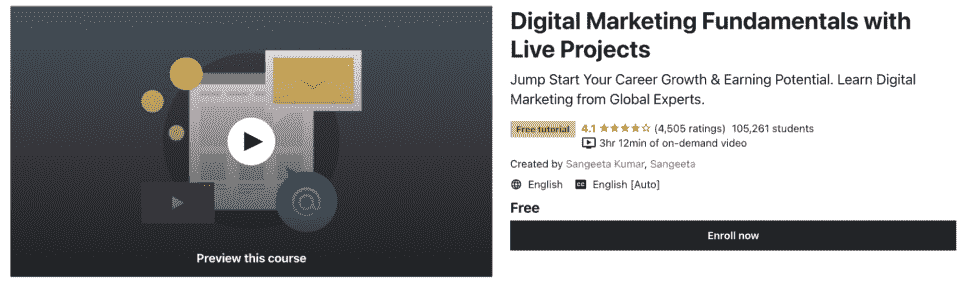**

**评级:** 4.2

**时长:** 3 小时 12 分钟

**先决条件:**

这个关于数字营销的免费 Udemy 课程向完全的初学者介绍了与数字营销相关的概念，提供了格式、策略和实践经验。学生们学习如何从零开始创建数字营销策略，同时通过工作表和实践经验牢记业务目标，在这里他们可以学到识别 KPI 所需的知识。

[**了解本课程的更多信息**](https://click.linksynergy.com/deeplink?id=jU79Zysihs4&mid=39197&murl=https%3A%2F%2Fwww.udemy.com%2Fcourse%2Fdigital-marketing-foundation%2F)

**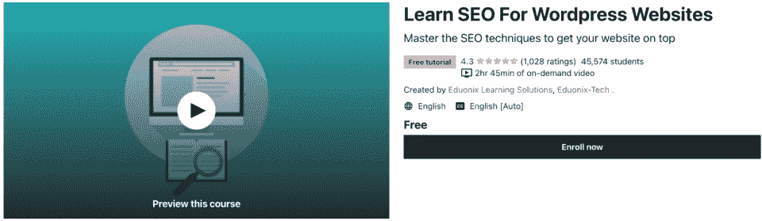**

**评级:** 4.3

**时长:** 2 小时 45 分钟

**先决条件:**

WordPress 是最受欢迎的内容管理系统之一。这门课程教给学生在 WordPress SEO 上取得成功所必需的知识和技术。它还涵盖了各种工具，可帮助您提高搜索引擎优化，使您的网站可以在搜索引擎上排名更好。这个课程将信息浓缩成一个简单的，容易理解的课程，任何有基本 WordPress 知识的人都可以学习。

[**了解本课程的更多信息**](https://click.linksynergy.com/deeplink?id=jU79Zysihs4&mid=39197&murl=https%3A%2F%2Fwww.udemy.com%2Fcourse%2Flearn-seo-for-wordpress-websites)

**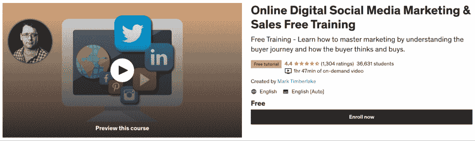**

**评级** :4.4

**持续时间** :1 小时 47 分钟

**先决条件**:

*   互联网接入
*   完成课程的意愿

马克·汀布莱克的在线数字社交媒体营销课程是一个非常好的免费课程，可以帮助你了解什么是在线营销以及它是如何运作的。这个免费的 Udemy 课程旨在向你展示买家的旅程，然后教你买家是如何思考的，这样你就可以学习向他们销售的最佳方式。这门课程涵盖了各种各样的主题，所以它当然值得一看！

[**了解本课程的更多信息**](https://www.udemy.com/course/online-digital-social-media-marketing-sales-for-beginners)

## **关于商业的最佳免费 Udemy 课程**

**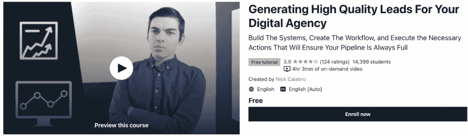**

**评级:** 4.4

**持续时间:** 4 小时 3 分钟

**先决条件:**

这个免费的 Udemy 课程承诺会教你足够好的机构领导生成，让你在睡觉的时候也能做到。了解面对面和在线情况下的最佳销售线索挖掘策略，以便您能够挖掘出*高价值和高质量的*销售线索。最棒的是，这门课教你*常青树*技术(意味着它们永远不会过时或过时)。

[**了解本课程的更多信息**](https://click.linksynergy.com/deeplink?id=jU79Zysihs4&mid=39197&murl=https%3A%2F%2Fwww.udemy.com%2Fcourse%2Fhigh-quality-leads-digital-agency%2F)

**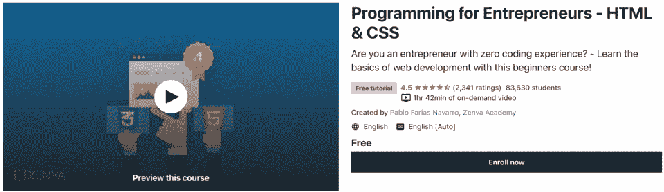**

**评级:** 4.4

**时长:** 1 小时 42 分钟

**先决条件:**

*   不需要先验知识
*   计算机、代码编辑器和 web 浏览器
*   免费工具:Adobe 支架和谷歌浏览器

如果你是一个厌倦了花太多钱外包工作的企业家，这个课程可能适合你。HTML & CSS 教你如何使用这两种语言从头开始建立一个网站。你将学习网络开发的基础知识，这样你就可以开始建立自己的网站——或者修改已经存在的网站。本课程涵盖了 HTML 和 CSS 的基础知识。

[**了解本课程的更多信息**](https://click.linksynergy.com/deeplink?id=jU79Zysihs4&mid=39197&murl=https%3A%2F%2Fwww.udemy.com%2Fcourse%2Fprogramming-for-entrepreneurs%2F)

**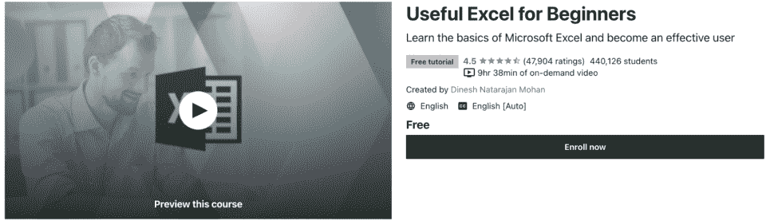**

**评级:** 4.5

**时长:** 9 小时 38 分钟

**先决条件:**

*   一台电脑
*   Microsoft Excel(2007、2010 和 2013 或 Microsoft 365 的版本)

本课程通过简单易懂的课程帮助那些对 Microsoft Excel 毫无经验的人。课程包括使用书店相关数据的练习。您可以下载相关文件，一路跟随。有超过九个半小时的课程可以通过视频点播，让你按照自己的节奏学习。

[**了解本课程的更多信息**](https://click.linksynergy.com/deeplink?id=jU79Zysihs4&mid=39197&murl=https%3A%2F%2Fwww.udemy.com%2Fcourse%2Fuseful-excel-for-beginners%2F)

**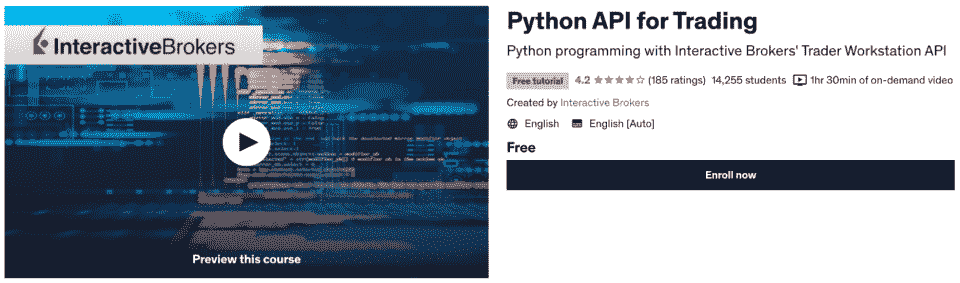**

**评级** :4.2

**时长** :1 小时 30 分钟

**先决条件**:

*   使用 Windows、Linux 或 macOS 的电脑
*   已安装 GUI 和 Python 3.3 或更高版本
*   熟悉使用 Python 编码——如果您不熟悉多线程、套接字编程等一些概念，课程创建者建议您在继续本课程之前先学习 Python 入门课程

Python API for Trading 课程将教你如何使用 Python TWS API 查看市场数据*和*交易。您将学习如何访问投资组合数据、下订单等等。

[**了解本课程的更多信息**](https://www.udemy.com/course/python-api-for-trading/)

**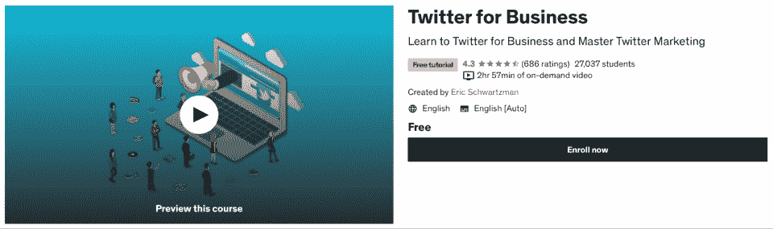**

**等级** :4.3

**时长** :2 小时 57 分钟

**先决条件**:

*   一个当前的浏览器，一个免费的 Twitter 账户，知道如何复制/剪切/粘贴和拖放

如果你一直想开始使用 Twitter 来帮助改善你的业务，你可以参加这个三小时的课程。在讲座中，你将学习 Twitter 的基础知识，为什么你的业务需要它，如何保护你的帐户安全，在 Twitter 上保持帐户的合法性，以及许多更高级的话题。

[**了解本课程的更多信息**](https://www.udemy.com/course/twitter-for-business-schwartzman/)

**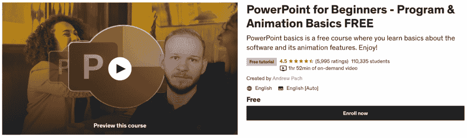**

**评级** :4.5

**持续时间** :1 小时 52 分钟

**先决条件**:

*   Windows 或 Mac 上的 Microsoft PowerPoint 越新越好(推荐 365、2019 或 2016 版本)
*   不需要其他先验知识

PowerPoint 初学者课程非常适合想要学习如何使用微软的 PowerPoint 及其动画功能的初学者或没有经验的用户。在课程结束时，你将有希望能够轻松地使用 PowerPoint，并为以后学习更高级的课程做好准备。

[**了解本课程的更多信息**](https://www.udemy.com/course/powerpoint-for-beginners-free/)

****

**等级** :4.0

**持续时间** :1 小时 7 分钟

**先决条件**:

*   您的计算机上应该安装了 Microsoft Excel 2016

如果您曾经需要了解 Microsoft Excel 的数据透视表以及如何创建和使用它们，那么本课程是最好的选择之一。通过本课程，您将学习如何创建、更新和自定义数据透视表。它是完全免费的，并提供了一些现实生活中的例子，使其更容易理解课程。如果你准备好开始，你可以点击下面的课程链接！

[**了解本课程的更多信息**](https://www.udemy.com/course/excel-2016-pivot-tables-for-beginners)

**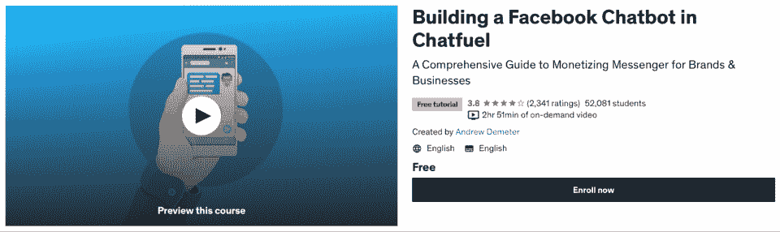**

**等级** :3.8

**时长** :2 小时 51 分钟

**先决条件**:

*   Google Sheets、Photoshop、MailChimp、Facebook Messenger 和脸书广告

这门课程不是 Udemy 上评价最好的，但它是免费的，尽管有缺陷，但它提供了大量好的建议和信息。在 Chatfuel 中构建脸书聊天机器人包括近三个小时的内容，教你如何用人工智能创建聊天机器人，使用脸书广告，向机器人的电子商务功能添加一些追加销售，等等。

[**了解本课程的更多信息**](https://www.udemy.com/course/building-a-facebook-messenger-chat-bot-in-chatfuel)

**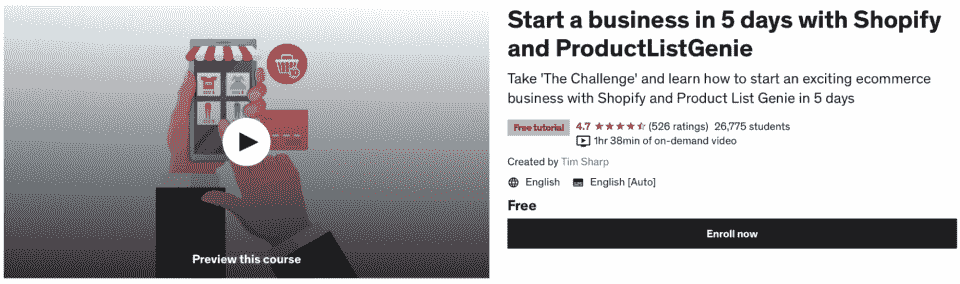**

**评级** :4.7

**持续时间** :1 小时 38 分钟

**先决条件**:

*   你不需要任何电子商务知识
*   注册后，您将获得为期 14 天的 Shopify 免费试用
*   注册后，您将获得为期 3 天的产品列表精灵免费试用

如果你曾经想在 Shopify 上创建自己的企业，这个简短的课程将向你展示开始创业所需的一切。4.7/5 星，该课程是该平台上最好的免费课程之一。您将收到开始工作所需的工具，甚至会收到脸书支持小组的邀请(产品列表精灵)。

[**了解本课程的更多信息**](https://www.udemy.com/course/start-a-business-in-5-days-with-shopify-and-productlistgenie/)

## Udemy 上的最佳免费课程:杂项主题

**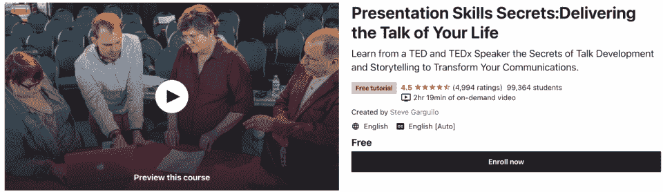**

**评级:** 4.5

持续时间: 2 小时 19 分钟

**先决条件:**

*   理想情况下，学生带着特定的演讲、演示或交流来上课
*   思考你需要传达的即将到来的沟通

演讲技巧的秘密:讲述你的人生课程是为那些想在演讲时吸引听众的人准备的。主要外卖？互动对话的重要性。注册本课程后，您将获得一些最佳资源。如果你觉得很难表达自己的想法和观点，这门课会很有用，可以帮助你做有效的、吸引人的、吸引眼球的演讲。所有这些*都没有让*临阵退缩。

[**了解本课程的更多信息**](https://click.linksynergy.com/deeplink?id=jU79Zysihs4&mid=39197&murl=https%3A%2F%2Fwww.udemy.com%2Fcourse%2Fpresentation-skills-secrets%2F)

**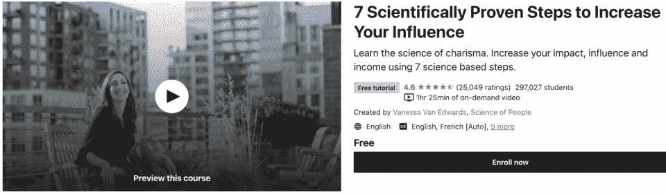**

**评级:** 4.5

**时长:** 1 小时 25 分钟

**先决条件:**

*   学生应该愿意接受并实践本课程的内容

《提高影响力的 7 个科学证明的步骤》课程旨在帮助你掌控自己的生活，处理不舒服的情况，并对他人产生积极的影响。它是为那些经常难以积极影响他人的人设计的。该课程采用积极、引人入胜、基于科学的方法来帮助你学习如何影响你周围的人。

[**了解本课程的更多信息**](https://click.linksynergy.com/deeplink?id=jU79Zysihs4&mid=39197&murl=https%3A%2F%2Fwww.udemy.com%2Fcourse%2F7-scientifically-proven-steps-to-increase-your-influence%2F)

**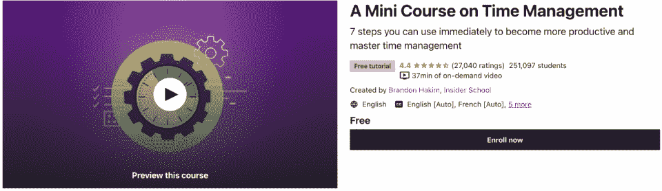**

**评级:** 4.4

**时长:** 37 分钟

**先决条件:**

*   采取行动的意愿

关于时间管理的迷你课程是一个包罗万象的课程，教你时间管理的重要性。这门课程对每个人都有好处，教你如何有效地管理你的时间。无论你是学生还是职场人士，时间管理对实现你的目标至关重要。如果你想提高你的工作效率，请点击下面的课程链接。

[**了解本课程的更多信息**](https://click.linksynergy.com/deeplink?id=jU79Zysihs4&mid=39197&murl=https%3A%2F%2Fwww.udemy.com%2Fcourse%2Fmanageyourtime%2F)

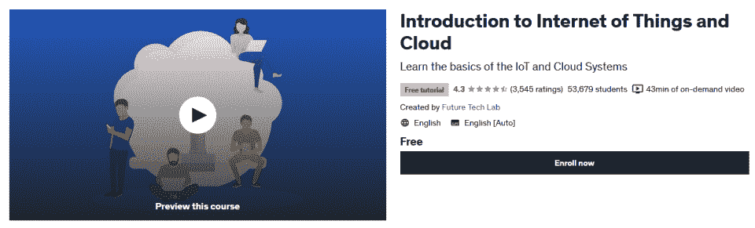

**评级:** 4.3

**时长:** 43 分钟

**先决条件:**

有兴趣了解云计算和物联网吗？对于没有技术背景的人来说，这门课程是一个极好的入门课程。《物联网和云计算简介》还将为您提供如何使用物联网和云计算的实践经验。理论和实践相结合的课程有助于你获得应用知识所需的所有经验。

[**了解本课程的更多信息**](https://click.linksynergy.com/deeplink?id=jU79Zysihs4&mid=39197&murl=https%3A%2F%2Fwww.udemy.com%2Fcourse%2Fa4iot-intro-iot-cloud%2F)

## **我的优惠券是什么以及它们是如何工作的？**

像任何其他优惠券一样，Udemy 优惠券可以帮助您节省购买课程的费用。优惠券来自课程创作者自己，他们可以打折甚至完全免费提供课程。

## **如何免费获取 Udemy 付费课程**

你可以查看免费的 Udemy 课程网站，比如 [CouponScorpion](https://couponscorpion.com/category/100-off-coupons/) ，它会向你展示有 100%优惠券的课程。其中一些网站会自动将优惠券代码应用到您的 Udemy 结帐中，让您可以免费获得一门课程。

一些课程作者还会随时发布优惠券代码。比如有一些创作者会每月放出折扣。当他们这样做时，你可以在结账时使用他们的优惠券来获得折扣。

在某些情况下，您可以尝试联系课程创建者，看看他们是否愿意为您提供折扣优惠券。如果他们感觉特别慷慨，他们可能会给你 100%的优惠券，这样你就可以免费参加他们的课程。

## **结论**

自我教育可以增加你的职业机会，因为它可以帮助你增加知识，提高雇主需要的各种科目的技能。Udemy 为所有年龄段的人提供一些最好的在线培训服务。这些顶级的免费 Udemy 课程对任何想学习新事物的人来说都是理想的选择。

正如他们所说——教育没有年龄。你可以随时学习，并通过这些免费课程(以及许多折扣很大的付费课程)来增强你的知识基础。这些课程将帮助你设定新的目标，将成功带到一个新的高度，并朝着更美好的生活努力。

你想推荐其他受欢迎的课程吗？下面评论！或者，查看我们的 2023 年最佳课程清单。

你不确定 Udemy 是一个学习平台吗？查看我们的 [**深度 Udemy 回顾**](https://hackr.io/blog/udemy-review) **。**

## **常见问题解答**

#### **1。Udemy 有免费课程吗？**

是啊！这篇文章列出了 Udemy 上很多可用的免费课程供你选择。你也可以用 100%的优惠券或课程作者的优惠券代码免费获得 Udemy 付费课程。

#### **2。我如何免费获得我的课程？**

你找到免费 Udemy 课程的最好方法是使用 Udemy 的搜索功能。然后，使用过滤功能显示您搜索的关键字的免费课程。或者，你可以留意 Udemy 的无优惠券选项，尽管这种情况很少见。

如果你等不及某个特定的课程免费(可能永远也等不到)，你可以等一等 Udemy 的大减价。

#### **3。我可以在简历上使用 Udemy 证书吗？**

是的，如果与你未来的职位非常相关，你可以在简历中使用 Udemy 证书。关于 Udemy 课程的问题是，几乎任何人都可以创建一个课程，所以没有多少潜在雇主承认它们的合法性——例如，至少与更传统的大学学位相比。

#### **4。如何在 PC 上下载 Udemy 视频？**

虽然你可以在移动设备上免费下载 udemy 课程，但并非所有课程都可以在 PC 上下载。平台安全功能意味着有些课程不能在您的计算机上下载。也就是说，点击课程播放器中的齿轮图标，调出菜单。点击**下载讲座**免费下载 Udemy 课程；如果它是灰色的，这意味着课程不可在 PC 上下载。

#### **5。如何从 Udemy 获得证书？**

如果你想获得证书，你必须完成我的付费课程。不幸的是，没有带结业证书的 Udemy 免费课程。完成付费课程后，您可以通过单击课程材料播放器上方的奖杯(带有文本 Get Certificate)来下载您的证书，该奖杯现在已经变了颜色，表示您的证书可以领取了。

#### **6。如何一次性下载所有 Udemy 视频？**

目前，从 Udemy 下载所有视频的最佳方式是使用类似于 [Allavsoft](https://www.allavsoft.com/) 的软件。这不是最好的选择，因为它是一个需要许可证才能使用的付费应用程序。你也可以尝试一个视频下载浏览器扩展，虽然这种方法也不是最可靠的。单独下载每个视频仍然是最好和最安全的方法。

#### **7。免费的 Udemy 课程如何赚钱？**

发布一个免费的 Udemy 课程不会给课程创建者带来任何收入。然而，它提供的是免费广告和课程作者资料的订阅者。这样，如果作者决定创建另一个付费课程，更多人可能会注意到并为该课程付费。