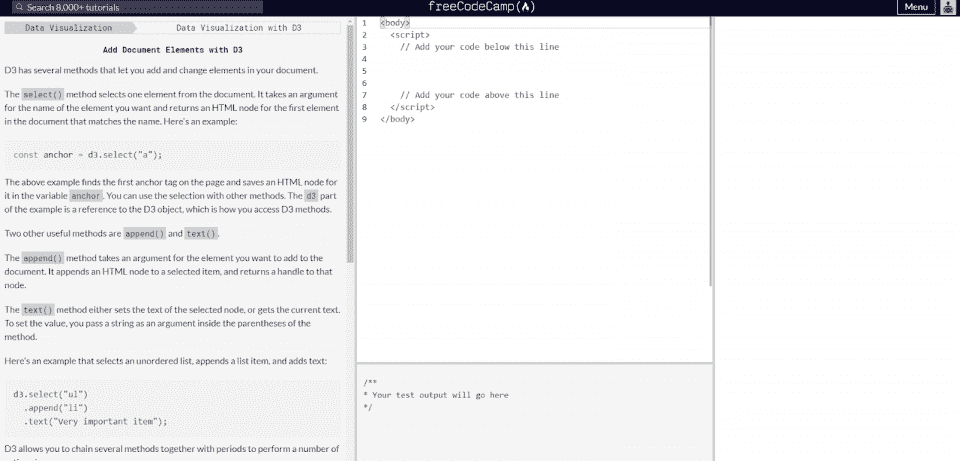
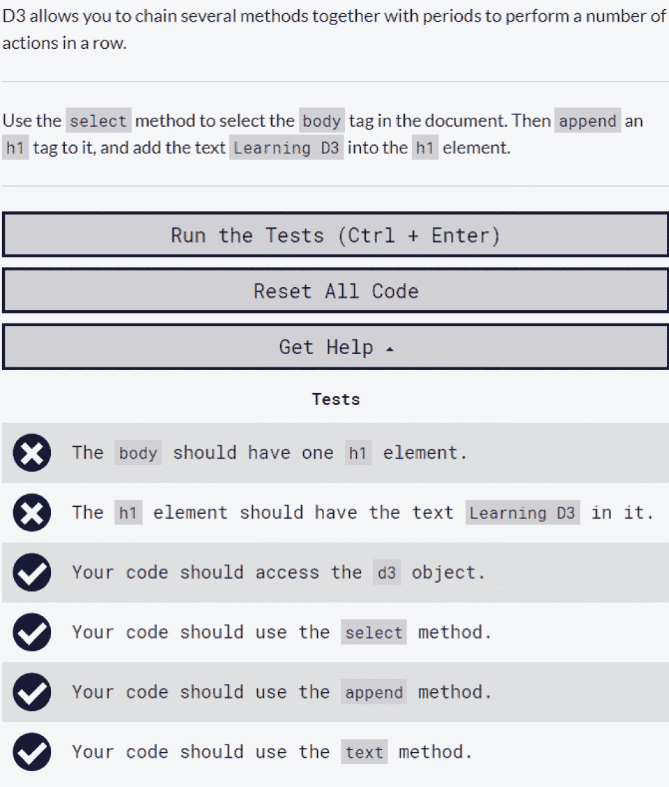
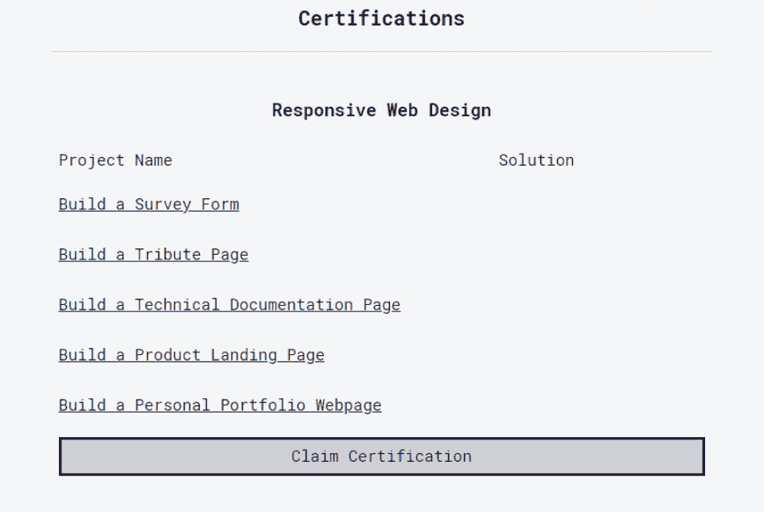
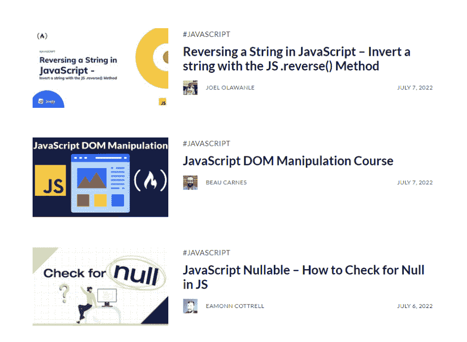
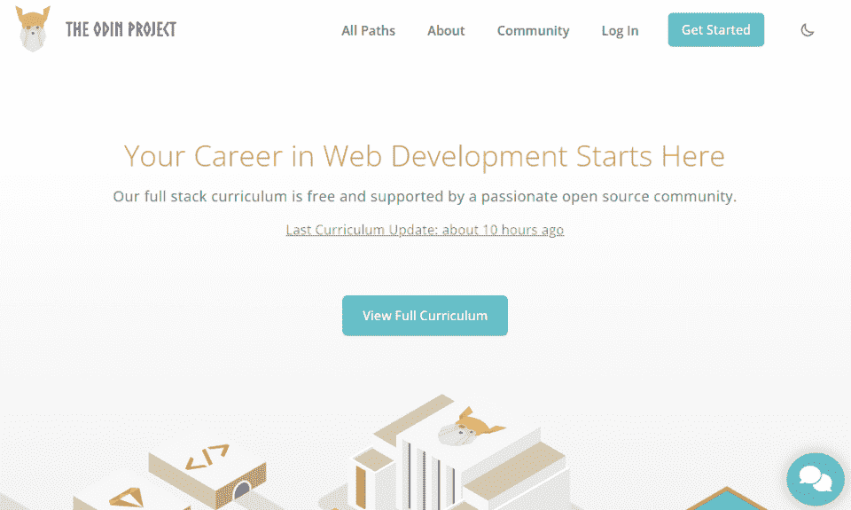
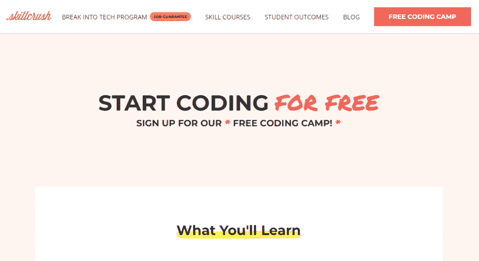

# freeCodeCamp 评论[2023]:优点、缺点和选择

> 原文：<https://hackr.io/blog/freecodecamp-review>

通过 freeCodeCamp 免费学习编码，构建组合项目，并获得认证。该网站为想要提高技能的程序员和开发人员提供了 8000 个免费的在线编程教程和课程。虽然一些 freeCodeCamp 评论提到了一个有点笨重的界面和沉或游平台，但它也是由一个只想教学的非营利组织运营的。

| 教练 | 3/5 |
| 课程 | 5/5 |
| 经验 | 3/5 |
| 总数 | 3.75/5 |

**一览:**

*   freeCodeCamp 是一个非营利组织，它首先倡导学习。
*   大多数 freeCodeCamp 教程都是简短的、具体的、非交互式的，引导你通过一个单一的原则或概念。
*   来自 freeCodeCamp 的认证是*交互式*练习集，带你通过[编程基础](https://hackr.io/blog/top-programming-courses)。
*   freeCodeCamp 中的课程对于初学者来说可能很难，但是对于有编程背景的顽固学习者来说却是极好的。
*   freeCodeCamp 是为数不多的支持非英语学习者的平台之一，为全球学习者提供直接支持。

我们的 freeCodeCamp 评论将讨论您需要了解的关于 freeCodeCamp 课程、认证以及是否值得的一切。

## **什么是 FreeCodeCamp？**

freeCodeCamp 是一个免费的在线交互式编程课程和教程库。然而，称它们为课程或*课程*可能有些言过其实。freeCodeCamp 的大部分“课程”都只是简短的教程。

同时，freeCodeCamp 的认证路径是一系列编号练习。虽然它们在技术上是学习计划——每一个后续的练习都建立在前一个练习的知识基础上——但它们不是你可能习惯于通过 Coursera 或 Udemy 学习的多媒体事务。

freeCodeCamp 与 [Codecademy](https://hackr.io/blog/codecademy-review) 相比最为准确。freeCodeCamp 通过给你一系列的练习并希望你能解决它们，让你尽快学会 T2 编程。正因为如此，有些练习可能会重复……但无论你选择什么学科，你最终都会建立一个强大的投资组合。

从很多方面来说，你可以把 freeCodeCamp 看作是一个代码学院，拥有更大的内容库存，但是可用性更低。虽然 freeCodeCamp 可以免费使用，但用户可能会发现由于平台笨重而难以理解。

## **最受欢迎的免费代码营课程**

那么，在 freeCodeCamp 上你能学到什么呢？该平台几乎拥有所有的编程语言和学科，但并不是所有的都提供认证。包括认证在内的最受欢迎的途径包括:

| [响应式网页设计](https://www.freecodecamp.org/learn/2022/responsive-web-design/) | 使用这个基于项目的教程，创建漂亮的、响应迅速的网页设计。最后，您将为前端 web 开发创建一个投资组合项目。 |
| [JavaScript 算法和数据结构](https://www.freecodecamp.org/learn/javascript-algorithms-and-data-structures/) | 深入挖掘 JavaScript 的算法和数据结构。面向那些已经掌握了一些 JavaScript 或编程知识的人。 |
| [前端开发库](https://www.freecodecamp.org/learn/front-end-development-libraries/) | 了解更多关于前端开发库的信息，让您的工作变得更加轻松。面向具有前端开发中级知识的人。 |
| [数据可视化](https://www.freecodecamp.org/learn/data-visualization/) | 深入挖掘数据可视化、挖掘和使用。了解如何以有意义的方式可视化数据。 |
| [后端开发 API](https://www.freecodecamp.org/learn/back-end-development-and-apis/) | 与 NPM 一起开发和维护包装。本课程依赖于 JSON、MongoDB 以及开发 API(应用层接口)的基本原则和基础。 |

这些课程既严谨又具体。初学者在 Codecademy 上的表现会更好，而 FreeCodeCamp 拥有比大多数其他编程库更高级、更具体和更适合的课程。

| freeCodeCamp 获得认证了吗？freeCodeCamp 确实提供了一些可共享的证书，但它不是一个认证程序。事实上，很难说这是一个教案、课程或计划。相反，把 freeCodeCamp 看做是一个教程库，用它来创建一个可靠的作品集。 |

## 谁应该使用 freeCodeCamp？免费代码营合法吗？

很难比完全免费的课程更“合法”。事实上，对于那些通过免费在线训练营或其他编程认证途径的人来说，freeCodeCamp 是一个优秀的辅助学习工具。

但是有两件事阻碍了 freeCodeCamp 的发展

*   **可用性**。即使对于程序员和工程师来说，freeCodeCamp 也很难使用和导航。大部分都是因为笨重的[用户界面](https://hackr.io/tutorials/learn-user-interface-design)。
*   **内容**。freeCodeCamp 不是一个连续的课程计划或学习路径；相反，这是一系列的练习。

但这并不是说即使是完全的初学者也不能通过 FreeCodeCamp 学习编程。这并不是要贬低 FreeCodeCamp 的档案的非凡效用。在 FreeCodeCamp，你可以学到非常小众的技能，你可以学的很透彻。

虽然这些练习可能看起来重复或多余，但这是必不可少的；对于那些寻求技术面试和编程问题的人来说，可能没有比这更好的地方了。同时，这仅适用于认证路径；大多数情况下，你只能获得认证路径之外的教程。

## 为了得到一份工作，freeCodeCamp 值得吗？

是也不是，freeCodeCamp 可以让你获得一个基于技能的职位。如果你需要[学习 Python](https://hackr.io/blog/best-way-to-learn-python) 来找工作，freeCodeCamp 可以帮忙。但是如果你需要工作证书，freeCodeCamp 不太可能提供。

### freeCodeCamp 证书有价值吗？

不会有伤害。虽然雇主可能不认可“免费代码营”，但一份证书仍然显示了你的奉献精神和学习的主动性。该平台的投资组合项目将比其证书更有价值，但你通常可以通过相同的课程和途径获得它们。

## **freeCodeCamp 对雇主有好处吗？**

对于员工来说，freeCodeCamp 可能效用有限。但雇主可能喜欢将 freeCodeCamp 作为继续学习的资源，因为该平台完全免费提供成千上万的学习练习。完成初级、中级和高级练习的员工将会提高他们的编程技能。

## **如何注册和使用免费代码营**

FreeCodeCamp 的练习以*套*练习的形式提供。因为平台完全免费，不需要注册。点击课程，然后点击标题，你会立即看到一个新的练习。

虽然 freeCodeCamp 与 Codecademy 的界面非常相似，但你可以立即看出这种体验有点幽闭恐惧症。左边是练习的说明。你的代码放在中间。底部是你的代码的结果。

当你编写和编译代码时，系统会检查你是否完成了给定的计划。

整个系统是自动化的。你不会直接与任何老师或其他学生接触。因此，如果你陷入困境，你可能需要在网上做一些研究。

### 免费代码营的折扣:免费代码营的费用是多少？

虽然一些网站谈论免费代码营的折扣，但没有任何折扣；一切都是免费的。一个非营利组织提供了课程、辅导和练习；您甚至不需要创建一个帐户来开始编程。

这是 freeCodeCamp 的主要优势。但是 Codecademy 同样拥有完全免费的课程，界面更加强大。

## **freeCodeCamp 回顾:freeCodeCamp 到底有多值得？**

我们已经多次指出 freeCodeCamp 不提供任何真实的凭证，但这可能没什么大不了的。核心问题是，虽然有通过 freeCodeCamp 的认证途径，而且你肯定可以学习一门编程语言，但真的没有办法证明你的专业知识。

为了最大限度地利用 freeCodeCamp，你应该根据练习创建一个文件夹，并真正吸收其中的内容。freeCodeCamp 可以很容易地帮助你通过技术面试，但是它不能帮助你*获得面试*，除非你花时间建立你的作品集或者你的 Github 库。

## **freeCodeCamp 认证途径**

正如我们之前提到的，有免费的 CodeCamp 认证途径。但是，获得这些认证只是清除给定的练习，然后要求认证的问题。

在这里，你可以看到为什么作品集项目实际上比认证重要得多。要获得认证，你只需要填写一份学术诚信政策，并报告你已经完成了该项目——这不是很有用。

但是通过上面的认证途径，你将已经创建了五个基本的投资组合项目。freeCodeCamp 提供了一种结构化的方法来完成练习和项目，以帮助您发展编程技能。

## **在 FreeCodeCamp 上寻找最佳课程的技巧**

有些课程很简单；它们只是一打练习的集合。其他课程可能有*上百*个练习。与 Udemy 或 Coursera 不同，freeCodeCamp 课程不是由学生来评分，也不能通过受欢迎程度来搜索。你需要知道你想在 freeCodeCamp 上找到最好的课程。

假设你想[学习 JavaScript](https://hackr.io/blog/how-to-learn-javascript) 。可以在 FreeCodeCamp 上搜索“JavaScript”。您首先会发现 JavaScript 教程非常具体:

freeCodeCamp 专注于具体的、可操作的技能集。在开始之前，您还可以查看课程发布的时间和内容。这些大多只是教程，不是互动课。它们甚至不是练习，尽管它们会教你基础知识。

如果你想要深入的、互动的课程，你必须去 freeCodeCamp 的首页，选择它的认证途径。这些将链接到各种互动练习和章节，为学习提供一个更强大的框架。

## 免费代码营:赞成、反对和用户评论

| **优点** | **缺点** |
| 针对特定编程任务的大量教程

*   相当健壮的练习集，用于学习更多关于前端和后端开发的知识
*   完全免费和非盈利的
*   有点吓人

 | 需要大量的主动性

*   对雇主来说不一定重要
*   PCMag 对 freeCodeCamp 的评分是 4 分(满分 5 分)，类似于 Codecademy。freeCodeCamp 在凭证和可用性方面损失了什么，它又赢回来了，因为它是完全免费的，并且有如此深度的内容。那些被驱动的人可以从一开始就开始编程，并在几个小时内开发他们自己的应用程序。那些需要指导的人可能会感到完全不知所措，几天内都难以做任何事情。
*   大多数用户对 freeCodeCamp 的评价都很高。那些陷入困境的人可以求助于 Reddit、Quora 或其他社区。在许多方面，编程社区奖励自学成才的个人，所以 freeCodeCamp 正好符合这种风气。

 |

**免费代码营的替代方案**

显然，免费代码营最直接的替代品是 Codecademy，它也提供免费课程。虽然 Coursera、Udemy 和 edX 也提供编程课程，但 freeCodeCamp 更类似于 Odin Project 和 SkillCrush 等平台。

## **FreeCodeCamp**

**代码学院**

| **奥丁项目** | **技能碾压** | **类** | 8,000 | 1,800+ |
| 3 条路径 | 5 道菜 | **学生** | 217,000 | 四千五百万 |
| 500,000 | **成本** | 自由的 | 39 美元/月 |
| 自由的 | 自由的 | Codecademy:一个更加用户友好的免费代码营 |  | 文件:Codecademy，Alt: Codecademy 截图。免费代码营的付费版本。 |

### Codecademy 提供了与 freeCodeCamp 类似的体验，作为一个练习集，可以帮助学生立即开始学习。Codecademy 拥有更大的用户群，通常也更为人所知，但它也是一项付费服务。需要注意的是，许多编程课程和教程都是完全免费的。

**Odin 项目:免费网络开发课程**

****

文件:奥丁 Project.png，Alt:奥丁项目截图。网络开发课程。

### Odin 项目是专门为 web 开发设计的免费开源课程。Odin 项目从头到尾覆盖了全栈 web 开发，对于那些想要使用一种巧妙的、易于使用的格式开发投资组合的人来说，它是一个很好的选择。该平台包括多种职业道路，从编程基础开始，后来涵盖更高级的主题，如找工作。

**技能碾压:免费开始编码**

文件:技能 Crush.png，Alt:有针对性的免费编码营。

### Skill Crush 提供了一个免费的编码营，带领学生学习 HTML、CSS、设计、UX、JavaScript，甚至在这个行业工作是什么感觉。技能粉碎的目标是那些需要一些更集中的东西，而不仅仅是消除歧义的教训和类。如果你觉得 Codecademy 和 freeCodeCamp 有点“没有方向”，Skill Crush 可以帮上忙。

**结论:freeCodeCamp 值得吗？**

freeCodeCamp 最好作为一个更严格的计划的补充，比如一个[免费编码 bootcamp](https://hackr.io/blog/free-coding-bootcamps) 。freeCodeCamp 的核心是一个训练练习库，可以教你如何更好地编程。

我们 freeCodeCamp 评论的底线？

## 如果你有动力，可以轻松地自学，freeCodeCamp 是一个很好的选择。但是如果你需要更多的指导，freeCodeCamp 不是你的解决方案。

好奇程序员的其他学习平台？

**[查看我们的 Udemy 点评](https://hackr.io/blog/udemy-review/amp)**

**常见问题解答**

**1。freeCodeCamp 有多靠谱？**

freeCodeCamp 有各种各样的课程和教程，非常及时和准确。作为一个由志愿者运营的非营利组织，任何与认证途径或课程有关的问题或错误都会得到快速纠正。

## **2。freeCodeCamp 够找工作吗？**

#### freeCodeCamp 会给你完成工作所需的工具，但不一定能让你找到工作。本质上，你需要首先开发一个投资组合和你的技能——说你是 freeCodeCamp 的校友不会给你的简历加分。

**3。freeCodeCamp 课程好吗？**

#### 称之为课程有点牵强。freeCodeCamp 主要由利基和具体的教程组成，具有更广泛和更严格的认证途径。然而，即使是认证路径也主要由您必须自己完成的练习组成。

**4。一个 freeCodeCamp 证书值得吗？**

#### 获得 freeCodeCamp 认证并利用它建立投资组合的经历是值得的。不过，这份证书不太可能帮你找到工作或给雇主留下深刻印象。

**5。freeCodeCamp 证书是免费的吗？**

#### freeCodeCamp 最显著的优势就是平台免费，随时可以上手。它是自我驱动和自学的，所以你可以一天做几次练习，甚至一周只做一次活动。

**6。一个 freeCodeCamp 2023 值得吗？**

#### 值得花时间参加 freeCodeCamp 来提高你的技能，提高技能，学习一门新的语言，甚至只是检查你不知道如何做的事情。但是如果没有重要的工作，它不会给你一份工作。

The most significant advantage of freeCodeCamp is that the platform is free, and you can get started anytime. It’s self-driven and self-taught, so you can do a few exercises a day or even just one activity a week.

#### **6\. Is a freeCodeCamp 2023 Worth It?**

It’s worth the time to go through freeCodeCamp to improve your skills, upskill, learn a new language, or even just check in on something you don’t know how to do. But it will not get you a job without significant work.