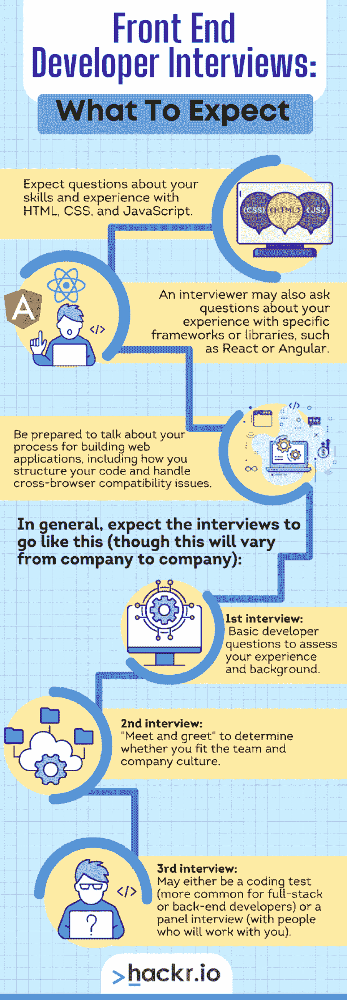
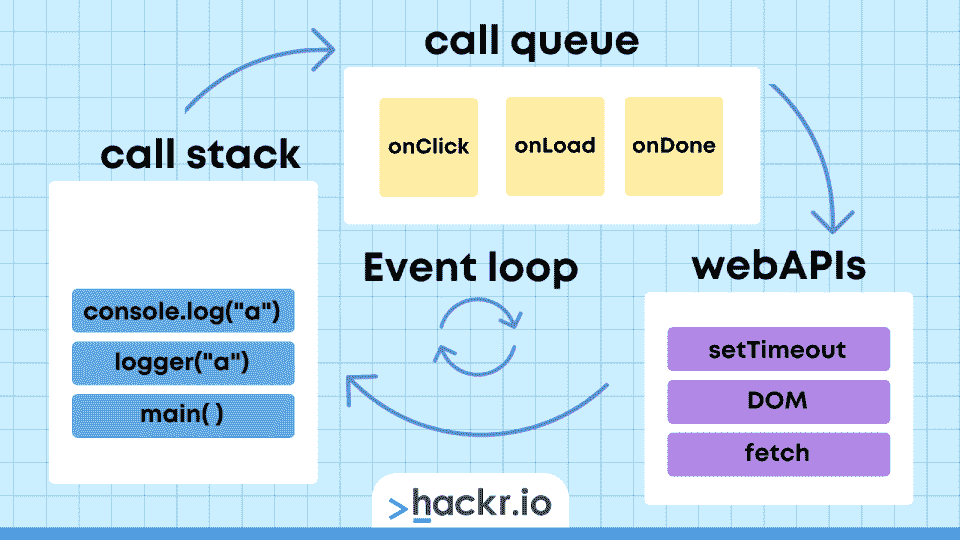

# 前 40 名前端开发人员面试问题和答案[2023]

> 原文：<https://hackr.io/blog/front-end-developer-interview-questions>

你即将开始职业生涯的下一步，成为一名前端开发人员。但是如何开始呢？

首先，请注意，前端开发人员可能意味着许多事情。当我们通常说“前端”时，我们指的是 web 应用程序。但也可以指 iOS、Android、微软、osX，甚至 Linux 应用。前端开发人员主要关注设计，有时也关注设计。在你开始学习之前，要知道你要去做什么样的前端工作——因为会涉及到一些技术问题。

但是在我们深入讨论前端开发人员面试问题之前，让我们先了解一下作为一名前端开发人员意味着什么，以及人们可能会问些什么。

## 前端开发人员访谈:你能期待什么？

当面试一个前端开发人员的角色时，期待着关于你的技能和经验的问题，比如关于 HTML T1、T2 CSS T3 和 T4 JavaScript T5 的问题。面试官可能还会问一些关于你使用特定框架或库的经验的问题，比如 [React](https://hackr.io/blog/react-interview-questions) 或 [Angular](https://hackr.io/blog/angular-interview-questions) 。

谈谈您构建 web 应用程序的过程，包括如何构建代码和处理跨浏览器兼容性问题。

一般来说，第一次面试会用一些基本问题来证明你的资格。复试更多的是“见面打招呼”，以确定你是否适合团队和公司文化。

第三次(希望是最后一次)面试可能是编码测试(对全栈或后端开发人员来说更常见)或小组面试(与将与你一起工作的人)。



现在，我们从那些前端面试问题开始。

## **基本前端面试问题**

你刚刚开始你的职业生涯。我们将从针对初学者角色的入门级前端开发人员面试问题开始。

这些前端工程面试问题旨在确认您了解开发和设计的基础知识。

### **1。什么是 CDN？**

内容交付网络(CDN)是基于地理位置向用户交付内容的系统。cdn 可以提供网站、软件应用和其他类型的数字内容。

### **2。什么是 AJAX？**

AJAX 是一种用于创建异步 web 应用程序的 web 开发技术。AJAX 允许您创建动态的、响应迅速的 web 应用程序，无需重新加载页面即可更新。

### **3。HTML 和 XHTML 有什么区别？**

HTML 是创建网页的标准标记语言。XHTML 是一个更严格、定义更好的 HTML 版本。它经常用于格式化指定分类中更复杂的文档。

HTML 代码:

```
<!DOCTYPE html>
<html>
<body>

<h1 style="background-color: red;">Hello World!</h1>
<p>This is a paragraph.</p>

</body>
</html> 
```

XHTML 代码:

```
<?xml version="1.0" encoding="UTF-8"?>
<?xml-stylesheet type="text/css" 
    href="http://www.w3.org/MarkUp/style/xhtml2.css"?>
<!DOCTYPE html PUBLIC "-//W3C//DTD XHTML 2.0//EN"
    "http://www.w3.org/MarkUp/DTD/xhtml2.dtd">
<html  xml:lang="en"
    xmlns:xsi="http://www.w3.org/2001/XMLSchema-instance"
    xsi:schemaLocation="http://www.w3.org/2002/06/xhtml2/
        http://www.w3.org/MarkUp/SCHEMA/xhtml2.xsd"
>
<head><title>Hello World!</title></head>
<body><p>This is a paragraph.</p></body>
</html>
```

### **4。什么是响应式设计？**

响应式设计是一种 web 开发技术，可以创建与不同屏幕尺寸的多种设备兼容的网站。响应式网站的设计在桌面和移动设备上都很好看。

### **5。CSS 选择器有哪些不同的类型？**

CSS 选择器用于选择 HTML 文档中的元素。CSS 选择器有几种类型，包括类选择器、ID 选择器和属性选择器。

### **6。什么是伪类？**

伪类是一个选择器，它根据元素的状态来设计元素的样式。例如:hover 伪类在用户将鼠标悬停在某个元素上时设置该元素的样式，但在用户不悬停时不做任何事情。

### **7。什么是 CSS 重置？**

CSS 重置是一组应用于所有浏览器的规则，用于规范化 HTML 元素的默认样式。这在去除 HTML 元素的格式时特别有用。

### **8。什么是 CSS 网格系统？**

CSS 网格系统是一组可用于创建响应性布局的规则。有许多不同的网格系统，但是最流行的是 Bootstrap。Bootstrap 使创建可预测反应的布局变得更加容易，而不必重新发明轮子。

### **9。什么是 CSS 预处理器？**

CSS 预处理器是一种工具，它允许你以一种更加简洁和结构化的方式编写 CSS。最流行的 CSS 预处理器是 Less 和 Sass。它们对于小项目不是很有用，但是随着项目的增长，它们会变得非常强大。

### 10。使用 CSS 预处理器有什么好处？

使用 CSS 预处理器有几个好处，比如以一种更加结构化和简洁的方式编写代码，减少需要编写的代码量，使维护和更新代码变得更加容易。更重要的是，它使得在大量的开发人员中管理一个项目变得更加容易。

### **11。什么是自举？**

Bootstrap 是一个流行的 CSS 框架,它提供了一套创建响应性布局的规则。

### **12。使用 bootstrap 有什么好处？**

使用 bootstrap 的一些好处包括减少所需的编写代码，在多个项目中拥有一致的框架，以及更容易创建响应性布局。

### 13。什么是任务跑者？

任务运行器是帮助自动化开发过程中常见任务的工具，如缩小、编译、林挺等。一些最受欢迎的任务跑步者是 Gulp 和 Grunt。

### **14。使用任务运行器有什么好处？**

使用任务运行器的好处包括减少在重复任务上花费的时间，自动化繁琐且容易出错的任务，并使管理开发过程变得更容易。

*也期待这些前端开发人员面试问题，这些问题将根据您自己的个人经历有独特的答案...*

### 15。是什么让你成为前端开发者的？

### 16。作为一名前端开发者，你最喜欢的是什么？

您可能已经做了至少几年的前端开发人员，这是永远的开发时间。是时候证明你的知识了。

有趣的是，这些问题通常不太专业。相反，面试官想知道更多关于你如何解决问题的信息。这些前端开发人员面试问题反映了不同类型的前端开发人员面试，更侧重于经验而不是技能。

### **17。你擅长什么类型的前端开发？**

很多前端开发人员都是多面手。但是你的面试官想知道你的大部分经历在哪里。你对 Angular 的经验比 React 多吗？比起使用框架，你更喜欢普通的 JavaScript 吗？

### 18。你最喜欢的 CSS 框架是什么？

你喜欢 Bootstrap 的网格系统吗？基础的简单？大多数面试官对最流行的系统都有些熟悉，但如果你能让他们感到惊讶(并证明你的答案)，你可能会加分。


### **19。你会如何优化网站的性能？**

这是一个广泛的问题，有许多潜在的答案。

首先，你应该确保你的代码被精简和压缩。这会减小文件的大小，从而加快下载速度。

其次，应该尽可能使用缓存。这将常用文件存储在本地，因此用户不需要每次访问您的站点时都下载这些文件。但是不要过度，否则你的网站不会像你想要的那样动态——它不会可靠地更新。

最后，您应该使用内容交付网络(CDN)。这将您的文件分布在多个服务器上，因此用户可以从各自的位置下载它们。

前端开发工具是帮助开发网站或 web 应用程序的任何软件。一些最流行的前端开发工具是[代码编辑器和 ide](https://hackr.io/blog/web-development-ide)、任务运行器和 CSS 预处理器。为了安全起见，可以提及诸如 Sass 或 Git 之类的东西，或者使用一个专门的工具来获取更多信息。你甚至可以建议你最喜欢的工具是颜色选择器或者 UI 测试器。

### **21。你会如何调试一个网站？**

和加速一个网站一样，调试一个网站也是广泛的。但他们真正问的是你可能采取的一般步骤。一些最常见的方法包括使用浏览器的开发工具，使用自动化质量保证套件，逐行调试代码，或者使用“[橡皮鸭](https://www.techopedia.com/definition/31880/rubber-duck-debugging)方法进行调试。

### **22。您在跨浏览器兼容性方面遇到过哪些常见问题？**

跨浏览器兼容性的一些最常见的问题是不同的浏览器以不同的方式呈现 CSS，不同的浏览器支持不同的 HTML 和 CSS 功能，以及不同的浏览器对标准的支持程度不同。这尤其困难，因为许多浏览器因平台而异，而平台差异又如此之大；今天有人可以在智能冰箱上打开 Chrome OS。

### **23。您面临过哪些常见的前端开发挑战？**

一些最常见的前端开发挑战包括跨浏览器兼容性问题、处理遗留代码和优化网站性能。开发人员经常遇到的另一个问题(但不幸的是很少解决)是使他们的代码符合 ADA 的能力。

*还要为这些个人前端开发人员面试问题做好准备...*

### **24。做前端开发，你都关注哪些博客？**

### **25。就设计和开发而言，你最喜欢哪些网站？**

## **高级前端开发人员问题**

一旦你有了五六年的经验，面试官很少会问你关于技术、设计、开发甚至用户体验的复杂问题。相反，面向有经验申请人的前端开发人员面试问题和答案往往更关注你的职业生涯和你的成功。为这些具有挑战性的前端 web 开发人员面试问题做准备。

### **26。讨论你职业生涯中最大的成就。**

准备好讨论你对一个项目产生重大影响的时候。这是你真正推销自己的机会，所以确保你有一个好故事要讲。如果可以的话，试着将你的成就与公司的价值观或使命宣言联系起来。不要害怕强调团队成员或经理是如何帮助你的。这表明你是一个团队成员。

### **27。讨论你职业生涯中最大的挑战。**

现在不是讨论个人挑战的时候，比如克服你对公开演讲的恐惧。相反，专注于你所面临并克服的专业挑战，比如为一个废弃的系统开发，或者遇到一个特殊的 UI/UX 挑战。谈论问题是什么，你是如何解决的，结果是什么。和前一个问题一样，试着把你的故事和公司的价值观或使命联系起来

### **28。你上一个项目是什么？怎么样了？**

这是一个谈论你感兴趣的事情的好机会。如果你的上一个项目特别有挑战性或非常成功，那就提及它。具体说明你使用的技术和你使用它们的独特方式。

### **29。你如何有效地管理你的时间？**

这对于任何开发人员来说都是一个重要的问题，因为工作可能是多种多样且不可预测的。谈谈你用来管理时间的工具(例如[番茄钟](https://todoist.com/productivity-methods/pomodoro-technique)计时器)以及你如何使用它们。你也可以讨论你如何优先处理你的任务和处理意外的干扰。

### 三十岁。当你遇到困难时你会怎么做？

没有人喜欢被卡住，但对于任何程序员来说，这是生活的现实。谈谈你用来摆脱困境的方法，比如寻求帮助、做研究或者休息一下。此外，提到你是如何防止自己陷入困境的，比如提前做研究，确保你没有扩大项目的范围。

### 31。当你做错事的时候你会怎么做？

每个人都会犯错。重要的是当你犯错时你如何反应。谈谈你修复错误的步骤，比如撤销你的修改或者写测试。此外，提及你如何防止自己犯两次同样的错误，比如保存更好的文档。

## **技术前端开发人员提问**

除了常见的入门级前端开发人员问题，您可能会遇到一些关于 HTML、CSS 和 JavaScript 的技术问题。

### **HTML 前端开发者提问**

实际上，每个前端开发人员都应该知道 HTML，即使你正在为 iOS 或 Android 开发。

#### 32。HTML5 和 HTML4 有什么区别？

HTML5 ，HTML 的最新版本，包括了几个新的元素和属性。它还支持音频和视频播放，并引入了对本地存储的支持。

#### 33。如何创建自定义错误页面？

自定义错误页面是发生错误时显示的页面。要创建自定义错误页面，首先需要创建一个名为“error.php”或“error.html”的文件。指向自定义错误页的 htaccess 文件。

媒体查询是 CSS3 的一项功能，允许您根据屏幕宽度应用不同的样式。要使用媒体查询，首先需要在 HTML 中包含一个 viewport meta 标记。然后，您需要使用媒体查询编写 CSS 但是将它集成到 HTML 中也很重要。

### **JavaScript 前端开发者提问**

如果你需要掌握任何编程语言来进行完美的网络或移动开发:那就是 [JavaScript](https://hackr.io/tutorials/learn-javascript) 。

#### 35。==和===有什么区别？

==检查值是否相等，而===检查值和类型是否相等。

#### 36。匿名函数和命名函数有什么区别？

命名函数将来可以在代码中的任何地方被引用，而匿名函数则不能——尽管当它以内联方式出现时会运行。

#### 37。什么是事件循环？

****

事件循环是实时 JavaScript 响应的基础。它每隔一段时间运行一次，以测试某个事件。您需要启动事件循环来扫描用户行为，如点击。

### **CSS 前端开发者提问**

CSS 和 HTML 是如此频繁地一起使用，以至于它们通常一起学习并且很好地集成。但是你仍然应该知道 CSS 在哪里结束，HTML 在哪里开始。了解更多关于 [CSS](https://hackr.io/tutorials/learn-css) 的信息，开始你的发展生涯。

#### 38。内嵌、嵌入和外部样式表之间有什么区别？

内联样式是作为代码的一部分编写的(

)，嵌入样式是嵌入在页面页眉中的样式表，外部样式表链接在页面页眉内。

#### 39。你如何创建一个响应式布局？

您可以使用 Bootstrap 之类的框架创建一个响应式布局。或者，您需要手动检测屏幕大小并进行更改。响应式布局的最佳实践包括创建一个“防失败”系统，如果元素太小而无法查看，该系统会将其折叠。

#### 40。你如何使用动画和过渡？

大部分动画和转场都是通过 JavaScript 带入 CSS 的；CSS、JavaScript 和 HTML 如此交织的另一种方式。你可以用 CSS 命名一个元素，并用 CSS 设置它的参数，只是为了用 JavaScript 处理一个动画。CSS 中有一些内置的动画和过渡，但它们往往相当初级。

## **前端开发人员面试问题的技巧和诀窍**

在某种程度上，前端开发人员面试可以没有压力。事业突飞猛进；不要太想证明自己。带着干净的文件夹走进去，准备好试题和答案。

1.  做你的研究。在面试之前，一定要对你申请的公司和职位做好调查。这将有助于你为提问做好准备，并向面试官展示你的积极性和对这个职位的真正兴趣。
2.  **练习，练习，练习。无论是与朋友或家人进行模拟面试，还是在脑海中过一遍常见的问题，事先练习将有助于你在实际面试中更自信、更少紧张。**
3.  建立你的投资组合。如果你对这个行业还是个新手，或者想换一个行业，那就建立一个你曾经工作过的顶级网站的投资组合。
4.  了解你在管道中的位置。初次面试只是“摸底”面试。你要慢慢了解你的面试团队和岗位，然后多挖掘你的技术技能。
5.  **风度翩翩。**在一天结束的时候，面试官希望了解你这个人。真诚的最好方法是简单地谈谈你工作之外的兴趣和爱好，以及你可能正在做的任何个人项目。
6.  **提问。**提问表明你参与了对话，并给你一个机会来更多地了解公司和这个职位。
7.  不要害怕说你不知道。如果你不知道某件事，说明你会如何发现。

面试结束后，给面试官发一封感谢信。今天，它可以像在 Slack 上拍摄一条消息一样简单。

## **如何练习代码面试**

编码面试一般有三类问题:算法、数据结构、系统设计。熟悉每种类型，并练习解决它们。

即使是经验丰富的工程师也在编码面试中苦苦挣扎。你可以练习循环和排序，但是当它来临时，你被要求根据命令解决一个难题。你能做的就是练好基本功。

[100 个前端面试问题挑战](https://click.linksynergy.com/link?id=jU79Zysihs4&offerid=1045023.2400010&type=2&murl=https%3A%2F%2Fwww.udemy.com%2Fcourse%2F100-front-end-interview-questions-challenge%2F)

## **结论:想成为前端开发者？**

恭喜你。在我们庞大的前端开发人员面试问题列表中，您排在了最后。

如果您有兴趣成为一名前端开发人员，有几件事您应该记住。首先，对 HTML、CSS 和 JavaScript 有很强的理解是很重要的。你还应该熟悉各种前端框架和库，以及 Gulp 和 Grunt 之类的工具。最后，不要忘记沟通和解决问题等软技能对成功胜任这一职位的重要性。

这些是我们所有的前端开发人员的问题。你的下一步是什么？考虑用一门课程来扩展你的知识面！

**[参加最好的 Web 开发者课程之一！](https://hackr.io/blog/best-web-development-courses)**

## **常见问题解答**

#### **1。前端面试是什么样的？**

前端面试往往侧重于技术技能，比如你的 HTML、CSS 和 JavaScript 知识。你可能还会被问到关于各种前端框架和库的问题，这取决于你面试的系统。iOS 的前端开发者和 web 应用的前端开发者之间可能会有很大的鸿沟。

#### **2。前端面试难吗？**

如果你知道你的东西，它不应该是。虽然一般的前端开发面试问题会很简单，但是代码问题会让人紧张。您将经常经历 JavaScript 编码面试，这可能涉及循环迭代或其他基本任务，否则前端开发人员可能不会经常这样做。

#### **3。前端开发人员需要什么技能？**

你需要对 HTML、JavaScript 和 CSS 有扎实的理解。此外，用户界面设计的基础知识和用户体验设计知识也很有帮助。前端开发人员经常需要设计机制和技术组件。