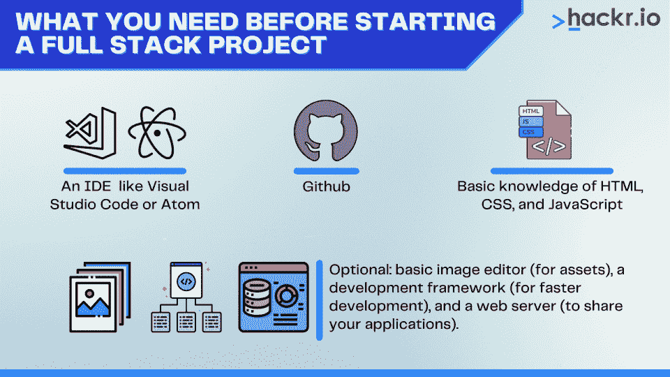

# 15 个有趣的全栈项目创意，打造您 2023 年的投资组合

> 原文：<https://hackr.io/blog/full-stack-project-ideas>

你从头到尾都知道如何用框架构建应用程序。但你没有的是投资组合。您可以处理哪些项目来展示您的全套开发技能？

谢天谢地，有许多全栈项目的想法。我们将讨论 15 个基础、中级和高级项目，你可以用它们来建立和提高你的技能。

## **在开始全栈项目之前，您需要什么？**

****

在你开始你的项目之前，你需要一些东西:

*   一个 IDE。 Visual Studio 代码和 Atom 都是常见的选择。找到一个更容易使用和编译代码的开发环境。
*   **HTML、CSS、JavaScript 的基础知识。**这是构建网络应用的三种基本的[编程语言](https://hackr.io/blog/best-programming-languages-to-learn)。如果你不熟悉他们，可以考虑[参加训练营](https://hackr.io/blog/free-coding-bootcamps)。
*   **Github。**如果没有 Git 提交，你将无法构建一个投资组合，所以是时候放松一下了。

其他可选工具包括基本的图像编辑器(用于资源)、开发框架(用于更快的开发)和 web 服务器(用于共享您的应用程序)。

## **如何使用这些全栈项目创意**

全栈开发人员来自各种背景和经验水平。你可能有很多关于前端设计的知识，但是你现在才搞清楚后端开发。

从许多方面来说，成为一名全栈开发人员是为了解决问题。一个[全栈开发者](https://hackr.io/roadmaps/full-stack-developer-roadmap)可以使用几十种语言和技术中的任何一种。因此，一个完整的项目想法将概述一般的项目需求——但如何实现它们取决于您。

## **基本全栈项目**

这些项目非常适合想要在 web 开发中打下坚实基础的初学者。任何具有基本前端和后端知识的人都应该能够完成这些项目，但是完成它们*以及*是一个技巧和经验的问题。

### **1。待办事项 App**

每个人都想把事情做得“更好”。待办事项应用让用户存储信息以备日后调用。这个全栈项目应该让用户:

*   在数据库中存储、检索和修改“待办事项”信息
*   以简洁、吸引人的格式查看“待办事项”信息
*   在移动计算机或台式计算机上查看应用程序

### **2。计算器**

计算器是发展你布局技巧的好机会。计算器也需要一些输入/输出知识，因为你需要从用户的外围设备捕捉数据。您的计算器应用程序应该:

*   在任何平台上清晰地描绘计算器的视觉元素
*   通过鼠标和键盘对用户的输入做出反应
*   保存用户的历史记录，即使它只是在文本文件中这样做

外面天气怎么样？不要向窗外看。改为编写应用程序。您的天气应用程序应该:

*   从数据库中提取天气信息
*   根据天气改变它的外观
*   使用有吸引力的样式表来发布每小时和每周的预测

另一个挑战是，将你的应用程序连接到天气 API，根据用户的位置获取实时天气信息。有一些免费的天气 API，您可以通过 JavaScript 轻松连接到这些 API。

### **4。测验应用**

这可能是对投资组合最有用的全栈编码项目思想之一；您甚至可以用它来测试自己的全栈开发。您的测验应用程序应该:

*   从数据库中提取测验问题和答案
*   向用户显示问题并提示他们回答
*   跟踪并保留用户的分数，最终让他们“赢”或“输”

### **5。互动简历**

为什么不给潜在雇主一点甜头呢？制作一份互动简历，不仅展示你的技能，还能提示用户询问更多信息。你的交互式简历应该:

*   以一种吸引人的、移动友好的格式展示你的简历。
*   提示用户向您发送他们的信息(如果他们想了解更多)。
*   展示动态的，交互式的 CSS 资产，如视差。

当你只是在建立自己的技能时，你不需要开发“杀手级”和独特的全栈 app 创意。以上项目都不应该太难——专注于让它们尽可能完美。

这些项目非常适合那些在 web 开发方面有很强基础并希望增加更多技能的人。这些项目将提供一个合法的“组合”作品。

### **6。带认证的待办事项应用**

安全性对现代工程至关重要。回到你之前的待办事项应用，加入认证。你的应用应该:

*   让用户设置和更改他们的密码
*   实施严格的密码要求
*   基于用户定制自己(如果只是通过提及他们的登录名)

对于挑战，问问自己需要做些什么来将多因素身份验证添加到您的应用中。

### **7。音乐流媒体应用**

音乐应用是最常见的全栈应用理念之一。每个人都喜欢音乐。但你能做些什么来让你的音乐流媒体应用程序变得更好呢？最基本的，你的应用应该:

*   从歌曲数据库中提取音乐
*   提供音乐流接口
*   允许用户选择播放列表中的歌曲或搜索歌曲

为了挑战自己，建立一个建议引擎。跟踪用户播放的内容，并根据他们的喜好推荐相似的歌曲。

每个人都想成为下一个 Twitter。给这个项目带来一些创意。如果你可以建立一个社交媒体平台，你会改变什么？你的社交媒体应用应该:

*   允许用户创建并登录帐户
*   提供用户之间的交互性
*   将信息存储在数据库中

### **9。电子商务 App**

你梦想着最终通过你的全栈应用创意卖出东西吗？考虑建立一个电子商务应用程序来做到这一点。一个电商 app 只是一个数字化的店面。你的电子商务应用应该:

*   从数据库中提取产品
*   让用户创建帐户和购买产品
*   购买产品时，更改产品信息，如数量

坚持开发支付处理器？Paypal 和 Stripe 有易于使用的处理 API，您可以集成这些 API。

### 10。工作板

也许你不想构建全栈的投资组合项目。也许你想帮助其他人找到工作。求职公告板可以是一个有趣的项目，尽管你需要保持更新。它应该:

*   从数据库中提取作业信息
*   基于搜索标准和过滤器显示职务信息
*   让用户保存某些作业，甚至对它们做出响应

如果你想让这个工作板自治，考虑让它从其他网站抓取信息。

这些项目不太可能成为你赚钱的“完整项目”——但它们是展示你技能的好方法。在现实中，你可以采用任何 MERN 堆栈项目的想法，并给他们一个聪明的转折。

## **高级全栈投资组合项目**

如果你想建立一个有潜力成为一个可用的应用程序或业务的东西呢？让我们来看看一些高级的全栈项目，它们将扩展您的编程肌肉。

### **11。一款实时游戏 App**

你对一款游戏有什么迫切的想法吗？你曾热情地追求全栈开发来实现它？现在是时候了。要成为游戏，您的项目应该:

*   通过数据库支持用户帐户和用户数据
*   提供一些互动或游戏元素
*   有明确的目标或提供一些“赢”或“输”的状态
*   通过订阅或应用内购买提供盈利模式
*   既作为桌面应用又作为移动应用运行

### **12。锻炼追踪应用程序**

跟踪训练或锻炼给常规日程安排应用程序带来了有趣的变化。你可以用任何类型的重复爱好来做这件事。开发一款能够:

*   通过身份验证支持用户帐户和定制
*   安排锻炼/爱好，重新安排错过的课程
*   让用户决定锻炼的频率和首选计划
*   通过支持小组和竞争团队联系用户
*   智能地向用户发送提醒和警报

### 13。视频通话 App

视频现在无处不在。但就在 10 年前，视频通话让人疲惫不堪。思考如何让视频通话过程变得更简单。创建一个视频通话应用程序，它可以:

*   让用户登录到他们的帐户，并与其联系人列表中的人联系。
*   支持同一视频会议室中的多个用户。
*   根据要求存储视频通话，供以后参考。
*   支持用户之间一对一的电话预约。
*   提供文本聊天等附加功能。

### **14。图片分享应用**

你看过 Instagram 和 Imgur。是时候制作自己的图片分享应用程序了。图片分享不仅仅是流行；有很多潜在的利基需要填补。

一款图片分享应用:

*   允许用户上传、存储和管理图像
*   提供过滤器，以便用户可以更新和编辑他们的图像
*   智能压缩图像以获得更好的性能
*   自动删除废弃图像中未使用的图像
*   让用户为或其他高级功能的更多空间付费

### 15。协同编辑 App

这个全栈项目测试你是否准备好创建一个实时应用。协作编辑应用程序需要:

*   支持多个用户在一个房间编辑一个文件
*   如果用户试图编辑其他人已经编辑过的内容，提醒用户
*   智能地合并编辑内容或在编辑文件时锁定文件
*   提供轻松回滚到文件先前版本的功能
*   认证用户并支持多种权限类型(如查看者和编辑者)

即使是高级项目，你仍然需要一点创造力来给每个项目一些价值。但是如果你能想出一些独特的东西，你就能造出一些适销对路的东西。

## **创建自己的全栈项目**

只要有足够的时间和决心，你可以构建你在网上看到的任何东西。找一个你认为可以改进的网站。你认为你能开发一个更好的调度系统吗？更好的点击器游戏？任何数量的练习都会让你成为一个更好的——更好雇佣的——开发人员。

当你开发一个作品集的时候，你最理想的是展示你的技能。不要过分纠结于确保你的项目是独一无二的。相反，专注于让每个元素都正确。选择设计简洁的组合产品，与数据库(或其他数据源)交互，并提供认证。

完美地构建一个简单的项目，胜过拙劣地构建一个高级的项目。

[完整的 2023 年网络开发训练营](https://click.linksynergy.com/link?id=jU79Zysihs4&offerid=1045023.1565838&type=2&murl=https%3A%2F%2Fwww.udemy.com%2Fcourse%2Fthe-complete-web-development-bootcamp%2F)

## **立即开始学习全栈开发**

对自己的全栈技能不自信？也许是时候学习更多了。在深入了解全栈项目理念之前，请考虑参加全栈训练营、全栈进修课程或全栈认证课程。

许多在线全栈训练营和课程还将包括一些项目，您可以利用这些项目来进一步发展您的投资组合。

## **常见问题解答**

#### **1。什么是全栈项目？**

全栈项目是使用从前端到后端的全套 web 开发技术的 web 应用程序。他们经常使用 HTML、CSS 和 JavaScript。

#### **2。如何开始一个全栈项目？**

在开始项目之前，您需要了解前端和后端技术的基本知识。你还应该有一个开发环境，比如 Visual Studio 代码。

**人也在读:**