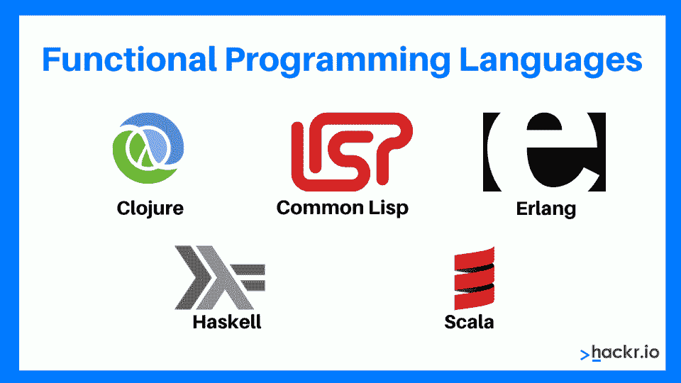
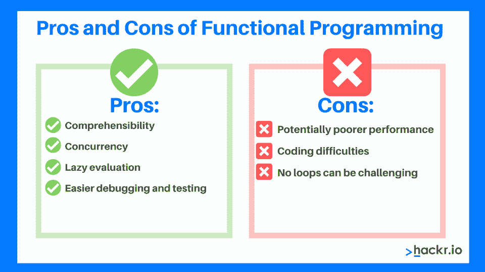

# 函数式编程:概念和优势

> 原文：<https://hackr.io/blog/functional-programming>

有几种编程范例，每种都有自己的目的和优点。其中之一是函数式编程，它有很强的数学基础。

在这里，我们涵盖了函数式编程语言和示例语言。从函数式编程概念到这种范式的应用，您将学到一切。

## 什么是函数式编程？

函数式编程是一种[编程范式](https://hackr.io/blog/programming-paradigms)，其中组合函数成为开发背后的主要驱动力。它是一种声明式的编程风格，专注于解决什么而不是如何解决。

20 世纪 50 年代开发的第一种高级函数式编程语言是 LISP。这种语言为现代函数式编程语言的许多特征奠定了基础。几十年来，新的语言和概念开始被引入，导致了我们今天拥有的函数式编程的许多好处。

同样值得注意的是，这里有“纯函数式编程与不纯函数式编程”的概念确切的区别很难定义，但是一个不纯的功能范式是当来自其他范式的技术被使用时。在这个问题上没有明确的共识。

λ演算在函数范式中起着重要的作用。

**函数式编程与面向对象编程**

但是在我们深入讨论之前，这里有一个表格总结了函数式编程和面向对象编程之间的区别。

| **功能编程** | **OOP** |
| 不可变数据 | 可变数据 |
| 声明式编程 | 命令式编程 |
| 关注问题的“是什么” | 关注“如何”解决问题 |
| 使用递归，避免循环 | 使用循环 |
| 支持并行编程 | 不适合并行编程 |
| 语句的执行顺序并不重要 | 语句的执行顺序很重要 |

## λ演算

由阿隆佐·邱奇开发的 lambda calculus 是一个研究函数计算的正式系统，它构成了几乎所有正在使用的函数式编程语言的基础。它被用来标记函数等等。

就其计算能力而言，lambda 演算类似于为命令式编程奠定基础的图灵机。

简而言之，它是一个描述函数及其评估的理论框架。

## 函数式编程语言



Clojure、Common Lisp、Erlang、Haskell 和 Scala 是遵循函数式编程方法的一些著名的编程语言。

## Python 是函数式编程语言吗？

不，Python 不是一种纯粹的函数式编程语言，尽管它有一些典型的概念。它更像是一种非官方的多范例语言，可以以一种典型的功能性方式使用。

## C++是函数式编程语言吗？

和 Python 一样，C++也是一种多范式语言。C++ 11 支持 lambdas，并且有很多相关的工具。C++支持过程化、面向对象和泛型编程，最近还支持函数式编程。C++中的函数式编程示例如下:

```
void Foo()

{

  vector<int> v;

  v.push_back(1);

  v.push_back(2);

  v.push_back(3);

  for_each(begin(v), end(v), [](int i) {

    cout << i << " ";

  });

}

// Outputs:

// 1 2 3
```

## Haskell 是用来做什么的？

Haskell 是一种纯粹的函数式编程语言，常用于研究和学术领域。Haskell 的一些应用是卡尔达诺区块链和 Meta 的反垃圾邮件程序。

下面是 Haskell 中的一个函数式编程示例:

```
-- [[Type signature|Type annotation]] (optional, same for each implementation)

factorial :: (Integral a) => a -> a

-- Using recursion (with the "ifthenelse" expression)

factorial n = if n < 2

              then 1

              else n * factorial (n - 1)

-- Using recursion (with pattern matching)

factorial 0 = 1

factorial n = n * factorial (n - 1)

-- Using recursion (with guards)

factorial n

   | n < 2     = 1

   | otherwise = n * factorial (n - 1)

-- Using a list and the "product" function

factorial n = product [1..n]

-- Using fold (implements "product")

factorial n = foldl (*) 1 [1..n]

-- Point-free style

factorial = foldr (*) 1 . enumFromTo 1
```

## 函数式编程的特点

### 1.纯函数

纯函数有两个重要的性质:

*   不管其他因素如何，它们总是用相同的参数产生相同的输出。这个属性也被称为不变性。
*   它们是决定性的。纯函数要么给出一些输出，要么修改任何参数或全局变量，即它们没有副作用。

因为纯函数没有副作用或隐藏的 I/O，所以使用函数范例构建的程序很容易调试。此外，纯函数使得编写并发应用程序更加容易。

当使用函数式编程风格编写代码时，有能力的编译器能够:

*   记住结果
*   并行处理指令
*   等待评估结果

### 2.递归

在函数式编程范例中，没有 for 和 while 循环。相反，这些语言依赖递归进行迭代。递归是使用递归函数实现的，递归函数反复调用自己，直到到达基本情况。

### 3.对透明性有关的

变量一旦在函数式编程语言中定义，就不允许改变它们所包含的值。这就是所谓的参照透明。它确保相同的语言表达给出相同的输出。

函数式编程中不鼓励使用赋值语句。为了在使用函数范例开发的程序中存储附加值，必须定义新的变量。在这样的程序中，变量的状态在任何时刻都是不变的。

引用透明性消除了任何不希望的影响，因为在程序执行的任何时候，任何变量都可以用它的实际值替换。

### 4.函数是一级的，可以是更高阶的

函数式编程风格中的函数被视为变量。这使它们成为一流的功能。这些可以作为参数传递给其他函数，或者从函数返回，或者存储在数据结构中。

高阶函数是以其他函数作为参数和/或返回函数的函数。一级函数可以是函数式编程语言中的高阶函数。

### 5.不变

变量是不可变的，也就是说，一旦变量被初始化，就不可能对其进行修改。但是，我们可以创建一个新的变量。变量的不可变特性有助于在整个程序中保持状态。

## 

## 函数式编程的优势

函数式编程有一些优点，如下所示:

*   **可理解性:**纯函数不改变状态，完全依赖于输入，因此很容易理解。
*   **并发:**由于纯函数避免改变变量或其外部的任何数据，并发实现更容易。
*   **惰性求值:**函数式编程鼓励惰性求值，也就是说只在需要的时候才求值并存储。
*   **更容易调试和测试:**纯函数只接受一次参数，产生不可改变的输出。有了不变性和无隐藏输出，调试和测试变得更加容易。

## 函数式编程的缺点

像其他编程范例一样，函数式编程也有缺点。这些是:

*   潜在的较差性能:不可变值与递归结合可能会导致性能下降。
*   编码困难:尽管编写纯函数很容易，但是将它与应用程序的其余部分和 I/O 操作结合起来可能很困难。
*   没有循环是有挑战性的:用递归风格而不是循环来编写程序是一项令人生畏的任务。

## 函数式编程应用

那么函数式编程是用来干什么的呢？

通常，函数式编程广泛应用于关注并发性或并行性以及执行数学计算的应用程序中。

函数式编程语言通常更适合学术目的，而不是商业软件开发。然而，一些著名的函数式语言，如 Clojure、Erlang、F#、Haskell 和 Racket，被用于开发各种商业和工业应用程序。

例如，WhatsApp 利用 Erlang(一种遵循函数式编程范式的编程语言)来管理属于超过 15 亿人的数据。

函数式编程风格的另一个重要倡导者是 Haskell，它被脸书用于反垃圾邮件系统。甚至最广泛使用的编程语言之一的 JavaScript 也标榜动态类型函数语言的属性。

此外，函数式编程风格对于各种编程语言在不同领域的发展至关重要——比如统计学中的 R 和金融分析中的 J、K 和 Q。甚至被特定领域的声明性语言如 Lex/Yacc 和 SQL 用来避免可变值。

[100 天代码:2023 年完整的 Python Pro 训练营](https://click.linksynergy.com/link?id=jU79Zysihs4&offerid=1045023.2776760&type=2&murl=https%3A%2F%2Fwww.udemy.com%2Fcourse%2F100-days-of-code%2F)

## 结论

虽然函数式编程在软件开发中并不常见，但它有自己的使用案例。也可以在非函数式编程语言中建立函数式编程方法。C++11、C# 3.0 和 Java 8 增加了一些结构来促进函数式风格。使用函数式编程风格的命令式编程语言的一个最著名的例子是 [Scala 编程语言](https://hackr.io/tutorials/learn-scala)。

现在你知道了什么是函数式编程，你可能想学习更多关于其他编程范例的知识，比如[过程式编程](https://hackr.io/blog/procedural-programming)。或者你可能想学习如何编程。我们 Hackr.io 祝您在编程之旅中好运！

**人也在读:**