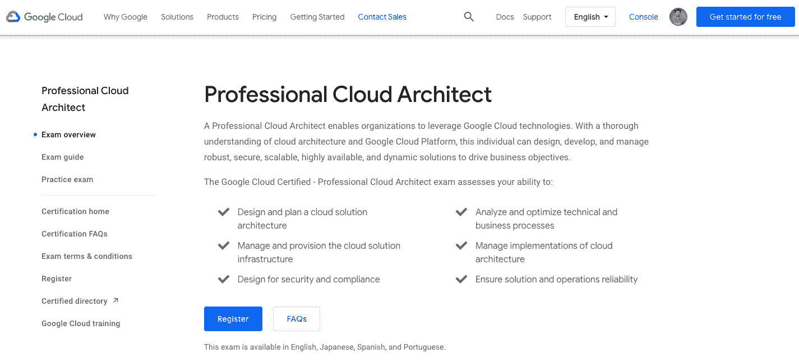
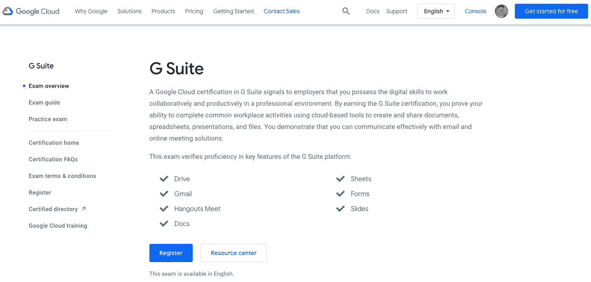

# 2023 年 4 项最佳 GCP 认证-谷歌云平台[更新]

> 原文：<https://hackr.io/blog/gcp-certifications>

## 什么是 GCP 认证？

谷歌云平台或 GCP 认证是最受欢迎的认证，每个专业人士都倾向于在他们的职业生涯中获得更好的工作职位和工作晋升。它帮助现在的年轻人在成熟的公司里找到他们梦想的工作，那里有更高的职业发展机会。拥有 GCP 认证信息的求职者比其他人获得更高的优势和优先权。因此，GCP 是每个技术学生或专业人士应该努力争取的最佳认证。

## **为什么 GCP 认证很重要？**

谷歌云平台，顾名思义，是谷歌的产物，支撑了世界的变化和发展。20 年前谷歌的出现标志着一个新的革命时代的开始，它结束了分享信息和知识的限制。谷歌帮助跨越了政治、文化和社会的界限，将真实呈现在人们面前。现在，谷歌正在促进一个信息系统的学习和开发过程。

这不仅加快了信息共享的速度，也降低了学习新时代技术的成本。谷歌已经远远领先于亚马逊网络服务(AWS)和 Azure 之间的竞争。今天，Google 的 GCP 已经被大多数财富 500 强公司使用，因为它简单、可用、舒适，并且增加了支持数据记录、处理、更新和分析过程的功能。

这就是世界各地的学生和专业人士更喜欢 GCP 认证的原因，因为它已经成为知名公司的首选，在当今世界就业市场面临完全混乱的情况下，这些公司可以提供更好的薪酬和工作稳定性。

## 如何获得 GCP 认证？

谷歌云平台认证是为了向科技公司确保求职者具备所需领域的所有相关技能和能力。获得 GCP 认证的直接途径如下。

*   第一步:了解云计算流程和谷歌云平台基础知识。
*   第二步:培养使用谷歌云平台的架构师技能。
*   第三步:学习应用谷歌云平台进行设计和加工。
*   第四步:参加云架构师考试并获得认证。

现在，GCP 认证的作用在第二阶段之后、第三阶段之前上升。第三步可以是参加云工程考试并获得认证。这将有助于学生和专业人士提高他们的知识，并决定他们是否适合下一步。这样，可以尝试坚持第二步，直到达到专业水平，这可以通过云工程师考试的第三步进行测试，从而获得认证。建议的过程应该如下。

*   第一步:了解云计算流程和谷歌云平台基础知识。
*   第二步:培养使用谷歌云平台的架构师技能。
*   第三步:云工程师考试认证。
*   第四步:学习应用谷歌云平台进行设计和加工。
*   第五步:参加云架构师考试并获得认证。

[拥有谷歌云专业证书的云工程](https://click.linksynergy.com/deeplink?id=jU79Zysihs4&mid=39197&murl=https%3A%2F%2Fwww.udemy.com%2Fcourse%2Fgoogle-cloud-certification-associate-cloud-engineer%2F)是一门很棒的 GCP 在线课程，将帮助你准备谷歌云认证。

## GCP 认证有哪些不同的类型？

不同类型的 GCP 认证取决于认证期间获得的专业知识水平。这些包括，

[****](https://cloud.google.com/certification/cloud-engineer)

谷歌云助理认证是工程师级别的认证，学生和专业人士可以参加，他们对该主题了解不多或一无所知。该认证将为他们提供机会，提高他们对基于 Google 的云计算流程的理解和技能。这个认证是基础级别的认证，通过这个课程的认证之后就可以参加其他的专业课程。该认证确保参与者具备命令行所需的技能，并能够部署、监控、控制和管理云计算流程中的解决方案和服务。

谷歌云助理认证的特点是，

1.  谷歌提供的程序。
2.  周期:6 个月
3.  费用:125 美元

你可以在这里注册[。](https://cloud.google.com/certification/cloud-engineer)

[****](https://cloud.google.com/certification/cloud-architect)

专业云认证是第二级认证，有助于培养并测试参与者在高级架构设计方面的知识和技能。基于工作角色的各种实施技能在学习的认证过程中得到加强，期末考试有助于确定专业人员和学生在课程期间获得的收益和技能水平。

专业谷歌云认证的特点有，

1.  当参加者获得 3 年或以上的行业经验时，可以参加认证计划。
2.  认证项目要求至少一年使用谷歌云平台设计和管理解决方案的经验。
3.  该项目由谷歌、Coursera、Udemy、Intellipaat 等公司提供。
4.  时期:介于 2 至 3 年之间。
5.  费用:200 美元

共有六种专业 GCP 认证，包括以下内容。

1.  **专业云架构师:**该课程有助于获取关于复杂云解决方案、谷歌云平台中的服务的知识，是 GCP 职业中薪酬最高的专业人士之一。
2.  **专业数据工程师:**该课程有助于培养数据工程能力，包括设计和构建数据采集、数据处理以及 GCP 的机器学习。
3.  **专业云开发者:**本课程有助于传授 GCP 模型可扩展应用的全栈知识和技能。
4.  **专业云网络工程师:**本课程帮助设计、实施和管理 GCP 模型中的架构。
5.  **专业云安全工程师:**本课程专门面向未来打算使用 GCP 安全工具保护公司云基础设施的安全工程师。
6.  **专业协同工程师:**本课程是专门为那些目标是在后期成为 G 套件专员的候选人而开设的。候选人需要有三年以上的行业经验和至少一年的 G 套件管理经验。

你可以在这里注册[。](https://cloud.google.com/certification/cloud-architect)

[****](https://cloud.google.com/certification/gsuite)

G Suite Google 认证旨在评估候选人在云计算流程中使用 Google 核心工具和服务的能力。该认证的强制性要求是具备使用谷歌提供的基于云的工具与同事协作的技能，包括电子邮件、谷歌文档、谷歌表单和其他在线资源，以便进行有效的沟通。

费用:200 美元 期限:2 至 3 年

该项目由谷歌、Coursera、Udemy、Intellipaat 等公司提供。

你可以在这里注册[。](https://cloud.google.com/certification/gsuite)

[****](https://developers.google.com/certification/mobile-web-specialist)

额外认证 Google Cloud certificates 旨在提高专业人员在解决问题和处理云计算服务中更好地应用知识和熟练程度的能力。这些证书包括以下证书。

1.  **Apigee 认证:**该认证旨在提高个人在应用各种谷歌工具、流程和实践解决问题方面的知识和熟练程度。
2.  **Google Associate Android Developer:**该认证旨在让已经升级的 G Suite 专业人员获得更多处理 Android 设备的知识和技能。
3.  **Google Mobile web Specialist:**该认证是专门为 Web 开发者在云计算过程中部署响应迅速、灵活的 Web 应用而设计的。

费用:200 美元 期限:2 至 3 年

该项目由谷歌、Coursera、Udemy、Intellipat 等公司提供。

你可以在这里注册[。](https://developers.google.com/certification/mobile-web-specialist)

## **破解 GCP 认证的最佳途径**

破解 GCP 认证的最佳方法包括，

1.  非常清楚云计算的基本概念。
2.  你应该具备在实际应用中运用这些概念的适当知识和技能。
3.  为 GCP 开发有效利用资源和实现高质量成果的架构的能力
4.  实践概念和学习概念一样重要。
5.  尝试解决在线模拟测试中的问题。
6.  了解角色和政策。
7.  永远不要放弃，尤其是在你第一次尝试的时候，因为生活意味着一次又一次的尝试，直到你成功。
8.  让自己了解最新的技术升级和专业知识。
9.  需要记住的是，GCP 的认证有效期只有两年，因此两年后需要重新申请，并在此期间补充新的知识和内容。

## **获得 GCP 认证的建议**

建议选择最好的在线平台获得 GCP 认证。Intellipaat、Google、Coursera 和 Udemy 是最受欢迎的选择，因为它们被学生评为获得 GCP 认证的最有效平台。在选择一个最符合你的要求和期望的之前，你可以比较价格、课程时间、教师和学生过去的评论。

## **结论**

总之，GCP 认证旨在确认候选人拥有云计算领域的技术技能、知识和技术诀窍。这将有助于获得更高的职位和更好的报酬在声誉良好的组织。虽然学习和获得 GCP 认证的过程需要参与者的全身心投入，但在成功完成课程后，当就业市场处于混乱状态时，更容易找到一份值得的工作。

你还有什么课程想与我们的社区分享吗？请在下面的评论中告诉我们！

**人也在读:**