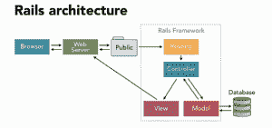
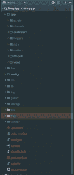
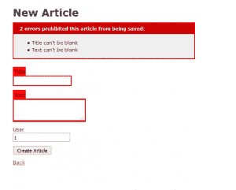

# Rails 入门— Ruby on Rails 指南| Hackr 博客

> 原文：<https://hackr.io/blog/getting-started-with-rails>

有许多因素构成了一个好的框架，你会发现许多框架在过去的几年里一直在交换位置。因此，选择一个框架并不总是容易的，尤其是如果你刚刚开始 web 开发的话。今天，我们将探索 Ruby on Rails 框架，这是最受欢迎的框架之一，人们似乎不会停止对它的喜爱！

## 什么是 Rails？

**[Rails](https://rubyonrails.org/)** 是一个 MVC web 开发框架，它利用 Ruby 语言及其优势来提高开发人员的生产力和开发速度。这是最常用的网络框架之一，据 SimilarTech 称，它正在为 200 万个网站供电，包括一些最大的网站，如 Airbnb、GitHub 和 CodeAcademy。Rails 是一个通用的框架，它可以作为一个完整的服务器，提供强大的模板渲染，也可以作为一个 RESTful API 使用。它支持开箱即用的两种选项。Rails 还可以很好地与前端框架集成，尤其是 React。

## 为什么使用 Rails？

## 轨道的优势

### 包括电池:

Rails 带来了许多现成的强大特性，包括一些已经实现的安全解决方案、强大的脚手架和代码生成，以及丰富的 ORM 层。当您开始一个新的 Rails 项目时，JSON API builder 就会随着 Puma web 服务器建立起来。您还可以使用一些已经实现的安全解决方案、身份验证机制，最棒的是，您可以选择自己想要的东西，留下其他的，这样您就可以获得很多已经配置好的功能，但不会失去灵活性。

### 简单易学:

学习 Rails 相当容易，Ruby 本身是一种简单的动态语言，类似于 Python。这不仅是因为 Rails 很容易上手，而且该框架的官方文档将允许您构建完整的应用程序，而且非常全面。Rails 隐藏的瑰宝之一是 RailsCasts 和 GoRails 之类的截屏。这些是社区举办的教程和演员表，将帮助您运行您的第一个应用程序，以及构建复杂的功能和执行您甚至认为不可能的高级任务。你可以使用最好的推荐教程之一 [Ruby on Rails 教程](https://hackr.io/tutorials/learn-ruby-on-rails?ref=blog)。

### 上市时间:

Rails 最强的特性之一是开发速度。Rails 是为开发人员设计的，它致力于提高开发人员的生产力，并通过消除编写样板文件的需要来提高开发过程的效率，相反，它遵循约定胜于配置的模式，以确保开发人员将时间花在真正值得做的任务上。

### 安全性:

Rails 解决了大多数开发人员可能会遇到的安全问题，从 Rails 5 开始，一些功能被强制执行，以防止初学者在开发中犯致命的错误。他们关于不同 web 攻击以及如何在 Rails 中防御这些攻击的文档也非常有用。
缺点

### 陡峭的学习曲线:

Rails 非常容易上手和运行，您甚至可以开发应用程序而无需经历许多复杂的事情。但是当你的需求越来越大时，你可能不得不钻研框架本身，揭开它的神秘面纱，因为 Rails 的很大一部分是幕后的神秘。学习曲线变得非常陡峭，开始时你可能会对语法有点不舒服，因为过渡有点严重。

### 部署:

部署 Rails 应用程序并不像它应该的那样简单。与 PHP 等其他语言不同，Ruby 不是开箱即用的，您可能需要使用 Docker 等容器化平台来轻松部署您的应用程序。当然也有支持 Ruby 的选项，只是它们可能不在你的关注范围内，你也可以查看 Google 的应用引擎，他们的文档表明你可以通过点击一个按钮来部署一个 Rails 应用程序。

### 可扩展性神话:

大多数网站会告诉你 Rails 不可扩展，这对大企业不利，你甚至会发现官方框架页面声明你应该用他们的框架替换 Rails，因为 Rails 不可扩展。猜猜看，Rails 是可扩展的！只是可伸缩性不像其他功能那样容易实现，事实上，GitHub、Zulu 和 Shopify 等高流量网站已经能够使用 Rails 进行大规模运营。
Rails 核心团队表示，随着 Rails 6 的发布，他们将解决这个神话，并帮助开发人员扩展他们的 Rails 应用程序。因为这是可能会吓到新人的事情之一，所以我想把它解决掉。

## 了解 Rails:



Rails 使用 MVC 架构，我们之前已经说过了。
**rails 中的模型**是 ActiveRecord 模块，这是一个丰富的 ORM 层，让你不用写复杂的 SQL 就能处理数据库。
rails 中的控制器是 ActionController 模块，视图是 ActionView 模块，ActionController 和 ActionView 合起来就叫 ActionPack，以防你碰到这个名字。**控制器**是你放下你的业务逻辑和管理应用程序流程的地方，它也负责数据处理，并在从模型中获取数据后向视图公开所需的数据。
**视图**然后用数据填充模板，并将页面从 ERB(模板语言)编译成 HTML。Rails 遵循两种重要的模式，即[常规超配置](https://www.techopedia.com/definition/27478/convention-over-configuration)和[干态](https://en.wikipedia.org/wiki/Don%27t_repeat_yourself)。

约定胜于配置意味着您不必继续决定如何实现大多数网站之间常见的某些功能，并从头开始重写基础架构。相反，您的重点应该是决定如何在开发过程中反映您的业务逻辑和卖点，以及如何创建一个更好的应用程序。这就是为什么在 Rails 中，很可能有一个库或一个宝石来存放你想做的任何事情，这并不意味着你必须使用它，但它会在你需要的时候出现。

DRY 代表不要重复自己，这意味着无论何时你发现自己在重复一些代码片段，那么可能有更好的方法来做事情，因为 Rails 旨在通过动态方法和动态调度等特性来消除这些重复。所以如果你发现自己在 Rails 中复制和粘贴，你应该警惕了。

您会注意到，在典型的 Rails 应用程序中实际上有更多的文件，而不仅仅是模型、视图和控制器。让我们快速浏览一遍。



## 应用程序文件夹:

app 文件夹包含您的模型、视图和控制器以及其他核心文件夹。资产:这是 CSS、图像和 JS(用 CoffeeScript 编写，一种编译成 Javascript 的语言)

**Channels:** 该文件夹与用于实时应用程序的 ActionCable 模块相关。当你开始学习框架时，你可以忽略它。

**助手:**助手是 Rails 的一个重要模块。一般来说，当使用 MVC 架构开发时，您应该尽可能地减少视图层中的代码执行，这意味着您也应该尽量少写代码。助手帮助您创建方法并向视图公开方法，以便视图可以直接使用该方法。

**Jobs:** ActiveJob 也是一个高级模块，用于后端的任务排队和异步运行任务。这是一个防止外部 API 阻塞延迟的强大特性，但是当您刚刚开始使用框架时，也可以忽略它。

**Mailers:** ActionMailer 是负责用户之间发送消息或者发送邮件的模块。它以与 ActionController 相同的方式运行，并且还拥有一个用于显示数据的视图。

config 文件夹包含配置文件，例如特定于环境的控件和配置。初始化器、应用程序的局部变量、Puma.rb 文件中的服务器配置以及 routes 文件。

Rails 中的路由非常简单，比 Django 和 Laravel 简单得多。典型的路线应该是这样的。Get 将登录的 get 请求指定为 sign_in URI，并让会话控制器用动作 new 来处理它。资源路由定义了资源的默认 CRUD(创建、检索、更新、删除)操作，包括 7 个默认操作:新建、创建、显示、索引、更新、删除、销毁。通过说`resources :articles`你用相应的方法定义了 7 条路线，这多酷啊！

DB 文件夹中包含您的模式、您的迁移(对数据库结构的增量更改)以及 seeds.rb 文件，您可以在其中创建用于测试和开发的应用程序数据。

有几个词你可能会经常听到，如果你知道它们的意思，我相信你会更习惯使用 Rails:

Rake 是用 ruby 编程的内部领域特定语言，它是一种类似于 Make 和 Ant 的构建语言。你可以在这里了解更多关于[的信息。](http://codefol.io/posts/What-is-Rack-A-Primer)

**Rack:** Rack 是一个适配器层，位于框架(Rails、Sinatra、Hanami)和 web 服务器(Unicorn、Thin、Puma)之间。Rack 是一个 Ruby 化的命令网关接口。你可以在这里了解更多关于[的信息。](http://codefol.io/posts/What-is-Rack-A-Primer)

Bundler 是一个 ruby 包管理器和依赖解析器。它解决了这样一个常见的问题，即一个包依赖于某个版本的库，而另一个包依赖于同一个库的不同版本。它负责管理这些依赖关系，可以做很多事情。

## **Rails 工作流程**

即使您知道常见的 MVC 工作流，也可能不清楚 Rails 应用程序是如何工作的，所以让我们来浏览一下。

当服务器收到请求时，该请求会被发送到路由器。然后，路由器确定它是哪个请求，以及它想去哪里。然后，路由器将该请求发送给适当的控制器动作。然后触发控制器动作，服务器呈现应用程序布局模板。yield 关键字将允许模板在 body 部分中呈现与所执行的控制器动作相对应的视图。然后，模板被编译成 HTML，并发送给请求者。

当然，这并不是 rails 中唯一的方法，您还可以使用 render 方法来呈现您想要的任何特定视图，例如，如果您有一个不对应于控制器的视图。但是就初级水平而言，这些问题可能根本与你无关。事实上，您可以构建完整的 web 应用程序，而不必使用它们。

## **资源**

rails 最大的优点之一是从视频到电子书的大量资源，甚至是该语言和框架的官方文档也非常丰富，充满了例子。

约翰霍普金斯大学的 Ruby On Rails 专业提供了一些最好的 Rails 课程。这些课程开门见山，涵盖了开发人员应该了解的一些高级主题和最佳实践。这些作业帮助你理解所解释的一切，它们不像网上提供的其他课程那样简单或容易。

视频 : RailsCasts 虽然 4 年前就停止了，但仍然非常有用和实用。GoRails 今天仍在工作，但你需要订阅专业内容。

电子书 : Ruby On Rails 教程是一个非常好的参考资料。迈克尔·哈特尔的书很有教育意义，也很透彻，你也可以搜索大卫·科普兰的书，寻找更高级的主题，带有初学者演练的味道。
官方文件

[完整的 Ruby on Rails 开发者课程](https://click.linksynergy.com/link?id=jU79Zysihs4&offerid=1045023.519442&type=2&murl=https%3A%2F%2Fwww.udemy.com%2Fcourse%2Fthe-complete-ruby-on-rails-developer-course%2F)

## 开始使用博客应用程序

我们将构建一个简单的博客应用程序，您可以在其中创建和管理您的文章，并提供一个认证解决方案，它类似于 google documents，您将看到在 rails 中构建这样一个应用程序是多么容易，您可以在这个资源库中找到该应用程序的代码，以便您可以继续学习。

打开命令行，转到要创建应用程序的目录。输入以下命令，这将使用最新版本的 rails 创建一个新的 Rails 应用程序。

```
rails new BlogApp
```

一旦它完成了文件的创建，默认情况下它将开始运行 bundle，bundler 是处理您的 gems 可能使用的不同依赖项的包管理器。您还可以使用指定版本的 Rails 创建应用程序，防止它在创建时运行 bundler，或者仅在 API 模式下创建应用程序，后者仅在 Rails 5 上可用。

因为我们会经常用到它，所以让我们先解释一下什么是 Gem 文件。Rails 中的 Gems 类似于其他语言的库和包，它允许您使用可重用的代码片段，而不必重新发明轮子。

Rails 中的 Gems 非常强大，因为您会发现社区贡献了大量有用的 gems 来处理甚至最小的细节，这些是其他开发人员花时间创建的工具，供您直接使用并节省时间。
你所要做的就是将宝石添加到`gemfile`中，就像我们对`bcrypt`所做的那样，然后设计并手动运行捆绑命令。每次你添加一个宝石，你运行捆绑命令。

Bcrypt 是一个安全宝石，我们可以使用它来创建我们自己的身份验证解决方案，因为它有助于创建安全密码和验证用户。但是为了向您展示它的强大，我们将使用 Devise，这是一个流行的身份验证引擎，它将为我们提供一个开箱即用的完整身份验证解决方案。添加完 gems 后，运行 bundle install，如果您在 windows 上遇到了 cp 720，请确保通过键入:chcp 1252 来更改页面编码

现在我们运行命令 device:install 来设置 device 引擎

```
rails genetare devise:install
```

然后用命令 devise user 生成一个新用户。

```
rails generate devise user
```

现在，如果你转到/app/models/user，你会发现 Devise 为你创建了一个模型。如果您想要生成控制器或者模型的视图来修改它们，您可以通过运行`rails g devise views users.`来实现

此外，请注意，Devise 让您能够定制模块的使用，每个模块负责特定的一系列功能，例如，confirmable 允许您发送确认电子邮件，trackable 允许您跟踪用户的 IP 地址，并存储这些信息。您可以从 GitHub 文档中了解更多关于这些模块的信息，但是现在，我们将使用默认配置。

现在，您可以再次进入命令行，我们可以开始创建我们的文章对象。

Rails 为您提供了少数几个可以使用的生成，您可以生成模型、视图、控制器，或者用一个支架将这三者结合在一起。

我们将继续构建文章资源，并指定模型的属性。默认的属性类型是 String，所以我们不需要指定 title 类型，但是 text 需要是 Text 类型，我们还指定了 article 表引用 user 表，这意味着每篇文章都属于某个用户。

```
rails generate scaffold Article title text:text user:interface
```

一旦我们运行了这个命令，我们就应该在文章方面做好一切准备。我们将继续在文章模型中添加验证，以确保在数据库中创建的所有实例都有一个标题并包含一些文本，从而防止保存空对象，从而使事情变得更好。您也可以编写自己的自定义验证，但是我们会尽量保持简单。

如果你试图创建一篇没有标题或文字的文章，你会得到这些错误。



需要记住的一点是，尽管`user:references`在文章模型中定义了一个`has_many`关系，但它并没有在用户模型中定义，所以我们将继续添加`belongs_to :users`关系。现在我们可以运行`rake db:migrate`命令来填充这些更改，并通过迁移在数据库中创建表。

现在我们的模型已经准备好了，让我们前进到控制器。

如果您现在键入`rails s`命令并转到 localhost:3000/articles，您会发现任何人都可以访问文章，即使他不是登录用户，他也可以访问所有文章。因此，我们需要将应用程序限制为登录用户，只让他们管理自己的文章，而不是所有人的文章。

在 Rails 中，您可以使用`before_action`定义在适当的动作发生之前运行的某些函数。我们甚至不必编写检查用户是否登录的函数，因为 Devise 为我们提供了一个名为`authenticate_user`的现成方法。我们所要做的就是用 Devise 的方法将 before_action 过滤器添加到应用程序控制器中，它将为我们完成这项工作。

现在，如果您尝试访问 localhost:3000/articles，您将被重定向到一个登录表单。
现在我们需要定制控制器，这样它们就不会为每个用户加载整个文章模型。在 Rails 中这样做真的很容易。我们所要做的就是添加一个函数，在对文章的控制器执行任何操作之前设置一个用户变量。`Current_user`是 Devise 提供的一种方法，用于检索当前登录的用户对象

设置用户后，我们通过链接命令@user.articles 只加载他的文章，而不是加载 Articles.all。

现在你可以用 Rails s 命令运行服务器，进入 localhost:3000/articles，系统会提示你登录/注册，一旦登录，你就可以随意创建、删除、更新或检索你的文章了！看看这有多简单。