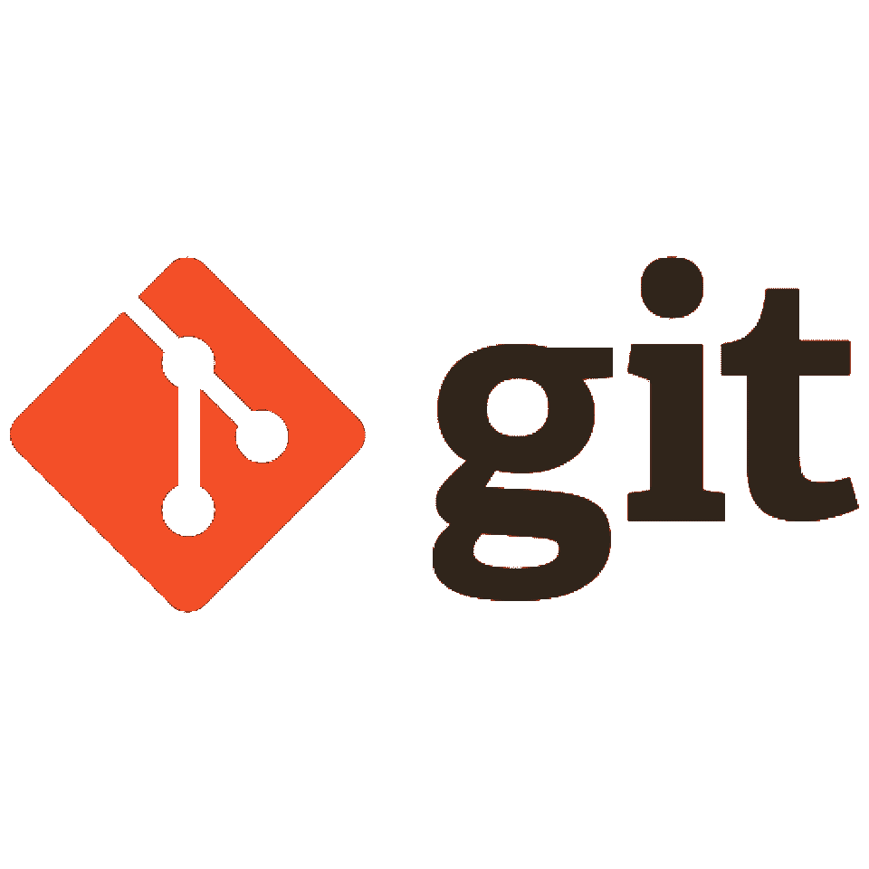
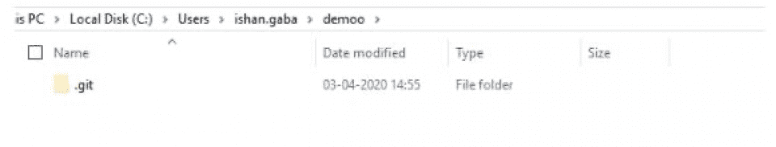
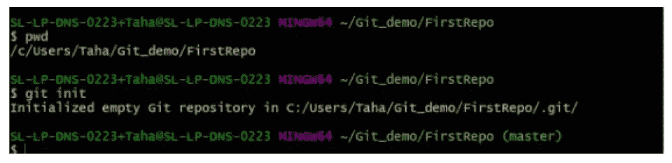
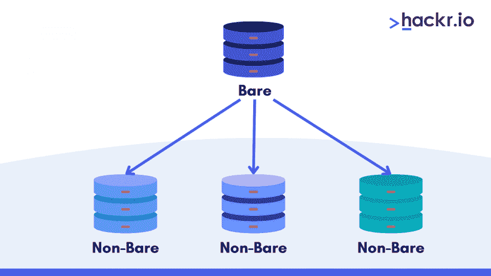
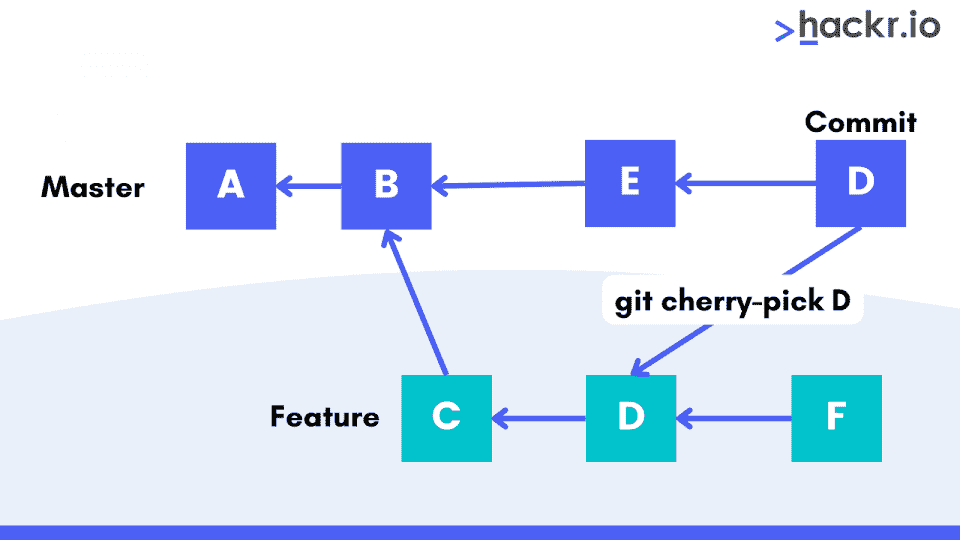
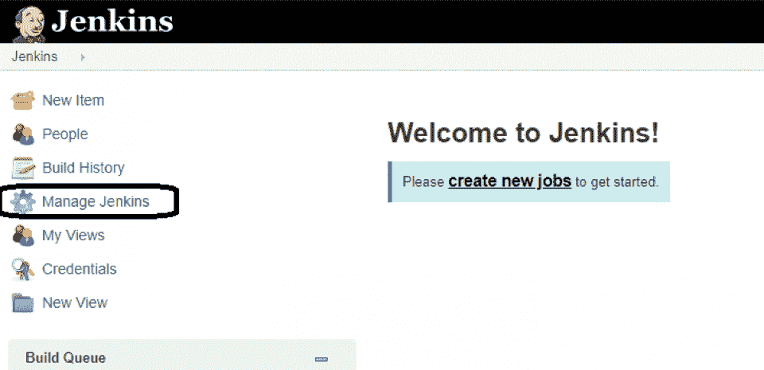
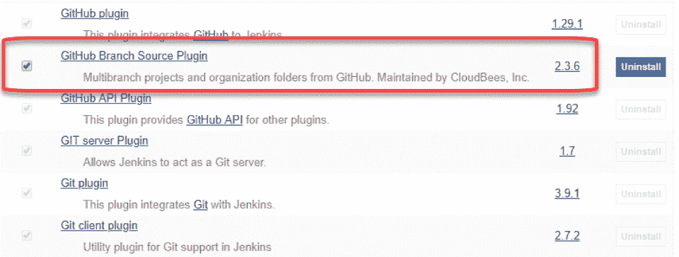

# 2023 年 50+ Git 面试问答[更新]

> 原文：<https://hackr.io/blog/git-interview-questions>

Git 是管理和共享源代码最常用的工具之一。作为一个开源软件，Git 因其在实现 DevOps 中的关键作用而变得流行。在这篇文章中，你会发现 Git 面试问题和答案对初学者、中级和高级专业人员都很有用。

泡一杯咖啡，找一个朋友在 Git 上练习这些面试问题！最终，你会成为一名专家，在面试、发展和职业生涯中更好地运用这些 Git 问题。

## **50 大 Git 面试问答**

你是 Git 老手还是游戏的新程序员？我们根据难度对这些 Git 面试问题和答案进行了分类:

### **Git 上的基本面试问题**

#### **1。Git 是什么？**

****

Git 是一个开源的、广泛使用的分布式版本控制系统。它能够轻松处理小型到大型项目的开发。

多个开发人员可以同时在一个项目上工作，并且他们可以跟踪所做的和反映的代码更改。此外，如果出现问题，您可以轻松地将更改恢复到以前的版本。

#### **2。Git 的特点是什么？**

以下是 Git 的一些特性:

*   **解读:**从性能角度来看，相比其他版本控制系统，Git 被认为是一个可靠的平台。它使更改和优化代码以及合并分支的过程变得更加顺畅。Git 使用算法来创建真正的源代码。

*   **安全性:** Git 通过使用 SHA1 算法来保持文件关系的加密安全性，从而保持源代码的完整性。这种算法保护代码，并在出现损坏时更改历史记录。

*   灵活性: Git 支持不同类型的非线性工作流开发，可以处理大小项目。Git 支持标记和分支操作的灵活性。

*   广泛接受: Git 因其用户友好性和巨大的特性，如安全性、灵活性、性能等，被每个开发人员广泛接受。

*   **分支模型:**与其他 VCS 相比，Git 具有不同的分支模型。Git 模型允许多个独立的本地分支，以允许无摩擦的上下文切换(来回切换到新的提交、代码，然后返回)，基于角色的代码(一个分支总是进入生产，另一个进入测试，等等)。)和一次性实验(删除实验不丢失代码)。

*   **Staging Area:** Git 有一个称为“索引”或“Staging Area”的中间阶段，您可以在实际完成提交之前格式化和更改提交。

*   **分布式:** Git 在本质上是分布式的，这意味着存储库或完整的代码库被镜像到开发人员的系统上，这样特定的开发人员只能在其上工作。

*   **开源:** Git 是开源的，允许来自世界各地的开发者为软件做出贡献，并通过添加更多高级功能和附加插件使其功能更强大。正因为如此，Linux 内核是一个拥有大约 1500 万行代码的软件。

[](https://imp.i384100.net/vn3ajW)

#### **3。使用 Git 有什么好处？**

以下是使用 Git 的优势列表:

*   **快速** : Git 是一个分布式模型，每个开发人员都有自己的本地存储库和提交历史，与其他版本控制系统相比，Git 是一个更快的选择。

*   **安全** : Git 具有高效的分支和合并功能，维护数据完整性。

*   **不断改进**:由于它是开源的，任何人都可以使用它并贡献源代码来改进它的功能。

*   **省时:** Git 可以执行简单的 push 和 pull 操作，为开发者节省时间，无需在不同的请求之间切换。

*   **多功能**:您可以用任何语言创建 Git 加载项。

*   **优化性能:** Git 将数据视为一系列快照，确保良好的网络性能和优化的磁盘利用率。

#### **4。Git 的局限性是什么？**

以下是您在使用 Git 时可能遇到的一些主要限制:

*   **繁琐**:与 Git 合作，需要技术过硬。此外，它在 Windows 上运行速度较慢，命令行输入繁琐。

*   糟糕的界面: Git 有一个困难的学习曲线，界面对用户不友好。它使用的资源也可能会降低性能。

*   **多个包仓库:** Git 会检查子树；对于每个项目，需要为多个包存储库设置中心服务。

*   **多个分支:**你需要创建多个分支进行并行开发。

*   **缺乏访问控制和支持:** Git 没有内置的访问控制和对二进制文件的支持。

*   **昂贵**:包装的过程非常昂贵，需要充足的预算。

#### **5。SVN 和 Git 有什么区别？**

以下是 SVN 和 Git 之间的一些主要区别:

*   与 Git 相比，SVN 对于更大的文件更有用。

*   SVN 使用**集中版本控制**，这意味着中央服务器将同时拥有新文件和原始文件。

*   SVN 的速度较慢，因为开发人员在同一个中央服务器上工作，因此没有灵活的工作流程。Git 比 T2 更快，因为它通过几个本地存储库分担工作负载。

*   SVN 有一个更复杂的系统，因为它与中央存储库一起工作。但是使用 Git，您可以很容易地对文件进行修改。

*   Git 使用**本地存储库**，稍后您可以很容易地将其与中央存储库合并。而在 SVN 的情况下，开发人员必须在中央储存库发生变化时在线。

下面是 SVN 和 Git 中不同命令的快速列表:

| **任务** | **SVN 命令** | **Git 命令** |
| 创建新的存储库。 | 

```
svnadmin create
```

 | 

```
git init
```

 |
| 将文件复制到客户端工作区。 | 

```
svn checkout <URL> <target_name>
```

 | 

```
git clone or git fetch
```

 |
| 将更改发送到仓库。 | 

```
svn commit
```

 | 

```
git commit
```

 |
| 添加新文件。 | 

```
svn import
```

 | 

```
git add
```

 |
| 比较对文件的更改。 | 

```
svn diff
```

 | 

```
git diff
```

 |

**6。什么是分布式版本控制系统？**

分布式版本控制系统让您可以在整个系统中轻松跟踪文件的不同版本。它确保了一致性，因为所有用户都知道在某个时间点文件发生了什么。

例如，DVCS 使用存储库作为工作站和服务器之间的中介。该存储库包含所有修订的文件版本，软件系统将持续检查该存储库以确保一致性。

DVCS 的主要目的是跟踪对单个文件或文档的更改。它使用不同的跟踪措施，以不同的方式工作，允许透明地研究特定文件是如何更改的以及何时更改的，这被称为“推/拉”过程，在该过程中，服务器和其他组件之间交换信息，以保持文件版本的一致性。

#### 7 .**。使用分布式版本控制系统的优势是什么？**

以下是使用分布式版本控制系统的一些优势:

*   **快速**:所有的工作都可以由不同的开发者在本地存储库上完成，不需要调用服务器。
*   **容易分支和合并:**由于代码库驻留在本地硬盘上，分支和合并将比集中式 VCS 更容易。
*   **本地分支:**开发人员可以创建、处理和合并任意数量的本地分支。一旦合并完成，开发人员可以删除本地分支，这样他们就不会被任何人看到。
*   **快照而不是差异:**使用快照，您可以拥有每个执行的提交的完整代码库。它允许您恢复任何提交，而无需对基本版本进行更改。
*   可伸缩性:与集中式 VCS 相比，DVC 系统具有高度的可伸缩性，尤其是对于允许数百万开发者参与的开源项目。

#### **8。Git 用的是什么语言？**

Git 在 C 语言中工作，这是 Git 速度快的主要原因。c 减少了与高级语言相关的运行时间开销。

#### **9。什么是 Git 存储库，如何初始化它？**

Git 存储库是所有 Git 文件的中心位置。这些文件可以在本地存储库中，也可以在远程存储库中。



要将空存储库初始化为 Git 目录，请使用 init 命令。一旦运行它，您可以看到一个. git 文件夹。



#### 10。有哪些常用的 Git 命令？

以下是一些对 Git 有用的命令:

*   **Git config:** 帮助您配置用户名和电子邮件地址。
*   **Git add** :允许您向暂存区添加一个或多个文件。
*   **Git diff:** 允许您查看对文件所做的更改。
*   **Git init:** 允许您初始化一个空的 Git 存储库。
*   **Git commit:** 允许您将更改提交到头部，而不是远程存储库。

#### **11。Git 克隆是做什么的？**

Git clone 是一个 Git 命令实用程序，它以现有存储库为目标，并为目标存储库创建一个它的克隆。原始存储库可以存储在本地文件系统或远程机器可访问的支持协议上。

它是一个完全成熟的 Git 存储库，有自己的历史，管理自己的文件，并附带一个与原始存储库完全隔离的环境。克隆过程创建了一个远程连接，该连接指向原始存储库。有利于与中央回购的轻松互动。

此外，它将使用 Git refs 创建一个到存储在 refs/remotes/origin 下的远程分支头的自动连接。它还初始化 remote.origin.url 和 remote . origin . fetch configuration 变量。

```
git clone ssh://john@example.com/path/to/my-project.git 

cd my-project 

# Start working on the project
```

第一个命令在本地机器上的 my-project 文件夹中初始化一个新的 Git 存储库，并用中央存储库的内容填充它。然后，您可以在项目中使用 cd，并开始编辑文件、提交快照以及与其他存储库进行交互。另外，请注意。gitextension 从克隆的存储库中省略。这反映了本地拷贝的非裸状态。

#### **12。git 配置是做什么的？**

使用 git config，我们可以查询或设置 git 的配置选项。首先，我们使用带有配置名的 git config 并调用它来显示该名称下的设置值。

```
git config user.email
```

在上面的例子中，email 是用户配置块的子属性。该命令将返回与本地创建的提交相关联的电子邮件地址。

以下是三个配置级别:

*   –local——这是默认选项，如果没有传递配置选项，git config 将写入本地级别。
*   –全局-它是特定于用户的，即配置适用于操作系统的用户。
*   –system—此配置级别适用于整个机器，即操作系统和存储库的所有用户。

#### 13。就 Git 而言，head 是什么？

Git 既有“头”，也有功能不同的“头”。

head 是指向分支顶端(最新提交)的引用。要检查您的存储库的头部，请转到 path。git/refs/heads/。

该路径将为每个分支提供一个文件，显示该分支 tip 的提交 ID(最近的提交)。

而 HEAD 是一个特殊的引用，指向您当前正在处理的提交。简单地说，head 只不过是您的存储库中的一个全局变量或环境变量。根据您对工作目录的提交和签出，head 的值会发生变化。一个名为。git/HEAD 存储这个头。

HEAD 通常指向当前活动分支的 tip/head，它在。git/头文件如下:

```
> cat .git/HEAD

ref: refs/heads/master
```

它告诉 Git 关于主分支的用户当前工作目录。如果使用 git checkout 命令，这个头将指向新签出的分支的头。这里,“head”指定代表分支提示的任何提交。

#### **14。git status 命令有什么作用？**

该命令显示工作目录和登台区的状态。可以看到阶段性变化等信息。但是，它不会显示任何关于已提交项目历史的信息(稍后会详细介绍)。命令如下:

```
git status
```

它将列出已转移、未转移和未跟踪的文件。状态消息包括暂存/取消暂存文件的相关说明。

下面是一个输出示例，展示了 git 状态调用的三个主要类别:

```
On branch main

# Changes to be committed:

# (use "git reset HEAD <file>..." to unstage)

#

#modified: hello.py

#

# Changes not staged for commit:

# (use "git add <file>..." to update what will be committed)

# (use "git checkout -- <file>..." to discard changes in working directory)

#

#modified: main.py

#

# Untracked files:

# (use "git add <file>..." to include in what will be committed)

#

#hello.pyc
```

#### 15。git log 命令有什么作用？

“git log”命令显示提交的快照。您可以使用它来查看项目历史记录列表，对其进行过滤，并搜索更改。这是通讯器

该命令将以默认格式显示整个历史记录。如果输出超出了单个屏幕，您可以使用空格向下滚动屏幕。

#### 16。git add 命令有什么作用？

您可以使用“Git add”命令将工作目录更改为临时区域。它让 Git 知道您正在下一次提交时向文件添加更新。但是，它不会影响存储库，因为在您点击“git commit”之前，不会记录任何更改。要检查工作目录的状态和临时区域，请运行 git status 命令。

“Git 添加”和“Git 提交”一起完成 Git 工作流。首先，编辑工作目录中的文件。当您准备好项目的最终状态并准备保存它时，使用 Git add 来存放更改。一旦对暂存的快照感到满意，就用 Git commit 将它提交到项目历史中。您还可以使用 git reset 命令来撤消提交或暂存的快照。

“Git push”是第三个命令，可以用来将提交的变更发送到远程存储库进行协作。这使得其他团队成员能够看到变更。每次需要更改文件时，都必须调用“git add”。以下是您可以在“git add”命令中使用的一些选项:

*   **使用** git add 一次添加所有更改。命令。
*   **用** git add < file_name >命令逐个添加文件。
*   **使用:**git Add/<folder _ name>/command 添加特定文件夹的内容

#### **17。解释 Git 中的冲突。**

当两个不同的分支对同一文件中的同一行进行编辑时，Git 中就会出现冲突。另一种可能发生冲突的情况是，在一个分支中删除了一个文件，而另一个分支编辑了同一个文件。这些是合并冲突。

#### 18。git stash 命令是做什么的？

git stash 命令将暂时搁置您的工作副本中的更改，允许您处理其他东西，然后返回到第一个项目。

此命令将保存您未提交的更改供以后使用:

```
$ git status
On branch main
Changes to be committed:

new file: style.css

Changes not staged for commit:

modified: index.html

$ git stash
Saved working directory and index state WIP on main: 5002d47 our new homepage
HEAD is now at 5002d47 our new homepage

$ git status
On branch main
nothing to commit, working tree clean​
```

确保存储在您的 Git 存储库的本地。您甚至可以使用该命令删除不再需要的存储:

```
$ git stash drop stash@{1}
Dropped stash@{1} (17e2697fd8251df6163117cb3d58c1f62a5e7cdb)​
```

#### **19。git push 命令是做什么的？**

此命令将本地存储库内容上传到远程存储库。推送是将提交从本地传输到远程存储库的方式。它的工作方式与 git fetch 命令完全相反。要配置远程分支，请使用 git remote 命令。推送能够覆盖更改，因此在运行此命令时必须小心:

```
git push <remote> <branch>
```

将指定的分支推送到包含所有必需的提交和内部对象的远程存储库。它将在目标存储库中创建一个本地分支。为了防止您覆盖提交，Git 不允许您在目标存储库中导致非快进合并时进行推送。

```
git push <remote> --force
```

这个命令的工作方式和上面的一样，但是如果使用“force ”,它将推动分支，即使这会导致非快进合并。

```
git push <remote> --all
```

上述命令会将所有本地分支推送到指定的远程存储库。

```
git push <remote> --tags
```

推送时，默认情况下不会包含标签。你必须明确提出你是否想要推送标签。

#### 20。git pull 命令是做什么的？

该命令从远程存储库中获取并下载内容，然后立即更新本地存储库以匹配内容。将远程上游变更合并到您的本地存储库中是一项常见的任务。git pull 命令是另外两个命令的组合:git fetch 和 git merge。

在操作的第一阶段，git pull 将在 HEAD 指向的本地分支范围内执行 git fetch。下载完内容后，git pull 将进入一个合并工作流。它将创建一个新的合并提交，HEAD 将指向新的提交。

您可以将 git pull 视为类似于 SVN 更新。这是一种将本地存储库与上游变更同步的简单方法。

以下是一些命令:

获取当前分支的指定远程副本，并立即将其合并到本地副本中。

*   **git 拉不提交<远程>**

提取远程内容，而不创建新的合并提交。

*   **git pull - rebase <远程>**

同上，但是不使用 git merge 来集成远程分支和本地分支，而是使用 git rebase。

在显示任务内容的拉取过程中提供详细的输出。

#### **21。git 拉原点大师是做什么的？**

git pull origin master 允许您将所有主分支更改集成到本地分支中。

git pull = git fetch + git 合并源/主

#### **22。git pull 和 git fetch 有什么区别？**

以下是 git pull 和 git fetch 之间的主要区别。

*   **Git fetch 更安全**,因为它从远程获取所有提交，而不改变本地文件。任何变化。 **Git pull 更快**，因为它允许你执行多种功能。使用 git pull 将减少本地 repo 中的冲突机会，并从远程分支获取更新的更改。
*   Git fetch 实际上只从远程存储库下载新数据；然而，它并没有将这些新数据集成到您的工作文件中。Fetch 提供了远程存储库中发生的变化的新视图。而 git pull 用来自远程服务器的最新更改更新您当前的 HEAD 分支。这意味着拉不仅下载新数据，而且将它集成到您当前的工作副本文件中。

#### **23。列出删除分支的命令。**

有时，您需要删除本地或远程分支。

在删除之前，运行“git branch -a”来列出所有可用的分支。然后对想要删除的分支运行“git branch -d <branch name="">”。例如:</branch>

```
git branch -a

# *master

# test

# remote/origin/master

# remote/origin/test

git branch -d test

# Deleted branch test (was ########).
```

使用“git push”命令和“- delete”标志以及您想要删除的分支名称。另外，记得在 push 命令后添加远程名称。例如:

```
git branch -a

# *master

# test

# remote/origin/master

# remote/origin/test

git push origin --delete test

# To <URL of your repository>.git

# - [deleted] test
```

#### **24。git stash apply 命令有什么作用？**

使用 stash apply，您可以重新应用以前暂存的更改。使用“git stash pop:”

```
$ git status

On branch main

nothing to commit, working tree clean

$ git stash pop

On branch main

Changes to be committed:

new file: style.css

Changes not staged for commit:

modified: index.html

Dropped refs/stash@{0} (32b3aa1d185dfe6d57b3c3cc3b32cbf3e380cc6a)
```

stash pop 将从您的 stash 中删除更改，然后将它们重新应用到工作副本。您也可以使用 stash apply 命令。例如:

```
$ git stash apply

On branch main

Changes to be committed:

new file: style.css

Changes not staged for commit:

modified: index.html
```

#### **25。git diff 命令有什么作用？**

Diff 是一个函数，它接受两个输入，然后提供关于两个输入之间变化的输出。这是一个在 Git 数据源上运行 diff 函数的多用途命令。数据源可以是提交、分支、文件等等。

下面是使用 Git diff 命令可以做的事情:

*   **跟踪非暂存更改:** $ git diff
*   **跟踪二进制文件的变化:**

```
$:> git diff
```

二进制文件 a/script.pdf 和 b/script.pdf 不同

*   **跟踪已暂存但未提交的更改:**

```
$ git diff --staged
```

*   **提交文件后跟踪更改:**

```
$ git diff HEAD
```

*   **跟踪两次提交之间的更改:**

```
$ git diff Git Diff Branches:

$ git diff < branch 2>
```

```
git diff HEAD ./path/to/file

git diff --cached ./path/to/file
```

*   **比较不同分支的文件:**

```
git diff main new_branch ./diff_test.txt
```

#### **26。git diff 和 git status 有什么区别？**

“Git diff”用于检查提交、提交和工作树等之间的变化。而“git status”显示工作目录和索引之间的差异。

#### **27。什么是 git reflog？**

Git reflogs 有助于跟踪分支提示的更新。Git 有很多命令会将“ref”作为参数，比如 git checkout、git reset、git merge 等。Reflogs 跟踪 Git 引用在本地存储库中的更新时间。每个 reflog 条目都有一个时间戳。，您可以将它用作 Git ref 指针语法的限定符标记。

例如:

```
git reflog

Or 

git reflog show HEAD
```

#### **28。什么是空存储库？**

****

创建了一个没有工作树的空存储库；您必须明确提到"- bare "标志来创建一个:

```
git init --bare .
```

无论何时运行 ls 命令，都只会获得。git 目录，不是任何工作树。

您可以使用空存储库作为几个人共享的远程存储库。您不能在空存储库中进行任何提交，或者通过空存储库跟踪项目中的变更。中央存储库使用裸存储库，因为 Git 不允许您推送到非裸存储库，因为工作树会变得不一致。

#### **29。如何恢复已经提交并公开的提交？**

您可以通过以下两种方式之一恢复它:

*   在新的提交中删除或修复坏文件，并将其推送到远程存储库。然后使用以下命令将其提交到远程存储库:

```
git commit –m "commit message"
```

*   创建一个新的提交，撤消在错误提交中所做的所有更改。然后使用以下命令:

```
git revert <commit id>
```

示例:

```
git revert 56de0938f
```

#### 三十岁。什么是 SubGit？

SubGit 是一个允许 SVN Git 迁移的工具。TMate 开发了这个工具来将 SVN 回购转换为 git，因此您可以同时在两个系统上工作。它会自动将 SVN 与 Git 同步。这个工具可以让你创建 SVN||Git 镜像。要使用它，您必须将它安装在您的 Git 服务器上。它将检测您的远程 SVN 存储库的所有设置，包括 SVN 版本、分支和标签，并将它们转换成 Git 提交。它还保留历史和合并的数据。

Git & Github 训练营

#### 31。有哪些不同的分支策略？

以下是一些常用的 git 分支策略:

*   **GitFlow** :这种策略对于大多数项目来说都是一种先进的方法。它支持并行开发，开发人员可以从主分支中独立地处理特性，其中特性分支是从主分支中创建的。当变更完成时，开发人员将这些变更合并回主分支进行发布。

*   GitHub Flow :这是 gitflow 的一个简单替代方案，适合小型项目和团队，因为他们不需要处理多个版本。使用这种策略，您没有发布分支。你从主干开始。然后，开发人员创建分支——直接源于主模块的特性分支——来隔离他们的工作并将其合并回主模块。然后删除特征分支。

*   **GitLab 流程:**该策略将特性驱动开发和特性分支与问题跟踪相结合。当您想要维护多个环境并将您的登台环境从生产环境中分离出来时，它非常有用。当部署准备好时，您可以合并回生产分支并发布它。

*   **基于主干的开发**:这种策略不需要分支；相反，开发人员每天至少一次将他们的更改集成到共享主干中。然后，这个共享主干就可以随时发布了，当您必须进行较小的更改时，这是非常合适的。这里的主要优点是，您可以频繁地进行较小的更改，同时限制持久的分支并避免合并冲突，因为所有开发人员都在同一个分支上工作。

#### 32。分叉工作流的优势是什么？

*   **轻松集成**:开发者的贡献可以被集成，甚至不需要推到一个单一的集中回购，从而产生干净的项目历史。
*   **易推库:**它允许开发者推送他们的服务器端回购，但只有项目维护者有权将其推送到官方回购。

#### 33。git clean 命令是做什么的？

Git clean 命令的工作方式类似于 Git 重置和 git 检验。reset 和 checkout 命令都操作先前添加到 Git 跟踪索引中的文件，但是 git clean 命令操作未跟踪的文件。未跟踪文件是在您的存储库的工作目录中创建的文件，但尚未使用 git add 命令添加到存储库的跟踪索引中。

您可以使用带有不同选项的命令:

*   若要查看模拟运行，请运行“git clean -n”。
*   命令“git clean -f”强制删除未跟踪的文件。
*   若要删除未跟踪的目录，请运行“git clean -f -d”。
*   运行命令' git clean -f -x '来删除未跟踪的。gitignore 文件。
*   执行交互式 git clean 来添加-i 开关。

#### 34。如何恢复已删除的分支？

要恢复已删除的分支，请通过运行以下命令找到作为已删除分支头部的提交:

```
git reflog
```

然后，您可以通过运行以下命令来重新创建分支:

```
git checkout -b <branch-name> <sha1-of-commit>
```

您将无法在 git 的垃圾收集器中恢复已删除的分支。总是要有一个存储库备份，尤其是在一个小团队/专有项目中工作的时候。

## **Git 有经验工程师面试问答**

继续阅读更高级的 DevOps 工程师 Git 面试问答。

#### 35。如何在冲突阶段进入合并？

以下是解决合并冲突的方法:

*   打开合并冲突并进行必要的更改。
*   使用“git add”命令存放新的合并内容。
*   使用 git commit 命令创建新的提交。这将创建一个新的合并提交来完成合并。

您可以使用以下命令来解决冲突:

```
git log –merge

Git diff

git checkout

git reset –mixed

git merge –abort

git reset
```

#### 36。如何检查在特定提交中有更改的文件？

您可以使用以下命令来检查哪些文件发生了更改:

```
git diff-tree -r {hash}
```

上述命令将显示在该提交中修改的所有已修改文件的列表。如果指定-r 标志，它将列出单个文件。输出显示了一些额外的信息，因此您可以使用这两个标志来隐藏这些信息。

```
git diff-tree --no-commit-id --name-only -r {hash}
```

这里–no-commit-id 禁止在输出中显示提交散列，而–name-only 将只提到文件名，而不提到它们的路径。

#### 37。在提交失败的情况下，如何创建额外的提交或修改它？

您可能会考虑创建一个额外的提交，而不是修改它，因为:

*   如果修改，将会破坏提交之前保存的状态。有时这会更改提交内容，导致信息丢失。
*   修改选项可能会产生严重的影响，因为随着时间的推移，小的变化可能会继续增长。

#### 38。如何在不从本地文件系统中删除文件的情况下从 git 索引中删除文件？

使用“git rm”命令从索引和本地工作树中删除文件。

“git reset”命令将从暂存版本中删除该文件，然后将该文件添加到。gitignore 文件。

**git 重置<文件名> #:** 从索引中移除文件

**回显文件名> >。将文件添加到。忽略以避免错误的重复**

#### 39。如何恢复已经提交的错误提交？

您可以使用两种方法之一:

*   修复错误的文件更改并创建新的提交。然后，将它们推送到远程存储库。对于这种方法，使用" git commit -m " <message>"命令。</message>
*   创建新的提交，以恢复错误提交中的更改。对于这种方法，运行“git revert<name of bad commit>命令。

#### 40。git cherry-pick 命令是什么？

****

这个命令将某些提交从一个分支引入到存储库中的另一个分支。

## **Git 命令面试问题**

#### 41。在合并操作之后，如何找到一个破坏了某些东西的提交？

使用基于二分搜索法的 git-bi section 命令，并运行以下命令:

*   **git 等分开始#:** 发起等分会话
*   **git 平分错误#:** 将当前修订标记为错误
*   **git 平分有效修订#:** 将最后一次提交标记为有效修订

一旦您运行了上面的命令，git 将检出一个标记为介于“好”和“坏”版本之间的版本。您可以通过将提交标记为“好”或“坏”来再次运行该步骤，并且该过程将继续，直到发现有错误的提交。

#### **42。什么是 git 重置混合和 git 合并中止命令？**

*   **git reset - mixed:** 用于撤销工作目录和 git 索引的更改
*   **git merge - abort:** 用于停止合并过程，返回到合并发生前的状态。

#### **43。如何将最后 N 次提交压缩成一次提交？**

挤压是指将两个或多个提交合并为一个。使用以下命令从头开始编写新的提交消息:

```
git reset -soft HEAD~N &&git commit
```

要编辑新的提交消息，使用下面的命令添加现有的提交消息，然后提取消息，将它们传递给 git commit。

```
git reset -soft HEAD~N &&git commit -edit -m“$(git log -format=%B -reverse .HEAD@{N})”
```

#### **44。如何发现一个分支是否已经被合并？**

使用此命令确定分支是否已被合并:

*   返回已经合并到当前分支的分支列表。
*   git branch - no-merged -返回没有被合并的分支列表。

#### **45。如何在 Windows 上安装 Git？**

如果你想在 Windows 上安装 Git，你需要做的是:

*   下载 [Git Windows 安装程序](https://git-for-windows.github.io/)。
*   完成安装过程。
*   打开命令提示符。
*   运行以下命令来配置您的 git 用户名和电子邮件。

```
$ git config --global user.name "Emma Paris" $ git config --global user.email "eparis@atlassian.com"
```

#### **46。如何在 Linux 9/Debian/Ubuntu 上安装 Git？**

下面是在 Linux 上安装 Git 的方法:

*   从 shell 中使用 apt-get 安装 Git，并运行以下命令"

```
$ sudo apt-get update

$ sudo apt-get install git
```

*   运行以下命令验证安装的 git 版本:

```
$ git --version

git version 2.9.2
```

*   运行这些命令来配置 git 用户名和电子邮件。

```
$ git config --global user.name "Emma Paris"

$ git config --global user.email "eparis@atlassian.com"
```

#### **47。如何在 Fedora 上安装 Git？**

下面是在 Fedora 上安装 Git 的方法:

```
$ sudo dnf install git

or

$ sudo yum install git
```

*   现在，用下面的命令验证 Git 的安装版本。

```
$ git --version

git version 2.9.2
```

*   运行以下命令为您的 git 用户配置用户名和电子邮件:

```
$ git config --global user.name "Emma Paris"

$ git config --global user.email "eparis@atlassian.co
```

#### **48。如何使用 Mac Installer 在 Mac 上安装 Git？**

如果您使用的是 Mac，以下是您需要做的事情:

*   下载用于 Mac 的 [git 安装程序。](https://sourceforge.net/projects/git-osx-installer/files/)
*   完成安装过程。
*   安装后，到终端验证安装版本。
*   运行以下命令:

```
$ git --version

git version 2.9.2
```

*   运行以下命令来配置 git 用户名和电子邮件:

```
$ git config --global user.name "Emma Paris"

$ git config --global user.email "eparis@atlassian
```

#### 49。如何将 Git 与 Jenkins 集成在一起？

如果您想将 Git 与 [Jenkins](https://hackr.io/blog/what-is-jenkins) 集成，请遵循以下步骤:

*   点击 Jenkins 仪表板上的“管理 Jenkins”。



*   选择 GIT 插件->不重启安装。
*   等待安装过程完成。
*   安装后，您将在 Jenkins 仪表板上看到 Git 插件。



#### 50。Git 中的“钩子”由什么组成？

该目录由 shell 脚本组成，如果运行相应的 Git 命令，就会激活这些脚本。

#### 51。Git 和 GitHub 有什么区别？

Git 是一个版本控制系统，可以让您跟踪对源代码所做的更改。另一方面，GitHub 是一个基于云的托管服务，托管 Git 存储库，使您更容易通过互联网访问您的存储库。

### **奖励提示**

**以下是一些参加 Git 面试的额外建议:**

1.  确保仔细阅读每一个 Git 概念，为面试做好充分准备。
2.  浏览列表中的所有问题，因为它包含许多常见问题。
3.  和 Git 一起工作，有一些实用的知识。
4.  观看 youtube 视频或参考互联网上的任何其他资源，对 Git 有一个基本的了解。

## **结论**

有了这么大的范围和不断增长的需求，Git 已经发展成为开发人员生活中不可分割的一部分。人们越来越多地使用 Git，因为它正迅速成为改进 DevOps 流程的一种常用方法。此外，Git 是一个免费可用的分布式版本控制系统，已经帮助世界各地的许多开发人员在项目上进行协作，并提高了效率。

如果你打算申请 Git 工作，用这些 Git 面试问题和朋友一起准备和练习吧！你会在面试中感到更加自信，并准备好展示你的知识。

准备好让你的职业生涯更上一层楼了吗？将你的研究与 DevOps 面试问题结合起来。

**[在这里学习顶尖 DevOps 面试题](https://hackr.io/blog/devops-interview-questions)**

## **常见问题解答**

#### **1。什么是 Git 面试问题？**

Git 面试问题是你在 Git 面试中会遇到的一系列问题。这些问题将有助于你通过任何面试，打开许多工作机会。

#### **2。Git 的两项基本工作是什么？**

下面是 Git 的两个主要功能:

*   基于每个站点、每个用户和每个存储库监控和检查设置和配置数据。
*   允许团队成员跟踪源代码中的变更，并在需要时恢复到以前的版本。

#### **3。Git 中最重要的元素是什么？**

Git 工作流由四个重要的组件组成:

*   工作目录
*   部队从一个战场转往另一个战场的集结地
*   本地知识库
*   远程存储库