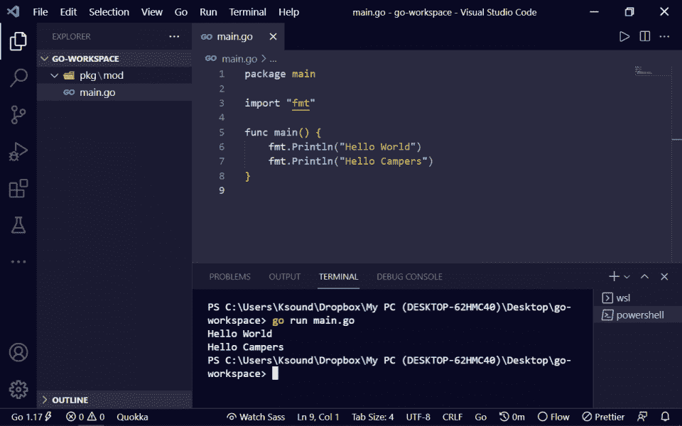
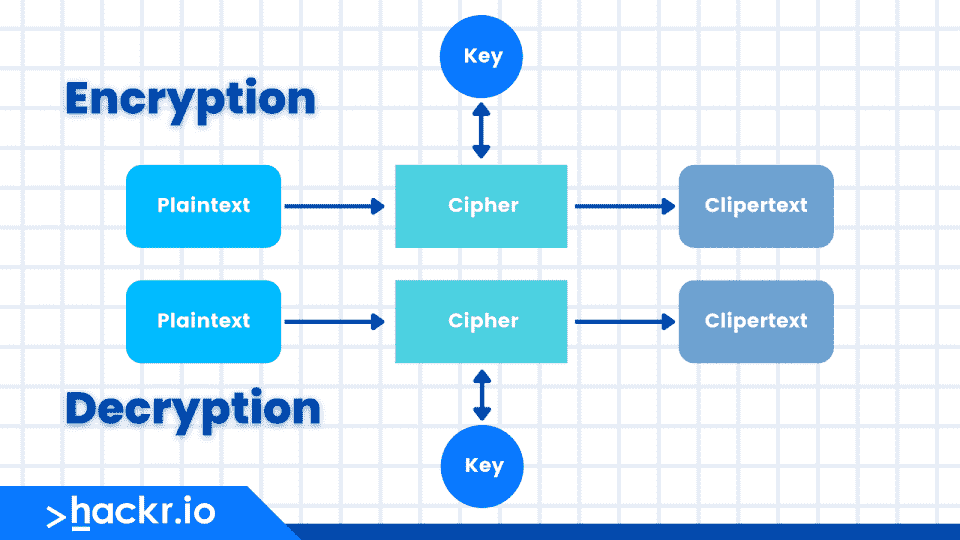

# 下载 Golang 备忘单 PDF 快速参考

> 原文：<https://hackr.io/blog/golang-cheat-sheet>

Go 编程语言是一种开源的、编译的、统计类型的编程语言。由 Robert Griesemer、Rob Pike 和 Ken Thompson 设计的 Google 在 2007 年推出了 Go 或 Golang 来提高程序员的工作效率。这些设计人员创建了一种语言，它结合了以下现有编程语言的功能:

*   运行时效率和像 c 一样的静态类型。
*   像 Python 和 JavaScript 一样的可读性和可用性。

这种语言之所以流行，是因为 Go 语言的语法简单、易理解且高效，使其成为获得工作的最佳编程语言之一。但是你可能不会记住每一个 Golang 函数。这就是我们创建这个 Golang 备忘单的原因——Golang 语法和更多内容的简易参考。

[点击此处](https://drive.google.com/file/d/1Eh3KqUiLxdkJZbotHE50j2h7H0GTVWog/view?usp=sharing)下载我们的 Golang 备忘单 PDF。

## **Golang 小抄**

在直接进入我们的 Go 备忘单之前，让我们先了解一下 Go 的设置和安装。

### **如何设置和安装 Go**

首先，您需要下载 Go 档案。下表突出显示了每个系统可用的归档文件:

| **OS** | **档案名称** |
| Windows 操作系统 | go1.14.windows-amd64.msi |
| Linux 操作系统 | go1.14.linux-amd64.tar.gz |
| 苹果个人计算机 | go1.14 . Darwin-amd64-OS x 10.8 . pkg |
| FreeBSD | go1.14.freebsd-amd64.tar.gz |

下载适当的归档文件后，将其解压缩到/usr/local。稍后，在该文件夹中创建一个名为“Go”的文件夹。您可以从命令提示符(cmd)运行以下命令。

```
mkdir /usr/local/Go
tar -C /usr/local -xzf go$VERSION.$OS-$ARCH.tar.gz
brew install go
```

现在，必须将路径变量/usr/local/go/bin 添加到环境变量中。下表突出显示了各种操作系统的 path 变量:

| **OS** | **输出** |
| Linux 操作系统 | 导出路径= $PATH:/usr/local/go/bin |
| 苹果个人计算机 | 导出路径= $PATH:/usr/local/go/bin |
| FreeBSD | 导出路径= $PATH:/usr/local/go/bin |

在 cmd 中执行以下命令来添加路径变量:

```
// add to ~/.bash_profile
export GOPATH="$HOME/Go"
export PATH="/usr/local/bin:$PATH:$GOPATH/bin"
```

### 在 Windows 中创建示例文件

这里，我们可以在 C:\>Go_WorkSpace 中创建一个 test.go 文件。

```
package main

import"fmt"

funcmain() {
fmt.Println("Hello")
}
```

要执行测试，请从 cmd 运行以下命令:

```
C:\Go_WorkSpace>go run test.go
```

您将得到以下输出:

```
Hello
```

### **基本 Go 语法**

现在让我们从 Golang 的一些基本语法开始。

```
package main

import "fmt"

func main() {
    fmt.Println("Hello World")
}
```

其中:Package 是文件和代码的集合。请确保在您的每个 Go 程序的顶部添加“package main”。Fmt 是 Go 语言标准库中可用的一个包。它帮助你格式化字符串和打印信息到命令行。包含的方法之一是打印该行的“println”。按照上面的例子，我们用它在 cmd 上打印“Hello World”。“Main”函数包含将为您执行任务的代码。要运行这段代码，键入“go run main.go”，然后按回车键。你可以给你的围棋程序取任何名字。

### **操作员**

每种编程语言都有运算符，允许您执行算术、逻辑、按位、比较和其他功能。让我们看一下 Go 操作符，以及它们的描述和例子。

#### **算术运算符**

算术运算符对操作数执行数学运算。

| **操作员** | **描述** | **例子** |
| + | 将两个操作数相加 | A + B 等于 30 |
| - | 从第一个操作数中减去第二个操作数 | A - B 给出了-10 |
| * | 将两个操作数相乘 | A * B 给 200 |
| / | 分子除以分母。 | B / A 给出 2 |
| % | 模数算子；给出整数除法运算后的余数。 | B % A 给出 0 |
| ++ | 增量运算符。将整数值增加 1。 | A++给出 11 |
| - | Decrement 运算符将整数值减一。 | A -给出 9 |

#### **关系运算符**

您可以使用关系运算符来比较两个值。

| **操作员** | **描述** | **例子** |
| == | 检查两个操作数的值是否相等；如果是，则条件为真。 | (A == B)不成立。 |
| ！= | 检查两个操作数的值是否相等；如果值不相等，则条件为真。 | (答！= B)为真。 |
| > | 检查左操作数值是否大于右操作数值；如果是，则条件为真。 | (A > B)不正确。 |
| < | 检查左操作数的值是否小于右操作数的值；如果是，则条件为真。 | (答< B) is true. |
| > = | 检查左操作数值是否大于或等于右操作数值；如果是，则条件为真。 | (A >= B)不正确。 |
| <= | 它检查左操作数值是否小于或等于右操作数值；如果是，则条件为真。 | (A <= B)为真。 |

#### **逻辑运算符**

您可以使用逻辑运算符来组合两个或多个条件。

| **操作员** | **描述** | **例子** |
| && | 称为逻辑与运算符。如果两个操作数都不为零，则条件为真。 | (A && B)是假的。 |
| &#124;&#124; | 称为逻辑或运算符。如果两个操作数中的任何一个非零，则条件为真。 | (A &#124;&#124; B)是真的。 |
| ！ | 称为逻辑非运算符。用于反转其操作数的逻辑状态。如果一个条件为真，那么逻辑 NOT 运算符将使其为假。 | ！(A && B)是真的。 |

#### **按位运算符**

这些执行逐位操作。&、|、和^的真值表如下:

| p | q | 工艺与质量 | p &#124; q | ^问 |
| 0 | 0 | 0 | 0 | 0 |
| 0 | 一 | 0 | 一 | 一 |
| 一 | 一 | 一 | 1 | 0 |
| 1 | 0 | 0 | 1 | 1 |

| **操作员** | **描述** | **例子** |
| & | 二元 AND 运算符将一个位复制到结果中，如果它同时存在于两个操作数中。 | (A & B)会给 12，也就是 0000 1100 |
| &#124; | 二进制 OR 运算符复制任一操作数中存在的位。 | (A &#124; B)会给出 61，也就是 0011 1101 |
| ^ | 如果在一个操作数中设置了该位，而不是在两个操作数中都设置了该位，则二进制 XOR 运算符会复制该位。 | (A ^ B)会给出 49，也就是 0011 0001 |
| << | 二元左移运算符。左操作数的值左移右操作数指定的位数。 | A << 2 将得出 240，即 1111 0000 |
| >> | 二元右移位运算符。左操作数的值向右移动右操作数指定的位数。 | A >> 2 会给出 15 也就是 0000 1111 |

#### **赋值运算符**

赋值运算符有助于为变量赋值。

| **操作员** | **描述** | **例子** |
| + | 简单赋值运算符，将右侧操作数的值赋给左侧操作数 | C = A + B 将 A + B 的值赋给 C |
| +- | 加法和赋值运算符，将右操作数与左操作数相加，并将结果赋给左操作数 | C += A 等价于 C = C + A |
| -= | 减法和赋值运算符，它从左操作数中减去右操作数，并将结果赋给左操作数 | C -= A 等价于 C = C - A |
| *= | 乘法和赋值运算符，它将右操作数与左操作数相乘，并将结果赋给左操作数 | C *= A 等价于 C = C * A |
| /= | 除法和赋值运算符。它将左操作数除以右操作数，并将结果赋给左操作数 | C /= A 相当于 C = C / A |
| %= | 模数和赋值运算符。它使用两个操作数取模，并将结果赋给左操作数 | C %= A 相当于 C = C % A |
| <<= | 左移和赋值运算符 | C <<= 2 与 C = C << 2 相同 |
| >>= | 右移位和赋值运算符 | C >>= 2 与 C = C >> 2 相同 |
| &= | 按位 AND 赋值运算符 | C & 2 和 C = C & 2 是一样的 |
| = | 按位异或和赋值运算符 | C ^= 2 与 C = C ^ 2 相同 |
| &#124;= | 按位包含 OR 和赋值运算符 | C &#124;= 2 与 C = C &#124; 2 相同 |

#### **杂项运算符**

| **操作员** | **描述** | **例子** |
| & | 返回变量的地址。 | &a;返回变量‘a’的实际地址。 |
| * | 指向变量的指针。 | * a；提供指向变量的指针。 |

#### **运算符优先级**

| **类别** | **操作员** | **关联性** |
| 后缀 | () [] -> .++ - - | 从左到右 |
| 一元的 | + -！~ ++(类型)*(sizeof) | 从右到左 |
| 增加的 | * / % | 从左到右 |
| 添加剂 | + - | 从左到右 |
| 变化 | << >> | 从左到右 |
| 有关系的 | < <= > >= | 从左到右 |
| 平等 | == != | 从左到右 |
| 按位 AND | & | 从左到右 |
| 按位异或 | ^ | 从左到右 |
| 按位或 | &#124; | 从左到右 |
| 逻辑与 | && | 从左到右 |
| 逻辑或 | &#124;&#124; | 从左到右 |
| 分配 | = += -= *= /= %=>>= <<= &= ^= &#124;= | 从右到左 |
| 逗号 | , | 从左到右 |

### **数据类型**

#### **基本数据类型**

| **类型** | **描述** |
| 布尔类型 | 它们是布尔类型，由两个预定义的常数组成:(a) true (b) false |
| 数字类型 | 它们是算术类型，在整个程序中代表 a)整数类型或 b)浮点值。 |
| 字符串类型 | 字符串类型表示字符串值的集合。它的值是一个字节序列。字符串是不可变的类型，一旦创建，就不能更改。预声明的字符串类型是字符串。 |
| 派生类型 | 这些类型包括(a)指针类型，(b)数组类型，(c)结构类型，(d)联合类型和(e)函数类型 f)切片类型 g)接口类型 h)映射类型 I)通道类型 |

#### **整数类型**

| uint8 | 无符号 8 位整数(0 到 255) |
| uint16 | 无符号 16 位整数(0 到 65535) |
| uint32 | 无符号 32 位整数(0 到 4294967295) |
| uint64 | 无符号 64 位整数(0 到 18446744073709551615) |
| int8 | 有符号 8 位整数(-128 到 127) |
| int16 | 有符号 16 位整数(-32768 到 32767) |
| int32 | 有符号 32 位整数(-2147483648 到 2147483647) |
| int64 | 有符号 64 位整数(-9223372036854775808 到 9223372036854775807) |

#### **浮点类型**

| float32 | IEEE-754 32 位浮点数 |
| float64 | IEEE-754 64 位浮点数 |
| 复杂 64 | 具有浮点 32 个实部和虚部的复数 |
| 复杂 128 | 具有浮点 64 实数和虚数的复数 |

#### **其他数据类型**

| 类型 | 描述 |
| 字节 | 与 uint8 相同 |
| 古代北欧文字 | 与 int32 相同 |
| uint | 32 或 64 位 |
| （同 Internationalorganizations）国际组织 | 与 uint 大小相同 |
| uintptr | 一个无符号整数，用于存储指针值的未解释位 |

### **变量**

变量是在程序执行过程中不断改变的存储区域的名称。Golang 支持以下类型的变量:

| **类型** | **描述** |
| 字节 | 通常是一个八位字节(一个字节)。这是一种字节类型。 |
| （同 Internationalorganizations）国际组织 | 机器最自然的整数大小。 |
| float32 | 单精度浮点值。 |

#### **声明一个 Go 变量**

var 变量名称类型=表达式

*   使用短变量声明:

变量名称:=表达式

**例子**

```
...
funcmain() {
var age int
age = 70
fmt.Printf("Quantity is %d\n", quantity)
}

// You can merge the var dedclaration and assignment to one
var age int = 70

// Or you can use shorthand variable declaration operator, :=, which
// can infer type
age := 70
```

#### **声明多个变量(使用:=)**

```
func main() {
    // As long as one of the variables is new, `:=` can be used.
    // However, you can't change the type of age. It was declared (implicitly)
    // as an integer and thus, can only be assigned integers.
    name, age := "Lemmy", 70
    fmt.Printf("%s's age is %d\n", name, age)
}
```

### **常数**

常量或文字是固定值，在程序执行过程中我们不能改变。Golang 支持不同类型的常量，如整数常量、浮点常量、字符常量或字符串文字。

还有一些枚举常量常量的用法和变量一样，只是在程序执行过程中不能改变它们的值。

#### **声明常量示例:**

```
package main

import "fmt"

const PI = 3.1412

func main() {
    const SC = "SC"
    fmt.Println("Hello", SC)

    fmt.Println("Happy", PI, "Day")

    const Correct= true
    fmt.Println( Correct)
}
```

**输出:**

```
Hello SC
Happy 3.14 Day
true
```

#### **整数常量示例**

85 /*十进制*/

0213 /*八进制*/

0x4b /* hexadecimal */

30 /* int */

30u /*无符号整数*/

30l /*长*/

30ul /*无符号长整型*/

212 /*法律*/

215u /*法律*/

0xFeeL /* Legal */

078 /*非法:8 不是八进制数字*/

032UU /*非法:不能重复后缀*/

#### **浮点型常量示例**

3.14159 /*法律*/

314159E-5L /*法律*/

510E /*非法:不完整的指数*/

210f /*非法:没有小数或指数*/

. e55 /*非法:缺少整数或分数*/

#### 字符串**文字**示例

字符串的语法:

```
type _string struct {
    elements *byte // underlying bytes
    len      int   // number of bytes
}
```

**举例:**

```
"hello, SC"

"hello, \
SC"

"hello, " "S" "hello"
```

#### **常量关键字**

```
const variable type = value;  //declaring 
```

**举例:**

```
package main

import "fmt"

func main() {
   const LEN int = 4
   const WID int = 5   
   var area int

   area = LEN * WID
   fmt.Printf("value of area : %d", area)   
}
```

**输出**

```
value of area : 20
```

### **转义序列**

| **转义序列** | **意为** |
| \\ | \字符 |
| \' | 性格；角色；字母 |
| \" | “性格 |
| \? | ？性格；角色；字母 |
| \a | 警报或铃声 |
| \b | 退格 |
| \f | 换页 |
| \n | 新行 |
| \r | 回车 |
| \t | 横表 |
| \v | 垂直标签 |
| \ooo | 一到三位数的八进制数 |
| \xhh。。。 | 一个或多个数字的十六进制数 |

### **决策结构**

决策结构帮助程序员根据要评估的条件执行任务。如果指定的条件为真，代码将运行，或者它将运行程序中提到的替代代码。

Golang 支持以下类型的决策结构语句:

*   如果
*   如果..其他
*   嵌套 if
*   转换
*   挑选

#### **If 语句**

如果指定的条件为真，则只执行代码块。

**语法:**

```
if(boolean_expression) {
   /* statement(s) will execute if the boolean expression is true */
}
```

**举例:**

```
package main

import "fmt"

func main() {
   /* local variable definition */
   var a int = 15

   /* check the boolean condition using if statement */
   if( a < 20 ) {
      /* if condition is true then print the following */
      fmt.Printf("a is less than 20\n" )
   }
   fmt.Printf("value of a is : %d\n", a)
}
```

#### **如果..else 语句**

如果指定的条件为真，则执行“If”块。否则，将执行“else”块。

**语法:**

```
if(boolean_expression) {
   /* statement(s) will execute if the boolean expression is true */
} else {
   /* statement(s) will execute if the boolean expression is false */
}
```

**举例:**

```
package main

import "fmt"

func main() {
   /* local variable definition */
   var a int = 100;

   /* check the boolean condition */
   if( a < 20 ) {
      /* if condition is true then print the following */
      fmt.Printf("a is less than 20\n" );
   } else {
      /* if condition is false then print the following */
      fmt.Printf("a is not less than 20\n" );
   }
   fmt.Printf("value of a is : %d\n", a);
}
```

#### **嵌套的“If”语句**

嵌套的 if 语句意味着一个“if”语句包含在另一个语句中。

**语法:**

```
if( boolean_expression 1) {
   /* Executes when the boolean expression 1 is true */
   if(boolean_expression 2) {
      /* Executes when the boolean expression 2 is true */
   }
}
```

**举例:**

```
package main

import "fmt"

func main() {
   /* local variable definition */
   var a int = 100
   var b int = 200

   /* check the boolean condition */
   if( a == 100 ) {
      /* if condition is true then check the following */
      if( b == 200 )  {
         /* if condition is true then print the following */
         fmt.Printf("Value of a is 100 and b is 200\n" );
      }
   }
   fmt.Printf("Exact value of a is : %d\n", a );
   fmt.Printf("Exact value of b is : %d\n", b );
}
```

#### **开关语句**

switch 语句是多路分支语句。您可以跨多个分支指定多个条件。

```
switch(boolean-expression or integral type){
   case boolean-expression or integral type :
      statement(s);      
   case boolean-expression or integral type :
      statement(s); 

   /* you can have any number of case statements */
   default : /* Optional */
      statement(s);
}
```

**举例:**

```
package main

import "fmt"

func main() {
   /* local variable definition */
   var grade string = "B"
   var marks int = 90

   switch marks {
      case 90: grade = "A"
      case 80: grade = "B"
      case 50,60,70 : grade = "C"
      default: grade = "D"  
   }
   switch {
      case grade == "A" :
         fmt.Printf("Excellent!\n" )     
      case grade == "B", grade == "C" :
         fmt.Printf("Well done\n" )      
      case grade == "D" :
         fmt.Printf("You passed\n" )      
      case grade == "F":
         fmt.Printf("Better try again\n" )
      default:
         fmt.Printf("Invalid grade\n" );
   }
   fmt.Printf("Your grade is  %s\n", grade );      
}
```

#### **选择语句**

select 语句类似于 switch 语句。然而，这里的 case 语句指的是通信。

**语法:**

```
select {
   case communication clause  :
      statement(s);      
   case communication clause  :
      statement(s); 
   /* you can have any number of case statements */
   default : /* Optional */
      statement(s);
}
```

**举例:**

```
package main

import "fmt"

func main() {
   var c1, c2, c3 chan int
   var i1, i2 int
   select {
      case i1 = <-c1:
         fmt.Printf("received ", i1, " from c1\n")
      case c2 <- i2:
         fmt.Printf("sent ", i2, " to c2\n")
      case i3, ok := (<-c3):  // same as: i3, ok := <-c3
         if ok {
            fmt.Printf("received ", i3, " from c3\n")
         } else {
            fmt.Printf("c3 is closed\n")
         }
      default:
         fmt.Printf("no communication\n")
   }    
} 
```

### **循环**

如果你想多次执行代码的某个部分，你可以实现循环。关于 Golang 支持的循环的更多细节，请继续阅读。

#### **“for”循环**

当你需要执行特定的代码块特定的次数，你可以使用' for '循环。

**语法:**

```
for [condition |  ( init; condition; increment ) | Range] {
   statement(s);
}
```

**举例:**

```
package main

import "fmt"

func main() {
   var b int = 15
   var a int
   numbers := [6]int{1, 2, 3, 5} 

   /* for loop execution */
   for a := 0; a < 10; a++ {
      fmt.Printf("value of a: %d\n", a)
   }
   for a < b {
      a++
      fmt.Printf("value of a: %d\n", a)
   }
   for i,x:= range numbers {
      fmt.Printf("value of x = %d at %d\n", x,i)
   }   
}
```

#### **嵌套循环**

嵌套循环意味着另一个循环中的循环。

**语法:**

```
for [condition |  ( init; condition; increment ) | Range] {
   for [condition |  ( init; condition; increment ) | Range] {
      statement(s);
   }
   statement(s);
}
```

**举例:**

```
package main

import "fmt"

func main() {
   /* local variable definition */
   var i, j int

   for i = 2; i < 100; i++ {
      for j = 2; j <= (i/j); j++ {
         if(i%j==0) {
            break; // if factor found, not prime
         }
      }
      if(j > (i/j)) {
         fmt.Printf("%d is prime\n", i);
      }
   }  
}
```

#### For 循环中的简单范围

```
for i, j:= range rvariable{
   // statement..
}
```

#### **为字符串使用 for 循环**

for 循环可以迭代字符串的 Unicode 码位。

```
for index, chr:= range str{
     // Statement..
}
```

#### **对于地图**

for 循环可以迭代映射的键和值对。

```
for key, value := range map { 
     // Statement.. 
}
```

#### 对于频道

for 循环可以遍历通道上发送的顺序值，直到它关闭。

```
for item := range Chnl { 
     // statements..
}
```

### **循环控制语句**

Go:中有三个循环控制语句。

*   破裂
*   继续
*   Goto 语句

#### **突破**

无论何时在循环中使用 break 语句，循环都会立即终止，程序控制会在循环后的下一条语句处继续。

**举例:**

```
package main

import "fmt"

func main() {
   /* local variable definition */
   var a int = 10

   /* for loop execution */
   for a < 20 {
      fmt.Printf("value of a: %d\n", a);
      a++;
      if a > 15 {
         /* terminate the loop using break statement */
         break;
      }
   }
}
```

[Go:Golang:4 合 1](https://hackr.io/admin/blog/posts/546/<a%20href=) 完全开发者指南

#### **继续**

continue 语句的工作方式类似于 break 语句；但是，continue 语句不是执行强制终止，而是开始循环的下一次迭代，跳过中间的任何代码。

但是如果在“for”循环中使用“continue ”,就会导致循环的条件测试和增量部分执行。

**举例:**

```
package main

import "fmt"

func main() {
   /* local variable definition */
   var a int = 10

   /* do loop execution */
   for a < 20 {
      if a == 15 {
         /* skip the iteration */
         a = a + 1;
         continue;
      }
      fmt.Printf("value of a: %d\n", a);
      a++;     
   }  
}
```

#### **Goto 语句**

该语句在同一个函数中执行从 goto 到带标签语句的无条件跳转。

**举例:**

```
package main

import "fmt"

func main() {
   /* local variable definition */
   var a int = 10

   /* do loop execution */
   LOOP: for a < 20 {
      if a == 15 {
         /* skip the iteration */
         a = a + 1
         goto LOOP
      }
      fmt.Printf("value of a: %d\n", a)
      a++     
   }  
}
```

### **功能**

和其他面向对象的编程语言一样，Golang 允许你创建函数。

**语法:**

```
funcfunction_name( [parameter list] ) [return_types]
{
body of the function
}
```

其中:

*   func:要声明一个函数，需要使用 func 关键字。
*   function_name:它指定了函数的名称，您需要使用这个名称和适当的参数来调用它。
*   参数列表:它定义了函数中使用的参数(如果有的话)，这些值由用户在运行时提供。该值被称为实际参数或自变量。参数列表由参数的类型、顺序和数量组成。
*   返回类型:一个函数可以返回一个值列表。return_types 定义了返回值的类型。
*   函数体:这是放置要执行的代码的地方。

**举例:**

```
func max(num1, num2 int) int {
   /* local variable declaration */
   result int

   if (num1 > num2) {
      result = num1
   } else {
      result = num2
   }
   return result 
}
```

#### 如何调用函数

```
package main

import "fmt"

func main() {
   /* local variable definition */
   var a int = 100
   var b int = 200
   var ret int

   /* calling a function to get max value */
   ret = max(a, b)

   fmt.Printf( "Max value is : %d\n", ret )
}

/* function returning the max between two numbers */
func max(num1, num2 int) int {
   /* local variable declaration */
   var result int

   if (num1 > num2) {
      result = num1
   } else {
      result = num2
   }
   return result 
}
```

#### **如何从函数中返回多个值**

```
package main

import "fmt"

func swap(x, y string) (string, string) {
   return y, x
}
func main() {
   a, b := swap("Mahesh", "Kumar")
   fmt.Println(a, b)
}
```

#### **函数参数**

##### **按值调用**

Go 编程语言使用通过值调用的方法来传递参数。这意味着函数中的代码不能改变用于调用该函数的参数。

**举例:**

```
func swap(int x, int y) int {
   var temp int

   temp = x /* save the value of x */
   x = y    /* put y into x */
   y = temp /* put temp into y */

   return temp;
}
```

##### **引用调用**

该方法将参数地址复制到形参中。在函数内部，地址用于访问调用中使用的实际参数。

**举例:**

```
func swap(x *int, y *int) {
   var temp int
   temp = *x    /* save the value at address x */
   *x = *y      /* put y into x */
   *y = temp    /* put temp into y */
}
```

[平面设计入门](https://click.linksynergy.com/link?id=jU79Zysihs4&offerid=1045023.1345266&type=2&murl=https%3A%2F%2Fwww.udemy.com%2Fcourse%2Fintroduction-to-graphic-design-course%2F)

### **范围**

作用域定义了程序中可以使用已定义变量的区域。在 Golang 中，可以用三个范围来声明变量。

*   局部变量
*   全局变量
*   形式变量

#### **局部变量**

这些变量在声明它们的函数或代码块中有作用域。不能在该代码块之外访问它们。

**举例:**

```
package main

import "fmt"

func main() {
   /* local variable declaration */
   var a, b, c int 

   /* actual initialization */
   a = 10
   b = 20
   c = a + b

   fmt.Printf ("value of a = %d, b = %d and c = %d\n", a, b, c)
}
```

#### **全局变量**

这些变量在函数或代码块外声明，可以从程序内的函数中访问。

**举例:**

```
package main

import "fmt"

/* global variable declaration */
var g int

func main() {
   /* local variable declaration */
   var a, b int

   /* actual initialization */
   a = 10
   b = 20
   g = a + b

   fmt.Printf("value of a = %d, b = %d and g = %d\n", a, b, g)
}
```

#### **形式参数**

形参被视为函数中的局部变量，它们优先于全局变量。

**举例:**

```
package main

import "fmt"

/* global variable declaration */
var a int = 20;

func main() {
   /* local variable declaration in main function */
   var a int = 10
   var b int = 20
   var c int = 0

   fmt.Printf("value of a in main() = %d\n",  a);
   c = sum( a, b);
   fmt.Printf("value of c in main() = %d\n",  c);
}
/* function to add two integers */
func sum(a, b int) int {
   fmt.Printf("value of a in sum() = %d\n",  a);
   fmt.Printf("value of b in sum() = %d\n",  b);

   return a + b;
} 
```

### **数组**

数组是存储相同数据类型元素的数据结构。它有固定的长度。所有数组元素都存储在连续的内存位置。最低地址对应于第一个元素，最高地址对应于最后一个元素。例如，一个数组可以存储学生在某一特定科目的分数。

#### **声明一个数组**

**语法:**

```
var variable_name [SIZE] variable_type
```

**举例:**

```
var balance [10] float32
```

#### **初始化数组**

```
var balance = [5]float32{1000.0, 2.0, 3.4, 7.0, 50.0}
```

#### **访问数组的元素**

```
float32 salary = balance[9]
```

**举例:**

```
package main

import "fmt"

func main() {
   var n [10]int /* n is an array of 10 integers */
   var i,j int

   /* initialize elements of array n to 0 */         
   for i = 0; i < 10; i++ {
      n[i] = i + 100 /* set element at location i to i + 100 */
   }

   /* output each array element's value */
   for j = 0; j < 10; j++ {
      fmt.Printf("Element[%d] = %d\n", j, n[j] )
   }
}
```

### **指针**

指针用于简化复杂的任务，例如通过引用调用，不使用指针就无法执行。众所周知，每个变量都是一个定义了地址的内存位置，可以使用&运算符来访问。简而言之，指针是一个存储另一个变量地址的变量。

**语法:**

```
var var_name *var-type
```

```
var ip *int        /* pointer to an integer */
var fp *float32    /* pointer to a float */ 
```

**举例:** 

```
package main
import "fmt"
func main() {
   var a int = 20   /* actual variable declaration */
   var ip *int      /* pointer variable declaration */

   ip = &a  /* store address of a in pointer variable*/

   fmt.Printf("Address of a variable: %x\n", &a  )

   /* address stored in pointer variable */
   fmt.Printf("Address stored in ip variable: %x\n", ip )

   /* access the value using the pointer */
   fmt.Printf("Value of *ip variable: %d\n", *ip )
}
```

#### 零指针

```
package main
import "fmt"
func main() {
   var  ptr *int
   fmt.Printf("The value of ptr is : %x\n", ptr  )
}
```

### 延期关键字

您可以使用 defer 关键字创建延迟方法、函数或匿名函数。

```
defer func func_name(parameter_list Type)return_type{
// Code
}
```

```
defer func (receiver Type) method_name(parameter_list){
// Code
}

defer func (parameter_list)(return_type){
// code
}()
```

### **结构(struct)**

通过结构，您可以使用各种数据类型的信息创建用户定义的数据类型。与数组不同，结构可以存储不同数据类型的数据项。例如，一个结构可以存储特定班级的学生的姓名、班级、年龄和分数。

**语法:**

```
type struct_variable_type struct {
   member definition;
   member definition;
   ...
   member definition;
}
```

#### 访问结构的成员

```
package main

import "fmt"

type Books struct {
   title string
   author string
   subject string
   book_id int
}
func main() {
   var Book1 Books    /* Declare Book1 of type Book */
   var Book2 Books    /* Declare Book2 of type Book */

   /* book 1 specification */
   Book1.title = "Go Programming"
   Book1.author = "Mahesh Kumar"
   Book1.subject = "Go Programming Tutorial"
   Book1.book_id = 6495407

   /* book 2 specification */
   Book2.title = "Telecom Billing"
   Book2.author = "Zara Ali"
   Book2.subject = "Telecom Billing Tutorial"
   Book2.book_id = 6495700

   /* print Book1 info */
   fmt.Printf( "Book 1 title : %s\n", Book1.title)
   fmt.Printf( "Book 1 author : %s\n", Book1.author)
   fmt.Printf( "Book 1 subject : %s\n", Book1.subject)
   fmt.Printf( "Book 1 book_id : %d\n", Book1.book_id)

   /* print Book2 info */
   fmt.Printf( "Book 2 title : %s\n", Book2.title)
   fmt.Printf( "Book 2 author : %s\n", Book2.author)
   fmt.Printf( "Book 2 subject : %s\n", Book2.subject)
   fmt.Printf( "Book 2 book_id : %d\n", Book2.book_id)
}
```

#### **指向结构的指针**

```
var struct_pointer *Books
struct_pointer = &Book1;
```

**举例:**

```
package main

import "fmt"

type Books struct {
   title string
   author string
   subject string
   book_id int
}
func main() {
   var Book1 Books   /* Declare Book1 of type Book */
   var Book2 Books   /* Declare Book2 of type Book */

   /* book 1 specification */
   Book1.title = "Go Programming"
   Book1.author = "Mahesh Kumar"
   Book1.subject = "Go Programming Tutorial"
   Book1.book_id = 6495407

   /* book 2 specification */
   Book2.title = "Telecom Billing"
   Book2.author = "Zara Ali"
   Book2.subject = "Telecom Billing Tutorial"
   Book2.book_id = 6495700

   /* print Book1 info */
   printBook(&Book1)

   /* print Book2 info */
   printBook(&Book2)
}
func printBook( book *Books ) {
   fmt.Printf( "Book title : %s\n", book.title);
   fmt.Printf( "Book author : %s\n", book.author);
   fmt.Printf( "Book subject : %s\n", book.subject);
   fmt.Printf( "Book book_id : %d\n", book.book_id);
}
```

### **切片**

围棋切片是围棋数组的抽象。Go Array 允许您定义变量来保存几个相同类型的数据项，但是它没有提供任何内置的方法来动态增加它的大小或获得它自己的子数组。但是围棋中的切片可以克服这个问题。

#### **定义切片**

```
var numbers []int /* a slice of unspecified size */
/* numbers == []int{0,0,0,0,0}*/
numbers = make([]int,5,5) /* a slice of length 5 and capacity 5*/
```

#### **len()和 cap()函数**

len()函数返回切片中存在的元素，而 cap()函数返回切片的容量。

```
package main

import "fmt"

func main() {
   var numbers = make([]int,3,5)
   printSlice(numbers)
}
func printSlice(x []int){
   fmt.Printf("len=%d cap=%d slice=%v\n",len(x),cap(x),x)
}
```

#### **零切片**

```
package main

import "fmt"

func main() {
   var numbers []int
   printSlice(numbers)

   if(numbers == nil){
      fmt.Printf("slice is nil")
   }
}
func printSlice(x []int){
   fmt.Printf("len = %d cap = %d slice = %v\n", len(x), cap(x),x)
}
```

#### **追加()和复制()功能**

```
package main

import "fmt"

func main() {
   var numbers []int
   printSlice(numbers)

   /* append allows nil slice */
   numbers = append(numbers, 0)
   printSlice(numbers)

   /* add one element to slice*/
   numbers = append(numbers, 1)
   printSlice(numbers)

   /* add more than one element at a time*/
   numbers = append(numbers, 2,3,4)
   printSlice(numbers)

   /* create a slice numbers1 with double the capacity of earlier slice*/
   numbers1 := make([]int, len(numbers), (cap(numbers))*2)

   /* copy content of numbers to numbers1 */
   copy(numbers1,numbers)
   printSlice(numbers1)   
}
func printSlice(x []int){
   fmt.Printf("len=%d cap=%d slice=%v\n",len(x),cap(x),x)
}
```

### **范围**

range 关键字在 for 循环中用于迭代数组、切片、通道或映射的项。对于数组和切片，它以整数形式返回该项的索引。对于 maps，它返回下一个键值对的键。

| 范围表达式 | 第一个值 | 第二个值(可选) |
| 排列或切片 | 索引 i int | 阿伊 |
| 字符串的字符串类型 | 索引 i int | 符文 int |
| 地图，地图 | 钥匙 k K | 值 m[k] V |
| 频道 c 变 E | 元素 e E | 没有人 |

**举例:**

```
package main

import "fmt"

func main() {
   /* create a slice */
   numbers := []int{0,1,2,3,4,5,6,7,8} 

   /* print the numbers */
   for i:= range numbers {
      fmt.Println("Slice item",i,"is",numbers[i])
   }

   /* create a map*/
   countryCapitalMap := map[string] string {"France":"Paris","Italy":"Rome","Japan":"Tokyo"}

   /* print map using keys*/
   for country := range countryCapitalMap {
      fmt.Println("Capital of",country,"is",countryCapitalMap[country])
   }

   /* print map using key-value*/
   for country,capital := range countryCapitalMap {
      fmt.Println("Capital of",country,"is",capital)
   }
}
```

### **地图**

Golang 提供了另一种称为 map 的重要数据类型，它将唯一键映射到值。这里，键是用于检索值的对象。您可以将值(键和值)存储在 Map 对象中。

#### **定义地图**

**语法:**

```
/* declare a variable, by default map will be nil*/
var map_variable map[key_data_type]value_data_type

/* define the map as nil map can not be assigned any value*/
map_variable = make(map[key_data_type]value_data_type)
```

**例如:**

**删除()功能**

```
package main
import "fmt"
func main() {
   var countryCapitalMap map[string]string
   /* create a map*/
   countryCapitalMap = make(map[string]string)

   /* insert key-value pairs in the map*/
   countryCapitalMap["France"] = "Paris"
   countryCapitalMap["Italy"] = "Rome"
   countryCapitalMap["Japan"] = "Tokyo"
   countryCapitalMap["India"] = "New Delhi"

   /* print map using keys*/
   for country := range countryCapitalMap {
      fmt.Println("Capital of",country,"is",countryCapitalMap[country])
   }

   /* test if entry is present in the map or not*/
   capital, ok := countryCapitalMap["United States"]

   /* if ok is true, entry is present otherwise entry is absent*/
   if(ok){
      fmt.Println("Capital of United States is", capital)  
   } else {
      fmt.Println("Capital of United States is not present") 
   }
}
```

#### **递归**

```
package main
import "fmt"
func main() {   
   /* create a map*/
   countryCapitalMap := map[string] string {"France":"Paris","Italy":"Rome","Japan":"Tokyo","India":"New Delhi"}

   fmt.Println("Original map")   

   /* print map */
   for country := range countryCapitalMap {
      fmt.Println("Capital of",country,"is",countryCapitalMap[country])
   }

   /* delete an entry */
   delete(countryCapitalMap,"France");
   fmt.Println("Entry for France is deleted")  

   fmt.Println("Updated map")   

   /* print map */
   for country := range countryCapitalMap {
      fmt.Println("Capital of",country,"is",countryCapitalMap[country])
   }
}
```

### 通过递归过程，您可以重复项目并应用相同的概念。当一个函数调用它内部的另一个函数时，这被称为递归函数调用。

**语法:**

**示例(计算阶乘):**

```
func recursion() {
   recursion() /* function calls itself */
}
func main() {
   recursion()
}
```

**类型转换**

```
package main

import "fmt"

func factorial(i int)int {
   if(i <= 1) {
      return 1
   }
   return i * factorial(i - 1)
}
func main() { 
   var i int = 15
   fmt.Printf("Factorial of %d is %d", i, factorial(i))
}
```

### 这将变量从一种数据类型转换为另一种数据类型。

**语法:**

**举例:**

```
type_name(expression)
```

**接口**

```
package main

import "fmt"

func main() {
   var sum int = 17
   var count int = 5
   var mean float32

   mean = float32(sum)/float32(count)
   fmt.Printf("Value of mean : %f\n",mean)
}
```

### 接口代表一组方法签名。

**语法:**

**举例:**

```
/* define an interface */
type interface_name interface {
   method_name1 [return_type]
   method_name2 [return_type]
   method_name3 [return_type]
   ...
   method_namen [return_type]
}

/* define a struct */
type struct_name struct {
   /* variables */
}

/* implement interface methods*/
func (struct_name_variable struct_name) method_name1() [return_type] {
   /* method implementation */
}
...
func (struct_name_variable struct_name) method_namen() [return_type] {
   /* method implementation */
}
```

**错误处理**

```
package main

import ("fmt" "math")

/* define an interface */
type Shape interface {
   area() float64
}

/* define a circle */
type Circle struct {
   x,y,radius float64
}

/* define a rectangle */
type Rectangle struct {
   width, height float64
}

/* define a method for circle (implementation of Shape.area())*/
func(circle Circle) area() float64 {
   return math.Pi * circle.radius * circle.radius
}

/* define a method for rectangle (implementation of Shape.area())*/
func(rect Rectangle) area() float64 {
   return rect.width * rect.height
}

/* define a method for shape */
func getArea(shape Shape) float64 {
   return shape.area()
}

func main() {
   circle := Circle{x:0,y:0,radius:5}
   rectangle := Rectangle {width:10, height:5}

   fmt.Printf("Circle area: %f\n",getArea(circle))
   fmt.Printf("Rectangle area: %f\n",getArea(rectangle))
}
```

### 错误处理意味着对各种错误情况的响应和恢复过程。

**语法:**

**举例:**

```
type error interface {
Error() string
}
```

**嵌入**

```
package main

import "errors"
import "fmt"
import "math"

func Sqrt(value float64)(float64, error) {
   if(value < 0){
      return 0, errors.New("Math: negative number passed to Sqrt")
   }
   return math.Sqrt(value), nil
}
func main() {
   result, err:= Sqrt(-1)

   if err != nil {
      fmt.Println(err)
   } else {
      fmt.Println(result)
   }

   result, err = Sqrt(9)

   if err != nil {
      fmt.Println(err)
   } else {
      fmt.Println(result)
   }
}
```

### Go 不支持子类化。因此，它对接口和结构使用嵌入。

**举例:**

戈里普斯

```
// ReadWriter implementations must satisfy both Reader and Writer
type ReadWriter interface {
    Reader
    Writer
}

// Server exposes all the methods that Logger has
type Server struct {
    Host string
    Port int
    *log.Logger
}

// initialize the embedded type the usual way
server := &Server{"localhost", 80, log.New(...)}

// methods implemented on the embedded struct are passed through
server.Log(...) // calls server.Logger.Log(...)

// the field name of the embedded type is its type name (in this case Logger)
var logger *log.Logger = server.Logger
```

### Goroutines 允许这些函数彼此独立运行。Goroutines 基本上是并发运行的函数。您可以使用“go”语句来创建 goroutines。

go 关键字使函数调用立即返回，同时函数作为 goroutine 开始在后台运行，程序的其余部分继续执行。goroutine 启动主函数。

```
sum() // A normal function call that executes sum synchronously and waits for completing it
go sum() // A goroutine that executes sum asynchronously and doesn't wait for completing it
```

**举例:**

**频道**

```
// just a function (which can be later started as a goroutine)
funcdoStuff(s string) {
}

funcmain() {
// using a named function in a goroutine
go doStuff("foobar")

// using an anonymous inner function in a goroutine
gofunc (x int) {
// function body goes here
}(42)
}
```

### 通道在 goroutines 之间共享数据。当您作为 goroutine 执行并发活动时，它会在 go routine 之间共享资源。通道充当 goroutines 之间的管道，以保证同步交换。

根据数据交换的行为，有两种类型的通道:无缓冲通道和缓冲通道。

**语法:**

**举例:**

```
Unbuffered := make(chanint) // Unbuffered channel of integer type
buffered := make(chanint, 10) // Buffered channel of integer type
```

**日志**

```
ch := make(chanint) // create a channel of type int
ch <- 42 // Send a value to the channel ch.
v := <-ch // Receive a value from ch

// Non-buffered channels block. Read blocks when no value is available, write blocks until there is a read.

// Create a buffered channel. Writing to a buffered channels does not block if less than <buffer size> unread values have been written.
ch := make(chanint, 100)

close(ch) // closes the channel (only sender should close)

// read from channel and test if it has been closed
v, ok := <-ch

// if ok is false, channel has been closed

// Read from channel until it is closed
for i := range ch {
fmt.Println(i)
}

// select blocks on multiple channel operations, if one unblocks, the corresponding case is executed
funcdoStuff(channelOut, channelIn chanint) {
select {
case channelOut <- 42:
fmt.Println("We could write to channelOut!")
case x := <- channelIn:
fmt.Println("We could read from channelIn")
case <-time.After(time.Second * 1):
fmt.Println("timeout")
}
}
```

### Golang 有一个用于日志管理的标准库包“log”。它跟踪程序中发生的事情的细节、位置和时间。日志有助于您找到潜在的错误，并了解程序的功能。

**语法:**

**举例:**

```
import (
"log"
)
```

**文件和目录**

```
package main
import (
"log"
)
funcinit(){
log.SetPrefix("LOG: ")
log.SetFlags(log.Ldate | log.Lmicroseconds | log.Llongfile)
log.Println("init started")
}
funcmain() {
// Println writes to the standard logger.
log.Println("main started")

// Fatalln is Println() followed by a call to os.Exit(1)
log.Fatalln("fatal message")

// Panicln is Println() followed by a call to panic()
log.Panicln("panic message")
}
```

### Golang 提供了一个“操作系统”包来处理文件和目录。

**创建一个空文件**

#### **创建目录**

```
package main

import (
"log"
"os"
)

funcmain() {
emptyFile, err := os.Create("empty.txt")
if err != nil {
log.Fatal(err)
}
log.Println(emptyFile)
emptyFile.Close()
}
```

#### **重命名文件**

```
package main

import (
"log"
"os"
)

funcmain() {
_, err := os.Stat("test")

if os.IsNotExist(err) {
errDir := os.MkdirAll("test", 0755)
if errDir != nil {
log.Fatal(err)
}
}
}
```

#### **将文件复制到目的地**

```
package main
import (
"log"
"os"
)

funcmain() {
oldName := "test.txt"
newName := "testing.txt"
err := os.Rename(oldName, newName)
if err != nil {
log.Fatal(err)
}
```

**删除文件**

```
package main

import (
"io"
"log"
"os"
)

funcmain() {

sourceFile, err := os.Open("/var/www/html/src/test.txt")
if err != nil {
log.Fatal(err)
}
defer sourceFile.Close()

// Create new file
newFile, err := os.Create("/var/www/html/test.txt")
if err != nil {
log.Fatal(err)
}
defer newFile.Close()

bytesCopied, err := io.Copy(newFile, sourceFile)
if err != nil {
log.Fatal(err)
}
log.Printf("Copied %d bytes.", bytesCopied)
}
```

```
package main

import (
"fmt"
"log"
"os"
)

funcmain() {
fileStat, err := os.Stat("test.txt")

if err != nil {
log.Fatal(err)
}

fmt.Println("File Name:", fileStat.Name()) // Base name of the file
fmt.Println("Size:", fileStat.Size()) // Length in bytes for regular files
fmt.Println("Permissions:", fileStat.Mode()) // File mode bits
fmt.Println("Last Modified:", fileStat.ModTime()) // Last modification time
fmt.Println("Is Directory: ", fileStat.IsDir()) // Abbreviation for Mode().IsDir()
}
```

#### **从文件中读取字符**

```
package main

import (
"log"
"os"
)

funcmain() {
err := os.Remove("/var/www/html/test.txt")
if err != nil {
log.Fatal(err)
}
}
```

#### **截断文件内容**

```
package main

import (
"bufio"
"fmt"
"io/ioutil"
"os"
"strings"
)

funcmain() {
filename := "test.txt"

filebuffer, err := ioutil.ReadFile(filename)
if err != nil {
fmt.Println(err)
os.Exit(1)
}
inputdata := string(filebuffer)
data := bufio.NewScanner(strings.NewReader(inputdata))
data.Split(bufio.ScanRunes)

for data.Scan() {
fmt.Print(data.Text())
}
}
```

#### **向文件追加内容**

```
package main

import (
"log"
"os"
)

funcmain() {
err := os.Truncate("test.txt", 100)

if err != nil {
log.Fatal(err)
}
}
```

#### **压缩多个文件**

```
package main

import (
"fmt"
"os"
)

funcmain() {
message := "Add this content at end"
filename := "test.txt"

f, err := os.OpenFile(filename, os.O_RDWR|os.O_APPEND|os.O_CREATE, 0660)

if err != nil {
fmt.Println(err)
os.Exit(-1)
}
defer f.Close()

fmt.Fprintf(f, "%s\n", message)
}
```

#### **Golang Regex 备忘单**

```
package main

import (
"archive/zip"
"fmt"
"io"
"log"
"os"
)

funcappendFiles(filename string, zipw *zip.Writer) error {
file, err := os.Open(filename)
if err != nil {
return fmt.Errorf("Failed to open %s: %s", filename, err)
}
defer file.Close()

wr, err := zipw.Create(filename)
if err != nil {
msg := "Failed to create entry for %s in zip file: %s"
return fmt.Errorf(msg, filename, err)
}

if _, err := io.Copy(wr, file); err != nil {
return fmt.Errorf("Failed to write %s to zip: %s", filename, err)
}

returnnil
}

funcmain() {
flags := os.O_WRONLY | os.O_CREATE | os.O_TRUNC
file, err := os.OpenFile("test.zip", flags, 0644)
if err != nil {
log.Fatalf("Failed to open zip for writing: %s", err)
}
defer file.Close()

var files = []string{"test1.txt", "test2.txt", "test3.txt"}

zipw := zip.NewWriter(file)
defer zipw.Close()

for _, filename := range files {
if err := appendFiles(filename, zipw); err != nil {
log.Fatalf("Failed to add file %s to zip: %s", filename, err)
}
}
}
```

### 它是一个用来描述匹配文本的搜索模式的工具。Regex 只不过是定义搜索模式的一些字符的序列。

**查找 DNS 记录**

```
package main

import (
"fmt"
"regexp"
"strings"
)

funcmain() {
str1 := "this is a [sample] [[string]] with [SOME] special words"

re := regexp.MustCompile(`\[([^\[\]]*)\]`)
fmt.Printf("Pattern: %v\n", re.String()) // print pattern
fmt.Println("Matched:", re.MatchString(str1)) // true

fmt.Println("\nText between square brackets:")
submatchall := re.FindAllString(str1, -1)
for _, element := range submatchall {
element = strings.Trim(element, "[")
element = strings.Trim(element, "]")
fmt.Println(element)
}
}
```

### DNS 记录是与 DNS 服务器相关联的映射文件，无论每个域与哪个 IP 地址相关联，它们处理发送到每个域的请求。Golang 提供了“net”包，该包提供了获取 DNS 记录信息的各种方法。

**网。LookupIP()**

#### 返回一片网。包含主机的 IPv4 和 IPv6 地址的 IP 对象。

**教名**

```
package main

import (
"fmt"
"net"
)

funcmain() {
iprecords, _ := net.LookupIP("facebook.com")
for _, ip := range iprecords {
fmt.Println(ip)
}}
```

#### CNAMEs 本质上是绑定流量的域和子域文本别名。

**PTR**

```
package main

import (
"fmt"
"net"
)

funcmain() {
cname, _ := net.LookupCNAME("m.facebook.com")
fmt.Println(cname)
}
```

#### 这些记录提供了从地址到姓名的反向绑定。

**名称服务器**

```
package main

import (
"fmt"
"net"
)

funcmain() {
ptr, _ := net.LookupAddr("6.8.8.8")
for _, ptrvalue := range ptr {
fmt.Println(ptrvalue)
}
}
```

#### NS 记录描述了该区域的授权名称服务器。

**MX 记录**

```
package main

import (
"fmt"
"net"
)

funcmain() {
nameserver, _ := net.LookupNS("facebook.com")
for _, ns := range nameserver {
fmt.Println(ns)
}
}
```

#### 这些记录识别可以交换电子邮件的服务器。

**密码术**

```
package main

import (
"fmt"
"net"
)

funcmain() {
mxrecords, _ := net.LookupMX("facebook.com")
for _, mx := range mxrecords {
fmt.Println(mx.Host, mx.Pref)
}
}
```

### 密码术是将纯文本加密成密文的过程，以便对黑客隐藏其含义。



**举例:**

**经典密码**

#### **MD5 和 SHA-1**

```
package main

import (
"fmt"
"unicode"
)

// Cipher encrypts and decrypts a string.
type Cipher interface {
Encryption(string) string
Decryption(string) string
}

// Cipher holds the key used to encrypts and decrypts messages.
type cipher []int

// cipherAlgorithm encodes a letter based on some function.
func (c cipher) cipherAlgorithm(letters string, shift func(int, int) int) string {
shiftedText := ""
for _, letter := range letters {
if !unicode.IsLetter(letter) {
continue
}
shiftDist := c[len(shiftedText)%len(c)]
s := shift(int(unicode.ToLower(letter)), shiftDist)
switch {
case s < 'a':
s += 'z' - 'a' + 1
case'z' < s:
s -= 'z' - 'a' + 1
}
shiftedText += string(s)
}
return shiftedText
}

// Encryption encrypts a message.
func (c *cipher) Encryption(plainText string) string {
return c.cipherAlgorithm(plainText, func(a, b int) int { return a + b })
}

// Decryption decrypts a message.
func (c *cipher) Decryption(cipherText string) string {
return c.cipherAlgorithm(cipherText, func(a, b int) int { return a - b })
}

// NewCaesar creates a new Caesar shift cipher.
funcNewCaesar(key int) Cipher {
return NewShift(key)
}

// NewShift creates a new Shift cipher.
funcNewShift(shift int) Cipher {
if shift < -25 || 25 < shift || shift == 0 {
returnnil
}
c := cipher([]int)
return &c
}

funcmain() {
c := NewCaesar(1)
fmt.Println("Encrypt Key(01) abcd =>", c.Encryption("abcd"))
fmt.Println("Decrypt Key(01) bcde =>", c.Decryption("bcde"))
fmt.Println()

c = NewCaesar(10)
fmt.Println("Encrypt Key(10) abcd =>", c.Encryption("abcd"))
fmt.Println("Decrypt Key(10) klmn =>", c.Decryption("klmn"))
fmt.Println()

c = NewCaesar(15)
fmt.Println("Encrypt Key(15) abcd =>", c.Encryption("abcd"))
fmt.Println("Decrypt Key(15) pqrs =>", c.Decryption("pqrs"))
}
```

#### 基于哈希的 MAC

```
package main

import (
"crypto/md5"
"crypto/sha1"
"crypto/sha256"
"crypto/sha512"
"fmt"
)

funcmain() {
fmt.Println("\n----------------Small Message----------------\n")
message := []byte("Today web engineering has modern apps adhere to what is known as a single-page app (SPA) model.")

fmt.Printf("Md5: %x\n\n", md5.Sum(message))
fmt.Printf("Sha1: %x\n\n", sha1.Sum(message))
fmt.Printf("Sha256: %x\n\n", sha256.Sum256(message))
fmt.Printf("Sha512: %x\n\n", sha512.Sum512(message))

fmt.Println("\n\n----------------Large Message----------------\n")
message = []byte("Today web engineering has modern apps.")

fmt.Printf("Md5: %x\n\n", md5.Sum(message))
fmt.Printf("Sha1: %x\n\n", sha1.Sum(message))
fmt.Printf("Sha256: %x\n\n", sha256.Sum256(message))
fmt.Printf("Sha512: %x\n\n", sha512.Sum512(message))
}
```

#### **高级加密标准(AES)**

#### **结论**

```
package main

import (
"crypto/hmac"
"crypto/rand"
"crypto/sha256"
"crypto/sha512"
"encoding/base64"
"fmt"
"io"
)

var secretKey = "4234kxzjcjj3nxnxbcvsjfj"

// Generate a salt string with 16 bytes of crypto/rand data.
funcgenerateSalt() string {
randomBytes := make([]byte, 16)
_, err := rand.Read(randomBytes)
if err != nil {
return""
}
return base64.URLEncoding.EncodeToString(randomBytes)
}

funcmain() {
message := "Today web engineering has modern apps adhere to what is known as a single-page app (SPA) model."
salt := generateSalt()
fmt.Println("Message: " + message)
fmt.Println("\nSalt: " + salt)

hash := hmac.New(sha256.New, []byte(secretKey))
io.WriteString(hash, message+salt)
fmt.Printf("\nHMAC-Sha256: %x", hash.Sum(nil))

hash = hmac.New(sha512.New, []byte(secretKey))
io.WriteString(hash, message+salt)
fmt.Printf("\n\nHMAC-sha512: %x", hash.Sum(nil))
}
```

#### 这个 Golang 备忘单可以帮助你找到每一个基本的语法，并附有简单的例子供你在闲暇时练习。如果你是 Golang 的新手，请随意使用这个参考来解决项目和练习任务。

```
package main

import (
"crypto/aes"
"crypto/cipher"
"crypto/rand"
"encoding/pem"
"fmt"
"io/ioutil"
"log"
)

const (
keyFile = "aes.key"
encryptedFile = "aes.enc"
)

var IV = []byte("1234567812345678")

funcreadKey(filename string) ([]byte, error) {
key, err := ioutil.ReadFile(filename)
if err != nil {
return key, err
}
block, _ := pem.Decode(key)
return block.Bytes, nil
}

funccreateKey() []byte {
genkey := make([]byte, 16)
_, err := rand.Read(genkey)
if err != nil {
log.Fatalf("Failed to read new random key: %s", err)
}
return genkey
}

funcsaveKey(filename string, key []byte) {
block := &pem.Block{
Type: "AES KEY",
Bytes: key,
}
err := ioutil.WriteFile(filename, pem.EncodeToMemory(block), 0644)
if err != nil {
log.Fatalf("Failed in saving key to %s: %s", filename, err)
}
}

funcaesKey() []byte {
file := fmt.Sprintf(keyFile)
key, err := readKey(file)
if err != nil {
log.Println("Creating a new AES key")
key = createKey()
saveKey(file, key)
}
return key
}

funccreateCipher() cipher.Block {
c, err := aes.NewCipher(aesKey())
if err != nil {
log.Fatalf("Failed to create the AES cipher: %s", err)
}
return c
}

funcencryption(plainText string) {
bytes := []byte(plainText)
blockCipher := createCipher()
stream := cipher.NewCTR(blockCipher, IV)
stream.XORKeyStream(bytes, bytes)
err := ioutil.WriteFile(fmt.Sprintf(encryptedFile), bytes, 0644)
if err != nil {
log.Fatalf("Writing encryption file: %s", err)
} else {
fmt.Printf("Message encrypted in file: %s\n\n", encryptedFile)
}
}

funcdecryption() []byte {
bytes, err := ioutil.ReadFile(fmt.Sprintf(encryptedFile))
if err != nil {
log.Fatalf("Reading encrypted file: %s", err)
}
blockCipher := createCipher()
stream := cipher.NewCTR(blockCipher, IV)
stream.XORKeyStream(bytes, bytes)
return bytes
}

funcmain() {

var plainText = "AES is now being used worldwide for encrypting digital information, including financial, and government data."
encryption(plainText)

fmt.Printf("Decrypted Message: %s", decryption())
}
```

## 有兴趣了解更多关于 Golang 的信息吗？查看我们的[顶级 Golang 教程](https://hackr.io/tutorials/learn-golang)。

**人也在读:**

Interested in learning more about Golang? Check out our [top Golang tutorials](https://hackr.io/tutorials/learn-golang).

**People are also reading:**