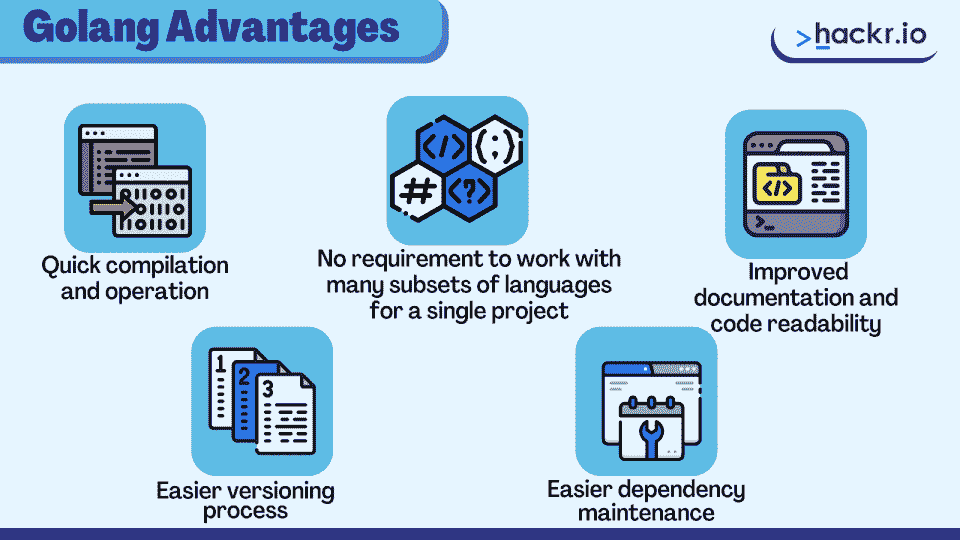
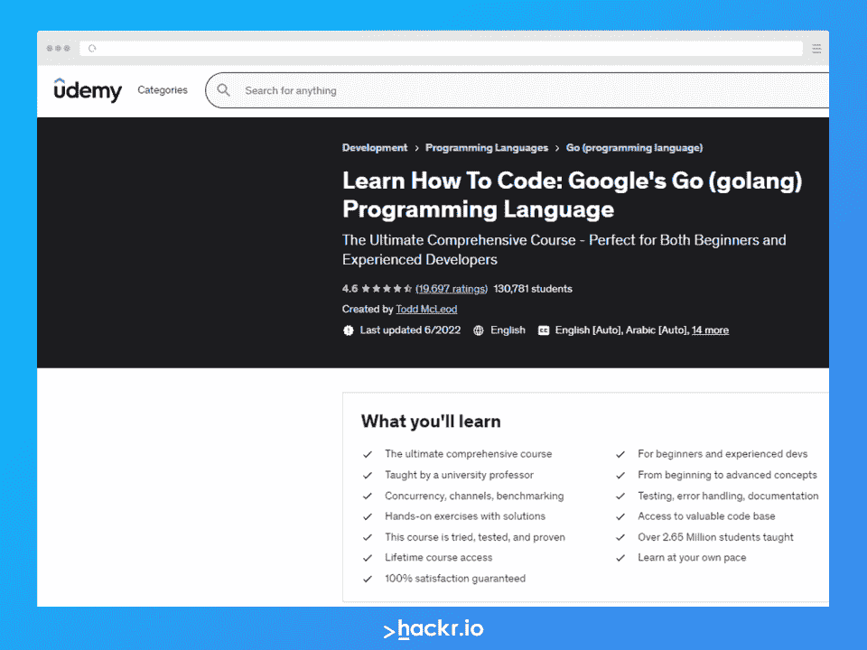
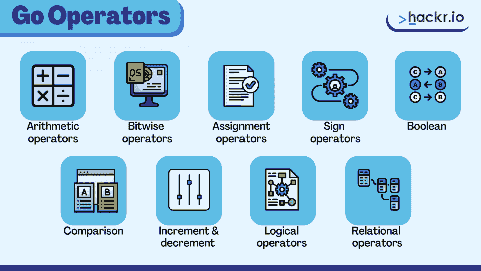

# 2023 年 50 大 Golang 面试问答[更新]

> 原文：<https://hackr.io/blog/golang-interview-questions-and-answers>

Golang 是 Google 创建的一种开源编程语言。由于这种语言的并发性、安全性和用户友好性，它变得非常出名。这是一种相对较新的编程语言，开发人员在使用现有的[编程语言](https://hackr.io/blog/best-programming-languages-to-learn)时感到沮丧，于是设计了这种语言。

这种语言被设计得简单而高效，具有更快的编译时间来加速应用程序的开发。许多科技巨头，如谷歌、优步和苹果，都喜欢 Golang，因为它的开发速度更快、易于学习、运行时间更长、垃圾收集等等。

随着公司利用 Golang，对具有 Golang 知识的程序员的需求持续增长。底线？学习 Golang 会带来很多就业机会。

如果你打算从事 Golang 开发者的职业，你需要为面试做好充分的准备。这就是为什么我们策划了这个广泛的 Golang 面试问题列表！

我们将为初学者和有经验的开发人员提供多达 50 个 Go 语言面试问题。Golang 编程工作触手可及。所以继续阅读，让你离职业目标更近一步，并在面试中胜出！

## **Golang 面向初学者和经验丰富的开发人员的面试问题**

你可能会注意到从初级到高级的招聘广告。不用担心；我们在 Golang 上为您提供了基本和高级面试问题。

### **基础围棋面试问答**

#### **1。Golang 是什么？**

Golang 是一种开源的通用编程语言，由 Google 开发。它因其一流的并发性、安全性和用户友好性而成为一种流行的语言。Golang 融合了 Python 的速度和 C++的卓越性能以及健壮的安全特性。

Golang 的主要优点包括开发速度快、安全性高和高度模块化。开发人员用它来创建基础设施软件，如 Docker、Kubernetes、web 服务器、代理、存储引擎、消息代理等等。

#### **2。为什么要学 Golang？Golang 相对于其他编程语言有什么好处？**

Go 提供了处理服务器端交互的最佳方式。 [Node](https://hackr.io/blog/node-js-interview-questions) 速度很快，但是因为只使用了一个线程，所以无法处理 Golang 这样要求苛刻的作业。



以下是 Golang 的更多优势:

*   快速编译和操作

*   不需要在一个项目中使用许多语言子集

*   改进的文档和代码可读性

*   更简单的版本控制流程

*   更简单的依赖性维护

#### **3。Golang 为什么靠谱？**

Golang 是可靠的，因为它是类型安全的，使得程序更难崩溃。此外，不可能曲解 Golang 上的任何类型。

#### **4。什么是 Golang 包？**

Golang 包是一个类似文件夹的文件组织，包含所有 Go 内容。在代码库中，包通常是目录，但也是包含代码的文件夹。外部包可以访问导出的结构、函数和变量，但不能访问未导出的实体。

一个包可以包含零个或多个结构、函数或变量。事实上，一个包可以被包含来执行它自己的单元功能。

Go 包非常类似于单个 Java 类，除了它可以分布在 Go 中的多个文件中。此外，每个可执行的 Go 项目或模块都包含一个名为 main 的包，其中有一个函数充当可执行版本的入口点。

#### **5。Golang 会考虑“案例”吗？**

Go 是唯一一种真正将标识符的大小写合并到其基本语法中并且区分大小写的语言。对象的类型、方法等。如果其名称以大写字母开头，则是“导出的”(对其他包可见)，但如果其名称以小写字母开头，则不是。

#### **6。Golang 里有哪些指针？**

指针是一种传递对象的高效内存方法。当把对象给函数或者把它们赋给变量时，Go 通常会复制它发送给函数的对象。

#### **7。Golang goroutine 是什么意思？**

goroutine 是 go 编程语言中任何持续运行的活动的名称。这是一个独特的函数或方法，可以与任何现有的 goroutines 同时独立运行。

**推荐围棋郎课程**

[](https://click.linksynergy.com/deeplink?id=jU79Zysihs4&mid=39197&murl=https://www.udemy.com/learn-how-to-code/)

#### **8。描述 Go 中的工作区。**

Go 代码必须保留一个工作空间。工作空间层次的根有三个目录:

*   " Src:" Go 源文件被排列成包
*   “包装:”包括包装项目
*   “Bin:”包括执行指令

#### **9。什么是字符串文字？**

字符串文字是通过连接一组字符创建的常量表示。

这两种类型是:

*   **原始字符串文字**:用反引号(')括起来的字符序列。字符串文字值是由未被引号分隔的字符组成的字符串。

*   **翻译后的字符串文字**:用双引号(")括起来。文本的值是用双引号括起来的文本，可以有也可以没有换行符。

#### 10。GOPATH 环境变量是什么意思？

GOPATH 环境变量决定了工作区的位置。编写 Go 代码时，只需要设置这一个环境变量。

#### **11。GoLang 中的字符串是什么？**

Golang 字符串是具有不同长度的字符序列，其中每个字符使用 UTF-8 编码被编码为一个或多个字节。字符串是由任意数量的字节组成的不可变链，包括那些值为 0 的字节。您也可以将它们视为只读的字节片，它们的字节可以使用 UTF-8 编码以 Unicode 文本表示。

在许多语言中，如 Java 和 Python，字符串是不可变的。对于像数字和字符串这样的非复合“数据”类型，不可变性是有利的，因为它确保其他程序的副作用不会改变变量的内容。

此外，在 Go 编程语言中，字符串和数字可以作为映射中的键，字符串的内容决定了字符串的相等性。

#### **12。什么是 Go 变量的静态类型声明？**

静态类型声明帮助编译器在只有一个变量的概念下继续它们的功能，即使它缺少变量信息。变量声明只在编译时有意义；当程序被链接时，编译器需要一个实际的变量声明。

#### 13。为什么要开发 Go 语言？

Go 是由于对其他系统的编程语言的速度不满而开发的。

Golang 的目标是:

*   动态类型化和解释

*   有效、安全、静态类型化

*   具备网络和多核计算支持

#### **14。什么是 Go 接口？**

Go 接口有一组预先确定的方法签名。这些方法是以一种特殊的类型实现的，能够接受值。我们不能创建接口的实例，因为它们是抽象的。但是，我们可以构造一个 interface 类型的变量，然后用接口的方法将该变量赋给一个具体的值。

您可以使用接口实现动态绑定或多态。接口类中定义了一组方法。这些属性必须包含在实现该接口的具体类中。

当构建一个大型系统或库时，接口会带来价值。对接口而不是类的引用减少了将来的修改，因为接口引用的用户不需要关心底层具体实现的变化。

#### 15。Golang 中的渠道是如何使用的，什么是 Go 渠道？

go 通道允许 goroutines 交换和传输数据值。一个通道允许传输相同类型的数据。信道的数据流是双向的，因此 goroutines 可以在同一个信道上发送和接收数据。

#### 16。围棋中的变函数是什么？

可变函数接受不同数量的参数。Golang 允许与函数签名中列出的相同类型的可变数量的参数。

#### **17。围棋中的常量变量是什么？**

常量变量被赋予一个确定的值，但不能被重新赋予另一个值。

#### 18。Go 中有哪些不同类型的运算符？

****

Golang 支持以下运算符:

*   算术运算符
*   按位运算符
*   赋值运算符
*   符号运算符
*   布尔代数学体系的
*   比较
*   增量和减量
*   逻辑运算符
*   关系运算符

#### **19。区分常量关键字和只读关键字。**

**常数**:

*   这些变量在编译时计算
*   它们只适用于值类型

**只读**:

*   这些变量在运行时计算
*   它们可以保存引用类型变量

#### 20。围棋中的垃圾收集是什么？

垃圾收集回收动态分配给程序的存储空间，供其他对象使用。该术语通常是指垃圾收集器为例行存储进行的自动再生，而不是释放特定内存块的显式代码(由程序员编写)。

当空闲 RAM 的数量低于预定水平时，或者在预定数量的分配之后，通常会启动自动垃圾收集。术语“垃圾收集”是指删除软件不再需要的项目，以便在内存中为其他动态对象腾出空间。

#### **21。什么是堆内存？**

我们将动态创建的对象和变量存储在堆内存中。当我们不再需要某个条目时，我们会频繁地清除它在堆上用完的内存。

#### **22。Go 中的数据类型有哪些？**

以下是 Go 可用的数据类型:

*   数字、字符串和布尔值
*   参考类型切片、指针、地图、通道和函数
*   接口类型
*   聚合类型结构和数组

#### **23。在 Go 中一行声明多个变量。**

在 Go 中，可以在一行中声明多个变量:

```
var x, y, z = 1, 2, 3
```

**24。写一个程序来删除字符串中的非字母数字字符。**

```
package main
 import (
    "fmt"
    "regexp"
)

var nonAlphanumericRegex = regexp.MustCompile(`[^a-zA-Z0-9 ]+`)

func clearString(str string) string {
    return nonAlphanumericRegex.ReplaceAllString(str, "")
}

func main() {
    str := "abcd$123*"
    fmt.Println(clearString(str))
}
```

**输出**

```
abcd123
```

**25。围棋中的切片是什么？**

切片是一种至关重要的 Go 数据类型，它为序列提供了比数组更有效的接口。与数组不同，切片仅基于其包含的元素(而不是元素的数量)进行类型化。使用内置的“make”关键字生成一个长度不为零的空切片。

#### **26。在 Go 的控制台上写一段简单的文字。**

```
package main

import "fmt"

func main()

{

fmt.println("Hello World")

}
```

**27。围棋中的结构是什么？**

结构是用户定义的数据类型，允许您保存不同类型的元素。我们将结构中的每个元素称为一个成员。所有结构成员总是公共的。

```
type person struct {
    name string
    age  int
    height int
}
```

**28。围棋中的计时器和跑马灯是什么？**

计时器代表单一的未来事件。他们计划一次性的未来行动。报价机定期安排重复动作。

#### **29。什么是正则表达式？**

[Regex](https://hackr.io/tutorials/learn-regular-expressions-regex) 是正则表达式的缩写。它提供了关于如何格式化文本搜索模式的说明。

“abc？”将与“abcd”、“abce”、“abcf”或任何其他以“abc”开头的四字母组合兼容

对于我们的用例，我们可以使用更多的规则，特别是那些处理字符组、字符串位置等的规则。所有计算机语言的正则表达式语法实际上都是一样的。

#### 三十岁。Golang 中的 goto 语句是什么？

在 Golang 中，goto 语句用作跳转语句。Goto 习惯于把程序控制权交给一个预定的标签。它可以用于针对特定条件重复程序代码的某一部分，甚至跳过代码的某一部分，跳到所需的语句上。

#### 31。什么是设计模式？

设计模式是可重用的代码片段，您可以重复使用它们来解决常见的软件问题。如果您采用设计模式，您的项目将产生更加模块化、可伸缩和优化的软件。设计模式帮助你扩展你的应用程序并与团队合作。工厂方法、Singleton、Facade 和 Decorator 是常见的设计模式示例。

#### 32。switch 语句是什么？

使用 switch 语句，可以将变量值与一系列潜在值进行比较。每个开关情况决定变量是否打开，每个值称为一个情况。控制权从 switch 语句转移到其主体中的语句。

#### 33。Go 支持自动类型转换吗？

不，自动类型转换在 Go 中不存在。相反，一种类型的变量必须通过*显式*类型转换指定为另一种类型。

#### 34。变量的范围是什么？

变量的作用域是您可以访问该特定变量的地方。Go 编程语言中的每个变量都是静态范围的，这意味着它决定了在编译过程中的用途。

#### 35。解释 Golang 中方法和函数的区别。

Go 函数和 Go 方法的主要区别在于 Golang 方法有接收方参数。有了接收方参数的参与，过程可以获得接收方的属性。

### **面向有经验开发人员的高级 Golang 面试问题**

#### 36。Golang 内置的支架有哪些？

以下是 Golang 的内置支持:

*   Web 服务器:http/net
*   容器:堆/容器列表/容器
*   加密:加密 md5/加密
*   数据库:SQL/数据库
*   压缩:gzip/compress

#### 37。为什么我们在 Golang 中使用 break 语句？

break 语句终止 for 循环或 switch 语句，立即将控制权转移给下一条语句。

#### 38。为什么我们在 Golang 中使用 continue 语句？

我们可以使用 continue 语句在循环中重新运行迭代。该语句跳过循环的其余部分，从下一次迭代开始执行。

#### 39。在 Golang 你们是如何进行测试的？

Golang 的包测试支持自动化测试。“go test”命令自动执行任何形式的函数。该命令应与该工具结合使用。

#### 40。可以比较围棋中的两个结构吗？

是的，我们可以在 Go 中使用一个简单的' == '操作符来比较两个结构。

#### 41。Golang 中的 select 语句是什么？

Go 中的 switch 语句和 select 语句非常相似。但是，case 语句在 select 语句中指示通道上的任何进度。

#### **42。Golang 是谁开发的？**

罗伯特·格里斯默、罗布·派克和肯·汤普森创作了 Golang，并于 2009 年 11 月 10 日发布。

#### **43。Golang 支持继承吗？**

[面向对象编程](https://hackr.io/blog/oops-concepts-in-java-with-examples#:~:text=Pascal%2C%20and%20Java.-,Definition%20of%20OOPS%20Concepts%20in%20Java,of%20such%20modules%20on%20demand.%E2%80%9D)的一个关键思想是继承，指的是将超类的属性传递给基类。由于 Golang 不支持类，所以继承是通过结构嵌入来实现的。因为我们不能直接扩展结构，所以我们必须使用组合的思想，通过结构来创建新的对象。

#### **44。围棋存在例外吗？**

不，围棋里不存在例外。Golang 中的错误报告很简单，不需要重载返回值来进行简单的错误管理。在 Go 中，错误值表示异常情况。

#### **45。Go 是否存在可选参数？**

Go 不支持可选参数或方法重载。

#### **46。Golang 的符文是什么？**

符文是 int32 的内置类型别名(不是字符串)。它是 Unicode 码点表示。一个符文可以代表任何代码点，不管它出现了多少个位置。

#### **47。什么是函数的闭包？**

函数闭包是 Golang 中的匿名函数。

#### **48。CGo 在 Golang 看起来怎么样？**

cGo 生成 Go 和 C 文件，您可以将它们从具有特殊功能的 Go 源文件组合成一个独特的 Go 包。C 是指一个“伪包”，一个由 cGo 建立的独特名称，作为对 C 的名称空间的引用。

#### 49。围棋中的‘左值’和‘右值’是什么？

“左值”表达式代表内存位置。您可以在赋值操作符的右边或左边找到它们。

“右值”描述了保存在内存中某个地址的数据值。没办法估价。因此，术语“右值”总是显示在赋值运算符的右侧。

#### 50。Golang 快吗？

Golang 是一种快速编程语言，这得益于它的并发模型和简单的语法。Golang 编译也很快，将所有需要的库连接成一个二进制文件，以减少对服务器的需求。

## **奖励提示**

这些面试问题是为即将到来的面试做准备的绝佳方式。这里有一些更有用的建议来补充你的学习:

*   创建一个详细的学习计划来掌握所有的 Golang 概念。
*   自己实践 Golang 概念。
*   和一个朋友练习 Golang 面试问题。
*   努力改善你解决特定问题的思维过程。
*   准备好技术和行为两方面的 Golang 面试问题。

## **结论**

Golang 是为了加速软件开发过程和提高代码质量而创建的。难怪在今天的市场上，这种技能如此抢手——它甚至要求有竞争力的薪水。

**[下载我们的 Golang 面试问题 PDF，这样你就可以离线练习了。](https://drive.google.com/file/d/1C4OG_fc7lciwaSWF1GLoANvKXL-3o24R/view?usp=sharing)**

有兴趣准备其他编程面试吗？

**[查看 100+ Java 面试题](https://hackr.io/blog/java-interview-questions)**

## **常见问题解答**

#### **1。谁创造了 Golang？**

罗伯特·格里斯默、罗布·派克和肯·汤普森在谷歌开发了 Golang。该语言于 2009 年 11 月 10 日发布。

#### **2。为什么 Go 经常被称为后 OOP 语言？**

Golang 是一种后 OOP 编程语言，它从 Algol/Pascal/Modula 语言家族(包、类型、函数)中提取结构线索。尽管如此，面向对象的原则仍然有助于 Go 提供一个清晰易懂的程序结构。

#### **3。编码面试可以用 Golang 吗？**

Golang 被当今企业用于面试的大多数代码共享工具所支持。Leetcode 和其他竞争对手的编码网站也为 Go 提供支持。大多数雇主会让你用自己选择的语言编写代码，除非你申请的是需要精通某种特定语言的高级或中高级职位。

如果你觉得 Go 是最容易写的语言，就用 Go。

#### **4。Golang 是面向对象的吗？**

Golang 也不是函数式的或面向对象的。这些编程范例彼此并不冲突。Golang 是一种类似于 c 的过程化和命令式语言。

**人也在读:**