# 下载谷歌呆子小抄 PDF 快速参考

> 原文：<https://hackr.io/blog/google-dorks-cheat-sheet>

想知道如何找到谷歌搜索引擎结果中没有显示的信息吗？

许多搜索引擎使用一种算法对可能危害用户安全的信息进行分类。但总有后门可以绕过算法——在谷歌的例子中，就是谷歌多金。

Google Dorks 是一个搜索字符串，它利用高级搜索运算符来查找特定网站上不容易找到的信息。

如果你面临一个类似的问题，找不到想要的信息，想使用 Google Dorking，这个备忘单就是为你准备的。我们策划了这个 Google Dorks 备忘单来帮助你理解不同的 Google Dorking 命令是如何工作的。

**[点击这里](https://drive.google.com/file/d/1EdbKbdP3Tfkj1zBQ4NICLwnvzcM-bX9g/view?usp=sharing)** 下载 Hackr.io 的 Google Dorks 小抄 PDF。

## **谷歌呆子小抄**

在这个 Google Dorking 备忘单中，我们将带您通过不同的命令来实现 Google Dorking。但首先，让我们简单介绍一下 Google Dorking。

### 什么是谷歌呆子？

道德壁垒保护着互联网上的重要信息。但是，有时候，访问这些信息是必要的，你需要跨越这个障碍。这就是 Google Dorking 的用武之地，它可以帮助你获取隐藏的信息。

Google Dorking，也称为 [Google hacking](https://en.wikipedia.org/wiki/Google_hacking) ，是一种能够通过提供使用高级搜索运算符的搜索字符串来返回难以通过简单搜索查询定位的信息的方法。

首先，有道德的黑客使用这种方法来查询搜索引擎并找到关键信息。这个谷歌黑客备忘单将帮助你执行谷歌多金命令和访问隐藏信息。

## **谷歌多金指令**

### **缓存命令**

缓存是加速页面搜索过程的元数据。谷歌在其缓存中存储了一些数据，比如网站的当前和以前版本。这个缓存保存了许多开发人员可以使用的有用信息。一些开发人员使用缓存来存储用于测试目的的信息，这些信息可以随着网站的新变化而改变。

您可以对任何随机网站使用以下语法来检查数据。根据 Google 的更新，结果可能会有所不同。

```
cache:website address
```

一旦您运行该命令，您可能会发现与此相关的多个结果。您还可以在我们的搜索结果中使用关键字，如“xyz”，如下面的查询所示。

```
cache:https://xyz.nu.edu.pk/Login XYZ
```

一旦您得到输出，您可以看到关键字将被突出显示。

### **文本和所有文本命令**

要从网页中查找特定文本，您可以通过两种方式使用 intext 命令。首先，您可以在结果中提供一个关键词。第二，可以寻找多个关键词。

可以对单个关键字使用以下语法。

```
*Intext:usernames*
```

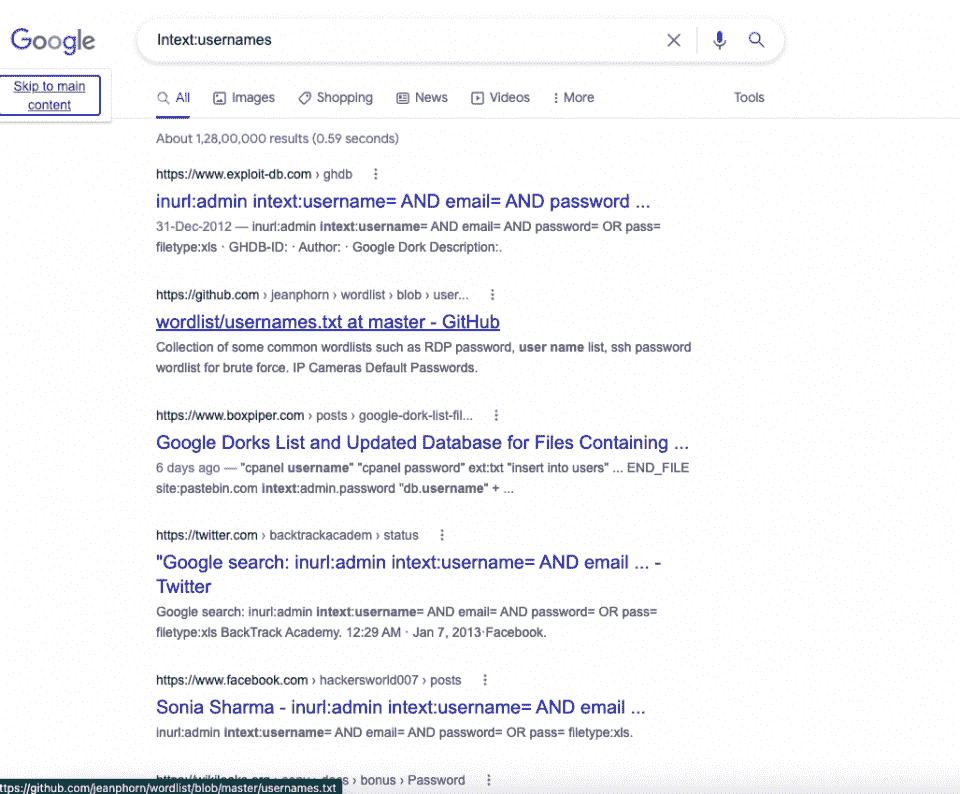

如果你想使用多个关键字，那么你可以使用 allintext。所有的关键字之间都用一个空格隔开。

谷歌将考虑所有的关键字，并在结果中提供所有的页面。因此，用户只能得到特定的结果。所以，确保你使用正确的关键字，否则你会错过重要的信息。

假设您想要查找带有关键字“username”和“password”的页面，您可以使用下面的查询。

```
*allintext:”username” “password”*
```

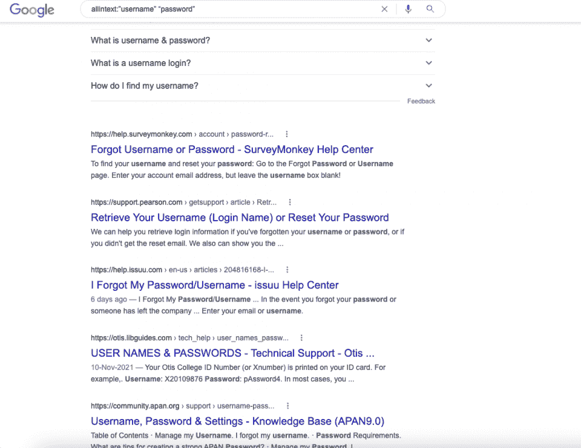

你会得到所有带有上述关键词的页面。

### **文件类型命令**

这是最重要的 Dorking 选项之一，因为它从几个文件中过滤出最重要的文件。例如，您可以应用过滤器来检索 PDF 文件。如果您是一名开发人员，您可以使用日志文件，通过应用正确的过滤器，让它们可以轻松地保持跟踪。

要访问简单的日志文件，请使用以下语法:

```
*filetype:log *
```


您将获得所有类型的日志文件，但您仍然需要从成千上万的日志中找到正确的一个。因此，要缩小文件搜索的范围，您可以使用以下语法更具体地指定文件的类型:

```
*allintext:username filetype:log*
```

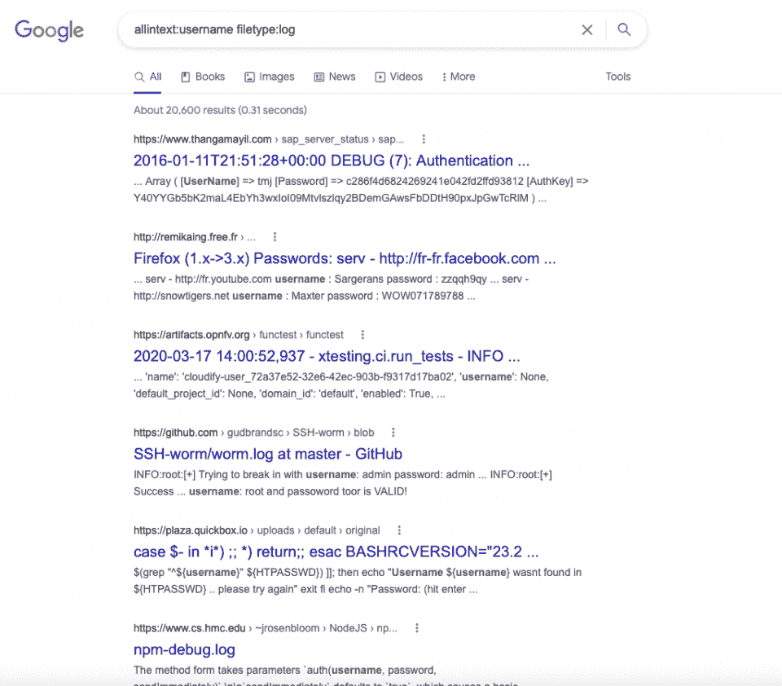

您将会得到其中提到的用户名的具体结果——您需要做的只是提供正确的关键字。

#### **标题命令**

有时，您希望根据 HTML 页面标题过滤掉文档。主要关键字存在于 HTML 页面的标题中，代表整个页面。所以，我们可以使用这个命令来查找所需的信息。

假设您正在查找包含 IP Camera 信息的文档。您必须编写一个查询，根据您选择的关键字过滤出页面。

您可以使用以下语法:

```
*intitle:”ip camera”*
```


您还可以在这个查询中使用多个关键字来获得更具体的结果，用双引号将每个关键字隔开。

首先，Google 将检索所有页面，然后对检索到的结果集应用过滤器。它将丢弃没有正确关键字的页面。

为此，您可以使用以下语法:

```
*allintitle:”ip camera” “dvr”*
```

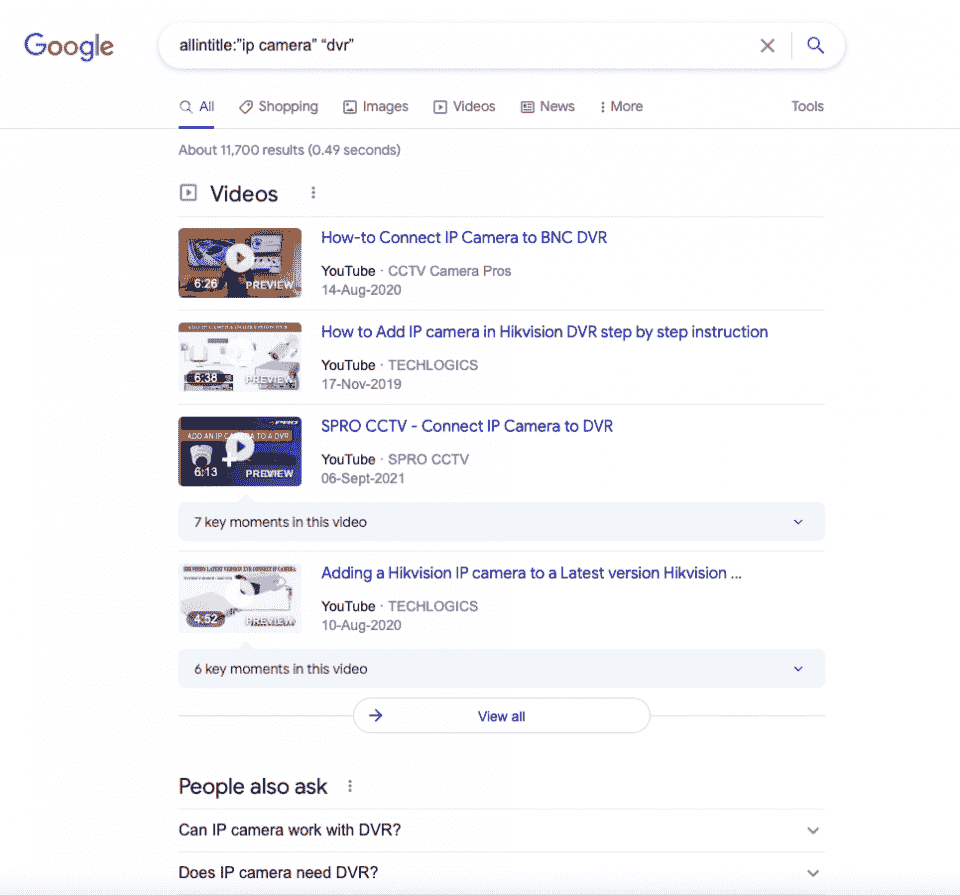

你可以看到所有包含这两个关键词的页面。

### **inurl 命令**

此命令的工作方式类似于 intitle 命令；但是，inurl 命令会根据 url 文本过滤掉文档。这些关键字可以在 HTML 页面上找到，URL 代表整个页面。您可以使用此命令过滤掉文档。

假设您想要包含 IP 摄像机相关信息的文档。您可以简单地使用下面的查询告诉 google，并根据该关键字过滤掉所有页面。您也可以提供多个关键字以获得更精确的结果。

语法:

```
*allinurl:tesla lambo*
```


### **现场命令**

站点命令将帮助您查找特定的实体。首先，你可以尝试关键词，这些关键词会给你提供广泛的信息，这些信息可能符合你的需要，也可能不符合。然后，您可以使用具有特定过滤器的其他命令来缩小搜索范围。

假设你想买一辆车，并从 2023 年开始寻找各种选择。你会看到一长串选项。现在，你可以应用一些关键词来缩小搜索范围，收集有助于你买车的具体信息。在这里，您可以使用 site 命令只搜索特定的网站。

例如:

地点:[https://global.honda/](https://global.honda/)


你也可以对其他汽车做同样的事情。

### **外部命令**

如果要搜索特定类型的文档，可以使用 ext 命令。

假设你想写一篇关于某个特定主题的文章，但是你不能不研究这个主题就马上开始。大多数研究文章都是 PDF 格式的。您可以在 dork 命令中指定文件的类型。

这里，ext 代表分机。该命令的工作方式类似于 filetype 命令。现在使用 ext 命令，您可以将搜索范围缩小到 pdf 文件。

您可以使用以下语法:

```
site:https://www.ford.com/ ext:pdf
```


### **条目标题**

当您想要在博客中搜索某个术语时，可以使用此命令。它对博客搜索很有用。

例如:

```
*inposttitle:weight loss goals*
```


### **所有标题**

假设你开了一个博客，想研究你所在领域的其他博客。这个命令将帮助你寻找其他类似的高质量博客。

例如:

```
allintitle:how to write content for seo
```


### **所有锚**

您可以使用此命令对链接回页面的锚文本中所有术语都在“金融锚”之后的页面进行研究。

例如:

```
*allinanchor:"how to draw anime"*
```

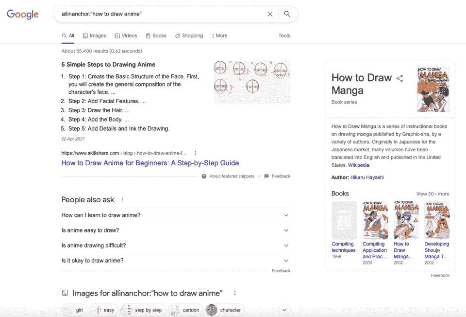

### **金融家**

您可以使用此命令查找带有包含指定锚文本的入站链接的页面。

例如:

```
*inanchor:"digital painting"*
```

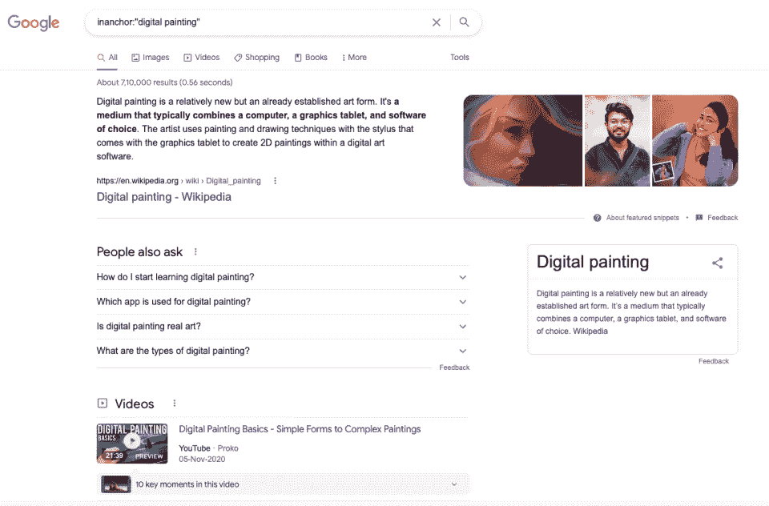

### **左右**

寻找超窄的结果？此命令将为您提供页面上出现两个或更多术语的结果。

例如:

```
*digital drawing AROUND(2) tools*
```


### **@命令**

如果您希望您的搜索只针对社交媒体，请使用此命令。它将只在指定的社交媒体平台上显示您的搜索结果。

例如:

```
*mangoes @facebook*
```


### **行情**

如果您在短语周围使用引号，您将能够搜索准确的短语。搜索引擎结果将消除不必要的网页。

例如:

"搜索词 1 "

在某些情况下，您可能需要多个网站具有相似内容的特定数据。您可以使用这个 Google Dorking 命令提供确切的域名:

```
“Related:domainname.com”
```

### **信息**

您可以使用此命令查找与特定域名相关的信息。它可以让你决定一些事情，比如带有域名文本的页面，相似的站内页面，以及网站的缓存。

例如:

```
"Info:domainname.com"
```

### **天气**

对气象学很好奇？使用此命令获取气象翼设备传输。

```
intitle:"Weather Wing WS-2"
```

您将看到全球范围内连接的几个设备共享天气详细信息，如风向、温度、湿度等。


### **缩放视频**

寻找特定的缩放会议？您可以使用此命令找到它，但请记住，Zoom 已经设置了一些限制，使其更难找到/中断 Zoom 会议。但是，只要一个 URL 被共享，你仍然可以找到一个缩放会议。

唯一的缺点是谷歌索引网站的速度。当一个站点被编入索引时，缩放会议可能已经结束了。

```
*inurl:zoom.us/j and intext:scheduled for*
```

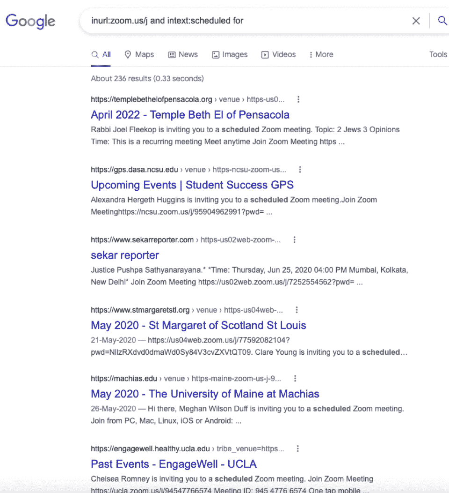

### **SQL 转储**

如果配置不当，您的数据库就会暴露无遗。您还可以在可通过域访问的服务器上找到这些 SQL 转储。有时，如果在 web 服务器上存储备份时没有适当的备份机制，站点上会出现这种与数据库相关的转储。要查找压缩的 SQL 文件，请使用以下命令。

```
*"index of" "database.sql.zip"*
```

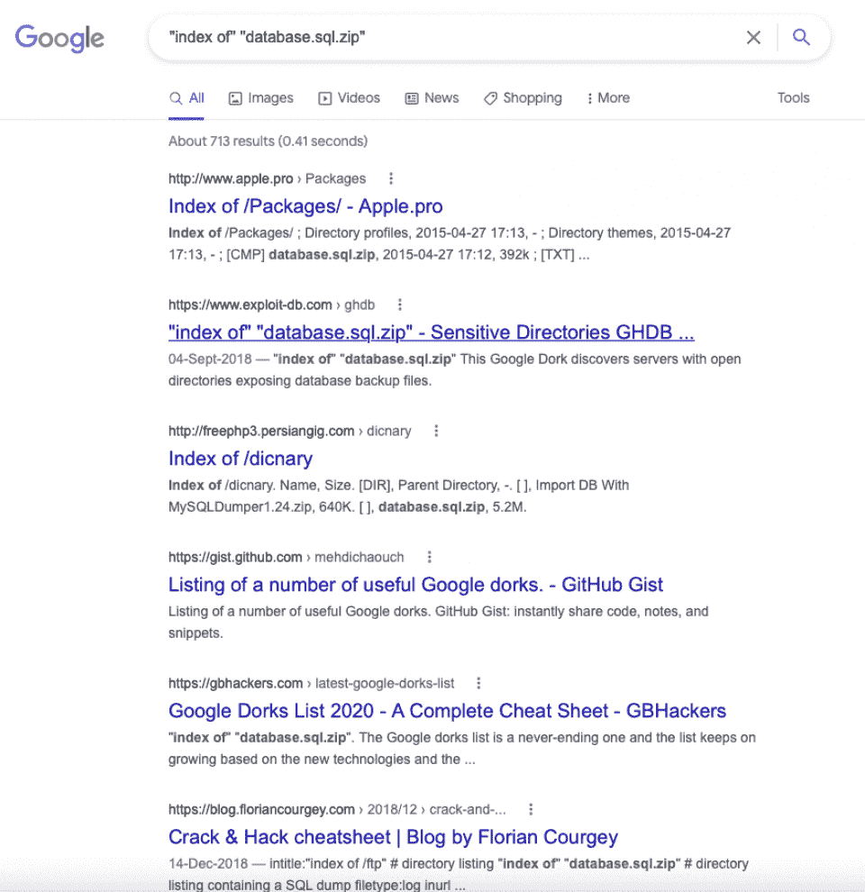

### WordPress Admin

你可以很容易地使用 dork 找到 WordPress 管理登录页面，如下所示。

```
*intitle:"Index of" wp-admin*
```

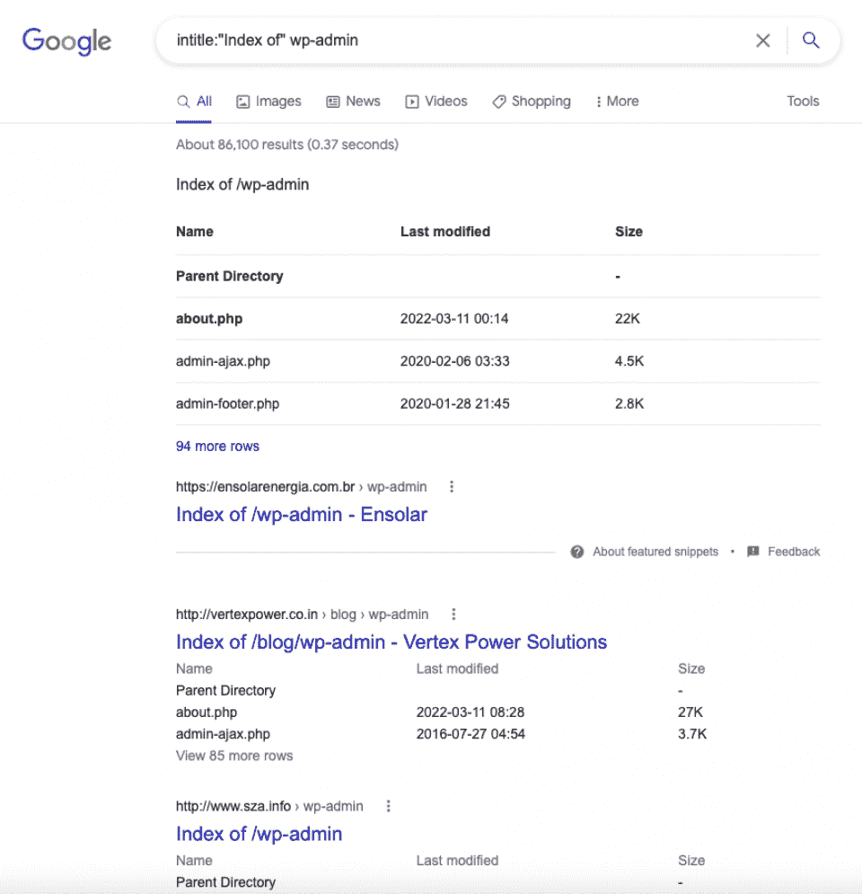

### **阿帕奇 2**

您可以使用以下 Google Dorking 命令找到 Apache2 网页:

```
*intitle:"Apache2 Ubuntu Default Page: It works"*
```


### **phpMyAdmin**

这个工具是危害数据的另一种方法，因为 phpMyAdmin 用于通过 web 管理 MySQL。要使用的谷歌呆子是:

```
*"Index of" inurl:phpmyadmin*
```


### **JIRA/Kibana**

您可以使用 Google Dorks 来查找托管重要企业数据的 web 应用程序(通过 JIRA 或 Kibana)。

```
*inurl:Dashboard.jspa intext:"Atlassian Jira Project Management Software"*
```


```
*inurl:app/kibana intext:Loading Kibana*
```

#### **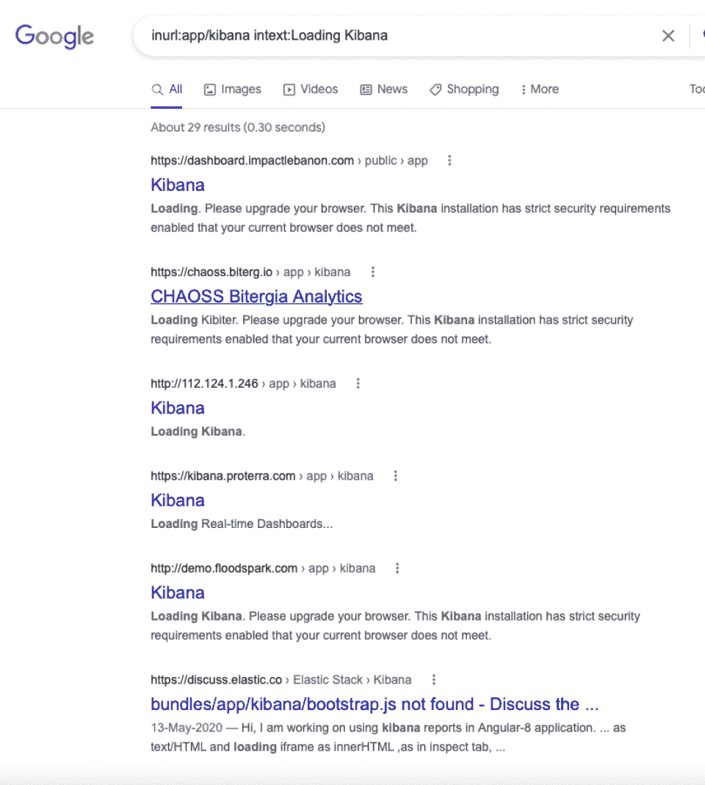**

### **cPanel 密码重置**

您可以重置 cPanel 的密码来控制它:

```
*inurl:_cpanel/forgotpwd*
```

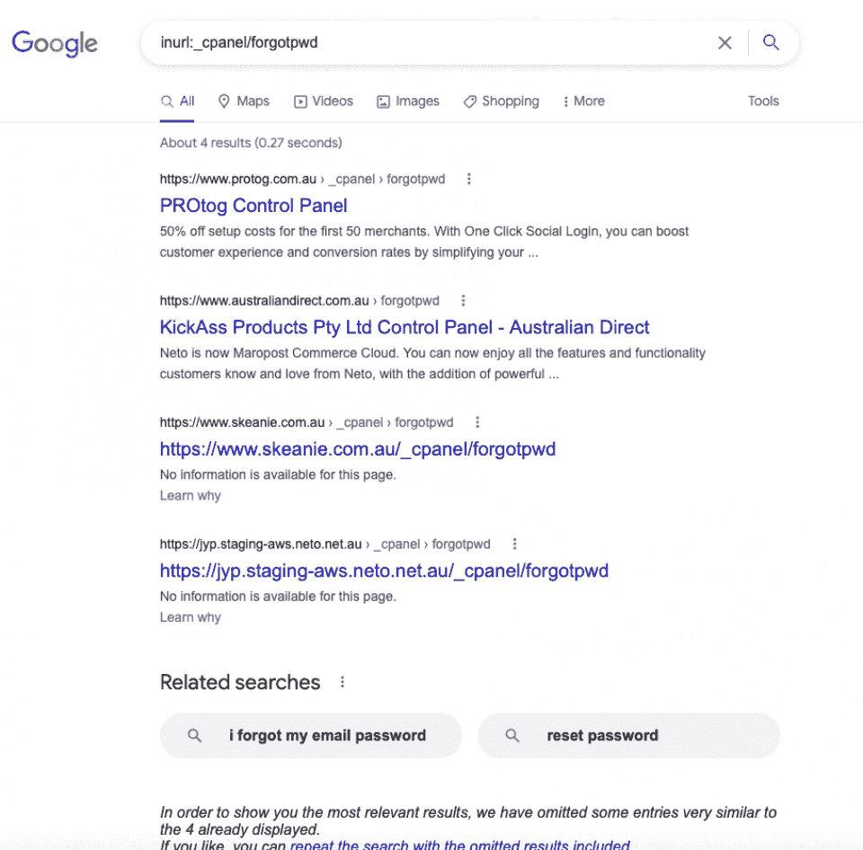

### **寻找 FTP 服务器**

如果您想要访问 FTP 服务器，您可能需要混合查询来获得想要的输出。您可以使用以下语法:

```
*intitle:”index of” inurl:ftp*
```

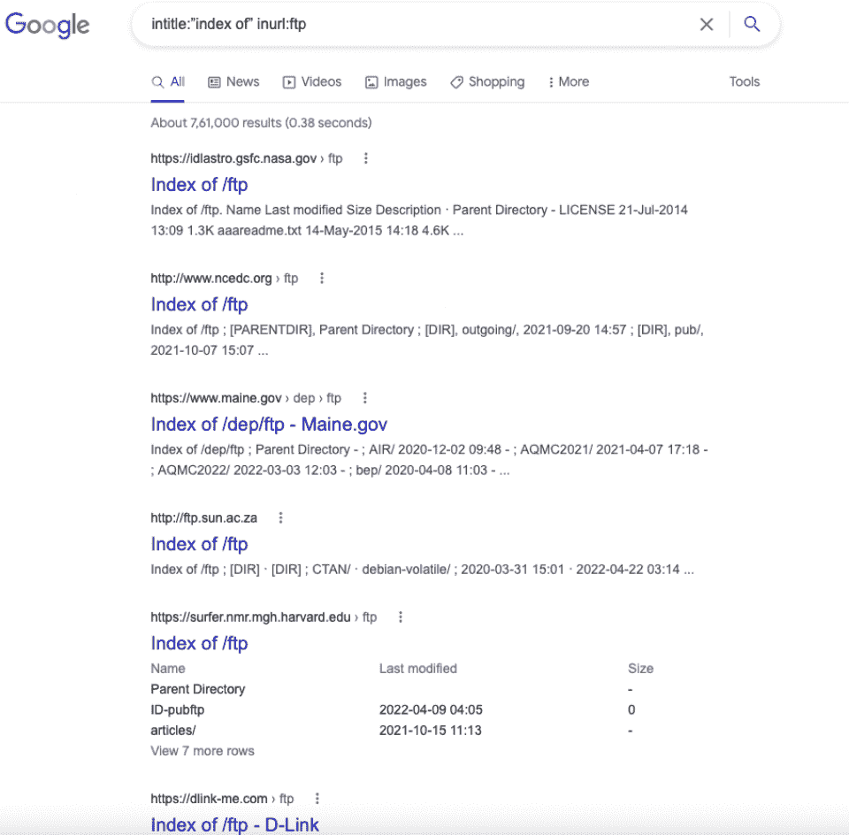

因此，您将获得与 FTP 服务器相关的所有索引页面并显示目录。

得到结果后，您可以查看不同的可用 URL 以获取更多信息，如下所示。

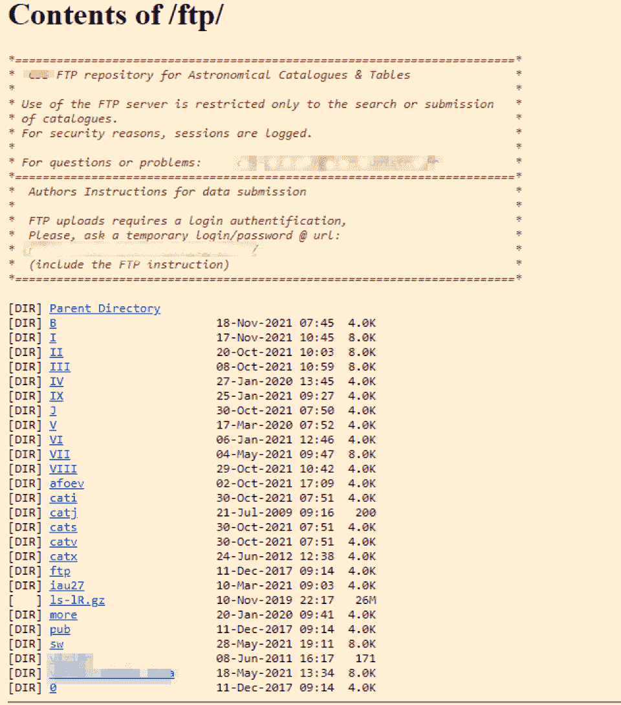


### **访问在线摄像头**

请记住，信息访问有时仅限于网络安全团队，尽管我们演练了这个谷歌呆子小抄。您可以使用 dork 命令来访问摄像机的记录。有些人将这些信息公之于众，这会危及他们的安全。

[GCP 协理云工程师-谷歌云认证](https://click.linksynergy.com/link?id=jU79Zysihs4&offerid=1045023.3827154&type=2&murl=https%3A%2F%2Fwww.udemy.com%2Fcourse%2Fgoogle-cloud-certification-associate-cloud-engineer%2F)

以下是访问摄像机详细信息的语法。

```
*Intitle:”webcamXP 5”’*
```

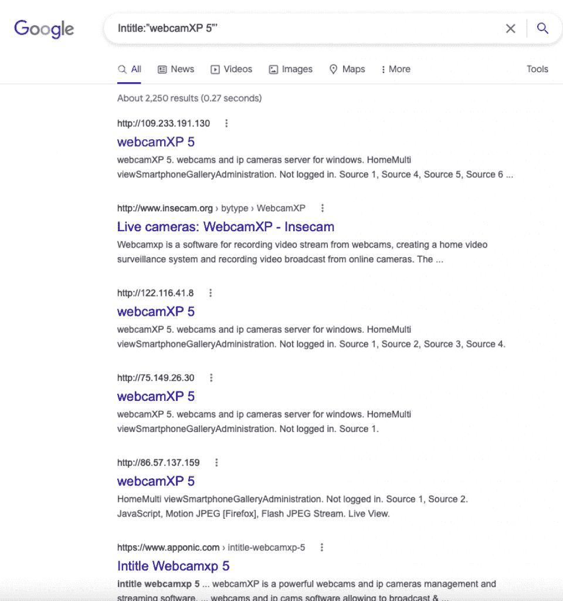

## **操作员**

要缩小和过滤结果，您可以使用运算符进行更好的搜索。以下是一些您可能会感兴趣的运算符。

### **搜索词**

您可以使用此运算符使您的搜索更加具体，这样关键字就不会与其他内容混淆。例如，如果您专门寻找“意大利食品”，那么您可以使用以下语法。

```
“Italian foods”
```

### **或**

使用该运算符，您可以提供多个关键字。如果网页包含这些关键字中的任何一个，您就会得到结果。您可以使用“|”分隔关键字比如说。

```
site:facebook.com | site:twitter.com
```

#### **和**

该操作符将包含包含所有关键字的所有页面。关键字由“&”符号分隔。您可以使用以下语法。

```
site:facebook.com & site:twitter.com
```

### 运算子组合

不仅如此，您还可以结合使用“or”和“and”运算符来优化过滤器。比如说-

```
(site:facebook.com | site:twitter.com) & intext:"login"

(site:facebook.com | site:twitter.com) (intext:"login")
```

### **包含结果**

根据提供的关键字的出现次数获得结果。比如说-

```
-site:facebook.com +site:facebook.*
```

### **排除结果**

您也可以从网页中排除结果。比如说-

```
site:facebook.* -site:facebook.com
```

### **同义字**

如果您想要搜索所提供的关键字的同义词，那么您可以在该关键字前使用“~”符号。然后，谷歌会给你提供合适的结果。例如，如果您想要搜索关键字“set”及其同义词，如配置、收集、更改等。，您可以使用以下内容:

```
~set
```

### **球形图案**

当您不确定那里有什么时，可以使用 glob 模式(*)，并告诉 Google 进行相应的搜索。比如“

```
site:*.com
```

## **搜索参数**

以下是各种搜索参数:

*   **q-** 它的值就是搜索项。
*   **过滤器** -其值可以是 1 或 0。如果其值设置为 0，它将显示所有潜在的重复结果。
*   **as_epq-** 它的值可以是搜索短语。你可以用它来搜索一个精确的短语。没有必要将搜索短语用引号括起来。
*   **as_ft-** 其值可以排除(e)也可以包含(I)。
*   **as_filetype-** 可以是文件扩展名。您可以包含或排除由 as_ft 指示的文件类型。
*   **as_occt-** 它的值可以是- any(任意位置)、title(页面标题)、body(页面文本)、url(页面 url)、links(页面链接)。您可以在指定的位置找到关键字。
*   **as_dt-** 其值可以排除(e)也可以包含(I)。您可以使用它来排除或包含 as_sltesearch 指示的站点或域。
*   **as_sltesearch-** 其值可以是站点或域。您可以包含或排除由 as_dt 指示的文件类型。
*   **as_qdr-** 其值可以是 m3(三个月)、m6(六个月)、y(过去一年)。您可以搜索指定时间段内包含的页面。

## **如何防范谷歌呆瓜**

你可以使用以下任何方法来避免落入谷歌呆子的控制之下。以下是防止 Google dork 的措施:

*   您必须加密敏感的个人信息，如用户名、密码、支付细节等。
*   此外，通过运行查询来检查您的网站，以检查您是否有任何暴露的敏感数据。如果您发现任何暴露的信息，只需在谷歌搜索控制台的帮助下将它们从搜索结果中删除即可。

使用根级网站目录中的 robots.txt 文档保护敏感内容。它会阻止谷歌索引你的网站。

```
User-agent: * 

Disallow: / 
```

您还可以阻止特定目录从 web 爬网中排除。如果您有一个/admin 区域，并且需要保护它，只需将以下代码放入其中:

```
User-agent: * 

Disallow: /admin/ 
```

限制对特定文件的访问:

```
User-agent: * 

Disallow: /privatearea/file.html 
```

限制对包含“？”的动态 URL 的访问符号:

```
User-agent: * 

Disallow: /*? 
```

## **结论**

如今，Google Dorks 是查找难以获得的数据的最便捷方式之一。您必须找到正确的搜索词，并了解搜索引擎如何从大量数据中找出有价值的信息。尽管市场上有几种工具，但谷歌搜索运营商有自己的一席之地。

我们已经在这个 Google Dorks 备忘单中介绍了常用的命令和操作符，以帮助您执行 Google Dorking。这个 Google fu 小抄适合所有人，从初学者到有经验的专业人士。

下次你需要专门或特定的研究，参考这个方便的谷歌呆子小抄。有兴趣了解更多关于道德黑客的知识吗？

[](https://imp.i384100.net/x9DjoA)

## **常见问题解答**

#### **1。使用谷歌呆子合法吗？**

谷歌黑客或俗称谷歌多金。它是一种黑客技术，利用谷歌搜索和其他谷歌应用程序等技术，找到网站使用的配置和计算机代码中的漏洞。

然而，它是一种非法活动，导致网络恐怖主义和网络盗窃等活动。

#### **2。什么是谷歌黑客？**

这里有一些谷歌的技巧供你尝试:

*   使用“@”符号在社交媒体网站中搜索信息。为此，您需要提供社交媒体名称。例如，输入@google:username 在 google 中搜索用户名。
*   要获得与 hashtags 相关的信息，您需要在搜索词前使用#号。例如，输入#HelloDelhi。
*   要搜索未知单词，请使用星号(*)来替换一个或多个单词。比如大亚就要搬到*。
*   您可以使用关键字 map 和位置名称来检索基于地图的结果。例如，输入地图:德里。

#### **3。什么是谷歌呆子运营商？**

以下是谷歌呆子运营商:

*   缓存:提供任何网站的缓存版本，例如 cache:google.com
*   all text:获取特定网页中包含的特定文本，例如 all text:hacking tricks。
*   allinurl:提供包含所有指定字符的 url，例如:allinurl:pingpong
*   文件类型:要获取与文件扩展名相关的信息，例如，查找特定的 pdf 文件，请使用-电子邮件安全文件类型:pdf
*   intitle:将提供与标题中的关键字相关的信息，例如，intitle:dorking tools。
*   金融锚:提供任何链接上使用的准确锚文本的信息，例如金融锚:“黑客工具”
*   站点:显示所提到的域和子域的所有索引 URL，例如 site:dorking.com
*   +:连接单词，适用于检测具有多个特定键的页面，例如 dorking + tools

#### **4。Google Dorking 是如何工作的？**

Google Dorking 是一种搜索技术，使黑客能够获得企业和个人不打算公开的信息。利用这种技术，黑客能够识别易受攻击的系统，并能够恢复用户名、密码、电子邮件地址，甚至信用卡详细信息。

#### **5。你是怎么做到谷歌重力魔术的？**

按照以下步骤来做谷歌重力魔术:

*   打开电脑上的浏览器。
*   打开 Google.com。
*   键入 Google Gravity(不要点击搜索)。
*   点击我感到幸运。
*   等待谷歌重力页面加载。
*   移动鼠标光标。
*   你会看到一切都倒下了。

**人也在读:**